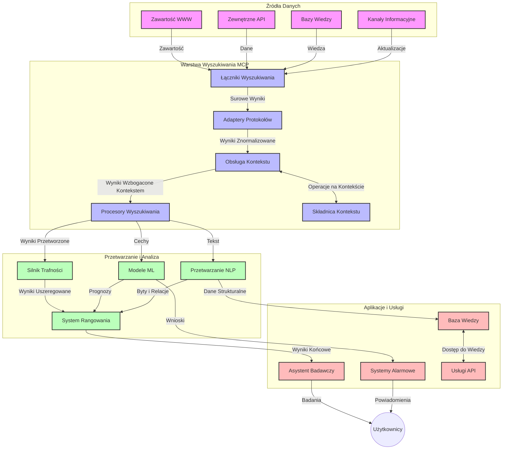
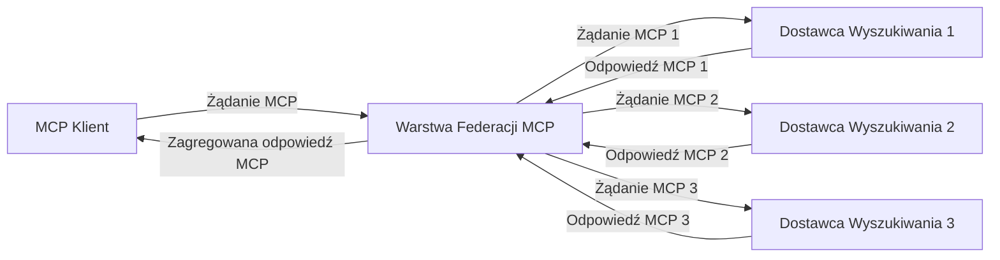
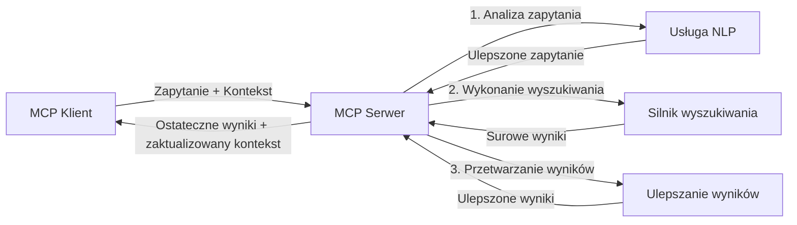

# Protokół Kontekstu Modelu dla Wyszukiwania w Sieci w Czasie Rzeczywistym

## Przegląd

Wyszukiwanie w sieci w czasie rzeczywistym stało się niezbędne w dzisiejszym środowisku opartym na informacjach, gdzie aplikacje potrzebują natychmiastowego dostępu do aktualnych informacji z całego internetu, aby dostarczać odpowiednie i terminowe odpowiedzi. Protokół Kontekstu Modelu (MCP) stanowi znaczący postęp w optymalizacji tych procesów wyszukiwania w czasie rzeczywistym, zwiększając efektywność wyszukiwania, zachowując integralność kontekstu i poprawiając ogólną wydajność systemu.

Ten moduł bada, jak MCP przekształca wyszukiwanie w sieci w czasie rzeczywistym, dostarczając ustandaryzowane podejście do zarządzania kontekstem między modelami AI, silnikami wyszukiwania i aplikacjami.

### Czego się nauczysz

W tym kompleksowym przewodniku odkryjesz:

- Jak MCP tworzy płynne połączenie między modelami AI a możliwościami wyszukiwania w sieci w czasie rzeczywistym
- Wzorce architektoniczne do implementacji efektywnych i skalowalnych rozwiązań wyszukiwania z MCP
- Techniki zachowywania kontekstu wyszukiwania w wielu zapytaniach i interakcjach
- Praktyczne implementacje kodu w Pythonie i JavaScript dla różnych scenariuszy wyszukiwania
- Metody równoważenia trafności, aktualności i wydajności w systemach wyszukiwania napędzanych MCP

## Wprowadzenie do wyszukiwania w sieci w czasie rzeczywistym

Wyszukiwanie w sieci w czasie rzeczywistym to podejście technologiczne, które umożliwia ciągłe zapytywanie, przetwarzanie i analizę informacji z sieci w momencie ich publikacji lub aktualizacji, pozwalając systemom dostarczać świeże i trafne informacje z minimalnym opóźnieniem. W odróżnieniu od tradycyjnych systemów wyszukiwania, które operują na indeksowanych danych mogących mieć kilka godzin lub dni, wyszukiwanie w czasie rzeczywistym przetwarza dane „na żywo” z sieci, dostarczając spostrzeżenia i informacje odzwierciedlające aktualny stan treści online.

### Podstawowe pojęcia wyszukiwania w sieci w czasie rzeczywistym:

- **Ciągłe przetwarzanie zapytań**: zapytania wyszukiwania są przetwarzane względem stale aktualizowanych źródeł danych
- **Priorytet aktualności**: systemy są zaprojektowane tak, aby priorytetowo traktować świeże informacje
- **Równoważenie trafności**: utrzymywanie równowagi między trafnością a aktualnością
- **Skalowalna architektura**: systemy muszą obsługiwać zmienne obciążenie zapytań i wolumeny danych
- **Zrozumienie kontekstowe**: utrzymywanie kontekstu użytkownika pomiędzy iteracjami wyszukiwania jest kluczowe dla znaczących rezultatów
- **Dynamiczna reformulacja zapytań**: adaptacyjne modyfikowanie zapytań w oparciu o kontekst i wcześniejsze wyniki
- **Integracja wielu źródeł**: łączenie wyników z różnych dostawców wyszukiwania i źródeł internetowych
- **Zrozumienie semantyczne**: przetwarzanie zapytań i treści na podstawie znaczenia, a nie tylko słów kluczowych
- **Ranking w czasie rzeczywistym**: ciągła regulacja pozycji wyników w miarę pojawiania się nowych informacji

### Protokół Kontekstu Modelu a wyszukiwanie w czasie rzeczywistym

Protokół Kontekstu Modelu (MCP) rozwiązuje kilka kluczowych wyzwań w środowiskach wyszukiwania w czasie rzeczywistym:

1. **Zachowanie kontekstu wyszukiwania**: MCP standaryzuje sposób utrzymywania kontekstu pomiędzy rozproszonymi komponentami wyszukiwania, zapewniając, że modele AI i węzły przetwarzające mają dostęp do odpowiedniej historii zapytań i preferencji użytkownika.

2. **Efektywne zarządzanie zapytaniami**: dzięki dostarczaniu ustrukturyzowanych mechanizmów transmisji kontekstu, MCP zmniejsza obciążenie powtarzania kontekstu w każdej iteracji wyszukiwania.

3. **Interoperacyjność**: MCP tworzy wspólny język do dzielenia się kontekstem między różnymi technologiami wyszukiwania i modelami AI, umożliwiając bardziej elastyczne i rozszerzalne architektury.

4. **Kontekst zoptymalizowany pod kątem wyszukiwania**: implementacje MCP mogą priorytetyzować, które elementy kontekstu są najbardziej istotne dla skutecznego wyszukiwania, optymalizując zarówno wydajność, jak i dokładność.

5. **Adaptacyjne przetwarzanie wyszukiwania**: dzięki właściwemu zarządzaniu kontekstem za pomocą MCP, systemy wyszukiwania mogą dynamicznie dostosowywać przetwarzanie w oparciu o zmieniające się potrzeby użytkowników i krajobrazy informacyjne.

We współczesnych aplikacjach, od agregatorów wiadomości po asystentów badawczych, integracja MCP z technologiami wyszukiwania w sieci umożliwia bardziej inteligentne, świadome kontekstu wyszukiwanie, które dostarcza coraz bardziej trafne wyniki w miarę kontynuacji interakcji użytkownika.

## Cele nauki

Pod koniec tej lekcji będziesz w stanie:

- Zrozumieć podstawy wyszukiwania w sieci w czasie rzeczywistym i jego wyzwania w nowoczesnych aplikacjach
- Wyjaśnić, jak Protokół Kontekstu Modelu (MCP) wzmacnia możliwości wyszukiwania w czasie rzeczywistym
- Wdrażać rozwiązania wyszukiwania oparte na MCP przy użyciu popularnych frameworków i interfejsów API
- Projektować i wdrażać skalowalne, wysokowydajne architektury wyszukiwania z MCP
- Stosować koncepcje MCP w różnych przypadkach użycia, włączając wyszukiwanie semantyczne, pomoc badawczą oraz przeglądanie wspomagane AI
- Ocenić pojawiające się trendy i przyszłe innowacje w technologiach wyszukiwania opartych na MCP
- Rozwijać systemy wyszukiwania świadome kontekstu, które uczą się na podstawie interakcji użytkownika
- Integrać możliwości wyszukiwania w sieci z asystentami AI przy użyciu ustandaryzowanych protokołów MCP
- Tworzyć wieloetapowe pipeline wyszukiwania, które stopniowo udoskonalają wyniki na podstawie kontekstu
- Optymalizować wydajność wyszukiwania przy jednoczesnym zachowaniu pełnej świadomości kontekstu

### Definicja i znaczenie

Wyszukiwanie w sieci w czasie rzeczywistym obejmuje ciągłe zapytywanie, pobieranie i dostarczanie informacji internetowych z minimalnym opóźnieniem. W przeciwieństwie do tradycyjnych wyszukiwarek, które okresowo indeksują i przeszukują sieć, wyszukiwanie w czasie rzeczywistym ma na celu udostępnianie informacji zaraz po ich pojawieniu się, umożliwiając natychmiastowy dostęp do najaktualniejszych treści.

Kluczowe cechy wyszukiwania w sieci w czasie rzeczywistym to:

- **Świeżość**: priorytetowanie najnowszych treści i aktualizacji
- **Ciągłe przetwarzanie**: stałe monitorowanie pojawiających się informacji
- **Adaptacja zapytań**: dopracowywanie zapytań wyszukiwania na podstawie kontekstu i informacji zwrotnej
- **Natychmiastowa dostawa**: dostarczanie wyników wyszukiwania z minimalnym opóźnieniem
- **Zachowanie kontekstu**: budowanie na podstawie wcześniejszych zapytań dla poprawy trafności

### Wyzwania w tradycyjnym wyszukiwaniu internetowym

Tradycyjne podejścia do wyszukiwania napotykają kilka ograniczeń, gdy są stosowane w scenariuszach czasu rzeczywistego:

1. **Fragmentacja kontekstu**: trudności w utrzymaniu kontekstu wyszukiwania w wielu zapytaniach
2. **Świeżość informacji**: problemy z dostępem i priorytetyzowaniem najnowszych danych
3. **Złożoność integracji**: trudności w interoperacyjności między systemami wyszukiwania i aplikacjami
4. **Problemy z opóźnieniami**: balansowanie między pełnym przeszukaniem a wymogami czasu odpowiedzi
5. **Dostrajanie trafności**: zapewnienie dokładności i trafności przy jednoczesnym priorytetowym traktowaniu aktualności

## Zrozumienie Protokółu Kontekstu Modelu (MCP) dla wyszukiwania

### Czym jest MCP w kontekście wyszukiwania?

Protokół Kontekstu Modelu (MCP) to ustandaryzowany protokół komunikacyjny zaprojektowany do ułatwienia efektywnej interakcji między modelami AI a aplikacjami. W kontekście wyszukiwania w sieci w czasie rzeczywistym, MCP zapewnia ramy dla:

- Zachowywania kontekstu wyszukiwania w ciągu sekwencji zapytań
- Standaryzacji formatów zapytań i wyników wyszukiwania
- Optymalizacji transmisji parametrów wyszukiwania i wyników
- Ulepszenia komunikacji między modelem a silnikiem wyszukiwania

### Kluczowe komponenty i architektura

Architektura MCP dla wyszukiwania w sieci w czasie rzeczywistym składa się z kilku kluczowych komponentów:

1. **Obsługiwacze kontekstu zapytań**: zarządzają i utrzymują kontekst wyszukiwania w wielu zapytaniach
2. **Procesory wyszukiwania**: przetwarzają nadchodzące żądania wyszukiwania za pomocą technik świadomych kontekstu
3. **Adaptery protokołu**: konwertują między różnymi API wyszukiwania, zachowując kontekst
4. **Magazyn kontekstu**: efektywnie przechowuje i udostępnia historię wyszukiwania oraz preferencje
5. **Konektory wyszukiwania**: łączą się z różnymi silnikami wyszukiwania i API sieciowymi



### Jak MCP poprawia wyszukiwanie w sieci w czasie rzeczywistym

MCP rozwiązuje tradycyjne problemy wyszukiwania internetowego poprzez:

- **Ciągłość kontekstową**: utrzymywanie relacji między zapytaniami przez cały czas trwania sesji wyszukiwania
- **Optymalizację transmisji**: redukcję nadmiarowości parametrów wyszukiwania poprzez inteligentne zarządzanie kontekstem
- **Ustandaryzowane interfejsy**: dostarczanie spójnych API dla komponentów wyszukiwania
- **Zmniejszenie opóźnień**: minimalizację kosztów przetwarzania poprzez efektywne zarządzanie kontekstem
- **Zwiększona trafność**: poprawę trafności wyszukiwania przez zachowanie intencji użytkownika w wielu zapytaniach

## Integracja i implementacja

Systemy wyszukiwania w sieci w czasie rzeczywistym wymagają starannego projektowania architektonicznego i implementacji, aby utrzymać zarówno wydajność, jak i integralność kontekstową. Protokół Kontekstu Modelu oferuje ustandaryzowane podejście do integracji modeli AI i technologii wyszukiwania, umożliwiając bardziej zaawansowane, świadome kontekstu pipeline’y wyszukiwania.

### Przegląd integracji MCP w architekturach wyszukiwania

Implementacja MCP w środowiskach wyszukiwania w czasie rzeczywistym wymaga kilku kluczowych rozważań:

1. **Serializacja kontekstu wyszukiwania**: MCP dostarcza wydajne mechanizmy kodowania informacji kontekstowych w żądaniach wyszukiwania, zapewniając, że istotny kontekst podąża za zapytaniem przez cały pipeline przetwarzania. Obejmuje to ustandaryzowane formaty serializacji zoptymalizowane pod metadane związane z wyszukiwaniem.

2. **Stanowe przetwarzanie wyszukiwania**: MCP umożliwia inteligentniejsze, stanowe przetwarzanie, utrzymując spójne reprezentacje kontekstu w kolejnych iteracjach wyszukiwania. Jest to szczególnie cenne w pipeline’ach wyszukiwania wieloetapowego, gdzie udoskonalenie kontekstu poprawia rezultaty.

3. **Rozszerzanie i udoskonalanie zapytań**: implementacje MCP w systemach wyszukiwania mogą ułatwiać zaawansowane rozszerzanie i dopracowywanie zapytań na podstawie nagromadzonego kontekstu, pozwalając na coraz trafniejsze wyniki w miarę postępu sesji wyszukiwania.

4. **Buforowanie wyników i priorytetyzacja**: poprzez standaryzację zarządzania kontekstem, MCP pomaga w zarządzaniu buforowaniem wyników i ich priorytetyzacją, pozwalając komponentom dostosowywać się na podstawie ewoluującego kontekstu wyszukiwania.

5. **Federacja i agregacja wyszukiwania**: MCP ułatwia bardziej zaawansowaną federację wyszukiwania przez wiele backendów, dostarczając ustrukturyzowane reprezentacje kontekstu wyszukiwania, co pozwala na bardziej znaczącą agregację wyników z różnych źródeł.

Implementacja MCP w różnych technologiach wyszukiwania tworzy zunifikowane podejście do zarządzania kontekstem, zmniejszając potrzebę pisania niestandardowego kodu integracyjnego i jednocześnie zwiększając zdolność systemu do utrzymywania znaczącego kontekstu w miarę zmiany zapytań.

### MCP w różnych implementacjach wyszukiwania internetowego

Przykłady te opierają się na obecnej specyfikacji MCP, która skupia się na protokole JSON-RPC z różnymi mechanizmami transportu. Kod demonstruje, jak można implementować niestandardowe integracje wyszukiwania przy pełnej kompatybilności z protokołem MCP.


<details>
<summary>Implementacja w Python z Generic Search API</summary>

```python
import asyncio
import json
import aiohttp
from typing import Dict, Any, Optional, List
from contextlib import asynccontextmanager
from collections.abc import AsyncIterator

# Importuj standardowe biblioteki MCP
from mcp.client.session import ClientSession
from mcp.client.streamable_http import streamablehttp_client
from mcp.types import TextContent, CreateMessageRequestParams, CreateMessageResult
from mcp.server.fastmcp import FastMCP

# Utwórz serwer FastMCP do wyszukiwania w sieci
search_server = FastMCP("WebSearch")

# Klasa do obsługi operacji wyszukiwania w sieci
class WebSearchHandler:
    def __init__(self, api_endpoint: str, api_key: str):
        self.api_endpoint = api_endpoint
        self.api_key = api_key
        self.session = None
        
    async def initialize(self):
        """Initialize the HTTP session"""
        self.session = aiohttp.ClientSession(
            headers={"Authorization": f"Bearer {self.api_key}"}
        )
    
    async def close(self):
        """Close the HTTP session"""
        if self.session:
            await self.session.close()
            
    async def perform_search(self, query: str, max_results: int = 5, 
                           include_domains: List[str] = None, 
                           exclude_domains: List[str] = None,
                           time_period: str = "any") -> Dict[str, Any]:
        """Perform web search using the search API"""
        # Utwórz parametry wyszukiwania
        search_params = {
            "q": query,
            "limit": max_results,
            "time": time_period
        }
        
        if include_domains:
            search_params["site"] = ",".join(include_domains)
            
        if exclude_domains:
            search_params["exclude_site"] = ",".join(exclude_domains)
        
        # Wykonaj zapytanie wyszukiwania
        try:
            async with self.session.get(
                self.api_endpoint,
                params=search_params
            ) as response:
                if response.status != 200:
                    error_text = await response.text()
                    raise Exception(f"Search API error: {response.status} - {error_text}")
                
                search_data = await response.json()
                
                # Przekształć odpowiedź specyficzną dla API do standardowego formatu
                results = []
                for item in search_data.get("results", []):
                    results.append({
                        "title": item.get("title", ""),
                        "url": item.get("url", ""),
                        "snippet": item.get("snippet", ""),
                        "date": item.get("published_date", ""),
                        "source": item.get("source", "")
                    })
                
                return {
                    "query": query,
                    "totalResults": len(results),
                    "results": results
                }
        except Exception as e:
            print(f"Search API request error: {e}")
            raise

# Zainicjuj obsługę wyszukiwania
search_handler = WebSearchHandler(
    api_endpoint="https://api.search-service.example/search",
    api_key="your-api-key-here"
)

# Skonfiguruj czas życia do zarządzania obsługą wyszukiwania
@asyncio.asynccontextmanager
async def app_lifespan(server: FastMCP):
    """Manage application lifecycle"""
    await search_handler.initialize()
    try:
        yield {"search_handler": search_handler}
    finally:
        await search_handler.close()

# Ustaw czas życia serwera
search_server = FastMCP("WebSearch", lifespan=app_lifespan)

# Zarejestruj narzędzie do wyszukiwania w sieci
@search_server.tool()
async def web_search(query: str, max_results: int = 5, 
                   include_domains: List[str] = None,
                   exclude_domains: List[str] = None,
                   time_period: str = "any") -> Dict[str, Any]:
    """
    Search the web for information
    
    Args:
        query: The search query
        max_results: Maximum number of results to return (default: 5)
        include_domains: List of domains to include in search results
        exclude_domains: List of domains to exclude from search results
        time_period: Time period for results ("day", "week", "month", "any")
        
    Returns:
        Dictionary containing search results
    """
    ctx = search_server.get_context()
    search_handler = ctx.request_context.lifespan_context["search_handler"]
    
    results = await search_handler.perform_search(
        query=query,
        max_results=max_results,
        include_domains=include_domains,
        exclude_domains=exclude_domains,
        time_period=time_period
    )
    
    return results

# Przykład użycia klienta
async def client_example():
    # Połącz się z serwerem wyszukiwania za pomocą transportu HTTP Streamable
    async with streamablehttp_client("http://localhost:8000/mcp") as (read, write, _):
        async with ClientSession(read, write) as session:
            # Zainicjuj połączenie
            await session.initialize()
            
            # Wywołaj narzędzie web_search
            search_results = await session.call_tool(
                "web_search", 
                {
                    "query": "latest developments in AI and Model Context Protocol",
                    "max_results": 5,
                    "time_period": "day",
                    "include_domains": ["github.com", "microsoft.com"]
                }
            )
            
            print(f"Search results: {search_results}")

# Przykład uruchomienia serwera
if __name__ == "__main__":
    # Uruchom serwer z transportem HTTP Streamable
    search_server.run(transport="streamable-http")
```
</details> 

<details>
<summary>Implementacja w JavaScript dla przeglądarkowego wyszukiwania</summary>


```javascript
// Implementacja serwera MCP dla wyszukiwania w sieci
import { McpServer, ResourceTemplate } from '@modelcontextprotocol/sdk/server/mcp.js';
import { StreamableHTTPServerTransport } from '@modelcontextprotocol/sdk/server/streamableHttp.js';
import { z } from 'zod';

// Utwórz serwer MCP dla wyszukiwania w sieci
const searchServer = new McpServer({
    name: "BrowserSearch",
    description: "A server that provides web search capabilities"
});

// Klasa usługi wyszukiwania
class SearchService {
    constructor(searchApiUrl, apiKey) {
        this.searchApiUrl = searchApiUrl;
        this.apiKey = apiKey;
    }

    async performSearch(parameters) {
        const {
            query = '',
            maxResults = 5,
            includeDomains = [],
            excludeDomains = [],
            timePeriod = 'any'
        } = parameters;
        
        // Zbuduj URL wyszukiwania z parametrami
        const url = new URL(this.searchApiUrl);
        url.searchParams.append('q', query);
        url.searchParams.append('limit', maxResults);
        url.searchParams.append('time', timePeriod);
        
        if (includeDomains.length > 0) {
            url.searchParams.append('site', includeDomains.join(','));
        }
        
        if (excludeDomains.length > 0) {
            url.searchParams.append('exclude_site', excludeDomains.join(','));
        }
        
        try {
            const response = await fetch(url.toString(), {
                method: 'GET',
                headers: {
                    'Authorization': `Bearer ${this.apiKey}`,
                    'Content-Type': 'application/json'
                }
            });
            
            if (!response.ok) {
                const errorText = await response.text();
                throw new Error(`Search API error: ${response.status} - ${errorText}`);
            }
            
            const searchData = await response.json();
            
            // Przekształć odpowiedź specyficzną dla API do standardowego formatu
            const results = searchData.results?.map(item => ({
                title: item.title || '',
                url: item.url || '',
                snippet: item.snippet || '',
                date: item.published_date || '',
                source: item.source || ''
            })) || [];
            
            return {
                query,
                totalResults: results.length,
                results
            };
        } catch (error) {
            console.error('Search API request error:', error);
            throw error;
        }
    }
}

// Inicjalizuj usługę wyszukiwania
const searchService = new SearchService(
    'https://api.search-service.example/search',
    'your-api-key-here'
);

// Skonfiguruj dostawcę kontekstu dla serwera
searchServer.setContextProvider(() => {
    return {
        searchService
    };
});

// Zarejestruj narzędzie do wyszukiwania w sieci
searchServer.tool({
    name: 'web_search',
    description: 'Search the web for information',
    parameters: {
        type: 'object',
        properties: {
            query: {
                type: 'string',
                description: 'The search query'
            },
            maxResults: {
                type: 'integer',
                description: 'Maximum number of results to return',
                default: 5
            },
            includeDomains: {
                type: 'array',
                items: { type: 'string' },
                description: 'List of domains to include in search results'
            },
            excludeDomains: {
                type: 'array',
                items: { type: 'string' },
                description: 'List of domains to exclude from search results'
            },
            timePeriod: {
                type: 'string',
                description: 'Time period for results',
                enum: ['day', 'week', 'month', 'any'],
                default: 'any'
            }
        },
        required: ['query']
    },
    handler: async (params, context) => {
        const { searchService } = context;
        return await searchService.performSearch(params);
    }
});

// Przykładowy kod klienta do połączenia z serwerem wyszukiwania
import { Client } from '@modelcontextprotocol/sdk/client/index.js';
import { StreamableHTTPClientTransport } from '@modelcontextprotocol/sdk/client/streamableHttp.js';

async function connectToSearchServer() {
    // Połącz się z serwerem wyszukiwania
    const transport = new StreamableHTTPClientTransport(
        new URL('http://localhost:8000/mcp')
    );
    
    const client = new Client({
        name: 'search-client',
        version: '1.0.0'
    });
    
    await client.connect(transport);
    
    // Wykonaj narzędzie wyszukiwania
    const searchResults = await client.callTool({
        name: 'web_search',
        arguments: {
            query: 'Model Context Protocol implementation examples',
            maxResults: 10,
            timePeriod: 'week',
            includeDomains: ['github.com', 'docs.microsoft.com']
        }
    });
    
    console.log('Search results:', searchResults);
    
    // Sprzątanie
    await client.disconnect();
}

// Uruchom serwer
const transport = new StreamableHTTPServerTransport();
await searchServer.connect(transport);
console.log('Search server running at http://localhost:8000/mcp');

// W osobnym procesie lub po uruchomieniu serwera
// connectToSearchServer().catch(console.error);
```
</details> 


## Zastrzeżenie dotyczące przykładów kodu

> **Ważna uwaga**: poniższe przykłady kodu demonstrują integrację Protokółu Kontekstu Modelu (MCP) z funkcjonalnością wyszukiwania internetowego. Chociaż naśladują wzorce i struktury oficjalnych SDK MCP, zostały uproszczone w celach edukacyjnych.
> 
> Te przykłady pokazują:
> 
> 1. **Implementację w Python**: implementację serwera FastMCP, który dostarcza narzędzie do wyszukiwania w sieci i łączy się z zewnętrznym API wyszukiwarki. Przykład demonstruje prawidłowe zarządzanie czasem życia, obsługę kontekstu i implementację narzędzi zgodnie ze wzorcami [oficjalnego SDK MCP dla Pythona](https://github.com/modelcontextprotocol/python-sdk). Serwer wykorzystuje rekomendowany transport HTTP typu Streamable, który zastąpił starszy transport SSE w środowisku produkcyjnym.
> 
> 2. **Implementację w JavaScript**: implementację w TypeScript/JavaScript wykorzystującą wzorzec FastMCP z [oficjalnego SDK MCP dla TypeScript](https://github.com/modelcontextprotocol/typescript-sdk) do stworzenia serwera wyszukiwania z właściwymi definicjami narzędzi i połączeniami klientów. Przykład stosuje najnowsze, zalecane wzorce zarządzania sesjami i zachowywania kontekstu.
> 
> Te przykłady wymagałyby dodatkowej obsługi błędów, uwierzytelniania i specyficznej integracji API do użytku produkcyjnego. Punkty końcowe API wyszukiwania pokazane (`https://api.search-service.example/search`) są przykładowe i należy je zastąpić rzeczywistymi końcówkami usług wyszukiwania.
> 
> W celu pełnych szczegółów implementacji i najnowszych podejść, odwołaj się do [oficjalnej specyfikacji MCP](https://spec.modelcontextprotocol.io/) oraz dokumentacji SDK.

## Podstawowe koncepcje

### Ramy Protokółu Kontekstu Modelu (MCP)

Na swoim fundamencie, Protokół Kontekstu Modelu zapewnia ustandaryzowany sposób wymiany kontekstu między modelami AI, aplikacjami i usługami. W wyszukiwaniu w sieci w czasie rzeczywistym jest to niezbędne do tworzenia spójnych, wieloetapowych doświadczeń wyszukiwania. Kluczowe komponenty obejmują:

1. **Architektura klient-serwer**: MCP ustanawia wyraźny podział między klientami wyszukiwania (żądającymi) a serwerami wyszukiwania (dostawcami), umożliwiając elastyczne modele wdrożeniowe.

2. **Komunikacja JSON-RPC**: protokół używa JSON-RPC do wymiany komunikatów, co czyni go kompatybilnym z technologiami webowymi i łatwym do implementacji na różnych platformach.

3. **Zarządzanie kontekstem**: MCP definiuje ustrukturyzowane metody utrzymania, aktualizacji i wykorzystywania kontekstu wyszukiwania przez wiele interakcji.

4. **Definicje narzędzi**: możliwości wyszukiwania są udostępniane jako ustandaryzowane narzędzia z dobrze określonymi parametrami i wartościami zwrotnymi.

5. **Wsparcie dla streamingu**: protokół obsługuje przesyłanie wyników strumieniowo, co jest niezbędne dla wyszukiwania w czasie rzeczywistym, gdzie wyniki mogą nadejść stopniowo.

### Wzorce integracji wyszukiwania internetowego

Podczas integracji MCP z wyszukiwaniem internetowym pojawia się kilka wzorców:

#### 1. Bezpośrednia integracja z dostawcą wyszukiwania


W tym wzorcu serwer MCP bezpośrednio komunikuje się z jednym lub wieloma API wyszukiwania, przekształcając żądania MCP w wywołania specyficzne dla API i formatując wyniki jako odpowiedzi MCP.

#### 2. Federacyjne wyszukiwanie z zachowaniem kontekstu



Ten wzorzec rozdziela zapytania wyszukiwania na wielu dostawców zgodnych z MCP, z których każdy może się specjalizować w różnych typach treści lub możliwościach wyszukiwania, zachowując jednak spójny kontekst.

#### 3. Łańcuch wyszukiwania rozszerzony o kontekst



W tym wzorcu proces wyszukiwania jest podzielony na wiele etapów, przy czym kontekst jest wzbogacany na każdym kroku, skutkując stopniowo coraz bardziej trafnymi wynikami.

### Komponenty kontekstu wyszukiwania

W wyszukiwaniu w sieci opartym na MCP kontekst zazwyczaj obejmuje:

- **Historia zapytań**: wcześniejsze zapytania wyszukiwania w sesji
- **Preferencje użytkownika**: język, region, ustawienia bezpiecznego wyszukiwania
- **Historia interakcji**: które wyniki zostały kliknięte, czas spędzony na wynikach
- **Parametry wyszukiwania**: filtry, kolejności sortowania i inne modyfikatory wyszukiwania
- **Wiedza dziedzinowa**: specyficzny kontekst tematyczny odpowiadający wyszukiwaniu
- **Kontekst czasowy**: czynniki trafności związane z czasem
- **Preferencje źródeł**: zaufane lub preferowane źródła informacji

## Przypadki użycia i zastosowania

### Badania i gromadzenie informacji

MCP usprawnia procesy badawcze poprzez:

- Zachowywanie kontekstu badawczego w sesjach wyszukiwania
- Umożliwianie bardziej zaawansowanych i kontekstowo relewantnych zapytań
- Wsparcie federacji wyszukiwania wieloźródłowego
- Ułatwianie ekstrakcji wiedzy z wyników wyszukiwania

### Monitorowanie wiadomości i trendów w czasie rzeczywistym

Wyszukiwanie napędzane MCP oferuje korzyści dla monitoringu wiadomości:

- Odkrywanie w niemal rzeczywistym czasie pojawiających się historii
- Kontekstowe filtrowanie odpowiednich informacji
- Śledzenie tematów i podmiotów w wielu źródłach
- Spersonalizowane alerty newsowe oparte na kontekście użytkownika

### Przeglądanie i badania wspomagane AI

MCP otwiera nowe możliwości dla przeglądania wspomaganego AI:

- Kontekstowe sugestie wyszukiwania oparte na aktualnej aktywności przeglądarki
- Płynna integracja wyszukiwania internetowego z asystentami napędzanymi LLM (modelami językowymi)
- Wieloetapowe udoskonalanie wyszukiwania z zachowanym kontekstem
- Wzmocnione sprawdzanie faktów i weryfikacja informacji

## Przyszłe trendy i innowacje

### Ewolucja MCP w wyszukiwaniu internetowym

Patrząc w przyszłość, przewidujemy rozwój MCP w celu rozwiązania:
- **Wyszukiwanie multimodalne**: Integracja wyszukiwania tekstu, obrazu, dźwięku i wideo z zachowaniem kontekstu  
- **Wyszukiwanie zdecentralizowane**: Wsparcie dla rozproszonych i federacyjnych ekosystemów wyszukiwania  
- **Prywatność wyszukiwania**: Mechanizmy wyszukiwania chroniące prywatność z uwzględnieniem kontekstu  
- **Zrozumienie zapytań**: Głębokie semantyczne parsowanie zapytań wyszukiwania w języku naturalnym  

### Potencjalne postępy technologiczne

Nowe technologie, które będą kształtować przyszłość wyszukiwania MCP:

1. **Neuronowe architektury wyszukiwania**: Systemy wyszukiwania oparte na osadzaniu zoptymalizowane dla MCP  
2. **Spersonalizowany kontekst wyszukiwania**: Nauka wzorców wyszukiwania indywidualnych użytkowników w czasie  
3. **Integracja grafu wiedzy**: Wyszukiwanie kontekstowe wzbogacone o dziedzinowe grafy wiedzy  
4. **Kontekst międzymodalny**: Utrzymywanie kontekstu w różnych modalnościach wyszukiwania  

## Ćwiczenia praktyczne

### Ćwiczenie 1: Konfiguracja podstawowego potoku wyszukiwania MCP

W tym ćwiczeniu nauczysz się:  
- Konfigurować podstawowe środowisko wyszukiwania MCP  
- Implementować obsługę kontekstu dla wyszukiwania webowego  
- Testować i weryfikować zachowanie kontekstu podczas kolejnych iteracji wyszukiwania  

### Ćwiczenie 2: Budowa asystenta badawczego z wykorzystaniem wyszukiwania MCP

Stwórz kompletną aplikację, która:  
- Przetwarza pytania badawcze w języku naturalnym  
- Wykonuje wyszukiwania webowe z uwzględnieniem kontekstu  
- Syntetyzuje informacje z wielu źródeł  
- Prezentuje uporządkowane wyniki badań  

### Ćwiczenie 3: Implementacja federacji wyszukiwania z wielu źródeł przy użyciu MCP

Zaawansowane ćwiczenie obejmujące:  
- Kontekstowe rozsyłanie zapytań do wielu silników wyszukiwania  
- Ranking i agregację wyników  
- Kontekstowe usuwanie duplikatów wyników wyszukiwania  
- Obsługę metadanych specyficznych dla źródeł  

## Dodatkowe zasoby

- [Model Context Protocol Specification](https://spec.modelcontextprotocol.io/) - Oficjalna specyfikacja MCP i szczegółowa dokumentacja protokołu  
- [Model Context Protocol Documentation](https://modelcontextprotocol.io/) - Szczegółowe samouczki i przewodniki implementacyjne  
- [MCP Python SDK](https://github.com/modelcontextprotocol/python-sdk) - Oficjalna implementacja MCP w Pythonie  
- [MCP TypeScript SDK](https://github.com/modelcontextprotocol/typescript-sdk) - Oficjalna implementacja MCP w TypeScript  
- [MCP Reference Servers](https://github.com/modelcontextprotocol/servers) - Referencyjne implementacje serwerów MCP  
- [Bing Web Search API Documentation](https://learn.microsoft.com/en-us/bing/search-apis/bing-web-search/overview) - API wyszukiwania web Microsoftu  
- [Google Custom Search JSON API](https://developers.google.com/custom-search/v1/overview) - Programowalny silnik wyszukiwania Google  
- [SerpAPI Documentation](https://serpapi.com/search-api) - API wyników wyszukiwania  
- [Meilisearch Documentation](https://www.meilisearch.com/docs) - Open source’owy silnik wyszukiwania  
- [Elasticsearch Documentation](https://www.elastic.co/guide/index.html) - Rozproszony silnik wyszukiwania i analityki  
- [LangChain Documentation](https://python.langchain.com/docs/get_started/introduction) - Tworzenie aplikacji z dużymi modelami językowymi  

## Efekty kształcenia

Po ukończeniu tego modułu będziesz potrafił:  

- Zrozumieć podstawy wyszukiwania webowego w czasie rzeczywistym i jego wyzwania  
- Wyjaśnić, jak Model Context Protocol (MCP) wzmacnia możliwości wyszukiwania webowego w czasie rzeczywistym  
- Implementować rozwiązania wyszukiwania oparte na MCP z użyciem popularnych frameworków i API  
- Projektować i wdrażać skalowalne, wydajne architektury wyszukiwania z MCP  
- Stosować koncepcje MCP w różnych zastosowaniach, takich jak wyszukiwanie semantyczne, asystent badawczy czy przeglądanie wspomagane AI  
- Ocenić nadchodzące trendy i innowacje w technologiach wyszukiwania opartych na MCP  

### Zagadnienia związane z zaufaniem i bezpieczeństwem

Przy implementacji rozwiązań do wyszukiwania webowego opartych na MCP pamiętaj o następujących zasadach z specyfikacji MCP:  

1. **Zgoda i kontrola użytkownika**: Użytkownicy muszą wyraźnie zgodzić się i rozumieć wszystkie operacje i dostęp do danych. Jest to szczególnie ważne w implementacjach wyszukiwania webowego, które mogą sięgać do zewnętrznych źródeł danych.  

2. **Prywatność danych**: Zapewnij odpowiednie traktowanie zapytań i wyników wyszukiwania, szczególnie gdy mogą zawierać informacje wrażliwe. Wdrażaj odpowiednie mechanizmy kontroli dostępu chroniące dane użytkownika.  

3. **Bezpieczeństwo narzędzi**: Wdróż prawidłową autoryzację i walidację narzędzi wyszukiwania, ponieważ mogą stanowić potencjalne źródło zagrożeń poprzez wykonywanie dowolnego kodu. Opisy zachowania narzędzi powinny być traktowane z nieufnością, chyba że pochodzą z zaufanego serwera.  

4. **Jasna dokumentacja**: Udostępnij klarowną dokumentację dotyczącą możliwości, ograniczeń oraz aspektów bezpieczeństwa twojej implementacji wyszukiwania MCP, zgodnie z wytycznymi specyfikacji MCP.  

5. **Solidne procesy uzyskiwania zgody**: Stwórz solidne mechanizmy uzyskiwania zgody i autoryzacji, które jasno wyjaśniają działanie każdego narzędzia przed zezwoleniem na jego użycie, zwłaszcza dla narzędzi łączących się z zewnętrznymi zasobami webowymi.  

Pełne informacje na temat bezpieczeństwa i zaufania związane z MCP znajdziesz w [oficjalnej dokumentacji](https://modelcontextprotocol.io/specification/2025-11-25/basic/security_best_practices).  

## Co dalej  

- [5.12 Uwierzytelnianie Entra ID dla serwerów Model Context Protocol](../mcp-security-entra/README.md)

---

<!-- CO-OP TRANSLATOR DISCLAIMER START -->
**Zastrzeżenie**:
Niniejszy dokument został przetłumaczony za pomocą usługi tłumaczenia AI [Co-op Translator](https://github.com/Azure/co-op-translator). Choć dążymy do dokładności, prosimy pamiętać, że automatyczne tłumaczenia mogą zawierać błędy lub niedokładności. Oryginalny dokument w jego języku źródłowym należy uznawać za autorytatywne źródło. W przypadku informacji krytycznych zalecane jest skorzystanie z profesjonalnego tłumaczenia wykonanego przez człowieka. Nie ponosimy odpowiedzialności za jakiekolwiek nieporozumienia lub błędne interpretacje wynikające z użycia tego tłumaczenia.
<!-- CO-OP TRANSLATOR DISCLAIMER END -->