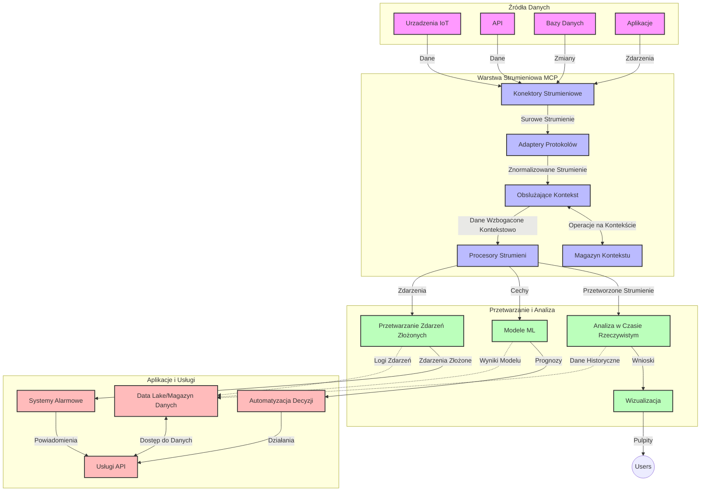

# Protokół Model Context dla Strumieniowego Przetwarzania Danych w Czasie Rzeczywistym

## Przegląd

Strumieniowe przetwarzanie danych w czasie rzeczywistym stało się niezbędne w dzisiejszym, opartym na danych świecie, gdzie firmy i aplikacje wymagają natychmiastowego dostępu do informacji, aby podejmować szybkie decyzje. Protokół Model Context (MCP) stanowi istotny postęp w optymalizacji tych procesów strumieniowych, zwiększając efektywność przetwarzania danych, zachowując integralność kontekstu i poprawiając ogólną wydajność systemu.

Ten moduł analizuje, jak MCP zmienia strumieniowe przetwarzanie danych w czasie rzeczywistym, zapewniając ustandaryzowane podejście do zarządzania kontekstem między modelami AI, platformami strumieniowymi i aplikacjami.

## Wprowadzenie do Strumieniowego Przetwarzania Danych w Czasie Rzeczywistym

Strumieniowe przetwarzanie danych w czasie rzeczywistym to paradygmat technologiczny, który umożliwia ciągły transfer, przetwarzanie i analizę danych w momencie ich generowania, pozwalając systemom reagować natychmiast na nowe informacje. W przeciwieństwie do tradycyjnego przetwarzania wsadowego, które działa na statycznych zbiorach danych, strumieniowanie przetwarza dane w ruchu, dostarczając wglądy i działania z minimalnym opóźnieniem.

### Kluczowe Koncepcje Strumieniowego Przetwarzania Danych:

- **Ciągły Przepływ Danych**: Dane są przetwarzane jako ciągły, niekończący się strumień zdarzeń lub rekordów.
- **Niskie Opóźnienie Przetwarzania**: Systemy są projektowane, aby minimalizować czas między generowaniem a przetwarzaniem danych.
- **Skalowalność**: Architektury strumieniowe muszą obsługiwać zmienną objętość i szybkość danych.
- **Odporność na Błędy**: Systemy muszą być odporne na awarie, aby zapewnić nieprzerwany przepływ danych.
- **Przetwarzanie Z Zachowaniem Stanu**: Utrzymywanie kontekstu między zdarzeniami jest kluczowe dla znaczącej analizy.

### Protokół Model Context i Strumieniowanie w Czasie Rzeczywistym

Protokół Model Context (MCP) rozwiązuje kilka kluczowych wyzwań środowisk strumieniowych w czasie rzeczywistym:

1. **Ciągłość Kontekstowa**: MCP standaryzuje sposób utrzymywania kontekstu w rozproszonych komponentach strumieniowych, zapewniając modelom AI i węzłom przetwarzania dostęp do istotnego kontekstu historycznego i środowiskowego.

2. **Efektywne Zarządzanie Stanem**: Dzięki zapewnieniu ustrukturyzowanych mechanizmów transmisji kontekstu, MCP redukuje narzut na zarządzanie stanem w potokach strumieniowych.

3. **Interoperacyjność**: MCP tworzy wspólny język do współdzielenia kontekstu między różnymi technologiami strumieniowania i modelami AI, umożliwiając bardziej elastyczne i rozszerzalne architektury.

4. **Kontekst Optymalizowany pod Strumieniowanie**: Implementacje MCP mogą priorytetowo traktować elementy kontekstu najistotniejsze dla decyzji w czasie rzeczywistym, optymalizując zarówno wydajność, jak i dokładność.

5. **Adaptacyjne Przetwarzanie**: Dzięki odpowiedniemu zarządzaniu kontekstem przez MCP, systemy strumieniowe mogą dynamicznie dostosowywać przetwarzanie na podstawie zmieniających się warunków i wzorców danych.

We współczesnych zastosowaniach, począwszy od sieci sensorów IoT po platformy handlu finansowego, integracja MCP z technologiami strumieniowymi umożliwia bardziej inteligentne, świadome kontekstu przetwarzanie, które odpowiednio reaguje na złożone, ewoluujące sytuacje w czasie rzeczywistym.

## Cele Nauki

Po ukończeniu tej lekcji będziesz potrafił:

- Zrozumieć podstawy strumieniowego przetwarzania danych w czasie rzeczywistym oraz jego wyzwania
- Wyjaśnić, jak Protokół Model Context (MCP) ulepsza strumieniowanie danych w czasie rzeczywistym
- Implementować rozwiązania strumieniowe oparte na MCP przy użyciu popularnych frameworków, takich jak Kafka i Pulsar
- Projektować i wdrażać odporne na błędy, wysokowydajne architektury strumieniowe z MCP
- Stosować koncepcje MCP w zastosowaniach Internetu Rzeczy (IoT), handlu finansowego i analiz napędzanych AI
- Ocenić pojawiające się trendy i przyszłe innowacje w technologiach strumieniowych opartych na MCP

### Definicja i Znaczenie

Strumieniowe przetwarzanie danych w czasie rzeczywistym obejmuje ciągłe generowanie, przetwarzanie i dostarczanie danych z minimalnym opóźnieniem. W przeciwieństwie do przetwarzania wsadowego, gdzie dane są zbierane i przetwarzane partiami, dane strumieniowe są przetwarzane inkrementalnie w miarę ich napływu, umożliwiając natychmiastowe wglądy i działania.

Kluczowe cechy strumieniowego przetwarzania danych w czasie rzeczywistym obejmują:

- **Niskie opóźnienie**: Przetwarzanie i analiza danych w czasie od milisekund do sekund
- **Ciągły przepływ**: Nieprzerwane strumienie danych z różnych źródeł
- **Natychmiastowe przetwarzanie**: Analiza danych w momencie ich nadejścia, a nie w pakietach
- **Architektura zdarzeniowa**: Reagowanie na zdarzenia w chwili ich wystąpienia

### Wyzwania w Tradycyjnym Strumieniowaniu Danych

Tradycyjne podejścia do strumieniowania danych napotykają na wiele ograniczeń:

1. **Utrata kontekstu**: Trudności w utrzymaniu kontekstu w rozproszonych systemach
2. **Problemy ze skalowalnością**: Wyzwania w skalowaniu do obsługi dużych objętości i szybkości danych
3. **Złożoność integracji**: Problemy z interoperacyjnością między różnymi systemami
4. **Zarządzanie opóźnieniami**: Balansowanie przepustowości z czasem przetwarzania
5. **Spójność danych**: Zapewnienie dokładności i kompletności danych w strumieniu

## Zrozumienie Protokółu Model Context (MCP)

### Czym jest MCP?

Protokół Model Context (MCP) to ustandaryzowany protokół komunikacyjny zaprojektowany, aby ułatwić efektywną interakcję między modelami AI i aplikacjami. W kontekście strumieniowego przetwarzania danych w czasie rzeczywistym, MCP dostarcza ramy do:

- Zachowania kontekstu w całym potoku danych
- Standaryzacji formatów wymiany danych
- Optymalizacji przesyłania dużych zbiorów danych
- Ulepszania komunikacji między modelami oraz między modelami a aplikacjami

### Główne Komponenty i Architektura

Architektura MCP dla strumieniowania w czasie rzeczywistym składa się z kilku kluczowych elementów:

1. **Obsługiwacze Kontekstu**: Zarządzają i utrzymują informacje kontekstowe w całym potoku strumieniowym
2. **Procesory Strumienia**: Przetwarzają napływające strumienie danych przy użyciu technik świadomych kontekstu
3. **Adaptery Protokołu**: Konwertują między różnymi protokołami strumieniowymi przy zachowaniu kontekstu
4. **Magazyn Kontekstu**: Efektywnie przechowuje i odzyskuje informacje kontekstowe
5. **Konektory Strumieniowe**: Łączą się z różnymi platformami strumieniowymi (Kafka, Pulsar, Kinesis itp.)



### Jak MCP Usprawnia Obsługę Danych w Czasie Rzeczywistym

MCP rozwiązuje tradycyjne wyzwania strumieniowania poprzez:

- **Integralność Kontekstową**: Utrzymywanie powiązań między punktami danych w całym potoku
- **Optymalizowaną Transmisję**: Redukowanie redundancji w wymianie danych dzięki inteligentnemu zarządzaniu kontekstem
- **Ustandaryzowane Interfejsy**: Zapewnianie spójnych API dla komponentów strumieniowych
- **Redukcję Opóźnień**: Minimalizowanie narzutu przetwarzania przez efektywne zarządzanie kontekstem
- **Zwiększoną Skalowalność**: Wspieranie skalowania horyzontalnego przy zachowaniu kontekstu

## Integracja i Implementacja

Systemy strumieniowego przetwarzania danych w czasie rzeczywistym wymagają starannego projektowania architektury i implementacji, aby utrzymać zarówno wydajność, jak i integralność kontekstu. Protokół Model Context oferuje ustandaryzowane podejście do integracji modeli AI i technologii strumieniowych, umożliwiając bardziej zaawansowane potoki przetwarzające świadome kontekstu.

### Przegląd Integracji MCP w Architekturach Strumieniowych

Implementacja MCP w środowiskach strumieniowych w czasie rzeczywistym wymaga uwzględnienia kilku kluczowych aspektów:

1. **Serializacja i Transport Kontekstu**: MCP dostarcza efektywne mechanizmy kodowania informacji kontekstowych w pakietach danych strumieniowych, zapewniając, że niezbędny kontekst podąża za danymi w całym potoku przetwarzania. Obejmuje to ustandaryzowane formaty serializacji zoptymalizowane pod transport strumieniowy.

2. **Przetwarzanie Strumienia ze Stanem**: MCP umożliwia inteligentniejsze przetwarzanie ze stanem przez utrzymanie spójnej reprezentacji kontekstu w węzłach przetwarzających. Jest to szczególnie cenne w rozproszonych architekturach strumieniowych, gdzie zarządzanie stanem tradycyjnie stanowi wyzwanie.

3. **Czas Zdarzenia a Czas Przetwarzania**: Implementacje MCP w systemach strumieniowych muszą sprostać powszechnemu wyzwaniu rozróżniania, kiedy zdarzenia się odbyły, a kiedy są przetwarzane. Protokół może zawierać kontekst temporalny, który zachowuje semantykę czasu zdarzenia.

4. **Zarządzanie Backpressure**: Standaryzując obsługę kontekstu, MCP pomaga zarządzać backpressure w systemach strumieniowych, umożliwiając komponentom komunikowanie swoich możliwości przetwarzania i dostosowywanie przepływu odpowiednio.

5. **Okna Kontekstowe i Agregacja**: MCP ułatwia bardziej złożone operacje okienkowe przez dostarczanie ustrukturyzowanych reprezentacji kontekstów czasowych i relacyjnych, umożliwiając bardziej sensowne agregacje w strumieniach zdarzeń.

6. **Przetwarzanie Dokładnie Raz**: W systemach strumieniowych wymagających semantyki dokładnie raz, MCP może uwzględniać metadane przetwarzania, aby pomóc śledzić i weryfikować status przetwarzania w rozproszonych komponentach.

Wdrożenie MCP w różnych technologiach strumieniowych tworzy jednolite podejście do zarządzania kontekstem, redukując potrzebę pisania niestandardowego kodu integracyjnego, jednocześnie zwiększając zdolność systemu do utrzymania znaczącego kontekstu w miarę, jak dane przepływają przez potok.

### MCP w Różnych Frameworkach Strumieniowych

Przykłady te opierają się na aktualnej specyfikacji MCP, która skupia się na protokole opartym na JSON-RPC z odrębnymi mechanizmami transportu. Kod pokazuje, jak można implementować niestandardowe transporty integrujące platformy strumieniowe takie jak Kafka i Pulsar, zachowując pełną kompatybilność z protokołem MCP.

Przykłady zaprojektowano tak, by pokazać, jak platformy strumieniowe mogą być integrowane z MCP, aby zapewnić przetwarzanie danych w czasie rzeczywistym, jednocześnie zachowując świadomość kontekstu, która jest kluczowa dla MCP. Takie podejście gwarantuje, że próbki kodu dokładnie odzwierciedlają aktualny stan specyfikacji MCP na czerwiec 2025.

MCP może być integrowany z popularnymi frameworkami strumieniowymi, w tym:

#### Integracja Apache Kafka

```python
import asyncio
import json
from typing import Dict, Any, Optional
from confluent_kafka import Consumer, Producer, KafkaError
from mcp.client import Client, ClientCapabilities
from mcp.core.message import JsonRpcMessage
from mcp.core.transports import Transport

# Niestandardowa klasa transportowa łącząca MCP z Kafka
class KafkaMCPTransport(Transport):
    def __init__(self, bootstrap_servers: str, input_topic: str, output_topic: str):
        self.bootstrap_servers = bootstrap_servers
        self.input_topic = input_topic
        self.output_topic = output_topic
        self.producer = Producer({'bootstrap.servers': bootstrap_servers})
        self.consumer = Consumer({
            'bootstrap.servers': bootstrap_servers,
            'group.id': 'mcp-client-group',
            'auto.offset.reset': 'earliest'
        })
        self.message_queue = asyncio.Queue()
        self.running = False
        self.consumer_task = None
        
    async def connect(self):
        """Connect to Kafka and start consuming messages"""
        self.consumer.subscribe([self.input_topic])
        self.running = True
        self.consumer_task = asyncio.create_task(self._consume_messages())
        return self
        
    async def _consume_messages(self):
        """Background task to consume messages from Kafka and queue them for processing"""
        while self.running:
            try:
                msg = self.consumer.poll(1.0)
                if msg is None:
                    await asyncio.sleep(0.1)
                    continue
                
                if msg.error():
                    if msg.error().code() == KafkaError._PARTITION_EOF:
                        continue
                    print(f"Consumer error: {msg.error()}")
                    continue
                
                # Parsuj wartość wiadomości jako JSON-RPC
                try:
                    message_str = msg.value().decode('utf-8')
                    message_data = json.loads(message_str)
                    mcp_message = JsonRpcMessage.from_dict(message_data)
                    await self.message_queue.put(mcp_message)
                except Exception as e:
                    print(f"Error parsing message: {e}")
            except Exception as e:
                print(f"Error in consumer loop: {e}")
                await asyncio.sleep(1)
    
    async def read(self) -> Optional[JsonRpcMessage]:
        """Read the next message from the queue"""
        try:
            message = await self.message_queue.get()
            return message
        except Exception as e:
            print(f"Error reading message: {e}")
            return None
    
    async def write(self, message: JsonRpcMessage) -> None:
        """Write a message to the Kafka output topic"""
        try:
            message_json = json.dumps(message.to_dict())
            self.producer.produce(
                self.output_topic,
                message_json.encode('utf-8'),
                callback=self._delivery_report
            )
            self.producer.poll(0)  # Wywołaj funkcje zwrotne
        except Exception as e:
            print(f"Error writing message: {e}")
    
    def _delivery_report(self, err, msg):
        """Kafka producer delivery callback"""
        if err is not None:
            print(f'Message delivery failed: {err}')
        else:
            print(f'Message delivered to {msg.topic()} [{msg.partition()}]')
    
    async def close(self) -> None:
        """Close the transport"""
        self.running = False
        if self.consumer_task:
            self.consumer_task.cancel()
            try:
                await self.consumer_task
            except asyncio.CancelledError:
                pass
        self.consumer.close()
        self.producer.flush()

# Przykład użycia transportu Kafka MCP
async def kafka_mcp_example():
    # Utwórz klienta MCP z transportem Kafka
    client = Client(
        {"name": "kafka-mcp-client", "version": "1.0.0"},
        ClientCapabilities({})
    )
    
    # Utwórz i połącz transport Kafka
    transport = KafkaMCPTransport(
        bootstrap_servers="localhost:9092",
        input_topic="mcp-responses",
        output_topic="mcp-requests"
    )
    
    await client.connect(transport)
    
    try:
        # Inicjalizuj sesję MCP
        await client.initialize()
        
        # Przykład wykonania narzędzia za pomocą MCP
        response = await client.execute_tool(
            "process_data",
            {
                "data": "sample data",
                "metadata": {
                    "source": "sensor-1",
                    "timestamp": "2025-06-12T10:30:00Z"
                }
            }
        )
        
        print(f"Tool execution response: {response}")
        
        # Czyste zamknięcie
        await client.shutdown()
    finally:
        await transport.close()

# Uruchom przykład
if __name__ == "__main__":
    asyncio.run(kafka_mcp_example())
```

#### Implementacja Apache Pulsar

```python
import asyncio
import json
import pulsar
from typing import Dict, Any, Optional
from mcp.core.message import JsonRpcMessage
from mcp.core.transports import Transport
from mcp.server import Server, ServerOptions
from mcp.server.tools import Tool, ToolExecutionContext, ToolMetadata

# Utwórz niestandardowy transport MCP, który używa Pulsar
class PulsarMCPTransport(Transport):
    def __init__(self, service_url: str, request_topic: str, response_topic: str):
        self.service_url = service_url
        self.request_topic = request_topic
        self.response_topic = response_topic
        self.client = pulsar.Client(service_url)
        self.producer = self.client.create_producer(response_topic)
        self.consumer = self.client.subscribe(
            request_topic,
            "mcp-server-subscription",
            consumer_type=pulsar.ConsumerType.Shared
        )
        self.message_queue = asyncio.Queue()
        self.running = False
        self.consumer_task = None
    
    async def connect(self):
        """Connect to Pulsar and start consuming messages"""
        self.running = True
        self.consumer_task = asyncio.create_task(self._consume_messages())
        return self
    
    async def _consume_messages(self):
        """Background task to consume messages from Pulsar and queue them for processing"""
        while self.running:
            try:
                # Odbiór nieblokujący z limitem czasu
                msg = self.consumer.receive(timeout_millis=500)
                
                # Przetwórz wiadomość
                try:
                    message_str = msg.data().decode('utf-8')
                    message_data = json.loads(message_str)
                    mcp_message = JsonRpcMessage.from_dict(message_data)
                    await self.message_queue.put(mcp_message)
                    
                    # Potwierdź odebranie wiadomości
                    self.consumer.acknowledge(msg)
                except Exception as e:
                    print(f"Error processing message: {e}")
                    # Negatywne potwierdzenie w przypadku błędu
                    self.consumer.negative_acknowledge(msg)
            except Exception as e:
                # Obsłuż limit czasu lub inne wyjątki
                await asyncio.sleep(0.1)
    
    async def read(self) -> Optional[JsonRpcMessage]:
        """Read the next message from the queue"""
        try:
            message = await self.message_queue.get()
            return message
        except Exception as e:
            print(f"Error reading message: {e}")
            return None
    
    async def write(self, message: JsonRpcMessage) -> None:
        """Write a message to the Pulsar output topic"""
        try:
            message_json = json.dumps(message.to_dict())
            self.producer.send(message_json.encode('utf-8'))
        except Exception as e:
            print(f"Error writing message: {e}")
    
    async def close(self) -> None:
        """Close the transport"""
        self.running = False
        if self.consumer_task:
            self.consumer_task.cancel()
            try:
                await self.consumer_task
            except asyncio.CancelledError:
                pass
        self.consumer.close()
        self.producer.close()
        self.client.close()

# Zdefiniuj przykładowe narzędzie MCP do przetwarzania danych strumieniowych
@Tool(
    name="process_streaming_data",
    description="Process streaming data with context preservation",
    metadata=ToolMetadata(
        required_capabilities=["streaming"]
    )
)
async def process_streaming_data(
    ctx: ToolExecutionContext,
    data: str,
    source: str,
    priority: str = "medium"
) -> Dict[str, Any]:
    """
    Process streaming data while preserving context
    
    Args:
        ctx: Tool execution context
        data: The data to process
        source: The source of the data
        priority: Priority level (low, medium, high)
        
    Returns:
        Dict containing processed results and context information
    """
    # Przykład przetwarzania wykorzystujący kontekst MCP
    print(f"Processing data from {source} with priority {priority}")
    
    # Uzyskaj dostęp do kontekstu rozmowy z MCP
    conversation_id = ctx.conversation_id if hasattr(ctx, 'conversation_id') else "unknown"
    
    # Zwróć wyniki z rozszerzonym kontekstem
    return {
        "processed_data": f"Processed: {data}",
        "context": {
            "conversation_id": conversation_id,
            "source": source,
            "priority": priority,
            "processing_timestamp": ctx.get_current_time_iso()
        }
    }

# Przykładowa implementacja serwera MCP używająca transportu Pulsar
async def run_mcp_server_with_pulsar():
    # Utwórz serwer MCP
    server = Server(
        {"name": "pulsar-mcp-server", "version": "1.0.0"},
        ServerOptions(
            capabilities={"streaming": True}
        )
    )
    
    # Zarejestruj nasze narzędzie
    server.register_tool(process_streaming_data)
    
    # Utwórz i połącz transport Pulsar
    transport = PulsarMCPTransport(
        service_url="pulsar://localhost:6650",
        request_topic="mcp-requests",
        response_topic="mcp-responses"
    )
    
    try:
        # Uruchom serwer z transportem Pulsar
        await server.run(transport)
    finally:
        await transport.close()

# Uruchom serwer
if __name__ == "__main__":
    asyncio.run(run_mcp_server_with_pulsar())
```

### Najlepsze Praktyki Wdrażania

Przy implementacji MCP dla strumieniowania w czasie rzeczywistym:

1. **Projektuj pod kątem Odporności na Błędy**:
   - Implementuj odpowiednią obsługę błędów
   - Używaj kolejek dead-letter dla wiadomości, które nie powiodły się
   - Projektuj procesory idempotentne

2. **Optymalizuj Wydajność**:
   - Konfiguruj odpowiednie rozmiary buforów
   - Stosuj partiiowanie, gdy jest to stosowne
   - Implementuj mechanizmy backpressure

3. **Monitoruj i Obserwuj**:
   - Śledź metryki przetwarzania strumienia
   - Monitoruj propagację kontekstu
   - Ustaw alerty na anomalia

4. **Zabezpiecz Strumienie**:
   - Implementuj szyfrowanie dla danych wrażliwych
   - Używaj uwierzytelniania i autoryzacji
   - Stosuj odpowiednie kontrole dostępu


### MCP w IoT i Edge Computing

MCP ulepsza strumieniowanie w IoT poprzez:

- Zachowywanie kontekstu urządzeń w całym potoku przetwarzania
- Umożliwianie wydajnego strumieniowania danych z edge do chmury
- Wspieranie analityki czasu rzeczywistego na strumieniach danych IoT
- Ułatwianie komunikacji urządzenie-do-urządzenia z zachowaniem kontekstu

Przykład: Sieci sensorów Smart City
```
Sensors → Edge Gateways → MCP Stream Processors → Real-time Analytics → Automated Responses
```

### Rola w Transakcjach Finansowych i Handlu Wysokich Częstotliwości

MCP oferuje istotne korzyści w strumieniowaniu danych finansowych:

- Ultra-niskie opóźnienia w przetwarzaniu decyzji handlowych
- Utrzymywanie kontekstu transakcji w trakcie przetwarzania
- Wspieranie złożonego przetwarzania zdarzeń z świadomością kontekstu
- Zapewnianie spójności danych w rozproszonych systemach handlowych

### Ulepszanie Analityki Napędzanej AI

MCP otwiera nowe możliwości w analizach strumieniowych:

- Trening i wnioskowanie modeli w czasie rzeczywistym
- Ciągłe uczenie się ze strumieni danych
- Ekstrakcja cech świadoma kontekstu
- Potoki wnioskowania wielomodelowego z zachowanym kontekstem

## Przyszłe Trendy i Innowacje

### Ewolucja MCP w Środowiskach Czasu Rzeczywistego

Patrząc w przyszłość, przewidujemy, że MCP będzie się rozwijać, aby sprostać:

- **Integracji Z Komputerami Kwantowymi**: Przygotowanie do kwantowych systemów strumieniowania
- **Przetwarzaniu Natywnemu na Edge**: Przeniesienie większej części świadomego kontekstu przetwarzania na urządzenia brzegowe
- **Autonomicznemu Zarządzaniu Strumieniami**: Samooptymalizujące się potoki strumieniowe
- **Federacyjnemu Strumieniowaniu**: Rozproszone przetwarzanie przy zachowaniu prywatności

### Potencjalne Postępy Technologiczne

Nowe technologie, które będą kształtować przyszłość strumieniowania MCP:

1. **Protokóły Strumieniowe Optymalizowane pod AI**: Protokoły dostosowane specjalnie do obciążeń AI
2. **Integracja Neuromorficznych Komputerów**: Komputery inspirowane mózgiem do przetwarzania strumieniowego
3. **Strumieniowanie Serverless**: Skalowalne strumieniowanie zdarzeniowe bez zarządzania infrastrukturą
4. **Rozproszone Magazyny Kontekstu**: Globalnie rozproszone, lecz wysoce spójne zarządzanie kontekstem

## Ćwiczenia Praktyczne

### Ćwiczenie 1: Konfiguracja Podstawowego Potoku Strumieniowego z MCP

W tym ćwiczeniu nauczysz się jak:
- Skonfigurować podstawowe środowisko strumieniowe MCP
- Implementować obsługiwacze kontekstu dla przetwarzania strumienia
- Testować i weryfikować zachowanie kontekstu

### Ćwiczenie 2: Budowa Dashboardu Analitycznego w Czasie Rzeczywistym

Stwórz kompletną aplikację, która:
- Pobiera dane strumieniowe z użyciem MCP
- Przetwarza strumień przy zachowaniu kontekstu
- Wizualizuje wyniki na żywo

### Ćwiczenie 3: Implementacja Złożonego Przetwarzania Zdarzeń z MCP

Zaawansowane ćwiczenie obejmujące:
- Wykrywanie wzorców w strumieniach
- Korelacje kontekstowe między wieloma strumieniami
- Generowanie złożonych zdarzeń z zachowanym kontekstem

## Dodatkowe Materiały

- [Specyfikacja Protokółu Model Context](https://modelcontextprotocol.io) - Oficjalna specyfikacja i dokumentacja MCP
- [Dokumentacja Apache Kafka](https://kafka.apache.org/documentation/) - Dowiedz się o Kafka do przetwarzania strumieniowego
- [Apache Pulsar](https://pulsar.apache.org/) - Zunifikowana platforma wiadomości i strumieniowania
- [Streaming Systems: The What, Where, When, and How of Large-Scale Data Processing](https://www.oreilly.com/library/view/streaming-systems/9781491983867/) - Kompleksowa książka o architekturach strumieniowych
- [Microsoft Azure Event Hubs](https://learn.microsoft.com/azure/event-hubs/event-hubs-about) - Zarządzana usługa strumieniowania zdarzeń
- [Dokumentacja MLflow](https://mlflow.org/docs/latest/index.html) - Śledzenie i wdrażanie modeli ML
- [Real-Time Analytics with Apache Storm](https://storm.apache.org/releases/current/index.html) - Framework do obliczeń w czasie rzeczywistym
- [Flink ML](https://nightlies.apache.org/flink/flink-ml-docs-master/) - Biblioteka uczenia maszynowego dla Apache Flink
- [Dokumentacja LangChain](https://python.langchain.com/docs/get_started/introduction) - Tworzenie aplikacji z wykorzystaniem LLM


## Rezultaty Nauki

Po ukończeniu tego modułu będziesz potrafił:

- Zrozumieć podstawy strumieniowego przetwarzania danych w czasie rzeczywistym oraz jego wyzwania
- Wyjaśnić, jak Protokół Model Context (MCP) ulepsza strumieniowanie danych w czasie rzeczywistym
- Implementować rozwiązania strumieniowe oparte na MCP przy użyciu popularnych frameworków takich jak Kafka i Pulsar
- Projektować i wdrażać odporne na błędy, wydajne architektury strumieniowe z MCP
- Stosować koncepcje MCP w IoT, handlu finansowego i analizach napędzanych AI
- Ocenić pojawiające się trendy i przyszłe innowacje w technologiach strumieniowych opartych na MCP

## Co dalej

- [5.11 Realtime Search](../mcp-realtimesearch/README.md)

---

<!-- CO-OP TRANSLATOR DISCLAIMER START -->
**Zastrzeżenie**:
Niniejszy dokument został przetłumaczony za pomocą usługi tłumaczenia AI [Co-op Translator](https://github.com/Azure/co-op-translator). Choć dążymy do dokładności, prosimy pamiętać, że automatyczne tłumaczenia mogą zawierać błędy lub niedokładności. Oryginalny dokument w jego języku źródłowym należy uznawać za autorytatywne źródło. W przypadku informacji krytycznych zalecane jest skorzystanie z profesjonalnego tłumaczenia wykonanego przez człowieka. Nie ponosimy odpowiedzialności za jakiekolwiek nieporozumienia lub błędne interpretacje wynikające z użycia tego tłumaczenia.
<!-- CO-OP TRANSLATOR DISCLAIMER END -->