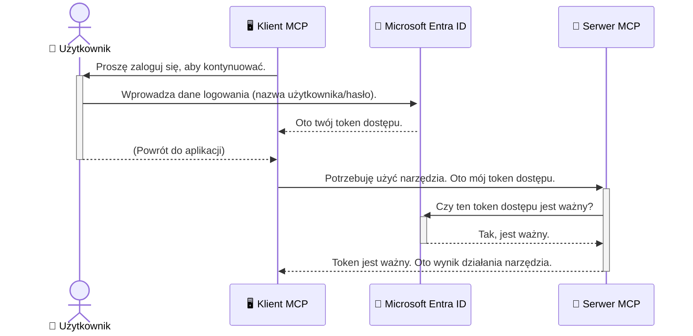

# Zabezpieczenie przepływów pracy AI: uwierzytelnianie Entra ID dla serwerów Model Context Protocol

## Wprowadzenie
Zabezpieczenie serwera Model Context Protocol (MCP) jest równie ważne jak zamknięcie drzwi frontowych domu na klucz. Pozostawienie serwera MCP otwartego naraża Twoje narzędzia i dane na nieautoryzowany dostęp, co może prowadzić do naruszeń bezpieczeństwa. Microsoft Entra ID dostarcza solidne, oparte na chmurze rozwiązanie do zarządzania tożsamością i dostępem, które pomaga zapewnić, że tylko upoważnieni użytkownicy i aplikacje mogą współdziałać z Twoim serwerem MCP. W tej sekcji nauczysz się, jak chronić swoje przepływy pracy AI za pomocą uwierzytelniania Entra ID.

## Cele nauki
Po ukończeniu tej sekcji będziesz potrafił:

- Zrozumieć znaczenie zabezpieczenia serwerów MCP.
- Wyjaśnić podstawy Microsoft Entra ID i uwierzytelniania OAuth 2.0.
- Rozpoznać różnicę między klientami publicznymi a poufnymi.
- Wdrożyć uwierzytelnianie Entra ID w scenariuszach lokalnych (klient publiczny) i zdalnych (klient poufny) serwerów MCP.
- Stosować najlepsze praktyki bezpieczeństwa podczas tworzenia przepływów pracy AI.

## Bezpieczeństwo i MCP

Tak jak nie zostawiłbyś drzwi frontowych swojego domu otwartych, tak nie powinieneś pozostawiać serwera MCP dostępnego dla każdego. Zabezpieczenie przepływów pracy AI jest niezbędne do budowania solidnych, wiarygodnych i bezpiecznych aplikacji. Ten rozdział przedstawi Ci, jak używać Microsoft Entra ID do zabezpieczenia serwerów MCP, gwarantując, że tylko uprawnieni użytkownicy i aplikacje mogą korzystać z Twoich narzędzi i danych.

## Dlaczego bezpieczeństwo ma znaczenie dla serwerów MCP?

Wyobraź sobie, że Twój serwer MCP posiada narzędzie, które może wysyłać e-maile lub uzyskiwać dostęp do bazy danych klientów. Niezabezpieczony serwer oznaczałby, że każdy potencjalnie może użyć tego narzędzia, co prowadzi do nieautoryzowanego dostępu do danych, spamu lub innych złośliwych działań.

Implementując uwierzytelnianie, zapewniasz, że każde żądanie do Twojego serwera jest weryfikowane, potwierdzając tożsamość użytkownika lub aplikacji, która to żądanie wysyła. To pierwszy i najważniejszy krok w zabezpieczaniu przepływów pracy AI.

## Wprowadzenie do Microsoft Entra ID

[**Microsoft Entra ID**](https://adoption.microsoft.com/microsoft-security/entra/) to usługa zarządzania tożsamością i dostępem oparta na chmurze. Można ją porównać do uniwersalnego strażnika bezpieczeństwa dla Twoich aplikacji. Obsługuje ona złożony proces weryfikacji tożsamości użytkowników (uwierzytelnianie) oraz ustalania, co mogą one robić (autoryzacja).

Korzystając z Entra ID, możesz:

- Włączyć bezpieczne logowanie dla użytkowników.
- Chronić API i usługi.
- Zarządzać politykami dostępu z jednego centralnego miejsca.

Dla serwerów MCP Entra ID zapewnia solidne i szeroko zaufane rozwiązanie do zarządzania tym, kto może korzystać z możliwości Twojego serwera.

---

## Zrozumienie mechanizmu: jak działa uwierzytelnianie Entra ID

Entra ID korzysta z otwartych standardów, takich jak **OAuth 2.0**, do obsługi uwierzytelniania. Szczegóły mogą być skomplikowane, ale podstawowa idea jest prosta i można ją zrozumieć na analogii.

### Łagodne wprowadzenie do OAuth 2.0: klucz dozorcy

Pomyśl o OAuth 2.0 jak o serwisie dozorcy Twojego samochodu. Kiedy przyjeżdżasz do restauracji, nie dajesz dozorcy swojego głównego klucza. Zamiast tego dajesz mu **klucz dozorcy**, który ma ograniczone uprawnienia — może uruchomić samochód i zamknąć drzwi, ale nie może otworzyć bagażnika ani schowka.

W tej analogii:

- **Ty** jesteś **Użytkownikiem**.
- **Twój samochód** to **serwer MCP** z cennymi narzędziami i danymi.
- **Dozorca** to **Microsoft Entra ID**.
- **Parkujący** to **klient MCP** (aplikacja próbująca uzyskać dostęp do serwera).
- **Klucz dozorcy** to **token dostępu**.

Token dostępu to bezpieczny ciąg tekstu, który klient MCP otrzymuje od Entra ID po zalogowaniu się użytkownika. Klient przekazuje ten token serwerowi MCP przy każdym żądaniu. Serwer może zweryfikować token, by upewnić się, że żądanie jest prawidłowe i że klient ma wymagane uprawnienia, wszystko to bez konieczności obsługi Twoich rzeczywistych danych uwierzytelniających (np. hasła).

### Przebieg uwierzytelniania

Oto, jak proces działa w praktyce:



### Wprowadzenie do Microsoft Authentication Library (MSAL)

Zanim przejdziemy do kodu, ważne jest, aby przedstawić kluczowy komponent, który pojawia się w przykładach: **Microsoft Authentication Library (MSAL)**.

MSAL to biblioteka stworzona przez Microsoft, która znacznie ułatwia programistom obsługę uwierzytelniania. Zamiast pisać skomplikowany kod zarządzający tokenami bezpieczeństwa, logowaniami i odnawianiem sesji, MSAL zajmuje się tymi zadaniami.

Korzystanie z biblioteki takiej jak MSAL jest bardzo polecane, ponieważ:

- **Jest bezpieczna:** Implementuje standardowe protokoły branżowe i najlepsze praktyki bezpieczeństwa, zmniejszając ryzyko luk w Twoim kodzie.
- **Ułatwia rozwój:** Ukrywa złożoność protokołów OAuth 2.0 i OpenID Connect, pozwalając dodać solidne uwierzytelnianie do aplikacji za pomocą kilku linijek kodu.
- **Jest utrzymywana:** Microsoft aktywnie rozwija i aktualizuje MSAL, by reagować na nowe zagrożenia i zmiany platform.

MSAL obsługuje wiele języków programowania i frameworków, w tym .NET, JavaScript/TypeScript, Python, Java, Go oraz platformy mobilne takie jak iOS i Android. Oznacza to, że możesz korzystać z jednolitych wzorców uwierzytelniania w całym swoim stosie technologicznym.

Aby dowiedzieć się więcej o MSAL, możesz zapoznać się z oficjalną [dokumentacją przeglądową MSAL](https://learn.microsoft.com/entra/identity-platform/msal-overview).

---

## Zabezpieczenie serwera MCP za pomocą Entra ID: przewodnik krok po kroku

Przejdźmy teraz przez proces zabezpieczenia lokalnego serwera MCP (komunikującego się przez `stdio`) za pomocą Entra ID. Ten przykład wykorzystuje **klienta publicznego**, który jest odpowiedni dla aplikacji działających na komputerze użytkownika, takich jak aplikacja desktopowa lub lokalny serwer deweloperski.

### Scenariusz 1: zabezpieczenie lokalnego serwera MCP (z klientem publicznym)

W tym scenariuszu zobaczymy serwer MCP działający lokalnie, komunikujący się przez `stdio`, który używa Entra ID do uwierzytelnienia użytkownika przed udostępnieniem dostępu do narzędzi. Serwer będzie miał jedno narzędzie, które pobiera informacje profilowe użytkownika z Microsoft Graph API.

#### 1. Konfiguracja aplikacji w Entra ID

Zanim zaczniesz pisać kod, musisz zarejestrować swoją aplikację w Microsoft Entra ID. Informujesz tym Entra ID o swojej aplikacji i udzielasz jej uprawnień do korzystania z usługi uwierzytelniania.

1. Przejdź do **[portalu Microsoft Entra](https://entra.microsoft.com/)**.
2. Wybierz **Rejestracje aplikacji** i kliknij **Nowa rejestracja**.
3. Nadaj aplikacji nazwę (np. "Mój lokalny serwer MCP").
4. W sekcji **Obsługiwane typy kont** wybierz **Konta tylko w tym katalogu organizacji**.
5. Możesz pozostawić pole **URI przekierowania** puste dla tego przykładu.
6. Kliknij **Zarejestruj**.

Po rejestracji zanotuj **Identyfikator aplikacji (klienta)** oraz **Identyfikator katalogu (dzierżawy)**. Będziesz ich potrzebować w swoim kodzie.

#### 2. Kod: omówienie

Spójrzmy na kluczowe części kodu, które obsługują uwierzytelnianie. Pełny kod tego przykładu jest dostępny w folderze [Entra ID - Local - WAM](https://github.com/Azure-Samples/mcp-auth-servers/tree/main/src/entra-id-local-wam) w repozytorium [mcp-auth-servers na GitHub](https://github.com/Azure-Samples/mcp-auth-servers).

**`AuthenticationService.cs`**

Ta klasa odpowiada za komunikację z Entra ID.

- **`CreateAsync`**: Metoda inicjalizuje `PublicClientApplication` z MSAL (Microsoft Authentication Library). Jest konfigurowana za pomocą `clientId` i `tenantId` aplikacji.
- **`WithBroker`**: Umożliwia korzystanie z brokerów (np. Windows Web Account Manager), co zapewnia bezpieczniejsze i wygodniejsze pojedyncze logowanie (single sign-on).
- **`AcquireTokenAsync`**: Jest to podstawowa metoda. Najpierw próbuje pozyskać token w trybie cichym (użytkownik nie musi się ponownie logować, jeśli ma ważną sesję). Jeśli nie uda się zdobyć tokena w trybie cichym, wywołuje się interaktywny proces logowania.

```csharp
// Simplified for clarity
public static async Task<AuthenticationService> CreateAsync(ILogger<AuthenticationService> logger)
{
    var msalClient = PublicClientApplicationBuilder
        .Create(_clientId) // Your Application (client) ID
        .WithAuthority(AadAuthorityAudience.AzureAdMyOrg)
        .WithTenantId(_tenantId) // Your Directory (tenant) ID
        .WithBroker(new BrokerOptions(BrokerOptions.OperatingSystems.Windows))
        .Build();

    // ... cache registration ...

    return new AuthenticationService(logger, msalClient);
}

public async Task<string> AcquireTokenAsync()
{
    try
    {
        // Try silent authentication first
        var accounts = await _msalClient.GetAccountsAsync();
        var account = accounts.FirstOrDefault();

        AuthenticationResult? result = null;

        if (account != null)
        {
            result = await _msalClient.AcquireTokenSilent(_scopes, account).ExecuteAsync();
        }
        else
        {
            // If no account, or silent fails, go interactive
            result = await _msalClient.AcquireTokenInteractive(_scopes).ExecuteAsync();
        }

        return result.AccessToken;
    }
    catch (Exception ex)
    {
        _logger.LogError(ex, "An error occurred while acquiring the token.");
        throw; // Optionally rethrow the exception for higher-level handling
    }
}
```

**`Program.cs`**

Tu konfigurowany jest serwer MCP oraz integracja usługi uwierzytelniania.

- **`AddSingleton<AuthenticationService>`**: Rejestruje `AuthenticationService` w kontenerze dependency injection, aby mógł być używany w innych częściach aplikacji (np. w narzędziu).
- Narzędzie **`GetUserDetailsFromGraph`** wymaga instancji `AuthenticationService`. Przed wykonaniem działania wywołuje `authService.AcquireTokenAsync()`, aby zdobyć ważny token dostępu. Po pomyślnym uwierzytelnieniu token jest używany do wywołania Microsoft Graph API i pobrania danych użytkownika.

```csharp
// Simplified for clarity
[McpServerTool(Name = "GetUserDetailsFromGraph")]
public static async Task<string> GetUserDetailsFromGraph(
    AuthenticationService authService)
{
    try
    {
        // This will trigger the authentication flow
        var accessToken = await authService.AcquireTokenAsync();

        // Use the token to create a GraphServiceClient
        var graphClient = new GraphServiceClient(
            new BaseBearerTokenAuthenticationProvider(new TokenProvider(authService)));

        var user = await graphClient.Me.GetAsync();

        return System.Text.Json.JsonSerializer.Serialize(user);
    }
    catch (Exception ex)
    {
        return $"Error: {ex.Message}";
    }
}
```

#### 3. Jak to wszystko działa razem

1. Gdy klient MCP próbuje użyć narzędzia `GetUserDetailsFromGraph`, narzędzie najpierw wywołuje `AcquireTokenAsync`.
2. `AcquireTokenAsync` uruchamia bibliotekę MSAL, która sprawdza, czy istnieje ważny token.
3. Jeśli token nie jest dostępny, MSAL za pomocą brokera poprosi użytkownika o zalogowanie się kontem Entra ID.
4. Po zalogowaniu Entra ID wydaje token dostępu.
5. Narzędzie odbiera token i wykorzystuje go do bezpiecznego wywołania Microsoft Graph API.
6. Dane użytkownika zostają zwrócone klientowi MCP.

Ten proces zapewnia, że tylko uwierzytelnieni użytkownicy mogą korzystać z narzędzia, skutecznie zabezpieczając lokalny serwer MCP.

### Scenariusz 2: zabezpieczenie zdalnego serwera MCP (z klientem poufnym)

Gdy Twój serwer MCP działa na zdalnej maszynie (np. serwerze w chmurze) i komunikuje się przez protokół taki jak HTTP Streaming, wymagania bezpieczeństwa są inne. W takim przypadku powinieneś użyć **klienta poufnego** oraz **Authorization Code Flow**. To bezpieczniejsza metoda, ponieważ sekret aplikacji nigdy nie jest ujawniany przeglądarce.

Ten przykład wykorzystuje serwer MCP oparty na TypeScript, który używa Express.js do obsługi żądań HTTP.

#### 1. Konfiguracja aplikacji w Entra ID

Konfiguracja w Entra ID jest podobna do klienta publicznego, ale z jednym kluczowym dodatkiem: należy utworzyć **sekret klienta**.

1. Przejdź do **[portalu Microsoft Entra](https://entra.microsoft.com/)**.
2. W rejestracji swojej aplikacji wejdź na zakładkę **Certyfikaty i sekrety**.
3. Kliknij **Nowy sekret klienta**, podaj opis i kliknij **Dodaj**.
4. **Ważne:** natychmiast skopiuj wartość sekretu. Nie będziesz mógł jej zobaczyć ponownie.
5. Należy również skonfigurować **URI przekierowania**. Przejdź do zakładki **Uwierzytelnianie**, kliknij **Dodaj platformę**, wybierz **Web** i wpisz URI przekierowania dla aplikacji (np. `http://localhost:3001/auth/callback`).

> **⚠️ Ważna uwaga dotycząca bezpieczeństwa:** Dla aplikacji produkcyjnych Microsoft zdecydowanie zaleca korzystanie z metod uwierzytelniania bez sekretów, takich jak **Managed Identity** lub **Workload Identity Federation** zamiast sekretów klienta. Sekrety klienta stanowią ryzyko bezpieczeństwa, ponieważ mogą zostać ujawnione lub skompromitowane. Tożsamości zarządzane oferują bezpieczniejsze podejście, eliminując konieczność przechowywania poświadczeń w kodzie lub konfiguracji.
>
> Więcej informacji o tożsamościach zarządzanych i ich wdrażaniu znajdziesz w przeglądzie [Managed identities for Azure resources](https://learn.microsoft.com/entra/identity/managed-identities-azure-resources/overview).

#### 2. Kod: omówienie

Ten przykład używa podejścia sesyjnego. Gdy użytkownik się uwierzytelni, serwer przechowuje token dostępu i token odświeżający w sesji oraz przypisuje użytkownikowi token sesji. Ten token sesji jest następnie używany do kolejnych żądań. Pełny kod jest dostępny w folderze [Entra ID - Confidential client](https://github.com/Azure-Samples/mcp-auth-servers/tree/main/src/entra-id-cca-session) w repozytorium [mcp-auth-servers na GitHub](https://github.com/Azure-Samples/mcp-auth-servers).

**`Server.ts`**

Plik konfiguruje serwer Express oraz warstwę transportu MCP.

- **`requireBearerAuth`**: Middleware chroniący endpointy `/sse` i `/message`. Sprawdza, czy w nagłówku `Authorization` żądania jest ważny token bearer.
- **`EntraIdServerAuthProvider`**: Klasa implementująca interfejs `McpServerAuthorizationProvider`. Odpowiada za obsługę mechanizmu OAuth 2.0.
- **`/auth/callback`**: Endpoint obsługujący przekierowanie z Entra ID po uwierzytelnieniu użytkownika. Wymienia kod autoryzacyjny na token dostępu i token odświeżający.

```typescript
// Uproszczone dla jasności
const app = express();
const { server } = createServer();
const provider = new EntraIdServerAuthProvider();

// Chroń punkt końcowy SSE
app.get("/sse", requireBearerAuth({
  provider,
  requiredScopes: ["User.Read"]
}), async (req, res) => {
  // ... połącz się z transportem ...
});

// Chroń punkt końcowy wiadomości
app.post("/message", requireBearerAuth({
  provider,
  requiredScopes: ["User.Read"]
}), async (req, res) => {
  // ... obsłuż wiadomość ...
});

// Obsłuż wywołanie zwrotne OAuth 2.0
app.get("/auth/callback", (req, res) => {
  provider.handleCallback(req.query.code, req.query.state)
    .then(result => {
      // ... obsłuż sukces lub niepowodzenie ...
    });
});
```

**`Tools.ts`**

Ten plik definiuje narzędzia dostępne na serwerze MCP. Narzędzie `getUserDetails` jest podobne do poprzedniego przykładu, ale token dostępu pobierany jest z sesji.

```typescript
// Uproszczone dla jasności
server.setRequestHandler(CallToolRequestSchema, async (request) => {
  const { name } = request.params;
  const context = request.params?.context as { token?: string } | undefined;
  const sessionToken = context?.token;

  if (name === ToolName.GET_USER_DETAILS) {
    if (!sessionToken) {
      throw new AuthenticationError("Authentication token is missing or invalid. Ensure the token is provided in the request context.");
    }

    // Pobierz token Entra ID z magazynu sesji
    const tokenData = tokenStore.getToken(sessionToken);
    const entraIdToken = tokenData.accessToken;

    const graphClient = Client.init({
      authProvider: (done) => {
        done(null, entraIdToken);
      }
    });

    const user = await graphClient.api('/me').get();

    // ... zwróć szczegóły użytkownika ...
  }
});
```

**`auth/EntraIdServerAuthProvider.ts`**

Klasa odpowiada za:

- Przekierowywanie użytkownika na stronę logowania Entra ID.
- Wymianę kodu autoryzacyjnego na token dostępu.
- Przechowywanie tokenów w `tokenStore`.
- Odświeżanie tokena dostępu po wygaśnięciu.

#### 3. Jak to wszystko działa razem

1. Gdy użytkownik próbuje połączyć się z serwerem MCP po raz pierwszy, middleware `requireBearerAuth` stwierdza brak ważnej sesji i przekierowuje go na stronę logowania Entra ID.
2. Użytkownik loguje się przy użyciu konta Entra ID.
3. Entra ID przekierowuje użytkownika z powrotem do punktu końcowego `/auth/callback` z kodem autoryzacyjnym.  
4. Serwer wymienia kod na token dostępu i token odświeżania, przechowuje je oraz tworzy token sesji, który jest wysyłany do klienta.  
5. Klient może teraz używać tego tokena sesji w nagłówku `Authorization` dla wszystkich przyszłych żądań do serwera MCP.  
6. Gdy wywoływane jest narzędzie `getUserDetails`, używa ono tokena sesji, aby odnaleźć token dostępu Entra ID, a następnie wykorzystuje go do wywołania Microsoft Graph API.

Ten przepływ jest bardziej złożony niż przepływ klienta publicznego, ale jest wymagany dla punktów końcowych dostępnych z Internetu. Ponieważ zdalne serwery MCP są dostępne przez publiczny Internet, potrzebują silniejszych środków bezpieczeństwa, aby chronić przed nieautoryzowanym dostępem i potencjalnymi atakami.


## Najlepsze praktyki bezpieczeństwa

- **Zawsze używaj HTTPS**: Szyfruj komunikację między klientem a serwerem, aby chronić tokeny przed przechwyceniem.  
- **Wdrażaj kontrolę dostępu opartą na rolach (RBAC)**: Sprawdzaj nie tylko *czy* użytkownik jest uwierzytelniony, ale *co* jest uprawniony zrobić. Możesz definiować role w Entra ID i sprawdzać je na swoim serwerze MCP.  
- **Monitoruj i audytuj**: Rejestruj wszystkie zdarzenia uwierzytelniania, aby móc wykrywać i reagować na podejrzane działania.  
- **Obsługuj ograniczenia i throttling**: Microsoft Graph i inne API wprowadzają ograniczenia liczby zapytań, aby zapobiegać nadużyciom. Zaimplementuj w swoim serwerze MCP logikę wykładniczego spowolnienia i ponawiania prób, aby łagodnie obsługiwać odpowiedzi HTTP 429 (Too Many Requests). Rozważ buforowanie często pobieranych danych, aby ograniczyć wywołania API.  
- **Bezpieczne przechowywanie tokenów**: Przechowuj tokeny dostępu i odświeżania w bezpieczny sposób. Dla aplikacji lokalnych używaj systemowych mechanizmów bezpiecznego przechowywania. Dla aplikacji serwerowych rozważ użycie szyfrowanego magazynu lub bezpiecznych usług zarządzania kluczami, takich jak Azure Key Vault.  
- **Obsługa wygasania tokenów**: Tokeny dostępu mają ograniczony czas ważności. Zaimplementuj automatyczne odświeżanie tokenów za pomocą tokenów odświeżania, aby zapewnić płynne doświadczenie użytkownika bez konieczności ponownego uwierzytelniania.  
- **Rozważ użycie Azure API Management**: Chociaż implementacja zabezpieczeń bezpośrednio na twoim serwerze MCP daje precyzyjną kontrolę, bramy API takie jak Azure API Management mogą automatycznie obsługiwać wiele z tych zagadnień bezpieczeństwa, w tym uwierzytelnianie, autoryzację, ograniczenia liczby zapytań i monitorowanie. Zapewniają one scentralizowaną warstwę bezpieczeństwa pomiędzy klientami a serwerami MCP. Więcej informacji o użyciu bram API z MCP znajdziesz w naszym artykule [Azure API Management Your Auth Gateway For MCP Servers](https://techcommunity.microsoft.com/blog/integrationsonazureblog/azure-api-management-your-auth-gateway-for-mcp-servers/4402690).


## Kluczowe wnioski

- Zabezpieczenie twojego serwera MCP jest kluczowe dla ochrony danych i narzędzi.  
- Microsoft Entra ID dostarcza solidne i skalowalne rozwiązanie do uwierzytelniania i autoryzacji.  
- Używaj **klienta publicznego** dla aplikacji lokalnych oraz **klienta poufnego** dla zdalnych serwerów.  
- **Przepływ kodu autoryzacyjnego** to najbezpieczniejsza opcja dla aplikacji webowych.


## Ćwiczenie

1. Pomyśl o serwerze MCP, który mógłbyś stworzyć. Czy byłby to serwer lokalny czy zdalny?  
2. Na podstawie swojej odpowiedzi, czy użyłbyś klienta publicznego czy poufnego?  
3. Jakie uprawnienie twój serwer MCP powinien zażądać do wykonywania działań wobec Microsoft Graph?


## Ćwiczenia praktyczne

### Ćwiczenie 1: Rejestracja aplikacji w Entra ID  
Przejdź do portalu Microsoft Entra.  
Zarejestruj nową aplikację dla serwera MCP.  
Zapisz identyfikator aplikacji (client ID) oraz identyfikator katalogu (tenant ID).

### Ćwiczenie 2: Zabezpieczenie lokalnego serwera MCP (klient publiczny)  
- Postępuj zgodnie z przykładem kodu, aby zintegrować MSAL (Microsoft Authentication Library) do uwierzytelniania użytkownika.  
- Przetestuj przepływ uwierzytelniania, wywołując narzędzie MCP, które pobiera dane użytkownika z Microsoft Graph.

### Ćwiczenie 3: Zabezpieczenie zdalnego serwera MCP (klient poufny)  
- Zarejestruj klienta poufnego w Entra ID i utwórz sekret klienta.  
- Skonfiguruj swój serwer MCP Express.js do używania przepływu kodu autoryzacyjnego.  
- Przetestuj chronione punkty końcowe i potwierdź dostęp oparty na tokenach.

### Ćwiczenie 4: Zastosowanie najlepszych praktyk bezpieczeństwa  
- Włącz HTTPS dla serwera lokalnego lub zdalnego.  
- Wdróż kontrolę dostępu opartą na rolach (RBAC) w logice serwera.  
- Dodaj obsługę wygasania tokenów i bezpieczne przechowywanie tokenów.

## Zasoby

1. **Dokumentacja przeglądowa MSAL**  
   Dowiedz się, jak Microsoft Authentication Library (MSAL) umożliwia bezpieczne pozyskiwanie tokenów na różnych platformach:  
   [MSAL Overview on Microsoft Learn](https://learn.microsoft.com/en-gb/entra/msal/overview)

2. **Repozytorium GitHub Azure-Samples/mcp-auth-servers**  
   Referencyjne implementacje serwerów MCP demonstrujące przepływy uwierzytelniania:  
   [Azure-Samples/mcp-auth-servers on GitHub](https://github.com/Azure-Samples/mcp-auth-servers)

3. **Przegląd tożsamości zarządzanych dla zasobów Azure**  
   Dowiedz się, jak wyeliminować sekrety, używając systemowo lub użytkownikowo przypisanych tożsamości zarządzanych:  
   [Managed Identities Overview on Microsoft Learn](https://learn.microsoft.com/en-us/entra/identity/managed-identities-azure-resources/)

4. **Azure API Management: Twoja brama uwierzytelniania dla serwerów MCP**  
   Szczegółowe omówienie użycia APIM jako bezpiecznej bramy OAuth2 dla serwerów MCP:  
   [Azure API Management Your Auth Gateway For MCP Servers](https://techcommunity.microsoft.com/blog/integrationsonazureblog/azure-api-management-your-auth-gateway-for-mcp-servers/4402690)

5. **Microsoft Graph Permissions Reference**  
   Kompleksowa lista uprawnień delegowanych i aplikacyjnych dla Microsoft Graph:  
   [Microsoft Graph Permissions Reference](https://learn.microsoft.com/zh-tw/graph/permissions-reference)


## Efekty nauki  
Po ukończeniu tej sekcji będziesz potrafił:

- Wyjaśnić, dlaczego uwierzytelnianie jest krytyczne dla serwerów MCP i przepływów AI.  
- Skonfigurować uwierzytelnianie Entra ID dla scenariuszy lokalnych i zdalnych serwerów MCP.  
- Wybrać odpowiedni typ klienta (publiczny lub poufny) w zależności od wdrożenia serwera.  
- Wdrażać bezpieczne praktyki kodowania, w tym przechowywanie tokenów i autoryzację opartą na rolach.  
- Skutecznie chronić swój serwer MCP i jego narzędzia przed nieautoryzowanym dostępem.

## Co dalej

- [5.13 Model Context Protocol (MCP) Integracja z Microsoft Foundry](../mcp-foundry-agent-integration/README.md)

---

<!-- CO-OP TRANSLATOR DISCLAIMER START -->
**Zastrzeżenie**:
Niniejszy dokument został przetłumaczony za pomocą usługi tłumaczenia AI [Co-op Translator](https://github.com/Azure/co-op-translator). Choć dążymy do dokładności, prosimy pamiętać, że automatyczne tłumaczenia mogą zawierać błędy lub niedokładności. Oryginalny dokument w jego języku źródłowym należy uznawać za autorytatywne źródło. W przypadku informacji krytycznych zalecane jest skorzystanie z profesjonalnego tłumaczenia wykonanego przez człowieka. Nie ponosimy odpowiedzialności za jakiekolwiek nieporozumienia lub błędne interpretacje wynikające z użycia tego tłumaczenia.
<!-- CO-OP TRANSLATOR DISCLAIMER END -->