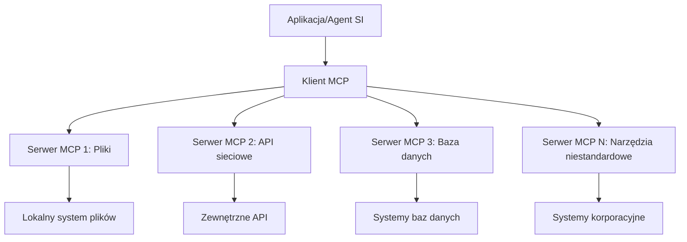

# 🌐 Moduł 2: MCP z fundamentami Microsoft Foundry Toolkit

[]()
[]()
[]()

## 📋 Cele nauki

Po ukończeniu tego modułu będziesz potrafił:
- ✅ Zrozumieć architekturę i korzyści Model Context Protocol (MCP)
- ✅ Poznać ekosystem serwerów MCP Microsoft
- ✅ Zintegrować serwery MCP z Microsoft Foundry Toolkit Agent Builder
- ✅ Zbudować funkcjonalnego agenta automatyzacji przeglądarki używając Playwright MCP
- ✅ Skonfigurować i przetestować narzędzia MCP w swoich agentach
- ✅ Eksportować i wdrażać agentów napędzanych MCP do użytku produkcyjnego

## 🎯 Kontynuacja z Modułu 1

W Moduł 1 opanowaliśmy podstawy Microsoft Foundry Toolkit i stworzyliśmy naszego pierwszego agenta w Pythonie. Teraz **wzmocnimy** Twoich agentów, łącząc ich z zewnętrznymi narzędziami i usługami przez rewolucyjny **Model Context Protocol (MCP)**.

Pomyśl o tym jak o modernizacji z prostego kalkulatora do pełnoprawnego komputera – Twoje AI-agenty zyskają możliwość:
- 🌐 Przeglądania i interakcji ze stronami internetowymi
- 📁 Dostępu i manipulacji plikami
- 🔧 Integracji z systemami korporacyjnymi
- 📊 Przetwarzania danych w czasie rzeczywistym z API

## 🧠 Zrozumienie Model Context Protocol (MCP)

### 🔍 Czym jest MCP?

Model Context Protocol (MCP) to **„USB-C dla aplikacji AI”** – rewolucyjny, otwarty standard łączący Duże Modele Językowe (LLM) z zewnętrznymi narzędziami, źródłami danych i usługami. Tak jak USB-C wyeliminowało chaos kabli poprzez jeden uniwersalny złącze, MCP likwiduje złożoność integracji AI jednym ustandaryzowanym protokołem.

### 🎯 Problem rozwiązany przez MCP

**Przed MCP:**
- 🔧 Dedykowane integracje dla każdego narzędzia
- 🔄 Zamknięcie w dostawcy przez rozwiązania własnościowe  
- 🔒 Luki bezpieczeństwa wynikające z ad-hoc połączeń
- ⏱️ Miesiące pracy nad prostymi integracjami

**Z MCP:**
- ⚡ Integracja narzędzi typu plug-and-play
- 🔄 Architektura niezależna od dostawcy
- 🛡️ Wbudowane najlepsze praktyki bezpieczeństwa
- 🚀 Minuty na dodanie nowych funkcji

### 🏗️ Dogłębna architektura MCP

MCP opiera się na **architekturze klient-serwer**, tworząc bezpieczny i skalowalny ekosystem:



**🔧 Podstawowe komponenty:**

| Komponent | Rola | Przykłady |
|-----------|------|----------|
| **Hosty MCP** | Aplikacje konsumujące usługi MCP | Claude Desktop, VS Code, Microsoft Foundry Toolkit |
| **Klienci MCP** | Obsługa protokołu (1:1 z serwerami) | Wbudowane w aplikacje hostów |
| **Serwery MCP** | Udostępniają funkcje przez standardowy protokół | Playwright, Files, Azure, GitHub |
| **Warstwa transportowa** | Metody komunikacji | stdio, HTTP, WebSockets |


## 🏢 Ekosystem serwerów MCP Microsoft

Microsoft przewodzi ekosystemowi MCP oferując kompleksowy zestaw serwerów klasy enterprise odpowiadających na rzeczywiste potrzeby biznesowe.

### 🌟 Polecane serwery MCP Microsoft

#### 1. ☁️ Serwer MCP Azure
**🔗 Repozytorium**: [azure/azure-mcp](https://github.com/azure/azure-mcp)
**🎯 Cel**: Kompleksowe zarządzanie zasobami Azure z integracją AI

**✨ Kluczowe funkcje:**
- Deklaratywne zarządzanie infrastrukturą
- Monitorowanie zasobów w czasie rzeczywistym
- Rekomendacje optymalizacji kosztów
- Kontrola zgodności z bezpieczeństwem

**🚀 Scenariusze użycia:**
- Infrastruktura jako kod z pomocą AI
- Automatyczne skalowanie zasobów
- Optymalizacja kosztów chmury
- Automatyzacja workflow DevOps

#### 2. 📊 Microsoft Dataverse MCP
**📚 Dokumentacja**: [Microsoft Dataverse Integration](https://go.microsoft.com/fwlink/?linkid=2320176)
**🎯 Cel**: Interfejs w naturalnym języku do danych biznesowych

**✨ Kluczowe funkcje:**
- Zapytania do baz danych w języku naturalnym
- Rozumienie kontekstu biznesowego
- Własne szablony promptów
- Zarządzanie danymi korporacyjnymi

**🚀 Scenariusze użycia:**
- Raportowanie BI
- Analiza danych klientów
- Wgląd w proces sprzedaży
- Zapytania dotyczące zgodności

#### 3. 🌐 Serwer MCP Playwright
**🔗 Repozytorium**: [microsoft/playwright-mcp](https://github.com/microsoft/playwright-mcp)
**🎯 Cel**: Automatyzacja przeglądarki i interakcja ze stronami www

**✨ Kluczowe funkcje:**
- Automatyzacja międzyprzeglądarkowa (Chrome, Firefox, Safari)
- Inteligentne wykrywanie elementów
- Generowanie zrzutów ekranu i PDF
- Monitorowanie ruchu sieciowego

**🚀 Scenariusze użycia:**
- Automatyczne testy
- Web scraping i ekstrakcja danych
- Monitorowanie UI/UX
- Automatyzacja analizy konkurencji

#### 4. 📁 Serwer MCP Files
**🔗 Repozytorium**: [microsoft/files-mcp-server](https://github.com/microsoft/files-mcp-server)
**🎯 Cel**: Inteligentne operacje na systemie plików

**✨ Kluczowe funkcje:**
- Deklaratywne zarządzanie plikami
- Synchronizacja zawartości
- Integracja z kontrolą wersji
- Ekstrakcja metadanych

**🚀 Scenariusze użycia:**
- Zarządzanie dokumentacją
- Organizacja repozytoriów kodu
- Workflow publikacji treści
- Obsługa plików w pipeline danych

#### 5. 📝 Serwer MCP MarkItDown
**🔗 Repozytorium**: [microsoft/markitdown](https://github.com/microsoft/markitdown)
**🎯 Cel**: Zaawansowane przetwarzanie i manipulacja Markdown

**✨ Kluczowe funkcje:**
- Zaawansowane parsowanie Markdown
- Konwersja formatów (MD ↔ HTML ↔ PDF)
- Analiza struktury treści
- Przetwarzanie szablonów

**🚀 Scenariusze użycia:**
- Workflow dokumentacji technicznej
- Systemy zarządzania treścią
- Generowanie raportów
- Automatyzacja baz wiedzy

#### 6. 📈 Serwer MCP Clarity
**📦 Pakiet**: [@microsoft/clarity-mcp-server](https://www.npmjs.com/package/@microsoft/clarity-mcp-server)
**🎯 Cel**: Analityka webowa i wgląd w zachowania użytkowników

**✨ Kluczowe funkcje:**
- Analiza danych heatmap
- Nagrania sesji użytkowników
- Metryki wydajności
- Analiza lejków konwersji

**🚀 Scenariusze użycia:**
- Optymalizacja stron www
- Badania UX
- Analiza testów A/B
- Dashboardy BI

### 🌍 Ekosystem społecznościowy

Poza serwerami Microsoft, ekosystem MCP obejmuje:
- **🐙 GitHub MCP**: zarządzanie repozytoriami i analiza kodu
- **🗄️ MCP bazy danych**: integracje z PostgreSQL, MySQL, MongoDB
- **☁️ MCP dostawców chmurowych**: AWS, GCP, Digital Ocean
- **📧 MCP komunikacji**: integracje Slack, Teams, Email

## 🛠️ Praktyczne laboratorium: Budowa agenta automatyzacji przeglądarki

**🎯 Cel projektu**: Stworzyć inteligentnego agenta automatyzacji przeglądarki z użyciem serwera Playwright MCP, który będzie mógł przeglądać strony, wyciągać informacje i wykonywać złożone interakcje internetowe.

### 🚀 Faza 1: Ustawienie podstaw agenta

#### Krok 1: Inicjalizacja agenta
1. **Otwórz Microsoft Foundry Toolkit Agent Builder**
2. **Utwórz nowego agenta** z następującą konfiguracją:
   - **Nazwa**: `BrowserAgent`
   - **Model**: Wybierz GPT-4o 


### 🔧 Faza 2: Workflow integracji MCP

#### Krok 3: Dodaj integrację serwera MCP
1. **Przejdź do sekcji Narzędzia** w Agent Builder
2. **Kliknij "Dodaj narzędzie"**, aby otworzyć menu integracji
3. **Wybierz "Serwer MCP"** z dostępnych opcji


**🔍 Zrozumienie typów narzędzi:**
- **Narzędzia wbudowane**: wstępnie skonfigurowane funkcje Microsoft Foundry Toolkit
- **Serwery MCP**: integracje z usługami zewnętrznymi
- **API niestandardowe**: Twoje własne punkty końcowe usług
- **Wywołania funkcji**: bezpośredni dostęp do funkcji modelu

#### Krok 4: Wybór serwera MCP
1. **Wybierz opcję "Serwer MCP"** by kontynuować


2. **Przeglądaj katalog MCP** aby odkryć dostępne integracje


### 🎮 Faza 3: Konfiguracja Playwright MCP

#### Krok 5: Wybierz i skonfiguruj Playwright
1. **Kliknij "Użyj polecanych serwerów MCP"** by uzyskać dostęp do zweryfikowanych serwerów Microsoft
2. **Wybierz "Playwright"** z listy polecanych
3. **Zaakceptuj domyślne ID MCP** lub dostosuj do swojego środowiska


#### Krok 6: Włącz funkcje Playwright
**🔑 Krok krytyczny**: Wybierz **WSZYSTKIE** dostępne metody Playwright dla maksymalnej funkcjonalności


**🛠️ Nieodzowne narzędzia Playwright:**
- **Nawigacja**: `goto`, `goBack`, `goForward`, `reload`
- **Interakcja**: `click`, `fill`, `press`, `hover`, `drag`
- **Ekstrakcja**: `textContent`, `innerHTML`, `getAttribute`
- **Walidacja**: `isVisible`, `isEnabled`, `waitForSelector`
- **Zrzut**: `screenshot`, `pdf`, `video`
- **Sieć**: `setExtraHTTPHeaders`, `route`, `waitForResponse`

#### Krok 7: Zweryfikuj pomyślność integracji
**✅ Wskaźniki powodzenia:**
- Wszystkie narzędzia widoczne w interfejsie Agent Builder
- Brak komunikatów o błędach w panelu integracji
- Status serwera Playwright pokazuje "Connected"


**🔧 Rozwiązywanie typowych problemów:**
- **Błąd połączenia**: Sprawdź dostęp do internetu i ustawienia zapory
- **Brak narzędzi**: Upewnij się, że wszystkie funkcje zostały wybrane podczas konfiguracji
- **Błędy uprawnień**: Zweryfikuj, czy VS Code ma niezbędne uprawnienia systemowe

### 🎯 Faza 4: Zaawansowana inżynieria promptów

#### Krok 8: Projektuj inteligentne prompty systemowe
Stwórz zaawansowane prompt’y wykorzystujące pełne możliwości Playwright:

```markdown
# Web Automation Expert System Prompt

## Core Identity
You are an advanced web automation specialist with deep expertise in browser automation, web scraping, and user experience analysis. You have access to Playwright tools for comprehensive browser control.

## Capabilities & Approach
### Navigation Strategy
- Always start with screenshots to understand page layout
- Use semantic selectors (text content, labels) when possible
- Implement wait strategies for dynamic content
- Handle single-page applications (SPAs) effectively

### Error Handling
- Retry failed operations with exponential backoff
- Provide clear error descriptions and solutions
- Suggest alternative approaches when primary methods fail
- Always capture diagnostic screenshots on errors

### Data Extraction
- Extract structured data in JSON format when possible
- Provide confidence scores for extracted information
- Validate data completeness and accuracy
- Handle pagination and infinite scroll scenarios

### Reporting
- Include step-by-step execution logs
- Provide before/after screenshots for verification
- Suggest optimizations and alternative approaches
- Document any limitations or edge cases encountered

## Ethical Guidelines
- Respect robots.txt and rate limiting
- Avoid overloading target servers
- Only extract publicly available information
- Follow website terms of service
```

#### Krok 9: Twórz dynamiczne prompty dla użytkownika
Projektuj prompt’y pokazujące różnorodne możliwości:

**🌐 Przykład analizy stron:**
```markdown
Navigate to github.com/kinfey and provide a comprehensive analysis including:
1. Repository structure and organization
2. Recent activity and contribution patterns  
3. Documentation quality assessment
4. Technology stack identification
5. Community engagement metrics
6. Notable projects and their purposes

Include screenshots at key steps and provide actionable insights.
```


### 🚀 Faza 5: Wykonanie i testowanie

#### Krok 10: Uruchom pierwszą automatyzację
1. **Kliknij "Run"** aby rozpocząć sekwencję automatyzacji
2. **Monitoruj wykonanie na żywo**:
   - Uruchamia się przeglądarka Chrome
   - Agent przechodzi do docelowej strony
   - Zrzuty ekranu dokumentują każdy ważny krok
   - Wyniki analizy przesyłane są w czasie rzeczywistym


#### Krok 11: Analizuj wyniki i wnioski
Przejrzyj pełną analizę w interfejsie Agent Builder:


### 🌟 Faza 6: Zaawansowane funkcje i wdrożenie

#### Krok 12: Eksport i wdrożenie produkcyjne
Agent Builder wspiera różne opcje wdrożenia:


## 🎓 Podsumowanie Modułu 2 i kolejne kroki

### 🏆 Osiągnięcie odblokowane: Mistrz Integracji MCP

**✅ Opanowane umiejętności:**
- [ ] Zrozumienie architektury i korzyści MCP
- [ ] Nawigowanie w ekosystemie serwerów MCP Microsoft
- [ ] Integracja Playwright MCP z Microsoft Foundry Toolkit
- [ ] Budowa zaawansowanych agentów automatyzacji przeglądarki
- [ ] Zaawansowana inżynieria promptów do automatyzacji webowej

### 📚 Dodatkowe materiały

- **🔗 Specyfikacja MCP**: [Oficjalna dokumentacja protokołu](https://modelcontextprotocol.io/)
- **🛠️ API Playwright**: [Pełna referencja metod](https://playwright.dev/docs/api/class-playwright)
- **🏢 Serwery MCP Microsoft**: [Przewodnik integracji enterprise](https://github.com/microsoft/mcp-servers)
- **🌍 Przykłady społeczności**: [Galeria serwerów MCP](https://github.com/modelcontextprotocol/servers)

**🎉 Gratulacje!** Udało Ci się opanować integrację MCP i możesz teraz budować agentów AI gotowych do produkcji z zewnętrznymi narzędziami!


### 🔜 Kontynuuj do następnego modułu

Gotowy na rozwinięcie umiejętności MCP? Przejdź do **[Moduł 3: Zaawansowany rozwój MCP z Microsoft Foundry Toolkit](../lab3/README.md)**, gdzie nauczysz się:
- Tworzyć własne niestandardowe serwery MCP
- Konfigurować i używać najnowszego MCP Python SDK
- Ustawiać MCP Inspector do debugowania
- Opanować zaawansowane workflow rozwoju serwerów MCP
- Budować serwer MCP Weather od podstaw

---

<!-- CO-OP TRANSLATOR DISCLAIMER START -->
**Zastrzeżenie**:
Niniejszy dokument został przetłumaczony za pomocą usługi tłumaczenia AI [Co-op Translator](https://github.com/Azure/co-op-translator). Choć dążymy do dokładności, prosimy pamiętać, że automatyczne tłumaczenia mogą zawierać błędy lub niedokładności. Oryginalny dokument w jego języku źródłowym należy uznawać za autorytatywne źródło. W przypadku informacji krytycznych zalecane jest skorzystanie z profesjonalnego tłumaczenia wykonanego przez człowieka. Nie ponosimy odpowiedzialności za jakiekolwiek nieporozumienia lub błędne interpretacje wynikające z użycia tego tłumaczenia.
<!-- CO-OP TRANSLATOR DISCLAIMER END -->