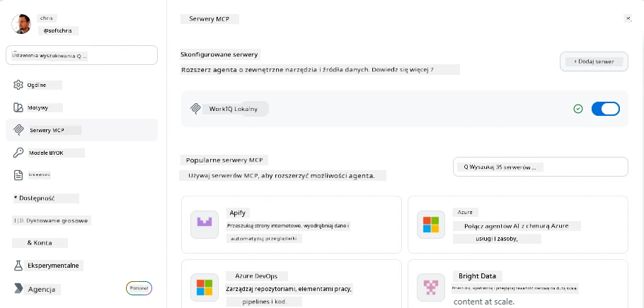
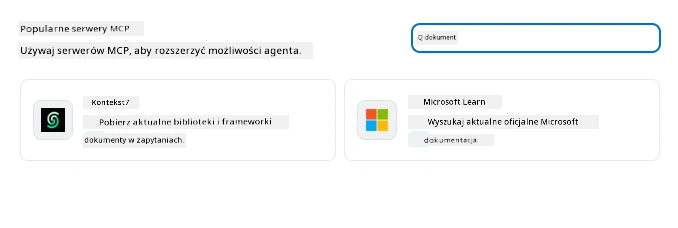
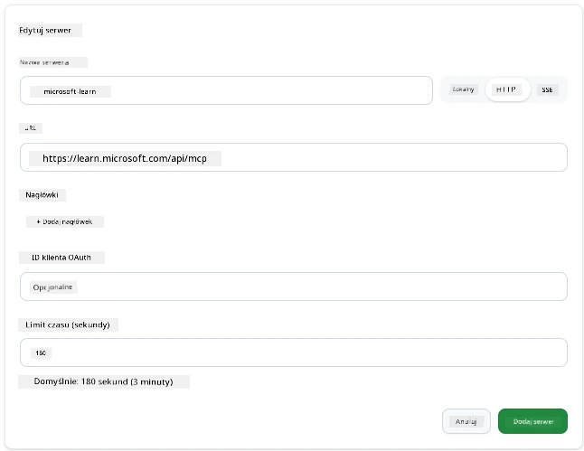
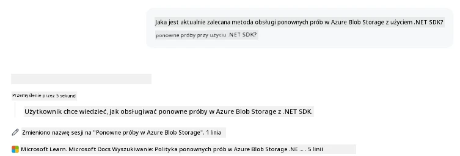
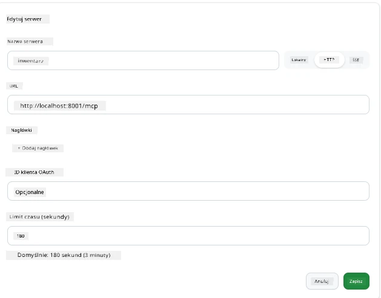
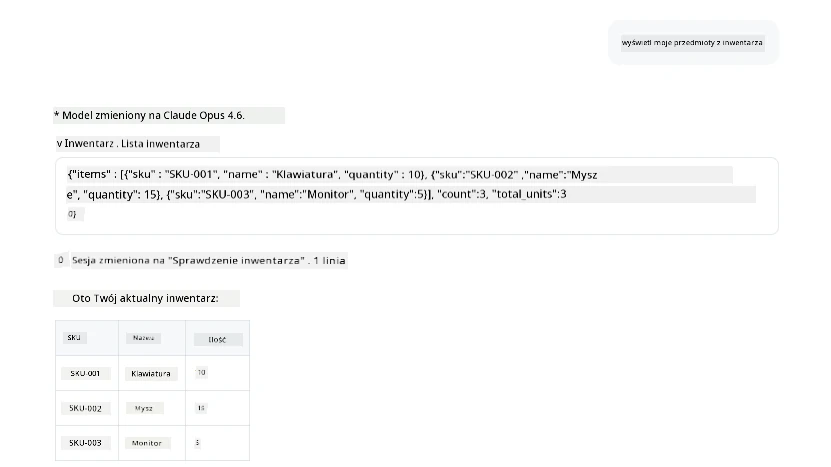
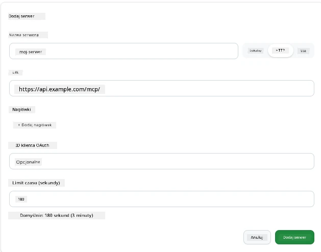
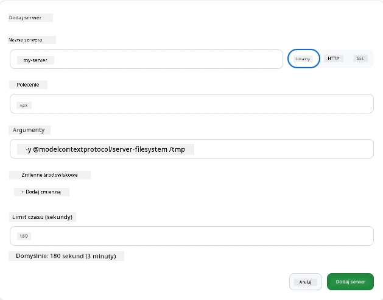

# Korzystanie z serwerów MCP w aplikacji GitHub Copilot

Teraz już wiesz, jak działa MCP. Zbudowałeś serwery, zdefiniowałeś narzędzia i zasoby oraz podłączyłeś klientów. Czego jeszcze nie zrobiliśmy, to zmiana perspektywy: zamiast tworzyć serwer, jak to wygląda po *stronie konsumenta* — jako użytkownik aplikacji wspieranej przez AI, która obsługuje MCP?

[GitHub Copilot App](https://github.com/github/app) to aplikacja desktopowa, która może korzystać z serwerów MCP. Podłączając do niej serwery MCP, odblokowujesz nowy poziom: Copilot może teraz sięgać do twojej dokumentacji, wywoływać wewnętrzne API, przeszukiwać bazę danych lub komunikować się z dowolną usługą owinętą w serwer. Aplikacja staje się hostem; twoje serwery MCP stają się jej narzędziami.

Ta lekcja przeprowadzi cię przez to doświadczenie krok po kroku — od znalezienia panelu ustawień MCP, poprzez podłączenie prawdziwego serwera dokumentacji, aż po skonfigurowanie własnego, niestandardowego.

## Cele nauki

Na koniec tej lekcji będziesz potrafił:

- Zlokalizować i poruszać się po panelu serwerów MCP w ustawieniach aplikacji Copilot.
- Podłączyć hostowany serwer dokumentacji i używać go podczas sesji.
- Zarejestrować niestandardowy serwer oraz zweryfikować, że Copilot może wywoływać jego narzędzia.
- Skonfigurować sposób wywoływania serwera, dostarczając zmienne środowiskowe lub niestandardowe nagłówki (jeśli HTTP).

## Aplikacja Copilot jako host MCP

Oto podstawowa idea: **agenci Copilota są inteligentni, ale wiedzą tylko tyle, ile im powiesz.** Domyślnie agent może czytać pliki w twoim obszarze roboczym i wykonywać polecenia terminala, ale nie może zapytać bazy danych, zajrzeć do kalendarza ani wywołać niestandardowego API bez wsparcia. Tu wchodzą w grę serwery MCP. Działają jako mosty między Copilotem a twoimi systemami — bazami danych, kontrolą wersji, API, narzędziami do projektowania — dając agentom dostęp do potrzebnych informacji i czynności do wykonania pracy.

Zacznijmy od znalezienia ustawień zarządzania serwerami MCP w twojej aplikacji.

## Krok 1: Znalezienie panelu ustawień MCP

Otwórz aplikację Copilot i znajdź ikonę koła zębatego w lewym dolnym rogu, kliknij ją.


Upewnij się, że wybrałeś "MCP Servers" i teraz powinieneś zobaczyć swoje skonfigurowane serwery u góry, rynek popularnych serwerów na dole oraz przycisk "Add Server" na górze, tak jak tutaj:



To twoje centrum sterowania. Tutaj dodajesz, usuwasz, włączasz i wyłączasz serwery. Zmiany będą miały zastosowanie do nowych sesji; jeśli masz otwartą sesję, po zmianie listy musisz rozpocząć nową.

## Krok 2: Podłączenie serwera dokumentacji

Zróbmy coś od razu przydatnego. Serwer MCP Microsoft Docs daje Copilotowi dostęp do oficjalnej dokumentacji Microsoftu. Obejmuje to Azure, .NET, TypeScript i więcej. Zamiast polegać na danych treningowych agenta (które mają datę zakończenia), może pobrać aktualne dokumenty w czasie zapytania.

Oto jak go dodać:

1. W siatce popularnych serwerów wpisz **learn** i wybierz serwer o nazwie "Microsoft Learn".

   

   Po kliknięciu pojawi się formularz, gdzie nazwa, typ transportu i URL są wstępnie wypełnione, pozostało tylko kliknąć "Add Server".

2. Kliknij "Add Server", połączenie z serwerem powinno zająć kilka sekund.

   

   Po dodaniu powinien pojawić się na górze jako skonfigurowany serwer. Wypróbujmy go teraz.

3. Zamknij okno i wybierz "Quick chat".

4. Wpisz poniższy prompt, aby wywołać narzędzie na serwerze Microsoft Learn.

   ```text
   What's the current recommended approach for handling Azure Blob Storage 
   retries using the .NET SDK?
   ```

   

Powinieneś zobaczyć, jak odnosi się do właśnie dodanego serwera MCP.

## Krok 3: Podłączenie niestandardowego serwera stdio

Presety są wygodne, ale prawdziwa moc to podłączanie własnych serwerów. Załóżmy, że zbudowałeś serwer (lub ktoś ci go dostarczył), który udostępnia twoje wewnętrzne API lub firmową bazę wiedzy. W tym przykładzie użyjemy serwera MCP, który stworzyliśmy, obsługującego zarządzanie zapasami firmy.

1. Kliknij koło zębate i znów wybierz "MCP servers".

2. Wybierz przycisk "Add Server", a potem "+ Add Custom server", wpisz następujące wartości:

   - Nazwa: `Inventory Server`
   - Wybierz transport (z prawej), **http**

   Kliknij "Add Server", powinien pojawić się na liście skonfigurowanych serwerów.

   

4. Aby przetestować, wywołaj prompt taki jak ten:

    ```
    list inventory
    ```

   

   Teraz powinieneś zobaczyć listę pozycji magazynowych zwróconych z twojego niestandardowego serwera.

Świetnie, teraz masz dobrą orientację, jak dodawać zewnętrzne i własne serwery MCP do aplikacji Copilot. Następnie omówimy obsługę sekretów i zmiennych środowiskowych.

## Krok 4: Zaawansowane ustawienia

Do tej pory widziałeś, jak dodawać serwery MCP, podając tylko nazwę i URL. Ale co jeśli twój serwer wymaga klucza API lub innej wartości? W zależności od typu transportu, możemy mu to zapewnić.

- **transport http lub SSE**: Możemy ustawić nagłówki według potrzeb.

   Dla autoryzacji możesz określić nagłówek Authorization, np. wartość może być statycznym ciągiem znaków. Jeśli używasz OAuth, zamiast tego możesz podać identyfikator klienta OAuth.

   

- **transport stdio**: Można ustawić zmienne środowiskowe.

   Tutaj możesz podać dowolną liczbę zmiennych środowiskowych, które mają być przekazywane do serwera przy jego uruchomieniu.

   

## Podsumowanie

Aplikacja Copilot traktuje serwery MCP jako pierwszorzędne rozszerzenia możliwości agenta. W tej lekcji przeszedłeś pełną ścieżkę od dodawania serwerów MCP do ich używania podczas sesji. Możesz teraz łączyć się z serwerami publicznymi, wewnętrznymi API i niestandardowymi narzędziami, dając agentom zdolność dostępu do informacji i wykonywania działań potrzebnych do samodzielnego realizowania zadań.

## 📚 Dodatkowe zasoby

### Oficjalna dokumentacja

- [GitHub Copilot App](https://github.com/github/app)
- [Specyfikacja MCP](https://modelcontextprotocol.io/specification/2025-03-26) - Specyfikacja Model Context Protocol

### Społeczność
- [MCP Community Discord](https://discord.com/invite/ByRwuEEgH4) - Dyskusje na żywo
- [GitHub Discussions](https://github.com/microsoft/MCP-Server-and-PostgreSQL-Sample-Retail/discussions) - Q&A i dzielenie się
- [Stack Overflow](https://stackoverflow.com/questions/tagged/model-context-protocol) - Pytania techniczne

---

<!-- CO-OP TRANSLATOR DISCLAIMER START -->
**Zastrzeżenie**:
Niniejszy dokument został przetłumaczony za pomocą usługi tłumaczenia AI [Co-op Translator](https://github.com/Azure/co-op-translator). Choć dążymy do dokładności, prosimy pamiętać, że automatyczne tłumaczenia mogą zawierać błędy lub niedokładności. Oryginalny dokument w jego języku źródłowym należy uznawać za autorytatywne źródło. W przypadku informacji krytycznych zalecane jest skorzystanie z profesjonalnego tłumaczenia wykonanego przez człowieka. Nie ponosimy odpowiedzialności za jakiekolwiek nieporozumienia lub błędne interpretacje wynikające z użycia tego tłumaczenia.
<!-- CO-OP TRANSLATOR DISCLAIMER END -->