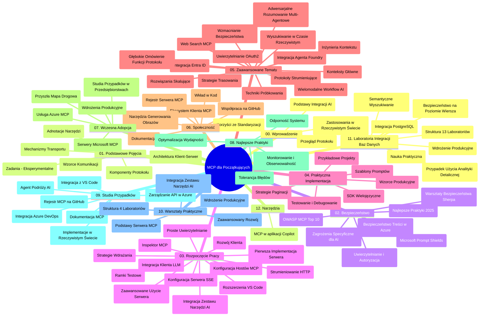

# Protokół Kontekstu Modelu (MCP) dla Początkujących - Przewodnik do Nauki

Ten przewodnik do nauki przedstawia przegląd struktury i zawartości repozytorium dla programu nauczania „Protokół Kontekstu Modelu (MCP) dla Początkujących”. Użyj tego przewodnika, aby efektywnie poruszać się po repozytorium i maksymalnie wykorzystać dostępne zasoby.

## Przegląd Repozytorium

Protokół Kontekstu Modelu (MCP) to ustandaryzowany framework dla interakcji pomiędzy modelami AI a aplikacjami klienckimi. Początkowo stworzony przez Anthropic, MCP jest obecnie utrzymywany przez szerszą społeczność MCP poprzez oficjalną organizację GitHub. To repozytorium oferuje kompleksowy program nauczania z praktycznymi przykładami kodu w C#, Java, JavaScript, Python i TypeScript, przeznaczony dla deweloperów AI, architektów systemów i inżynierów oprogramowania.

## Wizualna Mapa Programu Nauczania

## Struktura Repozytorium

Repozytorium jest zorganizowane w dwanaście głównych sekcji, z których każda skupia się na różnych aspektach MCP:

1. **Wprowadzenie (00-Introduction/)**
   - Przegląd Protokółu Kontekstu Modelu
   - Dlaczego standaryzacja jest ważna w pipeline’ach AI
   - Praktyczne zastosowania i korzyści

2. **Podstawowe Koncepcje (01-CoreConcepts/)**
   - Architektura klient-serwer
   - Kluczowe komponenty protokołu
   - Wzorce komunikacji w MCP

3. **Bezpieczeństwo (02-Security/)**
   - Zagrożenia bezpieczeństwa w systemach opartych na MCP
   - Najlepsze praktyki zabezpieczania implementacji
   - Strategie uwierzytelniania i autoryzacji
   - **Kompleksowa dokumentacja bezpieczeństwa**:
     - MCP Security Best Practices 2025
     - Przewodnik wdrożenia Azure Content Safety
     - Kontrole i techniki bezpieczeństwa MCP
     - Szybkie odniesienie najlepszych praktyk MCP
   - **Kluczowe tematy bezpieczeństwa**:
     - Ataki wstrzykiwania promptów i zatruwania narzędzi
     - Przejęcie sesji i problemy z pomylonym pełnomocnikiem
     - Luki w przekazywaniu tokenów
     - Nadmierne uprawnienia i kontrola dostępu
     - Bezpieczeństwo łańcucha dostaw dla komponentów AI
     - Integracja Microsoft Prompt Shields

4. **Pierwsze Kroki (03-GettingStarted/)**
   - Konfiguracja i przygotowanie środowiska
   - Tworzenie podstawowych serwerów i klientów MCP
   - Integracja z istniejącymi aplikacjami
   - Zawiera sekcje dotyczące:
     - Pierwszej implementacji serwera
     - Rozwoju klienta
     - Integracji klienta LLM
     - Integracji z VS Code
     - Serwera zdarzeń Server-Sent Events (SSE)
     - Zaawansowanego użycia serwera
     - HTTP streaming
     - Integracji AI Toolkit
     - Strategii testowania
     - Wytycznych dotyczących wdrożeń

5. **Praktyczna Implementacja (04-PracticalImplementation/)**
   - Użycie SDK w różnych językach programowania
   - Techniki debugowania, testowania i walidacji
   - Tworzenie wielokrotnego użytku wzorców promptów i przepływów pracy
   - Przykładowe projekty z przykładami implementacji

6. **Tematy Zaawansowane (05-AdvancedTopics/)**
   - Techniki inżynierii kontekstu
   - Integracja agenta Foundry
   - Wielomodalne przepływy pracy AI
   - Demonstracje uwierzytelniania OAuth2
   - Możliwości wyszukiwania w czasie rzeczywistym
   - Streaming w czasie rzeczywistym
   - Implementacja kontekstów głównych (root contexts)
   - Strategie trasowania
   - Techniki próbkowania
   - Podejścia do skalowania
   - Rozważania dotyczące bezpieczeństwa
   - Integracja zabezpieczeń Entra ID
   - Integracja z wyszukiwaniem w sieci
   - Adwersarialne rozumowanie wieloagentowe (wzorce debat)

7. **Wkład Społeczności (06-CommunityContributions/)**
   - Jak wnosić kod i dokumentację
   - Współpraca przez GitHub
   - Ulepszenia i informacje zwrotne od społeczności
   - Używanie różnych klientów MCP (Claude Desktop, Cline, VSCode)
   - Praca z popularnymi serwerami MCP, w tym generowaniem obrazów

8. **Leki z Wczesnej Adopcji (07-LessonsfromEarlyAdoption/)**
   - Realne implementacje i historie sukcesu
   - Budowa i wdrażanie rozwiązań opartych na MCP
   - Trendy i przyszła mapa drogowa
   - **Przewodnik po serwerach Microsoft MCP**: Kompleksowy przewodnik po 10 gotowych do produkcji serwerach MCP Microsoft, w tym:
     - Microsoft Learn Docs MCP Server
     - Azure MCP Server (15+ wyspecjalizowanych konektorów)
     - GitHub MCP Server
     - Azure DevOps MCP Server
     - MarkItDown MCP Server
     - SQL Server MCP Server
     - Playwright MCP Server
     - Dev Box MCP Server
     - Microsoft Foundry MCP Server
     - Microsoft 365 Agents Toolkit MCP Server

9. **Najlepsze Praktyki (08-BestPractices/)**
   - Strojenie wydajności i optymalizacja
   - Projektowanie odpornych na błędy systemów MCP
   - Strategie testowania i odporności

10. **Studia Przypadków (09-CaseStudy/)**
    - **Siedem kompleksowych studiów przypadków** demonstrujących wszechstronność MCP w różnych scenariuszach:
    - **Azure AI Travel Agents**: Wieloagentowa orkiestracja z Azure OpenAI i AI Search
    - **Integracja Azure DevOps**: Automatyzacja procesów workflow na podstawie danych z YouTube
    - **Pobieranie dokumentacji w czasie rzeczywistym**: Klient konsoli Python z HTTP streaming
    - **Interaktywny generator planów nauki**: Aplikacja webowa Chainlit z rozmownym AI
    - **Dokumentacja w edytorze**: Integracja VS Code z workflow GitHub Copilot
    - **Azure API Management**: Integracja przedsiębiorstw z API i tworzenie serwera MCP
    - **Rejestr MCP na GitHub**: Rozwój ekosystemu i platforma integracji agentów
    - Przykłady implementacji obejmujące integrację przedsiębiorstw, produktywność deweloperów i rozwój ekosystemu

11. **Warsztat Praktyczny (10-StreamliningAIWorkflowsBuildingAnMCPServerWithAIToolkit/)**
    - Kompleksowy warsztat praktyczny łączący MCP z AI Toolkit
    - Tworzenie inteligentnych aplikacji łączących modele AI z narzędziami świata rzeczywistego
    - Praktyczne moduły obejmujące podstawy, tworzenie własnych serwerów i strategie wdrażania produkcyjnego
    - **Struktura laboratorium**:
      - Laboratorium 1: Podstawy serwera MCP
      - Laboratorium 2: Zaawansowany rozwój serwera MCP
      - Laboratorium 3: Integracja AI Toolkit
      - Laboratorium 4: Wdrożenie produkcyjne i skalowanie
    - Podejście oparte na laboratoriach z instrukcjami krok po kroku

12. **Laboratoria Integracji Serwerów MCP z Bazą Danych (11-MCPServerHandsOnLabs/)**
    - **Kompleksowa ścieżka nauki z 13 laboratoriami** do tworzenia produkcyjnych serwerów MCP z integracją PostgreSQL
    - **Implementacja analityki sprzedaży detalicznej w oparciu o przypadek użycia Zava Retail**
    - **Wzorce klasy korporacyjnej** obejmujące Row Level Security (RLS), wyszukiwanie semantyczne i dostęp wielodostępny (multi-tenant)
    - **Kompletna struktura laboratoriów**:
      - **Laboratoria 00-03: Podstawy** - Wprowadzenie, architektura, bezpieczeństwo, konfiguracja środowiska
      - **Laboratoria 04-06: Budowa serwera MCP** - Projektowanie bazy danych, implementacja MCP serwera, rozwój narzędzi
      - **Laboratoria 07-09: Funkcje zaawansowane** - Wyszukiwanie semantyczne, testowanie i debugowanie, integracja VS Code
      - **Laboratoria 10-12: Produkcja i najlepsze praktyki** - Wdrażanie, monitorowanie, optymalizacja
    - **Technologie w laboratoriach**: Framework FastMCP, PostgreSQL, Azure OpenAI, Azure Container Apps, Application Insights
    - **Efekty nauki**: Produkcyjne serwery MCP, wzorce integracji baz danych, analityka wspierana AI, bezpieczeństwo klasy korporacyjnej

13. **Narzędzia (12-tooling/)**
    - Nauka używania MCP w aplikacji Copilot i innych narzędziach

## Dodatkowe Zasoby

Repozytorium zawiera materiały wspierające:

- **Folder Images**: Zawiera diagramy i ilustracje używane w programie nauczania
- **Tłumaczenia**: Wsparcie wielojęzyczne z automatycznymi tłumaczeniami dokumentacji
- **Oficjalne zasoby MCP**:
  - [MCP Documentation](https://modelcontextprotocol.io/)
  - [MCP Specification](https://spec.modelcontextprotocol.io/)
  - [MCP GitHub Repository](https://github.com/modelcontextprotocol)

## Jak Korzystać z Tego Repozytorium

1. **Nauka sekwencyjna**: Przechodź przez rozdziały po kolei (od 00 do 11) dla uporządkowanego procesu nauki.
2. **Skupienie językowe**: Jeśli interesuje Cię konkretny język programowania, eksploruj katalogi z przykładami w preferowanym języku.
3. **Praktyczna implementacja**: Zacznij od sekcji „Pierwsze kroki”, aby skonfigurować środowisko i utworzyć swój pierwszy serwer i klient MCP.
4. **Zaawansowane eksploracje**: Gdy opanujesz podstawy, zagłęb się w tematy zaawansowane, aby poszerzyć swoją wiedzę.
5. **Zaangażowanie społeczności**: Dołącz do społeczności MCP poprzez dyskusje na GitHub i kanały Discord, aby łączyć się z ekspertami i innymi deweloperami.

## Klienci i Narzędzia MCP

Program nauczania obejmuje różnorodne klientów i narzędzia MCP:

1. **Oficjalni klienci**:
   - Visual Studio Code
   - MCP w Visual Studio Code
   - Claude Desktop
   - Claude w VSCode
   - Claude API

2. **Klienci społecznościowi**:
   - Cline (terminalowy)
   - Cursor (edytor kodu)
   - ChatMCP
   - Windsurf

3. **Narzędzia zarządzania MCP**:
   - MCP CLI
   - MCP Manager
   - MCP Linker
   - MCP Router

## Popularne Serwery MCP

Repozytorium wprowadza różne serwery MCP, w tym:

1. **Oficjalne serwery Microsoft MCP**:
   - Microsoft Learn Docs MCP Server
   - Azure MCP Server (15+ wyspecjalizowanych konektorów)
   - GitHub MCP Server
   - Azure DevOps MCP Server
   - MarkItDown MCP Server
   - SQL Server MCP Server
   - Playwright MCP Server
   - Dev Box MCP Server
   - Microsoft Foundry MCP Server
   - Microsoft 365 Agents Toolkit MCP Server

2. **Oficjalne serwery referencyjne**:
   - Filesystem
   - Fetch
   - Memory
   - Sequential Thinking

3. **Generowanie obrazów**:
   - Azure OpenAI DALL-E 3
   - Stable Diffusion WebUI
   - Replicate

4. **Narzędzia deweloperskie**:
   - Git MCP
   - Terminal Control
   - Code Assistant

5. **Specjalistyczne serwery**:
   - Salesforce
   - Microsoft Teams
   - Jira & Confluence

## Wkład w Projekt

To repozytorium zaprasza do współpracy społeczność. Zobacz sekcję Wkład Społeczności, aby poznać wskazówki, jak skutecznie wnosić swój wkład do ekosystemu MCP.

----

*Ten przewodnik do nauki został ostatnio zaktualizowany 5 lutego 2026 r., odzwierciedlając najnowszą Specyfikację MCP z 2025-11-25 i przedstawia przegląd repozytorium na ten dzień. Zawartość repozytorium może być aktualizowana po tej dacie.*

---

<!-- CO-OP TRANSLATOR DISCLAIMER START -->
**Zastrzeżenie**:
Niniejszy dokument został przetłumaczony za pomocą usługi tłumaczenia AI [Co-op Translator](https://github.com/Azure/co-op-translator). Choć dążymy do dokładności, prosimy pamiętać, że automatyczne tłumaczenia mogą zawierać błędy lub niedokładności. Oryginalny dokument w jego języku źródłowym należy uznawać za autorytatywne źródło. W przypadku informacji krytycznych zalecane jest skorzystanie z profesjonalnego tłumaczenia wykonanego przez człowieka. Nie ponosimy odpowiedzialności za jakiekolwiek nieporozumienia lub błędne interpretacje wynikające z użycia tego tłumaczenia.
<!-- CO-OP TRANSLATOR DISCLAIMER END -->