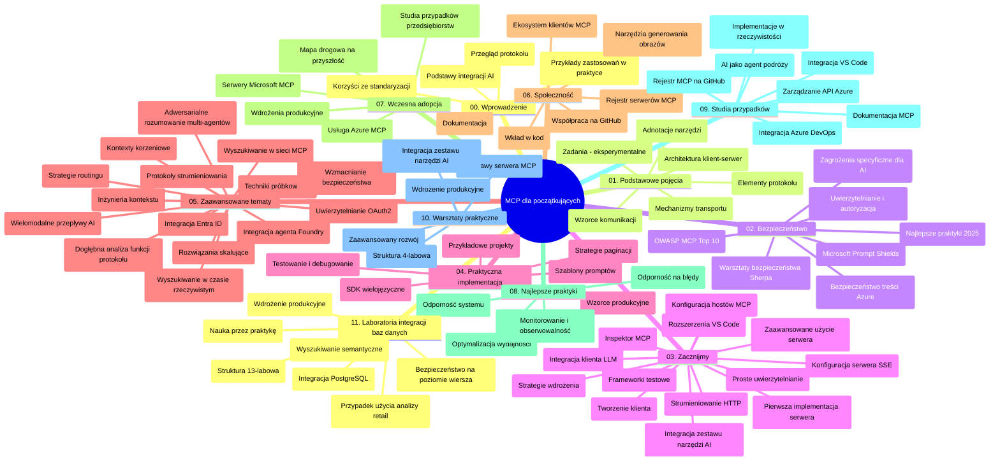

# Protokół Kontekstowy Modelu (MCP) dla początkujących - przewodnik do nauki

Ten przewodnik do nauki zawiera przegląd struktury i zawartości repozytorium dla programu nauczania „Protokół Kontekstowy Modelu (MCP) dla początkujących”. Użyj tego przewodnika, aby efektywnie poruszać się po repozytorium i wykorzystać dostępne zasoby.

## Przegląd repozytorium

Protokół Kontekstowy Modelu (MCP) to standaryzowany framework umożliwiający interakcje między modelami AI a aplikacjami klienckimi. Pierwotnie stworzony przez Anthropic, obecnie MCP jest utrzymywany przez szerszą społeczność MCP za pośrednictwem oficjalnej organizacji na GitHub. To repozytorium oferuje kompleksowy program nauczania z praktycznymi przykładami kodu w C#, Javie, JavaScript, Python oraz TypeScript, przeznaczony dla deweloperów AI, architektów systemów i inżynierów oprogramowania.

## Wizualna mapa programu nauczania

## Struktura repozytorium

Repozytorium jest podzielone na jedenaście głównych sekcji, z których każda skupia się na innych aspektach MCP:

1. **Wprowadzenie (00-Introduction/)**
   - Przegląd Protokółu Kontekstowego Modelu
   - Znaczenie standaryzacji w pipeline’ach AI
   - Praktyczne zastosowania i korzyści

2. **Podstawowe koncepcje (01-CoreConcepts/)**
   - Architektura klient-serwer
   - Kluczowe elementy protokołu
   - Wzorce komunikacyjne w MCP

3. **Bezpieczeństwo (02-Security/)**
   - Zagrożenia bezpieczeństwa w systemach opartych na MCP
   - Najlepsze praktyki zabezpieczania implementacji
   - Strategie uwierzytelniania i autoryzacji
   - **Kompleksowa dokumentacja dotycząca bezpieczeństwa**:
     - Najlepsze praktyki bezpieczeństwa MCP 2025
     - Przewodnik implementacji Azure Content Safety
     - Kontrole i techniki zabezpieczeń MCP
     - Szybkie odniesienie do najlepszych praktyk MCP
   - **Kluczowe tematy związane z bezpieczeństwem**:
     - Ataki polegające na wstrzykiwaniu promptów i zatruwaniu narzędzi
     - Przechwytywanie sesji i problemy typu confused deputy
     - Luki związane z przekazywaniem tokenów
     - Nadmierne uprawnienia i kontrola dostępu
     - Bezpieczeństwo łańcucha dostaw komponentów AI
     - Integracja Microsoft Prompt Shields

4. **Pierwsze kroki (03-GettingStarted/)**
   - Konfiguracja i ustawienia środowiska
   - Tworzenie podstawowych serwerów i klientów MCP
   - Integracja z istniejącymi aplikacjami
   - Sekcje obejmują:
     - Pierwsza implementacja serwera
     - Rozwój klienta
     - Integracja klienta LLM
     - Integracja z VS Code
     - Serwer Server-Sent Events (SSE)
     - Zaawansowane użycie serwera
     - Strumieniowanie HTTP
     - Integracja z AI Toolkit
     - Strategie testowania
     - Wytyczne dotyczące wdrożenia

5. **Praktyczna implementacja (04-PracticalImplementation/)**
   - Korzystanie z SDK w różnych językach programowania
   - Debugowanie, testowanie i techniki walidacji
   - Tworzenie wielokrotnego użytku szablonów promptów i workflow
   - Przykładowe projekty z przykładami implementacji

6. **Tematy zaawansowane (05-AdvancedTopics/)**
   - Techniki inżynierii kontekstu
   - Integracja agenta Foundry
   - Wielomodalne workflow AI
   - Demonstracje uwierzytelniania OAuth2
   - Funkcje wyszukiwania w czasie rzeczywistym
   - Strumieniowanie w czasie rzeczywistym
   - Implementacja kontekstów root
   - Strategie routingowe
   - Techniki próbkowania
   - Podejścia do skalowania
   - Rozważania bezpieczeństwa
   - Integracja bezpieczeństwa Entra ID
   - Integracja wyszukiwania w sieci
   - Adwersacyjne rozumowanie multi-agentowe (wzorce debaty)

7. **Wkład społeczności (06-CommunityContributions/)**
   - Jak wnieść kod i dokumentację
   - Współpraca przez GitHub
   - Udoskonalenia i opinie inicjowane przez społeczność
   - Korzystanie z różnych klientów MCP (Claude Desktop, Cline, VSCode)
   - Praca z popularnymi serwerami MCP, w tym generowaniem obrazów

8. **Lekcje z wczesnej adopcji (07-LessonsfromEarlyAdoption/)**
   - Praktyczne implementacje i historii sukcesu
   - Budowa i wdrażanie rozwiązań opartych na MCP
   - Trendy i przyszła mapa drogowa
   - **Przewodnik po serwerach MCP Microsoft**: Kompleksowy przewodnik po 10 serwerach MCP Microsoft gotowych do produkcji, w tym:
     - Microsoft Learn Docs MCP Server
     - Azure MCP Server (15+ specjalistycznych konektorów)
     - GitHub MCP Server
     - Azure DevOps MCP Server
     - MarkItDown MCP Server
     - SQL Server MCP Server
     - Playwright MCP Server
     - Dev Box MCP Server
     - Microsoft Foundry MCP Server
     - Microsoft 365 Agents Toolkit MCP Server

9. **Najlepsze praktyki (08-BestPractices/)**
   - Dostosowywanie wydajności i optymalizacja
   - Projektowanie systemów MCP odpornych na błędy
   - Strategie testowania i odporności

10. **Studia przypadków (09-CaseStudy/)**
    - **Siedem kompleksowych studiów przypadków** pokazujących wszechstronność MCP w różnych scenariuszach:
    - **Azure AI Travel Agents**: Wieloagentowa orkiestracja z Azure OpenAI i AI Search
    - **Integracja Azure DevOps**: Automatyzacja procesów workflow za pomocą aktualizacji danych z YouTube
    - **Pobieranie dokumentacji w czasie rzeczywistym**: Klient konsolowy Pythona ze strumieniowaniem HTTP
    - **Interaktywny generator planów nauki**: Aplikacja webowa Chainlit z konwersacyjnym AI
    - **Dokumentacja w edytorze**: Integracja VS Code z workflow GitHub Copilot
    - **Azure API Management**: Integracja API klasy enterprise z tworzeniem serwera MCP
    - **Rejestr MCP GitHub**: Rozwój ekosystemu i platforma integracji agentów
    - Przykłady implementacji obejmujące integrację w przedsiębiorstwie, produktywność deweloperów i rozwój ekosystemu

11. **Warsztaty praktyczne (10-StreamliningAIWorkflowsBuildingAnMCPServerWithAIToolkit/)**
    - Kompleksowe warsztaty praktyczne łączące MCP z AI Toolkit
    - Budowa inteligentnych aplikacji łączących modele AI z narzędziami ze świata rzeczywistego
    - Praktyczne moduły obejmujące podstawy, tworzenie niestandardowych serwerów i strategie wdrożenia produkcyjnego
    - **Struktura laboratorium**:
      - Laboratorium 1: Podstawy serwera MCP
      - Laboratorium 2: Zaawansowany rozwój serwera MCP
      - Laboratorium 3: Integracja AI Toolkit
      - Laboratorium 4: Wdrożenie produkcyjne i skalowanie
    - Podejście oparte na labach z instrukcjami krok po kroku

12. **Laboratoria integracji baz danych serwera MCP (11-MCPServerHandsOnLabs/)**
    - **Kompletny, 13-laboratoryjny kurs** budowy produkcyjnych serwerów MCP z integracją PostgreSQL
    - **Zastosowanie w rzeczywistej analizie retailowej** z użyciem przypadku Zava Retail
    - **Wzorce klasy enterprise**, w tym Row Level Security (RLS), wyszukiwanie semantyczne i dostęp wielonajemcowy do danych
    - **Pełna struktura laboratorium**:
      - **Laby 00-03: Podstawy** – Wprowadzenie, architektura, bezpieczeństwo, konfiguracja środowiska
      - **Laby 04-06: Budowa serwera MCP** – Projekt bazy danych, implementacja serwera MCP, rozwój narzędzi
      - **Laby 07-09: Zaawansowane funkcje** – Wyszukiwanie semantyczne, testowanie i debugowanie, integracja z VS Code
      - **Laby 10-12: Produkcja i najlepsze praktyki** – Wdrożenie, monitoring, optymalizacja
    - **Technologie objęte kursem**: framework FastMCP, PostgreSQL, Azure OpenAI, Azure Container Apps, Application Insights
    - **Efekty nauki**: Produkcyjne serwery MCP, wzorce integracji baz danych, analityka wspierana AI, bezpieczeństwo klasy enterprise

## Dodatkowe zasoby

Repozytorium zawiera zasoby wspierające:

- **Folder Images**: Zawiera diagramy i ilustracje wykorzystywane w programie
- **Tłumaczenia**: Wsparcie wielojęzyczne i zautomatyzowane tłumaczenia dokumentacji
- **Oficjalne zasoby MCP**:
  - [Dokumentacja MCP](https://modelcontextprotocol.io/)
  - [Specyfikacja MCP](https://spec.modelcontextprotocol.io/)
  - [Repozytorium MCP na GitHub](https://github.com/modelcontextprotocol)

## Jak korzystać z repozytorium

1. **Uczenie się kolejno**: Podążaj za rozdziałami w kolejności (od 00 do 11) dla uporządkowanego przebiegu nauki.
2. **Skupienie na wybranym języku**: Jeśli interesuje Cię konkretny język programowania, eksploruj foldery z przykładami implementacji w preferowanym języku.
3. **Praktyczna implementacja**: Zacznij od sekcji „Getting Started”, aby skonfigurować środowisko i stworzyć pierwszy serwer i klient MCP.
4. **Eksploracja zaawansowana**: Po opanowaniu podstaw, zagłęb się w tematy zaawansowane, aby poszerzyć wiedzę.
5. **Zaangażowanie społeczności**: Dołącz do społeczności MCP poprzez dyskusje na GitHub i kanały Discord, aby łączyć się z ekspertami i innymi deweloperami.

## Klienci i narzędzia MCP

Program obejmuje różne klientów i narzędzia MCP:

1. **Klienci oficjalni**:
   - Visual Studio Code
   - MCP w Visual Studio Code
   - Claude Desktop
   - Claude w VSCode
   - Claude API

2. **Klienci społecznościowi**:
   - Cline (terminalowy)
   - Cursor (edytor kodu)
   - ChatMCP
   - Windsurf

3. **Narzędzia zarządzania MCP**:
   - MCP CLI
   - MCP Manager
   - MCP Linker
   - MCP Router

## Popularne serwery MCP

Repozytorium prezentuje różne serwery MCP, w tym:

1. **Oficjalne serwery Microsoft MCP**:
   - Microsoft Learn Docs MCP Server
   - Azure MCP Server (15+ specjalistycznych konektorów)
   - GitHub MCP Server
   - Azure DevOps MCP Server
   - MarkItDown MCP Server
   - SQL Server MCP Server
   - Playwright MCP Server
   - Dev Box MCP Server
   - Microsoft Foundry MCP Server
   - Microsoft 365 Agents Toolkit MCP Server

2. **Oficjalne serwery referencyjne**:
   - Filesystem
   - Fetch
   - Memory
   - Sequential Thinking

3. **Generowanie obrazów**:
   - Azure OpenAI DALL-E 3
   - Stable Diffusion WebUI
   - Replicate

4. **Narzędzia developerskie**:
   - Git MCP
   - Terminal Control
   - Code Assistant

5. **Serwery specjalistyczne**:
   - Salesforce
   - Microsoft Teams
   - Jira & Confluence

## Współtworzenie

To repozytorium z radością przyjmuje wkład społeczności. Zobacz sekcję Wkład społeczności, aby dowiedzieć się, jak skutecznie przyczyniać się do ekosystemu MCP.

----

*Ten przewodnik do nauki był ostatnio aktualizowany 5 lutego 2026 roku, odzwierciedlając najnowszą Specyfikację MCP z 2025-11-25 i przedstawia przegląd repozytorium na ten dzień. Zawartość repozytorium może być aktualizowana po tej dacie.*

---

<!-- CO-OP TRANSLATOR DISCLAIMER START -->
**Zastrzeżenie**:
Niniejszy dokument został przetłumaczony za pomocą usługi tłumaczenia AI [Co-op Translator](https://github.com/Azure/co-op-translator). Choć dążymy do dokładności, prosimy pamiętać, że automatyczne tłumaczenia mogą zawierać błędy lub niedokładności. Oryginalny dokument w jego języku źródłowym należy uznawać za autorytatywne źródło. W przypadku informacji krytycznych zalecane jest skorzystanie z profesjonalnego tłumaczenia wykonanego przez człowieka. Nie ponosimy odpowiedzialności za jakiekolwiek nieporozumienia lub błędne interpretacje wynikające z użycia tego tłumaczenia.
<!-- CO-OP TRANSLATOR DISCLAIMER END -->