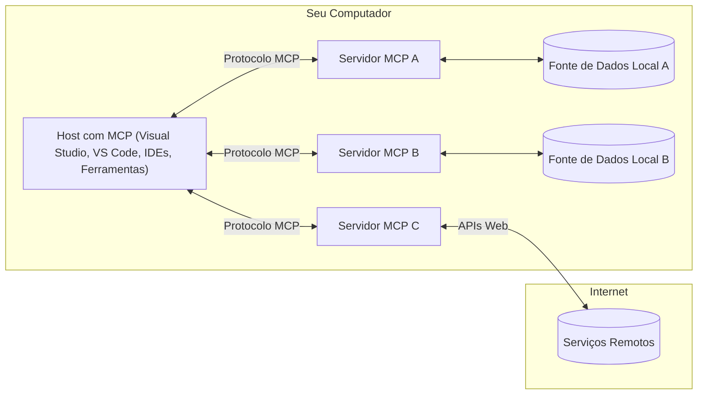

# Conceitos Centrais do MCP: Dominando o Protocolo de Contexto do Modelo para Integração de IA

[](https://youtu.be/earDzWGtE84)

_(Clique na imagem acima para assistir ao vídeo desta aula)_

O [Protocolo de Contexto do Modelo (MCP)](https://github.com/modelcontextprotocol) é uma estrutura poderosa e padronizada que otimiza a comunicação entre Grandes Modelos de Linguagem (LLMs) e ferramentas externas, aplicativos e fontes de dados.  
Este guia vai conduzi-lo pelos conceitos centrais do MCP. Você aprenderá sobre sua arquitetura cliente-servidor, componentes essenciais, mecânica de comunicação e melhores práticas de implementação.

- **Consentimento Explícito do Usuário**: Todo acesso a dados e operações requer aprovação explícita do usuário antes da execução. Os usuários devem compreender claramente quais dados serão acessados e quais ações serão realizadas, com controle granular sobre permissões e autorizações.

- **Proteção da Privacidade dos Dados**: Os dados do usuário são expostos apenas com consentimento explícito e devem ser protegidos por controles robustos de acesso durante todo o ciclo de vida da interação. Implementações devem prevenir transmissão não autorizada de dados e manter fronteiras estritas de privacidade.

- **Segurança na Execução de Ferramentas**: Toda invocação de ferramenta requer consentimento explícito do usuário com entendimento claro da funcionalidade da ferramenta, parâmetros e impacto potencial. Limites robustos de segurança previnem execuções indesejadas, inseguras ou maliciosas.

- **Segurança na Camada de Transporte**: Todos os canais de comunicação devem usar mecanismos apropriados de criptografia e autenticação. Conexões remotas devem implementar protocolos seguros de transporte e gerenciamento adequado de credenciais.

#### Diretrizes de Implementação:

- **Gerenciamento de Permissões**: Implemente sistemas de permissão granulares que permitam aos usuários controlar quais servidores, ferramentas e recursos estão acessíveis  
- **Autenticação e Autorização**: Use métodos seguros de autenticação (OAuth, chaves API) com gerenciamento adequado de tokens e expiração  
- **Validação de Entrada**: Valide todos os parâmetros e entradas de dados conforme esquemas definidos para prevenir ataques de injeção  
- **Registro de Auditoria**: Mantenha logs abrangentes de todas as operações para monitoramento de segurança e conformidade

## Visão Geral

Esta aula explora a arquitetura fundamental e os componentes que constituem o ecossistema do Protocolo de Contexto do Modelo (MCP). Você aprenderá sobre a arquitetura cliente-servidor, componentes-chave e mecanismos de comunicação que viabilizam as interações MCP.

## Objetivos Principais de Aprendizagem

Ao final desta aula, você irá:

- Compreender a arquitetura cliente-servidor do MCP.  
- Identificar os papéis e responsabilidades dos Hosts, Clientes e Servidores.  
- Analisar as características centrais que tornam o MCP uma camada de integração flexível.  
- Aprender como as informações fluem dentro do ecossistema MCP.  
- Obter insights práticos através de exemplos de código em .NET, Java, Python e JavaScript.

## Arquitetura MCP: Um Mergulho Profundo

O ecossistema MCP é construído sobre um modelo cliente-servidor. Esta estrutura modular permite que aplicações de IA interajam eficientemente com ferramentas, bancos de dados, APIs e recursos contextuais. Vamos decompor esta arquitetura em seus componentes centrais.

No seu núcleo, o MCP segue uma arquitetura cliente-servidor onde um aplicativo host pode conectar-se a múltiplos servidores:


- **Hosts MCP**: Programas como VSCode, Claude Desktop, IDEs ou ferramentas de IA que desejam acessar dados via MCP  
- **Clientes MCP**: Clientes do protocolo que mantêm conexões 1:1 com servidores  
- **Servidores MCP**: Programas leves que expõem capacidades específicas através do Protocolo de Contexto do Modelo padronizado  
- **Fontes de Dados Locais**: Arquivos, bancos de dados e serviços do seu computador que os servidores MCP podem acessar com segurança  
- **Serviços Remotos**: Sistemas externos disponíveis pela internet que servidores MCP podem conectar via APIs.

O Protocolo MCP é um padrão em evolução que utiliza versionamento baseado em datas (formato AAAA-MM-DD). A versão atual do protocolo é **2025-11-25**. Você pode consultar as últimas atualizações na [especificação do protocolo](https://modelcontextprotocol.io/specification/2025-11-25/)

### 1. Hosts

No Protocolo de Contexto do Modelo (MCP), **Hosts** são aplicações de IA que funcionam como a interface principal pela qual os usuários interagem com o protocolo. Hosts coordenam e gerenciam conexões com múltiplos servidores MCP criando clientes MCP dedicados para cada conexão de servidor. Exemplos de Hosts incluem:

- **Aplicações de IA**: Claude Desktop, Visual Studio Code, Claude Code  
- **Ambientes de Desenvolvimento**: IDEs e editores de código com integração MCP  
- **Aplicações Personalizadas**: Agentes e ferramentas de IA construídos sob medida

**Hosts** são aplicações que coordenam as interações com modelos de IA. Elas:

- **Orquestram Modelos de IA**: Executam ou interagem com LLMs para gerar respostas e coordenar fluxos de IA  
- **Gerenciam Conexões de Clientes**: Criam e mantêm um cliente MCP por conexão a servidor MCP  
- **Controlam a Interface do Usuário**: Gerenciam o fluxo da conversa, interações dos usuários e apresentação das respostas  
- **Imponham Segurança**: Controlam permissões, restrições de segurança e autenticação  
- **Administram Consentimento do Usuário**: Gerenciam aprovação do usuário para compartilhamento de dados e execução de ferramentas

### 2. Clientes

**Clientes** são componentes essenciais que mantêm conexões dedicadas um-para-um entre Hosts e servidores MCP. Cada cliente MCP é instanciado pelo Host para conectar-se a um servidor MCP específico, garantindo canais de comunicação organizados e seguros. Multiplos clientes permitem que Hosts conectem-se a vários servidores ao mesmo tempo.

**Clientes** são componentes de conexão dentro do aplicativo host. Eles:

- **Comunicação do Protocolo**: Enviam requisições JSON-RPC 2.0 aos servidores com prompts e instruções  
- **Negociação de Capacidades**: Negociam recursos suportados e versões do protocolo com servidores durante a inicialização  
- **Execução de Ferramentas**: Gerenciam requisições de execução de ferramentas vindas dos modelos e processam respostas  
- **Atualizações em Tempo Real**: Lidam com notificações e atualizações em tempo real dos servidores  
- **Processamento de Respostas**: Processam e formatam respostas dos servidores para exibição aos usuários

### 3. Servidores

**Servidores** são programas que fornecem contexto, ferramentas e capacidades aos clientes MCP. Podem executar localmente (na mesma máquina que o Host) ou remotamente (em plataformas externas) e são responsáveis por atender às requisições dos clientes e prover respostas estruturadas. Servidores expõem funcionalidades específicas através do Protocolo de Contexto do Modelo padronizado.

**Servidores** são serviços que fornecem contexto e capacidades. Eles:

- **Registro de Funcionalidades**: Registram e expõem primitivas disponíveis (recursos, prompts, ferramentas) para os clientes  
- **Processamento de Requisições**: Recebem e executam chamadas de ferramentas, requisições de recursos e prompts dos clientes  
- **Fornecimento de Contexto**: Proporcionam informações contextuais e dados para enriquecer as respostas do modelo  
- **Gerenciamento de Estado**: Mantêm o estado da sessão e lidam com interações com estado quando necessário  
- **Notificações em Tempo Real**: Enviam notificações sobre mudanças de capacidades e atualizações para clientes conectados

Servidores podem ser desenvolvidos por qualquer pessoa para expandir as capacidades dos modelos com funcionalidades especializadas, e suportam cenários de implantação local e remota.

### 4. Primitivas do Servidor

Servidores no Protocolo de Contexto do Modelo (MCP) fornecem três **primitivas** centrais que definem os blocos fundamentais para interações ricas entre clientes, hosts e modelos de linguagem. Essas primitivas especificam os tipos de informação contextual e ações disponíveis pelo protocolo.

Servidores MCP podem expor qualquer combinação das seguintes três primitivas centrais:

#### Recursos

**Recursos** são fontes de dados que fornecem informações contextuais para aplicações de IA. Eles representam conteúdo estático ou dinâmico que pode aprimorar o entendimento e a tomada de decisão do modelo:

- **Dados Contextuais**: Informação estruturada e contexto para consumo do modelo de IA  
- **Bases de Conhecimento**: Repositórios de documentos, artigos, manuais e trabalhos de pesquisa  
- **Fontes de Dados Locais**: Arquivos, bancos de dados e informações do sistema local  
- **Dados Externos**: Respostas de API, serviços web e dados de sistemas remotos  
- **Conteúdo Dinâmico**: Dados em tempo real que atualizam conforme condições externas

Recursos são identificados por URIs e suportam descoberta via métodos `resources/list` e recuperação via `resources/read`:

```text
file://documents/project-spec.md
database://production/users/schema
api://weather/current
```

#### Prompts

**Prompts** são templates reutilizáveis que ajudam a estruturar interações com modelos de linguagem. Eles fornecem padrões padronizados de interação e fluxos de trabalho templated:

- **Interações Baseadas em Template**: Mensagens pré-estruturadas e iniciadores de conversa  
- **Templates de Fluxo de Trabalho**: Sequências padronizadas para tarefas e interações comuns  
- **Exemplos Few-shot**: Templates baseados em exemplos para instrução do modelo  
- **Prompts do Sistema**: Prompts fundacionais que definem comportamento e contexto do modelo  
- **Templates Dinâmicos**: Prompts parametrizados que se adaptam a contextos específicos

Prompts suportam substituição de variáveis e podem ser descobertos via `prompts/list` e recuperados com `prompts/get`:

```markdown
Generate a {{task_type}} for {{product}} targeting {{audience}} with the following requirements: {{requirements}}
```

#### Ferramentas

**Ferramentas** são funções executáveis que modelos de IA podem invocar para realizar ações específicas. Elas representam os "verbos" do ecossistema MCP, permitindo que modelos interajam com sistemas externos:

- **Funções Executáveis**: Operações discretas que modelos podem invocar com parâmetros específicos  
- **Integração com Sistemas Externos**: Chamadas API, consultas a banco de dados, operações em arquivos, cálculos  
- **Identidade Única**: Cada ferramenta possui nome distinto, descrição e esquema de parâmetros  
- **E/S Estruturada**: Ferramentas aceitam parâmetros validados e retornam respostas estruturadas e tipadas  
- **Capacidades de Ação**: Permitem que modelos realizem ações no mundo real e recuperem dados ao vivo

Ferramentas são definidas com JSON Schema para validação de parâmetros e descobertas via `tools/list` e executadas por `tools/call`. Ferramentas podem incluir **ícones** como metadados adicionais para melhor apresentação na UI.

**Anotações de Ferramentas**: Ferramentas suportam anotações comportamentais (ex.: `readOnlyHint`, `destructiveHint`) que descrevem se uma ferramenta é somente leitura ou destrutiva, ajudando clientes a tomar decisões informadas sobre sua execução.

Exemplo de definição de ferramenta:

```typescript
server.tool(
  "search_products", 
  {
    query: z.string().describe("Search query for products"),
    category: z.string().optional().describe("Product category filter"),
    max_results: z.number().default(10).describe("Maximum results to return")
  }, 
  async (params) => {
    // Execute a busca e retorne resultados estruturados
    return await productService.search(params);
  }
);
```

## Primitivas do Cliente

No Protocolo de Contexto do Modelo (MCP), **clientes** podem expor primitivas que permitem aos servidores solicitar capacidades adicionais ao aplicativo host. Essas primitivas do lado do cliente possibilitam implementações de servidor mais ricas e interativas, que podem acessar capacidades do modelo de IA e interações do usuário.

### Amostragem

**Amostragem** permite que servidores solicitem compleções de modelos de linguagem da aplicação de IA do cliente. Esta primitiva capacita servidores a acessarem recursos LLM sem incorporar suas próprias dependências de modelo:

- **Acesso Independente do Modelo**: Servidores solicitam compleções sem incluir SDKs de LLM ou gerenciar acesso ao modelo  
- **IA Iniciada pelo Servidor**: Permite que servidores gerem conteúdo autonomamente usando o modelo de IA do cliente  
- **Interações Recursivas com LLM**: Suporta cenários complexos onde servidores necessitam de assistência de IA para processamento  
- **Geração Dinâmica de Conteúdo**: Permite que servidores criem respostas contextuais usando o modelo do host  
- **Suporte a Chamada de Ferramentas**: Servidores podem incluir parâmetros `tools` e `toolChoice` para permitir que o modelo do cliente invoque ferramentas durante a amostragem

A amostragem é iniciada através do método `sampling/complete`, onde servidores enviam pedidos de compleção aos clientes.

### Raízes

**Raízes** fornecem uma forma padronizada para clientes exporem limites do sistema de arquivos aos servidores, ajudando-os a entender quais diretórios e arquivos têm permissão para acessar:

- **Fronteiras do Sistema de Arquivos**: Definem os limites de onde os servidores podem operar dentro do sistema de arquivos  
- **Controle de Acesso**: Ajudam servidores a entender quais diretórios e arquivos podem acessar  
- **Atualizações Dinâmicas**: Clientes podem notificar servidores quando a lista de raízes muda  
- **Identificação por URI**: Raízes usam URIs `file://` para identificar diretórios e arquivos acessíveis

Raízes são descobertas via método `roots/list`, com clientes enviando notificações `notifications/roots/list_changed` quando há mudanças em raízes.

### Elicitação  

**Elicitação** permite que servidores solicitem informações adicionais ou confirmação de usuários através da interface do cliente:

- **Solicitações de Entrada do Usuário**: Servidores podem pedir mais informações quando necessário para execução de ferramentas  
- **Caixas de Diálogo de Confirmação**: Pedir aprovação do usuário para operações sensíveis ou impactantes  
- **Fluxos Interativos**: Permite que servidores criem interações passo a passo com usuários  
- **Coleta Dinâmica de Parâmetros**: Reunir parâmetros faltantes ou opcionais durante a execução da ferramenta

Pedidos de elicitação são feitos usando o método `elicitation/request` para coletar entrada do usuário via interface do cliente.

**Modo URL para Elicitação**: Servidores também podem solicitar interações baseadas em URL, permitindo redirecionar usuários a páginas web externas para autenticação, confirmação ou entrada de dados.

### Registro (Logging)

**Registro** permite que servidores enviem mensagens estruturadas de log aos clientes para depuração, monitoramento e visibilidade operacional:

- **Suporte à Depuração**: Permite que servidores forneçam logs detalhados de execução para solução de problemas  
- **Monitoramento Operacional**: Enviar atualizações de estado e métricas de desempenho aos clientes  
- **Relatórios de Erro**: Fornecer contexto detalhado de erros e informações diagnósticas  
- **Trilhas de Auditoria**: Criar logs abrangentes das operações e decisões do servidor

Mensagens de log são enviadas para clientes para fornecer transparência nas operações de servidor e facilitar a depuração.

## Fluxo de Informação no MCP

O Protocolo de Contexto do Modelo (MCP) define um fluxo estruturado de informações entre hosts, clientes, servidores e modelos. Compreender esse fluxo ajuda a clarificar como as requisições dos usuários são processadas e como ferramentas externas e dados são integrados às respostas dos modelos.
- **Host Inicia a Conexão**  
  A aplicação host (como uma IDE ou interface de chat) estabelece uma conexão com um servidor MCP, tipicamente via STDIO, WebSocket ou outro transporte suportado.

- **Negociação de Capacidades**  
  O cliente (embutido no host) e o servidor trocam informações sobre seus recursos, ferramentas, serviços e versões do protocolo suportadas. Isso garante que ambos os lados entendam quais capacidades estão disponíveis para a sessão.

- **Solicitação do Usuário**  
  O usuário interage com o host (ex.: digita uma solicitação ou comando). O host coleta essa entrada e a envia ao cliente para processamento.

- **Uso de Recursos ou Ferramentas**  
  - O cliente pode solicitar contexto ou recursos adicionais do servidor (como arquivos, entradas de banco de dados ou artigos da base de conhecimento) para enriquecer a compreensão do modelo.  
  - Se o modelo determinar que uma ferramenta é necessária (ex.: para obter dados, realizar um cálculo ou chamar uma API), o cliente envia uma requisição de invocação de ferramenta ao servidor, especificando o nome da ferramenta e os parâmetros.

- **Execução no Servidor**  
  O servidor recebe a solicitação de recurso ou ferramenta, executa as operações necessárias (como rodar uma função, consultar um banco de dados ou recuperar um arquivo) e retorna os resultados ao cliente em formato estruturado.

- **Geração da Resposta**  
  O cliente integra as respostas do servidor (dados de recursos, resultados de ferramentas, etc.) na interação em andamento com o modelo. O modelo usa essas informações para gerar uma resposta completa e contextualizada.

- **Apresentação do Resultado**  
  O host recebe a saída final do cliente e a apresenta ao usuário, frequentemente incluindo tanto o texto gerado pelo modelo quanto quaisquer resultados das execuções de ferramentas ou consultas a recursos.

Esse fluxo permite que o MCP suporte aplicações de IA avançadas, interativas e sensíveis ao contexto, conectando perfeitamente modelos com ferramentas externas e fontes de dados.

## Arquitetura & Camadas do Protocolo

O MCP consiste em duas camadas arquitetônicas distintas que trabalham juntas para fornecer uma estrutura completa de comunicação:

### Camada de Dados

A **Camada de Dados** implementa o protocolo principal MCP usando **JSON-RPC 2.0** como base. Esta camada define a estrutura das mensagens, sua semântica e os padrões de interação:

#### Componentes Centrais:

- **Protocolo JSON-RPC 2.0**: Toda comunicação usa o formato padronizado de mensagens JSON-RPC 2.0 para chamadas de métodos, respostas e notificações  
- **Gerenciamento do Ciclo de Vida**: Gerencia a inicialização da conexão, negociação de capacidades e encerramento da sessão entre clientes e servidores  
- **Primitivas do Servidor**: Permite que servidores forneçam funcionalidades centrais via ferramentas, recursos e prompts  
- **Primitivas do Cliente**: Permite que servidores solicitem amostras de LLMs, obtenham entrada do usuário e enviem mensagens de log  
- **Notificações em Tempo Real**: Suporta notificações assíncronas para atualizações dinâmicas sem polling

#### Funcionalidades-Chave:

- **Negociação da Versão do Protocolo**: Usa versionamento baseado em datas (AAAA-MM-DD) para garantir compatibilidade  
- **Descoberta de Capacidades**: Clientes e servidores trocam informações sobre recursos suportados durante a inicialização  
- **Sessões com Estado**: Mantém o estado da conexão através de múltiplas interações para continuidade de contexto

### Camada de Transporte

A **Camada de Transporte** gerencia os canais de comunicação, o enquadramento das mensagens e a autenticação entre participantes MCP:

#### Mecanismos de Transporte Suportados:

1. **Transporte STDIO**:  
   - Usa streams de entrada/saída padrão para comunicação direta entre processos  
   - Ótimo para processos locais na mesma máquina sem overhead de rede  
   - Comumente usado para implementações locais do servidor MCP

2. **Transporte HTTP Streamável**:  
   - Usa HTTP POST para mensagens do cliente para o servidor  
   - Opcionalmente suporta Server-Sent Events (SSE) para streaming do servidor para o cliente  
   - Permite comunicação com servidores remotos por redes  
   - Suporta autenticação HTTP padrão (tokens bearer, chaves API, cabeçalhos customizados)  
   - MCP recomenda OAuth para autenticação segura baseada em tokens

#### Abstração do Transporte:

A camada de transporte abstrai os detalhes da comunicação da camada de dados, permitindo o uso do mesmo formato de mensagem JSON-RPC 2.0 em todos os mecanismos de transporte. Essa abstração possibilita que aplicações alternem entre servidores locais e remotos sem esforço.

### Considerações de Segurança

Implementações MCP devem aderir a princípios críticos de segurança para garantir interações seguras, confiáveis e protegidas em todas as operações do protocolo:

- **Consentimento e Controle do Usuário**: Usuários devem fornecer consentimento explícito antes que quaisquer dados sejam acessados ou operações realizadas. Devem ter controle claro sobre quais dados são compartilhados e quais ações são autorizadas, suportado por interfaces intuitivas para revisão e aprovação.

- **Privacidade dos Dados**: Dados do usuário só devem ser expostos com consentimento explícito e protegidos por controles de acesso adequados. Implementações MCP devem evitar transmissão não autorizada de dados e garantir que a privacidade seja mantida durante todas as interações.

- **Segurança das Ferramentas**: Antes de invocar qualquer ferramenta, é necessário consentimento explícito do usuário. Usuários devem entender claramente a funcionalidade de cada ferramenta, e fronteiras robustas de segurança devem ser aplicadas para prevenir execuções inseguras ou não intencionais.

Ao seguir esses princípios de segurança, o MCP assegura confiança do usuário, privacidade e segurança em todas as interações do protocolo, ao mesmo tempo em que habilita integrações poderosas de IA.

## Exemplos de Código: Componentes-Chave

Abaixo estão exemplos de código em várias linguagens populares que ilustram como implementar componentes-chave do servidor MCP e ferramentas.

### Exemplo .NET: Criando um Servidor MCP Simples com Ferramentas

Aqui está um exemplo prático em .NET demonstrando como implementar um servidor MCP simples com ferramentas personalizadas. Este exemplo mostra como definir e registrar ferramentas, tratar requisições e conectar o servidor usando o Model Context Protocol.

```csharp
using System;
using System.Threading.Tasks;
using ModelContextProtocol.Server;
using ModelContextProtocol.Server.Transport;
using ModelContextProtocol.Server.Tools;

public class WeatherServer
{
    public static async Task Main(string[] args)
    {
        // Create an MCP server
        var server = new McpServer(
            name: "Weather MCP Server",
            version: "1.0.0"
        );
        
        // Register our custom weather tool
        server.AddTool<string, WeatherData>("weatherTool", 
            description: "Gets current weather for a location",
            execute: async (location) => {
                // Call weather API (simplified)
                var weatherData = await GetWeatherDataAsync(location);
                return weatherData;
            });
        
        // Connect the server using stdio transport
        var transport = new StdioServerTransport();
        await server.ConnectAsync(transport);
        
        Console.WriteLine("Weather MCP Server started");
        
        // Keep the server running until process is terminated
        await Task.Delay(-1);
    }
    
    private static async Task<WeatherData> GetWeatherDataAsync(string location)
    {
        // This would normally call a weather API
        // Simplified for demonstration
        await Task.Delay(100); // Simulate API call
        return new WeatherData { 
            Temperature = 72.5,
            Conditions = "Sunny",
            Location = location
        };
    }
}

public class WeatherData
{
    public double Temperature { get; set; }
    public string Conditions { get; set; }
    public string Location { get; set; }
}
```

### Exemplo Java: Componentes do Servidor MCP

Este exemplo demonstra o mesmo servidor MCP e registro de ferramentas do exemplo em .NET acima, mas implementado em Java.

```java
import io.modelcontextprotocol.server.McpServer;
import io.modelcontextprotocol.server.McpToolDefinition;
import io.modelcontextprotocol.server.transport.StdioServerTransport;
import io.modelcontextprotocol.server.tool.ToolExecutionContext;
import io.modelcontextprotocol.server.tool.ToolResponse;

public class WeatherMcpServer {
    public static void main(String[] args) throws Exception {
        // Criar um servidor MCP
        McpServer server = McpServer.builder()
            .name("Weather MCP Server")
            .version("1.0.0")
            .build();
            
        // Registrar uma ferramenta de clima
        server.registerTool(McpToolDefinition.builder("weatherTool")
            .description("Gets current weather for a location")
            .parameter("location", String.class)
            .execute((ToolExecutionContext ctx) -> {
                String location = ctx.getParameter("location", String.class);
                
                // Obter dados meteorológicos (simplificado)
                WeatherData data = getWeatherData(location);
                
                // Retornar resposta formatada
                return ToolResponse.content(
                    String.format("Temperature: %.1f°F, Conditions: %s, Location: %s", 
                    data.getTemperature(), 
                    data.getConditions(), 
                    data.getLocation())
                );
            })
            .build());
        
        // Conectar o servidor usando transporte stdio
        try (StdioServerTransport transport = new StdioServerTransport()) {
            server.connect(transport);
            System.out.println("Weather MCP Server started");
            // Manter o servidor em execução até o processo ser encerrado
            Thread.currentThread().join();
        }
    }
    
    private static WeatherData getWeatherData(String location) {
        // Implementação chamaria uma API de clima
        // Simplificado para fins de exemplo
        return new WeatherData(72.5, "Sunny", location);
    }
}

class WeatherData {
    private double temperature;
    private String conditions;
    private String location;
    
    public WeatherData(double temperature, String conditions, String location) {
        this.temperature = temperature;
        this.conditions = conditions;
        this.location = location;
    }
    
    public double getTemperature() {
        return temperature;
    }
    
    public String getConditions() {
        return conditions;
    }
    
    public String getLocation() {
        return location;
    }
}
```

### Exemplo Python: Construindo um Servidor MCP

Este exemplo usa fastmcp, por favor, certifique-se de instalá-lo primeiro:

```python
pip install fastmcp
```
Código de Exemplo:

```python
#!/usr/bin/env python3
import asyncio
from fastmcp import FastMCP
from fastmcp.transports.stdio import serve_stdio

# Criar um servidor FastMCP
mcp = FastMCP(
    name="Weather MCP Server",
    version="1.0.0"
)

@mcp.tool()
def get_weather(location: str) -> dict:
    """Gets current weather for a location."""
    return {
        "temperature": 72.5,
        "conditions": "Sunny",
        "location": location
    }

# Abordagem alternativa usando uma classe
class WeatherTools:
    @mcp.tool()
    def forecast(self, location: str, days: int = 1) -> dict:
        """Gets weather forecast for a location for the specified number of days."""
        return {
            "location": location,
            "forecast": [
                {"day": i+1, "temperature": 70 + i, "conditions": "Partly Cloudy"}
                for i in range(days)
            ]
        }

# Registrar ferramentas da classe
weather_tools = WeatherTools()

# Iniciar o servidor
if __name__ == "__main__":
    asyncio.run(serve_stdio(mcp))
```

### Exemplo JavaScript: Criando um Servidor MCP

Este exemplo mostra a criação de um servidor MCP em JavaScript e como registrar duas ferramentas relacionadas ao clima.

```javascript
// Usando o SDK oficial do Protocolo de Contexto do Modelo
import { McpServer } from "@modelcontextprotocol/sdk/server/mcp.js";
import { StdioServerTransport } from "@modelcontextprotocol/sdk/server/stdio.js";
import { z } from "zod"; // Para validação de parâmetros

// Criar um servidor MCP
const server = new McpServer({
  name: "Weather MCP Server",
  version: "1.0.0"
});

// Definir uma ferramenta de clima
server.tool(
  "weatherTool",
  {
    location: z.string().describe("The location to get weather for")
  },
  async ({ location }) => {
    // Normalmente, isso chamaria uma API de clima
    // Simplificado para demonstração
    const weatherData = await getWeatherData(location);
    
    return {
      content: [
        { 
          type: "text", 
          text: `Temperature: ${weatherData.temperature}°F, Conditions: ${weatherData.conditions}, Location: ${weatherData.location}` 
        }
      ]
    };
  }
);

// Definir uma ferramenta de previsão
server.tool(
  "forecastTool",
  {
    location: z.string(),
    days: z.number().default(3).describe("Number of days for forecast")
  },
  async ({ location, days }) => {
    // Normalmente, isso chamaria uma API de clima
    // Simplificado para demonstração
    const forecast = await getForecastData(location, days);
    
    return {
      content: [
        { 
          type: "text", 
          text: `${days}-day forecast for ${location}: ${JSON.stringify(forecast)}` 
        }
      ]
    };
  }
);

// Funções auxiliares
async function getWeatherData(location) {
  // Simular chamada de API
  return {
    temperature: 72.5,
    conditions: "Sunny",
    location: location
  };
}

async function getForecastData(location, days) {
  // Simular chamada de API
  return Array.from({ length: days }, (_, i) => ({
    day: i + 1,
    temperature: 70 + Math.floor(Math.random() * 10),
    conditions: i % 2 === 0 ? "Sunny" : "Partly Cloudy"
  }));
}

// Conectar o servidor usando transporte stdio
const transport = new StdioServerTransport();
server.connect(transport).catch(console.error);

console.log("Weather MCP Server started");
```

Este exemplo em JavaScript demonstra como criar um servidor MCP usando o SDK do Model Context Protocol. Ele mostra como registrar duas ferramentas chamadas `weatherTool` e `forecastTool` e disponibilizá-las para clientes MCP por meio do `StdioServerTransport`.

## Segurança e Autorização

O MCP inclui vários conceitos e mecanismos incorporados para gerenciar segurança e autorização em todo o protocolo:

1. **Controle de Permissão de Ferramentas**:  
  Clientes podem especificar quais ferramentas um modelo tem permissão para usar durante uma sessão. Isso garante que apenas ferramentas explicitamente autorizadas estejam acessíveis, reduzindo riscos de operações inseguras ou não intencionais. Permissões podem ser configuradas dinamicamente com base nas preferências do usuário, políticas organizacionais ou contexto da interação.

2. **Autenticação**:  
  Servidores podem exigir autenticação antes de conceder acesso a ferramentas, recursos ou operações sensíveis. Isso pode envolver chaves API, tokens OAuth ou outros esquemas de autenticação. Autenticação adequada garante que apenas clientes e usuários confiáveis possam invocar funcionalidades do servidor.

3. **Validação**:  
  Validação dos parâmetros é aplicada para todas as invocações de ferramentas. Cada ferramenta define tipos, formatos e restrições esperadas para seus parâmetros, e o servidor valida as requisições recebidas de acordo. Isso previne que entradas malformadas ou mal-intencionadas alcancem as implementações e ajuda a manter a integridade das operações.

4. **Limitação de Taxa (Rate Limiting)**:  
  Para prevenir abusos e garantir uso justo dos recursos do servidor, servidores MCP podem aplicar limitação de taxa para chamadas a ferramentas e acesso a recursos. Limites podem ser aplicados por usuário, por sessão ou globalmente, ajudando a proteger contra ataques de negação de serviço ou consumo excessivo.

Combinando esses mecanismos, o MCP oferece uma base segura para integração de modelos de linguagem com ferramentas e fontes de dados externas, dando a usuários e desenvolvedores controle detalhado sobre acesso e uso.

## Mensagens do Protocolo & Fluxo de Comunicação

A comunicação MCP usa mensagens estruturadas **JSON-RPC 2.0** para facilitar interações claras e confiáveis entre hosts, clientes e servidores. O protocolo define padrões específicos para diferentes tipos de operações:

### Tipos de Mensagens Principais:

#### **Mensagens de Inicialização**
- Requisição **`initialize`**: Estabelece conexão e negocia versão do protocolo e capacidades  
- Resposta **`initialize`**: Confirma os recursos suportados e informações do servidor  
- **`notifications/initialized`**: Indica que a inicialização foi concluída e a sessão está pronta

#### **Mensagens de Descoberta**
- Requisição **`tools/list`**: Descobre ferramentas disponíveis do servidor  
- Requisição **`resources/list`**: Lista recursos disponíveis (fontes de dados)  
- Requisição **`prompts/list`**: Recupera templates de prompt disponíveis

#### **Mensagens de Execução**  
- Requisição **`tools/call`**: Executa uma ferramenta específica com parâmetros fornecidos  
- Requisição **`resources/read`**: Recupera conteúdo de um recurso específico  
- Requisição **`prompts/get`**: Busca template de prompt com parâmetros opcionais

#### **Mensagens do Lado Cliente**
- Requisição **`sampling/complete`**: Servidor solicita completude de LLM do cliente  
- **`elicitation/request`**: Servidor pede entrada do usuário via cliente  
- Mensagens de Log: Servidor envia mensagens estruturadas de log ao cliente

#### **Mensagens de Notificação**
- **`notifications/tools/list_changed`**: Servidor notifica cliente sobre mudanças nas ferramentas  
- **`notifications/resources/list_changed`**: Servidor notifica cliente sobre mudanças nos recursos  
- **`notifications/prompts/list_changed`**: Servidor notifica cliente sobre mudanças nos prompts

### Estrutura da Mensagem:

Todas as mensagens MCP seguem o formato JSON-RPC 2.0 com:  
- **Mensagens de Requisição**: Incluem `id`, `method` e `params` opcionais  
- **Mensagens de Resposta**: Incluem `id` e `result` ou `error`  
- **Mensagens de Notificação**: Incluem `method` e `params` opcionais (sem `id` e sem resposta esperada)

Essa comunicação estruturada assegura interações confiáveis, rastreáveis e extensíveis, suportando cenários avançados como atualizações em tempo real, encadeamento de ferramentas e tratamento robusto de erros.

### Tasks (Experimental)

**Tasks** são um recurso experimental que fornece invólucros de execução duráveis permitindo recuperação diferida de resultados e acompanhamento de status para requisições MCP:

- **Operações Longas**: Acompanha cálculos caros, automações de workflow e processamento em lote  
- **Resultados Diferidos**: Permite polling do status e obtenção dos resultados quando a operação termina  
- **Acompanhamento de Status**: Monitora o progresso da task através de estados do ciclo de vida definidos  
- **Operações Multietapas**: Suporta workflows complexos que abrangem múltiplas interações

Tasks envolvem requisições MCP padrão para habilitar padrões de execução assíncrona para operações que não podem completar imediatamente.

## Pontos-chave

- **Arquitetura**: MCP usa arquitetura cliente-servidor onde hosts gerenciam múltiplas conexões de clientes a servidores  
- **Participantes**: Ecossistema inclui hosts (aplicações de IA), clientes (conectores de protocolo) e servidores (provedores de capacidade)  
- **Mecanismos de Transporte**: Comunicação suporta STDIO (local) e HTTP Streamável com SSE opcional (remoto)  
- **Primitivas do Núcleo**: Servidores expõem ferramentas (funções executáveis), recursos (fontes de dados) e prompts (templates)  
- **Primitivas do Cliente**: Servidores podem solicitar amostragem (completions LLM com suporte a ferramentas), elicitação (entrada do usuário, incluindo modo URL), roots (limites de sistema de arquivos) e logs dos clientes  
- **Funcionalidades Experimentais**: Tasks fornecem invólucros de execução duráveis para operações longas  
- **Fundação do Protocolo**: Construído sobre JSON-RPC 2.0 com versionamento baseado em datas (atual: 2025-11-25)  
- **Capacidades em Tempo Real**: Suporta notificações para atualizações dinâmicas e sincronização em tempo real  
- **Segurança em Primeiro Lugar**: Consentimento explícito do usuário, proteção da privacidade dos dados e transporte seguro são requisitos centrais

## Exercício

Projete uma ferramenta MCP simples que seria útil no seu domínio. Defina:  
1. Como a ferramenta se chamaria  
2. Quais parâmetros ela aceitaria  
3. Que saída ela retornaria  
4. Como um modelo poderia usar essa ferramenta para resolver problemas dos usuários


---

## O que vem a seguir

Próximo: [Capítulo 2: Segurança](../02-Security/README.md)

---

<!-- CO-OP TRANSLATOR DISCLAIMER START -->
**Aviso Legal**:
Este documento foi traduzido utilizando o serviço de tradução por IA [Co-op Translator](https://github.com/Azure/co-op-translator). Embora nos esforcemos pela precisão, esteja ciente de que traduções automatizadas podem conter erros ou imprecisões. O documento original em seu idioma nativo deve ser considerado a fonte autoritativa. Para informações críticas, recomenda-se a tradução profissional por um humano. Não nos responsabilizamos por quaisquer mal-entendidos ou interpretações incorretas decorrentes do uso desta tradução.
<!-- CO-OP TRANSLATOR DISCLAIMER END -->