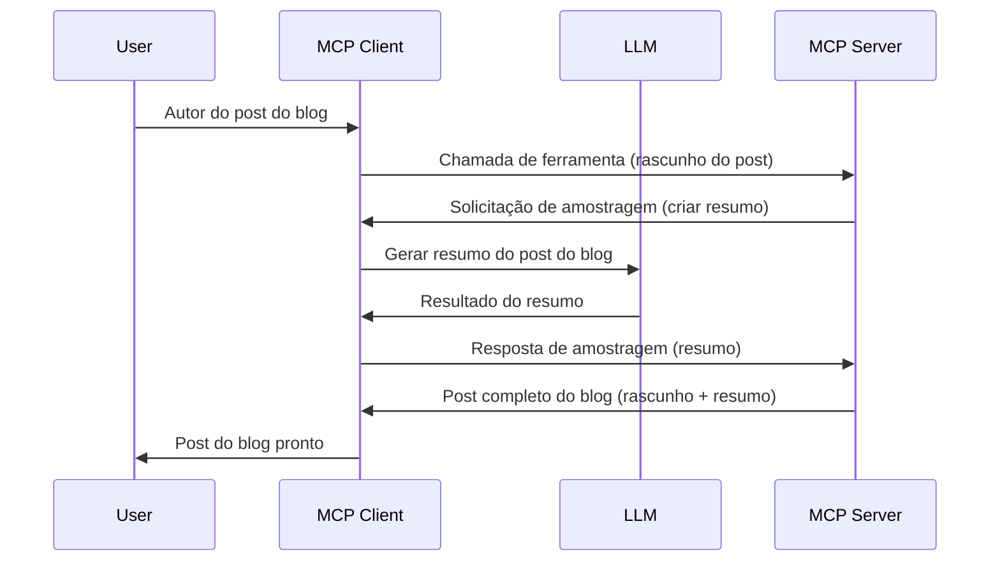

# Sampling - delegar recursos ao Cliente

Às vezes, você precisa que o Cliente MCP e o Servidor MCP colaborem para alcançar um objetivo comum. Pode haver um caso em que o Servidor precise da ajuda de um LLM que está no cliente. Para esta situação, sampling é o que você deve usar.

Vamos explorar alguns casos de uso e como construir uma solução envolvendo sampling.

## Visão Geral

Nesta lição, focamos em explicar quando e onde usar Sampling e como configurá-lo.

## Objetivos de Aprendizagem

Neste capítulo, iremos:

- Explicar o que é Sampling e quando usá-lo.
- Mostrar como configurar Sampling no MCP.
- Fornecer exemplos de Sampling em ação.

## O que é Sampling e por que usá-lo?

Sampling é um recurso avançado que funciona da seguinte maneira:



### Requisição de Sampling

Ok, agora que temos uma visão geral de um cenário plausível, vamos falar sobre a requisição de sampling que o servidor envia de volta para o cliente. Veja como essa requisição pode ser no formato JSON-RPC:

```json
{
  "jsonrpc": "2.0",
  "id": 1,
  "method": "sampling/createMessage",
  "params": {
    "messages": [
      {
        "role": "user",
        "content": {
          "type": "text",
          "text": "Create a blog post summary of the following blog post: <BLOG POST>"
        }
      }
    ],
    "modelPreferences": {
      "hints": [
        {
          "name": "claude-3-sonnet"
        }
      ],
      "intelligencePriority": 0.8,
      "speedPriority": 0.5
    },
    "systemPrompt": "You are a helpful assistant.",
    "maxTokens": 100
  }
}
```

Há alguns pontos aqui que vale destacar:

- Prompt, sob content -> text, é nosso prompt que é uma instrução para o LLM resumir o conteúdo de um post de blog.

- **modelPreferences**. Esta seção é exatamente isso, uma preferência, uma recomendação de qual configuração usar com o LLM. O usuário pode escolher se aceita essas recomendações ou mudá-las. Neste caso, há recomendações de modelo para usar e prioridade entre velocidade e inteligência.
- **systemPrompt**, este é seu prompt de sistema normal que dá personalidade ao seu LLM e contém instruções de orientação.
- **maxTokens**, esta é outra propriedade usada para indicar quantos tokens são recomendados para essa tarefa.

### Resposta de Sampling

Esta resposta é o que o Cliente MCP acaba enviando de volta ao Servidor MCP e é resultado do cliente chamar o LLM, aguardar essa resposta e então construir esta mensagem. Veja como pode ficar no JSON-RPC:

```json
{
  "jsonrpc": "2.0",
  "id": 1,
  "result": {
    "role": "assistant",
    "content": {
      "type": "text",
      "text": "Here's your abstract <ABSTRACT>"
    },
    "model": "gpt-5",
    "stopReason": "endTurn"
  }
}
```

Observe como a resposta é um resumo do post do blog exatamente como pedimos. Também note como o `model` usado não é o que pedimos, mas sim "gpt-5" em vez de "claude-3-sonnet". Isso ilustra que o usuário pode mudar de ideia sobre o que usar e que sua requisição de sampling é apenas uma recomendação.

Ok, agora que entendemos o fluxo principal, e uma tarefa útil para usá-lo é "criação de post de blog + resumo", vamos ver o que precisamos fazer para fazê-lo funcionar.

### Tipos de mensagens

Mensagens de Sampling não estão restritas apenas a texto, mas você também pode enviar imagens e áudio. Veja como o JSON-RPC se apresenta diferente:

**Texto**

```json
{
  "type": "text",
  "text": "The message content"
}
```

**Conteúdo de imagem**

```json
{
  "type": "image",
  "data": "base64-encoded-image-data",
  "mimeType": "image/jpeg"
}
```

**Conteúdo de áudio**

```json
{
  "type": "audio",
  "data": "base64-encoded-audio-data",
  "mimeType": "audio/wav"
}
```

> NOTE: para informações mais detalhadas sobre Sampling, confira a [documentação oficial](https://modelcontextprotocol.io/specification/2025-11-25/client/sampling)

## Como Configurar Sampling no Cliente

> Nota: se você está apenas construindo um servidor, não precisa fazer muita coisa aqui.

Em um cliente, você precisa especificar o seguinte recurso desta forma:

```json
{
  "capabilities": {
    "sampling": {}
  }
}
```

Isso será então detectado quando seu cliente escolhido inicializar com o servidor.

## Exemplo de Sampling em Ação - Criar um Post de Blog

Vamos codificar um servidor de sampling juntos, precisaremos fazer o seguinte:

1. Criar uma ferramenta no Servidor.
1. Essa ferramenta deve criar uma requisição de sampling.
1. A ferramenta deve aguardar a resposta da requisição de sampling do cliente.
1. Então, o resultado da ferramenta deve ser produzido.

Vamos ver o código passo a passo:

### -1- Criar a ferramenta

**python**

```python
@mcp.tool()
async def create_blog(title: str, content: str, ctx: Context[ServerSession, None]) -> str:
    """Create a blog post and generate a summary"""

```

### -2- Criar a requisição de sampling

Estenda sua ferramenta com o seguinte código:

**python**

```python
post = BlogPost(
        id=len(posts) + 1,
        title=title,
        content=content,
        abstract=""
    )

prompt = f"Create an abstract of the following blog post: title: {title} and draft: {content} "

result = await ctx.session.create_message(
        messages=[
            SamplingMessage(
                role="user",
                content=TextContent(type="text", text=prompt),
            )
        ],
        max_tokens=100,
)

```

### -3- Aguardar a resposta e retornar a resposta

**python**

```python
post.abstract = result.content.text

posts.append(post)

# retorne o produto completo
return json.dumps({
    "id": post.title,
    "abstract": post.abstract
})
```

### -4- Código completo

**python**

```python
from starlette.applications import Starlette
from starlette.routing import Mount, Host

from mcp.server.fastmcp import Context, FastMCP

from mcp.server.session import ServerSession
from mcp.types import SamplingMessage, TextContent

import json


from uuid import uuid4
from typing import List
from pydantic import BaseModel


mcp = FastMCP("Blog post generator")

# app = FastAPI()

posts = []

class BlogPost(BaseModel):
    id: int
    title: str
    content: str
    abstract: str

posts: List[BlogPost] = []

@mcp.tool()
async def create_blog(title: str, content: str, ctx: Context[ServerSession, None]) -> str:
    """Create a blog post and generate a summary"""

    post = BlogPost(
        id=len(posts) + 1,
        title=title,
        content=content,
        abstract=""
    )

    prompt = f"Create an abstract of the following blog post: title: {title} and draft: {content} "

    result = await ctx.session.create_message(
        messages=[
            SamplingMessage(
                role="user",
                content=TextContent(type="text", text=prompt),
            )
        ],
        max_tokens=100,
    )

    post.abstract = result.content.text

    posts.append(post)

    # retorna o post completo do blog
    return json.dumps({
        "id": post.title,
        "abstract": post.abstract
    })

if __name__ == "__main__":
    print("Starting server...")
    # mcp.run()
    mcp.run(transport="streamable-http")

# execute o app com: python server.py
```

### -5- Testando no Visual Studio Code

Para testar isso no Visual Studio Code, faça o seguinte:

1. Inicie o servidor no terminal.
1. Adicione-o ao *mcp.json* (e assegure que ele está iniciado), algo assim:

   ```json
   "servers": {
      "blog-server": {
        "type": "http",
        "url": "http://localhost:8000/mcp"
      }
   }
   ```

1. Digite um prompt:

   ```text
   create a blog post named "Where Python comes from", the content is "Python is actually named after Monty Python Flying Circus"
   ```

1. Permita que o sampling aconteça. Na primeira vez que você testar isso, será exibida uma caixa de diálogo adicional que você precisará aceitar, depois verá a caixa de diálogo normal para pedir que você execute uma ferramenta.

1. Inspecione os resultados. Você verá os resultados tanto renderizados agradavelmente no GitHub Copilot Chat quanto poderá inspecionar a resposta JSON bruta.

**Bônus**. As ferramentas do Visual Studio Code têm ótimo suporte para sampling. Você pode configurar o acesso a Sampling no seu servidor instalado navegando assim:

1. Vá para a seção de extensões.
1. Selecione o ícone de engrenagem para seu servidor instalado na seção "MCP SERVERS - INSTALLED".
1. Selecione "Configure Model Access" (Configurar Acesso do Modelo). Aqui você pode escolher quais Modelos o GitHub Copilot pode usar ao realizar sampling. Você também pode ver todas as requisições de sampling recentes selecionando "Show Sampling requests".

## Atividade

Nesta atividade, você irá construir um Sampling um pouco diferente, uma integração de sampling que suporta gerar uma descrição de produto. Aqui está seu cenário:

**Cenário**: O funcionário do back office de um e-commerce precisa de ajuda, leva muito tempo para gerar descrições de produto. Portanto, você deve construir uma solução onde possa chamar uma ferramenta "create_product" com "title" e "keywords" como argumentos e ela deve produzir um produto completo incluindo um campo "description" que deve ser preenchido por um LLM do cliente.

DICA: use o que aprendeu anteriormente para construir esse servidor e sua ferramenta usando uma requisição de sampling.

## Solução

[Solution](./solution/README.md)

## Principais aprendizados

Sampling é um recurso poderoso que permite ao servidor delegar tarefas ao cliente quando precisa da ajuda de um LLM.

## O que vem a seguir

- [Capítulo 4 - Implementação prática](../../04-PracticalImplementation/README.md)

---

<!-- CO-OP TRANSLATOR DISCLAIMER START -->
**Aviso Legal**:
Este documento foi traduzido usando o serviço de tradução por IA [Co-op Translator](https://github.com/Azure/co-op-translator). Embora nos esforcemos pela precisão, por favor, esteja ciente de que traduções automatizadas podem conter erros ou imprecisões. O documento original em seu idioma nativo deve ser considerado a fonte autorizada. Para informações críticas, recomenda-se tradução profissional humana. Não nos responsabilizamos por quaisquer mal-entendidos ou interpretações incorretas decorrentes do uso desta tradução.
<!-- CO-OP TRANSLATOR DISCLAIMER END -->