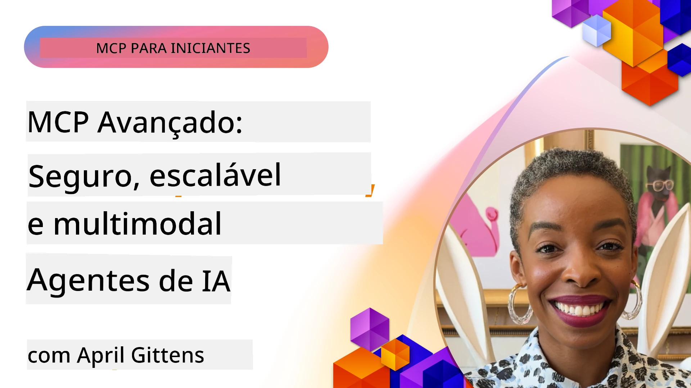

# Tópicos Avançados em MCP

_(Clique na imagem acima para assistir ao vídeo desta lição)_

Este capítulo cobre uma série de tópicos avançados na implementação do Protocolo de Contexto de Modelo (MCP), incluindo integração multimodal, escalabilidade, melhores práticas de segurança e integração empresarial. Esses tópicos são cruciais para construir aplicações MCP robustas e preparadas para produção que possam atender às demandas dos sistemas modernos de IA.

## Visão Geral

Esta lição explora conceitos avançados na implementação do Protocolo de Contexto de Modelo, com foco em integração multimodal, escalabilidade, melhores práticas de segurança e integração empresarial. Esses tópicos são essenciais para construir aplicações MCP de nível de produção capazes de lidar com requisitos complexos em ambientes empresariais.

## Objetivos de Aprendizagem

Ao final desta lição, você será capaz de:

- Implementar capacidades multimodais dentro dos frameworks MCP
- Projetar arquiteturas MCP escaláveis para cenários de alta demanda
- Aplicar melhores práticas de segurança alinhadas aos princípios de segurança do MCP
- Integrar MCP com sistemas e frameworks de IA empresariais
- Otimizar desempenho e confiabilidade em ambientes de produção

## Lição e Projetos de Exemplo

| Link | Título | Descrição |
|------|-------|-------------|
| [5.1 Integration with Azure](./mcp-integration/README.md) | Integração com Azure | Aprenda a integrar seu Servidor MCP no Azure |
| [5.2 Multi modal sample](./mcp-multi-modality/README.md) | Exemplos MCP Multimodal | Exemplos para resposta multimodal com áudio, imagem e texto |
| [5.3 MCP OAuth2 sample](../../../05-AdvancedTopics/mcp-oauth2-demo) | Demonstração MCP OAuth2 | Aplicação mínima em Spring Boot mostrando OAuth2 com MCP, tanto como Servidor de Autorização quanto de Recursos. Demonstra emissão segura de tokens, endpoints protegidos, implantação no Azure Container Apps e integração com API Management. |
| [5.4 Root Contexts](./mcp-root-contexts/README.md) | Contextos Raiz | Saiba mais sobre contextos raiz e como implementá-los |
| [5.5 Routing](./mcp-routing/README.md) | Roteamento | Aprenda diferentes tipos de roteamento |
| [5.6 Sampling](./mcp-sampling/README.md) | Amostragem | Aprenda a trabalhar com amostragem |
| [5.7 Scaling](./mcp-scaling/README.md) | Escalabilidade | Aprenda sobre escalabilidade |
| [5.8 Security](./mcp-security/README.md) | Segurança | Proteja seu Servidor MCP |
| [5.9 Web Search sample](./web-search-mcp/README.md) | Busca Web MCP | Servidor e cliente MCP em Python integrando com SerpAPI para busca em tempo real na web, notícias, produtos e perguntas e respostas. Demonstra orquestração multi-ferramenta, integração com API externa e tratamento robusto de erros. |
| [5.10 Realtime Streaming](./mcp-realtimestreaming/README.md) | Streaming | O streaming de dados em tempo real tornou-se essencial no mundo orientado a dados de hoje, onde empresas e aplicativos precisam de acesso imediato às informações para tomar decisões rápidas. |
| [5.11 Realtime Web Search](./mcp-realtimesearch/README.md) | Busca Web | Busca web em tempo real como MCP transforma a busca web em tempo real, fornecendo uma abordagem padronizada para gerenciamento de contexto entre modelos de IA, motores de busca e aplicativos. |
| [5.12  Entra ID Authentication for Model Context Protocol Servers](./mcp-security-entra/README.md) | Autenticação Entra ID | Microsoft Entra ID fornece uma solução robusta baseada na nuvem para gerenciamento de identidade e acesso, ajudando a garantir que apenas usuários e aplicações autorizadas possam interagir com seu servidor MCP. |
| [5.13 Microsoft Foundry Agent Integration](./mcp-foundry-agent-integration/README.md) | Integração Microsoft Foundry | Aprenda como integrar servidores MCP com agentes Microsoft Foundry, possibilitando poderosa orquestração de ferramentas e capacidades empresariais de IA com conexões padronizadas a fontes de dados externas. |
| [5.14 Context Engineering](./mcp-contextengineering/README.md) | Engenharia de Contexto | A oportunidade futura das técnicas de engenharia de contexto para servidores MCP, incluindo otimização de contexto, gerenciamento dinâmico de contexto e estratégias para engenharia de prompts eficazes dentro dos frameworks MCP. |
| [5.15 MCP Custom Transport](./mcp-transport/README.md) | Transporte Personalizado | Aprenda a implementar mecanismos de transporte personalizados para cenários especializados de comunicação MCP. |
| [5.16 Protocol Features Deep Dive](./mcp-protocol-features/README.md) | Recursos do Protocolo | Domine funcionalidades avançadas do protocolo incluindo notificações de progresso, cancelamento de requisições, templates de recursos e padrões de tratamento de erros. |
| [5.17 Adversarial Multi-Agent Reasoning](./mcp-adversarial-agents/README.md) | Agentes Adversariais | Use dois agentes com posições opostas, compartilhando um único conjunto de ferramentas MCP, para detectar alucinações, apresentar casos extremos e produzir saídas melhor calibradas por meio de debate estruturado. |

> **Novo na Especificação MCP 2025-11-25**: A especificação agora inclui suporte experimental para **Tarefas** (operações de longa duração com rastreamento de progresso), **Anotações de Ferramenta** (metadados sobre comportamento da ferramenta para segurança), **Elicitação por Modo URL** (requisição de conteúdo URL específico de clientes) e **Raízes** aprimoradas (para gerenciamento de contexto de espaço de trabalho). Veja o [changelog da Especificação MCP](https://spec.modelcontextprotocol.io/) para detalhes completos.

## Referências Adicionais

Para informações mais atualizadas sobre tópicos avançados de MCP, consulte:
- [Documentação MCP](https://modelcontextprotocol.io/)
- [Especificação MCP (2025-11-25)](https://spec.modelcontextprotocol.io/specification/2025-11-25/)
- [Repositório GitHub](https://github.com/modelcontextprotocol)
- [OWASP MCP Top 10](https://microsoft.github.io/mcp-azure-security-guide/mcp/) - Riscos de segurança e mitigação
- [Workshop MCP Security Summit (Sherpa)](https://azure-samples.github.io/sherpa/) - Treinamento prático de segurança

## Principais Lições

- Implementações multimodais MCP ampliam as capacidades de IA além do processamento de texto
- Escalabilidade é essencial para implantações empresariais e pode ser abordada por escalonamento horizontal e vertical
- Medidas abrangentes de segurança protegem dados e garantem controle de acesso apropriado
- Integração empresarial com plataformas como Azure OpenAI e Microsoft AI Foundry aprimora as capacidades MCP
- Implementações avançadas MCP se beneficiam de arquiteturas otimizadas e gerenciamento criterioso de recursos

## Exercício

Projete uma implementação MCP de nível empresarial para um caso de uso específico:

1. Identifique os requisitos multimodais para seu caso de uso
2. Delineie os controles de segurança necessários para proteger dados sensíveis
3. Projete uma arquitetura escalável que possa lidar com cargas variáveis
4. Planeje pontos de integração com sistemas de IA empresariais
5. Documente potenciais gargalos de desempenho e estratégias de mitigação

## Recursos Adicionais

- [Documentação Azure OpenAI](https://learn.microsoft.com/en-us/azure/ai-services/openai/)
- [Documentação Microsoft AI Foundry](https://learn.microsoft.com/en-us/ai-services/)

---

## O que vem a seguir

Explore as lições deste módulo começando por: [5.1 MCP Integration](./mcp-integration/README.md)

Depois de concluir este módulo, continue para: [Módulo 6: Contribuições da Comunidade](../06-CommunityContributions/README.md)

---

<!-- CO-OP TRANSLATOR DISCLAIMER START -->
**Aviso Legal**:
Este documento foi traduzido usando o serviço de tradução por IA [Co-op Translator](https://github.com/Azure/co-op-translator). Embora nos esforcemos pela precisão, por favor, esteja ciente de que traduções automatizadas podem conter erros ou imprecisões. O documento original em seu idioma nativo deve ser considerado a fonte autorizada. Para informações críticas, recomenda-se tradução profissional humana. Não nos responsabilizamos por quaisquer mal-entendidos ou interpretações incorretas decorrentes do uso desta tradução.
<!-- CO-OP TRANSLATOR DISCLAIMER END -->