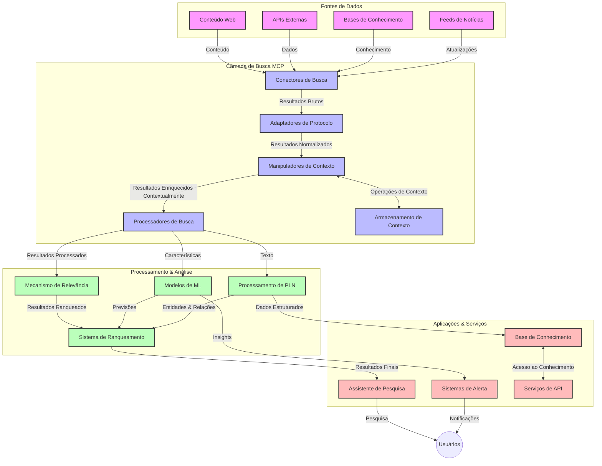
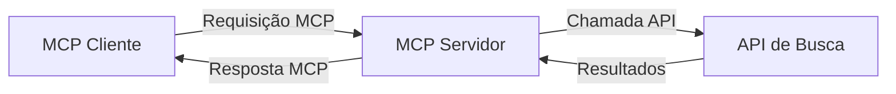
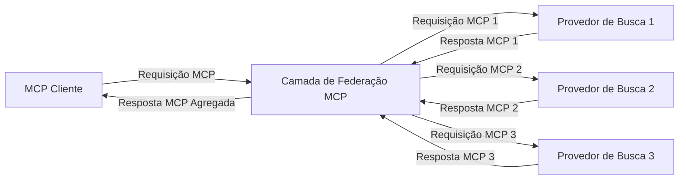
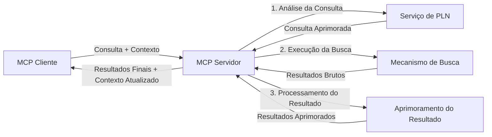

# Protocolo de Contexto do Modelo para Busca Web em Tempo Real

## Visão Geral

A busca web em tempo real tornou-se essencial no ambiente atual orientado por informações, onde as aplicações precisam de acesso imediato a informações atualizadas na internet para fornecer respostas relevantes e oportunas. O Protocolo de Contexto do Modelo (MCP) representa um avanço significativo na otimização desses processos de busca em tempo real, aprimorando a eficiência da busca, mantendo a integridade contextual e melhorando o desempenho geral do sistema.

Este módulo explora como o MCP transforma a busca web em tempo real ao fornecer uma abordagem padronizada para o gerenciamento de contexto entre modelos de IA, motores de busca e aplicações.

### O que Você Vai Aprender

Neste guia completo, você vai descobrir:

- Como o MCP cria uma ponte perfeita entre modelos de IA e capacidades de busca web em tempo real
- Padrões arquiteturais para implementar soluções de busca eficientes e escaláveis com MCP
- Técnicas para preservar o contexto da busca em múltiplas consultas e interações
- Implementações práticas de código em Python e JavaScript para vários cenários de busca
- Métodos para equilibrar relevância, atualidade e desempenho em sistemas de busca com MCP

## Introdução à Busca Web em Tempo Real

A busca web em tempo real é uma abordagem tecnológica que permite consultas contínuas, processamento e análise de informações baseadas na web conforme são publicadas ou atualizadas, permitindo que os sistemas forneçam informações frescas e relevantes com mínima latência. Diferentemente dos sistemas tradicionais de busca que operam sobre dados indexados que podem ter horas ou dias de defasagem, a busca em tempo real processa dados vivos da web, entregando percepções e informações que refletem o estado atual do conteúdo online.

### Conceitos Centrais da Busca Web em Tempo Real:

- **Processamento Contínuo de Consultas**: Consultas de busca são processadas contra fontes de dados que estão constantemente sendo atualizadas
- **Priorização da Atualidade**: Sistemas são projetados para priorizar informações recentes
- **Equilíbrio de Relevância**: Manutenção do equilíbrio entre relevância e atualidade
- **Arquitetura Escalável**: Sistemas devem suportar cargas e volumes de dados variáveis
- **Compreensão Contextual**: Manter o contexto do usuário ao longo das iterações de busca é crucial para resultados significativos
- **Reformulações Dinâmicas de Consulta**: Modificação adaptativa de consultas com base no contexto e resultados anteriores
- **Integração Multi-Fonte**: Combinação de resultados de múltiplos provedores de busca e fontes web
- **Compreensão Semântica**: Processamento de consultas e conteúdo baseado no significado, e não apenas em palavras-chave
- **Rankeamento em Tempo Real**: Ajuste contínuo da ordenação dos resultados conforme novas informações ficam disponíveis

### O Protocolo de Contexto do Modelo e a Busca Web em Tempo Real

O Protocolo de Contexto do Modelo (MCP) aborda diversos desafios críticos em ambientes de busca web em tempo real:

1. **Preservação do Contexto da Busca**: O MCP padroniza como o contexto é mantido entre componentes distribuídos de busca, garantindo que modelos de IA e nós de processamento tenham acesso ao histórico de consultas relevante e preferências do usuário.

2. **Gerenciamento Eficiente de Consultas**: Ao fornecer mecanismos estruturados para transmissão de contexto, o MCP reduz a sobrecarga de repetir contexto em cada iteração de busca.

3. **Interoperabilidade**: O MCP cria uma linguagem comum para o compartilhamento de contexto entre tecnologias de busca diversas e modelos de IA, permitindo arquiteturas mais flexíveis e extensíveis.

4. **Contexto Otimizado para Busca**: Implementações do MCP podem priorizar quais elementos do contexto são mais relevantes para uma busca eficaz, otimizando tanto desempenho quanto precisão.

5. **Processamento Adaptativo de Busca**: Com gerenciamento adequado de contexto via MCP, sistemas de busca podem ajustar dinamicamente o processamento baseado em necessidades do usuário que evoluem e nos cenários informacionais.

Em aplicações modernas que vão da agregação de notícias a assistentes de pesquisa, a integração do MCP com tecnologias de busca web permite uma busca mais inteligente, consciente do contexto, que pode fornecer resultados cada vez mais relevantes à medida que as interações do usuário continuam.

## Objetivos de Aprendizagem

Ao final desta lição, você será capaz de:

- Compreender os fundamentos da busca web em tempo real e seus desafios em aplicações modernas
- Explicar como o Protocolo de Contexto do Modelo (MCP) aprimora as capacidades de busca web em tempo real
- Implementar soluções de busca baseadas em MCP usando frameworks e APIs populares
- Projetar e implantar arquiteturas de busca escaláveis e de alto desempenho com MCP
- Aplicar conceitos do MCP para diversos casos de uso incluindo busca semântica, assistência em pesquisa e navegação aumentada por IA
- Avaliar tendências emergentes e inovações futuras em tecnologias de busca baseadas em MCP
- Desenvolver sistemas de busca conscientes do contexto que aprendem com interações dos usuários
- Integrar capacidades de busca web em assistentes de IA usando protocolos MCP padronizados
- Criar pipelines de busca multiestágio que refinam progressivamente resultados baseados em contexto
- Otimizar o desempenho da busca enquanto mantém ampla consciência do contexto

### Definição e Importância

Busca web em tempo real envolve a consulta contínua, recuperação e entrega de informações baseadas na web com mínima latência. Diferente dos motores de busca tradicionais que periodicamente rastreiam e indexam a web, a busca em tempo real visa expor informações assim que se tornam disponíveis, permitindo acesso imediato ao conteúdo mais atual.

Características-chave da busca web em tempo real incluem:

- **Atualidade**: Priorização de conteúdo e atualizações recentes
- **Processamento Contínuo**: Monitoramento constante por novas informações
- **Adaptação de Consultas**: Refinamento das consultas de busca baseado em contexto e feedback
- **Entrega Imediata**: Fornecimento de resultados de busca com atraso mínimo
- **Retenção de Contexto**: Construção sobre consultas anteriores para melhorar relevância

### Desafios na Busca Web Tradicional

Abordagens tradicionais de busca web enfrentam várias limitações quando aplicadas a cenários em tempo real:

1. **Fragmentação de Contexto**: Dificuldade em manter o contexto da busca em múltiplas consultas
2. **Atualidade da Informação**: Desafios em acessar e priorizar as informações mais recentes
3. **Complexidade de Integração**: Problemas de interoperabilidade entre sistemas de busca e aplicações
4. **Questões de Latência**: Equilibrar busca abrangente com requisitos de tempo de resposta
5. **Ajuste de Relevância**: Garantir precisão e relevância enquanto prioriza a atualidade

## Compreendendo o Protocolo de Contexto do Modelo (MCP) para Busca

### O que é MCP em Contextos de Busca?

O Protocolo de Contexto do Modelo (MCP) é um protocolo de comunicação padronizado projetado para facilitar a interação eficiente entre modelos de IA e aplicações. No contexto da busca web em tempo real, o MCP fornece uma estrutura para:

- Preservar o contexto da busca ao longo de sequências de consultas
- Padronizar formatos de consulta e resultado de busca
- Otimizar a transmissão de parâmetros e resultados de busca
- Aprimorar a comunicação entre modelos e motores de busca

### Componentes Centrais e Arquitetura

A arquitetura do MCP para busca web em tempo real consiste em vários componentes chave:

1. **Gerenciadores de Contexto de Consulta**: Gerenciam e mantêm o contexto da busca em múltiplas consultas
2. **Processadores de Busca**: Processam requisições de busca usando técnicas conscientes do contexto
3. **Adaptadores de Protocolo**: Convertem entre diferentes APIs de busca preservando o contexto
4. **Armazenamento de Contexto**: Armazenam e recuperam eficiência o histórico de busca e preferências
5. **Conectores de Busca**: Conectam a múltiplos motores e APIs web de busca



### Como o MCP Melhora a Busca Web em Tempo Real

O MCP resolve desafios da busca tradicional por meio de:

- **Continuidade Contextual**: Mantém relações entre consultas durante toda a sessão de busca
- **Transmissão Otimizada**: Reduz redundâncias em parâmetros de busca com gerenciamento inteligente do contexto
- **Interfaces Padronizadas**: Oferece APIs consistentes para componentes de busca
- **Redução de Latência**: Minimiza overhead de processamento por meio de manejo eficiente do contexto
- **Maior Relevância**: Melhora relevância da busca preservando a intenção do usuário em múltiplas consultas

## Integração e Implementação

Sistemas de busca web em tempo real requerem design arquitetural cuidadoso e implementação que mantenham tanto o desempenho quanto a integridade do contexto. O Protocolo de Contexto do Modelo oferece uma abordagem padronizada para integrar modelos de IA e tecnologias de busca, permitindo pipelines de busca mais sofisticados e conscientes do contexto.

### Visão Geral da Integração MCP em Arquiteturas de Busca

Implementar MCP em ambientes de busca web em tempo real envolve diversas considerações importantes:

1. **Serialização do Contexto da Busca**: MCP fornece mecanismos eficientes para codificar informações contextuais dentro das requisições de busca, garantindo que o contexto essencial acompanhe a consulta por todo o pipeline de processamento. Isso inclui formatos de serialização padronizados e otimizados para metadados relacionados à busca.

2. **Processamento Stateful de Busca**: MCP habilita processamento stateful mais inteligente ao manter a representação consistente do contexto entre iterações de busca. Isso é particularmente útil em pipelines de busca multiestágio, onde o refinamento do contexto melhora os resultados.

3. **Expansão e Refinamento de Consulta**: Implementações MCP em sistemas de busca podem facilitar expansões e refinamentos sofisticados de consulta baseados no contexto acumulado, permitindo resultados cada vez mais relevantes conforme a sessão avança.

4. **Caching e Priorização de Resultados**: Ao padronizar o manejo do contexto, MCP ajuda a gerenciar cache de resultados e priorização, permitindo que componentes se adaptem conforme o contexto de busca evolui.

5. **Federação e Agregação de Busca**: MCP facilita federação mais sofisticada da busca entre múltiplos backends ao fornecer representações estruturadas do contexto de busca, habilitando agregação mais significativa de resultados oriundos de fontes diversas.

A implementação do MCP em várias tecnologias de busca cria uma abordagem unificada para o gerenciamento do contexto, reduzindo a necessidade de código de integração personalizado enquanto melhora a capacidade do sistema de manter um contexto significativo conforme as consultas evoluem.

### MCP em Diferentes Implementações de Busca Web

Estes exemplos seguem a especificação atual do MCP, que foca em um protocolo baseado em JSON-RPC com mecanismos distintos de transporte. O código demonstra como implementar integrações personalizadas de buscas mantendo compatibilidade completa com o protocolo MCP.

<details>
<summary>Implementação em Python com API de Busca Genérica</summary>

```python
import asyncio
import json
import aiohttp
from typing import Dict, Any, Optional, List
from contextlib import asynccontextmanager
from collections.abc import AsyncIterator

# Importar bibliotecas padrão do MCP
from mcp.client.session import ClientSession
from mcp.client.streamable_http import streamablehttp_client
from mcp.types import TextContent, CreateMessageRequestParams, CreateMessageResult
from mcp.server.fastmcp import FastMCP

# Criar um servidor FastMCP para pesquisa na web
search_server = FastMCP("WebSearch")

# Classe para lidar com operações de pesquisa na web
class WebSearchHandler:
    def __init__(self, api_endpoint: str, api_key: str):
        self.api_endpoint = api_endpoint
        self.api_key = api_key
        self.session = None
        
    async def initialize(self):
        """Initialize the HTTP session"""
        self.session = aiohttp.ClientSession(
            headers={"Authorization": f"Bearer {self.api_key}"}
        )
    
    async def close(self):
        """Close the HTTP session"""
        if self.session:
            await self.session.close()
            
    async def perform_search(self, query: str, max_results: int = 5, 
                           include_domains: List[str] = None, 
                           exclude_domains: List[str] = None,
                           time_period: str = "any") -> Dict[str, Any]:
        """Perform web search using the search API"""
        # Construir parâmetros de pesquisa
        search_params = {
            "q": query,
            "limit": max_results,
            "time": time_period
        }
        
        if include_domains:
            search_params["site"] = ",".join(include_domains)
            
        if exclude_domains:
            search_params["exclude_site"] = ",".join(exclude_domains)
        
        # Realizar a requisição de pesquisa
        try:
            async with self.session.get(
                self.api_endpoint,
                params=search_params
            ) as response:
                if response.status != 200:
                    error_text = await response.text()
                    raise Exception(f"Search API error: {response.status} - {error_text}")
                
                search_data = await response.json()
                
                # Transformar a resposta específica da API em um formato padrão
                results = []
                for item in search_data.get("results", []):
                    results.append({
                        "title": item.get("title", ""),
                        "url": item.get("url", ""),
                        "snippet": item.get("snippet", ""),
                        "date": item.get("published_date", ""),
                        "source": item.get("source", "")
                    })
                
                return {
                    "query": query,
                    "totalResults": len(results),
                    "results": results
                }
        except Exception as e:
            print(f"Search API request error: {e}")
            raise

# Inicializar o manipulador de pesquisa
search_handler = WebSearchHandler(
    api_endpoint="https://api.search-service.example/search",
    api_key="your-api-key-here"
)

# Configurar lifespan para gerenciar o manipulador de pesquisa
@asyncio.asynccontextmanager
async def app_lifespan(server: FastMCP):
    """Manage application lifecycle"""
    await search_handler.initialize()
    try:
        yield {"search_handler": search_handler}
    finally:
        await search_handler.close()

# Definir lifespan para o servidor
search_server = FastMCP("WebSearch", lifespan=app_lifespan)

# Registrar uma ferramenta de pesquisa na web
@search_server.tool()
async def web_search(query: str, max_results: int = 5, 
                   include_domains: List[str] = None,
                   exclude_domains: List[str] = None,
                   time_period: str = "any") -> Dict[str, Any]:
    """
    Search the web for information
    
    Args:
        query: The search query
        max_results: Maximum number of results to return (default: 5)
        include_domains: List of domains to include in search results
        exclude_domains: List of domains to exclude from search results
        time_period: Time period for results ("day", "week", "month", "any")
        
    Returns:
        Dictionary containing search results
    """
    ctx = search_server.get_context()
    search_handler = ctx.request_context.lifespan_context["search_handler"]
    
    results = await search_handler.perform_search(
        query=query,
        max_results=max_results,
        include_domains=include_domains,
        exclude_domains=exclude_domains,
        time_period=time_period
    )
    
    return results

# Exemplo de uso do cliente
async def client_example():
    # Conectar ao servidor de pesquisa usando transporte HTTP Streamable
    async with streamablehttp_client("http://localhost:8000/mcp") as (read, write, _):
        async with ClientSession(read, write) as session:
            # Inicializar a conexão
            await session.initialize()
            
            # Chamar a ferramenta web_search
            search_results = await session.call_tool(
                "web_search", 
                {
                    "query": "latest developments in AI and Model Context Protocol",
                    "max_results": 5,
                    "time_period": "day",
                    "include_domains": ["github.com", "microsoft.com"]
                }
            )
            
            print(f"Search results: {search_results}")

# Exemplo de execução do servidor
if __name__ == "__main__":
    # Executar o servidor com transporte HTTP Streamable
    search_server.run(transport="streamable-http")
```
</details> 

<details>
<summary>Implementação em JavaScript com Busca no Navegador</summary>

```javascript
// Implementação do servidor MCP para busca na web
import { McpServer, ResourceTemplate } from '@modelcontextprotocol/sdk/server/mcp.js';
import { StreamableHTTPServerTransport } from '@modelcontextprotocol/sdk/server/streamableHttp.js';
import { z } from 'zod';

// Criar um servidor MCP para busca na web
const searchServer = new McpServer({
    name: "BrowserSearch",
    description: "A server that provides web search capabilities"
});

// Classe de serviço de busca
class SearchService {
    constructor(searchApiUrl, apiKey) {
        this.searchApiUrl = searchApiUrl;
        this.apiKey = apiKey;
    }

    async performSearch(parameters) {
        const {
            query = '',
            maxResults = 5,
            includeDomains = [],
            excludeDomains = [],
            timePeriod = 'any'
        } = parameters;
        
        // Construir URL de busca com parâmetros
        const url = new URL(this.searchApiUrl);
        url.searchParams.append('q', query);
        url.searchParams.append('limit', maxResults);
        url.searchParams.append('time', timePeriod);
        
        if (includeDomains.length > 0) {
            url.searchParams.append('site', includeDomains.join(','));
        }
        
        if (excludeDomains.length > 0) {
            url.searchParams.append('exclude_site', excludeDomains.join(','));
        }
        
        try {
            const response = await fetch(url.toString(), {
                method: 'GET',
                headers: {
                    'Authorization': `Bearer ${this.apiKey}`,
                    'Content-Type': 'application/json'
                }
            });
            
            if (!response.ok) {
                const errorText = await response.text();
                throw new Error(`Search API error: ${response.status} - ${errorText}`);
            }
            
            const searchData = await response.json();
            
            // Transformar resposta específica da API para um formato padrão
            const results = searchData.results?.map(item => ({
                title: item.title || '',
                url: item.url || '',
                snippet: item.snippet || '',
                date: item.published_date || '',
                source: item.source || ''
            })) || [];
            
            return {
                query,
                totalResults: results.length,
                results
            };
        } catch (error) {
            console.error('Search API request error:', error);
            throw error;
        }
    }
}

// Inicializar o serviço de busca
const searchService = new SearchService(
    'https://api.search-service.example/search',
    'your-api-key-here'
);

// Configurar o provedor de contexto para o servidor
searchServer.setContextProvider(() => {
    return {
        searchService
    };
});

// Registrar a ferramenta de busca na web
searchServer.tool({
    name: 'web_search',
    description: 'Search the web for information',
    parameters: {
        type: 'object',
        properties: {
            query: {
                type: 'string',
                description: 'The search query'
            },
            maxResults: {
                type: 'integer',
                description: 'Maximum number of results to return',
                default: 5
            },
            includeDomains: {
                type: 'array',
                items: { type: 'string' },
                description: 'List of domains to include in search results'
            },
            excludeDomains: {
                type: 'array',
                items: { type: 'string' },
                description: 'List of domains to exclude from search results'
            },
            timePeriod: {
                type: 'string',
                description: 'Time period for results',
                enum: ['day', 'week', 'month', 'any'],
                default: 'any'
            }
        },
        required: ['query']
    },
    handler: async (params, context) => {
        const { searchService } = context;
        return await searchService.performSearch(params);
    }
});

// Código exemplo do cliente para conectar ao servidor de busca
import { Client } from '@modelcontextprotocol/sdk/client/index.js';
import { StreamableHTTPClientTransport } from '@modelcontextprotocol/sdk/client/streamableHttp.js';

async function connectToSearchServer() {
    // Conectar ao servidor de busca
    const transport = new StreamableHTTPClientTransport(
        new URL('http://localhost:8000/mcp')
    );
    
    const client = new Client({
        name: 'search-client',
        version: '1.0.0'
    });
    
    await client.connect(transport);
    
    // Executar a ferramenta de busca
    const searchResults = await client.callTool({
        name: 'web_search',
        arguments: {
            query: 'Model Context Protocol implementation examples',
            maxResults: 10,
            timePeriod: 'week',
            includeDomains: ['github.com', 'docs.microsoft.com']
        }
    });
    
    console.log('Search results:', searchResults);
    
    // Limpeza
    await client.disconnect();
}

// Iniciar o servidor
const transport = new StreamableHTTPServerTransport();
await searchServer.connect(transport);
console.log('Search server running at http://localhost:8000/mcp');

// Em um processo separado ou após o servidor ser iniciado
// connectToSearchServer().catch(console.error);
```
</details> 

## Aviso sobre Exemplos de Código

> **Nota Importante**: Os exemplos de código abaixo demonstram a integração do Protocolo de Contexto do Modelo (MCP) com funcionalidades de busca web. Embora sigam os padrões e estruturas dos SDKs oficiais do MCP, foram simplificados para fins educacionais.
> 
> Estes exemplos apresentam:
> 
> 1. **Implementação em Python**: Uma implementação de servidor FastMCP que fornece uma ferramenta de busca web conectada a uma API externa de busca. Este exemplo demonstra gerenciamento correto do ciclo de vida, manejo do contexto e implementação da ferramenta seguindo os padrões do [SDK oficial MCP Python](https://github.com/modelcontextprotocol/python-sdk). O servidor utiliza o transporte HTTP Streamable recomendado, que substituiu o transporte SSE mais antigo para implantações de produção.
> 
> 2. **Implementação em JavaScript**: Uma implementação em TypeScript/JavaScript usando o padrão FastMCP do [SDK oficial MCP TypeScript](https://github.com/modelcontextprotocol/typescript-sdk) para criar um servidor de busca com definições adequadas de ferramenta e conexões de clientes. Segue os padrões mais recentes recomendados para gerenciamento de sessão e preservação de contexto.
> 
> Estes exemplos necessitariam de tratamento adicional de erro, autenticação e código específico de integração de API para uso em produção. Os endpoints de API de busca mostrados (`https://api.search-service.example/search`) são exemplos de espaço reservado e precisariam ser substituídos por endpoints reais de serviços de busca.
> 
> Para detalhes completos de implementação e as abordagens mais atualizadas, consulte a [especificação oficial do MCP](https://spec.modelcontextprotocol.io/) e a documentação do SDK.

## Conceitos Centrais

### O Framework do Protocolo de Contexto do Modelo (MCP)

Em sua base, o Protocolo de Contexto do Modelo fornece uma forma padronizada para modelos de IA, aplicações e serviços trocarem contexto. Na busca web em tempo real, esse framework é essencial para criar experiências de busca coerentes e com múltiplas interações. Componentes chave incluem:

1. **Arquitetura Cliente-Servidor**: O MCP estabelece uma separação clara entre clientes de busca (requisitantes) e servidores de busca (fornecedores), permitindo modelos de implantação flexíveis.

2. **Comunicação JSON-RPC**: O protocolo utiliza JSON-RPC para troca de mensagens, tornando-o compatível com tecnologias web e fácil de implementar em diferentes plataformas.

3. **Gerenciamento de Contexto**: MCP define métodos estruturados para manter, atualizar e aproveitar o contexto de busca em múltiplas interações.

4. **Definições de Ferramentas**: Capacidades de busca são expostas como ferramentas padronizadas com parâmetros e valores de retorno bem definidos.

5. **Suporte a Streaming**: O protocolo suporta resultados em streaming, essencial para busca em tempo real onde os resultados podem chegar progressivamente.

### Padrões de Integração de Busca Web

Ao integrar o MCP com busca web, vários padrões emergem:

#### 1. Integração Direta com Provedor de Busca



Neste padrão, o servidor MCP conecta diretamente com uma ou mais APIs de busca, traduzindo requisições MCP em chamadas específicas das APIs e formatando os resultados como respostas MCP.

#### 2. Busca Federada com Preservação de Contexto



Este padrão distribui consultas de busca entre múltiplos provedores compatíveis com MCP, cada um potencialmente especializado em diferentes tipos de conteúdo ou capacidades de busca, enquanto mantém um contexto unificado.

#### 3. Cadeia de Busca com Contexto Aprimorado



Neste padrão, o processo de busca é dividido em múltiplas etapas, com o contexto sendo enriquecido a cada estágio, resultando em resultados progressivamente mais relevantes.

### Componentes de Contexto da Busca

Na busca web baseada em MCP, o contexto normalmente inclui:

- **Histórico de Consultas**: Consultas de busca anteriores na sessão
- **Preferências do Usuário**: Idioma, região, configurações de busca segura
- **Histórico de Interações**: Quais resultados foram clicados, tempo gasto nos resultados
- **Parâmetros de Busca**: Filtros, ordens de classificação e outros modificadores de busca
- **Conhecimento de Domínio**: Contexto específico de assunto relevante para a busca
- **Contexto Temporal**: Fatores de relevância baseados no tempo
- **Preferências de Fonte**: Fontes de informação confiáveis ou preferidas

## Casos de Uso e Aplicações

### Pesquisa e Coleta de Informações

O MCP aprimora fluxos de trabalho de pesquisa ao:

- Preservar o contexto da pesquisa entre sessões de busca
- Permitir consultas mais sofisticadas e contextualmente relevantes
- Suportar federação de busca multi-fonte
- Facilitar extração de conhecimento a partir dos resultados de busca

### Monitoramento de Notícias e Tendências em Tempo Real

A busca com MCP oferece vantagens para monitoramento de notícias:

- Descoberta quase em tempo real de notícias emergentes
- Filtragem contextual de informações relevantes
- Rastreamento de tópicos e entidades em múltiplas fontes
- Alertas personalizados de notícias baseados no contexto do usuário

### Navegação e Pesquisa Aumentadas por IA

O MCP cria novas possibilidades para navegação aumentada por IA:

- Sugestões de busca contextuais baseadas na atividade atual do navegador
- Integração perfeita da busca web com assistentes alimentados por LLM
- Refinamento de busca com múltiplas interações mantendo contexto
- Verificação ampliada de fatos e verificação de informações

## Tendências Futuras e Inovações

### Evolução do MCP na Busca Web

Olhando para o futuro, antecipamos que o MCP evolua para atender:
- **Busca Multimodal**: Integração de busca por texto, imagem, áudio e vídeo com contexto preservado
- **Busca Descentralizada**: Suporte a ecossistemas de busca distribuída e federada
- **Privacidade na Busca**: Mecanismos de busca que preservam a privacidade com consciência do contexto
- **Compreensão de Consultas**: Análise semântica profunda de consultas de busca em linguagem natural

### Avanços Potenciais na Tecnologia

Tecnologias emergentes que irão moldar o futuro da busca MCP:

1. **Arquiteturas de Busca Neural**: Sistemas de busca baseados em embeddings otimizados para MCP
2. **Contexto de Busca Personalizado**: Aprendizagem de padrões individuais de busca dos usuários ao longo do tempo
3. **Integração com Grafos de Conhecimento**: Busca contextualizada aprimorada por grafos de conhecimento específicos de domínio
4. **Contexto Cross-Modal**: Manutenção do contexto através de diferentes modalidades de busca

## Exercícios Práticos

### Exercício 1: Configurando um Pipeline Básico de Busca MCP

Neste exercício, você aprenderá a:
- Configurar um ambiente básico de busca MCP
- Implementar manipuladores de contexto para busca na web
- Testar e validar a preservação do contexto entre iterações de busca

### Exercício 2: Construindo um Assistente de Pesquisa com Busca MCP

Crie uma aplicação completa que:
- Processa perguntas de pesquisa em linguagem natural
- Executa buscas na web com consciência do contexto
- Sintetiza informações de múltiplas fontes
- Apresenta resultados organizados da pesquisa

### Exercício 3: Implementando Federação de Busca Multifuentes com MCP

Exercício avançado abordando:
- Disparo de consultas com contexto para múltiplos mecanismos de busca
- Ranqueamento e agregação de resultados
- Desduplicação contextual dos resultados de busca
- Manipulação de metadados específicos das fontes

## Recursos Adicionais

- [Especificação do Model Context Protocol](https://spec.modelcontextprotocol.io/) - Especificação oficial do MCP e documentação detalhada do protocolo
- [Documentação do Model Context Protocol](https://modelcontextprotocol.io/) - Tutoriais detalhados e guias de implementação
- [SDK Python do MCP](https://github.com/modelcontextprotocol/python-sdk) - Implementação oficial Python do protocolo MCP
- [SDK TypeScript do MCP](https://github.com/modelcontextprotocol/typescript-sdk) - Implementação oficial TypeScript do protocolo MCP
- [Servidores de Referência MCP](https://github.com/modelcontextprotocol/servers) - Implementações de referência dos servidores MCP
- [Documentação da Bing Web Search API](https://learn.microsoft.com/en-us/bing/search-apis/bing-web-search/overview) - API de busca web da Microsoft
- [Google Custom Search JSON API](https://developers.google.com/custom-search/v1/overview) - Motor de busca programável do Google
- [Documentação SerpAPI](https://serpapi.com/search-api) - API de páginas de resultados de mecanismos de busca
- [Documentação Meilisearch](https://www.meilisearch.com/docs) - Motor de busca open-source
- [Documentação Elasticsearch](https://www.elastic.co/guide/index.html) - Motor de busca e análise distribuída
- [Documentação LangChain](https://python.langchain.com/docs/get_started/introduction) - Construindo aplicações com LLMs

## Resultados de Aprendizagem

Ao completar este módulo, você será capaz de:

- Entender os fundamentos da busca web em tempo real e seus desafios
- Explicar como o Model Context Protocol (MCP) aprimora as capacidades da busca web em tempo real
- Implementar soluções de busca baseadas em MCP usando frameworks e APIs populares
- Projetar e implantar arquiteturas de busca escaláveis e de alto desempenho com MCP
- Aplicar conceitos MCP em vários casos de uso, incluindo busca semântica, assistência em pesquisas e navegação aumentada por IA
- Avaliar tendências emergentes e inovações futuras em tecnologias de busca baseadas em MCP

### Considerações sobre Confiança e Segurança

Ao implementar soluções de busca web baseadas em MCP, lembre-se dos seguintes princípios importantes da especificação MCP:

1. **Consentimento e Controle do Usuário**: Usuários devem consentir explicitamente e compreender todo acesso a dados e operações. Isso é especialmente importante para implementações de busca web que podem acessar fontes externas.

2. **Privacidade dos Dados**: Garanta o manuseio apropriado das consultas e resultados de busca, especialmente quando possam conter informações sensíveis. Implemente controles de acesso adequados para proteger os dados do usuário.

3. **Segurança das Ferramentas**: Implemente autorização e validação adequadas para ferramentas de busca, pois elas representam riscos potenciais de segurança por execução arbitrária de código. Descrições de comportamento das ferramentas devem ser consideradas não confiáveis a menos que obtidas de um servidor confiável.

4. **Documentação Clara**: Forneça documentação clara sobre capacidades, limitações e considerações de segurança da sua implementação de busca baseada em MCP, seguindo as diretrizes da especificação MCP.

5. **Fluxos Robustos de Consentimento**: Construa fluxos robustos de consentimento e autorização que expliquem claramente o que cada ferramenta faz antes de autorizar seu uso, especialmente para ferramentas que interagem com recursos web externos.

Para detalhes completos sobre segurança e considerações de confiança do MCP, consulte a [documentação oficial](https://modelcontextprotocol.io/specification/2025-11-25/basic/security_best_practices).

## Próximos passos

- [5.12 Autenticação Entra ID para Servidores Model Context Protocol](../mcp-security-entra/README.md)

---

<!-- CO-OP TRANSLATOR DISCLAIMER START -->
**Aviso Legal**:
Este documento foi traduzido usando o serviço de tradução por IA [Co-op Translator](https://github.com/Azure/co-op-translator). Embora nos esforcemos pela precisão, por favor, esteja ciente de que traduções automatizadas podem conter erros ou imprecisões. O documento original em seu idioma nativo deve ser considerado a fonte autorizada. Para informações críticas, recomenda-se tradução profissional humana. Não nos responsabilizamos por quaisquer mal-entendidos ou interpretações incorretas decorrentes do uso desta tradução.
<!-- CO-OP TRANSLATOR DISCLAIMER END -->