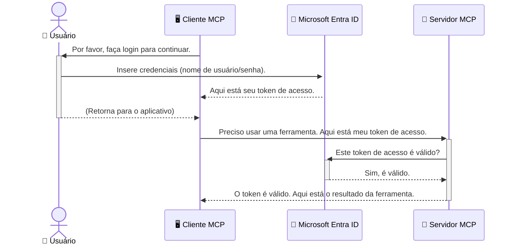

# Protegendo Fluxos de Trabalho de IA: Autenticação Entra ID para Servidores do Protocolo de Contexto de Modelo

## Introdução
Proteger seu servidor do Protocolo de Contexto de Modelo (MCP) é tão importante quanto trancar a porta da frente da sua casa. Deixar seu servidor MCP aberto expõe suas ferramentas e dados a acessos não autorizados, o que pode levar a violações de segurança. O Microsoft Entra ID oferece uma solução robusta de gerenciamento de identidade e acesso baseada em nuvem, ajudando a garantir que apenas usuários e aplicativos autorizados possam interagir com seu servidor MCP. Nesta seção, você aprenderá como proteger seus fluxos de trabalho de IA usando autenticação Entra ID.

## Objetivos de Aprendizagem
Ao final desta seção, você será capaz de:

- Entender a importância de proteger servidores MCP.
- Explicar os fundamentos do Microsoft Entra ID e da autenticação OAuth 2.0.
- Reconhecer a diferença entre clientes públicos e confidenciais.
- Implementar autenticação Entra ID em cenários de servidores MCP locais (cliente público) e remotos (cliente confidencial).
- Aplicar as melhores práticas de segurança no desenvolvimento de fluxos de trabalho de IA.

## Segurança e MCP

Assim como você não deixaria a porta da frente da sua casa destrancada, você não deve deixar seu servidor MCP aberto para acesso de qualquer pessoa. Garantir a segurança dos seus fluxos de trabalho de IA é essencial para construir aplicações robustas, confiáveis e seguras. Este capítulo irá apresentar como usar o Microsoft Entra ID para proteger seus servidores MCP, assegurando que apenas usuários e aplicativos autorizados possam interagir com suas ferramentas e dados.

## Por que a Segurança Importa para os Servidores MCP

Imagine que seu servidor MCP possui uma ferramenta que pode enviar e-mails ou acessar um banco de dados de clientes. Um servidor desprotegido significaria que qualquer pessoa poderia potencialmente usar essa ferramenta, resultando em acesso não autorizado a dados, spam ou outras atividades maliciosas.

Ao implementar autenticação, você garante que cada requisição ao seu servidor seja verificada, confirmando a identidade do usuário ou aplicativo que está fazendo a solicitação. Esse é o primeiro e mais crítico passo para proteger seus fluxos de trabalho de IA.

## Introdução ao Microsoft Entra ID

[**Microsoft Entra ID**](https://adoption.microsoft.com/microsoft-security/entra/) é um serviço baseado em nuvem para gerenciamento de identidade e acesso. Pense nele como um guarda de segurança universal para suas aplicações. Ele lida com o processo complexo de verificar identidades dos usuários (autenticação) e determinar o que eles podem fazer (autorização).

Ao usar o Entra ID, você pode:

- Habilitar login seguro para usuários.
- Proteger APIs e serviços.
- Gerenciar políticas de acesso de um local centralizado.

Para servidores MCP, o Entra ID fornece uma solução robusta e amplamente confiável para gerenciar quem pode acessar as capacidades do seu servidor.

---

## Entendendo a Magia: Como a Autenticação Entra ID Funciona

O Entra ID usa padrões abertos como **OAuth 2.0** para gerenciar a autenticação. Embora os detalhes possam ser complexos, o conceito principal é simples e pode ser compreendido com uma analogia.

### Uma Introdução Suave ao OAuth 2.0: A Chave de Manobrista

Pense no OAuth 2.0 como um serviço de manobrista para seu carro. Quando você chega a um restaurante, você não dá sua chave mestra ao manobrista. Em vez disso, você fornece uma **chave de manobrista** com permissões limitadas — ela pode ligar o carro e trancar as portas, mas não pode abrir o porta-malas ou o porta-luvas.

Nessa analogia:

- **Você** é o **Usuário**.
- **Seu carro** é o **Servidor MCP** com suas valiosas ferramentas e dados.
- O **Manobrista** é o **Microsoft Entra ID**.
- O **Atendente do Estacionamento** é o **Cliente MCP** (o aplicativo tentando acessar o servidor).
- A **Chave de Manobrista** é o **Token de Acesso**.

O token de acesso é uma string segura de texto que o cliente MCP recebe do Entra ID após você fazer login. O cliente então apresenta esse token ao servidor MCP a cada requisição. O servidor pode verificar o token para garantir que a solicitação é legítima e que o cliente possui as permissões necessárias, tudo isso sem nunca precisar manusear suas credenciais reais (como sua senha).

### O Fluxo de Autenticação

Veja como o processo funciona na prática:



### Apresentando a Microsoft Authentication Library (MSAL)

Antes de mergulharmos no código, é importante apresentar um componente chave que você verá nos exemplos: a **Microsoft Authentication Library (MSAL)**.

MSAL é uma biblioteca desenvolvida pela Microsoft que facilita muito para os desenvolvedores lidarem com autenticação. Em vez de você ter que escrever todo o código complexo para gerenciar tokens de segurança, fazer logins e atualizar sessões, a MSAL cuida do trabalho pesado.

Usar uma biblioteca como a MSAL é fortemente recomendado porque:

- **É Seguro:** Implementa protocolos padrão da indústria e melhores práticas de segurança, reduzindo o risco de vulnerabilidades no seu código.
- **Simplifica o Desenvolvimento:** Abstrai a complexidade dos protocolos OAuth 2.0 e OpenID Connect, permitindo que você adicione autenticação robusta à sua aplicação com poucas linhas de código.
- **É Mantida:** A Microsoft mantém e atualiza ativamente a MSAL para abordar novas ameaças de segurança e mudanças na plataforma.

A MSAL suporta uma grande variedade de linguagens e frameworks de aplicação, incluindo .NET, JavaScript/TypeScript, Python, Java, Go e plataformas móveis como iOS e Android. Isso significa que você pode usar os mesmos padrões consistentes de autenticação em toda sua pilha de tecnologia.

Para saber mais sobre MSAL, você pode consultar a documentação oficial [Visão geral do MSAL](https://learn.microsoft.com/entra/identity-platform/msal-overview).

---

## Protegendo Seu Servidor MCP com Entra ID: Um Guia Passo a Passo

Agora, vamos passar por como proteger um servidor MCP local (que se comunica por `stdio`) usando Entra ID. Este exemplo usa um **cliente público**, adequado para aplicações que rodam na máquina do usuário, como um app de desktop ou servidor local de desenvolvimento.

### Cenário 1: Protegendo um Servidor MCP Local (com Cliente Público)

Neste cenário, vamos analisar um servidor MCP que roda localmente, se comunica via `stdio`, e usa Entra ID para autenticar o usuário antes de permitir o acesso às suas ferramentas. O servidor terá uma única ferramenta que recupera as informações do perfil do usuário da Microsoft Graph API.

#### 1. Configurando a Aplicação no Entra ID

Antes de escrever qualquer código, você precisa registrar sua aplicação no Microsoft Entra ID. Isso informa ao Entra ID sobre sua aplicação e concede permissão para usar o serviço de autenticação.

1. Acesse o **[portal Microsoft Entra](https://entra.microsoft.com/)**.
2. Vá para **App registrations** e clique em **New registration**.
3. Dê um nome para sua aplicação (por exemplo, "Meu Servidor MCP Local").
4. Em **Supported account types**, selecione **Accounts in this organizational directory only**.
5. Você pode deixar o **Redirect URI** em branco para este exemplo.
6. Clique em **Register**.

Uma vez registrado, anote o **Application (client) ID** e o **Directory (tenant) ID**. Você precisará deles no seu código.

#### 2. O Código: Uma Análise

Vamos olhar as partes principais do código que lidam com autenticação. O código completo deste exemplo está disponível na pasta [Entra ID - Local - WAM](https://github.com/Azure-Samples/mcp-auth-servers/tree/main/src/entra-id-local-wam) do repositório do GitHub [mcp-auth-servers](https://github.com/Azure-Samples/mcp-auth-servers).

**`AuthenticationService.cs`**

Esta classe é responsável por lidar com a interação com o Entra ID.

- **`CreateAsync`**: Este método inicializa o `PublicClientApplication` da MSAL (Microsoft Authentication Library). Ele é configurado com o `clientId` e `tenantId` da sua aplicação.
- **`WithBroker`**: Habilita o uso de um broker (como o Windows Web Account Manager), que fornece uma experiência mais segura e fluida de single sign-on.
- **`AcquireTokenAsync`**: Este é o método principal. Ele tenta obter um token silenciosamente (ou seja, o usuário não precisa fazer login novamente se já tiver uma sessão válida). Caso não consiga obter o token silenciosamente, ele solicitará que o usuário faça login de forma interativa.

```csharp
// Simplified for clarity
public static async Task<AuthenticationService> CreateAsync(ILogger<AuthenticationService> logger)
{
    var msalClient = PublicClientApplicationBuilder
        .Create(_clientId) // Your Application (client) ID
        .WithAuthority(AadAuthorityAudience.AzureAdMyOrg)
        .WithTenantId(_tenantId) // Your Directory (tenant) ID
        .WithBroker(new BrokerOptions(BrokerOptions.OperatingSystems.Windows))
        .Build();

    // ... cache registration ...

    return new AuthenticationService(logger, msalClient);
}

public async Task<string> AcquireTokenAsync()
{
    try
    {
        // Try silent authentication first
        var accounts = await _msalClient.GetAccountsAsync();
        var account = accounts.FirstOrDefault();

        AuthenticationResult? result = null;

        if (account != null)
        {
            result = await _msalClient.AcquireTokenSilent(_scopes, account).ExecuteAsync();
        }
        else
        {
            // If no account, or silent fails, go interactive
            result = await _msalClient.AcquireTokenInteractive(_scopes).ExecuteAsync();
        }

        return result.AccessToken;
    }
    catch (Exception ex)
    {
        _logger.LogError(ex, "An error occurred while acquiring the token.");
        throw; // Optionally rethrow the exception for higher-level handling
    }
}
```

**`Program.cs`**

Aqui é onde o servidor MCP é configurado e o serviço de autenticação é integrado.

- **`AddSingleton<AuthenticationService>`**: Registra o `AuthenticationService` no container de injeção de dependência, para que ele possa ser usado em outras partes da aplicação (como na nossa ferramenta).
- **Ferramenta `GetUserDetailsFromGraph`**: Esta ferramenta necessita de uma instância do `AuthenticationService`. Antes de executar qualquer coisa, ela chama `authService.AcquireTokenAsync()` para obter um token de acesso válido. Se a autenticação for bem-sucedida, ela usa o token para chamar a Microsoft Graph API e buscar os detalhes do usuário.

```csharp
// Simplified for clarity
[McpServerTool(Name = "GetUserDetailsFromGraph")]
public static async Task<string> GetUserDetailsFromGraph(
    AuthenticationService authService)
{
    try
    {
        // This will trigger the authentication flow
        var accessToken = await authService.AcquireTokenAsync();

        // Use the token to create a GraphServiceClient
        var graphClient = new GraphServiceClient(
            new BaseBearerTokenAuthenticationProvider(new TokenProvider(authService)));

        var user = await graphClient.Me.GetAsync();

        return System.Text.Json.JsonSerializer.Serialize(user);
    }
    catch (Exception ex)
    {
        return $"Error: {ex.Message}";
    }
}
```

#### 3. Como Tudo Funciona em Conjunto

1. Quando o cliente MCP tenta usar a ferramenta `GetUserDetailsFromGraph`, a ferramenta primeiro chama `AcquireTokenAsync`.
2. `AcquireTokenAsync` aciona a biblioteca MSAL para verificar se há um token válido.
3. Se nenhum token for encontrado, a MSAL, via broker, solicita que o usuário faça login com sua conta Entra ID.
4. Uma vez que o usuário faça login, o Entra ID emite um token de acesso.
5. A ferramenta recebe o token e o usa para fazer uma chamada segura à Microsoft Graph API.
6. Os dados do usuário são retornados ao cliente MCP.

Esse processo garante que apenas usuários autenticados possam usar a ferramenta, protegendo eficazmente seu servidor MCP local.

### Cenário 2: Protegendo um Servidor MCP Remoto (com Cliente Confidencial)

Quando seu servidor MCP está rodando em uma máquina remota (como um servidor na nuvem) e se comunica via um protocolo como HTTP Streaming, os requisitos de segurança são diferentes. Nesse caso, você deve usar um **cliente confidencial** e o **Authorization Code Flow**. Este é um método mais seguro porque os segredos do aplicativo nunca são expostos ao navegador.

Este exemplo usa um servidor MCP baseado em TypeScript que utiliza Express.js para lidar com requisições HTTP.

#### 1. Configurando a Aplicação no Entra ID

A configuração no Entra ID é semelhante à do cliente público, mas com uma diferença importante: você precisa criar um **segredo de cliente**.

1. Acesse o **[portal Microsoft Entra](https://entra.microsoft.com/)**.
2. Na sua app registration, vá para a aba **Certificates & secrets**.
3. Clique em **New client secret**, dê uma descrição e clique em **Add**.
4. **Importante:** Copie o valor do segredo imediatamente. Você não poderá vê-lo novamente.
5. Você também precisa configurar um **Redirect URI**. Vá para a aba **Authentication**, clique em **Add a platform**, selecione **Web** e insira o URI de redirecionamento da sua aplicação (por exemplo, `http://localhost:3001/auth/callback`).

> **⚠️ Nota Importante de Segurança:** Para aplicações em produção, a Microsoft recomenda fortemente o uso de métodos de autenticação **sem segredo**, como **Managed Identity** ou **Workload Identity Federation** ao invés de segredos de cliente. Segredos de cliente apresentam riscos de segurança pois podem ser expostos ou comprometidos. Identidades gerenciadas oferecem uma abordagem mais segura ao eliminar a necessidade de armazenar credenciais no seu código ou configuração.
>
> Para mais informações sobre identidades gerenciadas e como implementá-las, veja a [Visão geral de identidades gerenciadas para recursos Azure](https://learn.microsoft.com/entra/identity/managed-identities-azure-resources/overview).

#### 2. O Código: Uma Análise

Este exemplo usa uma abordagem baseada em sessão. Quando o usuário autentica, o servidor armazena o token de acesso e o token de atualização na sessão e fornece ao usuário um token de sessão. Este token de sessão é então usado para requisições subsequentes. O código completo deste exemplo está disponível na pasta [Entra ID - Confidential client](https://github.com/Azure-Samples/mcp-auth-servers/tree/main/src/entra-id-cca-session) do repositório GitHub [mcp-auth-servers](https://github.com/Azure-Samples/mcp-auth-servers).

**`Server.ts`**

Este arquivo configura o servidor Express e a camada de transporte MCP.

- **`requireBearerAuth`**: Este é um middleware que protege os endpoints `/sse` e `/message`. Ele verifica se há um token bearer válido no cabeçalho `Authorization` da requisição.
- **`EntraIdServerAuthProvider`**: Esta é uma classe personalizada que implementa a interface `McpServerAuthorizationProvider`. É responsável por lidar com o fluxo OAuth 2.0.
- **`/auth/callback`**: Este endpoint lida com o redirecionamento do Entra ID após o usuário se autenticar. Ele troca o código de autorização por um token de acesso e um token de atualização.

```typescript
// Simplificado para clareza
const app = express();
const { server } = createServer();
const provider = new EntraIdServerAuthProvider();

// Proteger o endpoint SSE
app.get("/sse", requireBearerAuth({
  provider,
  requiredScopes: ["User.Read"]
}), async (req, res) => {
  // ... conectar ao transporte ...
});

// Proteger o endpoint de mensagens
app.post("/message", requireBearerAuth({
  provider,
  requiredScopes: ["User.Read"]
}), async (req, res) => {
  // ... processar a mensagem ...
});

// Tratar o callback do OAuth 2.0
app.get("/auth/callback", (req, res) => {
  provider.handleCallback(req.query.code, req.query.state)
    .then(result => {
      // ... tratar sucesso ou falha ...
    });
});
```

**`Tools.ts`**

Este arquivo define as ferramentas que o servidor MCP fornece. A ferramenta `getUserDetails` é semelhante à do exemplo anterior, mas obtém o token de acesso da sessão.

```typescript
// Simplificado para clareza
server.setRequestHandler(CallToolRequestSchema, async (request) => {
  const { name } = request.params;
  const context = request.params?.context as { token?: string } | undefined;
  const sessionToken = context?.token;

  if (name === ToolName.GET_USER_DETAILS) {
    if (!sessionToken) {
      throw new AuthenticationError("Authentication token is missing or invalid. Ensure the token is provided in the request context.");
    }

    // Obter o token Entra ID da sessão armazenada
    const tokenData = tokenStore.getToken(sessionToken);
    const entraIdToken = tokenData.accessToken;

    const graphClient = Client.init({
      authProvider: (done) => {
        done(null, entraIdToken);
      }
    });

    const user = await graphClient.api('/me').get();

    // ... retornar detalhes do usuário ...
  }
});
```

**`auth/EntraIdServerAuthProvider.ts`**

Esta classe trata a lógica para:

- Redirecionar o usuário para a página de login do Entra ID.
- Trocar o código de autorização por um token de acesso.
- Armazenar os tokens no `tokenStore`.
- Atualizar o token de acesso quando expirar.

#### 3. Como Tudo Funciona em Conjunto

1. Quando um usuário tenta se conectar ao servidor MCP pela primeira vez, o middleware `requireBearerAuth` verifica que ele não tem uma sessão válida e redireciona para a página de login do Entra ID.
2. O usuário faz login com sua conta Entra ID.
3. O Entra ID redireciona o usuário de volta para o endpoint `/auth/callback` com um código de autorização.  
4. O servidor troca o código por um token de acesso e um token de atualização, os armazena e cria um token de sessão que é enviado ao cliente.  
5. O cliente pode agora usar esse token de sessão no cabeçalho `Authorization` para todas as futuras requisições ao servidor MCP.  
6. Quando a ferramenta `getUserDetails` é chamada, ela usa o token de sessão para localizar o token de acesso do Entra ID e então usa esse token para chamar a API Microsoft Graph.

Esse fluxo é mais complexo que o fluxo de cliente público, mas é necessário para endpoints acessíveis pela internet. Como os servidores MCP remotos são acessíveis pela internet pública, eles precisam de medidas de segurança mais rigorosas para proteger contra acessos não autorizados e possíveis ataques.

## Melhores Práticas de Segurança

- **Sempre use HTTPS**: Criptografe a comunicação entre o cliente e o servidor para proteger os tokens de interceptação.  
- **Implemente Controle de Acesso Baseado em Funções (RBAC)**: Não verifique apenas se o usuário está autenticado; verifique o que ele está autorizado a fazer. Você pode definir funções no Entra ID e verificá-las no seu servidor MCP.  
- **Monitore e audite**: Registre todos os eventos de autenticação para que você possa detectar e responder a atividades suspeitas.  
- **Gerencie limites de taxa e controle de acesso**: Microsoft Graph e outras APIs implementam limites de taxa para prevenir abusos. Implemente lógica de recuo exponencial e reintentos no seu servidor MCP para lidar graciosamente com respostas HTTP 429 (Too Many Requests). Considere armazenar em cache dados acessados frequentemente para reduzir chamadas à API.  
- **Armazenamento seguro de tokens**: Armazene tokens de acesso e tokens de atualização com segurança. Para aplicações locais, use os mecanismos de armazenamento seguro do sistema. Para aplicações em servidor, considere usar armazenamento criptografado ou serviços de gerenciamento seguro de chaves como o Azure Key Vault.  
- **Gerenciamento da expiração dos tokens**: Tokens de acesso têm um tempo de vida limitado. Implemente atualização automática de token usando tokens de atualização para manter uma experiência de usuário contínua sem necessidade de reautenticação.  
- **Considere usar Azure API Management**: Embora implementar segurança diretamente no seu servidor MCP lhe dê controle detalhado, gateways de API como o Azure API Management podem cuidar automaticamente de muitas dessas preocupações de segurança, incluindo autenticação, autorização, limites de taxa e monitoramento. Eles fornecem uma camada de segurança centralizada que fica entre seus clientes e seus servidores MCP. Para mais detalhes sobre o uso de gateways de API com MCP, veja nosso [Azure API Management Your Auth Gateway For MCP Servers](https://techcommunity.microsoft.com/blog/integrationsonazureblog/azure-api-management-your-auth-gateway-for-mcp-servers/4402690).

## Principais Pontos

- Proteger seu servidor MCP é fundamental para proteger seus dados e ferramentas.  
- O Microsoft Entra ID fornece uma solução robusta e escalável para autenticação e autorização.  
- Use um **cliente público** para aplicações locais e um **cliente confidencial** para servidores remotos.  
- O **Fluxo do Código de Autorização** é a opção mais segura para aplicações web.

## Exercício

1. Pense em um servidor MCP que você poderia criar. Ele seria um servidor local ou remoto?  
2. Com base na sua resposta, você usaria um cliente público ou confidencial?  
3. Qual permissão seu servidor MCP solicitariam para executar ações contra o Microsoft Graph?

## Exercícios Práticos

### Exercício 1: Registrar uma Aplicação no Entra ID  
Navegue até o portal Microsoft Entra.  
Registre uma nova aplicação para seu servidor MCP.  
Anote o ID da Aplicação (cliente) e o ID do Diretório (locatário).

### Exercício 2: Proteger um Servidor MCP Local (Cliente Público)  
- Siga o exemplo de código para integrar o MSAL (Microsoft Authentication Library) para autenticação de usuário.  
- Teste o fluxo de autenticação chamando a ferramenta MCP que obtém detalhes do usuário do Microsoft Graph.

### Exercício 3: Proteger um Servidor MCP Remoto (Cliente Confidencial)  
- Registre um cliente confidencial no Entra ID e crie um segredo de cliente.  
- Configure seu servidor MCP Express.js para usar o Fluxo do Código de Autorização.  
- Teste os endpoints protegidos e confirme o acesso baseado em token.

### Exercício 4: Aplicar as Melhores Práticas de Segurança  
- Habilite HTTPS para seu servidor local ou remoto.  
- Implemente controle de acesso baseado em função (RBAC) na lógica do seu servidor.  
- Adicione gerenciamento da expiração de tokens e armazenamento seguro de tokens.

## Recursos

1. **Documentação de Visão Geral do MSAL**  
   Saiba como a Microsoft Authentication Library (MSAL) permite aquisição segura de tokens em várias plataformas:  
   [MSAL Overview on Microsoft Learn](https://learn.microsoft.com/en-gb/entra/msal/overview)

2. **Repositório GitHub Azure-Samples/mcp-auth-servers**  
   Implementações de referência de servidores MCP demonstrando fluxos de autenticação:  
   [Azure-Samples/mcp-auth-servers on GitHub](https://github.com/Azure-Samples/mcp-auth-servers)

3. **Visão Geral das Identidades Gerenciadas para Recursos do Azure**  
   Entenda como eliminar segredos usando identidades gerenciadas atribuídas pelo sistema ou pelo usuário:  
   [Managed Identities Overview on Microsoft Learn](https://learn.microsoft.com/en-us/entra/identity/managed-identities-azure-resources/)

4. **Azure API Management: Seu Gateway de Autenticação para Servidores MCP**  
   Um mergulho detalhado no uso do APIM como gateway OAuth2 seguro para servidores MCP:  
   [Azure API Management Your Auth Gateway For MCP Servers](https://techcommunity.microsoft.com/blog/integrationsonazureblog/azure-api-management-your-auth-gateway-for-mcp-servers/4402690)

5. **Referência de Permissões do Microsoft Graph**  
   Lista abrangente de permissões delegadas e de aplicação para Microsoft Graph:  
   [Microsoft Graph Permissions Reference](https://learn.microsoft.com/zh-tw/graph/permissions-reference)

## Resultados de Aprendizagem  
Após concluir esta seção, você será capaz de:

- Explicar por que a autenticação é crítica para servidores MCP e fluxos de trabalho de IA.  
- Configurar e configurar a autenticação Entra ID para cenários de servidor MCP locais e remotos.  
- Escolher o tipo de cliente apropriado (público ou confidencial) com base no seu ambiente de implantação.  
- Implementar práticas de codificação segura, incluindo armazenamento de tokens e autorização baseada em função.  
- Proteger com confiança seu servidor MCP e suas ferramentas contra acessos não autorizados.

## O que vem a seguir

- [5.13 Integração do Protocolo de Contexto de Modelo (MCP) com Microsoft Foundry](../mcp-foundry-agent-integration/README.md)

---

<!-- CO-OP TRANSLATOR DISCLAIMER START -->
**Aviso Legal**:
Este documento foi traduzido usando o serviço de tradução por IA [Co-op Translator](https://github.com/Azure/co-op-translator). Embora nos esforcemos pela precisão, por favor, esteja ciente de que traduções automatizadas podem conter erros ou imprecisões. O documento original em seu idioma nativo deve ser considerado a fonte autorizada. Para informações críticas, recomenda-se tradução profissional humana. Não nos responsabilizamos por quaisquer mal-entendidos ou interpretações incorretas decorrentes do uso desta tradução.
<!-- CO-OP TRANSLATOR DISCLAIMER END -->