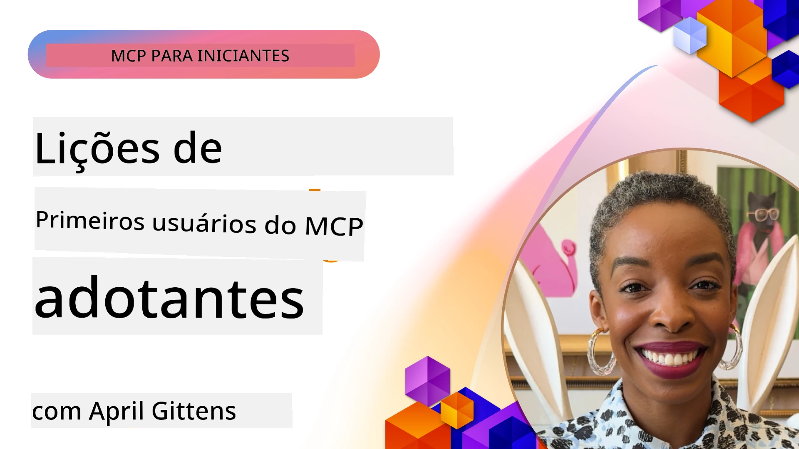

# 🌟 Lições dos Primeiros Usuários

[](https://youtu.be/jds7dSmNptE)

_(Clique na imagem acima para assistir ao vídeo desta lição)_

## 🎯 O Que Este Módulo Cobre

Este módulo explora como organizações e desenvolvedores reais estão aproveitando o Model Context Protocol (MCP) para resolver desafios reais e impulsionar a inovação. Por meio de estudos de caso detalhados, projetos práticos e exemplos práticos, você descobrirá como o MCP possibilita integrações de IA seguras e escaláveis que conectam modelos de linguagem, ferramentas e dados empresariais.

### 📚 Veja o MCP em Ação

Quer ver esses princípios aplicados a ferramentas prontas para produção? Confira nossos [**10 Servidores MCP da Microsoft que Estão Transformando a Produtividade do Desenvolvedor**](microsoft-mcp-servers.md), que apresenta servidores MCP reais da Microsoft que você pode usar hoje.

## Visão Geral

Esta lição explora como os primeiros usuários aproveitaram o Model Context Protocol (MCP) para resolver desafios do mundo real e impulsionar a inovação em diversos setores. Por meio de estudos de caso detalhados e projetos práticos, você verá como o MCP permite uma integração padronizada, segura e escalável da IA — conectando grandes modelos de linguagem, ferramentas e dados empresariais em uma estrutura unificada. Você ganhará experiência prática em projetar e construir soluções baseadas em MCP, aprenderá com padrões comprovados de implementação e descobrirá as melhores práticas para implantar o MCP em ambientes de produção. A lição também destaca tendências emergentes, direções futuras e recursos de código aberto para ajudá-lo a estar na vanguarda da tecnologia MCP e seu ecossistema em evolução.

## Objetivos de Aprendizagem

- Analisar implementações reais do MCP em diferentes setores
- Projetar e construir aplicações completas baseadas em MCP
- Explorar tendências emergentes e direções futuras na tecnologia MCP
- Aplicar melhores práticas em cenários reais de desenvolvimento

## Implementações Reais do MCP

### Estudo de Caso 1: Automação de Suporte ao Cliente Corporativo

Uma corporação multinacional implementou uma solução baseada em MCP para padronizar as interações de IA em seus sistemas de suporte ao cliente. Isso lhes permitiu:

- Criar uma interface unificada para múltiplos provedores de LLM
- Manter gerenciamento consistente de prompts entre departamentos
- Implementar controles robustos de segurança e conformidade
- Alternar facilmente entre diferentes modelos de IA conforme necessidades específicas

**Implementação Técnica:**

```python
# Implementação do servidor MCP em Python para suporte ao cliente
import logging
import asyncio
from modelcontextprotocol import create_server, ServerConfig
from modelcontextprotocol.server import MCPServer
from modelcontextprotocol.transports import create_http_transport
from modelcontextprotocol.resources import ResourceDefinition
from modelcontextprotocol.prompts import PromptDefinition
from modelcontextprotocol.tool import ToolDefinition

# Configurar o registro de logs
logging.basicConfig(level=logging.INFO)

async def main():
    # Criar configuração do servidor
    config = ServerConfig(
        name="Enterprise Customer Support Server",
        version="1.0.0",
        description="MCP server for handling customer support inquiries"
    )
    
    # Inicializar servidor MCP
    server = create_server(config)
    
    # Registrar recursos da base de conhecimento
    server.resources.register(
        ResourceDefinition(
            name="customer_kb",
            description="Customer knowledge base documentation"
        ),
        lambda params: get_customer_documentation(params)
    )
    
    # Registrar templates de prompt
    server.prompts.register(
        PromptDefinition(
            name="support_template",
            description="Templates for customer support responses"
        ),
        lambda params: get_support_templates(params)
    )
    
    # Registrar ferramentas de suporte
    server.tools.register(
        ToolDefinition(
            name="ticketing",
            description="Create and update support tickets"
        ),
        handle_ticketing_operations
    )
    
    # Iniciar servidor com transporte HTTP
    transport = create_http_transport(port=8080)
    await server.run(transport)

if __name__ == "__main__":
    asyncio.run(main())
```

**Resultados:** Redução de 30% nos custos de modelo, melhoria de 45% na consistência das respostas e conformidade aprimorada em operações globais.

### Estudo de Caso 2: Assistente Diagnóstico em Saúde

Um provedor de saúde desenvolveu uma infraestrutura MCP para integrar múltiplos modelos médicos especializados em IA, garantindo que dados sensíveis dos pacientes permaneçam protegidos:

- Alternância fluida entre modelos médicos generalistas e especialistas
- Controles rigorosos de privacidade e trilhas de auditoria
- Integração com sistemas existentes de Prontuário Eletrônico do Paciente (EHR)
- Engenharia consistente de prompts para terminologia médica

**Implementação Técnica:**

```csharp
// C# MCP host application implementation in healthcare application
using Microsoft.Extensions.DependencyInjection;
using ModelContextProtocol.SDK.Client;
using ModelContextProtocol.SDK.Security;
using ModelContextProtocol.SDK.Resources;

public class DiagnosticAssistant
{
    private readonly MCPHostClient _mcpClient;
    private readonly PatientContext _patientContext;
    
    public DiagnosticAssistant(PatientContext patientContext)
    {
        _patientContext = patientContext;
        
        // Configure MCP client with healthcare-specific settings
        var clientOptions = new ClientOptions
        {
            Name = "Healthcare Diagnostic Assistant",
            Version = "1.0.0",
            Security = new SecurityOptions
            {
                Encryption = EncryptionLevel.Medical,
                AuditEnabled = true
            }
        };
        
        _mcpClient = new MCPHostClientBuilder()
            .WithOptions(clientOptions)
            .WithTransport(new HttpTransport("https://healthcare-mcp.example.org"))
            .WithAuthentication(new HIPAACompliantAuthProvider())
            .Build();
    }
    
    public async Task<DiagnosticSuggestion> GetDiagnosticAssistance(
        string symptoms, string patientHistory)
    {
        // Create request with appropriate resources and tool access
        var resourceRequest = new ResourceRequest
        {
            Name = "patient_records",
            Parameters = new Dictionary<string, object>
            {
                ["patientId"] = _patientContext.PatientId,
                ["requestingProvider"] = _patientContext.ProviderId
            }
        };
        
        // Request diagnostic assistance using appropriate prompt
        var response = await _mcpClient.SendPromptRequestAsync(
            promptName: "diagnostic_assistance",
            parameters: new Dictionary<string, object>
            {
                ["symptoms"] = symptoms,
                patientHistory = patientHistory,
                relevantGuidelines = _patientContext.GetRelevantGuidelines()
            });
            
        return DiagnosticSuggestion.FromMCPResponse(response);
    }
}
```

**Resultados:** Melhoria nas sugestões diagnósticas para médicos, mantendo total conformidade com HIPAA e redução significativa na troca de contexto entre sistemas.

### Estudo de Caso 3: Análise de Risco em Serviços Financeiros

Uma instituição financeira implementou MCP para padronizar seus processos de análise de risco em diferentes departamentos:

- Criou uma interface unificada para modelos de risco de crédito, detecção de fraude e risco de investimento
- Implementou controles rígidos de acesso e versionamento de modelos
- Garantiu auditabilidade de todas as recomendações de IA
- Manteve formatação consistente de dados entre sistemas diversos

**Implementação Técnica:**

```java
// Servidor MCP Java para avaliação de risco financeiro
import org.mcp.server.*;
import org.mcp.security.*;

public class FinancialRiskMCPServer {
    public static void main(String[] args) {
        // Criar servidor MCP com recursos de conformidade financeira
        MCPServer server = new MCPServerBuilder()
            .withModelProviders(
                new ModelProvider("risk-assessment-primary", new AzureOpenAIProvider()),
                new ModelProvider("risk-assessment-audit", new LocalLlamaProvider())
            )
            .withPromptTemplateDirectory("./compliance/templates")
            .withAccessControls(new SOCCompliantAccessControl())
            .withDataEncryption(EncryptionStandard.FINANCIAL_GRADE)
            .withVersionControl(true)
            .withAuditLogging(new DatabaseAuditLogger())
            .build();
            
        server.addRequestValidator(new FinancialDataValidator());
        server.addResponseFilter(new PII_RedactionFilter());
        
        server.start(9000);
        
        System.out.println("Financial Risk MCP Server running on port 9000");
    }
}
```

**Resultados:** Conformidade regulatória aprimorada, ciclos de implantação de modelos 40% mais rápidos e melhor consistência na avaliação de riscos entre departamentos.

### Estudo de Caso 4: Servidor MCP Playwright da Microsoft para Automação de Navegador

A Microsoft desenvolveu o [servidor MCP Playwright](https://github.com/microsoft/playwright-mcp) para permitir automação de navegador segura e padronizada através do Model Context Protocol. Este servidor pronto para produção permite que agentes de IA e LLMs interajam com navegadores web de forma controlada, auditável e extensível — possibilitando casos de uso como testes automatizados da web, extração de dados e fluxos de trabalho ponta a ponta.

> **🎯 Ferramenta Pronta para Produção**
> 
> Este estudo de caso mostra um servidor MCP real que você pode usar hoje! Saiba mais sobre o Servidor MCP Playwright e outros 9 servidores MCP da Microsoft prontos para produção em nosso [**Guia dos Servidores MCP da Microsoft**](microsoft-mcp-servers.md#8--playwright-mcp-server).

**Principais Recursos:**
- Expõe capacidades de automação de navegador (navegação, preenchimento de formulários, captura de tela etc.) como ferramentas MCP
- Implementa controles rigorosos de acesso e sandboxing para evitar ações não autorizadas
- Fornece logs detalhados de auditoria para todas as interações com o navegador
- Suporta integração com Azure OpenAI e outros provedores de LLM para automação guiada por agentes
- Alimenta o Agente de Codificação do GitHub Copilot com capacidades de navegação web

**Implementação Técnica:**

```typescript
// TypeScript: Registrando ferramentas de automação do navegador Playwright em um servidor MCP
import { createServer, ToolDefinition } from 'modelcontextprotocol';
import { launch } from 'playwright';

const server = createServer({
  name: 'Playwright MCP Server',
  version: '1.0.0',
  description: 'MCP server for browser automation using Playwright'
});

// Registrar uma ferramenta para navegar até uma URL e capturar uma captura de tela
server.tools.register(
  new ToolDefinition({
    name: 'navigate_and_screenshot',
    description: 'Navigate to a URL and capture a screenshot',
    parameters: {
      url: { type: 'string', description: 'The URL to visit' }
    }
  }),
  async ({ url }) => {
    const browser = await launch();
    const page = await browser.newPage();
    await page.goto(url);
    const screenshot = await page.screenshot();
    await browser.close();
    return { screenshot };
  }
);

// Iniciar o servidor MCP
server.listen(8080);
```

**Resultados:**

- Permitiu automação programática segura do navegador para agentes de IA e LLMs
- Reduziu o esforço de testes manuais e melhorou a cobertura de testes para aplicações web
- Ofereceu uma estrutura reutilizável e extensível para integração de ferramentas baseadas em navegador em ambientes corporativos
- Alimenta as capacidades de navegação web do GitHub Copilot

**Referências:**

- [Repositório GitHub do Servidor MCP Playwright](https://github.com/microsoft/playwright-mcp)
- [Soluções de IA e Automação da Microsoft](https://azure.microsoft.com/en-us/products/ai-services/)

### Estudo de Caso 5: Azure MCP – Model Context Protocol Empresarial como Serviço

O Servidor Azure MCP ([https://aka.ms/azmcp](https://aka.ms/azmcp)) é a implementação gerenciada e empresarial do Model Context Protocol da Microsoft, projetado para oferecer capacidades de servidor MCP escaláveis, seguras e compatíveis como serviço de nuvem. O Azure MCP permite que organizações implantem, gerenciem e integrem rapidamente servidores MCP com serviços de IA, dados e segurança do Azure, reduzindo a sobrecarga operacional e acelerando a adoção de IA.

> **🎯 Ferramenta Pronta para Produção**
> 
> Este é um servidor MCP real que você pode usar hoje! Saiba mais sobre o Servidor MCP Microsoft Foundry em nosso [**Guia dos Servidores MCP da Microsoft**](microsoft-mcp-servers.md).

- Hospedagem totalmente gerenciada de servidores MCP com escalabilidade, monitoramento e segurança integrados
- Integração nativa com Azure OpenAI, Azure AI Search e outros serviços Azure
- Autenticação e autorização empresarial via Microsoft Entra ID
- Suporte para ferramentas personalizadas, templates de prompts e conectores de recursos
- Conformidade com requisitos de segurança e regulatórios empresariais

**Implementação Técnica:**

```yaml
# Example: Azure MCP server deployment configuration (YAML)
apiVersion: mcp.microsoft.com/v1
kind: McpServer
metadata:
  name: enterprise-mcp-server
spec:
  modelProviders:
    - name: azure-openai
      type: AzureOpenAI
      endpoint: https://<your-openai-resource>.openai.azure.com/
      apiKeySecret: <your-azure-keyvault-secret>
  tools:
    - name: document_search
      type: AzureAISearch
      endpoint: https://<your-search-resource>.search.windows.net/
      apiKeySecret: <your-azure-keyvault-secret>
  authentication:
    type: EntraID
    tenantId: <your-tenant-id>
  monitoring:
    enabled: true
    logAnalyticsWorkspace: <your-log-analytics-id>
```

**Resultados:**  
- Redução do tempo para obtenção de valor em projetos de IA corporativa por fornecer uma plataforma de servidor MCP pronta para uso e compatível
- Integração simplificada de LLMs, ferramentas e fontes de dados empresariais
- Segurança, observabilidade e eficiência operacional aprimoradas para cargas de trabalho MCP
- Qualidade de código melhorada com melhores práticas do SDK do Azure e padrões atuais de autenticação

**Referências:**  
- [Documentação Azure MCP](https://aka.ms/azmcp)
- [Repositório GitHub do Servidor Azure MCP](https://github.com/Azure/azure-mcp)
- [Serviços Azure AI](https://azure.microsoft.com/en-us/products/ai-services/)
- [Centro Microsoft MCP](https://mcp.azure.com)

## Estudo de Caso 6: NLWeb  
O MCP (Model Context Protocol) é um protocolo emergente para chatbots e assistentes de IA interagirem com ferramentas. Cada instância do NLWeb também é um servidor MCP, que suporta um método principal, ask, usado para perguntar a um site uma questão em linguagem natural. A resposta retornada utiliza schema.org, um vocabulário amplamente usado para descrever dados web. Falando de modo geral, MCP é para NLWeb o que Http é para HTML. NLWeb combina protocolos, formatos Schema.org e códigos de exemplo para ajudar sites a criar rapidamente esses endpoints, beneficiando tanto humanos por meio de interfaces conversacionais quanto máquinas por meio de interação natural agente-agente.

Existem dois componentes distintos no NLWeb.
- Um protocolo, muito simples para iniciar, para interfacear com um site em linguagem natural e um formato, utilizando json e schema.org para a resposta retornada. Veja a documentação da API REST para mais detalhes.
- Uma implementação direta de (1) que aproveita marcação existente, para sites que podem ser abstratados como listas de itens (produtos, receitas, atrações, avaliações etc.). Com um conjunto de widgets de interface de usuário, os sites podem facilmente fornecer interfaces conversacionais para seu conteúdo. Veja a documentação Life of a chat query para mais detalhes sobre como isso funciona.
 
**Referências:**  
- [Documentação Azure MCP](https://aka.ms/azmcp)
- [NLWeb](https://github.com/microsoft/NlWeb)

### Estudo de Caso 7: Servidor MCP Microsoft Foundry – Integração de Agente de IA Empresarial

Os servidores MCP Microsoft Foundry demonstram como o MCP pode ser usado para orquestrar e gerenciar agentes de IA e fluxos de trabalho em ambientes corporativos. Ao integrar o MCP com o Microsoft Foundry, as organizações podem padronizar interações de agentes, aproveitar o gerenciamento de fluxos de trabalho do Foundry e garantir implantações seguras e escaláveis.

> **🎯 Ferramenta Pronta para Produção**
> 
> Este é um servidor MCP real que você pode usar hoje! Saiba mais sobre o Servidor MCP Microsoft Foundry em nosso [**Guia dos Servidores MCP da Microsoft**](microsoft-mcp-servers.md#9--microsoft-foundry-mcp-server).

**Principais Recursos:**
- Acesso abrangente ao ecossistema de IA do Azure, incluindo catálogos de modelos e gerenciamento de implantação
- Indexação de conhecimento com Azure AI Search para aplicações RAG
- Ferramentas de avaliação para desempenho de modelos de IA e garantia de qualidade
- Integração com Microsoft Foundry Catalog e Labs para modelos de pesquisa avançada
- Capacidades de gerenciamento e avaliação de agentes para cenários de produção

**Resultados:**
- Protótipos rápidos e monitoramento robusto de fluxos de trabalho de agentes de IA
- Integração perfeita com serviços Azure AI para cenários avançados
- Interface unificada para construção, implantação e monitoramento de pipelines de agentes
- Segurança, conformidade e eficiência operacional aprimoradas para empresas
- Adoção acelerada de IA mantendo controle sobre processos complexos guiados por agentes

**Referências:**
- [Repositório GitHub do Servidor MCP Microsoft Foundry](https://github.com/azure-ai-foundry/mcp-foundry)
- [Integração de Agentes Azure AI com MCP (Blog Microsoft Foundry)](https://devblogs.microsoft.com/foundry/integrating-azure-ai-agents-mcp/)

### Estudo de Caso 8: Foundry MCP Playground – Experimentação e Prototipagem

O Foundry MCP Playground oferece um ambiente pronto para uso para experimentação com servidores MCP e integrações Microsoft Foundry. Desenvolvedores podem rapidamente criar protótipos, testar e avaliar modelos de IA e fluxos de trabalho de agentes usando recursos do Microsoft Foundry Catalog e Labs. O playground simplifica a configuração, oferece projetos de exemplo e suporta desenvolvimento colaborativo, facilitando a exploração de melhores práticas e novos cenários com sobrecarga mínima. É especialmente útil para equipes que buscam validar ideias, compartilhar experimentos e acelerar o aprendizado sem precisar de infraestrutura complexa. Ao reduzir a barreira de entrada, o playground ajuda a fomentar inovação e contribuições da comunidade no ecossistema MCP e Microsoft Foundry.

**Referências:**

- [Repositório GitHub do Foundry MCP Playground](https://github.com/azure-ai-foundry/foundry-mcp-playground)

### Estudo de Caso 9: Servidor MCP Microsoft Learn Docs – Acesso à Documentação com IA

O Servidor MCP Microsoft Learn Docs é um serviço hospedado na nuvem que oferece a assistentes de IA acesso em tempo real à documentação oficial da Microsoft por meio do Model Context Protocol. Este servidor pronto para produção conecta-se ao abrangente ecossistema Microsoft Learn e permite busca semântica em todas as fontes oficiais da Microsoft.

> **🎯 Ferramenta Pronta para Produção**
> 
> Este é um servidor MCP real que você pode usar hoje! Saiba mais sobre o Servidor MCP Microsoft Learn Docs em nosso [**Guia dos Servidores MCP da Microsoft**](microsoft-mcp-servers.md#1--microsoft-learn-docs-mcp-server).

**Principais Recursos:**
- Acesso em tempo real à documentação oficial da Microsoft, documentos Azure e documentação Microsoft 365
- Capacidades avançadas de busca semântica que entendem contexto e intenção
- Informações sempre atualizadas à medida que o conteúdo Microsoft Learn é publicado
- Cobertura abrangente do Microsoft Learn, documentação Azure e fontes Microsoft 365
- Retorna até 10 fragmentos de conteúdo de alta qualidade com títulos de artigos e URLs

**Por Que é Fundamental:**
- Resolve o problema de “conhecimento desatualizado de IA” para tecnologias Microsoft
- Garante que assistentes de IA tenham acesso aos recursos mais recentes de .NET, C#, Azure e Microsoft 365
- Fornece informações autoritativas, de primeira mão, para geração precisa de código
- Essencial para desenvolvedores que trabalham com tecnologias Microsoft em rápida evolução

**Resultados:**
- Melhoria drástica na precisão de código gerado por IA para tecnologias Microsoft
- Redução do tempo gasto procurando documentação atual e melhores práticas
- Aumento da produtividade do desenvolvedor com recuperação de documentação contextual
- Integração perfeita com fluxos de trabalho de desenvolvimento sem sair do IDE

**Referências:**
- [Repositório GitHub do Servidor MCP Microsoft Learn Docs](https://github.com/MicrosoftDocs/mcp)
- [Documentação Microsoft Learn](https://learn.microsoft.com/)

## Projetos Práticos

### Projeto 1: Construir um Servidor MCP Multi-Provedor

**Objetivo:** Criar um servidor MCP que possa direcionar requisições para múltiplos provedores de modelos de IA com base em critérios específicos.

**Requisitos:**

- Suportar pelo menos três provedores diferentes de modelos (ex: OpenAI, Anthropic, modelos locais)
- Implementar um mecanismo de roteamento baseado em metadados da requisição
- Criar um sistema de configuração para gerenciar credenciais dos provedores
- Adicionar cache para otimizar performance e custos
- Construir um painel simples para monitorar o uso

**Passos de Implementação:**

1. Configurar a infraestrutura básica do servidor MCP
2. Implementar adaptadores para cada provedor de serviço de modelo de IA
3. Criar a lógica de roteamento baseada em atributos da solicitação
4. Adicionar mecanismos de cache para requisições frequentes
5. Desenvolver o painel de monitoramento
6. Testar com vários padrões de solicitação

**Tecnologias:** Escolha entre Python (.NET/Java/Python conforme sua preferência), Redis para cache, e um framework web simples para o painel.

### Projeto 2: Sistema Corporativo de Gerenciamento de Prompts

**Objetivo:** Desenvolver um sistema baseado em MCP para gerenciar, versionar e implantar templates de prompt em toda a organização.

**Requisitos:**
- Criar um repositório centralizado para modelos de prompt  
- Implementar versionamento e fluxos de aprovação  
- Construir capacidades de teste de modelos com entradas de exemplo  
- Desenvolver controles de acesso baseados em função  
- Criar uma API para recuperação e implantação de modelos  

**Etapas de Implementação:**  

1. Projetar o esquema do banco de dados para armazenamento de modelos  
2. Criar a API principal para operações CRUD de modelos  
3. Implementar o sistema de versionamento  
4. Construir o fluxo de aprovação  
5. Desenvolver a estrutura de testes  
6. Criar uma interface web simples para gerenciamento  
7. Integrar com um servidor MCP  

**Tecnologias:** Sua escolha de framework backend, banco de dados SQL ou NoSQL, e um framework frontend para a interface de gerenciamento.  

### Projeto 3: Plataforma de Geração de Conteúdo Baseada em MCP  

**Objetivo:** Construir uma plataforma de geração de conteúdo que utilize MCP para fornecer resultados consistentes em diferentes tipos de conteúdo.  

**Requisitos:**  

- Suportar múltiplos formatos de conteúdo (posts de blog, redes sociais, cópia de marketing)  
- Implementar geração baseada em modelos com opções de personalização  
- Criar um sistema de revisão e feedback de conteúdo  
- Monitorar métricas de desempenho do conteúdo  
- Suportar versionamento e iteração do conteúdo  

**Etapas de Implementação:**  

1. Configurar a infraestrutura do cliente MCP  
2. Criar modelos para diferentes tipos de conteúdo  
3. Construir o pipeline de geração de conteúdo  
4. Implementar o sistema de revisão  
5. Desenvolver o sistema de monitoramento de métricas  
6. Criar uma interface de usuário para gerenciamento de modelos e geração de conteúdo  

**Tecnologias:** Sua linguagem de programação preferida, framework web e sistema de banco de dados.  

## Direções Futuras para a Tecnologia MCP  

### Tendências Emergentes  

1. **MCP Multi-Modal**  
   - Expansão do MCP para padronizar interações com modelos de imagens, áudio e vídeo  
   - Desenvolvimento de capacidades de raciocínio cruzado entre modalidades  
   - Formatos padronizados de prompt para diferentes modalidades  

2. **Infraestrutura MCP Federada**  
   - Redes MCP distribuídas que podem compartilhar recursos entre organizações  
   - Protocolos padronizados para compartilhamento seguro de modelos  
   - Técnicas de computação preservadora de privacidade  

3. **Mercados MCP**  
   - Ecossistemas para compartilhamento e monetização de modelos e plugins MCP  
   - Processos de garantia de qualidade e certificação  
   - Integração com marketplaces de modelos  

4. **MCP para Computação de Borda**  
   - Adaptação dos padrões MCP para dispositivos de borda com recursos limitados  
   - Protocolos otimizados para ambientes de baixa largura de banda  
   - Implementações MCP especializadas para ecossistemas IoT  

5. **Quadros Regulatórios**  
   - Desenvolvimento de extensões MCP para conformidade regulatória  
   - Trilhas de auditoria padronizadas e interfaces de explicabilidade  
   - Integração com estruturas emergentes de governança de IA  

### Soluções MCP da Microsoft  

A Microsoft e Azure desenvolveram vários repositórios open-source para ajudar desenvolvedores a implementar MCP em diferentes cenários:  

#### Organização Microsoft  

1. [playwright-mcp](https://github.com/microsoft/playwright-mcp) - Um servidor MCP Playwright para automação e testes de navegador  
2. [files-mcp-server](https://github.com/microsoft/files-mcp-server) - Implementação de servidor MCP do OneDrive para testes locais e contribuição da comunidade  
3. [NLWeb](https://github.com/microsoft/NlWeb) - NLWeb é uma coleção de protocolos abertos e ferramentas open-source associadas. Seu foco principal é estabelecer uma camada fundamental para a Web de IA  

#### Organização Azure-Samples  

1. [mcp](https://github.com/Azure-Samples/mcp) - Links para exemplos, ferramentas e recursos para construção e integração de servidores MCP no Azure usando várias linguagens  
2. [mcp-auth-servers](https://github.com/Azure-Samples/mcp-auth-servers) - Servidores MCP de referência demonstrando autenticação com a especificação atual do Model Context Protocol  
3. [remote-mcp-functions](https://github.com/Azure-Samples/remote-mcp-functions) - Página inicial para implementações de Servidor MCP remoto em Azure Functions com links para repositórios por linguagem  
4. [remote-mcp-functions-python](https://github.com/Azure-Samples/remote-mcp-functions-python) - Template de início rápido para construir e implantar servidores MCP remotos personalizados usando Azure Functions com Python  
5. [remote-mcp-functions-dotnet](https://github.com/Azure-Samples/remote-mcp-functions-dotnet) - Template de início rápido para construir e implantar servidores MCP remotos personalizados usando Azure Functions com .NET/C#  
6. [remote-mcp-functions-typescript](https://github.com/Azure-Samples/remote-mcp-functions-typescript) - Template de início rápido para construir e implantar servidores MCP remotos personalizados usando Azure Functions com TypeScript  
7. [remote-mcp-apim-functions-python](https://github.com/Azure-Samples/remote-mcp-apim-functions-python) - Azure API Management como Gateway de IA para servidores MCP remotos usando Python  
8. [AI-Gateway](https://github.com/Azure-Samples/AI-Gateway) - Experimentos APIM ❤️ AI incluindo capacidades MCP, integrando com Azure OpenAI e AI Foundry  

Esses repositórios fornecem várias implementações, templates e recursos para trabalhar com o Model Context Protocol em diferentes linguagens de programação e serviços Azure. Cobre desde implementações básicas de servidores até autenticação, implantação na nuvem e cenários de integração empresarial.  

#### Diretório de Recursos MCP  

O [diretório MCP Resources](https://github.com/microsoft/mcp/tree/main/Resources) no repositório oficial Microsoft MCP oferece uma coleção selecionada de exemplos de recursos, modelos de prompts e definições de ferramentas para uso com servidores Model Context Protocol. Esse diretório foi projetado para ajudar desenvolvedores a começar rapidamente com MCP, oferecendo blocos reutilizáveis e exemplos de boas práticas para:  

- **Modelos de Prompt:** Modelos de prompts prontos para tarefas e cenários comuns de IA, que podem ser adaptados para suas próprias implementações de servidor MCP.  
- **Definições de Ferramentas:** Esquemas e metadados de ferramentas de exemplo para padronizar a integração e invocação de ferramentas entre diferentes servidores MCP.  
- **Exemplos de Recursos:** Definições de recursos exemplo para conexão com fontes de dados, APIs e serviços externos dentro da estrutura MCP.  
- **Implementações de Referência:** Exemplos práticos que demonstram como estruturar e organizar recursos, prompts e ferramentas em projetos MCP do mundo real.  

Esses recursos aceleram o desenvolvimento, promovem a padronização e ajudam a garantir as melhores práticas ao construir e implantar soluções baseadas em MCP.  

#### Diretório de Recursos MCP  

- [Recursos MCP (Exemplos de Prompts, Ferramentas e Definições de Recursos)](https://github.com/microsoft/mcp/tree/main/Resources)  

### Oportunidades de Pesquisa  

- Técnicas eficientes de otimização de prompt dentro de frameworks MCP  
- Modelos de segurança para implantações MCP multi-inquilino  
- Benchmarking de desempenho entre diferentes implementações MCP  
- Métodos formais de verificação para servidores MCP  

## Conclusão  

O Model Context Protocol (MCP) está moldando rapidamente o futuro da integração de IA padronizada, segura e interoperável em diversas indústrias. Através dos estudos de caso e projetos práticos desta lição, você viu como os primeiros adotantes — incluindo a Microsoft e Azure — estão aproveitando o MCP para resolver desafios do mundo real, acelerar a adoção da IA e garantir conformidade, segurança e escalabilidade. A abordagem modular do MCP permite que organizações conectem grandes modelos de linguagem, ferramentas e dados corporativos em uma estrutura unificada e auditável. Conforme o MCP continua evoluindo, manter-se engajado com a comunidade, explorar recursos open-source e aplicar boas práticas será fundamental para construir soluções robustas de IA preparadas para o futuro.  

## Recursos Adicionais  

- [Repositório GitHub MCP Foundry](https://github.com/azure-ai-foundry/mcp-foundry)  
- [Playground Foundry MCP](https://github.com/azure-ai-foundry/foundry-mcp-playground)  
- [Integrando Agentes Azure AI com MCP (Blog Microsoft Foundry)](https://devblogs.microsoft.com/foundry/integrating-azure-ai-agents-mcp/)  
- [Repositório GitHub MCP (Microsoft)](https://github.com/microsoft/mcp)  
- [Diretório de Recursos MCP (Exemplos de Prompts, Ferramentas e Definições de Recursos)](https://github.com/microsoft/mcp/tree/main/Resources)  
- [Comunidade & Documentação MCP](https://modelcontextprotocol.io/introduction)  
- [Especificação MCP (2025-11-25)](https://spec.modelcontextprotocol.io/specification/2025-11-25/)  
- [Documentação Azure MCP](https://aka.ms/azmcp)  
- [OWASP MCP Top 10](https://microsoft.github.io/mcp-azure-security-guide/mcp/) - Melhores práticas de segurança  
- [Repositório GitHub Playwright MCP Server](https://github.com/microsoft/playwright-mcp)  
- [Files MCP Server (OneDrive)](https://github.com/microsoft/files-mcp-server)  
- [Azure-Samples MCP](https://github.com/Azure-Samples/mcp)  
- [MCP Auth Servers (Azure-Samples)](https://github.com/Azure-Samples/mcp-auth-servers)  
- [Remote MCP Functions (Azure-Samples)](https://github.com/Azure-Samples/remote-mcp-functions)  
- [Remote MCP Functions Python (Azure-Samples)](https://github.com/Azure-Samples/remote-mcp-functions-python)  
- [Remote MCP Functions .NET (Azure-Samples)](https://github.com/Azure-Samples/remote-mcp-functions-dotnet)  
- [Remote MCP Functions TypeScript (Azure-Samples)](https://github.com/Azure-Samples/remote-mcp-functions-typescript)  
- [Remote MCP APIM Functions Python (Azure-Samples)](https://github.com/Azure-Samples/remote-mcp-apim-functions-python)  
- [AI-Gateway (Azure-Samples)](https://github.com/Azure-Samples/AI-Gateway)  
- [Soluções Microsoft para IA e Automação](https://azure.microsoft.com/en-us/products/ai-services/)  

## Exercícios  

1. Analise um dos estudos de caso e proponha uma abordagem alternativa de implementação.  
2. Escolha uma das ideias de projeto e crie uma especificação técnica detalhada.  
3. Pesquise uma indústria não abordada nos estudos de caso e esboce como MCP poderia resolver seus desafios específicos.  
4. Explore uma das direções futuras e crie um conceito para uma nova extensão MCP para suportá-la.  

## Próximos Passos  

Explore mais: [Microsoft MCP Servers](./microsoft-mcp-servers.md)  

Continue para: [Módulo 8: Melhores Práticas](../08-BestPractices/README.md)

---

<!-- CO-OP TRANSLATOR DISCLAIMER START -->
**Aviso Legal**:
Este documento foi traduzido usando o serviço de tradução por IA [Co-op Translator](https://github.com/Azure/co-op-translator). Embora nos esforcemos pela precisão, por favor, esteja ciente de que traduções automatizadas podem conter erros ou imprecisões. O documento original em seu idioma nativo deve ser considerado a fonte autorizada. Para informações críticas, recomenda-se tradução profissional humana. Não nos responsabilizamos por quaisquer mal-entendidos ou interpretações incorretas decorrentes do uso desta tradução.
<!-- CO-OP TRANSLATOR DISCLAIMER END -->