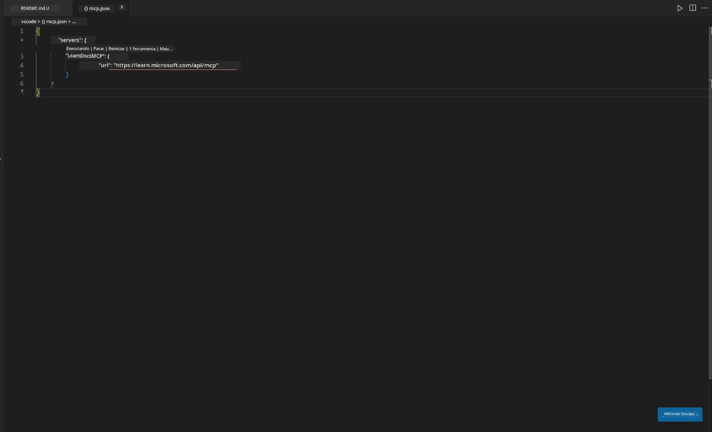
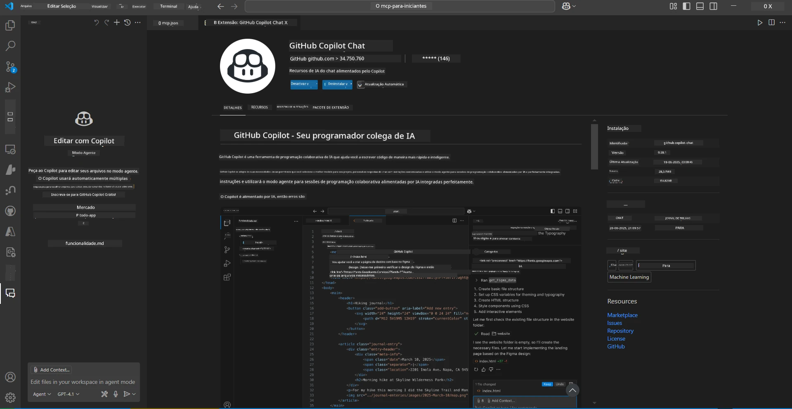
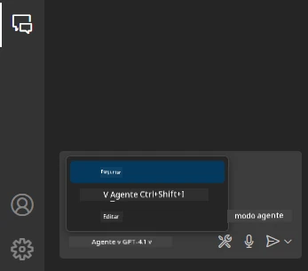
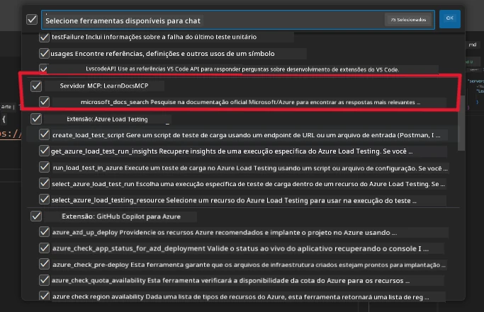
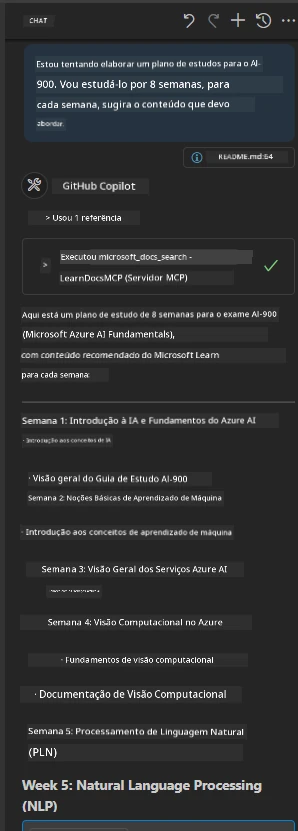
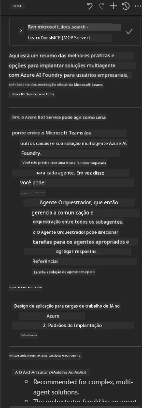

# Scenario 3: Documentação no Editor com o Servidor MCP no VS Code

## Visão Geral

Neste cenário, você aprenderá como trazer os Microsoft Learn Docs diretamente para o seu ambiente Visual Studio Code usando o servidor MCP. Em vez de ficar alternando abas do navegador para buscar documentação, você pode acessar, pesquisar e referenciar documentos oficiais diretamente dentro do seu editor. Essa abordagem agiliza seu fluxo de trabalho, mantém seu foco e possibilita integração perfeita com ferramentas como o GitHub Copilot.

- Pesquise e leia documentos dentro do VS Code sem sair do seu ambiente de codificação.
- Referencie documentação e insira links diretamente em seu README ou arquivos do curso.
- Use o GitHub Copilot e o MCP juntos para um fluxo de trabalho integrado e com suporte de IA.

## Objetivos de Aprendizado

Ao final deste capítulo, você entenderá como configurar e usar o servidor MCP dentro do VS Code para aprimorar seu fluxo de documentação e desenvolvimento. Você será capaz de:

- Configurar seu workspace para usar o servidor MCP para consulta de documentação.
- Pesquisar e inserir documentação diretamente do VS Code.
- Combinar o poder do GitHub Copilot e MCP para um fluxo de trabalho mais produtivo, aumentado por IA.

Essas habilidades ajudarão você a manter o foco, melhorar a qualidade da documentação e aumentar sua produtividade como desenvolvedor ou redator técnico.

## Solução

Para obter acesso à documentação dentro do editor, você seguirá uma série de etapas que integram o servidor MCP com o VS Code e o GitHub Copilot. Esta solução é ideal para autores de cursos, redatores de documentação e desenvolvedores que desejam manter seu foco no editor enquanto trabalham com documentação e Copilot.

- Adicione rapidamente links de referência a um README enquanto escreve um curso ou documentação de projeto.
- Use o Copilot para gerar código e o MCP para encontrar e citar instantaneamente documentos relevantes.
- Mantenha o foco no seu editor e aumente a produtividade.

### Guia Passo a Passo

Para começar, siga estas etapas. Para cada passo, você pode adicionar uma captura de tela da pasta assets para ilustrar visualmente o processo.

1. **Adicione a configuração do MCP:**
   Na raiz do seu projeto, crie um arquivo `.vscode/mcp.json` e adicione a seguinte configuração:
   ```json
   {
     "servers": {
       "LearnDocsMCP": {
         "url": "https://learn.microsoft.com/api/mcp"
       }
     }
   }
   ```
   Esta configuração informa ao VS Code como se conectar ao [`Microsoft Learn Docs MCP server`](https://github.com/MicrosoftDocs/mcp).

   

2. **Abra o painel GitHub Copilot Chat:**
   Se você ainda não tem a extensão GitHub Copilot instalada, acesse a visualização de Extensões no VS Code e instale-a. Você pode baixá-la diretamente do [Visual Studio Code Marketplace](https://marketplace.visualstudio.com/items?itemName=GitHub.copilot-chat). Em seguida, abra o painel Copilot Chat na barra lateral.

   

3. **Ative o modo agente e verifique as ferramentas:**
   No painel Copilot Chat, ative o modo agente.

   

   Após ativar o modo agente, verifique se o servidor MCP está listado como uma das ferramentas disponíveis. Isso garante que o agente Copilot pode acessar o servidor de documentação para buscar informações relevantes.

   

4. **Inicie um novo chat e faça perguntas ao agente:**
   Abra um novo chat no painel Copilot Chat. Agora você pode fazer perguntas ao agente sobre documentação. O agente utilizará o servidor MCP para buscar e exibir documentação relevante do Microsoft Learn diretamente no seu editor.

   - *"Estou tentando escrever um plano de estudos para o tópico X. Vou estudá-lo por 8 semanas, para cada semana, sugira o conteúdo que devo absorver."*

   

5. **Consulta ao vivo:**

   > Vamos pegar uma consulta ao vivo da seção [#get-help](https://discord.gg/D6cRhjHWSC) no Discord Microsoft Foundry ([ver mensagem original](https://discord.com/channels/1113626258182504448/1385498306720829572)):

   *"Estou buscando respostas sobre como implantar uma solução multiagente com agentes de IA desenvolvidos na Azure AI Foundry. Vejo que não existe um método direto de implantação, como canais do Copilot Studio. Então, quais são as diferentes formas de fazer essa implantação para que usuários empresariais possam interagir e realizar o trabalho?
Existem inúmeros artigos/blogs que dizem que podemos usar o serviço Azure Bot para fazer esse trabalho, o que pode funcionar como uma ponte entre o MS Teams e os Agentes Azure AI Foundry, será que isso funcionaria se eu configurar um bot Azure que se conecta ao Agente Orquestrador na Azure AI Foundry via Azure Function para executar a orquestração ou preciso criar uma Azure Function para cada um dos agentes de IA na solução multiagente para fazer a orquestração no Bot Framework? Outras sugestões são muito bem-vindas."*

   

   O agente responderá com links e resumos de documentação relevantes, que você poderá inserir diretamente em seus arquivos markdown ou usar como referência no código.

### Consultas de Exemplo

Aqui estão alguns exemplos de consultas que você pode tentar. Essas consultas mostram como o servidor MCP e o Copilot podem trabalhar juntos para fornecer documentação instantânea, contextualizada, e referências sem precisar sair do VS Code:

- "Mostre-me como usar triggers do Azure Functions."
- "Insira um link para a documentação oficial do Azure Key Vault."
- "Quais são as melhores práticas para proteger recursos do Azure?"
- "Encontre um quickstart para serviços de Azure AI."

Essas consultas demonstrarão como o servidor MCP e o Copilot podem trabalhar juntos para fornecer documentação instantânea, contextualizada, e referências sem sair do VS Code.

---

---

<!-- CO-OP TRANSLATOR DISCLAIMER START -->
**Aviso Legal**:
Este documento foi traduzido usando o serviço de tradução por IA [Co-op Translator](https://github.com/Azure/co-op-translator). Embora nos esforcemos pela precisão, por favor, esteja ciente de que traduções automatizadas podem conter erros ou imprecisões. O documento original em seu idioma nativo deve ser considerado a fonte autorizada. Para informações críticas, recomenda-se tradução profissional humana. Não nos responsabilizamos por quaisquer mal-entendidos ou interpretações incorretas decorrentes do uso desta tradução.
<!-- CO-OP TRANSLATOR DISCLAIMER END -->