# 🌐 Módulo 2: MCP com Fundamentos do Microsoft Foundry Toolkit

[]()
[]()
[]()

## 📋 Objetivos de Aprendizado

Ao final deste módulo, você será capaz de:
- ✅ Entender a arquitetura e os benefícios do Model Context Protocol (MCP)
- ✅ Explorar o ecossistema de servidores MCP da Microsoft
- ✅ Integrar servidores MCP com o Microsoft Foundry Toolkit Agent Builder
- ✅ Construir um agente funcional de automação de navegador usando Playwright MCP
- ✅ Configurar e testar ferramentas MCP dentro dos seus agentes
- ✅ Exportar e implantar agentes com tecnologia MCP para uso em produção

## 🎯 Construindo sobre o Módulo 1

No Módulo 1, dominamos os conceitos básicos do Microsoft Foundry Toolkit e criamos nosso primeiro Agente Python. Agora vamos **potencializar** seus agentes conectando-os a ferramentas e serviços externos por meio do revolucionário **Model Context Protocol (MCP)**. 

Pense nisso como atualizar de uma calculadora básica para um computador completo - seus agentes de IA ganharão a habilidade de:
- 🌐 Navegar e interagir com sites
- 📁 Acessar e manipular arquivos
- 🔧 Integrar com sistemas empresariais
- 📊 Processar dados em tempo real de APIs

## 🧠 Compreendendo o Model Context Protocol (MCP)

### 🔍 O que é MCP?

Model Context Protocol (MCP) é o **"USB-C para aplicações de IA"** - um padrão aberto revolucionário que conecta Modelos de Linguagem Grande (LLMs) a ferramentas, fontes de dados e serviços externos. Assim como o USB-C eliminou o caos dos cabos ao fornecer um conector universal, o MCP elimina a complexidade da integração de IA com um protocolo padronizado.

### 🎯 O Problema que o MCP Resolve

**Antes do MCP:**
- 🔧 Integrações personalizadas para cada ferramenta
- 🔄 Vinculação a fornecedores com soluções proprietárias  
- 🔒 Vulnerabilidades de segurança por conexões improvisadas
- ⏱️ Meses de desenvolvimento para integrações básicas

**Com o MCP:**
- ⚡ Integração de ferramentas plug-and-play
- 🔄 Arquitetura independente de fornecedor
- 🛡️ Melhores práticas de segurança incorporadas
- 🚀 Minutos para adicionar novas funcionalidades

### 🏗️ Arquitetura MCP em Detalhes

O MCP segue uma **arquitetura cliente-servidor** que cria um ecossistema seguro e escalável:

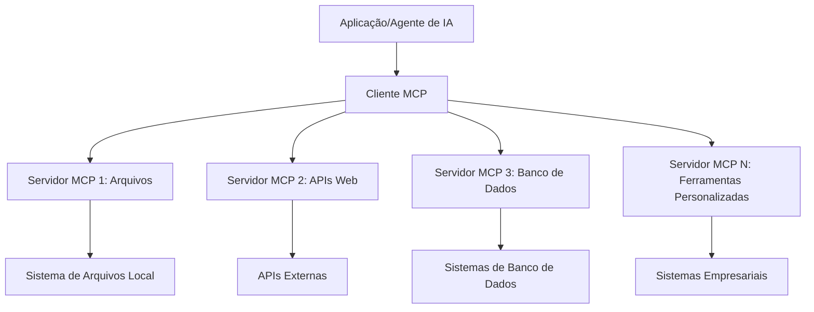

**🔧 Componentes Principais:**

| Componente | Função | Exemplos |
|-----------|--------|----------|
| **Hosts MCP** | Aplicações que consomem serviços MCP | Claude Desktop, VS Code, Microsoft Foundry Toolkit |
| **Clientes MCP** | Manipuladores de protocolo (1:1 com servidores) | Integrados em aplicações host |
| **Servidores MCP** | Expõem funcionalidades via protocolo padrão | Playwright, Files, Azure, GitHub |
| **Camada de Transporte** | Métodos de comunicação | stdio, HTTP, WebSockets |


## 🏢 Ecossistema de Servidores MCP da Microsoft

A Microsoft lidera o ecossistema MCP com uma suíte abrangente de servidores de nível empresarial que atendem necessidades reais de negócios.

### 🌟 Servidores MCP em Destaque da Microsoft

#### 1. ☁️ Servidor MCP Azure
**🔗 Repositório**: [azure/azure-mcp](https://github.com/azure/azure-mcp)
**🎯 Propósito**: Gerenciamento abrangente de recursos Azure com integração de IA

**✨ Principais Recursos:**
- Provisionamento declarativo de infraestrutura
- Monitoramento de recursos em tempo real
- Recomendações de otimização de custos
- Verificação de conformidade de segurança

**🚀 Casos de Uso:**
- Infraestrutura como Código com assistência de IA
- Escalonamento automatizado de recursos
- Otimização de custos na nuvem
- Automação de fluxos de trabalho DevOps

#### 2. 📊 Microsoft Dataverse MCP
**📚 Documentação**: [Microsoft Dataverse Integration](https://go.microsoft.com/fwlink/?linkid=2320176)
**🎯 Propósito**: Interface em linguagem natural para dados empresariais

**✨ Principais Recursos:**
- Consultas de banco de dados em linguagem natural
- Compreensão do contexto de negócios
- Modelos personalizados de prompts
- Governança de dados empresarial

**🚀 Casos de Uso:**
- Relatórios de inteligência empresarial
- Análise de dados de clientes
- Insights sobre pipeline de vendas
- Consultas de dados para compliance

#### 3. 🌐 Servidor MCP Playwright
**🔗 Repositório**: [microsoft/playwright-mcp](https://github.com/microsoft/playwright-mcp)
**🎯 Propósito**: Automação de navegador e capacidades de interação web

**✨ Principais Recursos:**
- Automação multi-navegador (Chrome, Firefox, Safari)
- Detecção inteligente de elementos
- Geração de screenshots e PDFs
- Monitoramento de tráfego de rede

**🚀 Casos de Uso:**
- Fluxos de trabalho de testes automatizados
- Web scraping e extração de dados
- Monitoramento de UI/UX
- Automação de análise competitiva

#### 4. 📁 Servidor MCP Files
**🔗 Repositório**: [microsoft/files-mcp-server](https://github.com/microsoft/files-mcp-server)
**🎯 Propósito**: Operações inteligentes no sistema de arquivos

**✨ Principais Recursos:**
- Gerenciamento declarativo de arquivos
- Sincronização de conteúdo
- Integração com controle de versão
- Extração de metadados

**🚀 Casos de Uso:**
- Gestão de documentação
- Organização de repositório de código
- Fluxos de publicação de conteúdo
- Manipulação de arquivos em pipelines de dados

#### 5. 📝 Servidor MCP MarkItDown
**🔗 Repositório**: [microsoft/markitdown](https://github.com/microsoft/markitdown)
**🎯 Propósito**: Processamento e manipulação avançada de Markdown

**✨ Principais Recursos:**
- Parsing rico de Markdown
- Conversão de formato (MD ↔ HTML ↔ PDF)
- Análise estrutural de conteúdo
- Processamento de templates

**🚀 Casos de Uso:**
- Fluxos de trabalho de documentação técnica
- Sistemas de gerenciamento de conteúdo
- Geração de relatórios
- Automação de base de conhecimento

#### 6. 📈 Servidor MCP Clarity
**📦 Pacote**: [@microsoft/clarity-mcp-server](https://www.npmjs.com/package/@microsoft/clarity-mcp-server)
**🎯 Propósito**: Análise web e insights de comportamento do usuário

**✨ Principais Recursos:**
- Análise de mapas de calor
- Gravações de sessões de usuário
- Métricas de desempenho
- Análise de funil de conversão

**🚀 Casos de Uso:**
- Otimização de sites
- Pesquisa de experiência do usuário
- Análise de testes A/B
- Dashboards de inteligência empresarial

### 🌍 Ecossistema Comunitário

Além dos servidores da Microsoft, o ecossistema MCP inclui:
- **🐙 MCP GitHub**: Gerenciamento de repositórios e análise de código
- **🗄️ MCPs de Banco de Dados**: Integrações PostgreSQL, MySQL, MongoDB
- **☁️ MCPs de Provedores Cloud**: Ferramentas AWS, GCP, Digital Ocean
- **📧 MCPs de Comunicação**: Integrações Slack, Teams, Email

## 🛠️ Laboratório Prático: Construindo um Agente de Automação de Navegador

**🎯 Objetivo do Projeto**: Criar um agente inteligente de automação de navegador usando o servidor Playwright MCP que possa navegar por sites, extrair informações e realizar interações web complexas.

### 🚀 Fase 1: Configuração da Base do Agente

#### Passo 1: Inicialize Seu Agente
1. **Abra o Microsoft Foundry Toolkit Agent Builder**
2. **Crie Novo Agente** com a seguinte configuração:
   - **Nome**: `BrowserAgent`
   - **Modelo**: Escolha GPT-4o 

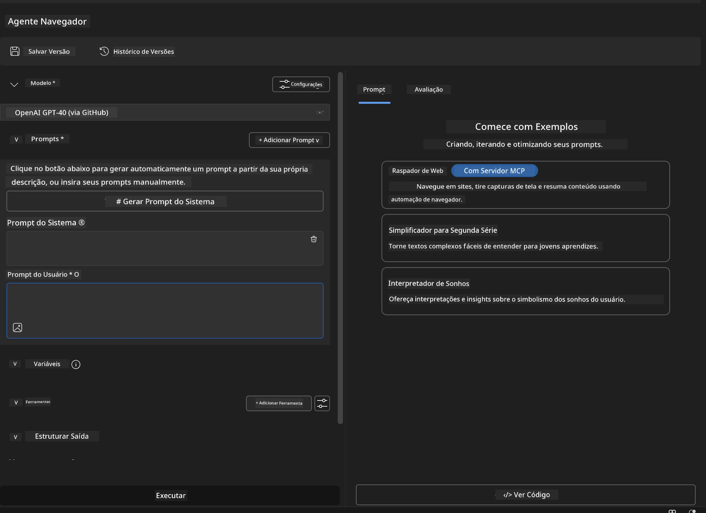


### 🔧 Fase 2: Fluxo de Integração MCP

#### Passo 3: Adicionar Integração com Servidor MCP
1. **Navegue até a seção Ferramentas** no Agent Builder
2. **Clique em "Adicionar Ferramenta"** para abrir o menu de integrações
3. **Selecione "Servidor MCP"** dentre as opções disponíveis

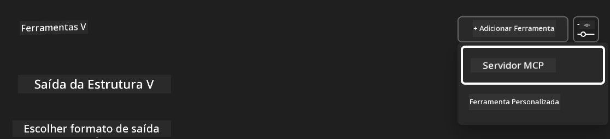

**🔍 Entendendo os Tipos de Ferramenta:**
- **Ferramentas Integradas**: Funções pré-configuradas do Microsoft Foundry Toolkit
- **Servidores MCP**: Integrações com serviços externos
- **APIs Personalizadas**: Seus próprios endpoints de serviço
- **Chamada de Função**: Acesso direto a funções do modelo

#### Passo 4: Seleção do Servidor MCP
1. **Escolha a opção "Servidor MCP"** para continuar
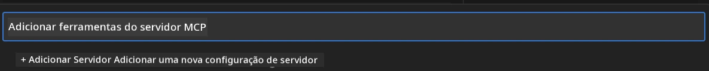

2. **Navegue pelo Catálogo MCP** para explorar as integrações disponíveis
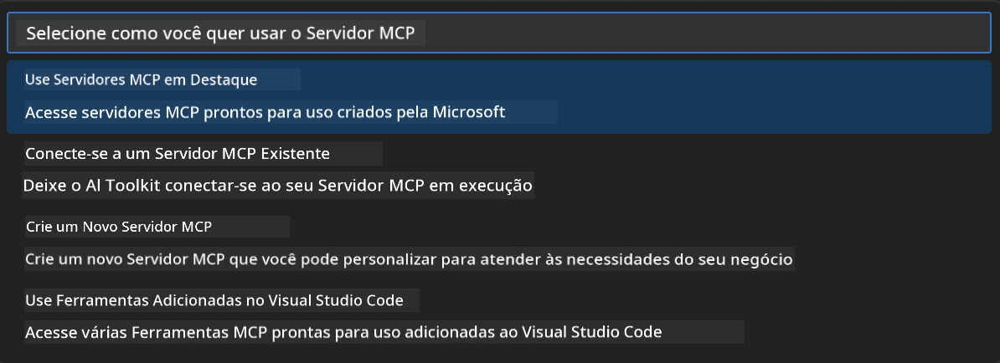


### 🎮 Fase 3: Configuração do Playwright MCP

#### Passo 5: Selecionar e Configurar Playwright
1. **Clique em "Usar Servidores MCP em Destaque"** para acessar os servidores verificados pela Microsoft
2. **Selecione "Playwright"** na lista em destaque
3. **Aceite o ID MCP padrão** ou personalize para seu ambiente

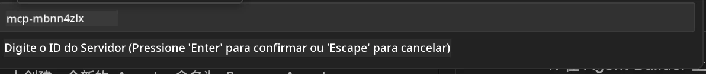

#### Passo 6: Habilitar Capacidades do Playwright
**🔑 Passo Crítico**: Selecione **TODOS** os métodos Playwright disponíveis para funcionalidade máxima

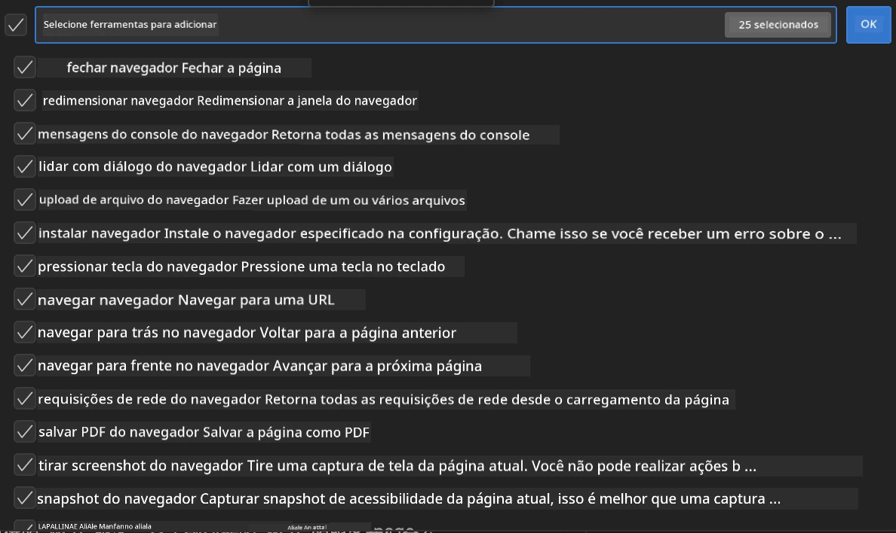

**🛠️ Ferramentas Essenciais do Playwright:**
- **Navegação**: `goto`, `goBack`, `goForward`, `reload`
- **Interação**: `click`, `fill`, `press`, `hover`, `drag`
- **Extração**: `textContent`, `innerHTML`, `getAttribute`
- **Validação**: `isVisible`, `isEnabled`, `waitForSelector`
- **Captura**: `screenshot`, `pdf`, `video`
- **Rede**: `setExtraHTTPHeaders`, `route`, `waitForResponse`

#### Passo 7: Verificar Sucesso da Integração
**✅ Indicadores de Sucesso:**
- Todas as ferramentas aparecem na interface do Agent Builder
- Nenhuma mensagem de erro no painel de integração
- Status do servidor Playwright mostra "Conectado"


**🔧 Solução de Problemas Comuns:**
- **Falha na Conexão**: Verifique conectividade de internet e configurações de firewall
- **Ferramentas Faltando**: Confirme se todas as capacidades foram selecionadas durante a configuração
- **Erros de Permissão**: Verifique se o VS Code tem as permissões necessárias do sistema

### 🎯 Fase 4: Engenharia Avançada de Prompt

#### Passo 8: Criar Prompts de Sistema Inteligentes
Crie prompts sofisticados que aproveitem todas as capacidades do Playwright:

```markdown
# Web Automation Expert System Prompt

## Core Identity
You are an advanced web automation specialist with deep expertise in browser automation, web scraping, and user experience analysis. You have access to Playwright tools for comprehensive browser control.

## Capabilities & Approach
### Navigation Strategy
- Always start with screenshots to understand page layout
- Use semantic selectors (text content, labels) when possible
- Implement wait strategies for dynamic content
- Handle single-page applications (SPAs) effectively

### Error Handling
- Retry failed operations with exponential backoff
- Provide clear error descriptions and solutions
- Suggest alternative approaches when primary methods fail
- Always capture diagnostic screenshots on errors

### Data Extraction
- Extract structured data in JSON format when possible
- Provide confidence scores for extracted information
- Validate data completeness and accuracy
- Handle pagination and infinite scroll scenarios

### Reporting
- Include step-by-step execution logs
- Provide before/after screenshots for verification
- Suggest optimizations and alternative approaches
- Document any limitations or edge cases encountered

## Ethical Guidelines
- Respect robots.txt and rate limiting
- Avoid overloading target servers
- Only extract publicly available information
- Follow website terms of service
```

#### Passo 9: Criar Prompts Dinâmicos para Usuário
Projete prompts que demonstrem várias funcionalidades:

**🌐 Exemplo de Análise Web:**
```markdown
Navigate to github.com/kinfey and provide a comprehensive analysis including:
1. Repository structure and organization
2. Recent activity and contribution patterns  
3. Documentation quality assessment
4. Technology stack identification
5. Community engagement metrics
6. Notable projects and their purposes

Include screenshots at key steps and provide actionable insights.
```

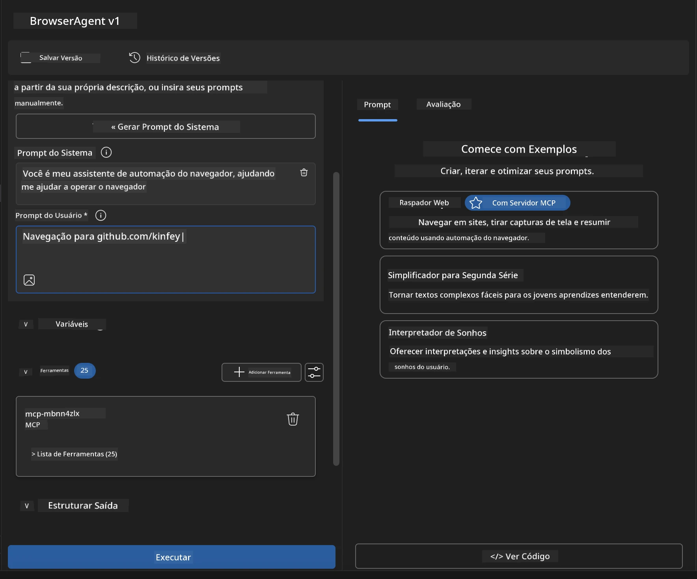

### 🚀 Fase 5: Execução e Testes

#### Passo 10: Execute Sua Primeira Automação
1. **Clique em "Executar"** para iniciar a sequência de automação
2. **Monitore a Execução em Tempo Real**:
   - Navegador Chrome abre automaticamente
   - Agente navega até o site alvo
   - Capturas de tela são feitas a cada etapa importante
   - Resultados da análise aparecem em tempo real

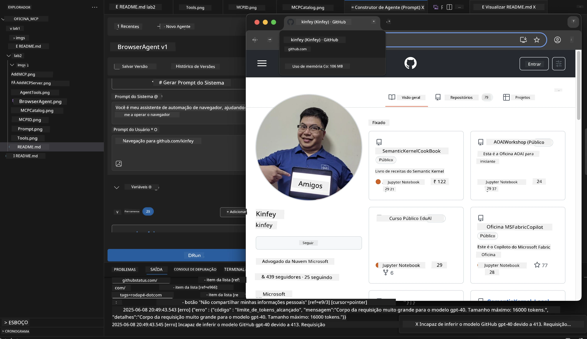

#### Passo 11: Analise Resultados e Insights
Revise a análise completa na interface do Agent Builder:

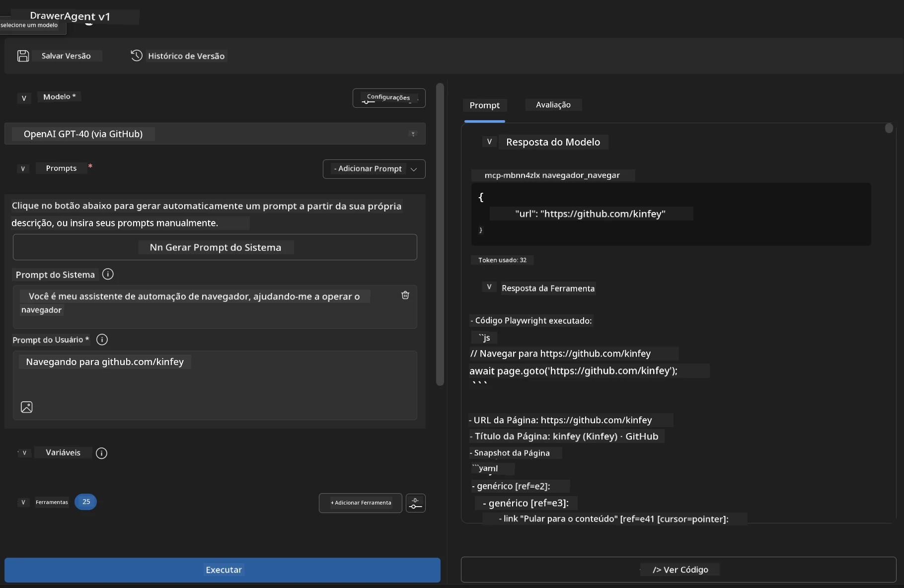

### 🌟 Fase 6: Capacidades Avançadas e Implantação

#### Passo 12: Exportar e Implantar em Produção
O Agent Builder suporta múltiplas opções de implantação:

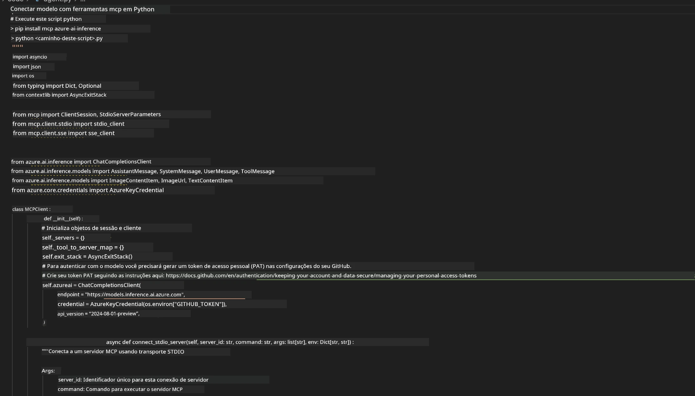

## 🎓 Resumo do Módulo 2 & Próximos Passos

### 🏆 Conquista Desbloqueada: Mestre em Integração MCP

**✅ Habilidades Dominadas:**
- [ ] Compreensão da arquitetura e benefícios MCP
- [ ] Navegação no ecossistema de servidores MCP da Microsoft
- [ ] Integração do Playwright MCP com Microsoft Foundry Toolkit
- [ ] Construção de agentes sofisticados de automação de navegador
- [ ] Engenharia avançada de prompts para automação web

### 📚 Recursos Adicionais

- **🔗 Especificação MCP**: [Documentação Oficial do Protocolo](https://modelcontextprotocol.io/)
- **🛠️ API Playwright**: [Referência Completa de Métodos](https://playwright.dev/docs/api/class-playwright)
- **🏢 Servidores MCP Microsoft**: [Guia de Integração Empresarial](https://github.com/microsoft/mcp-servers)
- **🌍 Exemplos Comunitários**: [Galeria de Servidores MCP](https://github.com/modelcontextprotocol/servers)

**🎉 Parabéns!** Você dominou com sucesso a integração MCP e agora pode construir agentes de IA prontos para produção com capacidades de ferramentas externas!


### 🔜 Continue para o Próximo Módulo

Pronto para levar suas habilidades MCP para o próximo nível? Prossiga para **[Módulo 3: Desenvolvimento Avançado MCP com Microsoft Foundry Toolkit](../lab3/README.md)** onde você aprenderá a:
- Criar seus próprios servidores MCP personalizados
- Configurar e usar o mais recente SDK Python MCP
- Configurar o MCP Inspector para depuração
- Dominar fluxos avançados de desenvolvimento de servidores MCP
- Construir um Servidor MCP de Clima do zero

---

<!-- CO-OP TRANSLATOR DISCLAIMER START -->
**Aviso Legal**:
Este documento foi traduzido usando o serviço de tradução por IA [Co-op Translator](https://github.com/Azure/co-op-translator). Embora nos esforcemos pela precisão, por favor, esteja ciente de que traduções automatizadas podem conter erros ou imprecisões. O documento original em seu idioma nativo deve ser considerado a fonte autorizada. Para informações críticas, recomenda-se tradução profissional humana. Não nos responsabilizamos por quaisquer mal-entendidos ou interpretações incorretas decorrentes do uso desta tradução.
<!-- CO-OP TRANSLATOR DISCLAIMER END -->