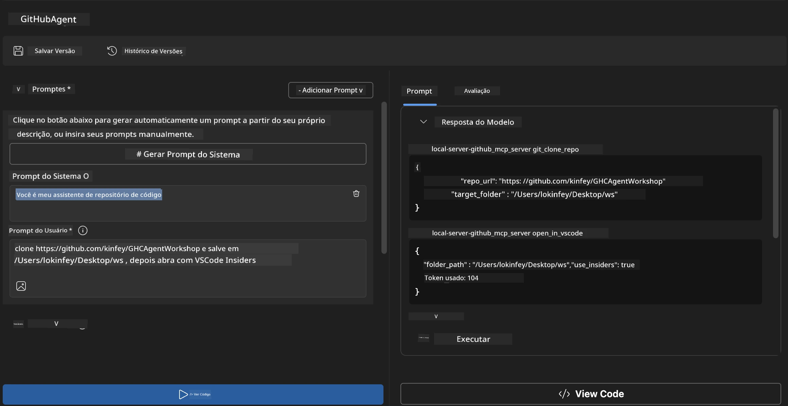
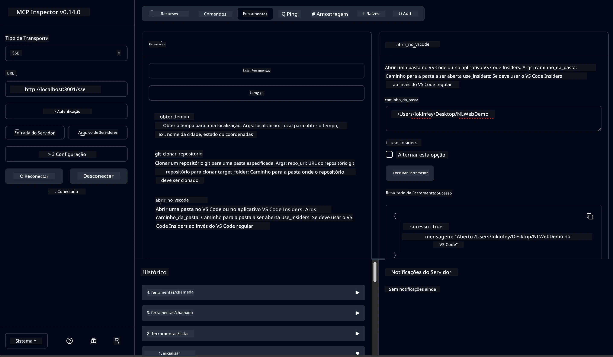

# 🐙 Módulo 4: Desenvolvimento Prático de MCP - Servidor Personalizado de Clone do GitHub


> **⚡ Início Rápido:** Construa um servidor MCP pronto para produção que automatiza a clonagem de repositórios do GitHub e a integração com o VS Code em apenas 30 minutos!

## 🎯 Objetivos de Aprendizagem

Ao final deste laboratório, você será capaz de:

- ✅ Criar um servidor MCP personalizado para fluxos de trabalho de desenvolvimento do mundo real
- ✅ Implementar funcionalidade de clonagem de repositórios GitHub via MCP
- ✅ Integrar servidores MCP personalizados com VS Code e Agent Builder
- ✅ Usar o Modo Agente do GitHub Copilot com ferramentas MCP personalizadas
- ✅ Testar e implantar servidores MCP personalizados em ambientes de produção

## 📋 Pré-requisitos

- Conclusão dos Laboratórios 1-3 (fundamentos e desenvolvimento avançado de MCP)
- Assinatura do GitHub Copilot ([cadastro gratuito disponível](https://github.com/github-copilot/signup))
- VS Code com as extensões Microsoft Foundry Toolkit e GitHub Copilot instaladas
- Git CLI instalado e configurado

## 🏗️ Visão Geral do Projeto

### **Desafio de Desenvolvimento do Mundo Real**
Como desenvolvedores, usamos frequentemente o GitHub para clonar repositórios e abri-los no VS Code ou VS Code Insiders. Este processo manual envolve:
1. Abrir terminal/prompt de comando
2. Navegar até o diretório desejado
3. Executar o comando `git clone`
4. Abrir o VS Code no diretório clonado

**Nossa solução MCP simplifica tudo isso em um único comando inteligente!**

### **O Que Você Vai Construir**
Um **Servidor MCP de Clone do GitHub** (`git_mcp_server`) que oferece:

| Recurso | Descrição | Benefício |
|---------|-------------|---------|
| 🔄 **Clonagem Inteligente de Repositórios** | Clona repositórios GitHub com validação | Verificação automática de erros |
| 📁 **Gerenciamento Inteligente de Diretórios** | Verifica e cria diretórios com segurança | Evita sobrescritas |
| 🚀 **Integração Cross-Platform com VS Code** | Abre projetos no VS Code/Insiders | Transição perfeita no fluxo de trabalho |
| 🛡️ **Tratamento Robusto de Erros** | Trata problemas de rede, permissões e caminhos | Confiabilidade pronta para produção |

---

## 📖 Implementação Passo a Passo

### Passo 1: Criar Agente GitHub no Agent Builder

1. **Inicie o Agent Builder** através da extensão Microsoft Foundry Toolkit
2. **Crie um novo agente** com a seguinte configuração:
   ```
   Agent Name: GitHubAgent
   ```

3. **Inicie o servidor MCP personalizado:**
   - Navegue em **Ferramentas** → **Adicionar Ferramenta** → **Servidor MCP**
   - Selecione **"Criar um novo Servidor MCP"**
   - Escolha o **template Python** para máxima flexibilidade
   - **Nome do Servidor:** `git_mcp_server`

### Passo 2: Configurar o Modo Agente do GitHub Copilot

1. **Abra o GitHub Copilot** no VS Code (Ctrl/Cmd + Shift + P → "GitHub Copilot: Abrir")
2. **Selecione o Modelo de Agente** na interface do Copilot
3. **Escolha o modelo Claude 3.7** para capacidades avançadas de raciocínio
4. **Habilite a integração MCP** para acesso às ferramentas

> **💡 Dica Profissional:** Claude 3.7 oferece compreensão superior dos fluxos de trabalho de desenvolvimento e padrões de tratamento de erros.

### Passo 3: Implementar Funcionalidade Central do Servidor MCP

**Use o prompt detalhado a seguir com o Modo Agente do GitHub Copilot:**

```
Create two MCP tools with the following comprehensive requirements:

🔧 TOOL A: clone_repository
Requirements:
- Clone any GitHub repository to a specified local folder
- Return the absolute path of the successfully cloned project
- Implement comprehensive validation:
  ✓ Check if target directory already exists (return error if exists)
  ✓ Validate GitHub URL format (https://github.com/user/repo)
  ✓ Verify git command availability (prompt installation if missing)
  ✓ Handle network connectivity issues
  ✓ Provide clear error messages for all failure scenarios

🚀 TOOL B: open_in_vscode
Requirements:
- Open specified folder in VS Code or VS Code Insiders
- Cross-platform compatibility (Windows/Linux/macOS)
- Use direct application launch (not terminal commands)
- Auto-detect available VS Code installations
- Handle cases where VS Code is not installed
- Provide user-friendly error messages

Additional Requirements:
- Follow MCP 1.9.3 best practices
- Include proper type hints and documentation
- Implement logging for debugging purposes
- Add input validation for all parameters
- Include comprehensive error handling
```

### Passo 4: Teste Seu Servidor MCP

#### 4a. Teste no Agent Builder

1. **Execute a configuração de debug** no Agent Builder
2. **Configure seu agente com este prompt de sistema:**

```
SYSTEM_PROMPT:
You are my intelligent coding repository assistant. You help developers efficiently clone GitHub repositories and set up their development environment. Always provide clear feedback about operations and handle errors gracefully.
```

3. **Teste com cenários de usuário realistas:**

```
USER_PROMPT EXAMPLES:

Scenario : Basic Clone and Open
"Clone {Your GitHub Repo link such as https://github.com/kinfey/GHCAgentWorkshop
 } and save to {The global path you specify}, then open it with VS Code Insiders"
```



**Resultados Esperados:**
- ✅ Clone bem-sucedido com confirmação do caminho
- ✅ Abertura automática do VS Code
- ✅ Mensagens de erro claras para cenários inválidos
- ✅ Tratamento adequado de casos extremos

#### 4b. Teste no MCP Inspector




---


**🎉 Parabéns!** Você criou com sucesso um servidor MCP prático e pronto para produção que resolve desafios reais de fluxo de trabalho de desenvolvimento. Seu servidor personalizado de clone do GitHub demonstra o poder do MCP para automatizar e melhorar a produtividade dos desenvolvedores.

### 🏆 Conquistas Desbloqueadas:
- ✅ **Desenvolvedor MCP** - Criou servidor MCP personalizado
- ✅ **Automatizador de Fluxos** - Otimizou processos de desenvolvimento  
- ✅ **Especialista em Integração** - Conectou múltiplas ferramentas de desenvolvimento
- ✅ **Pronto para Produção** - Desenvolveu soluções implantáveis

---

## 🎓 Conclusão do Workshop: Sua Jornada com o Model Context Protocol

**Caro participante do Workshop,**

Parabéns por completar todos os quatro módulos do workshop Model Context Protocol! Você avançou muito desde a compreensão dos conceitos básicos do Microsoft Foundry Toolkit até a construção de servidores MCP prontos para produção que resolvem desafios reais de desenvolvimento.

### 🚀 Recapitulação do Seu Caminho de Aprendizagem:

**[Módulo 1](../lab1/README.md)**: Você começou explorando os fundamentos do Microsoft Foundry Toolkit, testes de modelos e criando seu primeiro agente de IA.

**[Módulo 2](../lab2/README.md)**: Aprendeu a arquitetura MCP, integrou o Playwright MCP e construiu seu primeiro agente de automação de navegador.

**[Módulo 3](../lab3/README.md)**: Avançou para o desenvolvimento de servidores MCP personalizados com o servidor MCP de clima e dominou ferramentas de depuração.

**[Módulo 4](../lab4/README.md)**: Aplicou tudo para criar uma ferramenta prática de automação de fluxo de trabalho de repositório GitHub.

### 🌟 O Que Você Dominou:

- ✅ **Ecossistema Microsoft Foundry Toolkit**: Modelos, agentes e padrões de integração
- ✅ **Arquitetura MCP**: Design cliente-servidor, protocolos de transporte e segurança
- ✅ **Ferramentas de Desenvolvedor**: Do Playground ao Inspector até a implantação em produção
- ✅ **Desenvolvimento Personalizado**: Construção, teste e implantação de seus próprios servidores MCP
- ✅ **Aplicações Práticas**: Solução de desafios reais de fluxo de trabalho com IA

### 🔮 Seus Próximos Passos:

1. **Construa Seu Próprio Servidor MCP**: Aplique essas habilidades para automatizar seus fluxos personalizados
2. **Participe da Comunidade MCP**: Compartilhe suas criações e aprenda com outros
3. **Explore Integração Avançada**: Conecte servidores MCP a sistemas empresariais
4. **Contribua para Open Source**: Ajude a melhorar as ferramentas e documentação MCP

Lembre-se, este workshop é apenas o começo. O ecossistema Model Context Protocol está evoluindo rapidamente, e você está agora equipado para estar na vanguarda das ferramentas de desenvolvimento impulsionadas por IA.

**Obrigado por sua participação e dedicação ao aprendizado!**

Esperamos que este workshop tenha despertado ideias que transformarão a forma como você cria e interage com ferramentas de IA na sua jornada de desenvolvimento.

**Boas codificações!**

---

## O Que Vem a Seguir

Parabéns por completar todos os laboratórios do Módulo 10!

- Voltar para: [Visão Geral do Módulo 10](../README.md)
- Continuar para: [Módulo 11: Laboratórios Práticos de Servidor MCP](../../11-MCPServerHandsOnLabs/README.md)

---

<!-- CO-OP TRANSLATOR DISCLAIMER START -->
**Aviso Legal**:
Este documento foi traduzido usando o serviço de tradução por IA [Co-op Translator](https://github.com/Azure/co-op-translator). Embora nos esforcemos pela precisão, por favor, esteja ciente de que traduções automatizadas podem conter erros ou imprecisões. O documento original em seu idioma nativo deve ser considerado a fonte autorizada. Para informações críticas, recomenda-se tradução profissional humana. Não nos responsabilizamos por quaisquer mal-entendidos ou interpretações incorretas decorrentes do uso desta tradução.
<!-- CO-OP TRANSLATOR DISCLAIMER END -->