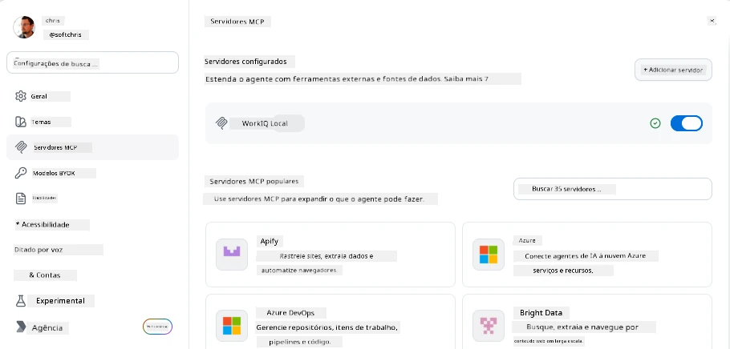
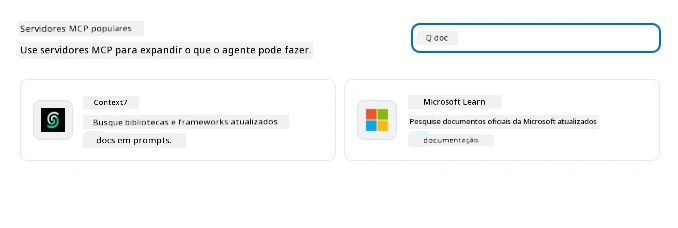
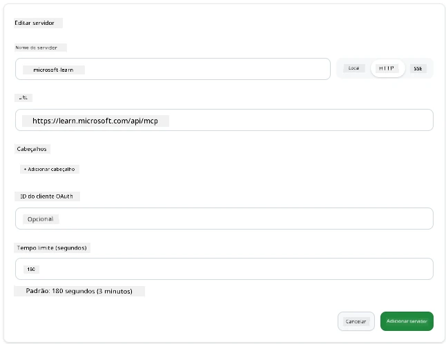
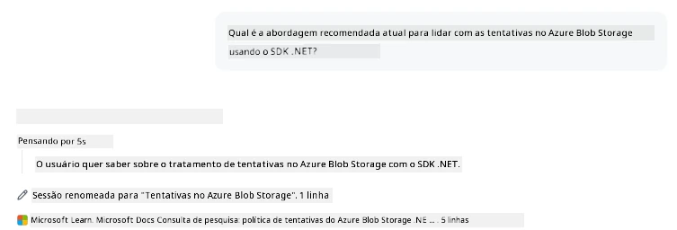
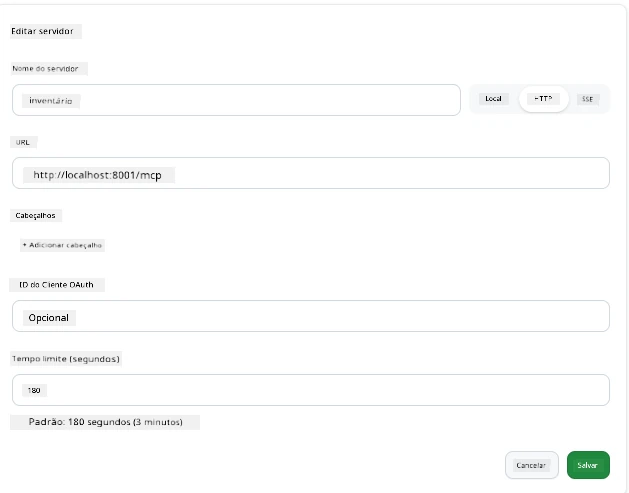
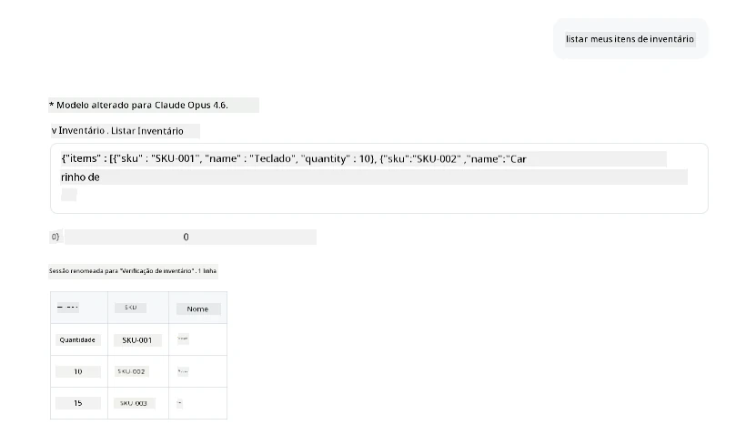
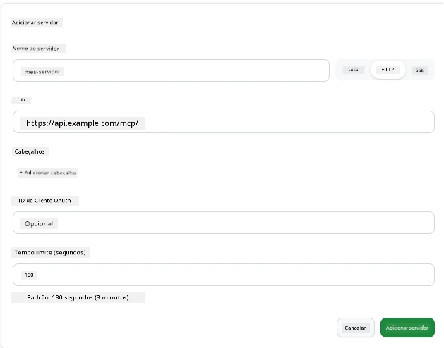
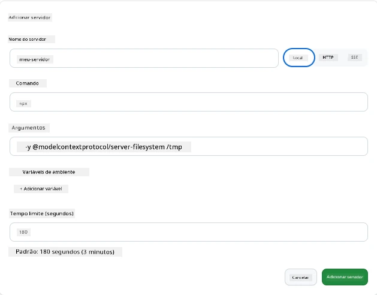

# Usando Servidores MCP no App GitHub Copilot

Agora você já sabe como o MCP funciona. Você construiu servidores, definiu ferramentas e recursos, e conectou clientes. O que ainda não fizemos é inverter a perspectiva: em vez de você ser quem constrói o servidor, como é estar do lado *consumidor* — como usuário de um app movido a IA que suporta MCP?

[GitHub Copilot App](https://github.com/github/app) é um app desktop que pode usar Servidores MCP. Ao conectar servidores MCP a ele, você desbloqueia um novo nível: o Copilot agora pode acessar sua documentação, chamar suas APIs internas, consultar seu banco de dados ou falar com qualquer serviço que você envolveu em um servidor. O app se torna o host; seus servidores MCP se tornam suas ferramentas.

Esta lição te guia por essa experiência do início ao fim — desde encontrar o painel de configurações do MCP até conectar um servidor real de documentação e então configurar um personalizado seu.

## Objetivos de Aprendizado

Ao final desta lição, você será capaz de:

- Localizar e navegar no painel de Servidores MCP nas configurações do App Copilot.
- Conectar um servidor de documentação hospedado e usá-lo em uma sessão.
- Registrar um servidor personalizado e verificar que o Copilot pode invocar suas ferramentas.
- Configurar como um servidor é chamado fornecendo variáveis de ambiente ou cabeçalhos personalizados (se HTTP).

## O App Copilot como Host MCP

Aqui está a ideia fundamental: **os agentes do Copilot são inteligentes, mas só sabem o que você conta para eles.** Por padrão, um agente pode ler arquivos no seu workspace e executar comandos no terminal, mas não consegue consultar seu banco de dados, espiar seu calendário ou chamar uma API customizada sem ajuda. É aí que entram os servidores MCP. Eles atuam como pontes entre o Copilot e seus sistemas — bancos de dados, controle de versão, APIs, ferramentas de design — dando acesso aos agentes a informações e ações que precisam para completar o trabalho.

Vamos começar encontrando essas configurações para gerenciar os Servidores MCP do seu app.

## Passo 1: Encontrando o Painel de Configurações MCP

Abra o App Copilot e localize o ícone de engrenagem no canto inferior esquerdo. Clique nele.


Certifique-se de selecionar "MCP Servers" e agora você deve ver seus servidores já configurados no topo, um marketplace de servidores populares na parte inferior, e um botão "Add Server" no topo, assim:



Este é seu centro de controle. Aqui você adiciona, remove, habilita e desabilita servidores. As mudanças têm efeito para sessões novas; se você tiver uma sessão aberta, precisará iniciar uma nova após mudar essa lista.

## Passo 2: Conectando um Servidor de Documentação

Vamos fazer algo imediatamente útil. O servidor MCP Microsoft Docs dá ao Copilot acesso à documentação oficial da Microsoft. Inclui Azure, .NET, TypeScript e mais. Em vez do agente confiar em seus dados de treinamento (que têm data de corte), ele pode buscar docs atuais no momento da consulta.

Como adicioná-lo:

1. Na grade de servidores populares, digite **learn** e selecione o servidor chamado "Microsoft Learn".

   

   Ao clicar, ele apresenta um formulário onde o nome, tipo de transporte e URL estão preenchidos, basta clicar em "Add Server".

2. Clique em "Add Server", deve levar alguns segundos para conectar ao servidor.

   

   Depois de adicionado, ele deve aparecer na área superior como um servidor configurado. Vamos testá-lo a seguir.

3. Feche o diálogo e selecione Quick chat.

4. Digite o prompt abaixo para acionar uma ferramenta no servidor Microsoft Learn.

   ```text
   What's the current recommended approach for handling Azure Blob Storage 
   retries using the .NET SDK?
   ```

   

Você deve ver como ele se refere ao Servidor MCP que acabamos de adicionar.

## Passo 3: Conectando um Servidor stdio Personalizado

Os presets são convenientes, mas o poder real está em conectar seus próprios servidores. Digamos que você tenha construído um servidor (ou recebido um) que expõe sua API interna ou base de conhecimento da empresa. Nesse caso, usaremos um Servidor MCP que criamos que gerencia o inventário da nossa empresa.

1. Clique na engrenagem e selecione "MCP servers" novamente.

2. Selecione o botão "Add Server" e "+ Add Custom server", e forneça os seguintes valores:

   - Nome: `Inventory Server`
   - Selecione o transporte (à direita), **http**

   Selecione "Add Server" e ele deve aparecer na sua lista de servidores configurados.

   

4. Para testar, execute um prompt assim:

    ```
    list inventory
    ```

   

Você deve ver uma lista de itens de inventário retornada pelo seu servidor personalizado.

Ótimo, agora você deve ter uma boa compreensão de como adicionar servidores MCP externos assim como seus próprios ao App Copilot. A seguir, vamos falar sobre como lidar com segredos e variáveis de ambiente.

## Passo 4: Configurações avançadas

Até agora, você viu como adicionar Servidores MCP onde você só fornece um nome e URL. Mas e se seu servidor precisar de uma chave de API ou algum outro valor? Bem, dependendo do tipo de transporte, podemos fornecer o que ele precisa.

- **Transporte http ou SSE**: Aqui podemos definir cabeçalhos conforme necessário.

   Para autenticação, você pode especificar um cabeçalho Authorization, por exemplo. O valor pode ser uma string estática. Se usar OAuth, pode fornecer um client ID de OAuth.

   

- **Transporte stdio**: Variáveis de ambiente podem ser definidas.

   Aqui você pode especificar quantas variáveis de ambiente precisar que devem ser passadas para o servidor ao iniciá-lo.

   

## Resumo

O App Copilot trata servidores MCP como extensões de primeira classe das capacidades do agente. Você viu toda a jornada nesta lição, desde adicionar servidores MCP até usá-los em uma sessão. Agora você pode conectar servidores públicos, APIs internas e ferramentas personalizadas, dando aos seus agentes a habilidade de acessar informações e ações para completar tarefas de forma autônoma.

## 📚 Recursos Adicionais

### Documentação oficial

- [GitHub Copilot App](https://github.com/github/app)
- [Especificação MCP](https://modelcontextprotocol.io/specification/2025-03-26) - Especificação do Model Context Protocol

### Comunidade
- [MCP Community Discord](https://discord.com/invite/ByRwuEEgH4) - Discussões ao vivo
- [GitHub Discussions](https://github.com/microsoft/MCP-Server-and-PostgreSQL-Sample-Retail/discussions) - Perguntas e compartilhamentos
- [Stack Overflow](https://stackoverflow.com/questions/tagged/model-context-protocol) - Perguntas técnicas

---

<!-- CO-OP TRANSLATOR DISCLAIMER START -->
**Aviso Legal**:
Este documento foi traduzido usando o serviço de tradução por IA [Co-op Translator](https://github.com/Azure/co-op-translator). Embora nos esforcemos pela precisão, por favor, esteja ciente de que traduções automatizadas podem conter erros ou imprecisões. O documento original em seu idioma nativo deve ser considerado a fonte autorizada. Para informações críticas, recomenda-se tradução profissional humana. Não nos responsabilizamos por quaisquer mal-entendidos ou interpretações incorretas decorrentes do uso desta tradução.
<!-- CO-OP TRANSLATOR DISCLAIMER END -->