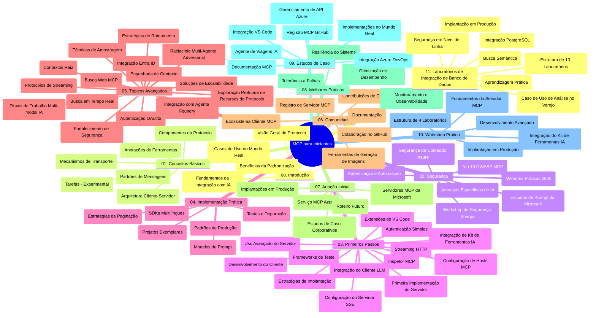

# Protocolo de Contexto de Modelo (MCP) para Iniciantes - Guia de Estudo

Este guia de estudo fornece uma visão geral da estrutura e do conteúdo do repositório para o currículo "Protocolo de Contexto de Modelo (MCP) para Iniciantes". Use este guia para navegar no repositório de forma eficiente e aproveitar ao máximo os recursos disponíveis.

## Visão Geral do Repositório

O Protocolo de Contexto de Modelo (MCP) é uma estrutura padronizada para interações entre modelos de IA e aplicações clientes. Inicialmente criado pela Anthropic, o MCP agora é mantido pela comunidade mais ampla do MCP por meio da organização oficial no GitHub. Este repositório oferece um currículo abrangente com exemplos práticos de código em C#, Java, JavaScript, Python e TypeScript, projetado para desenvolvedores de IA, arquitetos de sistemas e engenheiros de software.

## Mapa Visual do Currículo

## Estrutura do Repositório

O repositório está organizado em onze seções principais, cada uma focando em diferentes aspectos do MCP:

1. **Introdução (00-Introduction/)**
   - Visão geral do Protocolo de Contexto de Modelo
   - Por que a padronização é importante em pipelines de IA
   - Casos de uso práticos e benefícios

2. **Conceitos Básicos (01-CoreConcepts/)**
   - Arquitetura cliente-servidor
   - Componentes-chave do protocolo
   - Padrões de mensagens no MCP

3. **Segurança (02-Security/)**
   - Ameaças de segurança em sistemas baseados em MCP
   - Melhores práticas para proteger implementações
   - Estratégias de autenticação e autorização
   - **Documentação Abrangente de Segurança**:
     - Melhores Práticas de Segurança MCP 2025
     - Guia de Implementação de Segurança de Conteúdo do Azure
     - Controles e Técnicas de Segurança MCP
     - Referência Rápida de Melhores Práticas MCP
   - **Tópicos-Chave de Segurança**:
     - Ataques de injeção de prompt e envenenamento de ferramentas
     - Sequestro de sessão e problemas de proxy confuso
     - Vulnerabilidades de passagem de token
     - Permissões excessivas e controle de acesso
     - Segurança da cadeia de suprimentos para componentes de IA
     - Integração Microsoft Prompt Shields

4. **Primeiros Passos (03-GettingStarted/)**
   - Configuração e ambiente
   - Criação de servidores e clientes MCP básicos
   - Integração com aplicações existentes
   - Inclui seções para:
     - Primeira implementação do servidor
     - Desenvolvimento do cliente
     - Integração com cliente LLM
     - Integração com VS Code
     - Servidor de Eventos Enviados pelo Servidor (SSE)
     - Uso avançado do servidor
     - Streaming HTTP
     - Integração com AI Toolkit
     - Estratégias de teste
     - Diretrizes de implantação

5. **Implementação Prática (04-PracticalImplementation/)**
   - Uso de SDKs em diferentes linguagens de programação
   - Técnicas de depuração, teste e validação
   - Criação de templates reutilizáveis de prompt e fluxos de trabalho
   - Projetos de exemplo com exemplos de implementação

6. **Tópicos Avançados (05-AdvancedTopics/)**
   - Técnicas de engenharia de contexto
   - Integração com agente Foundry
   - Fluxos de trabalho multimodais de IA
   - Demos de autenticação OAuth2
   - Capacidades de busca em tempo real
   - Streaming em tempo real
   - Implementação de contextos raiz
   - Estratégias de roteamento
   - Técnicas de amostragem
   - Abordagens de escalonamento
   - Considerações de segurança
   - Integração de segurança Entra ID
   - Integração de busca na web
   - Raciocínio multiagente adversarial (padrões de debate)

7. **Contribuições da Comunidade (06-CommunityContributions/)**
   - Como contribuir com código e documentação
   - Colaboração via GitHub
   - Melhorias e feedback conduzidos pela comunidade
   - Uso de vários clientes MCP (Claude Desktop, Cline, VSCode)
   - Trabalhando com servidores MCP populares incluindo geração de imagens

8. **Lições da Adoção Inicial (07-LessonsfromEarlyAdoption/)**
   - Implementações e histórias de sucesso do mundo real
   - Construção e implantação de soluções baseadas em MCP
   - Tendências e roadmap futuro
   - **Guia de Servidores MCP da Microsoft**: Guia abrangente de 10 servidores MCP prontos para produção da Microsoft, incluindo:
     - Microsoft Learn Docs MCP Server
     - Azure MCP Server (15+ conectores especializados)
     - GitHub MCP Server
     - Azure DevOps MCP Server
     - MarkItDown MCP Server
     - SQL Server MCP Server
     - Playwright MCP Server
     - Dev Box MCP Server
     - Microsoft Foundry MCP Server
     - Microsoft 365 Agents Toolkit MCP Server

9. **Melhores Práticas (08-BestPractices/)**
   - Ajuste de desempenho e otimização
   - Projeto de sistemas MCP tolerantes a falhas
   - Estratégias de teste e resiliência

10. **Estudos de Caso (09-CaseStudy/)**
    - **Sete estudos de caso abrangentes** demonstrando a versatilidade do MCP em cenários diversificados:
    - **Agentes de Viagem Azure AI**: Orquestração multiagente com Azure OpenAI e AI Search
    - **Integração com Azure DevOps**: Automação de processos de workflow com atualizações de dados do YouTube
    - **Recuperação de Documentação em Tempo Real**: Cliente console Python com streaming HTTP
    - **Gerador Interativo de Plano de Estudos**: Aplicação web Chainlit com IA conversacional
    - **Documentação no Editor**: Integração VS Code com workflows do GitHub Copilot
    - **Gerenciamento de API Azure**: Integração empresarial de API com criação de servidor MCP
    - **Registro MCP GitHub**: Desenvolvimento do ecossistema e plataforma de integração agenteica
    - Exemplos de implementação abrangendo integração empresarial, produtividade do desenvolvedor e desenvolvimento de ecossistema

11. **Workshop Prático (10-StreamliningAIWorkflowsBuildingAnMCPServerWithAIToolkit/)**
    - Workshop prático abrangente combinando MCP com AI Toolkit
    - Construção de aplicações inteligentes que conectam modelos de IA com ferramentas do mundo real
    - Módulos práticos cobrindo fundamentos, desenvolvimento de servidor personalizado e estratégias de implantação em produção
    - **Estrutura do Laboratório**:
      - Laboratório 1: Fundamentos do Servidor MCP
      - Laboratório 2: Desenvolvimento Avançado do Servidor MCP
      - Laboratório 3: Integração com AI Toolkit
      - Laboratório 4: Implantação e Escalonamento em Produção
    - Abordagem baseada em laboratório com instruções passo a passo

12. **Laboratórios de Integração de Banco de Dados MCP Server (11-MCPServerHandsOnLabs/)**
    - **Caminho de aprendizado abrangente com 13 laboratórios** para construção de servidores MCP prontos para produção com integração PostgreSQL
    - **Implementação do caso de uso Zava Retail** para análise de varejo no mundo real
    - **Padrões de nível empresarial** incluindo Row Level Security (RLS), busca semântica e acesso a dados multi-inquilino
    - **Estrutura Completa do Laboratório**:
      - **Laboratórios 00-03: Fundamentos** - Introdução, Arquitetura, Segurança, Configuração do Ambiente
      - **Laboratórios 04-06: Construção do Servidor MCP** - Design de Banco de Dados, Implementação do Servidor MCP, Desenvolvimento de Ferramentas
      - **Laboratórios 07-09: Recursos Avançados** - Busca Semântica, Testes & Depuração, Integração com VS Code
      - **Laboratórios 10-12: Produção & Melhores Práticas** - Implantação, Monitoramento, Otimização
    - **Tecnologias Abrangidas**: framework FastMCP, PostgreSQL, Azure OpenAI, Azure Container Apps, Application Insights
    - **Resultados de Aprendizado**: servidores MCP prontos para produção, padrões de integração de banco de dados, análise impulsionada por IA, segurança empresarial

## Recursos Adicionais

O repositório inclui recursos de apoio:

- **Pasta de Imagens**: Contém diagramas e ilustrações usadas ao longo do currículo
- **Traduções**: Suporte multilíngue com traduções automáticas da documentação
- **Recursos Oficiais MCP**:
  - [Documentação MCP](https://modelcontextprotocol.io/)
  - [Especificação MCP](https://spec.modelcontextprotocol.io/)
  - [Repositório MCP no GitHub](https://github.com/modelcontextprotocol)

## Como Usar Este Repositório

1. **Aprendizado Sequencial**: Siga os capítulos em ordem (00 a 11) para uma experiência de aprendizado estruturada.
2. **Foco em Linguagem Específica**: Se estiver interessado em uma linguagem de programação específica, explore os diretórios de amostras para implementações na sua linguagem preferida.
3. **Implementação Prática**: Comece pela seção "Primeiros Passos" para configurar seu ambiente e criar seu primeiro servidor e cliente MCP.
4. **Exploração Avançada**: Após se familiarizar com o básico, mergulhe nos tópicos avançados para expandir seu conhecimento.
5. **Engajamento Comunitário**: Participe da comunidade MCP por meio de discussões no GitHub e canais do Discord para conectar-se com especialistas e outros desenvolvedores.

## Clientes e Ferramentas MCP

O currículo aborda vários clientes e ferramentas MCP:

1. **Clientes Oficiais**:
   - Visual Studio Code
   - MCP no Visual Studio Code
   - Claude Desktop
   - Claude no VSCode
   - Claude API

2. **Clientes da Comunidade**:
   - Cline (baseado em terminal)
   - Cursor (editor de código)
   - ChatMCP
   - Windsurf

3. **Ferramentas de Gerenciamento MCP**:
   - MCP CLI
   - MCP Manager
   - MCP Linker
   - MCP Router

## Servidores MCP Populares

O repositório apresenta diversos servidores MCP, incluindo:

1. **Servidores MCP Oficiais da Microsoft**:
   - Microsoft Learn Docs MCP Server
   - Azure MCP Server (15+ conectores especializados)
   - GitHub MCP Server
   - Azure DevOps MCP Server
   - MarkItDown MCP Server
   - SQL Server MCP Server
   - Playwright MCP Server
   - Dev Box MCP Server
   - Microsoft Foundry MCP Server
   - Microsoft 365 Agents Toolkit MCP Server

2. **Servidores de Referência Oficiais**:
   - Filesystem
   - Fetch
   - Memory
   - Sequential Thinking

3. **Geração de Imagens**:
   - Azure OpenAI DALL-E 3
   - Stable Diffusion WebUI
   - Replicate

4. **Ferramentas de Desenvolvimento**:
   - Git MCP
   - Terminal Control
   - Code Assistant

5. **Servidores Especializados**:
   - Salesforce
   - Microsoft Teams
   - Jira & Confluence

## Contribuindo

Este repositório acolhe contribuições da comunidade. Veja a seção Contribuições da Comunidade para orientações sobre como contribuir efetivamente para o ecossistema MCP.

----

*Este guia de estudo foi atualizado pela última vez em 5 de fevereiro de 2026, refletindo a mais recente Especificação MCP 2025-11-25 e fornece uma visão geral do repositório até essa data. O conteúdo do repositório pode ser atualizado após essa data.*

---

<!-- CO-OP TRANSLATOR DISCLAIMER START -->
**Aviso Legal**:
Este documento foi traduzido usando o serviço de tradução por IA [Co-op Translator](https://github.com/Azure/co-op-translator). Embora nos esforcemos pela precisão, por favor, esteja ciente de que traduções automatizadas podem conter erros ou imprecisões. O documento original em seu idioma nativo deve ser considerado a fonte autorizada. Para informações críticas, recomenda-se tradução profissional humana. Não nos responsabilizamos por quaisquer mal-entendidos ou interpretações incorretas decorrentes do uso desta tradução.
<!-- CO-OP TRANSLATOR DISCLAIMER END -->