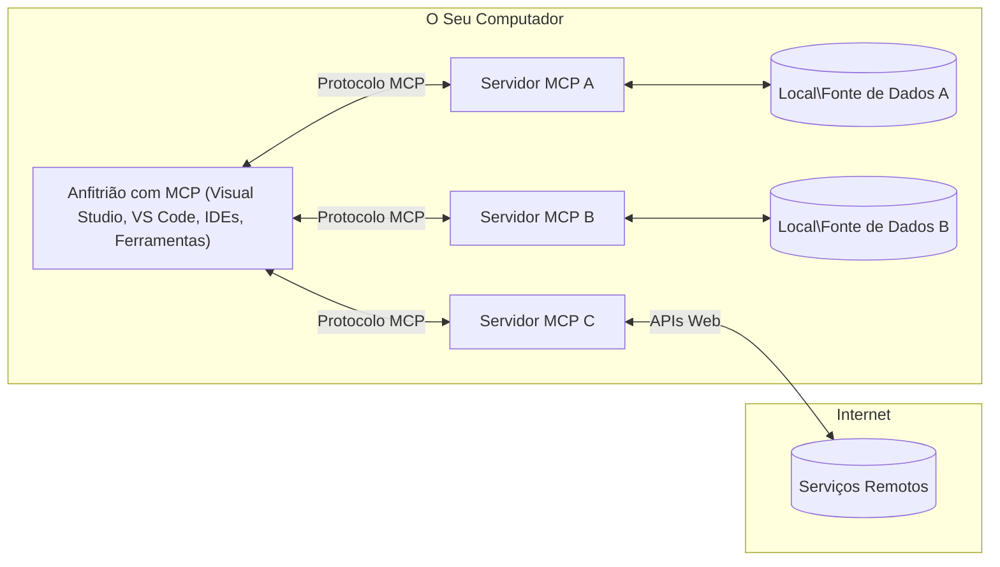

# Conceitos Principais do MCP: Dominando o Model Context Protocol para Integração de IA

[](https://youtu.be/earDzWGtE84)

_(Clique na imagem acima para ver o vídeo desta lição)_

O [Model Context Protocol (MCP)](https://github.com/modelcontextprotocol) é um quadro poderoso e padronizado que otimiza a comunicação entre Grandes Modelos de Linguagem (LLMs) e ferramentas, aplicações e fontes de dados externas.  
Este guia irá orientá-lo pelos conceitos principais do MCP. Você aprenderá sobre a sua arquitetura cliente-servidor, componentes essenciais, mecanismos de comunicação e melhores práticas de implementação.

- **Consentimento Explícito do Utilizador**: Todo o acesso a dados e operações requer aprovação explícita do utilizador antes da execução. Os utilizadores devem compreender claramente quais dados serão acedidos e que ações serão realizadas, com controlo granular sobre permissões e autorizações.

- **Proteção da Privacidade dos Dados**: Os dados dos utilizadores são expostos apenas com consentimento explícito e devem ser protegidos por controlos de acesso robustos durante todo o ciclo de vida da interação. As implementações devem prevenir a transmissão não autorizada de dados e manter fronteiras rigorosas de privacidade.

- **Segurança na Execução das Ferramentas**: Cada invocação de ferramenta exige consentimento explícito do utilizador com clara compreensão da funcionalidade da ferramenta, parâmetros e impacto potencial. Fronteiras de segurança robustas devem impedir execuções involuntárias, inseguras ou maliciosas de ferramentas.

- **Segurança na Camada de Transporte**: Todos os canais de comunicação devem usar mecanismos apropriados de encriptação e autenticação. As conexões remotas devem implementar protocolos de transporte seguros e gestão correta de credenciais.

#### Diretrizes de Implementação:

- **Gestão de Permissões**: Implementar sistemas de permissões granulares que permitam aos utilizadores controlar quais servidores, ferramentas e recursos são acessíveis  
- **Autenticação & Autorização**: Usar métodos seguros de autenticação (OAuth, chaves API) com gestão adequada de tokens e expiração  
- **Validação de Entrada**: Validar todos os parâmetros e dados de entrada conforme esquemas definidos para prevenir ataques de injeção  
- **Registos de Auditoria**: Manter registos abrangentes de todas as operações para monitorização de segurança e conformidade

## Visão Geral

Esta lição explora a arquitetura fundamental e os componentes que constituem o ecossistema do Model Context Protocol (MCP). Você conhecerá a arquitetura cliente-servidor, os componentes chave e os mecanismos de comunicação que alimentam as interações MCP.

## Objetivos Principais de Aprendizagem

No final desta lição, você irá:

- Compreender a arquitetura cliente-servidor MCP.  
- Identificar os papéis e responsabilidades dos Hosts, Clientes e Servidores.  
- Analisar as funcionalidades core que tornam o MCP uma camada de integração flexível.  
- Aprender como a informação flui dentro do ecossistema MCP.  
- Obter insights práticos com exemplos de código em .NET, Java, Python e JavaScript.

## Arquitetura MCP: Uma Análise Mais Profunda

O ecossistema MCP é construído num modelo cliente-servidor. Esta estrutura modular permite que aplicações de IA interajam eficientemente com ferramentas, bases de dados, APIs e recursos contextuais. Vamos detalhar esta arquitetura nos seus componentes principais.

No seu núcleo, o MCP segue uma arquitetura cliente-servidor onde uma aplicação anfitriã pode conectar-se a múltiplos servidores:


- **Hosts MCP**: Programas como VSCode, Claude Desktop, IDEs ou ferramentas de IA que querem aceder a dados via MCP  
- **Clientes MCP**: Clientes do protocolo que mantêm conexões 1:1 com servidores  
- **Servidores MCP**: Programas leves que expõem capacidades específicas através do Model Context Protocol padronizado  
- **Fontes de Dados Locais**: Ficheiros do seu computador, bases de dados e serviços que servidores MCP podem aceder de forma segura  
- **Serviços Remotos**: Sistemas externos disponíveis via internet que servidores MCP podem ligar através de APIs.

O Protocolo MCP é um padrão em evolução utilizando versionamento baseado em datas (formato AAAA-MM-DD). A versão atual do protocolo é **2025-11-25**. Pode ver as atualizações mais recentes da [especificação do protocolo](https://modelcontextprotocol.io/specification/2025-11-25/)

### 1. Hosts

No Model Context Protocol (MCP), **Hosts** são aplicações de IA que servem como interface principal pela qual os utilizadores interagem com o protocolo. Hosts coordenam e gerem conexões a múltiplos servidores MCP criando clientes MCP dedicados para cada conexão de servidor. Exemplos de Hosts incluem:

- **Aplicações de IA**: Claude Desktop, Visual Studio Code, Claude Code  
- **Ambientes de Desenvolvimento**: IDEs e editores de código com integração MCP  
- **Aplicações Personalizadas**: Agentes e ferramentas de IA construídos para propósitos específicos  

**Hosts** são aplicações que coordenam as interações com modelos de IA. Eles:

- **Orquestram Modelos de IA**: Executam ou interagem com LLMs para gerar respostas e coordenar fluxos de trabalho de IA  
- **Gerem Conexões de Clientes**: Criam e mantêm um cliente MCP por conexão a servidor MCP  
- **Controlam a Interface de Utilizador**: Gerem o fluxo da conversa, interações do utilizador e apresentação de respostas  
- **Imponham Segurança**: Controlam permissões, restrições de segurança e autenticação  
- **Gerem Consentimento do Utilizador**: Controlam a aprovação do utilizador para partilha de dados e execução de ferramentas

### 2. Clientes

**Clientes** são componentes essenciais que mantêm conexões dedicadas um-para-um entre Hosts e servidores MCP. Cada cliente MCP é instanciado pelo Host para conectar a um servidor MCP específico, garantindo canais de comunicação organizados e seguros. Múltiplos clientes permitem aos Hosts conectar a vários servidores simultaneamente.

**Clientes** são componentes conetores dentro da aplicação host. Eles:

- **Comunicação de Protocolo**: Enviam pedidos JSON-RPC 2.0 aos servidores com prompts e instruções  
- **Negociação de Capacidades**: Negociam funcionalidades suportadas e versões do protocolo com servidores durante a inicialização  
- **Execução de Ferramentas**: Gerem pedidos de execução de ferramentas dos modelos e processam respostas  
- **Atualizações em Tempo Real**: Tratam notificações e atualizações em tempo real dos servidores  
- **Processamento de Respostas**: Processam e formatam respostas do servidor para apresentação ao utilizador

### 3. Servidores

**Servidores** são programas que fornecem contexto, ferramentas e capacidades a clientes MCP. Podem ser executados localmente (na mesma máquina do Host) ou remotamente (em plataformas externas) e são responsáveis por tratar pedidos do cliente e fornecer respostas estruturadas. Servidores expõem funcionalidades específicas através do model Context Protocol padronizado.

**Servidores** são serviços que fornecem contexto e capacidades. Eles:

- **Registo de Funcionalidades**: Registam e expõem primitivas disponíveis (recursos, prompts, ferramentas) aos clientes  
- **Processamento de Pedidos**: Recebem e executam chamadas de ferramentas, pedidos de recursos e prompts dos clientes  
- **Provisão de Contexto**: Fornecem informação contextual e dados para melhorar respostas dos modelos  
- **Gestão do Estado**: Mantêm estado de sessão e tratam interações com estado quando necessário  
- **Notificações em Tempo Real**: Enviam notificações sobre alterações e atualizações de capacidades para os clientes ligados  

Servidores podem ser desenvolvidos por qualquer pessoa para estender capacidades do modelo com funcionalidades especializadas, e suportam cenários de implementação locais e remotos.

### 4. Primitivas do Servidor

Servidores no Model Context Protocol (MCP) fornecem três primitivas principais que definem os blocos de construção fundamentais para interações ricas entre clientes, hosts e modelos linguísticos. Estas primitivas especificam os tipos de informação contextual e ações disponíveis via protocolo.

Servidores MCP podem expor qualquer combinação das três primitivas principais seguintes:

#### Recursos

**Recursos** são fontes de dados que fornecem informação contextual para aplicações de IA. Representam conteúdos estáticos ou dinâmicos que podem enriquecer a compreensão e decisão do modelo:

- **Dados Contextuais**: Informação estruturada e contexto para consumo pelo modelo de IA  
- **Bases de Conhecimento**: Repositórios de documentos, artigos, manuais e publicações científicas  
- **Fontes de Dados Locais**: Ficheiros, bases de dados e informação do sistema local  
- **Dados Externos**: Respostas de APIs, serviços web e dados de sistemas remotos  
- **Conteúdo Dinâmico**: Dados em tempo real que se atualizam com base em condições externas

Recursos são identificados por URIs e suportam descoberta através dos métodos `resources/list` e leitura por `resources/read`:

```text
file://documents/project-spec.md
database://production/users/schema
api://weather/current
```

#### Prompts

**Prompts** são modelos reutilizáveis que ajudam a estruturar interações com modelos linguísticos. Fornecem padrões de interação padronizados e fluxos de trabalho modelados:

- **Interações Baseadas em Templates**: Mensagens pré-estruturadas e inícios de conversa  
- **Templates de Fluxo de Trabalho**: Sequências padronizadas para tarefas e interações comuns  
- **Exemplos Few-shot**: Templates baseados em exemplos para instrução do modelo  
- **Prompts de Sistema**: Prompts fundamentais que definem o comportamento e contexto do modelo  
- **Templates Dinâmicos**: Prompts parametrizados que se adaptam a contextos específicos

Prompts suportam substituição de variáveis e podem ser descobertos via `prompts/list` e obtidos com `prompts/get`:

```markdown
Generate a {{task_type}} for {{product}} targeting {{audience}} with the following requirements: {{requirements}}
```

#### Ferramentas

**Ferramentas** são funções executáveis que modelos de IA podem invocar para realizar ações específicas. Representam os "verbos" do ecossistema MCP, permitindo que modelos interajam com sistemas externos:

- **Funções Executáveis**: Operações discretas que modelos podem invocar com parâmetros específicos  
- **Integração com Sistemas Externos**: Chamadas API, queries em bases de dados, operações em ficheiros, cálculos  
- **Identidade Única**: Cada ferramenta tem um nome distinto, descrição e esquema de parâmetros  
- **E/S Estruturadas**: Ferramentas aceitam parâmetros validados e retornam respostas estruturadas e tipadas  
- **Capacidades de Ação**: Permitem aos modelos realizar ações no mundo real e obter dados ao vivo

Ferramentas são definidas com JSON Schema para validação de parâmetros e descobertas através de `tools/list` e executadas via `tools/call`. Ferramentas podem também incluir **ícones** como metadados adicionais para melhor apresentação na interface.

**Anotações de Ferramentas**: Ferramentas suportam anotações comportamentais (ex., `readOnlyHint`, `destructiveHint`) que descrevem se uma ferramenta é apenas leitura ou destrutiva, ajudando clientes a tomar decisões informadas sobre execução.

Exemplo de definição de ferramenta:

```typescript
server.tool(
  "search_products", 
  {
    query: z.string().describe("Search query for products"),
    category: z.string().optional().describe("Product category filter"),
    max_results: z.number().default(10).describe("Maximum results to return")
  }, 
  async (params) => {
    // Executar pesquisa e retornar resultados estruturados
    return await productService.search(params);
  }
);
```

## Primitivas do Cliente

No Model Context Protocol (MCP), **clientes** podem expor primitivas que permitem que servidores solicitem funcionalidades adicionais da aplicação host. Estas primitivas do lado cliente possibilitam implementações de servidor mais ricas e interativas, que podem aceder a capacidades do modelo de IA e interações do usuário.

### Amostragem

**Amostragem** permite que servidores solicitem completamentos de modelo de linguagem da aplicação AI do cliente. Esta primitiva habilita servidores a aceder capacidades LLM sem embutir as suas próprias dependências de modelo:

- **Acesso Independente de Modelo**: Servidores podem pedir completamentos sem incluir SDKs de LLM ou gerir acesso ao modelo  
- **IA Iniciada pelo Servidor**: Permite que servidores gerem conteúdo autonomamente usando o modelo AI do cliente  
- **Interações Recursivas LLM**: Suporta cenários complexos onde servidores necessitam de assistência AI para processamento  
- **Geração Dinâmica de Conteúdo**: Permite que servidores criem respostas contextuais usando o modelo do host  
- **Suporte a Chamada de Ferramentas**: Servidores podem incluir os parâmetros `tools` e `toolChoice` para permitir que o modelo do cliente invoque ferramentas durante a amostragem

A amostragem é iniciada pelo método `sampling/complete`, onde servidores enviam pedidos de completamento a clientes.

### Raízes

**Raízes** fornecem um modo padronizado para clientes exporem fronteiras do sistema de ficheiros para servidores, ajudando servidores a compreender quais as pastas e ficheiros a que têm acesso:

- **Fronteiras do Sistema de Ficheiros**: Definem os limites dentro dos quais servidores podem operar no sistema de ficheiros  
- **Controlo de Acesso**: Ajudam servidores a compreender quais as pastas e ficheiros que têm permissão para aceder  
- **Atualizações Dinâmicas**: Clientes podem notificar servidores quando a lista de raízes muda  
- **Identificação por URI**: Raízes usam URIs `file://` para identificar diretórios e ficheiros acessíveis

Raízes são descobertas via o método `roots/list`, com os clientes enviando notificações `notifications/roots/list_changed` quando as raízes são alteradas.

### Elicitação

**Elicitação** permite que servidores solicitem informação adicional ou confirmação de utilizadores através da interface do cliente:

- **Pedidos de Entrada do Utilizador**: Servidores podem pedir informação extra quando necessário para execução de ferramentas  
- **Diálogos de Confirmação**: Solicitar aprovação do utilizador para operações sensíveis ou impactantes  
- **Fluxos de Trabalho Interativos**: Permite que servidores criem interações passo-a-passo com o utilizador  
- **Recolha Dinâmica de Parâmetros**: Coletar parâmetros em falta ou opcionais durante a execução da ferramenta

Pedidos de elicitação são feitos através do método `elicitation/request` para recolher entrada do utilizador pela interface do cliente.

**Elicitação em Modo URL**: Servidores podem também solicitar interações com base em URL, permitindo direcionar utilizadores para páginas web externas para autenticação, confirmação ou entrada de dados.

### Registo

**Registo** permite que servidores enviem mensagens de log estruturadas a clientes para depuração, monitorização e visibilidade operacional:

- **Suporte à Depuração**: Permite que servidores forneçam registos detalhados para resolução de problemas  
- **Monitorização Operacional**: Envio de atualização de estados e métricas de desempenho para clientes  
- **Relato de Erros**: Fornece contexto de erro detalhado e informações diagnósticas  
- **Traços de Auditoria**: Cria registos abrangentes das operações e decisões do servidor

Mensagens de registo são enviadas aos clientes para prover transparência nas operações do servidor e facilitar a depuração.

## Fluxo de Informação no MCP

O Model Context Protocol (MCP) define um fluxo estruturado de informação entre hosts, clientes, servidores e modelos. Compreender este fluxo ajuda a clarificar como pedidos dos utilizadores são processados e como ferramentas e dados externos são integrados nas respostas dos modelos.
- **O Hóspede Inicia a Conexão**  
  A aplicação hospedeira (como um IDE ou interface de chat) estabelece uma conexão com um servidor MCP, tipicamente via STDIO, WebSocket, ou outro transporte suportado.

- **Negociação de Capacidades**  
  O cliente (embutido no hospedeiro) e o servidor trocam informações sobre as suas funcionalidades suportadas, ferramentas, recursos e versões de protocolo. Isto garante que ambos os lados compreendem que capacidades estão disponíveis para a sessão.

- **Pedido do Utilizador**  
  O utilizador interage com o hospedeiro (ex.: insere um prompt ou comando). O hospedeiro recolhe esta entrada e passa-a ao cliente para processamento.

- **Uso de Recurso ou Ferramenta**  
  - O cliente pode solicitar contexto adicional ou recursos ao servidor (como ficheiros, entradas de base de dados ou artigos de base de conhecimento) para enriquecer a compreensão do modelo.  
  - Se o modelo determinar que uma ferramenta é necessária (ex.: para obter dados, realizar um cálculo ou chamar uma API), o cliente envia um pedido de invocação da ferramenta ao servidor, especificando o nome da ferramenta e parâmetros.

- **Execução no Servidor**  
  O servidor recebe o pedido de recurso ou ferramenta, executa as operações necessárias (como executar uma função, consultar uma base de dados ou recuperar um ficheiro), e devolve os resultados ao cliente num formato estruturado.

- **Geração de Resposta**  
  O cliente integra as respostas do servidor (dados de recursos, saídas da ferramenta, etc.) na interação contínua com o modelo. O modelo usa esta informação para gerar uma resposta abrangente e contextualmente relevante.

- **Apresentação do Resultado**  
  O hospedeiro recebe a saída final do cliente e apresenta-a ao utilizador, frequentemente incluindo tanto o texto gerado pelo modelo como os resultados das execuções de ferramentas ou consultas a recursos.

Este fluxo permite que o MCP suporte aplicações de IA avançadas, interativas e conscientes do contexto, conectando perfeitamente modelos com ferramentas e fontes de dados externas.

## Arquitetura e Camadas do Protocolo

O MCP consiste em duas camadas arquitetónicas distintas que trabalham em conjunto para fornecer uma estrutura completa de comunicação:

### Camada de Dados

A **Camada de Dados** implementa o protocolo central MCP usando **JSON-RPC 2.0** como base. Esta camada define a estrutura das mensagens, semântica e padrões de interação:

#### Componentes Centrais:

- **Protocolo JSON-RPC 2.0**: Toda a comunicação utiliza o formato padronizado de mensagens JSON-RPC 2.0 para chamadas de método, respostas e notificações  
- **Gestão do Ciclo de Vida**: Trata da inicialização da conexão, negociação de capacidades e terminação da sessão entre clientes e servidores  
- **Primitivas de Servidor**: Permite aos servidores fornecer funcionalidade central através de ferramentas, recursos e prompts  
- **Primitivas de Cliente**: Permite aos servidores requisitar amostragem de LLMs, elicitar entrada do utilizador e enviar mensagens de log  
- **Notificações em Tempo Real**: Suporta notificações assíncronas para atualizações dinâmicas sem polling  

#### Funcionalidades-Chave:

- **Negociação de Versão do Protocolo**: Usa versionamento baseado em data (AAAA-MM-DD) para assegurar compatibilidade  
- **Descoberta de Capacidades**: Clientes e servidores trocam informação sobre funcionalidades suportadas durante a inicialização  
- **Sessões Stateful**: Mantém o estado da conexão através de múltiplas interações para continuidade do contexto

### Camada de Transporte

A **Camada de Transporte** gere canais de comunicação, emolduramento de mensagem e autenticação entre os participantes MCP:

#### Mecanismos de Transporte Suportados:

1. **Transporte STDIO**:  
   - Utiliza fluxos padrão de entrada/saída para comunicação direta de processos  
   - Ideal para processos locais na mesma máquina sem overhead de rede  
   - Comum para implementações locais de servidores MCP  

2. **Transporte HTTP Streamable**:  
   - Usa HTTP POST para mensagens de cliente para servidor  
   - Opcionalmente suporta Server-Sent Events (SSE) para streaming do servidor para cliente  
   - Permite comunicação remota entre servidores através de redes  
   - Suporta autenticação HTTP padrão (tokens bearer, chaves API, headers personalizados)  
   - O MCP recomenda OAuth para autenticação segura baseada em tokens

#### Abstração do Transporte:

A camada de transporte abstrai os detalhes da comunicação da camada de dados, permitindo o mesmo formato de mensagem JSON-RPC 2.0 em todos os mecanismos de transporte. Esta abstração permite que aplicações alternem entre servidores locais e remotos sem problemas.

### Considerações de Segurança

As implementações MCP devem aderir a vários princípios críticos de segurança para garantir interações seguras, confiáveis e protegidas em todas as operações do protocolo:

- **Consentimento e Controle do Utilizador**: Os utilizadores devem fornecer consentimento explícito antes que quaisquer dados sejam acedidos ou operações realizadas. Devem ter controlo claro sobre que dados são partilhados e que ações são autorizadas, suportado por interfaces intuitivas para rever e aprovar atividades.

- **Privacidade dos Dados**: Os dados do utilizador só devem ser expostos com consentimento explícito e devem ser protegidos por controlos de acesso adequados. Implementações MCP devem proteger contra transmissão não autorizada de dados e assegurar que a privacidade é mantida em todas as interações.

- **Segurança das Ferramentas**: Antes de invocar qualquer ferramenta, é necessário o consentimento explícito do utilizador. Os utilizadores devem compreender claramente a funcionalidade de cada ferramenta, e limites de segurança robustos devem ser aplicados para evitar a execução não intencional ou insegura de ferramentas.

Seguindo estes princípios de segurança, o MCP assegura a confiança, privacidade e segurança dos utilizadores em todas as interações do protocolo, enquanto permite integrações poderosas com IA.

## Exemplos de Código: Componentes-Chave

Segue-se exemplos de código em várias linguagens populares que ilustram como implementar componentes-chave de servidores MCP e ferramentas.

### Exemplo .NET: Criar um Servidor MCP Simples com Ferramentas

Aqui está um exemplo prático em .NET demonstrando como implementar um servidor MCP simples com ferramentas personalizadas. Este exemplo mostra como definir e registar ferramentas, tratar pedidos e ligar o servidor usando o Protocolo de Contexto do Modelo.

```csharp
using System;
using System.Threading.Tasks;
using ModelContextProtocol.Server;
using ModelContextProtocol.Server.Transport;
using ModelContextProtocol.Server.Tools;

public class WeatherServer
{
    public static async Task Main(string[] args)
    {
        // Create an MCP server
        var server = new McpServer(
            name: "Weather MCP Server",
            version: "1.0.0"
        );
        
        // Register our custom weather tool
        server.AddTool<string, WeatherData>("weatherTool", 
            description: "Gets current weather for a location",
            execute: async (location) => {
                // Call weather API (simplified)
                var weatherData = await GetWeatherDataAsync(location);
                return weatherData;
            });
        
        // Connect the server using stdio transport
        var transport = new StdioServerTransport();
        await server.ConnectAsync(transport);
        
        Console.WriteLine("Weather MCP Server started");
        
        // Keep the server running until process is terminated
        await Task.Delay(-1);
    }
    
    private static async Task<WeatherData> GetWeatherDataAsync(string location)
    {
        // This would normally call a weather API
        // Simplified for demonstration
        await Task.Delay(100); // Simulate API call
        return new WeatherData { 
            Temperature = 72.5,
            Conditions = "Sunny",
            Location = location
        };
    }
}

public class WeatherData
{
    public double Temperature { get; set; }
    public string Conditions { get; set; }
    public string Location { get; set; }
}
```

### Exemplo Java: Componentes do Servidor MCP

Este exemplo demonstra o mesmo servidor MCP e registo de ferramentas como o exemplo .NET acima, mas implementado em Java.

```java
import io.modelcontextprotocol.server.McpServer;
import io.modelcontextprotocol.server.McpToolDefinition;
import io.modelcontextprotocol.server.transport.StdioServerTransport;
import io.modelcontextprotocol.server.tool.ToolExecutionContext;
import io.modelcontextprotocol.server.tool.ToolResponse;

public class WeatherMcpServer {
    public static void main(String[] args) throws Exception {
        // Criar um servidor MCP
        McpServer server = McpServer.builder()
            .name("Weather MCP Server")
            .version("1.0.0")
            .build();
            
        // Registar uma ferramenta de meteorologia
        server.registerTool(McpToolDefinition.builder("weatherTool")
            .description("Gets current weather for a location")
            .parameter("location", String.class)
            .execute((ToolExecutionContext ctx) -> {
                String location = ctx.getParameter("location", String.class);
                
                // Obter dados meteorológicos (simplificado)
                WeatherData data = getWeatherData(location);
                
                // Devolver resposta formatada
                return ToolResponse.content(
                    String.format("Temperature: %.1f°F, Conditions: %s, Location: %s", 
                    data.getTemperature(), 
                    data.getConditions(), 
                    data.getLocation())
                );
            })
            .build());
        
        // Ligar o servidor usando transporte stdio
        try (StdioServerTransport transport = new StdioServerTransport()) {
            server.connect(transport);
            System.out.println("Weather MCP Server started");
            // Manter o servidor a correr até o processo ser terminado
            Thread.currentThread().join();
        }
    }
    
    private static WeatherData getWeatherData(String location) {
        // A implementação chamaria uma API de meteorologia
        // Simplificado para fins de exemplo
        return new WeatherData(72.5, "Sunny", location);
    }
}

class WeatherData {
    private double temperature;
    private String conditions;
    private String location;
    
    public WeatherData(double temperature, String conditions, String location) {
        this.temperature = temperature;
        this.conditions = conditions;
        this.location = location;
    }
    
    public double getTemperature() {
        return temperature;
    }
    
    public String getConditions() {
        return conditions;
    }
    
    public String getLocation() {
        return location;
    }
}
```

### Exemplo Python: Construir um Servidor MCP

Este exemplo utiliza fastmcp, certifique-se por favor de o instalar primeiro:

```python
pip install fastmcp
```
Exemplo de Código:

```python
#!/usr/bin/env python3
import asyncio
from fastmcp import FastMCP
from fastmcp.transports.stdio import serve_stdio

# Criar um servidor FastMCP
mcp = FastMCP(
    name="Weather MCP Server",
    version="1.0.0"
)

@mcp.tool()
def get_weather(location: str) -> dict:
    """Gets current weather for a location."""
    return {
        "temperature": 72.5,
        "conditions": "Sunny",
        "location": location
    }

# Abordagem alternativa usando uma classe
class WeatherTools:
    @mcp.tool()
    def forecast(self, location: str, days: int = 1) -> dict:
        """Gets weather forecast for a location for the specified number of days."""
        return {
            "location": location,
            "forecast": [
                {"day": i+1, "temperature": 70 + i, "conditions": "Partly Cloudy"}
                for i in range(days)
            ]
        }

# Registar ferramentas da classe
weather_tools = WeatherTools()

# Iniciar o servidor
if __name__ == "__main__":
    asyncio.run(serve_stdio(mcp))
```

### Exemplo JavaScript: Criar um Servidor MCP

Este exemplo mostra a criação de um servidor MCP em JavaScript e como registar duas ferramentas relacionadas com o clima.

```javascript
// A usar o SDK oficial do Protocolo de Contexto do Modelo
import { McpServer } from "@modelcontextprotocol/sdk/server/mcp.js";
import { StdioServerTransport } from "@modelcontextprotocol/sdk/server/stdio.js";
import { z } from "zod"; // Para validação de parâmetros

// Criar um servidor MCP
const server = new McpServer({
  name: "Weather MCP Server",
  version: "1.0.0"
});

// Definir uma ferramenta meteorológica
server.tool(
  "weatherTool",
  {
    location: z.string().describe("The location to get weather for")
  },
  async ({ location }) => {
    // Normalmente isto chamaria uma API de meteorologia
    // Simplificado para demonstração
    const weatherData = await getWeatherData(location);
    
    return {
      content: [
        { 
          type: "text", 
          text: `Temperature: ${weatherData.temperature}°F, Conditions: ${weatherData.conditions}, Location: ${weatherData.location}` 
        }
      ]
    };
  }
);

// Definir uma ferramenta de previsão
server.tool(
  "forecastTool",
  {
    location: z.string(),
    days: z.number().default(3).describe("Number of days for forecast")
  },
  async ({ location, days }) => {
    // Normalmente isto chamaria uma API de meteorologia
    // Simplificado para demonstração
    const forecast = await getForecastData(location, days);
    
    return {
      content: [
        { 
          type: "text", 
          text: `${days}-day forecast for ${location}: ${JSON.stringify(forecast)}` 
        }
      ]
    };
  }
);

// Funções auxiliares
async function getWeatherData(location) {
  // Simular chamada de API
  return {
    temperature: 72.5,
    conditions: "Sunny",
    location: location
  };
}

async function getForecastData(location, days) {
  // Simular chamada de API
  return Array.from({ length: days }, (_, i) => ({
    day: i + 1,
    temperature: 70 + Math.floor(Math.random() * 10),
    conditions: i % 2 === 0 ? "Sunny" : "Partly Cloudy"
  }));
}

// Ligar o servidor usando transporte stdio
const transport = new StdioServerTransport();
server.connect(transport).catch(console.error);

console.log("Weather MCP Server started");
```

Este exemplo em JavaScript demonstra como criar um servidor MCP usando o SDK do Protocolo de Contexto de Modelo. Mostra como registar duas ferramentas chamadas `weatherTool` e `forecastTool` e disponibilizá-las a clientes MCP através do `StdioServerTransport`.

## Segurança e Autorização

O MCP inclui vários conceitos e mecanismos incorporados para gerir segurança e autorização ao longo do protocolo:

1. **Controlo de Permissões das Ferramentas**:  
  Os clientes podem especificar quais ferramentas um modelo tem permissão para usar durante uma sessão. Isto assegura que só as ferramentas autorizadas explicitamente estejam acessíveis, reduzindo o risco de operações não intencionais ou inseguras. As permissões podem ser configuradas dinamicamente com base nas preferências do utilizador, políticas organizacionais ou contexto da interação.

2. **Autenticação**:  
  Os servidores podem exigir autenticação antes de conceder acesso a ferramentas, recursos ou operações sensíveis. Isto pode envolver chaves API, tokens OAuth ou outros esquemas de autenticação. A autenticação adequada assegura que apenas clientes e utilizadores confiáveis possam invocar capacidades do lado do servidor.

3. **Validação**:  
  A validação de parâmetros é aplicada a todas as invocações de ferramentas. Cada ferramenta define os tipos, formatos e restrições esperadas para os seus parâmetros, e o servidor valida os pedidos recebidos em conformidade. Isto previne que input malformado ou malicioso chegue às implementações das ferramentas e ajuda a manter a integridade das operações.

4. **Limitação de Taxa**:  
  Para prevenir abusos e garantir uso justo dos recursos do servidor, servidores MCP podem implementar limitação de taxa para chamadas de ferramentas e acesso a recursos. Os limites de taxa podem ser aplicados por utilizador, por sessão ou globalmente, ajudando a proteger contra ataques de negação de serviço ou consumo excessivo de recursos.

Combinando estes mecanismos, o MCP fornece uma base segura para integrar modelos de linguagem com ferramentas externas e fontes de dados, enquanto oferece aos utilizadores e desenvolvedores controlo detalhado sobre acesso e uso.

## Mensagens do Protocolo e Fluxo de Comunicação

A comunicação MCP usa mensagens estruturadas **JSON-RPC 2.0** para facilitar interações claras e fiáveis entre hospedeiros, clientes e servidores. O protocolo define padrões específicos de mensagens para diferentes tipos de operações:

### Tipos Centrais de Mensagem:

#### **Mensagens de Inicialização**
- Pedido `initialize`: Estabelece a conexão e negocia versão e capacidades do protocolo  
- Resposta `initialize`: Confirma funcionalidades suportadas e informação do servidor  
- `notifications/initialized`: Indica que a inicialização está completa e a sessão pronta  

#### **Mensagens de Descoberta**
- Pedido `tools/list`: Descobre ferramentas disponíveis no servidor  
- Pedido `resources/list`: Lista recursos disponíveis (fontes de dados)  
- Pedido `prompts/list`: Recupera templates de prompt disponíveis  

#### **Mensagens de Execução**  
- Pedido `tools/call`: Executa uma ferramenta específica com os parâmetros fornecidos  
- Pedido `resources/read`: Recupera conteúdo de um recurso específico  
- Pedido `prompts/get`: Obtém um template de prompt com parâmetros opcionais  

#### **Mensagens Lado Cliente**
- Pedido `sampling/complete`: O servidor solicita ao cliente uma conclusão LLM  
- `elicitation/request`: O servidor solicita entrada do utilizador via interface cliente  
- Mensagens de Logging: O servidor envia mensagens de log estruturadas para o cliente

#### **Mensagens de Notificação**
- `notifications/tools/list_changed`: O servidor notifica cliente sobre alterações em ferramentas  
- `notifications/resources/list_changed`: O servidor notifica cliente sobre alterações em recursos  
- `notifications/prompts/list_changed`: O servidor notifica cliente sobre alterações em prompts

### Estrutura da Mensagem:

Todas as mensagens MCP seguem o formato JSON-RPC 2.0 com:  
- Mensagens de Pedido: incluem `id`, `method` e `params` opcionais  
- Mensagens de Resposta: incluem `id` e `result` ou `error`  
- Mensagens de Notificação: incluem `method` e `params` opcionais (sem `id`, sem resposta esperada)

Esta comunicação estruturada assegura interações fiáveis, rastreáveis e extensíveis, suportando cenários avançados como atualizações em tempo real, encadeamento de ferramentas e tratamento robusto de erros.

### Tarefas (Experimental)

**Tarefas** são uma funcionalidade experimental que fornece invólucros de execução duradouros que permitem a recuperação diferida de resultados e acompanhamento de estado para pedidos MCP:

- **Operações de Longa Duração**: Monitorizam cálculos dispendiosos, automação de fluxos de trabalho e processamento em batch  
- **Resultados Diferidos**: Permitem polling para estado da tarefa e recuperação de resultados à medida que as operações terminam  
- **Acompanhamento de Estado**: Monitorizam o progresso da tarefa através de estados definidos no ciclo de vida  
- **Operações Multi-etapas**: Suportam fluxos de trabalho complexos que abrangem múltiplas interações

Tarefas envolvem pedidos MCP padrão para possibilitar padrões de execução assíncronos para operações que não podem ser concluídas imediatamente.

## Pontos-Chave

- **Arquitetura**: MCP usa arquitetura cliente-servidor onde hospedeiros gerem múltiplas conexões de clientes a servidores  
- **Participantes**: O ecossistema inclui hospedeiros (aplicações IA), clientes (conectores de protocolo) e servidores (provedores de capacidades)  
- **Mecanismos de Transporte**: Comunicação suporta STDIO (local) e HTTP streamable com SSE opcional (remoto)  
- **Primitivas Centrais**: Servidores expõem ferramentas (funções executáveis), recursos (fontes de dados) e prompts (templates)  
- **Primitivas de Cliente**: Servidores podem solicitar amostragem (completamentos LLM com suporte a chamadas de ferramentas), elicitação (entrada do utilizador incluindo modo URL), roots (limites do sistema de ficheiros) e logging dos clientes  
- **Funcionalidades Experimentais**: Tarefas fornecem invólucros duradouros para operações de longa duração  
- **Base do Protocolo**: Construído sobre JSON-RPC 2.0 com versionamento baseado em data (atual: 2025-11-25)  
- **Capacidades em Tempo Real**: Suporta notificações para atualizações dinâmicas e sincronização em tempo real  
- **Segurança em Primeiro Lugar**: Consentimento explícito do utilizador, proteção da privacidade de dados e transporte seguro são requisitos centrais

## Exercício

Conceba uma ferramenta MCP simples que seria útil no seu domínio. Defina:  
1. Qual seria o nome da ferramenta  
2. Que parâmetros aceitaria  
3. Que saída retornaria  
4. Como um modelo poderia usar esta ferramenta para resolver problemas do utilizador

---

## O que vem a seguir

Seguinte: [Capítulo 2: Segurança](../02-Security/README.md)

---

<!-- CO-OP TRANSLATOR DISCLAIMER START -->
**Aviso Legal**:
Este documento foi traduzido utilizando o serviço de tradução por IA [Co-op Translator](https://github.com/Azure/co-op-translator). Embora nos esforcemos por garantir a precisão, tenha em atenção que traduções automáticas podem conter erros ou imprecisões. O documento original na sua língua nativa deve ser considerado a fonte autorizada. Para informações críticas, recomenda-se tradução profissional efetuada por humanos. Não nos responsabilizamos por quaisquer mal-entendidos ou interpretações incorretas decorrentes do uso desta tradução.
<!-- CO-OP TRANSLATOR DISCLAIMER END -->