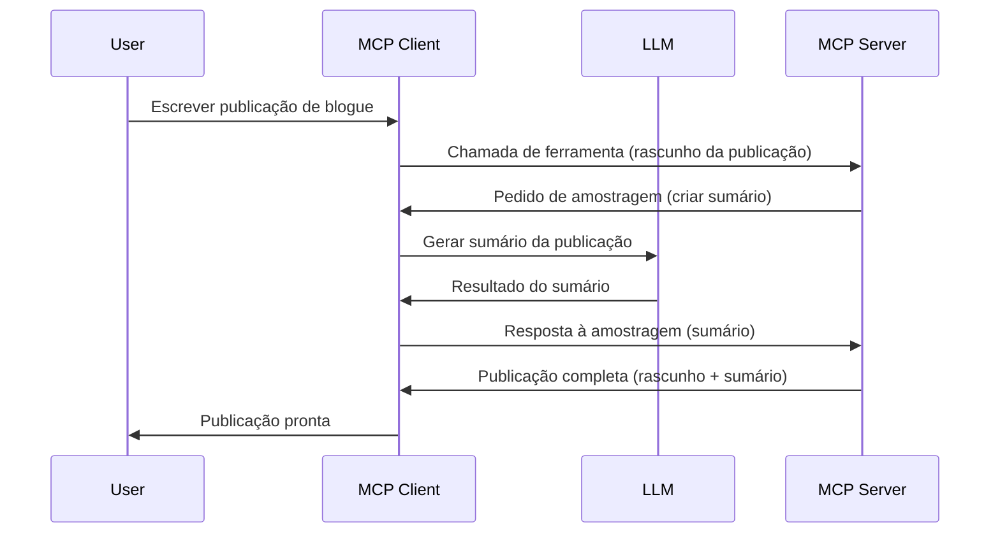

# Sampling - delegar funcionalidades para o Cliente

Por vezes, é necessário que o Cliente MCP e o Servidor MCP colaborem para alcançar um objetivo comum. Pode ter um caso onde o Servidor necessita da ajuda de um LLM que está no cliente. Para esta situação, sampling é o que deve usar.

Vamos explorar alguns casos de uso e como construir uma solução envolvendo sampling.

## Visão geral

Nesta lição, focamo-nos em explicar quando e onde usar Sampling e como configurá-lo.

## Objetivos de aprendizagem

Neste capítulo, iremos:

- Explicar o que é Sampling e quando usá-lo.
- Mostrar como configurar Sampling no MCP.
- Fornecer exemplos de Sampling em ação.

## O que é Sampling e por que usá-lo?

Sampling é uma funcionalidade avançada que funciona da seguinte forma:



### Pedido de Sampling

Ok, agora que temos uma vista geral de um cenário credível, vamos falar sobre o pedido de sampling que o servidor envia de volta ao cliente. Eis como tal pedido pode parecer em formato JSON-RPC:

```json
{
  "jsonrpc": "2.0",
  "id": 1,
  "method": "sampling/createMessage",
  "params": {
    "messages": [
      {
        "role": "user",
        "content": {
          "type": "text",
          "text": "Create a blog post summary of the following blog post: <BLOG POST>"
        }
      }
    ],
    "modelPreferences": {
      "hints": [
        {
          "name": "claude-3-sonnet"
        }
      ],
      "intelligencePriority": 0.8,
      "speedPriority": 0.5
    },
    "systemPrompt": "You are a helpful assistant.",
    "maxTokens": 100
  }
}
```

Há algumas coisas aqui que vale a pena destacar:

- Prompt, em content -> text, é o nosso prompt que é uma instrução para o LLM resumir o conteúdo do post do blog.

- **modelPreferences**. Esta secção é exatamente isso, uma preferência, uma recomendação da configuração a usar com o LLM. O utilizador pode optar por seguir estas recomendações ou alterá-las. Neste caso, há recomendações sobre qual modelo usar, e prioridade em velocidade e inteligência.
- **systemPrompt**, este é o seu prompt normal de sistema que dá personalidade ao seu LLM e contém instruções de orientação.
- **maxTokens**, esta é outra propriedade usada para indicar quantos tokens são recomendados para usar nesta tarefa.

### Resposta de Sampling

Esta resposta é o que o Cliente MCP acaba por enviar de volta ao Servidor MCP e é o resultado do cliente chamar o LLM, esperar por essa resposta e depois construir esta mensagem. Eis como pode parecer em JSON-RPC:

```json
{
  "jsonrpc": "2.0",
  "id": 1,
  "result": {
    "role": "assistant",
    "content": {
      "type": "text",
      "text": "Here's your abstract <ABSTRACT>"
    },
    "model": "gpt-5",
    "stopReason": "endTurn"
  }
}
```

Note como a resposta é um resumo do post do blog exatamente como pedimos. Note também como o `model` usado não é o que pedimos mas "gpt-5" em vez de "claude-3-sonnet". Isto é para ilustrar que o utilizador pode mudar de opinião sobre o que usar e que o seu pedido de sampling é uma recomendação.

Ok, agora que compreendemos o fluxo principal, e uma tarefa útil para usar isto é "criação de post de blog + resumo", vejamos o que temos de fazer para que funcione.

### Tipos de mensagens

As mensagens de Sampling não se limitam apenas a texto, pode também enviar imagens e áudio. Eis como o JSON-RPC difere:

**Texto**

```json
{
  "type": "text",
  "text": "The message content"
}
```

**Conteúdo de imagem**

```json
{
  "type": "image",
  "data": "base64-encoded-image-data",
  "mimeType": "image/jpeg"
}
```

**Conteúdo de áudio**

```json
{
  "type": "audio",
  "data": "base64-encoded-audio-data",
  "mimeType": "audio/wav"
}
```

> NOTE: para mais informações detalhadas sobre Sampling, consulte a [documentação oficial](https://modelcontextprotocol.io/specification/2025-11-25/client/sampling)

## Como configurar Sampling no Cliente

> Nota: se estiver apenas a construir um servidor, não precisa de fazer muito aqui.

No cliente, precisa de especificar a seguinte funcionalidade assim:

```json
{
  "capabilities": {
    "sampling": {}
  }
}
```

Isso será depois detectado quando o seu cliente escolhido inicializar com o servidor.

## Exemplo de Sampling em ação - Criar um Post de Blog

Vamos codificar um servidor de sampling juntos, teremos de fazer o seguinte:

1. Criar uma ferramenta no Servidor.
1. Essa ferramenta deve criar um pedido de sampling.
1. A ferramenta deve esperar pela resposta ao pedido de sampling do cliente.
1. Depois o resultado da ferramenta deve ser produzido.

Vamos ver o código passo a passo:

### -1- Criar a ferramenta

**python**

```python
@mcp.tool()
async def create_blog(title: str, content: str, ctx: Context[ServerSession, None]) -> str:
    """Create a blog post and generate a summary"""

```

### -2- Criar um pedido de sampling

Estenda a sua ferramenta com o seguinte código:

**python**

```python
post = BlogPost(
        id=len(posts) + 1,
        title=title,
        content=content,
        abstract=""
    )

prompt = f"Create an abstract of the following blog post: title: {title} and draft: {content} "

result = await ctx.session.create_message(
        messages=[
            SamplingMessage(
                role="user",
                content=TextContent(type="text", text=prompt),
            )
        ],
        max_tokens=100,
)

```

### -3- Esperar pela resposta e retornar a resposta

**python**

```python
post.abstract = result.content.text

posts.append(post)

# retorna o produto completo
return json.dumps({
    "id": post.title,
    "abstract": post.abstract
})
```

### -4- Código completo

**python**

```python
from starlette.applications import Starlette
from starlette.routing import Mount, Host

from mcp.server.fastmcp import Context, FastMCP

from mcp.server.session import ServerSession
from mcp.types import SamplingMessage, TextContent

import json


from uuid import uuid4
from typing import List
from pydantic import BaseModel


mcp = FastMCP("Blog post generator")

# app = FastAPI()

posts = []

class BlogPost(BaseModel):
    id: int
    title: str
    content: str
    abstract: str

posts: List[BlogPost] = []

@mcp.tool()
async def create_blog(title: str, content: str, ctx: Context[ServerSession, None]) -> str:
    """Create a blog post and generate a summary"""

    post = BlogPost(
        id=len(posts) + 1,
        title=title,
        content=content,
        abstract=""
    )

    prompt = f"Create an abstract of the following blog post: title: {title} and draft: {content} "

    result = await ctx.session.create_message(
        messages=[
            SamplingMessage(
                role="user",
                content=TextContent(type="text", text=prompt),
            )
        ],
        max_tokens=100,
    )

    post.abstract = result.content.text

    posts.append(post)

    # retorna o post completo do blog
    return json.dumps({
        "id": post.title,
        "abstract": post.abstract
    })

if __name__ == "__main__":
    print("Starting server...")
    # mcp.run()
    mcp.run(transport="streamable-http")

# correr a aplicação com: python server.py
```

### -5- Testar no Visual Studio Code

Para testar isto no Visual Studio Code, faça o seguinte:

1. Inicie o servidor no terminal
1. Adicione-o ao *mcp.json* (e certifique-se que está iniciado) ex: algo assim:

   ```json
   "servers": {
      "blog-server": {
        "type": "http",
        "url": "http://localhost:8000/mcp"
      }
   }
   ```

1. Escreva um prompt:

   ```text
   create a blog post named "Where Python comes from", the content is "Python is actually named after Monty Python Flying Circus"
   ```

1. Permita que o sampling ocorra. Na primeira vez que testar isto será apresentado um diálogo adicional que terá de aceitar, depois verá o diálogo normal a pedir para executar uma ferramenta

1. Inspecione os resultados. Verá os resultados apresentados de forma elegante no GitHub Copilot Chat, mas também pode inspecionar a resposta JSON crua.

**Bónus**. A ferramenta Visual Studio Code tem ótimo suporte para sampling. Pode configurar o acesso a Sampling para o seu servidor instalado navegando assim:

1. Navegue para a secção das extensões.
1. Selecione o ícone de engrenagem para o seu servidor instalado na secção "MCP SERVERS - INSTALLED".
1. Selecione "Configure Model Access", aqui pode selecionar quais Modelos que o GitHub Copilot pode usar quando realiza sampling. Pode também ver todos os pedidos de sampling recentes selecionando "Show Sampling requests".

## Tarefa

Nesta tarefa, irá construir um Sampling ligeiramente diferente, nomeadamente uma integração de sampling que suporta a geração de uma descrição de produto. Eis o seu cenário:

**Cenário**: O trabalhador do back office numa plataforma de comércio eletrónico precisa de ajuda, demora demasiado tempo a gerar descrições de produtos. Portanto, deve construir uma solução onde possa chamar uma ferramenta "create_product" com "title" e "keywords" como argumentos e que deverá produzir um produto completo incluindo um campo "description" que deverá ser preenchido pelo LLM do cliente.

DICA: use o que aprendeu anteriormente para construir este servidor e a sua ferramenta usando um pedido de sampling.

## Solução

[Solução](./solution/README.md)

## Principais conclusões

Sampling é uma funcionalidade poderosa que permite ao servidor delegar tarefas ao cliente quando precisa da ajuda de um LLM.

## O que vem a seguir

- [Capítulo 4 - Implementação prática](../../04-PracticalImplementation/README.md)

---

<!-- CO-OP TRANSLATOR DISCLAIMER START -->
**Aviso Legal**:
Este documento foi traduzido utilizando o serviço de tradução automática [Co-op Translator](https://github.com/Azure/co-op-translator). Embora nos esforcemos pela precisão, esteja ciente de que traduções automáticas podem conter erros ou imprecisões. O documento original na sua língua nativa deve ser considerado a fonte autorizada. Para informações críticas, recomenda-se tradução profissional humana. Não nos responsabilizamos por quaisquer mal-entendidos ou interpretações incorretas resultantes da utilização desta tradução.
<!-- CO-OP TRANSLATOR DISCLAIMER END -->