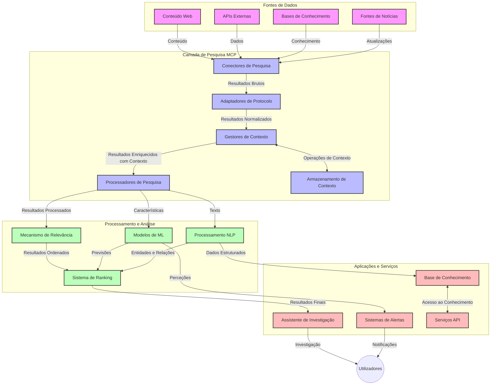
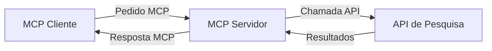
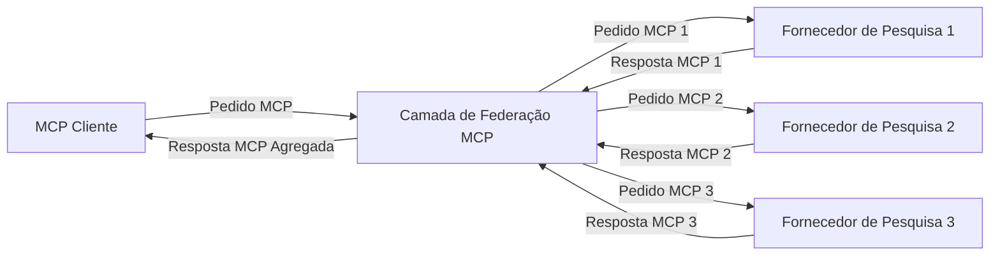
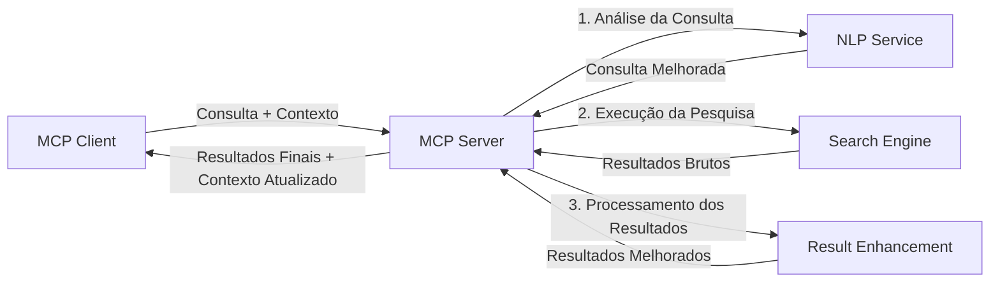

# Protocolo de Contexto de Modelo para Pesquisa Web em Tempo Real

## Visão Geral

A pesquisa web em tempo real tornou-se essencial no ambiente orientado por informação de hoje, onde as aplicações precisam de acesso imediato a informações atualizadas na internet para fornecer respostas relevantes e oportunas. O Protocolo de Contexto de Modelo (MCP) representa um avanço significativo na otimização destes processos de pesquisa em tempo real, melhorando a eficiência da pesquisa, mantendo a integridade contextual e aprimorando o desempenho geral do sistema.

Este módulo explora como o MCP transforma a pesquisa web em tempo real ao fornecer uma abordagem padronizada para a gestão de contexto entre modelos de IA, motores de busca e aplicações.

### O Que Você Vai Aprender

Neste guia abrangente, você irá descobrir:

- Como o MCP cria uma ponte fluida entre modelos de IA e capacidades de pesquisa web em tempo real
- Padrões arquiteturais para implementar soluções de pesquisa eficientes e escaláveis com MCP
- Técnicas para preservar o contexto de pesquisa em múltiplas consultas e interações
- Implementações práticas em código Python e JavaScript para diversos cenários de pesquisa
- Métodos para equilibrar relevância, atualidade e desempenho em sistemas de pesquisa alimentados por MCP

## Introdução à Pesquisa Web em Tempo Real

A pesquisa web em tempo real é uma abordagem tecnológica que permite o interrogatório, processamento e análise contínuos de informações baseadas na web à medida que são publicadas ou atualizadas, permitindo aos sistemas fornecer informações frescas e relevantes com latência mínima. Diferentemente dos sistemas de pesquisa tradicionais que operam sobre dados indexados que podem ter horas ou dias, a pesquisa em tempo real processa dados ao vivo da web, oferecendo insights e informações que refletem o estado atual do conteúdo online.

### Conceitos Centrais da Pesquisa Web em Tempo Real:

- **Processamento Contínuo de Consultas**: Consultas de pesquisa são processadas contra fontes de dados constantemente atualizadas
- **Priorização da Atualidade**: Os sistemas são projetados para priorizar informações recentes
- **Equilíbrio de Relevância**: Manter um balanço entre relevância e atualidade
- **Arquitetura Escalável**: Sistemas devem lidar com cargas de consulta e volumes de dados variáveis
- **Compreensão Contextual**: Manter o contexto do utilizador ao longo das iterações de pesquisa é crucial para resultados significativos
- **Reformulações Dinâmicas das Consultas**: Modificação adaptativa das consultas com base no contexto e resultados anteriores
- **Integração Multifuentes**: Combinação de resultados de múltiplos provedores de pesquisa e fontes web
- **Compreensão Semântica**: Processamento das consultas e conteúdos baseado no significado e não apenas em palavras-chave
- **Ranking em Tempo Real**: Ajuste contínuo das classificações dos resultados à medida que novas informações ficam disponíveis

### O Protocolo de Contexto de Modelo e a Pesquisa Web em Tempo Real

O Protocolo de Contexto de Modelo (MCP) aborda vários desafios críticos em ambientes de pesquisa web em tempo real:

1. **Preservação do Contexto de Pesquisa**: O MCP padroniza como o contexto é mantido entre componentes distribuídos da pesquisa, garantindo que modelos de IA e nós de processamento tenham acesso ao histórico relevante de consultas e preferências do utilizador.

2. **Gestão Eficiente de Consultas**: Ao fornecer mecanismos estruturados para a transmissão do contexto, o MCP reduz a sobrecarga de repetir o contexto em cada iteração de pesquisa.

3. **Interoperabilidade**: O MCP cria uma linguagem comum para o compartilhamento de contexto entre diversas tecnologias de pesquisa e modelos de IA, permitindo arquiteturas mais flexíveis e extensíveis.

4. **Contexto Otimizado para Pesquisa**: Implementações do MCP podem priorizar quais elementos de contexto são mais relevantes para uma pesquisa eficaz, otimizando tanto o desempenho quanto a precisão.

5. **Processamento Adaptativo da Pesquisa**: Com a gestão adequada do contexto através do MCP, os sistemas de pesquisa podem ajustar dinamicamente o processamento com base nas necessidades evolutivas dos utilizadores e nos panoramas informativos.

Em aplicações modernas que vão desde agregação de notícias a assistentes de pesquisa, a integração do MCP com tecnologias de pesquisa web permite uma pesquisa mais inteligente, consciente do contexto, que pode fornecer resultados cada vez mais relevantes à medida que as interações dos utilizadores continuam.

## Objetivos de Aprendizagem

Ao final desta lição, você será capaz de:

- Compreender os fundamentos da pesquisa web em tempo real e seus desafios em aplicações modernas
- Explicar como o Protocolo de Contexto de Modelo (MCP) melhora as capacidades da pesquisa web em tempo real
- Implementar soluções de pesquisa baseadas em MCP usando frameworks e APIs populares
- Projetar e implementar arquiteturas de pesquisa escaláveis e de alto desempenho com MCP
- Aplicar conceitos do MCP a vários casos de uso incluindo pesquisa semântica, assistência de pesquisa e navegação aumentada por IA
- Avaliar tendências emergentes e inovações futuras em tecnologias de pesquisa baseadas em MCP
- Desenvolver sistemas de pesquisa conscientes do contexto que aprendem com interações dos utilizadores
- Integrar capacidades de pesquisa web em assistentes de IA usando protocolos MCP padronizados
- Criar pipelines de pesquisa em múltiplas etapas que refinam progressivamente os resultados com base no contexto
- Otimizar o desempenho da pesquisa mantendo consciência abrangente do contexto

### Definição e Significado

A pesquisa web em tempo real envolve o interrogatório, recuperação e entrega contínuos de informações baseadas na web com latência mínima. Diferentemente dos motores de busca tradicionais que periodicamente rastreiam e indexam a web, a pesquisa em tempo real visa revelar informações assim que ficam disponíveis, permitindo acesso imediato ao conteúdo mais atual.

Características chave da pesquisa web em tempo real incluem:

- **Atualidade**: Priorização de conteúdos e atualizações recentes
- **Processamento Contínuo**: Monitoramento constante para novas informações
- **Adaptação de Consultas**: Refinamento das consultas de pesquisa com base no contexto e feedback
- **Entrega Imediata**: Fornecer resultados de pesquisa com atraso mínimo
- **Retenção de Contexto**: Construir sobre consultas anteriores para melhorar a relevância

### Desafios da Pesquisa Web Tradicional

Abordagens tradicionais à pesquisa web enfrentam várias limitações quando aplicadas a cenários em tempo real:

1. **Fragmentação do Contexto**: Dificuldade em manter o contexto da pesquisa entre múltiplas consultas
2. **Atualidade da Informação**: Desafios em acessar e priorizar as informações mais recentes
3. **Complexidade de Integração**: Problemas com a interoperabilidade entre sistemas de pesquisa e aplicações
4. **Problemas de Latência**: Equilibrar pesquisa abrangente com requisitos de tempo de resposta
5. **Ajuste de Relevância**: Garantir precisão e relevância enquanto se prioriza a atualidade

## Compreendendo o Protocolo de Contexto de Modelo (MCP) para Pesquisa

### O Que é MCP em Contextos de Pesquisa?

O Protocolo de Contexto de Modelo (MCP) é um protocolo de comunicação padronizado projetado para facilitar a interação eficiente entre modelos de IA e aplicações. No contexto da pesquisa web em tempo real, o MCP fornece uma estrutura para:

- Preservar o contexto da pesquisa ao longo de sequências de consultas
- Padronizar os formatos de consulta e de resultados de pesquisa
- Otimizar a transmissão de parâmetros e resultados de pesquisa
- Melhorar a comunicação entre modelos e motores de busca

### Componentes Centrais e Arquitetura

A arquitetura MCP para pesquisa web em tempo real consiste em vários componentes chave:

1. **Gestores de Contexto de Consulta**: Gerenciam e mantêm o contexto da pesquisa durante múltiplas consultas
2. **Processadores de Pesquisa**: Processam os pedidos de pesquisa recebidos usando técnicas conscientes do contexto
3. **Adaptadores de Protocolo**: Convertem entre diferentes APIs de pesquisa preservando o contexto
4. **Armazenamento de Contexto**: Armazena e recupera eficientemente o histórico e preferências de pesquisa
5. **Conectores de Pesquisa**: Conectam a vários motores de busca e APIs web



### Como o MCP Melhora a Pesquisa Web em Tempo Real

O MCP aborda os desafios tradicionais da pesquisa web através de:

- **Continuidade Contextual**: Mantendo relações entre consultas durante toda a sessão de pesquisa
- **Transmissão Otimizada**: Reduzindo a redundância nos parâmetros de pesquisa através de gestão inteligente do contexto
- **Interfaces Padronizadas**: Fornecendo APIs consistentes para componentes de pesquisa
- **Menor Latência**: Minimizar a sobrecarga de processamento através de gestão eficiente do contexto
- **Relevância Aprimorada**: Melhorar a relevância da pesquisa preservando a intenção do utilizador em múltiplas consultas

## Integração e Implementação

Sistemas de pesquisa web em tempo real requerem um design arquitetural e implementação cuidadosos para manter tanto o desempenho quanto a integridade contextual. O Protocolo de Contexto de Modelo oferece uma abordagem padronizada para integrar modelos de IA e tecnologias de pesquisa, permitindo pipelines de pesquisa mais sofisticados e conscientes do contexto.

### Visão Geral da Integração MCP em Arquiteturas de Pesquisa

Implementar o MCP em ambientes de pesquisa web em tempo real envolve várias considerações principais:

1. **Serialização do Contexto de Pesquisa**: O MCP fornece mecanismos eficientes para codificar informações contextuais dentro dos pedidos de pesquisa, garantindo que o contexto essencial acompanhe a consulta durante todo o pipeline de processamento. Isso inclui formatos de serialização padronizados otimizados para metadados relacionados à pesquisa.

2. **Processamento Stateful de Pesquisa**: O MCP permite um processamento stateful mais inteligente mantendo uma representação consistente do contexto ao longo das iterações de pesquisa. Isso é particularmente valioso em pipelines de pesquisa em múltiplas etapas, onde o refinamento do contexto melhora os resultados.

3. **Expansão e Refinamento de Consultas**: Implementações do MCP em sistemas de pesquisa podem facilitar expansões e refinamentos sofisticados das consultas baseados no contexto acumulado, permitindo resultados cada vez mais relevantes à medida que a sessão avança.

4. **Cache e Priorização de Resultados**: Padronizando o manuseamento do contexto, o MCP ajuda a gerir cache e priorização de resultados, permitindo que os componentes se adaptem com base no contexto de pesquisa em evolução.

5. **Federação e Agregação de Pesquisa**: O MCP facilita federações de pesquisa mais sofisticadas através de múltiplos backends, fornecendo representações estruturadas do contexto de pesquisa, habilitando uma agregação mais significativa de resultados de fontes diversas.

A implementação do MCP em diversas tecnologias de pesquisa cria uma abordagem unificada para a gestão de contexto, reduzindo a necessidade de código personalizado de integração e aumentando a capacidade do sistema de manter um contexto significativo à medida que as consultas evoluem.

### MCP em Diferentes Implementações de Pesquisa Web

Estes exemplos seguem a especificação atual do MCP que se foca num protocolo baseado em JSON-RPC com mecanismos de transporte distintos. O código demonstra como pode implementar integrações personalizadas de pesquisa mantendo total compatibilidade com o protocolo MCP.

<details>
<summary>Implementação em Python com API de Pesquisa Genérica</summary>

```python
import asyncio
import json
import aiohttp
from typing import Dict, Any, Optional, List
from contextlib import asynccontextmanager
from collections.abc import AsyncIterator

# Importar bibliotecas padrão MCP
from mcp.client.session import ClientSession
from mcp.client.streamable_http import streamablehttp_client
from mcp.types import TextContent, CreateMessageRequestParams, CreateMessageResult
from mcp.server.fastmcp import FastMCP

# Criar um servidor FastMCP para pesquisa web
search_server = FastMCP("WebSearch")

# Classe para gerir operações de pesquisa web
class WebSearchHandler:
    def __init__(self, api_endpoint: str, api_key: str):
        self.api_endpoint = api_endpoint
        self.api_key = api_key
        self.session = None
        
    async def initialize(self):
        """Initialize the HTTP session"""
        self.session = aiohttp.ClientSession(
            headers={"Authorization": f"Bearer {self.api_key}"}
        )
    
    async def close(self):
        """Close the HTTP session"""
        if self.session:
            await self.session.close()
            
    async def perform_search(self, query: str, max_results: int = 5, 
                           include_domains: List[str] = None, 
                           exclude_domains: List[str] = None,
                           time_period: str = "any") -> Dict[str, Any]:
        """Perform web search using the search API"""
        # Construir parâmetros de pesquisa
        search_params = {
            "q": query,
            "limit": max_results,
            "time": time_period
        }
        
        if include_domains:
            search_params["site"] = ",".join(include_domains)
            
        if exclude_domains:
            search_params["exclude_site"] = ",".join(exclude_domains)
        
        # Executar o pedido de pesquisa
        try:
            async with self.session.get(
                self.api_endpoint,
                params=search_params
            ) as response:
                if response.status != 200:
                    error_text = await response.text()
                    raise Exception(f"Search API error: {response.status} - {error_text}")
                
                search_data = await response.json()
                
                # Transformar a resposta específica da API para um formato padrão
                results = []
                for item in search_data.get("results", []):
                    results.append({
                        "title": item.get("title", ""),
                        "url": item.get("url", ""),
                        "snippet": item.get("snippet", ""),
                        "date": item.get("published_date", ""),
                        "source": item.get("source", "")
                    })
                
                return {
                    "query": query,
                    "totalResults": len(results),
                    "results": results
                }
        except Exception as e:
            print(f"Search API request error: {e}")
            raise

# Inicializar o gestor de pesquisa
search_handler = WebSearchHandler(
    api_endpoint="https://api.search-service.example/search",
    api_key="your-api-key-here"
)

# Configurar lifespan para gerir o gestor de pesquisa
@asyncio.asynccontextmanager
async def app_lifespan(server: FastMCP):
    """Manage application lifecycle"""
    await search_handler.initialize()
    try:
        yield {"search_handler": search_handler}
    finally:
        await search_handler.close()

# Definir lifespan para o servidor
search_server = FastMCP("WebSearch", lifespan=app_lifespan)

# Registar uma ferramenta de pesquisa web
@search_server.tool()
async def web_search(query: str, max_results: int = 5, 
                   include_domains: List[str] = None,
                   exclude_domains: List[str] = None,
                   time_period: str = "any") -> Dict[str, Any]:
    """
    Search the web for information
    
    Args:
        query: The search query
        max_results: Maximum number of results to return (default: 5)
        include_domains: List of domains to include in search results
        exclude_domains: List of domains to exclude from search results
        time_period: Time period for results ("day", "week", "month", "any")
        
    Returns:
        Dictionary containing search results
    """
    ctx = search_server.get_context()
    search_handler = ctx.request_context.lifespan_context["search_handler"]
    
    results = await search_handler.perform_search(
        query=query,
        max_results=max_results,
        include_domains=include_domains,
        exclude_domains=exclude_domains,
        time_period=time_period
    )
    
    return results

# Exemplo de utilização do cliente
async def client_example():
    # Ligar ao servidor de pesquisa usando transporte Streamable HTTP
    async with streamablehttp_client("http://localhost:8000/mcp") as (read, write, _):
        async with ClientSession(read, write) as session:
            # Inicializar a ligação
            await session.initialize()
            
            # Chamar a ferramenta web_search
            search_results = await session.call_tool(
                "web_search", 
                {
                    "query": "latest developments in AI and Model Context Protocol",
                    "max_results": 5,
                    "time_period": "day",
                    "include_domains": ["github.com", "microsoft.com"]
                }
            )
            
            print(f"Search results: {search_results}")

# Exemplo de execução do servidor
if __name__ == "__main__":
    # Executar o servidor com transporte Streamable HTTP
    search_server.run(transport="streamable-http")
```
</details> 

<details>
<summary>Implementação em JavaScript com Pesquisa Baseada no Navegador</summary>

```javascript
// Implementação do servidor MCP para pesquisa na web
import { McpServer, ResourceTemplate } from '@modelcontextprotocol/sdk/server/mcp.js';
import { StreamableHTTPServerTransport } from '@modelcontextprotocol/sdk/server/streamableHttp.js';
import { z } from 'zod';

// Criar um servidor MCP para pesquisa na web
const searchServer = new McpServer({
    name: "BrowserSearch",
    description: "A server that provides web search capabilities"
});

// Classe do serviço de pesquisa
class SearchService {
    constructor(searchApiUrl, apiKey) {
        this.searchApiUrl = searchApiUrl;
        this.apiKey = apiKey;
    }

    async performSearch(parameters) {
        const {
            query = '',
            maxResults = 5,
            includeDomains = [],
            excludeDomains = [],
            timePeriod = 'any'
        } = parameters;
        
        // Construir URL de pesquisa com parâmetros
        const url = new URL(this.searchApiUrl);
        url.searchParams.append('q', query);
        url.searchParams.append('limit', maxResults);
        url.searchParams.append('time', timePeriod);
        
        if (includeDomains.length > 0) {
            url.searchParams.append('site', includeDomains.join(','));
        }
        
        if (excludeDomains.length > 0) {
            url.searchParams.append('exclude_site', excludeDomains.join(','));
        }
        
        try {
            const response = await fetch(url.toString(), {
                method: 'GET',
                headers: {
                    'Authorization': `Bearer ${this.apiKey}`,
                    'Content-Type': 'application/json'
                }
            });
            
            if (!response.ok) {
                const errorText = await response.text();
                throw new Error(`Search API error: ${response.status} - ${errorText}`);
            }
            
            const searchData = await response.json();
            
            // Transformar resposta específica da API num formato padrão
            const results = searchData.results?.map(item => ({
                title: item.title || '',
                url: item.url || '',
                snippet: item.snippet || '',
                date: item.published_date || '',
                source: item.source || ''
            })) || [];
            
            return {
                query,
                totalResults: results.length,
                results
            };
        } catch (error) {
            console.error('Search API request error:', error);
            throw error;
        }
    }
}

// Inicializar o serviço de pesquisa
const searchService = new SearchService(
    'https://api.search-service.example/search',
    'your-api-key-here'
);

// Configurar o fornecedor de contexto para o servidor
searchServer.setContextProvider(() => {
    return {
        searchService
    };
});

// Registar ferramenta de pesquisa na web
searchServer.tool({
    name: 'web_search',
    description: 'Search the web for information',
    parameters: {
        type: 'object',
        properties: {
            query: {
                type: 'string',
                description: 'The search query'
            },
            maxResults: {
                type: 'integer',
                description: 'Maximum number of results to return',
                default: 5
            },
            includeDomains: {
                type: 'array',
                items: { type: 'string' },
                description: 'List of domains to include in search results'
            },
            excludeDomains: {
                type: 'array',
                items: { type: 'string' },
                description: 'List of domains to exclude from search results'
            },
            timePeriod: {
                type: 'string',
                description: 'Time period for results',
                enum: ['day', 'week', 'month', 'any'],
                default: 'any'
            }
        },
        required: ['query']
    },
    handler: async (params, context) => {
        const { searchService } = context;
        return await searchService.performSearch(params);
    }
});

// Código de exemplo do cliente para ligar ao servidor de pesquisa
import { Client } from '@modelcontextprotocol/sdk/client/index.js';
import { StreamableHTTPClientTransport } from '@modelcontextprotocol/sdk/client/streamableHttp.js';

async function connectToSearchServer() {
    // Ligar ao servidor de pesquisa
    const transport = new StreamableHTTPClientTransport(
        new URL('http://localhost:8000/mcp')
    );
    
    const client = new Client({
        name: 'search-client',
        version: '1.0.0'
    });
    
    await client.connect(transport);
    
    // Executar a ferramenta de pesquisa
    const searchResults = await client.callTool({
        name: 'web_search',
        arguments: {
            query: 'Model Context Protocol implementation examples',
            maxResults: 10,
            timePeriod: 'week',
            includeDomains: ['github.com', 'docs.microsoft.com']
        }
    });
    
    console.log('Search results:', searchResults);
    
    // Limpeza
    await client.disconnect();
}

// Iniciar o servidor
const transport = new StreamableHTTPServerTransport();
await searchServer.connect(transport);
console.log('Search server running at http://localhost:8000/mcp');

// Numa processo separado ou após o servidor estar iniciado
// connectToSearchServer().catch(console.error);
```
</details> 

## Aviso Sobre Exemplos de Código

> **Nota Importante**: Os exemplos de código abaixo demonstram a integração do Protocolo de Contexto de Modelo (MCP) com funcionalidades de pesquisa web. Embora sigam padrões e estruturas dos SDKs oficiais do MCP, foram simplificados para fins educacionais.
> 
> Estes exemplos mostram:
> 
> 1. **Implementação em Python**: Uma implementação de servidor FastMCP que fornece uma ferramenta de pesquisa web e conecta-se a uma API externa de pesquisa. Este exemplo demonstra a gestão correta do ciclo de vida, manuseio do contexto e implementação da ferramenta seguindo os padrões do [SDK Python oficial do MCP](https://github.com/modelcontextprotocol/python-sdk). O servidor utiliza o transporte Streamable HTTP recomendado, que substituiu o transporte SSE mais antigo para implantações em produção.
> 
> 2. **Implementação em JavaScript**: Uma implementação em TypeScript/JavaScript usando o padrão FastMCP do [SDK TypeScript oficial do MCP](https://github.com/modelcontextprotocol/typescript-sdk) para criar um servidor de pesquisa com definições adequadas de ferramentas e conexões de clientes. Segue os padrões recomendados mais recentes para gestão de sessões e preservação do contexto.
> 
> Estes exemplos requereriam tratamento adicional de erros, autenticação e código específico de integração de API para uso em produção. Os endpoints da API de pesquisa mostrados (`https://api.search-service.example/search`) são placeholders e precisariam ser substituídos por endpoints reais de serviço de pesquisa.
> 
> Para detalhes completos da implementação e as abordagens mais atualizadas, consulte a [especificação oficial do MCP](https://spec.modelcontextprotocol.io/) e a documentação do SDK.

## Conceitos Centrais

### O Framework do Protocolo de Contexto de Modelo (MCP)

Na sua essência, o Protocolo de Contexto de Modelo oferece uma forma padronizada para que modelos de IA, aplicações e serviços troquem contexto. Na pesquisa web em tempo real, este framework é essencial para criar experiências de pesquisa coerentes e multi-turnos. Componentes chave incluem:

1. **Arquitetura Cliente-Servidor**: O MCP estabelece uma separação clara entre clientes de pesquisa (solicitantes) e servidores de pesquisa (provedores), permitindo modelos flexíveis de implantação.

2. **Comunicação JSON-RPC**: O protocolo utiliza JSON-RPC para troca de mensagens, tornando-o compatível com tecnologias web e fácil de implementar em diferentes plataformas.

3. **Gestão de Contexto**: O MCP define métodos estruturados para manter, atualizar e aproveitar o contexto de pesquisa em múltiplas interações.

4. **Definições de Ferramentas**: Capacidades de pesquisa são expostas como ferramentas padronizadas com parâmetros e valores de retorno bem definidos.

5. **Suporte a Streaming**: O protocolo suporta resultados em streaming, essenciais para pesquisa em tempo real onde os resultados podem chegar progressivamente.

### Padrões de Integração para Pesquisa Web

Ao integrar MCP com pesquisa web, vários padrões emergem:

#### 1. Integração Direta com Provedor de Pesquisa



Neste padrão, o servidor MCP interage diretamente com uma ou mais APIs de pesquisa, traduzindo pedidos MCP em chamadas específicas da API e formatando os resultados como respostas MCP.

#### 2. Pesquisa Federada com Preservação do Contexto



Este padrão distribui consultas de pesquisa por múltiplos provedores de pesquisa compatíveis com MCP, cada um potencialmente especializado em diferentes tipos de conteúdo ou capacidades de pesquisa, mantendo um contexto unificado.

#### 3. Cadeia de Pesquisa com Contexto Aprimorado



Neste padrão, o processo de pesquisa é dividido em múltiplas etapas, com o contexto sendo enriquecido em cada passo, resultando em resultados progressivamente mais relevantes.

### Componentes do Contexto de Pesquisa

No contexto da pesquisa web baseada em MCP, o contexto tipicamente inclui:

- **Histórico de Consultas**: Consultas anteriores na sessão
- **Preferências do Utilizador**: Idioma, região, configurações de pesquisa segura
- **Histórico de Interação**: Resultados clicados, tempo gasto nos resultados
- **Parâmetros de Pesquisa**: Filtros, ordens de classificação e outros modificadores de pesquisa
- **Conhecimento de Domínio**: Contexto específico do assunto relevante para a pesquisa
- **Contexto Temporal**: Fatores de relevância baseados em tempo
- **Preferências de Fonte**: Fontes de informação confiáveis ou preferidas

## Casos de Uso e Aplicações

### Pesquisa e Recolha de Informação

O MCP melhora os fluxos de trabalho de pesquisa através de:

- Preservação do contexto de pesquisa entre sessões
- Habilitar consultas mais sofisticadas e contextualmente relevantes
- Suportar federação de pesquisa multifuente
- Facilitar extração de conhecimento a partir dos resultados de pesquisa

### Monitorização em Tempo Real de Notícias e Tendências

A pesquisa alimentada por MCP oferece vantagens na monitorização de notícias:

- Descoberta quase em tempo real de notícias emergentes
- Filtragem contextual de informações relevantes
- Rastreio de tópicos e entidades em múltiplas fontes
- Alertas de notícias personalizados com base no contexto do utilizador

### Navegação e Pesquisa Aumentadas por IA

O MCP cria novas possibilidades para navegação aumentada por IA:

- Sugestões de pesquisa contextuais baseadas na atividade atual do navegador
- Integração fluida da pesquisa web com assistentes baseados em LLM
- Refinamento de pesquisa em múltiplos turnos com manutenção do contexto
- Verificação de factos e validação aprimoradas

## Tendências Futuras e Inovações

### Evolução do MCP na Pesquisa Web

Olhando para o futuro, prevemos que o MCP evolua para abordar:
- **Pesquisa Multimodal**: Integração de pesquisa de texto, imagem, áudio e vídeo com contexto preservado
- **Pesquisa Descentralizada**: Suporte a ecossistemas de pesquisa distribuída e federada
- **Privacidade na Pesquisa**: Mecanismos de pesquisa que preservam a privacidade com consciência do contexto
- **Compreensão de Consultas**: Análise semântica profunda de consultas de pesquisa em linguagem natural

### Potenciais Avanços na Tecnologia

Tecnologias emergentes que irão moldar o futuro da pesquisa MCP:

1. **Arquiteturas de Pesquisa Neural**: Sistemas de pesquisa baseados em embeddings otimizados para MCP
2. **Contexto de Pesquisa Personalizado**: Aprendizagem dos padrões de pesquisa individuais do utilizador ao longo do tempo
3. **Integração de Grafos de Conhecimento**: Pesquisa contextual aprimorada por grafos de conhecimento específicos de domínio
4. **Contexto Cruzado entre Modalidades**: Manutenção do contexto através de diferentes modalidades de pesquisa

## Exercícios Práticos

### Exercício 1: Configurar uma Pipeline Básica de Pesquisa MCP

Neste exercício, irá aprender a:
- Configurar um ambiente básico de pesquisa MCP
- Implementar manipuladores de contexto para pesquisa web
- Testar e validar a preservação do contexto ao longo das iterações de pesquisa

### Exercício 2: Construir um Assistente de Investigação com Pesquisa MCP

Crie uma aplicação completa que:
- Processa questões de investigação em linguagem natural
- Executa pesquisas web com consciência do contexto
- Sintetiza informação de múltiplas fontes
- Apresenta os resultados da investigação de forma organizada

### Exercício 3: Implementar Federação de Pesquisa Multi-Fonte com MCP

Exercício avançado que cobre:
- Despacho de consultas com consciência do contexto para múltiplos motores de pesquisa
- Classificação e agregação dos resultados
- Desduplicação contextual dos resultados de pesquisa
- Gerir metadados específicos das fontes

## Recursos Adicionais

- [Model Context Protocol Specification](https://spec.modelcontextprotocol.io/) - Especificação oficial do MCP e documentação detalhada do protocolo
- [Model Context Protocol Documentation](https://modelcontextprotocol.io/) - Tutoriais detalhados e guias de implementação
- [MCP Python SDK](https://github.com/modelcontextprotocol/python-sdk) - Implementação oficial do MCP em Python
- [MCP TypeScript SDK](https://github.com/modelcontextprotocol/typescript-sdk) - Implementação oficial do MCP em TypeScript
- [MCP Reference Servers](https://github.com/modelcontextprotocol/servers) - Implementações de referência de servidores MCP
- [Bing Web Search API Documentation](https://learn.microsoft.com/en-us/bing/search-apis/bing-web-search/overview) - API de pesquisa web da Microsoft
- [Google Custom Search JSON API](https://developers.google.com/custom-search/v1/overview) - Motor de pesquisa programável da Google
- [SerpAPI Documentation](https://serpapi.com/search-api) - API de página de resultados do motor de busca
- [Meilisearch Documentation](https://www.meilisearch.com/docs) - Motor de pesquisa open-source
- [Elasticsearch Documentation](https://www.elastic.co/guide/index.html) - Motor distribuído de pesquisa e análise
- [LangChain Documentation](https://python.langchain.com/docs/get_started/introduction) - Construção de aplicações com LLMs

## Resultados de Aprendizagem

Após completar este módulo, será capaz de:

- Compreender os fundamentos da pesquisa web em tempo real e seus desafios
- Explicar como o Model Context Protocol (MCP) melhora as capacidades de pesquisa web em tempo real
- Implementar soluções de pesquisa baseadas em MCP usando frameworks e APIs populares
- Projetar e implementar arquiteturas de pesquisa escaláveis e de alto desempenho com MCP
- Aplicar conceitos MCP a vários casos de uso, incluindo pesquisa semântica, assistência à investigação e navegação aumentada por IA
- Avaliar tendências emergentes e inovações futuras em tecnologias de pesquisa baseadas em MCP


### Considerações de Confiança e Segurança

Ao implementar soluções de pesquisa web baseadas em MCP, lembre-se destes princípios importantes da especificação MCP:

1. **Consentimento e Controlo do Utilizador**: Os utilizadores devem consentir explicitamente e compreender todos os acessos e operações sobre dados. Isto é particularmente importante para implementações de pesquisa web que possam aceder a fontes de dados externas.

2. **Privacidade dos Dados**: Garanta um tratamento adequado das consultas e resultados de pesquisa, especialmente quando possam conter informações sensíveis. Implemente controlos de acesso apropriados para proteger os dados dos utilizadores.

3. **Segurança das Ferramentas**: Implemente autorização e validação adequadas para as ferramentas de pesquisa, pois representam riscos de segurança devido a execução arbitrária de código. Descrições do comportamento das ferramentas devem ser consideradas não confiáveis a menos que provenham de um servidor confiável.

4. **Documentação Clara**: Forneça documentação clara sobre as capacidades, limitações e considerações de segurança da sua implementação MCP, seguindo as diretrizes de implementação da especificação MCP.

5. **Fluxos Robustos de Consentimento**: Construa fluxos robustos de consentimento e autorização que expliquem claramente o que cada ferramenta faz antes de autorizar o seu uso, especialmente para ferramentas que interagem com recursos web externos.

Para detalhes completos sobre segurança e confiança no MCP, consulte a [documentação oficial](https://modelcontextprotocol.io/specification/2025-11-25/basic/security_best_practices).

## O que vem a seguir

- [5.12 Autenticação Entra ID para Servidores Model Context Protocol](../mcp-security-entra/README.md)

---

<!-- CO-OP TRANSLATOR DISCLAIMER START -->
**Aviso Legal**:
Este documento foi traduzido utilizando o serviço de tradução automática [Co-op Translator](https://github.com/Azure/co-op-translator). Embora nos esforcemos pela precisão, esteja ciente de que traduções automáticas podem conter erros ou imprecisões. O documento original na sua língua nativa deve ser considerado a fonte autorizada. Para informações críticas, recomenda-se tradução profissional humana. Não nos responsabilizamos por quaisquer mal-entendidos ou interpretações incorretas resultantes da utilização desta tradução.
<!-- CO-OP TRANSLATOR DISCLAIMER END -->