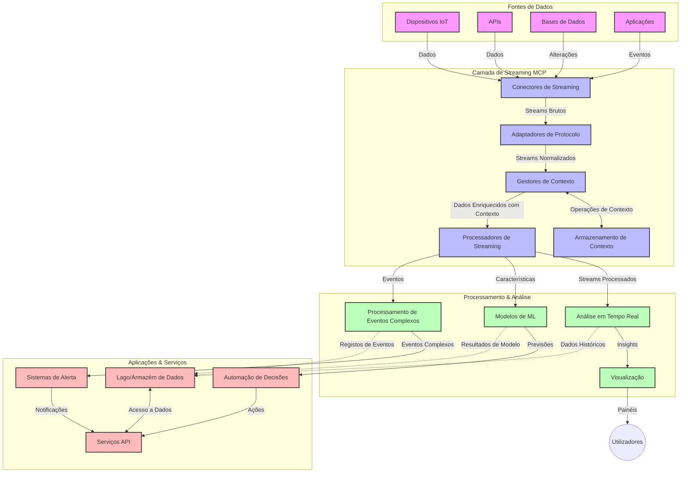

# Protocolo de Contexto de Modelo para Streaming de Dados em Tempo Real

## Visão Geral

O streaming de dados em tempo real tornou-se essencial no mundo orientado por dados de hoje, onde empresas e aplicações necessitam de acesso imediato à informação para tomar decisões atempadas. O Protocolo de Contexto de Modelo (MCP) representa um avanço significativo na otimização destes processos de streaming em tempo real, aumentando a eficiência do processamento de dados, mantendo a integridade contextual e melhorando o desempenho geral do sistema.

Este módulo explora como o MCP transforma o streaming de dados em tempo real fornecendo uma abordagem normalizada para a gestão de contexto entre modelos de IA, plataformas de streaming e aplicações.

## Introdução ao Streaming de Dados em Tempo Real

O streaming de dados em tempo real é um paradigma tecnológico que permite a transferência, processamento e análise contínua de dados à medida que são gerados, permitindo que os sistemas reajam imediatamente a novas informações. Ao contrário do processamento batch tradicional que opera em conjuntos de dados estáticos, o streaming processa dados em movimento, fornecendo insights e ações com latência mínima.

### Conceitos Fundamentais do Streaming de Dados em Tempo Real:

- **Fluxo Contínuo de Dados**: Dados são processados como um fluxo contínuo e interminável de eventos ou registos.
- **Processamento de Baixa Latência**: Os sistemas são desenhados para minimizar o tempo entre a geração e o processamento dos dados.
- **Escalabilidade**: As arquiteturas de streaming devem lidar com volumes e velocidades de dados variáveis.
- **Tolerância a Falhas**: Os sistemas precisam ser resilientes contra falhas para garantir fluxo de dados ininterrupto.
- **Processamento Stateful**: Manter o contexto ao longo dos eventos é crucial para uma análise significativa.

### O Protocolo de Contexto de Modelo e Streaming em Tempo Real

O Protocolo de Contexto de Modelo (MCP) aborda vários desafios críticos em ambientes de streaming em tempo real:

1. **Continuidade Contextual**: O MCP normaliza como o contexto é mantido entre componentes de streaming distribuídos, garantindo que os modelos de IA e nós de processamento tenham acesso a contextos históricos e ambientais relevantes.

2. **Gestão Eficiente de Estado**: Ao fornecer mecanismos estruturados para transmissão de contexto, o MCP reduz a sobrecarga da gestão de estado em pipelines de streaming.

3. **Interoperabilidade**: O MCP cria uma linguagem comum para partilha de contexto entre diversas tecnologias de streaming e modelos de IA, permitindo arquiteturas mais flexíveis e extensíveis.

4. **Contexto Otimizado para Streaming**: Implementações do MCP podem priorizar quais elementos de contexto são mais relevantes para a tomada de decisões em tempo real, otimizando tanto o desempenho quanto a precisão.

5. **Processamento Adaptativo**: Com a gestão adequada de contexto via MCP, sistemas de streaming podem ajustar dinamicamente o processamento com base em condições e padrões evolutivos nos dados.

Em aplicações modernas, desde redes de sensores IoT até plataformas financeiras de trading, a integração do MCP com tecnologias de streaming permite um processamento mais inteligente, consciente do contexto, capaz de responder adequadamente a situações complexas e em evolução em tempo real.

## Objetivos de Aprendizagem

No final desta aula, será capaz de:

- Compreender os fundamentos do streaming de dados em tempo real e os seus desafios
- Explicar como o Protocolo de Contexto de Modelo (MCP) melhora o streaming de dados em tempo real
- Implementar soluções de streaming baseadas em MCP utilizando frameworks populares como Kafka e Pulsar
- Projetar e implementar arquiteturas de streaming tolerantes a falhas e de alto desempenho com MCP
- Aplicar os conceitos de MCP em casos de uso relacionados com IoT, trading financeiro e análises orientadas por IA
- Avaliar tendências emergentes e inovações futuras em tecnologias de streaming baseadas em MCP


### Definição e Significado

O streaming de dados em tempo real envolve a geração, processamento e entrega contínuos de dados com latência mínima. Ao contrário do processamento por lotes, onde os dados são coletados e processados em grupos, os dados de streaming são processados incrementalmente à medida que chegam, possibilitando insights e ações imediatas.

As características chave do streaming de dados em tempo real incluem:

- **Baixa Latência**: Processar e analisar dados em milissegundos a segundos
- **Fluxo Contínuo**: Fluxos ininterruptos de dados provenientes de várias fontes
- **Processamento Imediato**: Analisar dados conforme eles chegam, em vez de por lotes
- **Arquitetura Orientada a Eventos**: Responder a eventos assim que ocorrem

### Desafios no Streaming de Dados Tradicional

As abordagens tradicionais de streaming de dados enfrentam várias limitações:

1. **Perda de Contexto**: Dificuldade em manter o contexto entre sistemas distribuídos
2. **Problemas de Escalabilidade**: Dificuldades em escalar para lidar com dados de alto volume e velocidade
3. **Complexidade de Integração**: Problemas de interoperabilidade entre sistemas diferentes
4. **Gestão de Latência**: Equilibrar o throughput com o tempo de processamento
5. **Consistência dos Dados**: Garantir a precisão e completude dos dados ao longo do fluxo

## Compreendendo o Protocolo de Contexto de Modelo (MCP)

### O que é o MCP?

O Protocolo de Contexto de Modelo (MCP) é um protocolo de comunicação normalizado projetado para facilitar a interação eficiente entre modelos de IA e aplicações. No contexto do streaming de dados em tempo real, o MCP fornece um framework para:

- Preservar o contexto ao longo da pipeline de dados
- Normalizar formatos de troca de dados
- Otimizar a transmissão de grandes conjuntos de dados
- Melhorar a comunicação modelo a modelo e modelo a aplicação

### Componentes Centrais e Arquitetura

A arquitetura MCP para streaming em tempo real consiste em vários componentes chave:

1. **Gestores de Contexto**: Gerem e mantêm a informação contextual ao longo da pipeline de streaming
2. **Processadores de Stream**: Processam correntes de dados recebidas usando técnicas conscientes do contexto
3. **Adaptadores de Protocolo**: Convertem entre diferentes protocolos de streaming preservando o contexto
4. **Armazenamento de Contexto**: Armazenam e recuperam informações contextuais de forma eficiente
5. **Conectores de Streaming**: Ligam a várias plataformas de streaming (Kafka, Pulsar, Kinesis, etc.)



### Como o MCP Melhora o Tratamento de Dados em Tempo Real

O MCP resolve desafios tradicionais de streaming através de:

- **Integridade Contextual**: Mantém relações entre pontos de dados ao longo de toda a pipeline
- **Transmissão Otimizada**: Reduz redundâncias na troca de dados através da gestão inteligente de contexto
- **Interfaces Normalizadas**: Fornece APIs consistentes para os componentes de streaming
- **Redução de Latência**: Minimiza a sobrecarga de processamento através do manuseamento eficiente do contexto
- **Escalabilidade Melhorada**: Suporta escalabilidade horizontal preservando o contexto

## Integração e Implementação

Os sistemas de streaming de dados em tempo real requerem um desenho arquitetónico cuidadoso e implementação para manter tanto o desempenho quanto a integridade contextual. O Protocolo de Contexto de Modelo oferece uma abordagem normalizada para integrar modelos de IA e tecnologias de streaming, permitindo pipelines de processamento mais sofisticados e conscientes do contexto.

### Visão Geral da Integração do MCP em Arquiteturas de Streaming

Implementar o MCP em ambientes de streaming em tempo real envolve várias considerações principais:

1. **Serialização e Transporte de Contexto**: O MCP fornece mecanismos eficientes para codificar a informação contextual dentro dos pacotes de dados de streaming, garantindo que o contexto essencial siga os dados ao longo da pipeline de processamento. Inclui formatos de serialização padronizados otimizados para transporte em streaming.

2. **Processamento Stateful de Stream**: O MCP permite processamentos stateful mais inteligentes mantendo uma representação consistente do contexto entre os nós de processamento. Isto é particularmente valioso em arquiteturas de streaming distribuídas onde a gestão de estado é tradicionalmente desafiante.

3. **Tempo do Evento vs. Tempo de Processamento**: Implementações MCP em sistemas de streaming devem abordar o desafio comum de diferenciar entre quando os eventos ocorreram e quando são processados. O protocolo pode incorporar contexto temporal que preserva a semântica do tempo do evento.

4. **Gestão de Backpressure**: Ao padronizar o manuseamento do contexto, o MCP ajuda a gerir o backpressure em sistemas de streaming, permitindo que os componentes comuniquem as suas capacidades de processamento e ajustem o fluxo conforme necessário.

5. **Janela de Contexto e Agregação**: O MCP facilita operações sofisticadas de janelamento fornecendo representações estruturadas de contextos temporais e relacionais, permitindo agregações mais significativas ao longo de streams de eventos.

6. **Processamento Exactly-Once**: Em sistemas de streaming que requerem semânticas exactly-once, o MCP pode incorporar metadados de processamento para ajudar a rastrear e verificar o estado do processamento entre componentes distribuídos.

A implementação do MCP através de várias tecnologias de streaming cria uma abordagem unificada para a gestão de contexto, reduzindo a necessidade de código de integração personalizado e fortalecendo a capacidade do sistema de manter contexto significativo conforme os dados fluem pela pipeline.

### MCP em Diversos Frameworks de Streaming de Dados

Estes exemplos seguem a especificação atual do MCP que se foca num protocolo baseado em JSON-RPC com mecanismos de transporte distintos. O código demonstra como pode implementar transportes personalizados que integrem plataformas de streaming como Kafka e Pulsar mantendo a total compatibilidade com o protocolo MCP.

Os exemplos destinam-se a mostrar como as plataformas de streaming podem ser integradas com o MCP para fornecer processamento de dados em tempo real enquanto preservam a consciência contextual que é central no MCP. Esta abordagem garante que os exemplos de código refletem fielmente o estado atual da especificação MCP em junho de 2025.

O MCP pode ser integrado com frameworks de streaming populares incluindo:

#### Integração Apache Kafka

```python
import asyncio
import json
from typing import Dict, Any, Optional
from confluent_kafka import Consumer, Producer, KafkaError
from mcp.client import Client, ClientCapabilities
from mcp.core.message import JsonRpcMessage
from mcp.core.transports import Transport

# Classe de transporte personalizada para ligar o MCP ao Kafka
class KafkaMCPTransport(Transport):
    def __init__(self, bootstrap_servers: str, input_topic: str, output_topic: str):
        self.bootstrap_servers = bootstrap_servers
        self.input_topic = input_topic
        self.output_topic = output_topic
        self.producer = Producer({'bootstrap.servers': bootstrap_servers})
        self.consumer = Consumer({
            'bootstrap.servers': bootstrap_servers,
            'group.id': 'mcp-client-group',
            'auto.offset.reset': 'earliest'
        })
        self.message_queue = asyncio.Queue()
        self.running = False
        self.consumer_task = None
        
    async def connect(self):
        """Connect to Kafka and start consuming messages"""
        self.consumer.subscribe([self.input_topic])
        self.running = True
        self.consumer_task = asyncio.create_task(self._consume_messages())
        return self
        
    async def _consume_messages(self):
        """Background task to consume messages from Kafka and queue them for processing"""
        while self.running:
            try:
                msg = self.consumer.poll(1.0)
                if msg is None:
                    await asyncio.sleep(0.1)
                    continue
                
                if msg.error():
                    if msg.error().code() == KafkaError._PARTITION_EOF:
                        continue
                    print(f"Consumer error: {msg.error()}")
                    continue
                
                # Analisar o valor da mensagem como JSON-RPC
                try:
                    message_str = msg.value().decode('utf-8')
                    message_data = json.loads(message_str)
                    mcp_message = JsonRpcMessage.from_dict(message_data)
                    await self.message_queue.put(mcp_message)
                except Exception as e:
                    print(f"Error parsing message: {e}")
            except Exception as e:
                print(f"Error in consumer loop: {e}")
                await asyncio.sleep(1)
    
    async def read(self) -> Optional[JsonRpcMessage]:
        """Read the next message from the queue"""
        try:
            message = await self.message_queue.get()
            return message
        except Exception as e:
            print(f"Error reading message: {e}")
            return None
    
    async def write(self, message: JsonRpcMessage) -> None:
        """Write a message to the Kafka output topic"""
        try:
            message_json = json.dumps(message.to_dict())
            self.producer.produce(
                self.output_topic,
                message_json.encode('utf-8'),
                callback=self._delivery_report
            )
            self.producer.poll(0)  # Disparar callbacks
        except Exception as e:
            print(f"Error writing message: {e}")
    
    def _delivery_report(self, err, msg):
        """Kafka producer delivery callback"""
        if err is not None:
            print(f'Message delivery failed: {err}')
        else:
            print(f'Message delivered to {msg.topic()} [{msg.partition()}]')
    
    async def close(self) -> None:
        """Close the transport"""
        self.running = False
        if self.consumer_task:
            self.consumer_task.cancel()
            try:
                await self.consumer_task
            except asyncio.CancelledError:
                pass
        self.consumer.close()
        self.producer.flush()

# Exemplo de utilização do transporte Kafka MCP
async def kafka_mcp_example():
    # Criar cliente MCP com transporte Kafka
    client = Client(
        {"name": "kafka-mcp-client", "version": "1.0.0"},
        ClientCapabilities({})
    )
    
    # Criar e ligar o transporte Kafka
    transport = KafkaMCPTransport(
        bootstrap_servers="localhost:9092",
        input_topic="mcp-responses",
        output_topic="mcp-requests"
    )
    
    await client.connect(transport)
    
    try:
        # Inicializar a sessão MCP
        await client.initialize()
        
        # Exemplo de execução de uma ferramenta via MCP
        response = await client.execute_tool(
            "process_data",
            {
                "data": "sample data",
                "metadata": {
                    "source": "sensor-1",
                    "timestamp": "2025-06-12T10:30:00Z"
                }
            }
        )
        
        print(f"Tool execution response: {response}")
        
        # Fecho limpo
        await client.shutdown()
    finally:
        await transport.close()

# Executar o exemplo
if __name__ == "__main__":
    asyncio.run(kafka_mcp_example())
```

#### Implementação Apache Pulsar

```python
import asyncio
import json
import pulsar
from typing import Dict, Any, Optional
from mcp.core.message import JsonRpcMessage
from mcp.core.transports import Transport
from mcp.server import Server, ServerOptions
from mcp.server.tools import Tool, ToolExecutionContext, ToolMetadata

# Criar um transporte MCP personalizado que utilize Pulsar
class PulsarMCPTransport(Transport):
    def __init__(self, service_url: str, request_topic: str, response_topic: str):
        self.service_url = service_url
        self.request_topic = request_topic
        self.response_topic = response_topic
        self.client = pulsar.Client(service_url)
        self.producer = self.client.create_producer(response_topic)
        self.consumer = self.client.subscribe(
            request_topic,
            "mcp-server-subscription",
            consumer_type=pulsar.ConsumerType.Shared
        )
        self.message_queue = asyncio.Queue()
        self.running = False
        self.consumer_task = None
    
    async def connect(self):
        """Connect to Pulsar and start consuming messages"""
        self.running = True
        self.consumer_task = asyncio.create_task(self._consume_messages())
        return self
    
    async def _consume_messages(self):
        """Background task to consume messages from Pulsar and queue them for processing"""
        while self.running:
            try:
                # Recepção não bloqueante com tempo limite
                msg = self.consumer.receive(timeout_millis=500)
                
                # Processar a mensagem
                try:
                    message_str = msg.data().decode('utf-8')
                    message_data = json.loads(message_str)
                    mcp_message = JsonRpcMessage.from_dict(message_data)
                    await self.message_queue.put(mcp_message)
                    
                    # Confirmar a mensagem
                    self.consumer.acknowledge(msg)
                except Exception as e:
                    print(f"Error processing message: {e}")
                    # Negar confirmação se houver um erro
                    self.consumer.negative_acknowledge(msg)
            except Exception as e:
                # Tratar tempo limite ou outras exceções
                await asyncio.sleep(0.1)
    
    async def read(self) -> Optional[JsonRpcMessage]:
        """Read the next message from the queue"""
        try:
            message = await self.message_queue.get()
            return message
        except Exception as e:
            print(f"Error reading message: {e}")
            return None
    
    async def write(self, message: JsonRpcMessage) -> None:
        """Write a message to the Pulsar output topic"""
        try:
            message_json = json.dumps(message.to_dict())
            self.producer.send(message_json.encode('utf-8'))
        except Exception as e:
            print(f"Error writing message: {e}")
    
    async def close(self) -> None:
        """Close the transport"""
        self.running = False
        if self.consumer_task:
            self.consumer_task.cancel()
            try:
                await self.consumer_task
            except asyncio.CancelledError:
                pass
        self.consumer.close()
        self.producer.close()
        self.client.close()

# Definir uma ferramenta MCP de exemplo que processa dados em streaming
@Tool(
    name="process_streaming_data",
    description="Process streaming data with context preservation",
    metadata=ToolMetadata(
        required_capabilities=["streaming"]
    )
)
async def process_streaming_data(
    ctx: ToolExecutionContext,
    data: str,
    source: str,
    priority: str = "medium"
) -> Dict[str, Any]:
    """
    Process streaming data while preserving context
    
    Args:
        ctx: Tool execution context
        data: The data to process
        source: The source of the data
        priority: Priority level (low, medium, high)
        
    Returns:
        Dict containing processed results and context information
    """
    # Processamento de exemplo que aproveita o contexto MCP
    print(f"Processing data from {source} with priority {priority}")
    
    # Aceder ao contexto da conversa do MCP
    conversation_id = ctx.conversation_id if hasattr(ctx, 'conversation_id') else "unknown"
    
    # Retornar resultados com contexto melhorado
    return {
        "processed_data": f"Processed: {data}",
        "context": {
            "conversation_id": conversation_id,
            "source": source,
            "priority": priority,
            "processing_timestamp": ctx.get_current_time_iso()
        }
    }

# Implementação de exemplo do servidor MCP usando transporte Pulsar
async def run_mcp_server_with_pulsar():
    # Criar servidor MCP
    server = Server(
        {"name": "pulsar-mcp-server", "version": "1.0.0"},
        ServerOptions(
            capabilities={"streaming": True}
        )
    )
    
    # Registar a nossa ferramenta
    server.register_tool(process_streaming_data)
    
    # Criar e conectar o transporte Pulsar
    transport = PulsarMCPTransport(
        service_url="pulsar://localhost:6650",
        request_topic="mcp-requests",
        response_topic="mcp-responses"
    )
    
    try:
        # Iniciar o servidor com o transporte Pulsar
        await server.run(transport)
    finally:
        await transport.close()

# Executar o servidor
if __name__ == "__main__":
    asyncio.run(run_mcp_server_with_pulsar())
```

### Melhores Práticas para Implementação

Ao implementar o MCP para streaming em tempo real:

1. **Desenhar para Tolerância a Falhas**:
   - Implementar uma manipulação adequada de erros
   - Usar dead-letter queues para mensagens falhadas
   - Desenhar processadores idempotentes

2. **Otimizar para Desempenho**:
   - Configurar tamanhos adequados de buffers
   - Usar batching onde apropriado
   - Implementar mecanismos de backpressure

3. **Monitorizar e Observar**:
   - Acompanhar métricas de processamento de streams
   - Monitorizar a propagação do contexto
   - Configurar alertas para anomalias

4. **Garantir a Segurança dos Streams**:
   - Implementar cifragem para dados sensíveis
   - Usar autenticação e autorização
   - Aplicar controles de acesso apropriados


### MCP em IoT e Computação de Borda

O MCP melhora o streaming em IoT por:

- Preservar o contexto do dispositivo ao longo da pipeline de processamento
- Permitir streaming eficiente de dados da borda para a nuvem
- Suportar análises em tempo real nos streams de dados IoT
- Facilitar a comunicação dispositivo a dispositivo com contexto

Exemplo: Redes de Sensores para Cidades Inteligentes
```
Sensors → Edge Gateways → MCP Stream Processors → Real-time Analytics → Automated Responses
```

### Papel em Transações Financeiras e Trading de Alta Frequência

O MCP oferece vantagens significativas para streaming de dados financeiros:

- Processamento de latência ultra-baixa para decisões de trading
- Manutenção do contexto de transação durante o processamento
- Suporte a processamento complexo de eventos com consciência contextual
- Garantia de consistência dos dados em sistemas de trading distribuídos

### Melhoria da Análise de Dados Orientada por IA

O MCP cria novas possibilidades para análise de streaming:

- Treino e inferência de modelos em tempo real
- Aprendizagem contínua a partir de dados em streaming
- Extração de características consciente do contexto
- Pipelines de inferência multi-modelo com contexto preservado

## Tendências Futuras e Inovações

### Evolução do MCP em Ambientes em Tempo Real

Olhando para o futuro, prevemos que o MCP evoluirá para abordar:

- **Integração com Computação Quântica**: Preparação para sistemas de streaming baseados em computação quântica
- **Processamento Nativo na Borda**: Transferir mais processamento consciente do contexto para dispositivos de borda
- **Gestão Autónoma de Streams**: Pipelines de streaming auto-otimizáveis
- **Streaming Federado**: Processamento distribuído mantendo a privacidade

### Avanços Potenciais em Tecnologia

Tecnologias emergentes que irão moldar o futuro do streaming MCP:

1. **Protocolos de Streaming Otimizados para IA**: Protocolos personalizados projetados especificamente para workloads de IA
2. **Integração com Computação Neuromórfica**: Computação inspirada no cérebro para processamento de streams
3. **Streaming Serverless**: Streaming escalável orientado por eventos sem gestão de infraestrutura
4. **Armazenamentos de Contexto Distribuídos**: Gestão de contexto altamente consistente e distribuída globalmente

## Exercícios Práticos

### Exercício 1: Configurar um Pipeline MCP Básico de Streaming

Neste exercício, aprenderá a:
- Configurar um ambiente básico de streaming MCP
- Implementar gestores de contexto para processamento de streams
- Testar e validar a preservação do contexto

### Exercício 2: Construir um Dashboard de Análise em Tempo Real

Crie uma aplicação completa que:
- Ingesta dados em streaming usando MCP
- Processa o stream mantendo o contexto
- Visualiza resultados em tempo real

### Exercício 3: Implementar Processamento Complexo de Eventos com MCP

Exercício avançado que cobre:
- Detecção de padrões em streams
- Correlação contextual entre múltiplos streams
- Geração de eventos complexos com contexto preservado

## Recursos Adicionais

- [Especificação do Protocolo de Contexto de Modelo](https://modelcontextprotocol.io) - Especificação oficial do MCP e documentação
- [Documentação Apache Kafka](https://kafka.apache.org/documentation/) - Aprenda sobre Kafka para processamento de streams
- [Apache Pulsar](https://pulsar.apache.org/) - Plataforma unificada de mensagens e streaming
- [Streaming Systems: The What, Where, When, and How of Large-Scale Data Processing](https://www.oreilly.com/library/view/streaming-systems/9781491983867/) - Livro abrangente sobre arquiteturas de streaming
- [Microsoft Azure Event Hubs](https://learn.microsoft.com/azure/event-hubs/event-hubs-about) - Serviço gerido de streaming de eventos
- [Documentação MLflow](https://mlflow.org/docs/latest/index.html) - Para rastreamento e deployment de modelos ML
- [Análise em Tempo Real com Apache Storm](https://storm.apache.org/releases/current/index.html) - Framework para computação em tempo real
- [Flink ML](https://nightlies.apache.org/flink/flink-ml-docs-master/) - Biblioteca de machine learning para Apache Flink
- [Documentação LangChain](https://python.langchain.com/docs/get_started/introduction) - Construção de aplicações com LLMs


## Resultados da Aprendizagem

Ao concluir este módulo, será capaz de:

- Compreender os fundamentos do streaming de dados em tempo real e os seus desafios
- Explicar como o Protocolo de Contexto de Modelo (MCP) melhora o streaming de dados em tempo real
- Implementar soluções de streaming baseadas em MCP utilizando frameworks populares como Kafka e Pulsar
- Projetar e implementar arquiteturas de streaming tolerantes a falhas e de alto desempenho com MCP
- Aplicar os conceitos de MCP em casos de uso relacionados com IoT, trading financeiro e análises orientadas por IA
- Avaliar tendências emergentes e inovações futuras em tecnologias de streaming baseadas em MCP

## O que vem a seguir 

- [5.11 Pesquisa em Tempo Real](../mcp-realtimesearch/README.md)

---

<!-- CO-OP TRANSLATOR DISCLAIMER START -->
**Aviso Legal**:
Este documento foi traduzido utilizando o serviço de tradução automática [Co-op Translator](https://github.com/Azure/co-op-translator). Embora nos esforcemos pela precisão, esteja ciente de que traduções automáticas podem conter erros ou imprecisões. O documento original na sua língua nativa deve ser considerado a fonte autorizada. Para informações críticas, recomenda-se tradução profissional humana. Não nos responsabilizamos por quaisquer mal-entendidos ou interpretações incorretas resultantes da utilização desta tradução.
<!-- CO-OP TRANSLATOR DISCLAIMER END -->