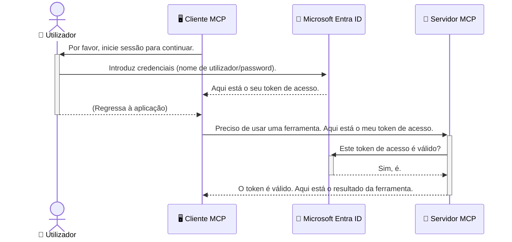

# Proteção dos Workflows de IA: Autenticação Entra ID para Servidores do Protocolo de Contexto do Modelo

## Introdução
Proteger o seu servidor do Protocolo de Contexto do Modelo (MCP) é tão importante quanto trancar a porta da frente da sua casa. Deixar o seu servidor MCP aberto expõe as suas ferramentas e dados a acessos não autorizados, o que pode levar a falhas de segurança. O Microsoft Entra ID fornece uma solução robusta de gestão de identidade e acesso baseada na nuvem, ajudando a garantir que apenas utilizadores e aplicações autorizados podem interagir com o seu servidor MCP. Nesta secção, irá aprender como proteger os seus workflows de IA usando autenticação Entra ID.

## Objetivos de Aprendizagem
No final desta secção, será capaz de:

- Compreender a importância de proteger servidores MCP.
- Explicar os fundamentos do Microsoft Entra ID e da autenticação OAuth 2.0.
- Reconhecer a diferença entre clientes públicos e confidenciais.
- Implementar autenticação Entra ID em cenários de servidor MCP local (cliente público) e remoto (cliente confidencial).
- Aplicar as melhores práticas de segurança ao desenvolver workflows de IA.

## Segurança e MCP

Assim como não deixaria a porta da frente da sua casa destrancada, não deve deixar o seu servidor MCP aberto para qualquer um aceder. Proteger os seus workflows de IA é essencial para construir aplicações robustas, fiáveis e seguras. Este capítulo irá apresentar-lhe o uso do Microsoft Entra ID para proteger os seus servidores MCP, garantindo que apenas utilizadores e aplicações autorizados podem interagir com as suas ferramentas e dados.

## Por Que a Segurança é Importante para Servidores MCP

Imagine que o seu servidor MCP tem uma ferramenta que pode enviar emails ou aceder a uma base de dados de clientes. Um servidor não seguro significaria que qualquer pessoa poderia potencialmente utilizar essa ferramenta, levando a acessos não autorizados a dados, spam ou outras atividades maliciosas.

Ao implementar a autenticação, assegura que cada pedido ao seu servidor é verificado, confirmando a identidade do utilizador ou aplicação que está a fazer o pedido. Este é o primeiro e mais crítico passo para proteger os seus workflows de IA.

## Introdução ao Microsoft Entra ID

[**Microsoft Entra ID**](https://adoption.microsoft.com/microsoft-security/entra/) é um serviço de gestão de identidade e acesso baseado na nuvem. Pense nele como um segurança universal para as suas aplicações. Trata do processo complexo de verificar as identidades dos utilizadores (autenticação) e determinar o que lhes é permitido fazer (autorização).

Ao usar o Entra ID, pode:

- Ativar login seguro para os utilizadores.
- Proteger APIs e serviços.
- Gerir políticas de acesso a partir de um local central.

Para servidores MCP, o Entra ID oferece uma solução robusta e amplamente confiável para gerir quem pode aceder às capacidades do seu servidor.

---

## Compreender a Magia: Como Funciona a Autenticação Entra ID

O Entra ID utiliza standards abertos como o **OAuth 2.0** para gerir a autenticação. Embora os detalhes possam ser complexos, o conceito principal é simples e pode ser compreendido com uma analogia.

### Uma Introdução Simples ao OAuth 2.0: A Chave do Estacionamento

Pense no OAuth 2.0 como um serviço de manobrista para o seu carro. Quando chega a um restaurante, não entrega ao manobrista a sua chave principal. Em vez disso, fornece uma **chave do manobrista** que tem permissões limitadas—pode ligar o carro e trancar as portas, mas não pode abrir o porta-bagagens nem o porta-luvas.

Nesta analogia:

- **Você** é o **Utilizador**.
- **O seu carro** é o **Servidor MCP** com as suas ferramentas e dados valiosos.
- O **Manobrista** é o **Microsoft Entra ID**.
- O **Atendente do estacionamento** é o **Cliente MCP** (a aplicação que tenta aceder ao servidor).
- A **Chave do Manobrista** é o **Token de Acesso**.

O token de acesso é uma cadeia segura de texto que o cliente MCP recebe do Entra ID após o seu login. O cliente apresenta então esse token ao servidor MCP a cada pedido. O servidor pode verificar o token para garantir que o pedido é legítimo e que o cliente tem as permissões necessárias, tudo isto sem nunca precisar de lidar com as suas credenciais reais (como a sua palavra-passe).

### O Fluxo de Autenticação

Veja como o processo funciona na prática:



### Apresentação da Microsoft Authentication Library (MSAL)

Antes de entrarmos no código, é importante apresentar um componente chave que verá nos exemplos: a **Microsoft Authentication Library (MSAL)**.

A MSAL é uma biblioteca desenvolvida pela Microsoft que torna muito mais fácil para os programadores lidarem com a autenticação. Em vez de ter que escrever todo o código complexo para gerir tokens de segurança, sessões de login e renovações, a MSAL trata de todo o trabalho pesado.

Usar uma biblioteca como a MSAL é altamente recomendado porque:

- **É Segura:** Implementa protocolos padrão da indústria e as melhores práticas de segurança, reduzindo o risco de vulnerabilidades no seu código.
- **Simplifica o Desenvolvimento:** Abstrai a complexidade dos protocolos OAuth 2.0 e OpenID Connect, permitindo adicionar autenticação robusta à sua aplicação com poucas linhas de código.
- **É Mantida:** A Microsoft mantém e atualiza ativamente a MSAL para lidar com novas ameaças de segurança e mudanças nas plataformas.

A MSAL suporta uma grande variedade de linguagens e frameworks de aplicação, incluindo .NET, JavaScript/TypeScript, Python, Java, Go e plataformas móveis como iOS e Android. Isto significa que pode usar os mesmos padrões consistentes de autenticação em toda a sua stack tecnológica.

Para saber mais sobre a MSAL, pode consultar a documentação oficial [MSAL overview](https://learn.microsoft.com/entra/identity-platform/msal-overview).

---

## Proteger o Seu Servidor MCP com Entra ID: Um Guia Passo a Passo

Agora, vamos percorrer o processo para proteger um servidor MCP local (que comunica via `stdio`) utilizando o Entra ID. Este exemplo usa um **cliente público**, adequado para aplicações que correm na máquina do utilizador, como uma aplicação de ambiente de trabalho ou um servidor local de desenvolvimento.

### Cenário 1: Proteger um Servidor MCP Local (com um Cliente Público)

Neste cenário, iremos analisar um servidor MCP que corre localmente, comunica via `stdio` e usa o Entra ID para autenticar o utilizador antes de permitir o acesso às suas ferramentas. O servidor terá uma única ferramenta que obtém a informação do perfil do utilizador a partir da API Microsoft Graph.

#### 1. Configurar a Aplicação no Entra ID

Antes de escrever código, precisa de registar a sua aplicação no Microsoft Entra ID. Isto informa o Entra ID sobre a sua aplicação e concede-lhe permissão para usar o serviço de autenticação.

1. Navegue até ao **[portal Microsoft Entra](https://entra.microsoft.com/)**.
2. Vá a **Registos de aplicações** e clique em **Novo registo**.
3. Dê um nome à sua aplicação (por exemplo, "Meu Servidor MCP Local").
4. Para **Tipos de contas suportados**, selecione **Contas neste diretório organizacional apenas**.
5. Pode deixar o **URI de redirecionamento** em branco para este exemplo.
6. Clique em **Registar**.

Depois de registada, anote o **ID da aplicação (cliente)** e o **ID do diretório (inquilino)**. Vai precisar destes no código.

#### 2. O Código: Uma Análise

Vamos ver as partes principais do código que lidam com a autenticação. O código completo deste exemplo está disponível na pasta [Entra ID - Local - WAM](https://github.com/Azure-Samples/mcp-auth-servers/tree/main/src/entra-id-local-wam) do repositório GitHub [mcp-auth-servers](https://github.com/Azure-Samples/mcp-auth-servers).

**`AuthenticationService.cs`**

Esta classe é responsável por gerir a interação com o Entra ID.

- **`CreateAsync`**: Este método inicializa o `PublicClientApplication` da MSAL (Microsoft Authentication Library). Está configurado com o `clientId` e `tenantId` da sua aplicação.
- **`WithBroker`**: Isto permite o uso de um broker (como o Windows Web Account Manager), que fornece uma experiência de login único mais segura e fluída.
- **`AcquireTokenAsync`**: Este é o método principal. Primeiro tenta obter um token silenciosamente (isto é, o utilizador não precisa de fazer login novamente se já tiver uma sessão válida). Se não for possível obter um token silencioso, o utilizador será solicitado a iniciar sessão de forma interativa.

```csharp
// Simplified for clarity
public static async Task<AuthenticationService> CreateAsync(ILogger<AuthenticationService> logger)
{
    var msalClient = PublicClientApplicationBuilder
        .Create(_clientId) // Your Application (client) ID
        .WithAuthority(AadAuthorityAudience.AzureAdMyOrg)
        .WithTenantId(_tenantId) // Your Directory (tenant) ID
        .WithBroker(new BrokerOptions(BrokerOptions.OperatingSystems.Windows))
        .Build();

    // ... cache registration ...

    return new AuthenticationService(logger, msalClient);
}

public async Task<string> AcquireTokenAsync()
{
    try
    {
        // Try silent authentication first
        var accounts = await _msalClient.GetAccountsAsync();
        var account = accounts.FirstOrDefault();

        AuthenticationResult? result = null;

        if (account != null)
        {
            result = await _msalClient.AcquireTokenSilent(_scopes, account).ExecuteAsync();
        }
        else
        {
            // If no account, or silent fails, go interactive
            result = await _msalClient.AcquireTokenInteractive(_scopes).ExecuteAsync();
        }

        return result.AccessToken;
    }
    catch (Exception ex)
    {
        _logger.LogError(ex, "An error occurred while acquiring the token.");
        throw; // Optionally rethrow the exception for higher-level handling
    }
}
```

**`Program.cs`**

Aqui é onde o servidor MCP é configurado e o serviço de autenticação é integrado.

- **`AddSingleton<AuthenticationService>`**: Regista o `AuthenticationService` no contentor de injeção de dependência, permitindo que outras partes da aplicação (como a nossa ferramenta) o possam usar.
- **Ferramenta `GetUserDetailsFromGraph`**: Esta ferramenta requer uma instância de `AuthenticationService`. Antes de fazer qualquer coisa, chama `authService.AcquireTokenAsync()` para obter um token de acesso válido. Se a autenticação for bem-sucedida, usa o token para chamar a Microsoft Graph API e obter os detalhes do utilizador.

```csharp
// Simplified for clarity
[McpServerTool(Name = "GetUserDetailsFromGraph")]
public static async Task<string> GetUserDetailsFromGraph(
    AuthenticationService authService)
{
    try
    {
        // This will trigger the authentication flow
        var accessToken = await authService.AcquireTokenAsync();

        // Use the token to create a GraphServiceClient
        var graphClient = new GraphServiceClient(
            new BaseBearerTokenAuthenticationProvider(new TokenProvider(authService)));

        var user = await graphClient.Me.GetAsync();

        return System.Text.Json.JsonSerializer.Serialize(user);
    }
    catch (Exception ex)
    {
        return $"Error: {ex.Message}";
    }
}
```

#### 3. Como Tudo Funciona em Conjunto

1. Quando o cliente MCP tenta usar a ferramenta `GetUserDetailsFromGraph`, esta chama primeiro `AcquireTokenAsync`.
2. `AcquireTokenAsync` desencadeia a biblioteca MSAL para verificar a existência de um token válido.
3. Se não houver token, a MSAL, através do broker, irá solicitar ao utilizador que inicie sessão com a sua conta Entra ID.
4. Depois do utilizador iniciar sessão, o Entra ID emite um token de acesso.
5. A ferramenta recebe o token e usa-o para fazer uma chamada segura à Microsoft Graph API.
6. Os detalhes do utilizador são devolvidos ao cliente MCP.

Este processo garante que apenas utilizadores autenticados podem usar a ferramenta, protegendo efetivamente o seu servidor MCP local.

### Cenário 2: Proteger um Servidor MCP Remoto (com um Cliente Confidencial)

Quando o seu servidor MCP está a correr numa máquina remota (como um servidor na nuvem) e comunica através de um protocolo como HTTP Streaming, os requisitos de segurança são diferentes. Neste caso, deve usar um **cliente confidencial** e o **Fluxo de Código de Autorização**. Este é um método mais seguro porque os segredos da aplicação nunca são expostos ao browser.

Este exemplo usa um servidor MCP baseado em TypeScript que usa Express.js para lidar com pedidos HTTP.

#### 1. Configurar a Aplicação no Entra ID

A configuração no Entra ID é semelhante ao cliente público, mas com uma diferença chave: precisa criar um **segredo de cliente**.

1. Navegue até ao **[portal Microsoft Entra](https://entra.microsoft.com/)**.
2. No registo da sua aplicação, vá ao separador **Certificados e segredos**.
3. Clique em **Novo segredo de cliente**, dê-lhe uma descrição e clique em **Adicionar**.
4. **Importante:** Copie imediatamente o valor do segredo. Não poderá vê-lo novamente.
5. Também precisa de configurar um **URI de redirecionamento**. Vá ao separador **Autenticação**, clique em **Adicionar uma plataforma**, selecione **Web** e insira o URI de redirecionamento da sua aplicação (por exemplo, `http://localhost:3001/auth/callback`).

> **⚠️ Nota Importante de Segurança:** Para aplicações em produção, a Microsoft recomenda vivamente usar métodos de autenticação **sem segredo**, como **Managed Identity** ou **Workload Identity Federation**, em vez de segredos de cliente. Segredos de cliente representam riscos de segurança porque podem ser expostos ou comprometidos. As identidades geridas fornecem uma abordagem mais segura, eliminando a necessidade de armazenar credenciais no seu código ou configuração.
>
> Para mais informações sobre identidades geridas e como implementá-las, veja a [Visão geral das identidades geridas para recursos Azure](https://learn.microsoft.com/entra/identity/managed-identities-azure-resources/overview).

#### 2. O Código: Uma Análise

Este exemplo usa uma abordagem baseada em sessão. Quando o utilizador autentica, o servidor armazena o token de acesso e o token de atualização numa sessão e fornece ao utilizador um token de sessão. Este token de sessão é então usado para pedidos subsequentes. O código completo deste exemplo está disponível na pasta [Entra ID - Cliente confidencial](https://github.com/Azure-Samples/mcp-auth-servers/tree/main/src/entra-id-cca-session) do repositório GitHub [mcp-auth-servers](https://github.com/Azure-Samples/mcp-auth-servers).

**`Server.ts`**

Este ficheiro configura o servidor Express e a camada de transporte MCP.

- **`requireBearerAuth`**: Middleware que protege os endpoints `/sse` e `/message`. Verifica se existe um token bearer válido no cabeçalho `Authorization` do pedido.
- **`EntraIdServerAuthProvider`**: Classe personalizada que implementa a interface `McpServerAuthorizationProvider`. Responsável por gerir o fluxo OAuth 2.0.
- **`/auth/callback`**: Este endpoint trata a redireção do Entra ID depois do utilizador se autenticar. Troca o código de autorização por um token de acesso e um token de atualização.

```typescript
// Simplificado para clareza
const app = express();
const { server } = createServer();
const provider = new EntraIdServerAuthProvider();

// Proteger o endpoint SSE
app.get("/sse", requireBearerAuth({
  provider,
  requiredScopes: ["User.Read"]
}), async (req, res) => {
  // ... ligar ao transporte ...
});

// Proteger o endpoint da mensagem
app.post("/message", requireBearerAuth({
  provider,
  requiredScopes: ["User.Read"]
}), async (req, res) => {
  // ... tratar a mensagem ...
});

// Tratar o callback OAuth 2.0
app.get("/auth/callback", (req, res) => {
  provider.handleCallback(req.query.code, req.query.state)
    .then(result => {
      // ... tratar sucesso ou falha ...
    });
});
```

**`Tools.ts`**

Este ficheiro define as ferramentas que o servidor MCP disponibiliza. A ferramenta `getUserDetails` é semelhante à do exemplo anterior, mas obtém o token de acesso da sessão.

```typescript
// Simplificado para maior clareza
server.setRequestHandler(CallToolRequestSchema, async (request) => {
  const { name } = request.params;
  const context = request.params?.context as { token?: string } | undefined;
  const sessionToken = context?.token;

  if (name === ToolName.GET_USER_DETAILS) {
    if (!sessionToken) {
      throw new AuthenticationError("Authentication token is missing or invalid. Ensure the token is provided in the request context.");
    }

    // Obter o token Entra ID da loja de sessão
    const tokenData = tokenStore.getToken(sessionToken);
    const entraIdToken = tokenData.accessToken;

    const graphClient = Client.init({
      authProvider: (done) => {
        done(null, entraIdToken);
      }
    });

    const user = await graphClient.api('/me').get();

    // ... devolver detalhes do utilizador ...
  }
});
```

**`auth/EntraIdServerAuthProvider.ts`**

Esta classe gere a lógica para:

- Redirecionar o utilizador para a página de login do Entra ID.
- Trocar o código de autorização por um token de acesso.
- Armazenar os tokens no `tokenStore`.
- Atualizar o token de acesso quando este expirar.

#### 3. Como Tudo Funciona em Conjunto

1. Quando um utilizador tenta conectar-se ao servidor MCP pela primeira vez, o middleware `requireBearerAuth` verifica que não existe uma sessão válida e redireciona para a página de login do Entra ID.
2. O utilizador inicia sessão com a sua conta Entra ID.
3. O Entra ID redireciona o utilizador de volta para o endpoint `/auth/callback` com um código de autorização.
4. O servidor troca o código por um token de acesso e um token de atualização, armazena-os e cria um token de sessão que é enviado ao cliente.
5. O cliente pode agora usar este token de sessão no cabeçalho `Authorization` para todas as futuras requisições ao servidor MCP.
6. Quando a ferramenta `getUserDetails` é chamada, ela usa o token de sessão para procurar o token de acesso Entra ID e depois usa esse token para chamar a API Microsoft Graph.

Este fluxo é mais complexo do que o fluxo do cliente público, mas é necessário para endpoints acessíveis pela internet. Como os servidores MCP remotos são acessíveis pela internet pública, eles precisam de medidas de segurança mais robustas para proteger contra acessos não autorizados e potenciais ataques.


## Melhores Práticas de Segurança

- **Usar sempre HTTPS**: Encriptar a comunicação entre o cliente e o servidor para proteger os tokens contra interceção.
- **Implementar Controlo de Acesso Baseado em Funções (RBAC)**: Não verifique apenas *se* um utilizador está autenticado; verifique *o que* ele está autorizado a fazer. Pode definir funções no Entra ID e verificá-las no seu servidor MCP.
- **Monitorizar e auditar**: Registe todos os eventos de autenticação para poder detetar e responder a atividades suspeitas.
- **Gerir limitação de taxa e controlo de congestionamento**: Microsoft Graph e outras APIs implementam limitação de taxa para prevenir abusos. Implemente lógica de recuo exponencial e tentativas no seu servidor MCP para lidar de forma adequada com respostas HTTP 429 (Demasiados pedidos). Considere armazenar em cache dados frequentemente acedidos para reduzir chamadas à API.
- **Armazenamento seguro de tokens**: Armazene os tokens de acesso e tokens de atualização de forma segura. Para aplicações locais, use os mecanismos de armazenamento seguro do sistema. Para aplicações servidoras, considere usar armazenamento encriptado ou serviços seguros de gestão de chaves como o Azure Key Vault.
- **Gestão da expiração dos tokens**: Os tokens de acesso têm uma vida limitada. Implemente a renovação automática dos tokens usando tokens de atualização para manter uma experiência de utilizador contínua sem exigir reautenticação.
- **Considere usar o Azure API Management**: Embora implementar a segurança diretamente no seu servidor MCP lhe dê controlo detalhado, gateways de API como o Azure API Management podem tratar muitas destas preocupações de segurança automaticamente, incluindo autenticação, autorização, limitação de taxa e monitorização. Eles fornecem uma camada centralizada de segurança que fica entre os seus clientes e os seus servidores MCP. Para mais detalhes sobre o uso de gateways de API com MCP, consulte o nosso artigo [Azure API Management Your Auth Gateway For MCP Servers](https://techcommunity.microsoft.com/blog/integrationsonazureblog/azure-api-management-your-auth-gateway-for-mcp-servers/4402690).


## Pontos-Chave

- A segurança do seu servidor MCP é crucial para proteger os seus dados e ferramentas.
- O Microsoft Entra ID oferece uma solução robusta e escalável para autenticação e autorização.
- Use um **cliente público** para aplicações locais e um **cliente confidencial** para servidores remotos.
- O **Authorization Code Flow** é a opção mais segura para aplicações web.


## Exercício

1. Pense num servidor MCP que poderia construir. Seria um servidor local ou remoto?
2. Com base na sua resposta, usaria um cliente público ou confidencial?
3. Que permissão o seu servidor MCP pediria para executar ações contra o Microsoft Graph?


## Exercícios Práticos

### Exercício 1: Registar uma aplicação no Entra ID
Navegue até ao portal Microsoft Entra.  
Registe uma nova aplicação para o seu servidor MCP.  
Anote o ID da Aplicação (cliente) e o ID do Diretório (inquilino).

### Exercício 2: Proteger um servidor MCP local (Cliente Público)
- Siga o exemplo de código para integrar o MSAL (Microsoft Authentication Library) para autenticação do utilizador.
- Teste o fluxo de autenticação chamando a ferramenta MCP que obtém detalhes do utilizador a partir do Microsoft Graph.

### Exercício 3: Proteger um servidor MCP remoto (Cliente Confidencial)
- Registe um cliente confidencial no Entra ID e crie um segredo de cliente.
- Configure o seu servidor MCP Express.js para usar o Authorization Code Flow.
- Teste os endpoints protegidos e confirme o acesso baseado em tokens.

### Exercício 4: Aplicar Melhores Práticas de Segurança
- Ative HTTPS para o seu servidor local ou remoto.
- Implemente controlo de acesso baseado em funções (RBAC) na lógica do seu servidor.
- Adicione gestão da expiração dos tokens e armazenamento seguro dos tokens.

## Recursos

1. **Documentação de Visão Geral do MSAL**  
   Saiba como a Microsoft Authentication Library (MSAL) permite a obtenção segura de tokens através de várias plataformas:  
   [MSAL Overview on Microsoft Learn](https://learn.microsoft.com/en-gb/entra/msal/overview)

2. **Repositório Azure-Samples/mcp-auth-servers no GitHub**  
   Implementações de referência de servidores MCP que demonstram fluxos de autenticação:  
   [Azure-Samples/mcp-auth-servers on GitHub](https://github.com/Azure-Samples/mcp-auth-servers)

3. **Visão Geral das Identidades Geridas para Recursos Azure**  
   Compreenda como eliminar segredos usando identidades geridas atribuídas pelo sistema ou pelo utilizador:  
   [Managed Identities Overview on Microsoft Learn](https://learn.microsoft.com/en-us/entra/identity/managed-identities-azure-resources/)

4. **Azure API Management: Seu Gateway de Autenticação para Servidores MCP**  
   Uma análise profunda sobre o uso do APIM como gateway OAuth2 seguro para servidores MCP:  
   [Azure API Management Your Auth Gateway For MCP Servers](https://techcommunity.microsoft.com/blog/integrationsonazureblog/azure-api-management-your-auth-gateway-for-mcp-servers/4402690)

5. **Referência de Permissões do Microsoft Graph**  
   Lista completa de permissões delegadas e de aplicação para o Microsoft Graph:  
   [Microsoft Graph Permissions Reference](https://learn.microsoft.com/zh-tw/graph/permissions-reference)


## Resultados da Aprendizagem
Após completar esta secção, será capaz de:

- Explicar por que a autenticação é crítica para servidores MCP e fluxos de trabalho de IA.
- Configurar e configurar a autenticação Entra ID tanto para cenários de servidor MCP local como remoto.
- Escolher o tipo apropriado de cliente (público ou confidencial) com base na implementação do seu servidor.
- Implementar práticas de codificação seguras, incluindo armazenamento de tokens e autorização baseada em funções.
- Proteger com confiança o seu servidor MCP e as suas ferramentas contra acesso não autorizado.

## O que vem a seguir

- [5.13 Integração do Protocolo de Contexto de Modelo (MCP) com o Microsoft Foundry](../mcp-foundry-agent-integration/README.md)

---

<!-- CO-OP TRANSLATOR DISCLAIMER START -->
**Aviso Legal**:
Este documento foi traduzido utilizando o serviço de tradução automática [Co-op Translator](https://github.com/Azure/co-op-translator). Embora nos esforcemos pela precisão, esteja ciente de que traduções automáticas podem conter erros ou imprecisões. O documento original na sua língua nativa deve ser considerado a fonte autorizada. Para informações críticas, recomenda-se tradução profissional humana. Não nos responsabilizamos por quaisquer mal-entendidos ou interpretações incorretas resultantes da utilização desta tradução.
<!-- CO-OP TRANSLATOR DISCLAIMER END -->