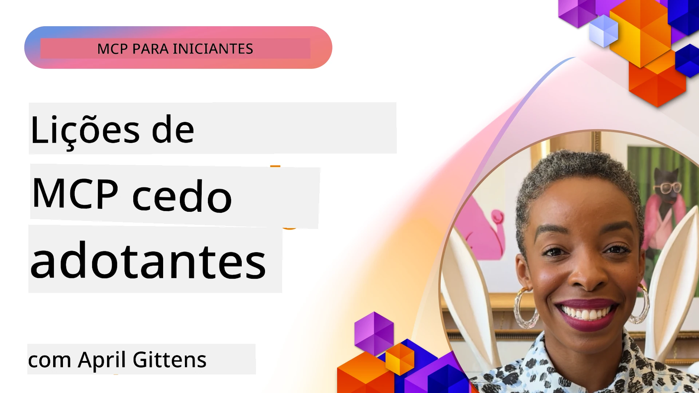

# 🌟 Lições de Pioneiros

[](https://youtu.be/jds7dSmNptE)

_(Clique na imagem acima para ver o vídeo desta lição)_

## 🎯 O Que Este Módulo Abrange

Este módulo explora como organizações e programadores reais estão a usar o Protocolo de Contexto do Modelo (MCP) para resolver desafios reais e impulsionar a inovação. Através de estudos de caso detalhados, projetos práticos e exemplos, irá descobrir como o MCP permite uma integração segura e escalável de IA que conecta modelos de linguagem, ferramentas e dados empresariais.

### 📚 Veja o MCP em Ação

Quer ver estes princípios aplicados a ferramentas prontas para produção? Consulte os nossos [**10 Servidores Microsoft MCP Que Estão a Transformar a Produtividade dos Programadores**](microsoft-mcp-servers.md), que apresentam servidores Microsoft MCP que pode usar hoje.

## Visão Geral

Esta lição explora como os pioneiros tiraram proveito do Protocolo de Contexto do Modelo (MCP) para resolver desafios do mundo real e impulsionar a inovação em várias indústrias. Através de estudos de caso detalhados e projetos práticos, irá ver como o MCP permite uma integração de IA padronizada, segura e escalável — conectando grandes modelos de linguagem, ferramentas e dados empresariais numa estrutura unificada. Vai adquirir experiência prática na conceção e construção de soluções baseadas em MCP, aprender a partir de padrões comprovados de implementação e descobrir as melhores práticas para implementar MCP em ambientes de produção. A lição destaca também tendências emergentes, direções futuras e recursos open-source para o ajudar a manter-se na vanguarda da tecnologia MCP e do seu ecossistema em evolução.

## Objetivos de Aprendizagem

- Analisar implementações MCP do mundo real em diferentes setores
- Conceber e construir aplicações completas baseadas em MCP
- Explorar tendências emergentes e direções futuras na tecnologia MCP
- Aplicar melhores práticas em cenários reais de desenvolvimento

## Implementações MCP do Mundo Real

### Estudo de Caso 1: Automação do Suporte ao Cliente Empresarial

Uma empresa multinacional implementou uma solução baseada em MCP para padronizar as interações de IA nos seus sistemas de suporte ao cliente. Isto permitiu-lhes:

- Criar uma interface unificada para múltiplos provedores LLM
- Manter uma gestão consistente de prompts entre departamentos
- Implementar controlos robustos de segurança e conformidade
- Alternar facilmente entre diferentes modelos de IA consoante necessidades específicas

**Implementação Técnica:**

```python
# Implementação do servidor MCP em Python para suporte ao cliente
import logging
import asyncio
from modelcontextprotocol import create_server, ServerConfig
from modelcontextprotocol.server import MCPServer
from modelcontextprotocol.transports import create_http_transport
from modelcontextprotocol.resources import ResourceDefinition
from modelcontextprotocol.prompts import PromptDefinition
from modelcontextprotocol.tool import ToolDefinition

# Configurar registo de eventos
logging.basicConfig(level=logging.INFO)

async def main():
    # Criar configuração do servidor
    config = ServerConfig(
        name="Enterprise Customer Support Server",
        version="1.0.0",
        description="MCP server for handling customer support inquiries"
    )
    
    # Inicializar o servidor MCP
    server = create_server(config)
    
    # Registar recursos da base de conhecimento
    server.resources.register(
        ResourceDefinition(
            name="customer_kb",
            description="Customer knowledge base documentation"
        ),
        lambda params: get_customer_documentation(params)
    )
    
    # Registar modelos de prompt
    server.prompts.register(
        PromptDefinition(
            name="support_template",
            description="Templates for customer support responses"
        ),
        lambda params: get_support_templates(params)
    )
    
    # Registar ferramentas de suporte
    server.tools.register(
        ToolDefinition(
            name="ticketing",
            description="Create and update support tickets"
        ),
        handle_ticketing_operations
    )
    
    # Iniciar servidor com transporte HTTP
    transport = create_http_transport(port=8080)
    await server.run(transport)

if __name__ == "__main__":
    asyncio.run(main())
```

**Resultados:** Redução de 30% nos custos dos modelos, melhoria de 45% na consistência das respostas e maior conformidade nas operações globais.

### Estudo de Caso 2: Assistente de Diagnóstico em Saúde

Um prestador de saúde desenvolveu uma infraestrutura MCP para integrar múltiplos modelos médicos especializados em IA, garantindo ao mesmo tempo que os dados sensíveis dos pacientes permanecessem protegidos:

- Alternância fluida entre modelos médicos generalistas e especialistas
- Controlo rigoroso da privacidade e registos de auditoria
- Integração com sistemas existentes de Registo Eletrónico de Saúde (EHR)
- Engenharia consistente de prompts para terminologia médica

**Implementação Técnica:**

```csharp
// C# MCP host application implementation in healthcare application
using Microsoft.Extensions.DependencyInjection;
using ModelContextProtocol.SDK.Client;
using ModelContextProtocol.SDK.Security;
using ModelContextProtocol.SDK.Resources;

public class DiagnosticAssistant
{
    private readonly MCPHostClient _mcpClient;
    private readonly PatientContext _patientContext;
    
    public DiagnosticAssistant(PatientContext patientContext)
    {
        _patientContext = patientContext;
        
        // Configure MCP client with healthcare-specific settings
        var clientOptions = new ClientOptions
        {
            Name = "Healthcare Diagnostic Assistant",
            Version = "1.0.0",
            Security = new SecurityOptions
            {
                Encryption = EncryptionLevel.Medical,
                AuditEnabled = true
            }
        };
        
        _mcpClient = new MCPHostClientBuilder()
            .WithOptions(clientOptions)
            .WithTransport(new HttpTransport("https://healthcare-mcp.example.org"))
            .WithAuthentication(new HIPAACompliantAuthProvider())
            .Build();
    }
    
    public async Task<DiagnosticSuggestion> GetDiagnosticAssistance(
        string symptoms, string patientHistory)
    {
        // Create request with appropriate resources and tool access
        var resourceRequest = new ResourceRequest
        {
            Name = "patient_records",
            Parameters = new Dictionary<string, object>
            {
                ["patientId"] = _patientContext.PatientId,
                ["requestingProvider"] = _patientContext.ProviderId
            }
        };
        
        // Request diagnostic assistance using appropriate prompt
        var response = await _mcpClient.SendPromptRequestAsync(
            promptName: "diagnostic_assistance",
            parameters: new Dictionary<string, object>
            {
                ["symptoms"] = symptoms,
                patientHistory = patientHistory,
                relevantGuidelines = _patientContext.GetRelevantGuidelines()
            });
            
        return DiagnosticSuggestion.FromMCPResponse(response);
    }
}
```

**Resultados:** Sugestões de diagnóstico melhoradas para os médicos, mantendo total conformidade HIPAA e uma redução significativa na mudança de contexto entre sistemas.

### Estudo de Caso 3: Análise de Risco em Serviços Financeiros

Uma instituição financeira implementou MCP para padronizar os seus processos de análise de risco em diferentes departamentos:

- Criou uma interface unificada para modelos de risco de crédito, deteção de fraude e risco de investimento
- Implementou controlos de acesso rigorosos e versionamento dos modelos
- Assegurou auditabilidade de todas as recomendações de IA
- Manteve formatação consistente de dados em sistemas diversos

**Implementação Técnica:**

```java
// Servidor Java MCP para avaliação de risco financeiro
import org.mcp.server.*;
import org.mcp.security.*;

public class FinancialRiskMCPServer {
    public static void main(String[] args) {
        // Criar servidor MCP com funcionalidades de conformidade financeira
        MCPServer server = new MCPServerBuilder()
            .withModelProviders(
                new ModelProvider("risk-assessment-primary", new AzureOpenAIProvider()),
                new ModelProvider("risk-assessment-audit", new LocalLlamaProvider())
            )
            .withPromptTemplateDirectory("./compliance/templates")
            .withAccessControls(new SOCCompliantAccessControl())
            .withDataEncryption(EncryptionStandard.FINANCIAL_GRADE)
            .withVersionControl(true)
            .withAuditLogging(new DatabaseAuditLogger())
            .build();
            
        server.addRequestValidator(new FinancialDataValidator());
        server.addResponseFilter(new PII_RedactionFilter());
        
        server.start(9000);
        
        System.out.println("Financial Risk MCP Server running on port 9000");
    }
}
```

**Resultados:** Conformidade regulatória reforçada, ciclos de implementação de modelos 40% mais rápidos e maior consistência na avaliação de risco entre departamentos.

### Estudo de Caso 4: Servidor MCP Playwright da Microsoft para Automação de Navegadores

A Microsoft desenvolveu o [servidor MCP Playwright](https://github.com/microsoft/playwright-mcp) para permitir automação de navegadores segura e padronizada através do Protocolo de Contexto do Modelo. Este servidor pronto para produção permite que agentes de IA e LLMs interajam com navegadores web de forma controlada, auditável e extensível — permitindo casos de uso como testes automáticos web, extração de dados e fluxos de trabalho end-to-end.

> **🎯 Ferramenta Pronta para Produção**
> 
> Este estudo de caso apresenta um servidor MCP real que pode usar hoje! Saiba mais sobre o Servidor Playwright MCP e outros 9 servidores Microsoft MCP prontos para produção no nosso [**Guia dos Servidores Microsoft MCP**](microsoft-mcp-servers.md#8--playwright-mcp-server).

**Funcionalidades Principais:**
- Expõe capacidades de automação do navegador (navegação, preenchimento de formulários, captura de ecrã, etc.) como ferramentas MCP
- Implementa controlos rigorosos de acesso e sandboxing para prevenir ações não autorizadas
- Fornece registos de auditoria detalhados para todas as interações com o navegador
- Suporta integração com Azure OpenAI e outros provedores LLM para automação comandada por agentes
- Alimenta o Agente de Codificação do GitHub Copilot com capacidades de navegação web

**Implementação Técnica:**

```typescript
// TypeScript: A registar ferramentas de automação do browser Playwright num servidor MCP
import { createServer, ToolDefinition } from 'modelcontextprotocol';
import { launch } from 'playwright';

const server = createServer({
  name: 'Playwright MCP Server',
  version: '1.0.0',
  description: 'MCP server for browser automation using Playwright'
});

// Registar uma ferramenta para navegar para uma URL e capturar uma captura de ecrã
server.tools.register(
  new ToolDefinition({
    name: 'navigate_and_screenshot',
    description: 'Navigate to a URL and capture a screenshot',
    parameters: {
      url: { type: 'string', description: 'The URL to visit' }
    }
  }),
  async ({ url }) => {
    const browser = await launch();
    const page = await browser.newPage();
    await page.goto(url);
    const screenshot = await page.screenshot();
    await browser.close();
    return { screenshot };
  }
);

// Iniciar o servidor MCP
server.listen(8080);
```

**Resultados:**

- Automação segura e programática do navegador para agentes de IA e LLMs
- Redução do esforço de testes manuais e melhoria da cobertura de testes para aplicações web
- Fornecimento de uma estrutura reutilizável e extensível para integração de ferramentas baseadas em navegador em ambientes empresariais
- Alimenta as capacidades de navegação web do GitHub Copilot

**Referências:**

- [Repositório GitHub do Servidor MCP Playwright](https://github.com/microsoft/playwright-mcp)
- [Soluções Microsoft AI e Automação](https://azure.microsoft.com/en-us/products/ai-services/)

### Estudo de Caso 5: Azure MCP – Protocolo de Contexto do Modelo Empresarial Como Serviço

O Azure MCP Server ([https://aka.ms/azmcp](https://aka.ms/azmcp)) é a implementação gerida e empresarial do Protocolo de Contexto do Modelo da Microsoft, projetada para oferecer capacidades escaláveis, seguras e conformes de servidor MCP como um serviço na cloud. O Azure MCP permite que organizações implementem rapidamente, geram e integrem servidores MCP com serviços Azure AI, dados e segurança, reduzindo o overhead operacional e acelerando a adoção de IA.

> **🎯 Ferramenta Pronta para Produção**
> 
> Este é um servidor MCP real que pode usar hoje! Saiba mais sobre o Servidor Microsoft Foundry MCP no nosso [**Guia dos Servidores Microsoft MCP**](microsoft-mcp-servers.md).

- Hosting totalmente gerido de servidores MCP com escalabilidade, monitorização e segurança integradas
- Integração nativa com Azure OpenAI, Azure AI Search e outros serviços Azure
- Autenticação e autorização empresarial via Microsoft Entra ID
- Suporte para ferramentas personalizadas, templates de prompts e conectores de recursos
- Conformidade com requisitos empresariais de segurança e regulamentação

**Implementação Técnica:**

```yaml
# Example: Azure MCP server deployment configuration (YAML)
apiVersion: mcp.microsoft.com/v1
kind: McpServer
metadata:
  name: enterprise-mcp-server
spec:
  modelProviders:
    - name: azure-openai
      type: AzureOpenAI
      endpoint: https://<your-openai-resource>.openai.azure.com/
      apiKeySecret: <your-azure-keyvault-secret>
  tools:
    - name: document_search
      type: AzureAISearch
      endpoint: https://<your-search-resource>.search.windows.net/
      apiKeySecret: <your-azure-keyvault-secret>
  authentication:
    type: EntraID
    tenantId: <your-tenant-id>
  monitoring:
    enabled: true
    logAnalyticsWorkspace: <your-log-analytics-id>
```

**Resultados:**  
- Redução do tempo até à valorização em projetos AI empresariais, fornecendo uma plataforma MCP pronta a usar e conforme
- Integração simplificada de LLMs, ferramentas e fontes de dados empresariais
- Segurança, observabilidade e eficiência operacional melhoradas para cargas de trabalho MCP
- Qualidade de código melhorada com as melhores práticas do Azure SDK e padrões atuais de autenticação

**Referências:**  
- [Documentação Azure MCP](https://aka.ms/azmcp)
- [Repositório GitHub do Azure MCP Server](https://github.com/Azure/azure-mcp)
- [Serviços Azure AI](https://azure.microsoft.com/en-us/products/ai-services/)
- [Centro Microsoft MCP](https://mcp.azure.com)

## Estudo de Caso 6: NLWeb  
MCP (Protocolo de Contexto do Modelo) é um protocolo emergente para Chatbots e assistentes de IA interagirem com ferramentas. Cada instância NLWeb é também um servidor MCP, que suporta um único método principal, ask, usado para colocar uma questão a um website em linguagem natural. A resposta devolvida utiliza schema.org, um vocabulário amplamente utilizado para descrever dados web. Grosso modo, MCP é para NLWeb como HTTP é para HTML. NLWeb combina protocolos, formatos Schema.org e código de exemplo para ajudar sites a criar rapidamente estes endpoints, beneficiando tanto humanos através de interfaces conversacionais como máquinas através de interação natural agente-a-agente.

Existem dois componentes distintos no NLWeb.  
- Um protocolo, muito simples para começar, para interagir com um site em linguagem natural e um formato, utilizando json e schema.org para a resposta devolvida. Veja a documentação da API REST para mais detalhes.  
- Uma implementação simples do (1) que aproveita a marcação existente, para sites que podem ser abstraídos como listas de itens (produtos, receitas, atrações, avaliações, etc.). Juntamente com um conjunto de widgets de interface de utilizador, os sites podem facilmente fornecer interfaces conversacionais ao seu conteúdo. Veja a documentação Life of a chat query para mais detalhes sobre este funcionamento.

**Referências:**  
- [Documentação Azure MCP](https://aka.ms/azmcp)  
- [NLWeb](https://github.com/microsoft/NlWeb)

### Estudo de Caso 7: Servidor Microsoft Foundry MCP – Integração de Agentes AI Empresariais

Os servidores Microsoft Foundry MCP demonstram como o MCP pode ser usado para orquestrar e gerir agentes de IA e fluxos de trabalho em ambientes empresariais. Ao integrar o MCP com o Microsoft Foundry, as organizações podem padronizar interações de agentes, aproveitar a gestão de fluxos de trabalho do Foundry e garantir implementações seguras e escaláveis.

> **🎯 Ferramenta Pronta para Produção**
> 
> Este é um servidor MCP real que pode usar hoje! Saiba mais sobre o Servidor Microsoft Foundry MCP no nosso [**Guia dos Servidores Microsoft MCP**](microsoft-mcp-servers.md#9--microsoft-foundry-mcp-server).

**Funcionalidades Principais:**
- Acesso abrangente ao ecossistema Azure AI, incluindo catálogos de modelos e gestão de implementação
- Indexação de conhecimento com Azure AI Search para aplicações RAG
- Ferramentas de avaliação para desempenho e garantia de qualidade de modelos AI
- Integração com Microsoft Foundry Catalog e Labs para modelos de investigação de ponta
- Capacidades de gestão e avaliação de agentes para cenários de produção

**Resultados:**
- Protótipos rápidos e monitorização robusta de fluxos de trabalho de agentes AI
- Integração fluida com serviços Azure AI para cenários avançados
- Interface unificada para construir, implementar e monitorizar pipelines de agentes
- Maior segurança, conformidade e eficiência operacional para empresas
- Adoção acelerada de IA mantendo controlo sobre processos complexos impulsionados por agentes

**Referências:**
- [Repositório GitHub do Servidor Microsoft Foundry MCP](https://github.com/azure-ai-foundry/mcp-foundry)
- [Integrar Agentes Azure AI com MCP (Blog Microsoft Foundry)](https://devblogs.microsoft.com/foundry/integrating-azure-ai-agents-mcp/)

### Estudo de Caso 8: Foundry MCP Playground – Experimentação e Prototipagem

O Foundry MCP Playground oferece um ambiente pronto a usar para experimentação com servidores MCP e integrações Microsoft Foundry. Os programadores podem prototipar, testar e avaliar rapidamente modelos AI e fluxos de trabalho de agentes usando recursos do Microsoft Foundry Catalog e Labs. O playground simplifica a configuração, fornece projetos de exemplo e suporta desenvolvimento colaborativo, facilitando a exploração de melhores práticas e novos cenários com sobrecarga mínima. É especialmente útil para equipas que querem validar ideias, partilhar experiências e acelerar a aprendizagem sem necessidade de infraestruturas complexas. Ao baixar a barreira à entrada, o playground fomenta a inovação e contribuições da comunidade no ecossistema MCP e Microsoft Foundry.

**Referências:**

- [Repositório GitHub do Foundry MCP Playground](https://github.com/azure-ai-foundry/foundry-mcp-playground)

### Estudo de Caso 9: Servidor Microsoft Learn Docs MCP – Acesso a Documentação com IA

O Servidor Microsoft Learn Docs MCP é um serviço hospedado na cloud que fornece assistentes de IA com acesso em tempo real à documentação oficial da Microsoft através do Protocolo de Contexto do Modelo. Este servidor pronto para produção liga-se ao abrangente ecossistema Microsoft Learn e permite pesquisa semântica em todas as fontes oficiais Microsoft.

> **🎯 Ferramenta Pronta para Produção**
> 
> Este é um servidor MCP real que pode usar hoje! Saiba mais sobre o Servidor Microsoft Learn Docs MCP no nosso [**Guia dos Servidores Microsoft MCP**](microsoft-mcp-servers.md#1--microsoft-learn-docs-mcp-server).

**Funcionalidades Principais:**
- Acesso em tempo real à documentação oficial Microsoft, documentação Azure e documentação Microsoft 365
- Capacidades avançadas de pesquisa semântica que compreendem contexto e intenção
- Informação sempre atualizada à medida que o conteúdo Microsoft Learn é publicado
- Cobertura abrangente pelo Microsoft Learn, documentação Azure e fontes Microsoft 365
- Devolve até 10 blocos de conteúdo de alta qualidade com títulos de artigos e URLs

**Por Que É Crítico:**
- Resolve o problema do "conhecimento IA desatualizado" para tecnologias Microsoft
- Garante que assistentes AI têm acesso às funcionalidades mais recentes do .NET, C#, Azure e Microsoft 365
- Fornece informação autorizada e oficial para geração precisa de código
- Essencial para programadores que trabalham com tecnologias Microsoft em rápida evolução

**Resultados:**
- Precisão drasticamente melhorada no código gerado por IA para tecnologias Microsoft
- Menos tempo gasto a procurar documentação atual e melhores práticas
- Produtividade do programador aumentada com recuperação de documentação contextualizada
- Integração fluida com workflows de desenvolvimento sem sair do IDE

**Referências:**
- [Repositório GitHub do Servidor Microsoft Learn Docs MCP](https://github.com/MicrosoftDocs/mcp)
- [Documentação Microsoft Learn](https://learn.microsoft.com/)

## Projetos Práticos

### Projeto 1: Construir um Servidor MCP Multi-Provedor

**Objetivo:** Criar um servidor MCP que consiga direcionar pedidos para múltiplos provedores de modelos AI com base em critérios específicos.

**Requisitos:**

- Suportar pelo menos três provedores de modelos diferentes (ex.: OpenAI, Anthropic, modelos locais)
- Implementar um mecanismo de roteamento baseado em metadados do pedido
- Criar um sistema de configuração para gerir credenciais dos provedores
- Adicionar cache para otimizar desempenho e custos
- Construir um dashboard simples para monitorização do uso

**Passos de Implementação:**

1. Configurar a infraestrutura básica do servidor MCP
2. Implementar adaptadores para cada serviço de modelo AI
3. Criar a lógica de roteamento baseada em atributos do pedido
4. Adicionar mecanismos de cache para pedidos frequentes
5. Desenvolver o dashboard de monitorização
6. Testar com vários padrões de pedido

**Tecnologias:** Pode escolher entre Python (.NET/Java/Python consoante preferência), Redis para cache, e um framework web simples para o dashboard.

### Projeto 2: Sistema Empresarial de Gestão de Prompts

**Objetivo:** Desenvolver um sistema baseado em MCP para gerir, versionar e implementar templates de prompts numa organização.

**Requisitos:**
- Criar um repositório centralizado para modelos de prompt
- Implementar versionamento e fluxos de aprovação
- Construir capacidades de teste de modelos com entradas de exemplo
- Desenvolver controlos de acesso baseados em funções
- Criar uma API para recuperação e implantação de modelos

**Passos de Implementação:**

1. Projetar o esquema da base de dados para armazenamento de modelos
2. Criar a API principal para operações CRUD de modelos
3. Implementar o sistema de versionamento
4. Construir o fluxo de aprovação
5. Desenvolver o framework de testes
6. Criar uma interface web simples para gestão
7. Integrar com um servidor MCP

**Tecnologias:** A sua escolha de framework backend, base de dados SQL ou NoSQL, e um framework frontend para a interface de gestão.

### Projeto 3: Plataforma de Geração de Conteúdo Baseada em MCP

**Objetivo:** Construir uma plataforma de geração de conteúdo que aproveite o MCP para fornecer resultados consistentes em diferentes tipos de conteúdo.

**Requisitos:**

- Suporte a múltiplos formatos de conteúdo (artigos de blog, redes sociais, textos de marketing)
- Implementar geração baseada em modelos com opções de personalização
- Criar um sistema de revisão e feedback de conteúdo
- Monitorizar métricas de desempenho do conteúdo
- Suportar versionamento e iteração de conteúdo

**Passos de Implementação:**

1. Configurar a infraestrutura do cliente MCP
2. Criar modelos para diferentes tipos de conteúdo
3. Construir o pipeline de geração de conteúdo
4. Implementar o sistema de revisão
5. Desenvolver o sistema de monitorização de métricas
6. Criar uma interface de utilizador para gestão de modelos e geração de conteúdo

**Tecnologias:** A sua linguagem de programação preferida, framework web e sistema de base de dados.

## Direções Futuras para a Tecnologia MCP

### Tendências Emergentes

1. **MCP Multi-Modal**
   - Expansão do MCP para padronizar interações com modelos de imagem, áudio e vídeo
   - Desenvolvimento de capacidades de raciocínio cross-modal
   - Formatos padronizados de prompt para diferentes modalidades

2. **Infraestrutura MCP Federada**
   - Redes MCP distribuídas que podem partilhar recursos entre organizações
   - Protocolos padronizados para partilha segura de modelos
   - Técnicas de computação que preservam a privacidade

3. **Mercados MCP**
   - Ecossistemas para partilha e monetização de modelos e plugins MCP
   - Processos de garantia de qualidade e certificação
   - Integração com mercados de modelos

4. **MCP para Computação na Periferia**
   - Adaptação dos standards MCP para dispositivos edge com recursos limitados
   - Protocolos otimizados para ambientes de baixa largura de banda
   - Implementações MCP especializadas para ecossistemas IoT

5. **Quadros Regulatórios**
   - Desenvolvimento de extensões MCP para conformidade regulatória
   - Registros de auditoria padronizados e interfaces de explicação
   - Integração com quadros emergentes de governação de IA

### Soluções MCP da Microsoft

A Microsoft e a Azure desenvolveram vários repositórios open-source para ajudar desenvolvedores a implementar MCP em vários cenários:

#### Organização Microsoft

1. [playwright-mcp](https://github.com/microsoft/playwright-mcp) - Servidor Playwright MCP para automatização e testes de browser
2. [files-mcp-server](https://github.com/microsoft/files-mcp-server) - Implementação do servidor MCP OneDrive para testes locais e contribuição comunitária
3. [NLWeb](https://github.com/microsoft/NlWeb) - NLWeb é uma coleção de protocolos abertos e ferramentas open source associadas. O foco principal é estabelecer uma camada foundational para a Web de IA

#### Organização Azure-Samples

1. [mcp](https://github.com/Azure-Samples/mcp) - Ligações para exemplos, ferramentas e recursos para construir e integrar servidores MCP na Azure usando várias linguagens
2. [mcp-auth-servers](https://github.com/Azure-Samples/mcp-auth-servers) - Servidores MCP de referência demonstrando autenticação com a especificação atual do Model Context Protocol
3. [remote-mcp-functions](https://github.com/Azure-Samples/remote-mcp-functions) - Página principal para implementações de servidores MCP remotos em Azure Functions com ligações para repositórios específicos por linguagem
4. [remote-mcp-functions-python](https://github.com/Azure-Samples/remote-mcp-functions-python) - Template quickstart para construir e implementar servidores MCP remotos customizados usando Azure Functions com Python
5. [remote-mcp-functions-dotnet](https://github.com/Azure-Samples/remote-mcp-functions-dotnet) - Template quickstart para construir e implementar servidores MCP remotos customizados usando Azure Functions com .NET/C#
6. [remote-mcp-functions-typescript](https://github.com/Azure-Samples/remote-mcp-functions-typescript) - Template quickstart para construir e implementar servidores MCP remotos customizados usando Azure Functions com TypeScript
7. [remote-mcp-apim-functions-python](https://github.com/Azure-Samples/remote-mcp-apim-functions-python) - Azure API Management como Gateway de IA para servidores MCP remotos usando Python
8. [AI-Gateway](https://github.com/Azure-Samples/AI-Gateway) - Experiências APIM ❤️ AI incluindo capacidades MCP, integrando com Azure OpenAI e AI Foundry

Estes repositórios fornecem várias implementações, modelos e recursos para trabalhar com o Model Context Protocol em diferentes linguagens de programação e serviços Azure. Cobrindo uma variedade de casos de uso desde implementações básicas de servidores a autenticação, implantação na cloud e cenários de integração empresarial.

#### Diretório de Recursos MCP

O [diretório MCP Resources](https://github.com/microsoft/mcp/tree/main/Resources) no repositório oficial Microsoft MCP oferece uma coleção selecionada de recursos de exemplo, modelos de prompt e definições de ferramentas para uso com servidores Model Context Protocol. Este diretório é projetado para ajudar desenvolvedores a começarem rapidamente com MCP, oferecendo blocos reutilizáveis e exemplos das melhores práticas para:

- **Modelos de Prompt:** Modelos de prompt prontos a usar para tarefas e cenários AI comuns, adaptáveis para as suas próprias implementações de servidor MCP.
- **Definições de Ferramentas:** Esquemas e metadados de ferramentas de exemplo para padronizar integração e invocação de ferramentas em diferentes servidores MCP.
- **Exemplos de Recursos:** Definições de recursos como exemplos para ligar a fontes de dados, APIs e serviços externos dentro do framework MCP.
- **Implementações de Referência:** Exemplos práticos que demonstram como estruturar e organizar recursos, prompts e ferramentas em projetos MCP reais.

Estes recursos aceleram o desenvolvimento, promovem a padronização e ajudam a garantir as melhores práticas ao construir e implementar soluções baseadas em MCP.

#### Diretório de Recursos MCP

- [MCP Resources (Modelos de Prompt, Ferramentas, e Definições de Recursos de Exemplo)](https://github.com/microsoft/mcp/tree/main/Resources)

### Oportunidades de Investigação

- Técnicas eficientes de otimização de prompt dentro de frameworks MCP
- Modelos de segurança para implementações MCP multi-inquilino
- Benchmarking de desempenho entre diferentes implementações MCP
- Métodos formais de verificação para servidores MCP

## Conclusão

O Model Context Protocol (MCP) está a moldar rapidamente o futuro da integração de IA padronizada, segura e interoperável em diversas indústrias. Através dos estudos de caso e projetos práticos nesta lição, viu como os primeiros adotantes — incluindo Microsoft e Azure — estão a utilizar o MCP para resolver desafios do mundo real, acelerar a adoção de IA e garantir conformidade, segurança e escalabilidade. A abordagem modular do MCP permite às organizações ligar grandes modelos de linguagem, ferramentas e dados empresariais num framework unificado e auditável. À medida que o MCP continua a evoluir, manter-se envolvido com a comunidade, explorar recursos open-source e aplicar as melhores práticas será essencial para construir soluções de IA robustas e preparadas para o futuro.

## Recursos Adicionais

- [Repositório MCP Foundry no GitHub](https://github.com/azure-ai-foundry/mcp-foundry)
- [Foundry MCP Playground](https://github.com/azure-ai-foundry/foundry-mcp-playground)
- [Integração de Agentes Azure AI com MCP (Blog Microsoft Foundry)](https://devblogs.microsoft.com/foundry/integrating-azure-ai-agents-mcp/)
- [Repositório MCP no GitHub (Microsoft)](https://github.com/microsoft/mcp)
- [Diretório MCP Resources (Modelos de Prompt, Ferramentas, e Definições de Recursos)](https://github.com/microsoft/mcp/tree/main/Resources)
- [Comunidade & Documentação MCP](https://modelcontextprotocol.io/introduction)
- [Especificação MCP (2025-11-25)](https://spec.modelcontextprotocol.io/specification/2025-11-25/)
- [Documentação Azure MCP](https://aka.ms/azmcp)
- [OWASP MCP Top 10](https://microsoft.github.io/mcp-azure-security-guide/mcp/) - Melhores práticas de segurança
- [Repositório Playwright MCP Server no GitHub](https://github.com/microsoft/playwright-mcp)
- [Files MCP Server (OneDrive)](https://github.com/microsoft/files-mcp-server)
- [Azure-Samples MCP](https://github.com/Azure-Samples/mcp)
- [MCP Auth Servers (Azure-Samples)](https://github.com/Azure-Samples/mcp-auth-servers)
- [Remote MCP Functions (Azure-Samples)](https://github.com/Azure-Samples/remote-mcp-functions)
- [Remote MCP Functions Python (Azure-Samples)](https://github.com/Azure-Samples/remote-mcp-functions-python)
- [Remote MCP Functions .NET (Azure-Samples)](https://github.com/Azure-Samples/remote-mcp-functions-dotnet)
- [Remote MCP Functions TypeScript (Azure-Samples)](https://github.com/Azure-Samples/remote-mcp-functions-typescript)
- [Remote MCP APIM Functions Python (Azure-Samples)](https://github.com/Azure-Samples/remote-mcp-apim-functions-python)
- [AI-Gateway (Azure-Samples)](https://github.com/Azure-Samples/AI-Gateway)
- [Soluções Microsoft de IA e Automação](https://azure.microsoft.com/en-us/products/ai-services/)

## Exercícios

1. Analise um dos estudos de caso e proponha uma abordagem alternativa de implementação.
2. Escolha uma das ideias de projeto e crie uma especificação técnica detalhada.
3. Pesquise uma indústria não abordada nos estudos de caso e esboce como o MCP poderia resolver os seus desafios específicos.
4. Explore uma das direções futuras e crie um conceito para uma nova extensão MCP que a suporte.

## O Que Vem a Seguir

Explore mais: [Microsoft MCP Servers](./microsoft-mcp-servers.md)

Continue para: [Módulo 8: Melhores Práticas](../08-BestPractices/README.md)

---

<!-- CO-OP TRANSLATOR DISCLAIMER START -->
**Aviso Legal**:
Este documento foi traduzido utilizando o serviço de tradução automática [Co-op Translator](https://github.com/Azure/co-op-translator). Embora nos esforcemos pela precisão, esteja ciente de que traduções automáticas podem conter erros ou imprecisões. O documento original na sua língua nativa deve ser considerado a fonte autorizada. Para informações críticas, recomenda-se tradução profissional humana. Não nos responsabilizamos por quaisquer mal-entendidos ou interpretações incorretas resultantes da utilização desta tradução.
<!-- CO-OP TRANSLATOR DISCLAIMER END -->