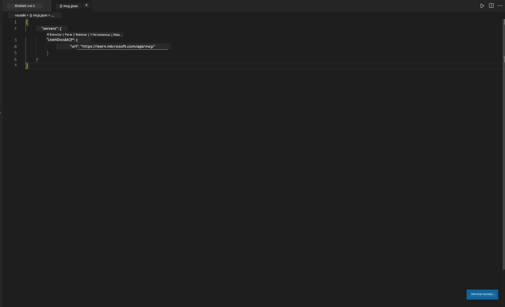
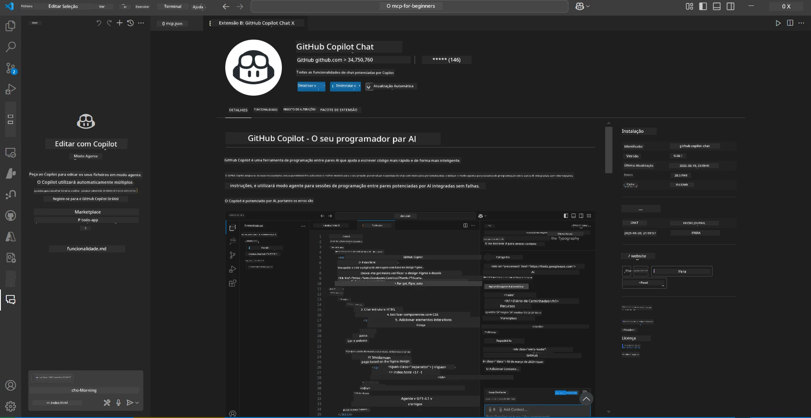
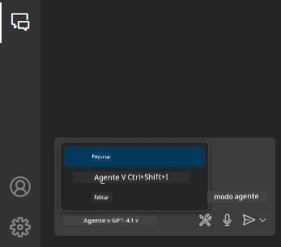
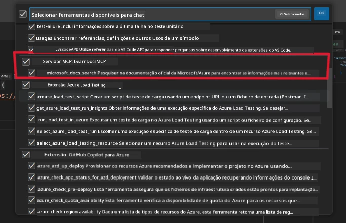
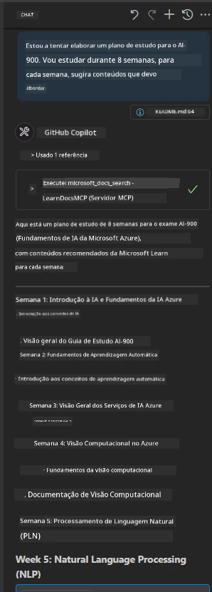
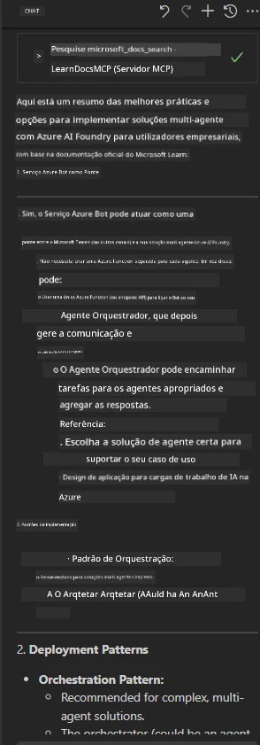

# Cenário 3: Documentação no Editor com Servidor MCP no VS Code

## Visão Geral

Neste cenário, você aprenderá como trazer a documentação Microsoft Learn diretamente para o seu ambiente Visual Studio Code usando o servidor MCP. Em vez de alternar constantemente entre abas do navegador para procurar documentação, pode aceder, pesquisar e referenciar documentação oficial diretamente no seu editor. Esta abordagem simplifica o seu fluxo de trabalho, mantém o foco e permite uma integração perfeita com ferramentas como o GitHub Copilot.

- Pesquise e leia documentação dentro do VS Code sem sair do seu ambiente de codificação.
- Referencie documentação e insira links diretamente no seu README ou arquivos de curso.
- Use o GitHub Copilot e MCP juntos para um fluxo de trabalho de documentação assistido por IA integrado.

## Objetivos de Aprendizagem

No final deste capítulo, você compreenderá como configurar e usar o servidor MCP dentro do VS Code para melhorar o seu fluxo de trabalho de documentação e desenvolvimento. Você será capaz de:

- Configurar o seu ambiente de trabalho para usar o servidor MCP para pesquisa de documentação.
- Pesquisar e inserir documentação diretamente dentro do VS Code.
- Combinar o poder do GitHub Copilot e MCP para um fluxo de trabalho mais produtivo e aumentado por IA.

Estas competências ajudarão a manter o foco, melhorar a qualidade da documentação e aumentar a sua produtividade como programador ou escritor técnico.

## Solução

Para obter acesso à documentação no editor, você seguirá uma série de passos que integram o servidor MCP com o VS Code e o GitHub Copilot. Esta solução é ideal para autores de cursos, escritores de documentação e programadores que querem manter o foco no editor enquanto trabalham com documentação e Copilot.

- Adicione rapidamente links de referência a um README enquanto escreve a documentação de um curso ou projeto.
- Use o Copilot para gerar código e o MCP para encontrar instantaneamente e citar documentação relevante.
- Mantenha o foco no seu editor e aumente a produtividade.

### Guia Passo a Passo

Para começar, siga estes passos. Para cada passo, pode adicionar uma captura de ecrã da pasta assets para ilustrar visualmente o processo.

1. **Adicione a configuração MCP:**  
   Na raiz do seu projeto, crie um ficheiro `.vscode/mcp.json` e adicione a seguinte configuração:  
   ```json
   {
     "servers": {
       "LearnDocsMCP": {
         "url": "https://learn.microsoft.com/api/mcp"
       }
     }
   }
   ```
   Esta configuração informa ao VS Code como se conectar ao [`Microsoft Learn Docs MCP server`](https://github.com/MicrosoftDocs/mcp).

   
    
2. **Abra o painel GitHub Copilot Chat:**  
   Se ainda não tiver a extensão GitHub Copilot instalada, vá à vista Extensões no VS Code e instale-a. Pode descarregá-la diretamente do [Visual Studio Code Marketplace](https://marketplace.visualstudio.com/items?itemName=GitHub.copilot-chat). Depois, abra o painel Copilot Chat na barra lateral.

   

3. **Ative o modo agente e verifique as ferramentas:**  
   No painel Copilot Chat, ative o modo agente.

   

   Depois de ativar o modo agente, verifique se o servidor MCP está listado como uma das ferramentas disponíveis. Isto assegura que o agente Copilot pode aceder ao servidor de documentação para obter informação relevante.
   
   
4. **Inicie um novo chat e faça perguntas ao agente:**  
   Abra um novo chat no painel Copilot Chat. Agora pode fazer perguntas ao agente sobre documentação. O agente usará o servidor MCP para obter e mostrar documentação relevante do Microsoft Learn diretamente no seu editor.

   - *"Estou a tentar escrever um plano de estudo para o tópico X. Vou estudá-lo durante 8 semanas, para cada semana, sugira conteúdo que devo abordar."*

   

5. **Consulta ao vivo:**

   > Vamos fazer uma consulta ao vivo a partir da secção [#get-help](https://discord.gg/D6cRhjHWSC) no Microsoft Foundry Discord ([ver mensagem original](https://discord.com/channels/1113626258182504448/1385498306720829572)):
   
   *"Procuro respostas sobre como implementar uma solução multi-agente com agentes de IA desenvolvidos na Azure AI Foundry. Vejo que não há método de implementação direto, como canais do Copilot Studio. Então, quais são as diferentes formas de fazer esta implementação para que utilizadores empresariais possam interagir e realizar o trabalho?  
Há vários artigos/blogues que dizem que podemos usar o serviço Azure Bot para fazer este trabalho, o que pode atuar como uma ponte entre MS Teams e os agentes Azure AI Foundry. Esta solução vai funcionar se eu configurar um bot Azure que se conecta ao agente Orchestrator na Azure AI Foundry via Azure Function para realizar a orquestração, ou preciso criar uma Azure Function para cada agente IA da solução multi-agente para fazer a orquestração no Bot Framework? Quaisquer outras sugestões são bem-vindas."*

   

   O agente responderá com links e sumários da documentação relevantes, que pode inserir diretamente nos seus ficheiros markdown ou usar como referências no seu código.
   
### Consultas de Exemplo

Aqui estão alguns exemplos de perguntas que pode experimentar. Estas consultas demonstram como o servidor MCP e o Copilot podem funcionar juntos para fornecer documentação e referências instantâneas e contextualizadas sem sair do VS Code:

- "Mostra-me como usar triggers nas Azure Functions."
- "Insere um link para a documentação oficial do Azure Key Vault."
- "Quais são as melhores práticas para proteger recursos Azure?"
- "Encontra um quickstart para serviços Azure AI."

Estas consultas demonstrarão como o servidor MCP e o Copilot podem funcionar juntos para fornecer documentação e referências instantâneas e contextualizadas sem sair do VS Code.

---

---

<!-- CO-OP TRANSLATOR DISCLAIMER START -->
**Aviso Legal**:
Este documento foi traduzido utilizando o serviço de tradução automática [Co-op Translator](https://github.com/Azure/co-op-translator). Embora nos esforcemos pela precisão, esteja ciente de que traduções automáticas podem conter erros ou imprecisões. O documento original na sua língua nativa deve ser considerado a fonte autorizada. Para informações críticas, recomenda-se tradução profissional humana. Não nos responsabilizamos por quaisquer mal-entendidos ou interpretações incorretas resultantes da utilização desta tradução.
<!-- CO-OP TRANSLATOR DISCLAIMER END -->