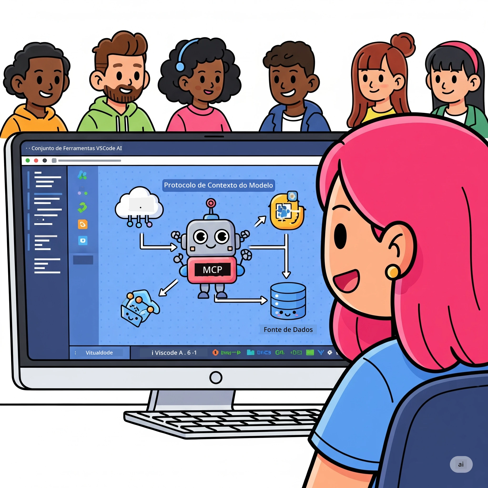
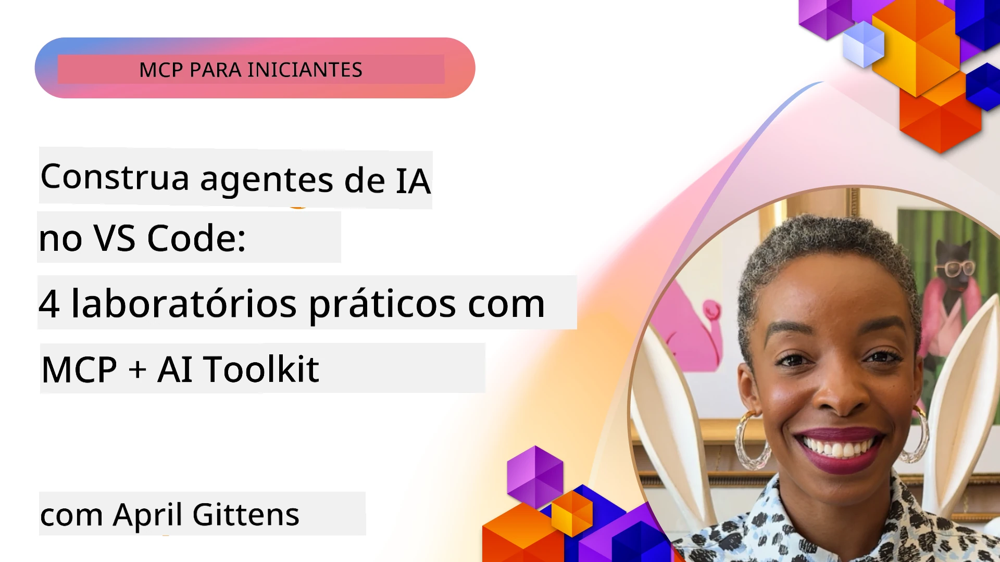

# Otimização de Fluxos de Trabalho de IA: Construção de um Servidor MCP com Microsoft Foundry Toolkit

## 🎯  Visão Geral

_(Clique na imagem acima para visualizar o vídeo desta lição)_

Bem-vindo ao **Workshop Model Context Protocol (MCP)**! Este workshop prático e abrangente combina duas tecnologias de ponta para revolucionar o desenvolvimento de aplicações de IA:

- **🔗 Model Context Protocol (MCP)**: Um padrão aberto para integração fluida de ferramentas de IA
- **🛠️ Extensão Microsoft Foundry Toolkit para VS Code**: A poderosa extensão de desenvolvimento de IA da Microsoft

### 🎓 O que Vai Aprender

No final deste workshop, dominará a arte de construir aplicações inteligentes que ligam modelos de IA a ferramentas e serviços do mundo real. Desde testes automatizados até integrações personalizadas de API, adquirirá competências práticas para resolver desafios empresariais complexos.

## 🏗️ Stack Tecnológico

### 🔌 Model Context Protocol (MCP)

O MCP é o **"USB-C para IA"** - um padrão universal que liga modelos de IA a ferramentas externas e fontes de dados.

**✨ Funcionalidades Principais:**

- 🔄 **Integração Padronizada**: Interface universal para ligações entre IA e ferramentas
- 🏛️ **Arquitetura Flexível**: Servidores locais e remotos via transporte stdio/SSE
- 🧰 **Ecossistema Rico**: Ferramentas, prompts e recursos num só protocolo
- 🔒 **Pronto para Empresas**: Segurança e fiabilidade integradas

**🎯 Porquê o MCP:**
Tal como o USB-C eliminou o caos dos cabos, o MCP elimina a complexidade das integrações de IA. Um protocolo, possibilidades infinitas.

### 🤖 Extensão Microsoft Foundry Toolkit para VS Code

A principal extensão de desenvolvimento de IA da Microsoft que transforma o VS Code numa potência de IA.

**🚀 Capacidades Principais:**

- 📦 **Catálogo de Modelos**: Acesso a modelos do Azure AI, GitHub, Hugging Face, Ollama
- ⚡ **Inferência Local**: Execução otimizada ONNX para CPU/GPU/NPU
- 🏗️ **Construtor de Agentes**: Desenvolvimento visual de agentes de IA com integração MCP
- 🎭 **Multi-Modal**: Suporte a texto, visão e saída estruturada

**💡 Benefícios para o Desenvolvimento:**

- Implantação de modelos sem configuração
- Engenharia visual de prompts
- Ambiente de testes em tempo real
- Integração fluida com servidores MCP

## 📚 Jornada de Aprendizagem

### [🚀 Módulo 1: Fundamentos do Microsoft Foundry Toolkit](./lab1/README.md)

**Duração**: 15 minutos

- 🛠️ Instalar e configurar o Microsoft Foundry Toolkit no VS Code
- 🗂️ Explorar o Catálogo de Modelos (mais de 100 modelos do GitHub, ONNX, OpenAI, Anthropic, Google)
- 🎮 Dominar o Playground Interativo para testes de modelos em tempo real
- 🤖 Construir o seu primeiro agente de IA com o Construtor de Agentes
- 📊 Avaliar o desempenho do modelo com métricas integradas (F1, relevância, similaridade, coerência)
- ⚡ Aprender processamento em lote e suporte multi-modal

**🎯 Resultado do Aprendizado**: Criar um agente de IA funcional com compreensão abrangente das capacidades do Microsoft Foundry Toolkit

### [🌐 Módulo 2: MCP com Fundamentos do Microsoft Foundry Toolkit](./lab2/README.md)

**Duração**: 20 minutos

- 🧠 Dominar a arquitetura e conceitos do Model Context Protocol (MCP)
- 🌐 Explorar o ecossistema de servidores MCP da Microsoft
- 🤖 Construir um agente de automação de navegador usando o servidor MCP Playwright
- 🔧 Integrar servidores MCP com o Construtor de Agentes do Microsoft Foundry Toolkit
- 📊 Configurar e testar ferramentas MCP nos seus agentes
- 🚀 Exportar e implementar agentes potenciados por MCP para produção

**🎯 Resultado do Aprendizado**: Implementar um agente de IA superpotenciado com ferramentas externas via MCP

### [🔧 Módulo 3: Desenvolvimento Avançado MCP com Microsoft Foundry Toolkit](./lab3/README.md)

**Duração**: 20 minutos

- 💻 Criar servidores MCP personalizados usando o Microsoft Foundry Toolkit
- 🐍 Configurar e usar a última versão do MCP Python SDK (v1.9.3)
- 🔍 Configurar e utilizar o MCP Inspector para depuração
- 🛠️ Construir um Servidor MCP de Meteorologia com fluxos de depuração profissionais
- 🧪 Depurar servidores MCP nos ambientes Agent Builder e Inspector

**🎯 Resultado do Aprendizado**: Desenvolver e depurar servidores MCP personalizados com ferramentas modernas

### [🐙 Módulo 4: Desenvolvimento Prático MCP – Servidor Clone do GitHub Personalizado](./lab4/README.md)

**Duração**: 30 minutos

- 🏗️ Construir um Servidor MCP Clone do GitHub para fluxos de trabalho de desenvolvimento reais
- 🔄 Implementar clonagem inteligente de repositórios com validação e tratamento de erros
- 📁 Criar gestão inteligente de diretórios e integração com VS Code
- 🤖 Usar o Modo Agente GitHub Copilot com ferramentas MCP personalizadas
- 🛡️ Aplicar fiabilidade pronta para produção e compatibilidade multiplataforma

**🎯 Resultado do Aprendizado**: Implementar um servidor MCP pronto para produção que otimiza fluxos reais de desenvolvimento

## 💡 Aplicações e Impacto no Mundo Real

### 🏢 Casos de Uso Empresariais

#### 🔄 Automação DevOps

Transforme o seu fluxo de trabalho de desenvolvimento com automação inteligente:

- **Gestão Inteligente de Repositórios**: Revisão de código e decisões de merge conduzidas por IA
- **CI/CD Inteligente**: Otimização automática de pipelines baseada em alterações de código
- **Triagem de Incidentes**: Classificação e atribuição automática de bugs

#### 🧪 Revolução em Garantia de Qualidade

Melhore testes com automação potenciada por IA:

- **Geração Inteligente de Testes**: Criação automática de suítes de testes abrangentes
- **Testes Visuais de Regressão**: Detecção de alterações UI por IA
- **Monitorização de Performance**: Identificação e resolução pró-ativa de problemas

#### 📊 Inteligência em Pipelines de Dados

Construa fluxos de processamento de dados mais inteligentes:

- **Processos ETL Adaptativos**: Transformações de dados auto-otimizadas
- **Deteção de Anomalias**: Monitorização da qualidade de dados em tempo real
- **Roteamento Inteligente**: Gestão inteligente do fluxo de dados

#### 🎧 Melhoria da Experiência do Cliente

Crie interações excecionais com os clientes:

- **Suporte Consciente do Contexto**: Agentes IA com acesso ao histórico dos clientes
- **Resolução Proativa de Problemas**: Serviço ao cliente preditivo
- **Integração Multicanal**: Experiência IA unificada através das plataformas

## 🛠️ Pré-requisitos e Configuração

### 💻 Requisitos do Sistema

| Componente | Requisito | Notas |
|-----------|-------------|-------|
| **Sistema Operativo** | Windows 10+, macOS 10.15+, Linux | Qualquer SO moderno |
| **Visual Studio Code** | Versão estável mais recente | Necessário para Microsoft Foundry Toolkit |
| **Node.js** | v18.0+ e npm | Para desenvolvimento de servidores MCP |
| **Python** | 3.10+ | Opcional para servidores MCP em Python |
| **Memória** | Mínimo 8GB RAM | Recomenda-se 16GB para modelos locais |

### 🔧 Ambiente de Desenvolvimento

#### Extensões Recomandadas para VS Code

- **Microsoft Foundry Toolkit** (ms-windows-ai-studio.windows-ai-studio)
- **Python** (ms-python.python)
- **Depurador Python** (ms-python.debugpy)
- **GitHub Copilot** (GitHub.copilot) - Opcional mas útil

#### Ferramentas Opcionais

- **uv**: Gestor moderno de pacotes Python
- **MCP Inspector**: Ferramenta visual de depuração para servidores MCP
- **Playwright**: Para exemplos de automação web

## 🎖️ Resultados de Aprendizagem e Caminho de Certificação

### 🏆 Checklist de Domínio de Competências

Ao completar este workshop, alcançará domínio em:

#### 🎯 Competências Centrais

- [ ] **Domínio do Protocolo MCP**: Compreensão profunda da arquitetura e padrões de implementação
- [ ] **Proficiência Microsoft Foundry Toolkit**: Uso experiente do Microsoft Foundry Toolkit para desenvolvimento rápido
- [ ] **Desenvolvimento de Servidores Personalizados**: Construir, implementar e manter servidores MCP em produção
- [ ] **Excelência em Integração de Ferramentas**: Conectar IA perfeitamente com fluxos de trabalho de desenvolvimento existentes
- [ ] **Aplicação de Solução de Problemas**: Aplicar competências aprendidas em desafios empresariais reais

#### 🔧 Competências Técnicas

- [ ] Instalar e configurar o Microsoft Foundry Toolkit no VS Code
- [ ] Desenhar e implementar servidores MCP personalizados
- [ ] Integrar modelos GitHub com a arquitetura MCP
- [ ] Construir fluxos de trabalho automatizados de teste com Playwright
- [ ] Implementar agentes de IA para uso em produção
- [ ] Depurar e otimizar o desempenho de servidores MCP

#### 🚀 Capacidades Avançadas

- [ ] Arquitetar integrações de IA em escala empresarial
- [ ] Implementar as melhores práticas de segurança para aplicações de IA
- [ ] Desenhar arquiteturas escaláveis de servidores MCP
- [ ] Criar cadeias de ferramentas personalizadas para domínios específicos
- [ ] Orientar outros no desenvolvimento nativo de IA

## 📖 Recursos Adicionais

- [Especificação MCP (2025-11-25)](https://spec.modelcontextprotocol.io/specification/2025-11-25/)
- [Repositório Microsoft Foundry Toolkit no GitHub](https://github.com/microsoft/vscode-ai-toolkit)
- [Coleção de Servidores MCP Exemplares](https://github.com/modelcontextprotocol/servers)
- [Guia de Boas Práticas](https://modelcontextprotocol.io/docs/best-practices)
- [OWASP MCP Top 10](https://microsoft.github.io/mcp-azure-security-guide/mcp/) - Melhores práticas de segurança

---

**🚀 Pronto para revolucionar o seu fluxo de desenvolvimento de IA?**

Vamos construir juntos o futuro das aplicações inteligentes com MCP e Microsoft Foundry Toolkit!

## Próximos Passos

Continue para: [Módulo 11: Laboratórios Práticos de Servidor MCP](../11-MCPServerHandsOnLabs/README.md)

---

<!-- CO-OP TRANSLATOR DISCLAIMER START -->
**Aviso Legal**:
Este documento foi traduzido utilizando o serviço de tradução automática [Co-op Translator](https://github.com/Azure/co-op-translator). Embora nos esforcemos pela precisão, esteja ciente de que traduções automáticas podem conter erros ou imprecisões. O documento original na sua língua nativa deve ser considerado a fonte autorizada. Para informações críticas, recomenda-se tradução profissional humana. Não nos responsabilizamos por quaisquer mal-entendidos ou interpretações incorretas resultantes da utilização desta tradução.
<!-- CO-OP TRANSLATOR DISCLAIMER END -->