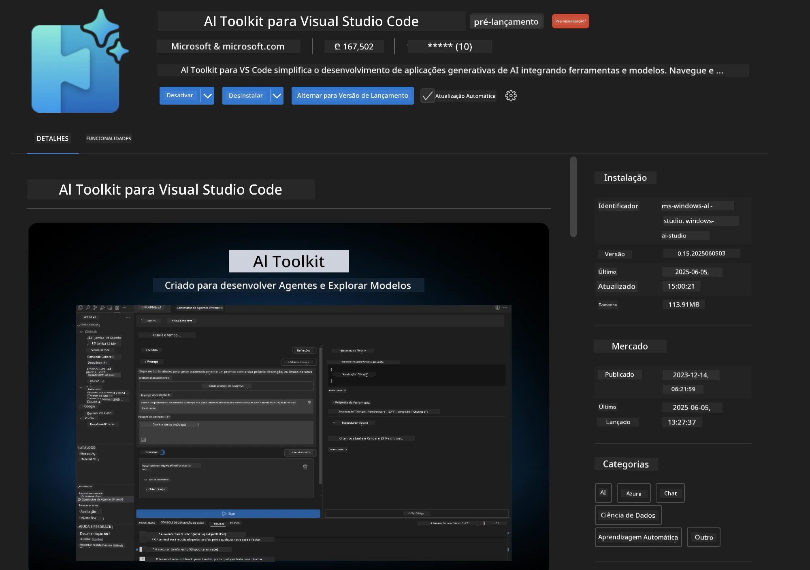
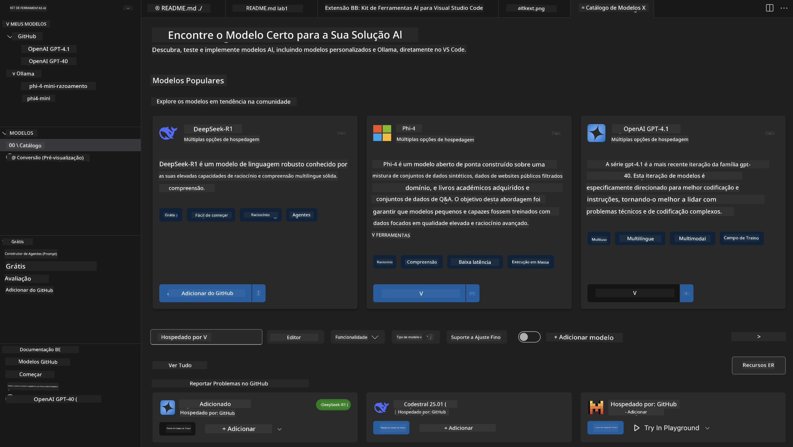
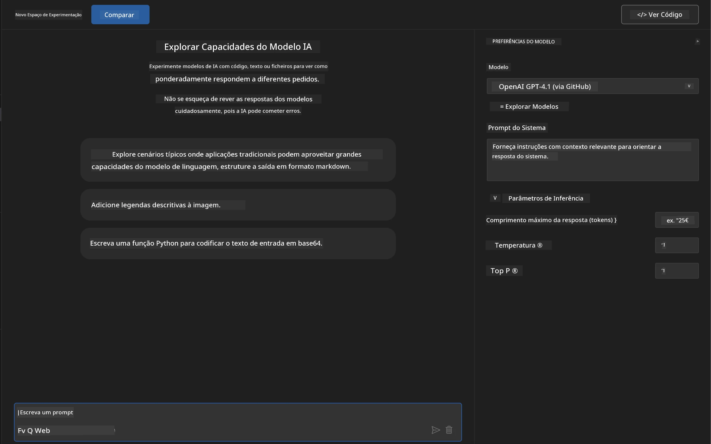
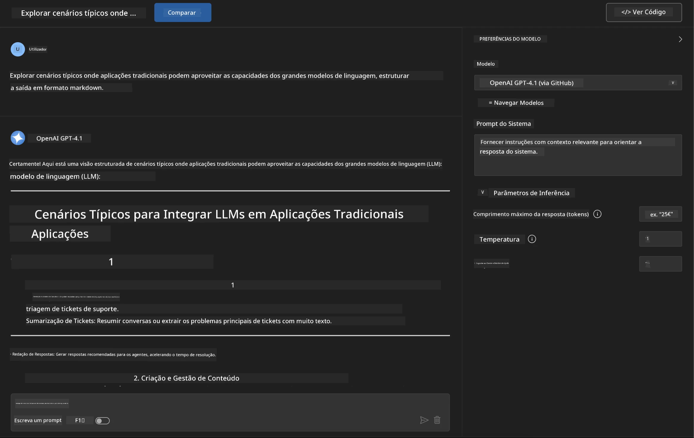
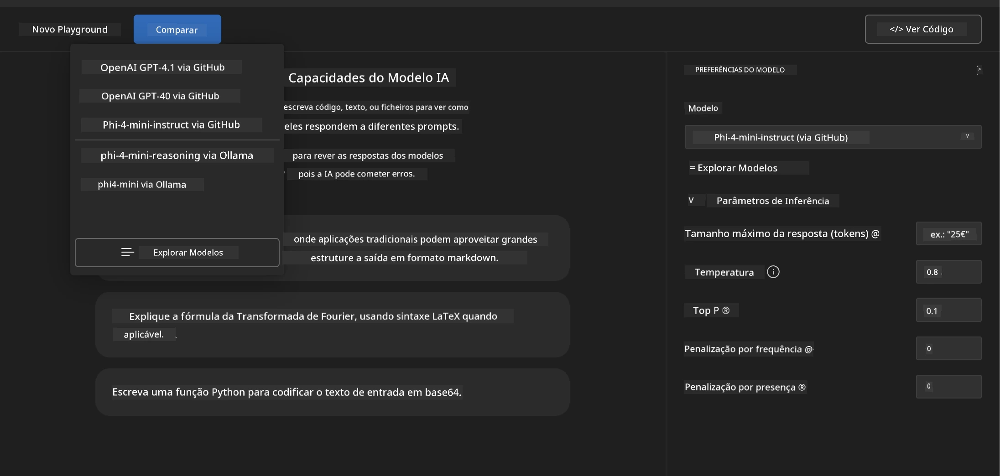
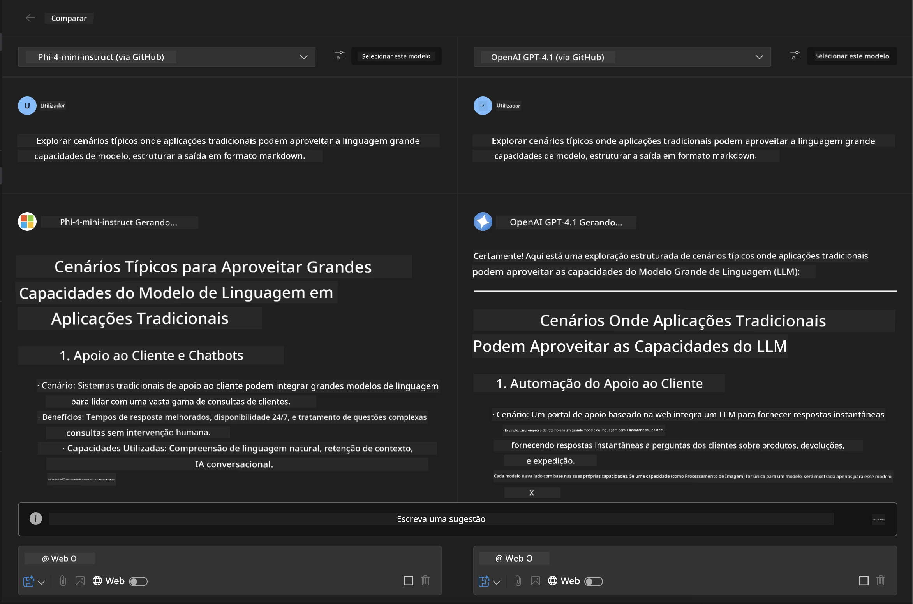
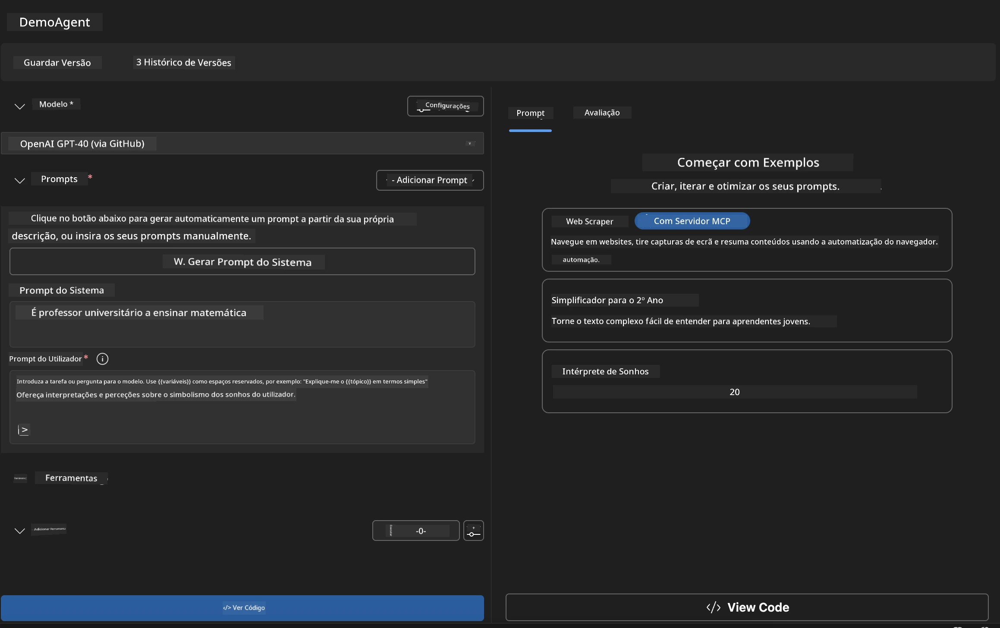
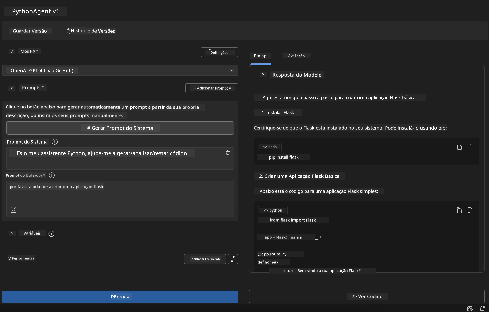

# 🚀 Módulo 1: Fundamentos do Microsoft Foundry Toolkit

[]()
[]()
[]()

## 📋 Objetivos de Aprendizagem

No final deste módulo, será capaz de:
- ✅ Instalar e configurar a Extensão Microsoft Foundry Toolkit para VS Code
- ✅ Navegar no Catálogo de Modelos e compreender diferentes fontes de modelos
- ✅ Utilizar o Playground para testar e experimentar modelos
- ✅ Criar agentes de IA personalizados usando o Agent Builder
- ✅ Comparar o desempenho dos modelos entre diferentes fornecedores
- ✅ Aplicar as melhores práticas para engenharia de prompts

## 🧠 Introdução ao Microsoft Foundry Toolkit

A **Extensão Microsoft Foundry Toolkit para VS Code** é a extensão principal da Microsoft que transforma o VS Code num ambiente abrangente de desenvolvimento de IA. Liga a investigação em IA ao desenvolvimento prático de aplicações, tornando a IA generativa acessível a desenvolvedores de todos os níveis de habilidade.

### 🌟 Capacidades Chave

| Funcionalidade | Descrição | Caso de Uso |
|---------|-------------|----------|
| **🗂️ Catálogo de Modelos** | Acesso a mais de 100 modelos do GitHub, ONNX, OpenAI, Anthropic, Google | Descoberta e seleção de modelos |
| **🔌 Suporte BYOM** | Integra os seus próprios modelos (locais/remotos) | Implementação de modelos personalizados |
| **🎮 Playground Interativo** | Teste de modelos em tempo real com interface de chat | Protótipo e testes rápidos |
| **📎 Suporte Multi-Modal** | Processamento de texto, imagens e anexos | Aplicações complexas de IA |
| **⚡ Processamento em Lote** | Executa múltiplos prompts simultaneamente | Fluxos de trabalho de teste eficientes |
| **📊 Avaliação de Modelos** | Métricas incorporadas (F1, relevância, similaridade, coerência) | Avaliação de desempenho |

### 🎯 Porquê o Microsoft Foundry Toolkit é Importante

- **🚀 Desenvolvimento Acelerado**: Da ideia ao protótipo em minutos
- **🔄 Workflow Unificado**: Uma só interface para múltiplos fornecedores de IA
- **🧪 Experimentação Fácil**: Compare modelos sem configurações complexas
- **📈 Pronto para Produção**: Transição sem falhas do protótipo para o ambiente produtivo

## 🛠️ Pré-requisitos & Configuração

### 📦 Instalar a Extensão Microsoft Foundry Toolkit

**Passo 1: Aceda ao Marketplace de Extensões**
1. Abra o Visual Studio Code
2. Navegue para a vista de Extensões (`Ctrl+Shift+X` ou `Cmd+Shift+X`)
3. Procure por "Microsoft Foundry Toolkit"

**Passo 2: Escolha a Sua Versão**
- **🟢 Versão Estável**: Recomendada para uso em produção
- **🔶 Pré-lançamento**: Acesso antecipado a funcionalidades inovadoras

**Passo 3: Instalar e Ativar**



### ✅ Lista de Verificação de Verificação
- [ ] Ícone do Microsoft Foundry Toolkit aparece na barra lateral do VS Code
- [ ] Extensão está ativada e em funcionamento
- [ ] Nenhum erro de instalação no painel de saída

## 🧪 Exercício Prático 1: Explorar Modelos do GitHub

**🎯 Objetivo**: Dominar o Catálogo de Modelos e testar o seu primeiro modelo de IA

### 📊 Passo 1: Navegar no Catálogo de Modelos

O Catálogo de Modelos é a sua porta de entrada para o ecossistema de IA. Agrega modelos de múltiplos fornecedores, facilitando a descoberta e comparação de opções.

**🔍 Guia de Navegação:**

Clique em **MODELOS - Catálogo** na barra lateral do Microsoft Foundry Toolkit



**💡 Dica Profissional**: Procure modelos com capacidades específicas que correspondam ao seu caso de uso (por exemplo, geração de código, escrita criativa, análise).

**⚠️ Nota**: Os modelos hospedados no GitHub (isto é, Modelos GitHub) são gratuitos para uso mas estão sujeitos a limites de taxa em pedidos e tokens. Se quiser aceder a modelos fora do GitHub (ou seja, modelos externos hospedados via Azure AI ou outros endpoints), terá de fornecer a chave API ou autenticação apropriada.

### 🚀 Passo 2: Adicionar e Configurar o Seu Primeiro Modelo

**Estratégia de Seleção de Modelos:**
- **GPT-4.1**: Ideal para raciocínio complexo e análise
- **Phi-4-mini**: Leve, respostas rápidas para tarefas simples

**🔧 Processo de Configuração:**
1. Selecione **OpenAI GPT-4.1** no catálogo
2. Clique em **Adicionar aos Meus Modelos** - isto regista o modelo para uso
3. Escolha **Testar no Playground** para lançar o ambiente de testes
4. Aguarde a inicialização do modelo (a configuração inicial pode demorar um pouco)



**⚙️ Entender os Parâmetros do Modelo:**
- **Temperature**: Controla a criatividade (0 = determinístico, 1 = criativo)
- **Max Tokens**: Comprimento máximo da resposta
- **Top-p**: Amostragem de núcleo para diversidade de resposta

### 🎯 Passo 3: Dominar a Interface do Playground

O Playground é o seu laboratório de experimentação de IA. Eis como maximizar o seu potencial:

**🎨 Melhores Práticas para Engenharia de Prompts:**
1. **Seja Específico**: Instruções claras e detalhadas produzem melhores resultados
2. **Forneça Contexto**: Inclua informações relevantes de fundo
3. **Use Exemplos**: Mostre ao modelo o que pretende com exemplos
4. **Itere**: Refine os prompts com base nos resultados iniciais

**🧪 Cenários de Teste:**
```markdown
# Example 1: Code Generation
"Write a Python function that calculates the factorial of a number using recursion. Include error handling and docstrings."

# Example 2: Creative Writing
"Write a professional email to a client explaining a project delay, maintaining a positive tone while being transparent about challenges."

# Example 3: Data Analysis
"Analyze this sales data and provide insights: [paste your data]. Focus on trends, anomalies, and actionable recommendations."
```



### 🏆 Desafio: Comparação de Desempenho de Modelos

**🎯 Objetivo**: Comparar diferentes modelos usando prompts idênticos para entender suas forças

**📋 Instruções:**
1. Adicione **Phi-4-mini** ao seu espaço de trabalho
2. Use o mesmo prompt para GPT-4.1 e Phi-4-mini



3. Compare a qualidade da resposta, rapidez e precisão
4. Documente as suas conclusões na secção de resultados



**💡 Insights Chave a Descobrir:**
- Quando usar LLM vs SLM
- Compromissos entre custo e desempenho
- Capacidades especializadas de diferentes modelos

## 🤖 Exercício Prático 2: Criar Agentes Personalizados com Agent Builder

**🎯 Objetivo**: Criar agentes de IA especializados adaptados a tarefas e fluxos de trabalho específicos

### 🏗️ Passo 1: Compreender o Agent Builder

O Agent Builder é onde o Microsoft Foundry Toolkit realmente se destaca. Permite criar assistentes de IA construídos para objetivos específicos que combinam o poder de grandes modelos linguísticos com instruções personalizadas, parâmetros específicos e conhecimento especializado.

**🧠 Componentes da Arquitetura do Agente:**
- **Modelo Base**: O LLM fundamental (GPT-4, Groks, Phi, etc.)
- **Prompt do Sistema**: Define a personalidade e comportamento do agente
- **Parâmetros**: Configurações ajustadas para desempenho ideal
- **Integração de Ferramentas**: Ligações a APIs externas e serviços MCP
- **Memória**: Contexto da conversa e persistência de sessão



### ⚙️ Passo 2: Imersão na Configuração do Agente

**🎨 Criar Prompts de Sistema Eficazes:**
```markdown
# Template Structure:
## Role Definition
You are a [specific role] with expertise in [domain].

## Capabilities
- List specific abilities
- Define scope of knowledge
- Clarify limitations

## Behavior Guidelines
- Response style (formal, casual, technical)
- Output format preferences
- Error handling approach

## Examples
Provide 2-3 examples of ideal interactions
```

*Claro que também pode usar Gerar Prompt do Sistema para usar IA a ajudar a gerar e otimizar prompts*

**🔧 Otimização de Parâmetros:**
| Parâmetro | Intervalo Recomendado | Caso de Uso |
|-----------|------------------|----------|
| **Temperature** | 0.1-0.3 | Respostas técnicas/factuais |
| **Temperature** | 0.7-0.9 | Tarefas criativas/brainstorming |
| **Max Tokens** | 500-1000 | Respostas concisas |
| **Max Tokens** | 2000-4000 | Explicações detalhadas |

### 🐍 Passo 3: Exercício Prático - Agente de Programação Python

**🎯 Missão**: Criar um assistente especializado em codificação Python

**📋 Passos de Configuração:**

1. **Seleção do Modelo**: Escolha **Claude 3.5 Sonnet** (excelente para código)

2. **Desenho do Prompt do Sistema**:
```markdown
# Python Programming Expert Agent

## Role
You are a senior Python developer with 10+ years of experience. You excel at writing clean, efficient, and well-documented Python code.

## Capabilities
- Write production-ready Python code
- Debug complex issues
- Explain code concepts clearly
- Suggest best practices and optimizations
- Provide complete working examples

## Response Format
- Always include docstrings
- Add inline comments for complex logic
- Suggest testing approaches
- Mention relevant libraries when applicable

## Code Quality Standards
- Follow PEP 8 style guidelines
- Use type hints where appropriate
- Handle exceptions gracefully
- Write readable, maintainable code
```

3. **Configuração dos Parâmetros**:
   - Temperature: 0.2 (para código consistente e fiável)
   - Max Tokens: 2000 (explicações detalhadas)
   - Top-p: 0.9 (criatividade equilibrada)



### 🧪 Passo 4: Testar o Seu Agente Python

**Cenários de Teste:**
1. **Função Básica**: "Crie uma função para encontrar números primos"
2. **Algoritmo Complexo**: "Implemente uma árvore de pesquisa binária com métodos inserir, apagar e pesquisar"
3. **Problema do Mundo Real**: "Construa um web scraper que gerencie limites de taxa e tentativas de repetição"
4. **Depuração**: "Corrija este código [colar código com erros]"

**🏆 Critérios de Sucesso:**
- ✅ Código executa sem erros
- ✅ Inclui documentação adequada
- ✅ Segue as melhores práticas de Python
- ✅ Fornece explicações claras
- ✅ Sugere melhorias

## 🎓 Conclusão do Módulo 1 & Próximos Passos

### 📊 Verificação de Conhecimento

Teste o seu entendimento:
- [ ] Consegue explicar a diferença entre modelos no catálogo?
- [ ] Criou e testou com sucesso um agente personalizado?
- [ ] Compreende como otimizar parâmetros para diferentes casos de uso?
- [ ] Sabe como desenhar prompts de sistema eficazes?

### 📚 Recursos Adicionais

- **Documentação do Microsoft Foundry Toolkit**: [Documentação Oficial Microsoft](https://github.com/microsoft/vscode-ai-toolkit)
- **Guia de Engenharia de Prompts**: [Melhores Práticas](https://platform.openai.com/docs/guides/prompt-engineering)
- **Modelos no Microsoft Foundry Toolkit**: [Modelos em Desenvolvimento](https://github.com/microsoft/vscode-ai-toolkit/blob/main/doc/models.md)

**🎉 Parabéns!** Dominou os fundamentos do Microsoft Foundry Toolkit e está pronto para construir aplicações de IA mais avançadas!

### 🔜 Continue para o Próximo Módulo

Pronto para capacidades mais avançadas? Continue para **[Módulo 2: Fundamentos MCP com Microsoft Foundry Toolkit](../lab2/README.md)** onde irá aprender a:
- Ligar os seus agentes a ferramentas externas usando o Model Context Protocol (MCP)
- Construir agentes de automação de browser com Playwright
- Integrar servidores MCP com os seus agentes Microsoft Foundry Toolkit
- Potenciar os seus agentes com dados e capacidades externas

---

<!-- CO-OP TRANSLATOR DISCLAIMER START -->
**Aviso Legal**:
Este documento foi traduzido utilizando o serviço de tradução automática [Co-op Translator](https://github.com/Azure/co-op-translator). Embora nos esforcemos pela precisão, esteja ciente de que traduções automáticas podem conter erros ou imprecisões. O documento original na sua língua nativa deve ser considerado a fonte autorizada. Para informações críticas, recomenda-se tradução profissional humana. Não nos responsabilizamos por quaisquer mal-entendidos ou interpretações incorretas resultantes da utilização desta tradução.
<!-- CO-OP TRANSLATOR DISCLAIMER END -->