# 🌐 Módulo 2: MCP com Fundamentos do Microsoft Foundry Toolkit

[]()
[]()
[]()

## 📋 Objetivos de Aprendizagem

No final deste módulo, será capaz de:
- ✅ Compreender a arquitetura e os benefícios do Model Context Protocol (MCP)
- ✅ Explorar o ecossistema de servidores MCP da Microsoft
- ✅ Integrar servidores MCP com o Microsoft Foundry Toolkit Agent Builder
- ✅ Construir um agente funcional de automação de navegador usando o Playwright MCP
- ✅ Configurar e testar ferramentas MCP dentro dos seus agentes
- ✅ Exportar e implementar agentes potenciados por MCP para uso em produção

## 🎯 A Construção Sobre o Módulo 1

No Módulo 1, dominámos os fundamentos do Microsoft Foundry Toolkit e criámos o nosso primeiro Agente Python. Agora vamos **impulsionar** os seus agentes ao conectá-los a ferramentas e serviços externos através do revolucionário **Model Context Protocol (MCP)**.

Pense nisto como uma atualização de uma calculadora básica para um computador completo - os seus agentes de IA adquirirão a capacidade de:
- 🌐 Navegar e interagir com websites
- 📁 Aceder e manipular ficheiros
- 🔧 Integrar com sistemas empresariais
- 📊 Processar dados em tempo real de APIs

## 🧠 Compreender o Model Context Protocol (MCP)

### 🔍 O que é o MCP?

O Model Context Protocol (MCP) é o **“USB-C para aplicações de IA”** - um padrão aberto revolucionário que liga Grandes Modelos de Linguagem (LLMs) a ferramentas, fontes de dados e serviços externos. Tal como o USB-C eliminou o caos dos cabos fornecendo um conector universal, o MCP elimina a complexidade da integração de IA com um protocolo padronizado.

### 🎯 O Problema que o MCP Resolve

**Antes do MCP:**
- 🔧 Integrações personalizadas para cada ferramenta
- 🔄 Dependência de fornecedores com soluções proprietárias  
- 🔒 Vulnerabilidades de segurança devido a ligações ad hoc
- ⏱️ Meses de desenvolvimento para integrações básicas

**Com o MCP:**
- ⚡ Integração plug-and-play de ferramentas
- 🔄 Arquitetura agnóstica ao fornecedor
- 🛡️ Melhores práticas de segurança integradas
- 🚀 Minutos para adicionar novas funcionalidades

### 🏗️ Análise Profunda da Arquitetura MCP

O MCP segue uma **arquitetura cliente-servidor** que cria um ecossistema seguro e escalável:

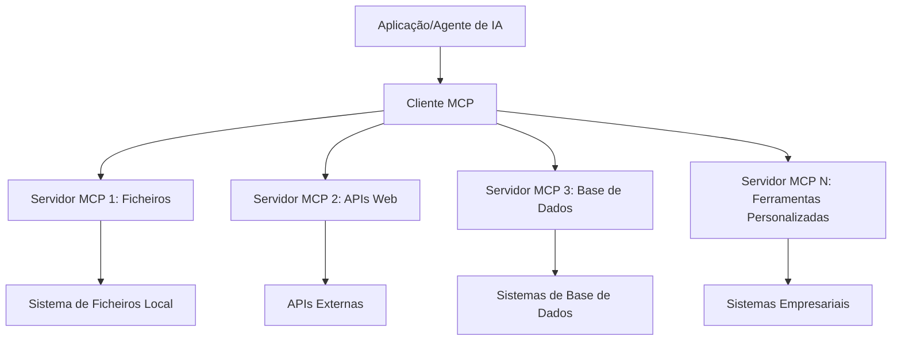

**🔧 Componentes Principais:**

| Componente | Função | Exemplos |
|------------|---------|----------|
| **Hosts MCP** | Aplicações que consomem serviços MCP | Claude Desktop, VS Code, Microsoft Foundry Toolkit |
| **Clientes MCP** | Manipuladores de protocolo (1:1 com servidores) | Incorporados nas aplicações host |
| **Servidores MCP** | Expõem capacidades via protocolo padrão | Playwright, Files, Azure, GitHub |
| **Camada de Transporte** | Métodos de comunicação | stdio, HTTP, WebSockets |

## 🏢 Ecossistema de Servidores MCP da Microsoft

A Microsoft lidera o ecossistema MCP com uma suíte abrangente de servidores empresariais que respondem a necessidades reais de negócio.

### 🌟 Servidores MCP Destacados da Microsoft

#### 1. ☁️ Servidor MCP Azure
**🔗 Repositório**: [azure/azure-mcp](https://github.com/azure/azure-mcp)  
**🎯 Objetivo**: Gestão abrangente de recursos Azure com integração de IA

**✨ Funcionalidades Principais:**
- Provisionamento declarativo de infraestrutura
- Monitorização de recursos em tempo real
- Recomendações de otimização de custos
- Verificação de conformidade de segurança

**🚀 Casos de Uso:**
- Infraestrutura como Código com assistência de IA
- Escalonamento automático de recursos
- Otimização de custos na cloud
- Automação de fluxos de trabalho DevOps

#### 2. 📊 Microsoft Dataverse MCP
**📚 Documentação**: [Microsoft Dataverse Integration](https://go.microsoft.com/fwlink/?linkid=2320176)  
**🎯 Objetivo**: Interface em linguagem natural para dados de negócio

**✨ Funcionalidades Principais:**
- Consultas a bases de dados em linguagem natural
- Compreensão do contexto empresarial
- Modelos personalizados de prompt
- Governança de dados empresariais

**🚀 Casos de Uso:**
- Relatórios de business intelligence
- Análise de dados de clientes
- Insights do pipeline de vendas
- Consultas de dados para conformidade

#### 3. 🌐 Servidor Playwright MCP
**🔗 Repositório**: [microsoft/playwright-mcp](https://github.com/microsoft/playwright-mcp)  
**🎯 Objetivo**: Automação de navegador e capacidades de interação web

**✨ Funcionalidades Principais:**
- Automação multiplataforma (Chrome, Firefox, Safari)
- Detecção inteligente de elementos
- Geração de screenshots e PDFs
- Monitorização de tráfego de rede

**🚀 Casos de Uso:**
- Fluxos automatizados de testes
- Web scraping e extração de dados
- Monitorização UI/UX
- Automação de análise competitiva

#### 4. 📁 Servidor Files MCP
**🔗 Repositório**: [microsoft/files-mcp-server](https://github.com/microsoft/files-mcp-server)  
**🎯 Objetivo**: Operações inteligentes em sistemas de ficheiros

**✨ Funcionalidades Principais:**
- Gestão declarativa de ficheiros
- Sincronização de conteúdos
- Integração com controlo de versões
- Extração de metadados

**🚀 Casos de Uso:**
- Gestão de documentação
- Organização de repositórios de código
- Fluxos de publicação de conteúdos
- Manipulação de ficheiros em pipelines de dados

#### 5. 📝 Servidor MarkItDown MCP
**🔗 Repositório**: [microsoft/markitdown](https://github.com/microsoft/markitdown)  
**🎯 Objetivo**: Processamento avançado e manipulação de Markdown

**✨ Funcionalidades Principais:**
- Parsing avançado de Markdown
- Conversão de formatos (MD ↔ HTML ↔ PDF)
- Análise da estrutura de conteúdos
- Processamento de templates

**🚀 Casos de Uso:**
- Fluxos de documentação técnica
- Sistemas de gestão de conteúdos
- Geração de relatórios
- Automação de bases de conhecimento

#### 6. 📈 Servidor Clarity MCP
**📦 Pacote**: [@microsoft/clarity-mcp-server](https://www.npmjs.com/package/@microsoft/clarity-mcp-server)  
**🎯 Objetivo**: Análise web e insights sobre comportamento do utilizador

**✨ Funcionalidades Principais:**
- Análise de dados de heatmaps
- Gravação de sessões de utilizador
- Métricas de desempenho
- Análise de funis de conversão

**🚀 Casos de Uso:**
- Otimização de websites
- Investigação da experiência do utilizador
- Análise A/B testing
- Dashboards de business intelligence

### 🌍 Ecossistema da Comunidade

Para além dos servidores da Microsoft, o ecossistema MCP inclui:
- **🐙 GitHub MCP**: Gestão de repositórios e análise de código
- **🗄️ MCPs para Bases de Dados**: Integrações PostgreSQL, MySQL, MongoDB
- **☁️ MCPs de Fornecedores de Cloud**: Ferramentas AWS, GCP, Digital Ocean
- **📧 MCPs de Comunicação**: Integrações Slack, Teams, Email

## 🛠️ Laboratório Prático: Construir um Agente de Automação de Navegador

**🎯 Objetivo do Projeto**: Criar um agente inteligente de automação de navegador usando o servidor Playwright MCP que possa navegar em websites, extrair informação e realizar interações web complexas.

### 🚀 Fase 1: Configuração da Base do Agente

#### Passo 1: Inicializar o Seu Agente
1. **Abra o Microsoft Foundry Toolkit Agent Builder**  
2. **Crie Novo Agente** com a seguinte configuração:  
   - **Nome**: `BrowserAgent`  
   - **Modelo**: Escolha GPT-4o  

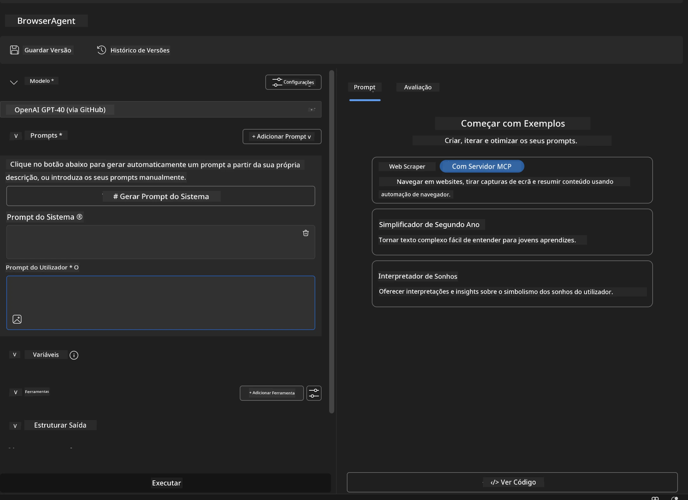

### 🔧 Fase 2: Fluxo de Integração MCP

#### Passo 3: Adicionar Integração de Servidor MCP
1. **Navegue para a Secção Ferramentas** no Agent Builder  
2. **Clique em "Add Tool"** para abrir o menu de integração  
3. **Selecione "MCP Server"** nas opções disponíveis  

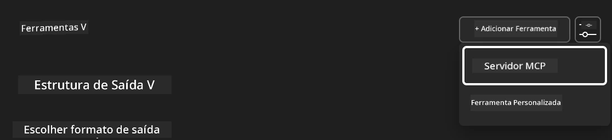

**🔍 Compreender Tipos de Ferramentas:**  
- **Ferramentas Integradas**: Funções pré-configuradas do Microsoft Foundry Toolkit  
- **Servidores MCP**: Integrações de serviços externos  
- **APIs Personalizadas**: Endpoints dos seus próprios serviços  
- **Chamada de Funções**: Acesso direto a funções do modelo  

#### Passo 4: Seleção do Servidor MCP
1. **Escolha a opção "MCP Server"** para prosseguir  
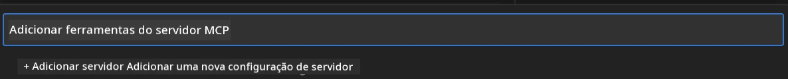

2. **Explore o Catálogo MCP** para ver as integrações disponíveis  
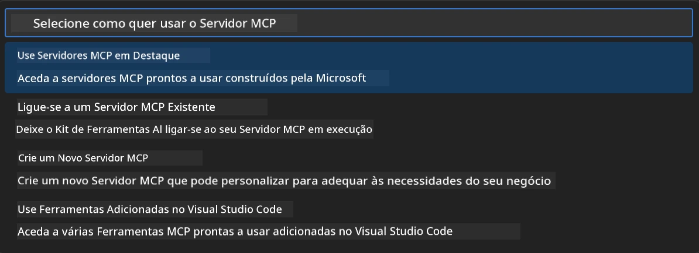

### 🎮 Fase 3: Configuração do Playwright MCP

#### Passo 5: Selecionar e Configurar Playwright
1. **Clique em "Use Featured MCP Servers"** para aceder aos servidores verificados da Microsoft  
2. **Selecione "Playwright"** da lista destacada  
3. **Aceite o ID MCP por Defeito** ou personalize conforme o seu ambiente  

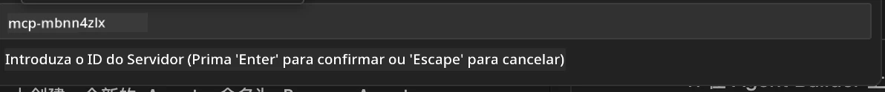

#### Passo 6: Ativar Capacidades do Playwright
**🔑 Passo Crítico**: Selecione **TODOS** os métodos Playwright disponíveis para funcionalidade máxima  

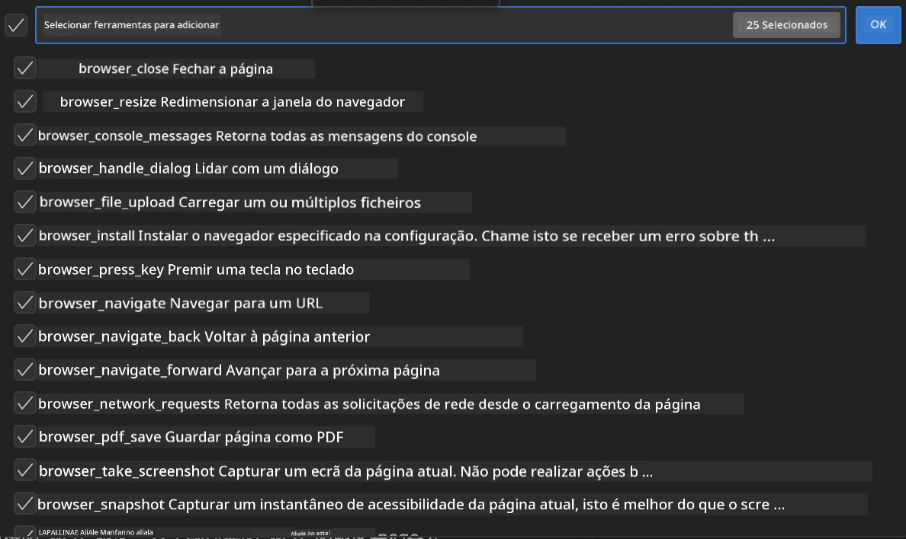

**🛠️ Ferramentas Essenciais do Playwright:**  
- **Navegação**: `goto`, `goBack`, `goForward`, `reload`  
- **Interação**: `click`, `fill`, `press`, `hover`, `drag`  
- **Extração**: `textContent`, `innerHTML`, `getAttribute`  
- **Validação**: `isVisible`, `isEnabled`, `waitForSelector`  
- **Captura**: `screenshot`, `pdf`, `video`  
- **Rede**: `setExtraHTTPHeaders`, `route`, `waitForResponse`  

#### Passo 7: Verificar Sucesso da Integração
**✅ Indicadores de Sucesso:**  
- Todas as ferramentas aparecem na interface do Agent Builder  
- Não há mensagens de erro no painel de integração  
- Estado do servidor Playwright mostra “Connected”  

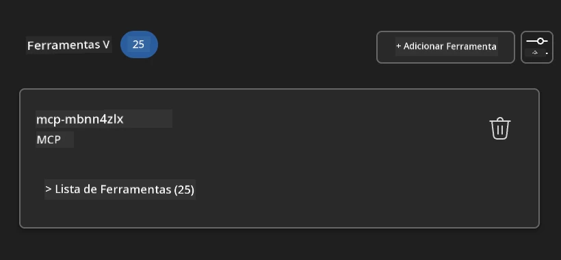

**🔧 Resolução de Problemas Comuns:**  
- **Falha na Conexão**: Verifique a conectividade à internet e definições de firewall  
- **Ferramentas em Falta**: Assegure que todas as capacidades foram selecionadas durante a configuração  
- **Erros de Permissão**: Verifique se o VS Code tem permissões necessárias no sistema  

### 🎯 Fase 4: Engenharia de Prompt Avançada

#### Passo 8: Desenhar Prompts Inteligentes do Sistema  
Crie prompts sofisticados que aproveitem todas as capacidades do Playwright:

```markdown
# Web Automation Expert System Prompt

## Core Identity
You are an advanced web automation specialist with deep expertise in browser automation, web scraping, and user experience analysis. You have access to Playwright tools for comprehensive browser control.

## Capabilities & Approach
### Navigation Strategy
- Always start with screenshots to understand page layout
- Use semantic selectors (text content, labels) when possible
- Implement wait strategies for dynamic content
- Handle single-page applications (SPAs) effectively

### Error Handling
- Retry failed operations with exponential backoff
- Provide clear error descriptions and solutions
- Suggest alternative approaches when primary methods fail
- Always capture diagnostic screenshots on errors

### Data Extraction
- Extract structured data in JSON format when possible
- Provide confidence scores for extracted information
- Validate data completeness and accuracy
- Handle pagination and infinite scroll scenarios

### Reporting
- Include step-by-step execution logs
- Provide before/after screenshots for verification
- Suggest optimizations and alternative approaches
- Document any limitations or edge cases encountered

## Ethical Guidelines
- Respect robots.txt and rate limiting
- Avoid overloading target servers
- Only extract publicly available information
- Follow website terms of service
```
  
#### Passo 9: Criar Prompts Dinâmicos para Utilizador  
Projete prompts que demonstrem várias capacidades:

**🌐 Exemplo de Análise Web:**  
```markdown
Navigate to github.com/kinfey and provide a comprehensive analysis including:
1. Repository structure and organization
2. Recent activity and contribution patterns  
3. Documentation quality assessment
4. Technology stack identification
5. Community engagement metrics
6. Notable projects and their purposes

Include screenshots at key steps and provide actionable insights.
```
  
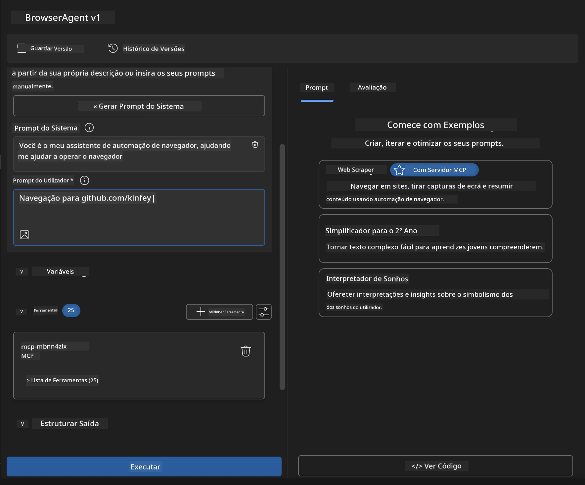

### 🚀 Fase 5: Execução e Testes

#### Passo 10: Executar a Sua Primeira Automação
1. **Clique em "Run"** para iniciar a sequência de automação  
2. **Monitorize a Execução em Tempo Real**:  
   - O navegador Chrome inicia automaticamente  
   - O agente navega até ao website alvo  
   - Screenshots capturam cada passo importante  
   - Resultados de análise são transmitidos em tempo real  

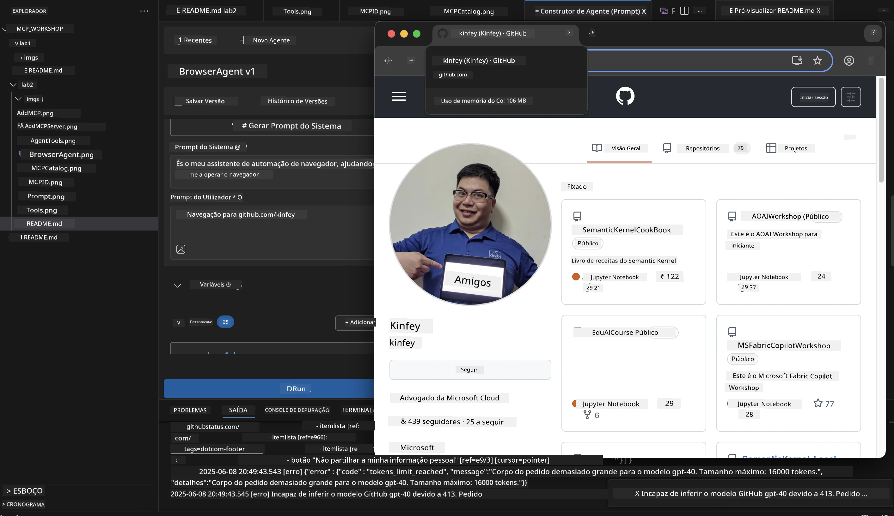

#### Passo 11: Analisar Resultados e Insights  
Revise a análise compreensiva na interface do Agent Builder:

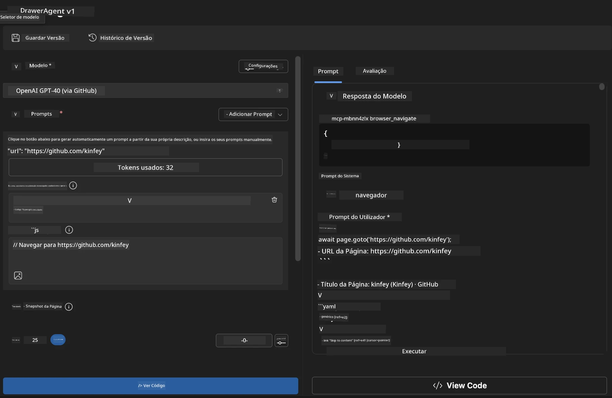

### 🌟 Fase 6: Capacidades Avançadas e Implementação

#### Passo 12: Exportar e Implementar em Produção  
O Agent Builder suporta múltiplas opções de implementação:

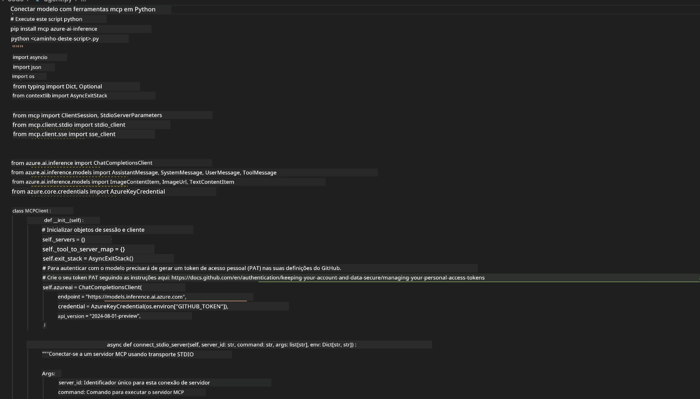

## 🎓 Resumo do Módulo 2 & Próximos Passos

### 🏆 Conquista Desbloqueada: Mestre da Integração MCP

**✅ Competências Dominadas:**  
- [ ] Compreensão da arquitetura e benefícios do MCP  
- [ ] Navegação no ecossistema de servidores MCP da Microsoft  
- [ ] Integração do Playwright MCP com o Microsoft Foundry Toolkit  
- [ ] Construção de agentes sofisticados de automação de navegador  
- [ ] Engenharia avançada de prompts para automação web  

### 📚 Recursos Adicionais

- **🔗 Especificação MCP**: [Documentação Oficial do Protocolo](https://modelcontextprotocol.io/)  
- **🛠️ API Playwright**: [Referência Completa de Métodos](https://playwright.dev/docs/api/class-playwright)  
- **🏢 Servidores MCP Microsoft**: [Guia de Integração Empresarial](https://github.com/microsoft/mcp-servers)  
- **🌍 Exemplos da Comunidade**: [Galeria de Servidores MCP](https://github.com/modelcontextprotocol/servers)

**🎉 Parabéns!** Dominou com sucesso a integração MCP e agora pode construir agentes de IA prontos para produção com capacidades externas de ferramentas!

### 🔜 Continue para o Próximo Módulo

Pronto para levar as suas competências MCP ao próximo nível? Avance para **[Módulo 3: Desenvolvimento Avançado MCP com Microsoft Foundry Toolkit](../lab3/README.md)** onde irá aprender a:
- Criar os seus próprios servidores MCP personalizados
- Configurar e usar o SDK Python MCP mais recente
- Configurar o MCP Inspector para depuração
- Dominar fluxos avançados de desenvolvimento de servidores MCP
- Construir um Servidor MCP de Weather do zero

---

<!-- CO-OP TRANSLATOR DISCLAIMER START -->
**Aviso Legal**:
Este documento foi traduzido utilizando o serviço de tradução automática [Co-op Translator](https://github.com/Azure/co-op-translator). Embora nos esforcemos pela precisão, esteja ciente de que traduções automáticas podem conter erros ou imprecisões. O documento original na sua língua nativa deve ser considerado a fonte autorizada. Para informações críticas, recomenda-se tradução profissional humana. Não nos responsabilizamos por quaisquer mal-entendidos ou interpretações incorretas resultantes da utilização desta tradução.
<!-- CO-OP TRANSLATOR DISCLAIMER END -->