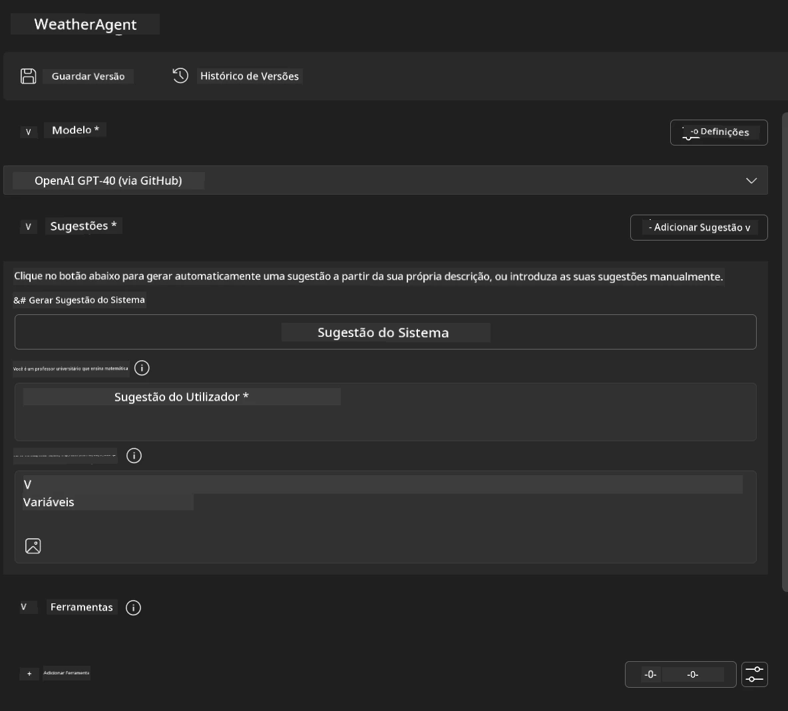
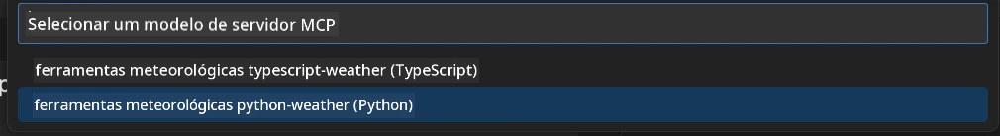
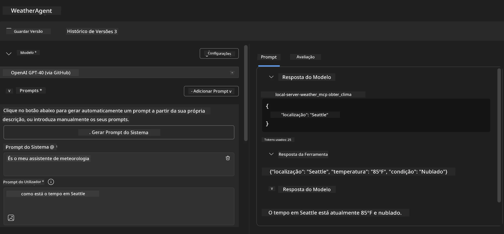
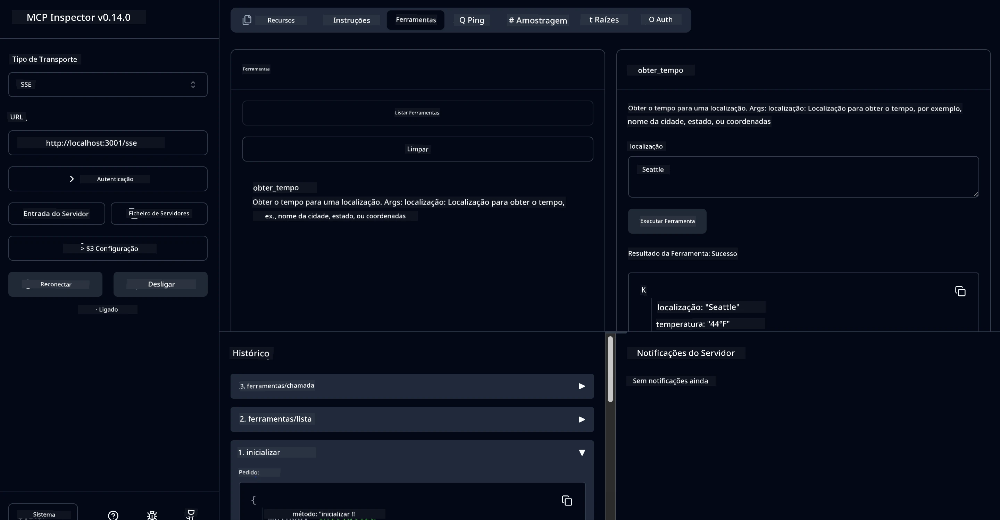

# 🔧 Módulo 3: Desenvolvimento Avançado de MCP com Microsoft Foundry Toolkit


## 🎯 Objetivos de Aprendizagem

No final deste laboratório, serás capaz de:

- ✅ Criar servidores MCP personalizados usando o Microsoft Foundry Toolkit  
- ✅ Configurar e usar o mais recente MCP Python SDK (v1.9.3)  
- ✅ Configurar e utilizar o MCP Inspector para depuração  
- ✅ Depurar servidores MCP tanto no Agent Builder quanto no Inspector  
- ✅ Compreender fluxos de trabalho avançados para desenvolvimento de servidores MCP  

## 📋 Pré-requisitos

- Completamento do Laboratório 2 (Fundamentos do MCP)  
- VS Code com a extensão Microsoft Foundry Toolkit instalada  
- Ambiente Python 3.10+  
- Node.js e npm para configuração do Inspector  

## 🏗️ O que vais construir

Neste laboratório, vais criar um **Servidor MCP de Meteorologia** que demonstra:  
- Implementação personalizada de servidor MCP  
- Integração com o Microsoft Foundry Toolkit Agent Builder  
- Fluxos de trabalho profissionais de depuração  
- Padrões modernos de uso do MCP SDK  

---

## 🔧 Visão Geral dos Componentes Principais

### 🐍 MCP Python SDK  
O Model Context Protocol Python SDK fornece a base para construir servidores MCP personalizados. Irás usar a versão 1.9.3 com capacidades aprimoradas de depuração.

### 🔍 MCP Inspector  
Uma poderosa ferramenta de depuração que oferece:  
- Monitorização do servidor em tempo real  
- Visualização da execução de ferramentas  
- Inspeção de pedidos/respostas de rede  
- Ambiente de teste interativo  

---

## 📖 Implementação Passo a Passo

### Passo 1: Criar um WeatherAgent no Agent Builder

1. **Abre o Agent Builder** no VS Code através da extensão Microsoft Foundry Toolkit  
2. **Cria um novo agente** com a seguinte configuração:  
   - Nome do Agente: `WeatherAgent`  



### Passo 2: Inicializar Projeto de Servidor MCP

1. **Navega até Ferramentas** → **Adicionar Ferramenta** no Agent Builder  
2. **Seleciona "Servidor MCP"** entre as opções disponíveis  
3. **Escolhe "Criar um novo Servidor MCP"**  
4. **Seleciona o template `python-weather`**  
5. **Nomeia o teu servidor:** `weather_mcp`  



### Passo 3: Abrir e Examinar o Projeto

1. **Abre o projeto gerado** no VS Code  
2. **Revê a estrutura do projeto:**  
   ```
   weather_mcp/
   ├── src/
   │   ├── __init__.py
   │   └── server.py
   ├── inspector/
   │   ├── package.json
   │   └── package-lock.json
   ├── .vscode/
   │   ├── launch.json
   │   └── tasks.json
   ├── pyproject.toml
   └── README.md
   ```

### Passo 4: Atualizar para o MCP SDK Mais Recente

> **🔍 Porquê atualizar?** Queremos usar o MCP SDK mais recente (v1.9.3) e o serviço Inspector (0.14.0) para funcionalidades aprimoradas e melhor capacidade de depuração.

#### 4a. Atualizar Dependências Python

**Edita o `pyproject.toml`:** atualiza [./code/weather_mcp/pyproject.toml](../../../../10-StreamliningAIWorkflowsBuildingAnMCPServerWithAIToolkit/lab3/code/weather_mcp/pyproject.toml)


#### 4b. Atualizar Configuração do Inspector

**Edita o `inspector/package.json`:** atualiza [./code/weather_mcp/inspector/package.json](../../../../10-StreamliningAIWorkflowsBuildingAnMCPServerWithAIToolkit/lab3/code/weather_mcp/inspector/package.json)

#### 4c. Atualizar Dependências do Inspector

**Edita o `inspector/package-lock.json`:** atualiza [./code/weather_mcp/inspector/package-lock.json](../../../../10-StreamliningAIWorkflowsBuildingAnMCPServerWithAIToolkit/lab3/code/weather_mcp/inspector/package-lock.json)

> **📝 Nota:** Este ficheiro contém extensas definições de dependências. A estrutura essencial está abaixo - o conteúdo completo assegura a resolução adequada das dependências.

> **⚡ Lock Completo do Pacote:** O package-lock.json completo contém cerca de 3000 linhas de definições de dependências. O acima apresenta a estrutura chave - usa o ficheiro fornecido para resolução completa.

### Passo 5: Configurar Depuração no VS Code

*Nota: Por favor copia o ficheiro para o caminho especificado para substituir o ficheiro local correspondente*

#### 5a. Atualizar Configuração de Arranque

**Edita `.vscode/launch.json`:**

```json
{
  "version": "0.2.0",
  "configurations": [
    {
      "name": "Attach to Local MCP",
      "type": "debugpy",
      "request": "attach",
      "connect": {
        "host": "localhost",
        "port": 5678
      },
      "presentation": {
        "hidden": true
      },
      "internalConsoleOptions": "neverOpen",
      "postDebugTask": "Terminate All Tasks"
    },
    {
      "name": "Launch Inspector (Edge)",
      "type": "msedge",
      "request": "launch",
      "url": "http://localhost:6274?timeout=60000&serverUrl=http://localhost:3001/sse#tools",
      "cascadeTerminateToConfigurations": [
        "Attach to Local MCP"
      ],
      "presentation": {
        "hidden": true
      },
      "internalConsoleOptions": "neverOpen"
    },
    {
      "name": "Launch Inspector (Chrome)",
      "type": "chrome",
      "request": "launch",
      "url": "http://localhost:6274?timeout=60000&serverUrl=http://localhost:3001/sse#tools",
      "cascadeTerminateToConfigurations": [
        "Attach to Local MCP"
      ],
      "presentation": {
        "hidden": true
      },
      "internalConsoleOptions": "neverOpen"
    }
  ],
  "compounds": [
    {
      "name": "Debug in Agent Builder",
      "configurations": [
        "Attach to Local MCP"
      ],
      "preLaunchTask": "Open Agent Builder",
    },
    {
      "name": "Debug in Inspector (Edge)",
      "configurations": [
        "Launch Inspector (Edge)",
        "Attach to Local MCP"
      ],
      "preLaunchTask": "Start MCP Inspector",
      "stopAll": true
    },
    {
      "name": "Debug in Inspector (Chrome)",
      "configurations": [
        "Launch Inspector (Chrome)",
        "Attach to Local MCP"
      ],
      "preLaunchTask": "Start MCP Inspector",
      "stopAll": true
    }
  ]
}
```

**Edita `.vscode/tasks.json`:**

```
{
  "version": "2.0.0",
  "tasks": [
    {
      "label": "Start MCP Server",
      "type": "shell",
      "command": "python -m debugpy --listen 127.0.0.1:5678 src/__init__.py sse",
      "isBackground": true,
      "options": {
        "cwd": "${workspaceFolder}",
        "env": {
          "PORT": "3001"
        }
      },
      "problemMatcher": {
        "pattern": [
          {
            "regexp": "^.*$",
            "file": 0,
            "location": 1,
            "message": 2
          }
        ],
        "background": {
          "activeOnStart": true,
          "beginsPattern": ".*",
          "endsPattern": "Application startup complete|running"
        }
      }
    },
    {
      "label": "Start MCP Inspector",
      "type": "shell",
      "command": "npm run dev:inspector",
      "isBackground": true,
      "options": {
        "cwd": "${workspaceFolder}/inspector",
        "env": {
          "CLIENT_PORT": "6274",
          "SERVER_PORT": "6277",
        }
      },
      "problemMatcher": {
        "pattern": [
          {
            "regexp": "^.*$",
            "file": 0,
            "location": 1,
            "message": 2
          }
        ],
        "background": {
          "activeOnStart": true,
          "beginsPattern": "Starting MCP inspector",
          "endsPattern": "Proxy server listening on port"
        }
      },
      "dependsOn": [
        "Start MCP Server"
      ]
    },
    {
      "label": "Open Agent Builder",
      "type": "shell",
      "command": "echo ${input:openAgentBuilder}",
      "presentation": {
        "reveal": "never"
      },
      "dependsOn": [
        "Start MCP Server"
      ],
    },
    {
      "label": "Terminate All Tasks",
      "command": "echo ${input:terminate}",
      "type": "shell",
      "problemMatcher": []
    }
  ],
  "inputs": [
    {
      "id": "openAgentBuilder",
      "type": "command",
      "command": "ai-mlstudio.agentBuilder",
      "args": {
        "initialMCPs": [ "local-server-weather_mcp" ],
        "triggeredFrom": "vsc-tasks"
      }
    },
    {
      "id": "terminate",
      "type": "command",
      "command": "workbench.action.tasks.terminate",
      "args": "terminateAll"
    }
  ]
}
```


---

## 🚀 Executar e Testar o Teu Servidor MCP

### Passo 6: Instalar Dependências

Após fazeres as alterações de configuração, executa os seguintes comandos:

**Instalar dependências Python:**  
```bash
uv sync
```
  
**Instalar dependências do Inspector:**  
```bash
cd inspector
npm install
```
  

### Passo 7: Depurar com Agent Builder

1. **Pressiona F5** ou usa a configuração **"Depurar no Agent Builder"**  
2. **Seleciona a configuração composta** no painel de depuração  
3. **Espera que o servidor inicie** e o Agent Builder abra  
4. **Testa o teu servidor MCP de meteorologia** com consultas em linguagem natural  

Introduz um prompt como este

SYSTEM_PROMPT

```
You are my weather assistant
```
  
USER_PROMPT

```
How's the weather like in Seattle
```
  


### Passo 8: Depurar com MCP Inspector

1. **Usa a configuração "Depurar no Inspector"** (Edge ou Chrome)  
2. **Abre a interface do Inspector** em `http://localhost:6274`  
3. **Explora o ambiente de teste interativo:**  
   - Visualiza ferramentas disponíveis  
   - Testa execução de ferramentas  
   - Monitoriza pedidos de rede  
   - Depura respostas do servidor  



---

## 🎯 Resultados Principais de Aprendizagem

Ao completares este laboratório, tu:

- [x] **Criaste um servidor MCP personalizado** usando templates do Microsoft Foundry Toolkit  
- [x] **Atualizaste para o MCP SDK mais recente** (v1.9.3) para funcionalidades aprimoradas  
- [x] **Configuraste fluxos de trabalho profissionais para depuração** tanto no Agent Builder quanto no Inspector  
- [x] **Configuraste o MCP Inspector** para testes interativos do servidor  
- [x] **Dominaste as configurações de depuração no VS Code** para desenvolvimento MCP  

## 🔧 Funcionalidades Avançadas Exploradas

| Funcionalidade | Descrição | Caso de Uso |
|---------|-------------|----------|
| **MCP Python SDK v1.9.3** | Última implementação do protocolo | Desenvolvimento moderno de servidores |
| **MCP Inspector 0.14.0** | Ferramenta de depuração interativa | Testes do servidor em tempo real |
| **Depuração VS Code** | Ambiente integrado de desenvolvimento | Fluxo de trabalho profissional de depuração |
| **Integração Agent Builder** | Ligação direta ao Microsoft Foundry Toolkit | Teste completo do agente |

## 📚 Recursos Adicionais

- [Documentação do MCP Python SDK](https://modelcontextprotocol.io/docs/sdk/python)  
- [Guia da Extensão Microsoft Foundry Toolkit](https://code.visualstudio.com/docs/ai/ai-toolkit)  
- [Documentação de Depuração do VS Code](https://code.visualstudio.com/docs/editor/debugging)  
- [Especificação do Model Context Protocol](https://modelcontextprotocol.io/docs/concepts/architecture)  

---

**🎉 Parabéns!** Concluíste com sucesso o Laboratório 3 e agora podes criar, depurar e implantar servidores MCP personalizados usando fluxos de desenvolvimento profissionais.

### 🔜 Continua para o Próximo Módulo

Preparado para aplicar as tuas competências MCP num fluxo de trabalho real de desenvolvimento? Continua para o **[Módulo 4: Desenvolvimento Prático MCP - Servidor Customizado para Clonar GitHub](../lab4/README.md)** onde vais:  
- Construir um servidor MCP pronto para produção que automatiza operações de repositórios GitHub  
- Implementar funcionalidade de clonagem de repositório GitHub via MCP  
- Integrar servidores MCP personalizados com VS Code e GitHub Copilot Agent Mode  
- Testar e implementar servidores MCP personalizados em ambientes de produção  
- Aprender automação prática de fluxos de trabalho para programadores  

---

<!-- CO-OP TRANSLATOR DISCLAIMER START -->
**Aviso Legal**:
Este documento foi traduzido utilizando o serviço de tradução automática [Co-op Translator](https://github.com/Azure/co-op-translator). Embora nos esforcemos pela precisão, esteja ciente de que traduções automáticas podem conter erros ou imprecisões. O documento original na sua língua nativa deve ser considerado a fonte autorizada. Para informações críticas, recomenda-se tradução profissional humana. Não nos responsabilizamos por quaisquer mal-entendidos ou interpretações incorretas resultantes da utilização desta tradução.
<!-- CO-OP TRANSLATOR DISCLAIMER END -->