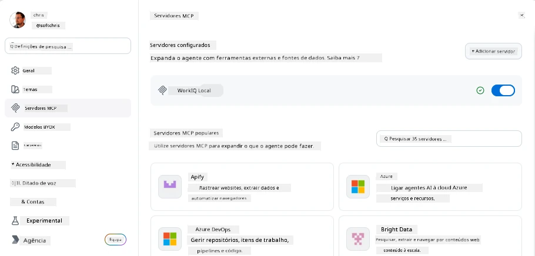
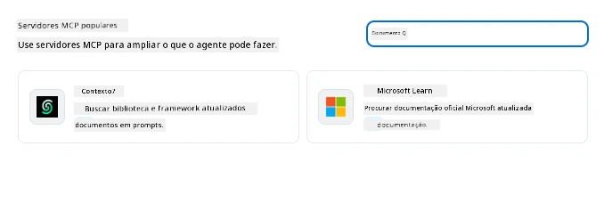
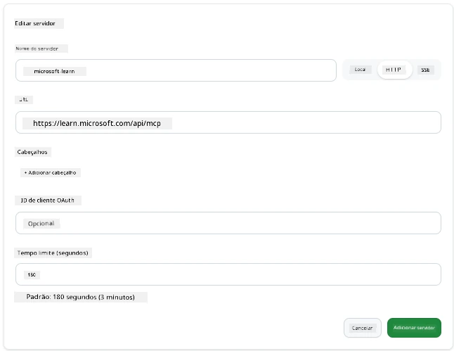
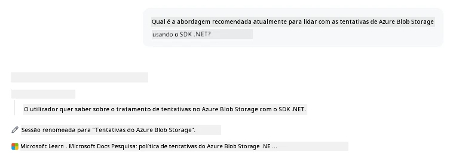
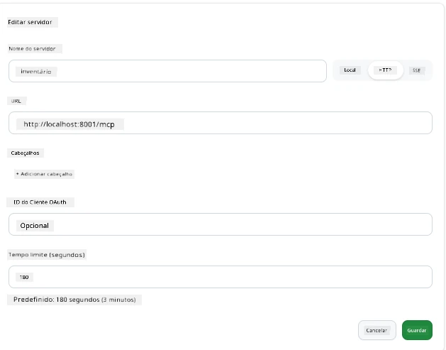
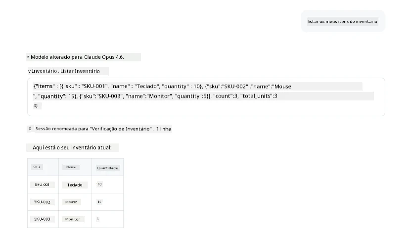
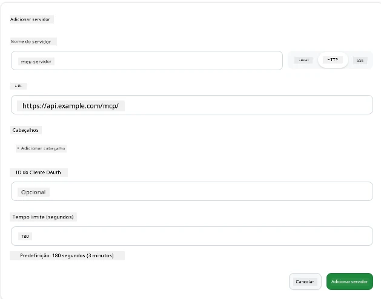

# Utilizar Servidores MCP na App GitHub Copilot

Até agora já sabe como o MCP funciona. Já construiu servidores, definiu ferramentas e recursos, e ligou clientes. O que ainda não fizemos é inverter a perspetiva: em vez de ser você a construir o servidor, como é ser do lado do *consumo* — como utilizador de uma app com IA que suporta MCP?

[GitHub Copilot App](https://github.com/github/app) é uma aplicação de ambiente de trabalho que pode usar Servidores MCP. Ao ligar servidores MCP a ela, desbloqueia um novo nível: o Copilot pode agora aceder à sua documentação, chamar as suas APIs internas, consultar a sua base de dados, ou comunicar com qualquer serviço que tenha empacotado num servidor. A app torna-se anfitriã; os seus servidores MCP tornam-se as suas ferramentas.

Esta lição guia-o por toda esta experiência do início ao fim — desde encontrar o painel de definições do MCP até ligar um servidor de documentação real e depois configurar um personalizado criado por si.

## Objetivos de Aprendizagem

No final desta lição, será capaz de:

- Localizar e navegar pelo painel de Servidores MCP nas definições da Copilot App.
- Ligar um servidor de documentação alojado e usá-lo numa sessão.
- Registar um servidor personalizado e verificar se o Copilot consegue invocar as suas ferramentas.
- Configurar como um servidor é chamado, fornecendo variáveis de ambiente ou cabeçalhos personalizados (se for HTTP).

## A App Copilot como Anfitriã MCP

Aqui está a ideia fundamental: **os agentes do Copilot são inteligentes, mas só sabem o que você lhes diz.** Por defeito, um agente pode ler ficheiros no seu espaço de trabalho e executar comandos no terminal, mas não pode consultar a sua base de dados, espreitar o seu calendário, ou chamar uma API personalizada sem ajuda. É aqui que entram os servidores MCP. Eles funcionam como pontes entre o Copilot e os seus sistemas — bases de dados, controlo de versões, APIs, ferramentas de design — dando aos agentes acesso à informação e às ações de que precisam para realizar o trabalho.

Vamos começar por encontrar essas definições para gerir os Servidores MCP da sua app.

## Passo 1: Encontrar o Painel de Definições MCP

Abra a Copilot App e localize um ícone de engrenagem no canto inferior esquerdo e clique nele.


Certifique-se de selecionar "MCP Servers" e deverá agora ver os seus servidores já configurados no topo, um mercado de servidores populares em baixo, e um botão "Add Server" no topo assim:



Este é o seu centro de controlo. Aqui adiciona, remove, ativa e desativa servidores. As alterações entram em vigor para novas sessões; se tiver uma sessão aberta, terá de iniciar uma nova após alterar esta lista.

## Passo 2: Ligar um Servidor de Documentação

Vamos fazer algo imediatamente útil. O servidor Microsoft Docs MCP dá ao Copilot acesso à documentação oficial da Microsoft. Inclui Azure, .NET, TypeScript, e mais. Em vez de o agente depender dos seus dados de treino (que têm uma data limite), pode obter documentação atual no momento da consulta.

Aqui está como adicioná-lo:

1. Na grelha de servidores populares, escreva **learn** e selecione o servidor chamado "Microsoft Learn".

   

   Ao clicar, apresenta-lhe um formulário onde o nome, tipo de transporte e URL estão preenchidos, tudo o que tem de fazer é clicar em "Add Server".

2. Clique em "Add Server", deverá demorar alguns segundos a ligar-se ao servidor.

   

   Depois de adicionado, deve aparecer na área superior como um servidor configurado. Vamos experimentá-lo de seguida.

3. Feche a janela e selecione Quick chat.

4. Escreva o prompt abaixo para ativar uma ferramenta no servidor Microsoft Learn.

   ```text
   What's the current recommended approach for handling Azure Blob Storage 
   retries using the .NET SDK?
   ```

   

Deverá ver como faz referência ao Servidor MCP que acabámos de adicionar.

## Passo 3: Ligar um Servidor stdio Personalizado

Os predefinidos são convenientes, mas o verdadeiro poder está em ligar os seus próprios servidores. Vamos supor que criou um servidor (ou lhe foi fornecido um) que expõe a sua API interna ou base de conhecimento da empresa. Neste caso, vamos usar um Servidor MCP que construímos e que gere o inventário da nossa empresa.

1. Clique na engrenagem e selecione "MCP servers" novamente.

2. Selecione o botão "Add Server" e "+ Add Custom server", e forneça os seguintes valores:

   - Nome: `Inventory Server`
   - Selecionar transporte (à direita), **http**

   Selecione "Add Server" e deverá aparecer na sua lista de servidores configurados.

   

4. Para testar, execute um prompt como este:

    ```
    list inventory
    ```

   

   Deve agora ver uma lista de itens de inventário retornados pelo seu servidor personalizado.

Ótimo, agora deve ter uma boa compreensão de como adicionar servidores MCP externos e seus próprios à Copilot App. A seguir, vamos falar sobre como lidar com segredos e variáveis de ambiente.

## Passo 4: Definições Avançadas

Até agora, viu como adicionar Servidores MCP onde apenas fornece um nome e URL. Mas e se o seu servidor precisar de uma chave API ou outro valor? Bem, dependendo do tipo de transporte, podemos fornecer o que ele precisa.

- **Transporte http ou SSE**: Aqui podemos definir cabeçalhos conforme necessário.

   Para autenticação, pode especificar um cabeçalho Authorization, por exemplo. O valor pode ser uma string estática. Se usar OAuth, pode em vez disso fornecer um ID de cliente OAuth.

   

- **Transporte stdio**: Podem ser definidas variáveis de ambiente.

   Aqui pode especificar quaisquer variáveis de ambiente necessárias que devam ser passadas para o servidor quando o inicia.

   

## Resumo

A Copilot App trata os servidores MCP como extensões de primeira classe das capacidades do agente. Viu toda a jornada nesta lição desde adicionar servidores MCP até usá-los numa sessão. Agora pode ligar-se a servidores públicos, APIs internas, e ferramentas personalizadas, dando aos seus agentes a capacidade de aceder à informação e ações de que precisam para realizar tarefas autonomamente.

## 📚 Recursos Adicionais

### Documentação oficial

- [GitHub Copilot App](https://github.com/github/app)
- [Especificação MCP](https://modelcontextprotocol.io/specification/2025-03-26) - Especificação do Model Context Protocol

### Comunidade
- [Comunidade MCP no Discord](https://discord.com/invite/ByRwuEEgH4) - Discussões em direto
- [Discussões no GitHub](https://github.com/microsoft/MCP-Server-and-PostgreSQL-Sample-Retail/discussions) - Perguntas e partilhas
- [Stack Overflow](https://stackoverflow.com/questions/tagged/model-context-protocol) - Questões técnicas

---

<!-- CO-OP TRANSLATOR DISCLAIMER START -->
**Aviso Legal**:
Este documento foi traduzido utilizando o serviço de tradução automática [Co-op Translator](https://github.com/Azure/co-op-translator). Embora nos esforcemos pela precisão, esteja ciente de que traduções automáticas podem conter erros ou imprecisões. O documento original na sua língua nativa deve ser considerado a fonte autorizada. Para informações críticas, recomenda-se tradução profissional humana. Não nos responsabilizamos por quaisquer mal-entendidos ou interpretações incorretas resultantes da utilização desta tradução.
<!-- CO-OP TRANSLATOR DISCLAIMER END -->