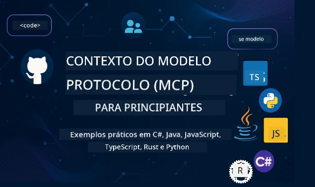

 

[](https://GitHub.com/microsoft/mcp-for-beginners/graphs/contributors)
[](https://GitHub.com/microsoft/mcp-for-beginners/issues)
[](https://GitHub.com/microsoft/mcp-for-beginners/pulls)
[](http://makeapullrequest.com)

[](https://GitHub.com/microsoft/mcp-for-beginners/watchers)
[](https://GitHub.com/microsoft/mcp-for-beginners/fork)
[](https://GitHub.com/microsoft/mcp-for-beginners/stargazers)


[](https://discord.gg/nTYy5BXMWG)

Siga estes passos para começar a usar estes recursos:
1. **Faça um Fork do Repositório**: Clique em [](https://GitHub.com/microsoft/mcp-for-beginners/fork)
2. **Clone o Repositório**:   `git clone https://github.com/microsoft/mcp-for-beginners.git`
3. **Junte-se ao** [](https://discord.gg/nTYy5BXMWG)


### 🌐 Suporte Multilingue

#### Suportado via GitHub Action (Automatizado e Sempre Atualizado)

<!-- CO-OP TRANSLATOR LANGUAGES TABLE START -->
[Árabe](../ar/README.md) | [Bengali](../bn/README.md) | [Búlgaro](../bg/README.md) | [Birmanês (Myanmar)](../my/README.md) | [Chinês (Simplificado)](../zh-CN/README.md) | [Chinês (Tradicional, Hong Kong)](../zh-HK/README.md) | [Chinês (Tradicional, Macau)](../zh-MO/README.md) | [Chinês (Tradicional, Taiwan)](../zh-TW/README.md) | [Croata](../hr/README.md) | [Checo](../cs/README.md) | [Dinamarquês](../da/README.md) | [Holandês](../nl/README.md) | [Estónio](../et/README.md) | [Finlandês](../fi/README.md) | [Francês](../fr/README.md) | [Alemão](../de/README.md) | [Grego](../el/README.md) | [Hebraico](../he/README.md) | [Hindi](../hi/README.md) | [Húngaro](../hu/README.md) | [Indonésio](../id/README.md) | [Italiano](../it/README.md) | [Japonês](../ja/README.md) | [Kannada](../kn/README.md) | [Khmer](../km/README.md) | [Coreano](../ko/README.md) | [Lituano](../lt/README.md) | [Malay](../ms/README.md) | [Malayalam](../ml/README.md) | [Marathi](../mr/README.md) | [Nepali](../ne/README.md) | [Pidgin Nigeriano](../pcm/README.md) | [Norueguês](../no/README.md) | [Persa (Farsi)](../fa/README.md) | [Polaco](../pl/README.md) | [Português (Brasil)](../pt-BR/README.md) | [Português (Portugal)](./README.md) | [Punjabi (Gurmukhi)](../pa/README.md) | [Romeno](../ro/README.md) | [Russo](../ru/README.md) | [Sérvio (Cirílico)](../sr/README.md) | [Eslovaco](../sk/README.md) | [Esloveno](../sl/README.md) | [Espanhol](../es/README.md) | [Swahili](../sw/README.md) | [Sueco](../sv/README.md) | [Tagalog (Filipino)](../tl/README.md) | [Tamil](../ta/README.md) | [Telugu](../te/README.md) | [Tailandês](../th/README.md) | [Turco](../tr/README.md) | [Ucraniano](../uk/README.md) | [Urdu](../ur/README.md) | [Vietnamita](../vi/README.md)

> **Prefere Clonar Localmente?**
>
> Este repositório inclui traduções em mais de 50 idiomas, o que aumenta significativamente o tamanho do download. Para clonar sem as traduções, use sparse checkout:
>
> **Bash / macOS / Linux:**
> ```bash
> git clone --filter=blob:none --sparse https://github.com/microsoft/mcp-for-beginners.git
> cd mcp-for-beginners
> git sparse-checkout set --no-cone '/*' '!translations' '!translated_images'
> ```
>
> **CMD (Windows):**
> ```cmd
> git clone --filter=blob:none --sparse https://github.com/microsoft/mcp-for-beginners.git
> cd mcp-for-beginners
> git sparse-checkout set --no-cone "/*" "!translations" "!translated_images"
> ```
>
> Isto dá-lhe tudo o que precisa para completar o curso com um download muito mais rápido.
<!-- CO-OP TRANSLATOR LANGUAGES TABLE END -->

# 🚀 Currículo do Model Context Protocol (MCP) para Iniciantes

## **Aprenda MCP com Exemplos Práticos de Código em C#, Java, JavaScript, Rust, Python e TypeScript**

## 🧠 Visão Geral do Currículo do Model Context Protocol
Bem-vindo à sua jornada no Model Context Protocol! Se alguma vez se questionou como as aplicações de IA comunicam com diferentes ferramentas e serviços, está prestes a descobrir a solução elegante que está a transformar a forma como os desenvolvedores constroem sistemas inteligentes.

Considere o MCP como um tradutor universal para aplicações de IA - tal como as portas USB permitem ligar qualquer dispositivo ao seu computador, o MCP permite que modelos de IA se conectem a qualquer ferramenta ou serviço de uma forma padronizada. Quer esteja a construir o seu primeiro chatbot ou a trabalhar em workflows complexos de IA, entender o MCP dar-lhe-á o poder de criar aplicações mais capazes e flexíveis.

Este currículo foi desenhado com paciência e cuidado para a sua aprendizagem. Começaremos com conceitos simples que já conhece e gradualmente iremos aumentar a sua perícia através de prática prática na linguagem de programação que preferir. Cada passo inclui explicações claras, exemplos práticos e bastante motivação ao longo do percurso.

Quando completar esta jornada, terá a confiança para construir os seus próprios servidores MCP, integrá-los com plataformas populares de IA e entender como esta tecnologia está a remodelar o futuro do desenvolvimento de IA. Vamos começar esta emocionante aventura juntos!

### Documentação Oficial e Especificações

Este currículo está alinhado com a **Especificação MCP 2025-11-25** (a última versão estável). A especificação MCP usa versionamento baseado em datas (formato YYYY-MM-DD) para garantir um rastreamento claro da versão do protocolo.

Estes recursos tornam-se mais valiosos à medida que o seu conhecimento cresce, mas não sinta pressão para ler tudo imediatamente. Comece pelas áreas que mais lhe interessem!
- 📘 [Documentação MCP](https://modelcontextprotocol.io/) – Este é o seu recurso principal para tutoriais passo a passo e guias para utilizadores. A documentação é escrita para principiantes, fornecendo exemplos claros que pode seguir ao seu ritmo.
- 📜 [Especificação MCP](https://modelcontextprotocol.io/specification/2025-11-25) – Considere isto como o seu manual de referência abrangente. À medida que avança no currículo, irá regressar aqui para consultar detalhes específicos e explorar funcionalidades avançadas.
- 📜 [Versionamento da Especificação MCP](https://modelcontextprotocol.io/specification/versioning) – Contém informações sobre o histórico de versões do protocolo e como o MCP usa versionamento baseado em datas (formato YYYY-MM-DD).
- 🧑‍💻 [Repositório GitHub MCP](https://github.com/modelcontextprotocol) – Aqui encontrará SDKs, ferramentas e exemplos de código em múltiplas linguagens de programação. É como um tesouro de exemplos práticos e componentes prontos a usar.
- 🌐 [Comunidade MCP](https://github.com/orgs/modelcontextprotocol/discussions) – Junte-se a outros aprendizes e desenvolvedores experientes nas discussões sobre MCP. É uma comunidade de apoio onde perguntas são bem-vindas e o conhecimento é compartilhado livremente.
  
## Objetivos de Aprendizagem

No final deste currículo, sentirá confiança e entusiasmo pelas suas novas capacidades. Eis o que irá alcançar:

• **Compreender os fundamentos do MCP**: Irá entender o que é o Model Context Protocol e por que está a revolucionar a forma como as aplicações de IA funcionam em conjunto, usando analogias e exemplos claros.

• **Construir o seu primeiro servidor MCP**: Criará um servidor MCP funcional na linguagem de programação que preferir, começando por exemplos simples e aumentando as suas competências passo a passo.

• **Ligar modelos de IA a ferramentas reais**: Aprenderá a ligar modelos de IA a serviços reais, dando às suas aplicações capacidades poderosas e novas.

• **Implementar as melhores práticas de segurança**: Irá entender como manter as implementações MCP seguras, protegendo tanto as suas aplicações como os seus utilizadores.

• **Desdobrar com confiança**: Saberá como levar os seus projetos MCP do desenvolvimento à produção, com estratégias práticas de desdobramento que funcionam no mundo real.

• **Juntar-se à comunidade MCP**: Tornar-se-á parte de uma comunidade crescente de desenvolvedores que estão a moldar o futuro do desenvolvimento de aplicações de IA. 

## Fundamentos Essenciais

Antes de mergulharmos nos detalhes do MCP, vamos garantir que se sente confortável com alguns conceitos básicos. Não se preocupe se não for um especialista nestas áreas - iremos explicar tudo o que precisa de saber ao longo do percurso!

### Compreender Protocolos (A Fundação)

Pense num protocolo como as regras para uma conversa. Quando liga a um amigo, ambos sabem que devem dizer "olá" ao atender, falar em turnos e dizer "adeus" quando acabam. Programas de computador precisam de regras similares para comunicarem eficazmente.

O MCP é um protocolo - um conjunto de regras acordadas que ajudam os modelos de IA e aplicações a terem "conversas" produtivas com ferramentas e serviços. Tal como ter regras para a conversa torna a comunicação humana mais fluida, ter MCP torna a comunicação entre aplicações de IA muito mais fiável e potente.

### Relações Cliente-Servidor (Como os Programas Trabalham em Conjunto)

Já usa relações cliente-servidor todos os dias! Quando usa um navegador web (o cliente) para visitar um site, está a ligar a um servidor web que lhe envia o conteúdo da página. O navegador sabe como pedir a informação, e o servidor sabe como responder.

No MCP, temos uma relação semelhante: os modelos de IA atuam como clientes que solicitam informação ou ações, enquanto os servidores MCP fornecem essas capacidades. É como ter um assistente prestável (o servidor) que a IA pode pedir para executar tarefas específicas.

### Por Que a Padronização é Importante (Fazer as Coisas Funcionarem em Conjunto)

Imagine se cada fabricante de carros usasse bombas de combustível de formatos diferentes – precisaria de um adaptador diferente para cada carro! A padronização significa concordar em abordagens comuns para que as coisas funcionem em conjunto sem problemas.

O MCP fornece esta padronização para aplicações de IA. Em vez de cada modelo de IA precisar de código personalizado para funcionar com cada ferramenta, o MCP cria uma forma universal para que comuniquem. Isto significa que os desenvolvedores podem construir ferramentas uma vez e fazê-las funcionar com muitos sistemas de IA diferentes.

## 🧭 Visão Geral do Seu Caminho de Aprendizagem

A sua jornada MCP está cuidadosamente estruturada para construir a sua confiança e competências progressivamente. Cada fase apresenta novos conceitos enquanto reforça o que já aprendeu.

### 🌱 Fase de Fundação: Compreender os Básicos (Módulos 0-2)

Aqui é onde a sua aventura começa! Vamos apresentar os conceitos MCP usando analogias familiares e exemplos simples. Vai entender o que é o MCP, por que ele existe e como se enquadra no mundo maior do desenvolvimento de IA.

• **Módulo 0 - Introdução ao MCP**: Começaremos explorando o que é o MCP e por que é tão importante para aplicações modernas de IA. Verá exemplos reais do MCP em ação e entenderá como resolve problemas comuns que os desenvolvedores enfrentam.

• **Módulo 1 - Conceitos Centrais Explicados**: Aqui aprenderá os blocos essenciais de construção do MCP. Usaremos muitas analogias e exemplos visuais para garantir que estes conceitos se tornem naturais e compreensíveis.

• **Módulo 2 - Segurança no MCP**: Segurança pode parecer intimidante, mas vamos mostrar como o MCP inclui funcionalidades de segurança incorporadas e ensinar melhores práticas que protegem as suas aplicações desde o início.

### 🔨 Fase de Construção: Criar as Suas Primeiras Implementações (Módulo 3)
Agora é que a diversão a sério começa! Vai ganhar experiência prática a criar servidores e clientes MCP reais. Não se preocupe - vamos começar de forma simples e guiá-lo em cada passo.

Este módulo inclui vários guias práticos que lhe permitem praticar na sua linguagem de programação preferida. Vai criar o seu primeiro servidor, construir um cliente para se ligar a ele e até integrar com ferramentas de desenvolvimento populares como o VS Code.

Cada guia inclui exemplos completos de código, dicas de resolução de problemas e explicações sobre o motivo das escolhas de design específicas. No final desta fase, terá implementações MCP funcionais de que se pode orgulhar!

### 🚀 Fase de Crescimento: Conceitos Avançados e Aplicação no Mundo Real (Módulos 4-5)

Com os fundamentos dominados, está pronto para explorar funcionalidades MCP mais sofisticadas. Vamos abordar estratégias práticas de implementação, técnicas de depuração e tópicos avançados como integração multimodal de IA.

Também vai aprender a escalar as suas implementações MCP para uso em produção e a integrar com plataformas cloud como a Azure. Estes módulos preparam-no para construir soluções MCP que possam enfrentar as exigências do mundo real.

### 🌟 Fase de Domínio: Comunidade e Especialização (Módulos 6-11)

A fase final centra-se em juntar-se à comunidade MCP e especializar-se em áreas que mais lhe interessam. Vai aprender a contribuir para projetos MCP open-source, implementar padrões avançados de autenticação e construir soluções integradas com bases de dados abrangentes.

O módulo 11 merece uma menção especial - é um percurso de aprendizagem prático completo com 13 laboratórios que ensina a criar servidores MCP prontos para produção com integração PostgreSQL. É como um projeto final que reúne tudo o que aprendeu!

### 📚 Estrutura Completa do Currículo

| Módulo | Tema | Descrição | Ligação |
|--------|-------|-------------|------|
| **Módulos 0-3: Fundamentos** | | | |
| 00 | Introdução ao MCP | Visão geral do Protocolo de Contexto de Modelo e a sua importância em pipelines de IA | [Ler mais](./00-Introduction/README.md) |
| 01 | Conceitos Básicos Explicados | Exploração aprofundada dos conceitos básicos do MCP | [Ler mais](./01-CoreConcepts/README.md) |
| 02 | Segurança no MCP | Ameaças de segurança e melhores práticas | [Ler mais](./02-Security/README.md) |
| 03 | Introdução ao MCP | Configuração do ambiente, servidores/clientes básicos, integração | [Ler mais](./03-GettingStarted/README.md) |
| **Módulo 3: Construir o Seu Primeiro Servidor & Cliente** | | | |
| 3.1 | Primeiro Servidor | Crie o seu primeiro servidor MCP | [Guia](./03-GettingStarted/01-first-server/README.md) |
| 3.2 | Primeiro Cliente | Desenvolva um cliente MCP básico | [Guia](./03-GettingStarted/02-client/README.md) |
| 3.3 | Cliente com LLM | Integre modelos de linguagem grandes | [Guia](./03-GettingStarted/03-llm-client/README.md) |
| 3.4 | Integração VS Code | Consuma servidores MCP no VS Code | [Guia](./03-GettingStarted/04-vscode/README.md) |
| 3.5 | Servidor stdio | Crie servidores usando transporte stdio | [Guia](./03-GettingStarted/05-stdio-server/README.md) |
| 3.6 | Streaming HTTP | Implemente streaming HTTP no MCP | [Guia](./03-GettingStarted/06-http-streaming/README.md) |
| 3.7 | Microsoft Foundry Toolkit | Use o Microsoft Foundry Toolkit com MCP | [Guia](./03-GettingStarted/07-aitk/README.md) |
| 3.8 | Testes | Teste a sua implementação de servidor MCP | [Guia](./03-GettingStarted/08-testing/README.md) |
| 3.9 | Deployment | Faça o deploy dos servidores MCP para produção | [Guia](./03-GettingStarted/09-deployment/README.md) |
| 3.10 | Uso avançado do servidor | Use servidores avançados para funcionalidades avançadas e arquitetura melhorada | [Guia](./03-GettingStarted/10-advanced/README.md) |
| 3.11 | Autenticação simples | Um capítulo que mostra a autenticação desde o início e RBAC | [Guia](./03-GettingStarted/11-simple-auth/README.md) |
| 3.12 | Hosts MCP | Configure Claude Desktop, Cursor, Cline e outros hosts MCP | [Guia](./03-GettingStarted/12-mcp-hosts/README.md) |
| 3.13 | MCP Inspector | Depure e teste servidores MCP com a ferramenta Inspector | [Guia](./03-GettingStarted/13-mcp-inspector/README.md) |
| 3.14 | Sampling | Use sampling para colaborar com o cliente | [Guia](./03-GettingStarted/14-sampling/README.md) |
| 3.15 | Aplicações MCP | Construa Aplicações MCP | [Guia](./03-GettingStarted/15-mcp-apps/README.md) |
| **Módulos 4-5: Prático & Avançado** | | | |
| 04 | Implementação Prática | SDKs, depuração, testes, templates reutilizáveis para prompts | [Ler mais](./04-PracticalImplementation/README.md) |
| 4.1 | Paginação | Gerir grandes conjuntos de resultados com paginação baseada em cursor | [Guia](./04-PracticalImplementation/pagination/README.md) |
| 05 | Tópicos Avançados no MCP | IA multimodal, escalabilidade, uso empresarial | [Ler mais](./05-AdvancedTopics/README.md) |
| 5.1 | Integração Azure | Integração MCP com Azure | [Guia](./05-AdvancedTopics/mcp-integration/README.md) |
| 5.2 | Multimodalidade | Trabalhar com múltiplas modalidades | [Guia](./05-AdvancedTopics/mcp-multi-modality/README.md) |
| 5.3 | Demonstração OAuth2 | Implementar autenticação OAuth2 | [Guia](./05-AdvancedTopics/mcp-oauth2-demo/README.md) |
| 5.4 | Contextos Raiz | Compreender e implementar contextos raiz | [Guia](./05-AdvancedTopics/mcp-root-contexts/README.md) |
| 5.5 | Roteamento | Estratégias de roteamento MCP | [Guia](./05-AdvancedTopics/mcp-routing/README.md) |
| 5.6 | Sampling | Técnicas de sampling no MCP | [Guia](./05-AdvancedTopics/mcp-sampling/README.md) |
| 5.7 | Escalabilidade | Escalar implementações MCP | [Guia](./05-AdvancedTopics/mcp-scaling/README.md) |
| 5.8 | Segurança | Considerações avançadas de segurança | [Guia](./05-AdvancedTopics/mcp-security/README.md) |
| 5.9 | Pesquisa Web | Implementar capacidades de pesquisa web | [Guia](./05-AdvancedTopics/web-search-mcp/README.md) |
| 5.10 | Streaming em Tempo Real | Construir funcionalidade de streaming em tempo real | [Guia](./05-AdvancedTopics/mcp-realtimestreaming/README.md) |
| 5.11 | Pesquisa em Tempo Real | Implementar pesquisa em tempo real | [Guia](./05-AdvancedTopics/mcp-realtimesearch/README.md) |
| 5.12 | Autenticação Entra ID | Autenticação com Microsoft Entra ID | [Guia](./05-AdvancedTopics/mcp-security-entra/README.md) |
| 5.13 | Integração Foundry | Integrar com Microsoft Foundry | [Guia](./05-AdvancedTopics/mcp-foundry-agent-integration/README.md) |
| 5.14 | Engenharia de Contexto | Técnicas para engenharia eficaz de contexto | [Guia](./05-AdvancedTopics/mcp-contextengineering/README.md) |
| 5.15 | Transporte Personalizado MCP | Implementações de transporte personalizadas | [Guia](./05-AdvancedTopics/mcp-transport/README.md) |
| 5.16 | Funcionalidades do Protocolo | Notificações de progresso, cancelamento, templates de recursos | [Guia](./05-AdvancedTopics/mcp-protocol-features/README.md) |
| 5.17 | Raciocínio Multi-Agente Adversarial | Dois agentes defendem lados opostos usando ferramentas MCP compartilhadas, avaliados por um agente juiz | [Guia](./05-AdvancedTopics/mcp-adversarial-agents/README.md) |
| **Módulos 6-10: Comunidade & Melhores Práticas** | | | |
| 06 | Contribuições da Comunidade | Como contribuir para o ecossistema MCP | [Guia](./06-CommunityContributions/README.md) |
| 07 | Lições da Adoção Inicial | Histórias de implementação no mundo real | [Guia](./07-LessonsfromEarlyAdoption/README.md) |
| 08 | Melhores Práticas para MCP | Performance, tolerância a falhas, resiliência | [Guia](./08-BestPractices/README.md) |
| 09 | Estudos de Caso MCP | Exemplos práticos de implementação | [Guia](./09-CaseStudy/README.md) |
| 10 | Workshop Prático | Construir um Servidor MCP com Microsoft Foundry Toolkit | [Laboratório](./10-StreamliningAIWorkflowsBuildingAnMCPServerWithAIToolkit/README.md) |
| **Módulo 11: Laboratório Prático Servidor MCP** | | | |
| 11 | Integração de Servidor MCP com Base de Dados | Percurso prático completo com 13 laboratórios para integração PostgreSQL | [Laboratórios](./11-MCPServerHandsOnLabs/README.md) |
| 11.1 | Introdução | Visão geral do MCP com integração base de dados e caso de uso em retalho | [Lab 00](./11-MCPServerHandsOnLabs/00-Introduction/README.md) |
| 11.2 | Arquitetura Principal | Compreensão da arquitetura do servidor MCP, camadas de base de dados e padrões de segurança | [Lab 01](./11-MCPServerHandsOnLabs/01-Architecture/README.md) |
| 11.3 | Segurança & Multiutilizadores | Segurança a nível de linhas, autenticação e acesso multiutilizador a dados | [Lab 02](./11-MCPServerHandsOnLabs/02-Security/README.md) |
| 11.4 | Configuração do Ambiente | Configurar ambiente de desenvolvimento, Docker, recursos Azure | [Lab 03](./11-MCPServerHandsOnLabs/03-Setup/README.md) |
| 11.5 | Design de Base de Dados | Configuração PostgreSQL, design do esquema retalho e dados de exemplo | [Lab 04](./11-MCPServerHandsOnLabs/04-Database/README.md) |
| 11.6 | Implementação do Servidor MCP | Construir o servidor FastMCP com integração de base de dados | [Lab 05](./11-MCPServerHandsOnLabs/05-MCP-Server/README.md) |
| 11.7 | Desenvolvimento de Ferramentas | Criar ferramentas de consulta a base de dados e introspeção de esquema | [Lab 06](./11-MCPServerHandsOnLabs/06-Tools/README.md) |
| 11.8 | Pesquisa Semântica | Implementar embeddings vetoriais com Azure OpenAI e pgvector | [Lab 07](./11-MCPServerHandsOnLabs/07-Semantic-Search/README.md) |
| 11.9 | Testes & Depuração | Estratégias de testes, ferramentas de depuração e abordagens de validação | [Lab 08](./11-MCPServerHandsOnLabs/08-Testing/README.md) |
| 11.10 | Integração VS Code | Configurar integração MCP no VS Code e uso de Chat IA | [Lab 09](./11-MCPServerHandsOnLabs/09-VS-Code/README.md) |
| 11.11 | Estratégias de Deployment | Deployment com Docker, Azure Container Apps e considerações de escalabilidade | [Lab 10](./11-MCPServerHandsOnLabs/10-Deployment/README.md) |
| 11.12 | Monitorização | Application Insights, logging, monitorização de performance | [Lab 11](./11-MCPServerHandsOnLabs/11-Monitoring/README.md) |
| 11.13 | Melhores Práticas | Otimização de performance, reforço de segurança e dicas para produção | [Lab 12](./11-MCPServerHandsOnLabs/12-Best-Practices/README.md) |

### 💻 Projetos de Código de Exemplo

Uma das partes mais empolgantes de aprender MCP é ver as suas competências de codificação desenvolverem-se progressivamente. Projetámos os nossos exemplos de código para começarem simples e tornarem-se mais sofisticados à medida que a sua compreensão aprofunda. Aqui está como introduzimos os conceitos - com código fácil de entender mas que demonstra princípios reais do MCP, vai compreender não só o que este código faz, mas porque está estruturado desta forma e como se encaixa em aplicações MCP maiores.

#### Exemplos Básicos de Calculadora MCP

| Linguagem | Descrição | Ligação |
|----------|-------------|------|
| C# | Exemplo de Servidor MCP | [Ver Código](./03-GettingStarted/samples/csharp/README.md) |
| Java | Calculadora MCP | [Ver Código](./03-GettingStarted/samples/java/calculator/README.md) |
| JavaScript | Demo MCP | [Ver Código](./03-GettingStarted/samples/javascript/README.md) |
| Python | Servidor MCP | [Ver Código](../../03-GettingStarted/samples/python/mcp_calculator_server.py) |
| TypeScript | Exemplo MCP | [Ver Código](./03-GettingStarted/samples/typescript/README.md) |
| Rust | Exemplo MCP | [Ver Código](./03-GettingStarted/samples/rust/README.md) |

#### Implementações Avançadas MCP

| Linguagem | Descrição | Ligação |
|----------|-------------|------|
| C# | Exemplo Avançado | [Ver Código](./04-PracticalImplementation/samples/csharp/README.md) |
| Java com Spring | Exemplo Container App | [Ver Código](./04-PracticalImplementation/samples/java/containerapp/README.md) |
| JavaScript | Exemplo Avançado | [Ver Código](./04-PracticalImplementation/samples/javascript/README.md) |
| Python | Implementação Complexa | [Ver Código](./04-PracticalImplementation/samples/python/README.md) |
| TypeScript | Exemplo de Contentor | [Ver Código](./04-PracticalImplementation/samples/typescript/README.md) |


## 🎯 Pré-requisitos para Aprender MCP

Para tirar o máximo partido deste currículo, deves ter:

- Conhecimentos básicos de programação em pelo menos uma das seguintes linguagens: C#, Java, JavaScript, Python, ou TypeScript
- Compreensão do modelo cliente-servidor e APIs
- Familiaridade com os conceitos REST e HTTP
- (Opcional) Conhecimentos prévios em conceitos de IA/ML

- Participação nas discussões da nossa comunidade para suporte

## 📚 Guia de Estudo & Recursos

Este repositório inclui vários recursos para te ajudar a navegar e aprender eficazmente:

### Guia de Estudo

Um [Guia de Estudo](./study_guide.md) abrangente está disponível para te ajudar a navegar este repositório de forma efetiva. Este mapa curricular visual mostra como todos os tópicos se conectam e fornece orientações sobre como usar os projetos de exemplo eficazmente. É particularmente útil se és um aprendiz visual que gosta de ver o panorama geral.

O guia inclui:
- Um mapa curricular visual mostrando todos os tópicos abordados
- Análise detalhada de cada secção do repositório
- Orientações sobre como usar os projetos de exemplo
- Percursos de aprendizagem recomendados para diferentes níveis de habilidade
- Recursos adicionais para complementar a tua jornada de aprendizagem

### Registo de alterações

Mantemos um [Registo de alterações](./changelog.md) detalhado que acompanha todas as atualizações significativas aos materiais do currículo, para que possas manter-te atualizado com as últimas melhorias e adições.
- Novos conteúdos adicionados
- Alterações estruturais
- Melhoramentos de funcionalidades
- Atualizações de documentação

## 🛠️ Como Usar Este Currículo de Forma Eficaz

Cada lição neste guia inclui:

1. Explicações claras dos conceitos MCP  
2. Exemplos de código em várias linguagens  
3. Exercícios para construir aplicações reais MCP  
4. Recursos extra para aprendizes avançados

### Vamos Aprender MCP com C# - Série de Tutoriais
Vamos aprender sobre o Model Context Protocol (MCP), um framework inovador desenhado para padronizar as interações entre modelos de IA e aplicações cliente. Nesta sessão para iniciantes, iremos apresentar o MCP e guiar-te na criação do teu primeiro servidor MCP.
#### C#: [https://aka.ms/letslearnmcp-csharp](https://aka.ms/letslearnmcp-csharp)
#### Java: [https://aka.ms/letslearnmcp-java](https://aka.ms/letslearnmcp-java)
#### JavaScript: [https://aka.ms/letslearnmcp-javascript](https://aka.ms/letslearnmcp-javascript)
#### Python: [https://aka.ms/letslearnmcp-python](https://aka.ms/letslearnmcp-python)

## 🎓 A Tua Jornada MCP Começa Aqui

Parabéns! Acabaste de dar o primeiro passo numa excitante jornada que irá expandir as tuas capacidades de programação e ligar-te à vanguarda do desenvolvimento em IA.

### O Que Já Conseguiste

Ao leres esta introdução, já começaste a construir a tua base de conhecimento MCP. Compreendes o que é o MCP, por que é importante, e como este currículo apoiará a tua jornada de aprendizagem. Isso é uma conquista significativa e o início da tua especialização nesta tecnologia importante.

### A Aventura Pela Frente

À medida que avanças pelos módulos, lembra-te que todo especialista foi uma vez um principiante. Os conceitos que agora te parecem complexos tornar-se-ão naturais à medida que praticares e aplicares. Cada pequeno passo constrói capacidades poderosas que te acompanharão ao longo da tua carreira de desenvolvimento.

### A Tua Rede de Apoio

Estás a juntar-te a uma comunidade de aprendizes e especialistas que são apaixonados sobre MCP e ansiosos por ajudar os outros a ter sucesso. Quer estejas preso num desafio de codificação ou entusiasmado para partilhar uma descoberta, a comunidade está aqui para apoiar a tua jornada.

Se ficares bloqueado ou tiveres dúvidas sobre o desenvolvimento de apps de IA. Junta-te a outros aprendizes e programadores experientes nas discussões sobre MCP. É uma comunidade solidária onde as perguntas são bem-vindas e o conhecimento é partilhado livremente.

[](https://discord.gg/nTYy5BXMWG)

Se tiveres feedback sobre o produto ou erros durante a construção, visita:

[](https://aka.ms/foundry/forum)

### Pronto Para Começar?

A tua aventura MCP começa agora! Começa com o Módulo 0 para mergulhares nas tuas primeiras experiências práticas MCP, ou explora os projetos de exemplo para veres o que vais construir. Lembra-te - todo especialista começou exatamente onde tu estás agora, e com paciência e prática, vais ficar surpreendido com o que podes alcançar.

Bem-vindo ao mundo do desenvolvimento do Model Context Protocol. Vamos construir algo incrível juntos!

## 🤝 Contribuir para a Comunidade de Aprendizagem

Este currículo torna-se mais forte com as contribuições de aprendizes como tu! Quer estejas a corrigir um erro tipográfico, a sugerir uma explicação mais clara, ou a acrescentar um novo exemplo, as tuas contribuições ajudam outros principiantes a ter sucesso.

Obrigado ao Microsoft Valued Professional [Shivam Goyal](https://www.linkedin.com/in/shivam2003/) por contribuir com exemplos de código.

O processo de contribuição é desenhado para ser acolhedor e de apoio. A maioria das contribuições requer um Acordo de Licença de Contribuinte (CLA), mas as ferramentas automatizadas irão guiar-te no processo de forma suave.

## 📜 Aprendizagem Open Source

Todo este currículo está disponível sob a licença MIT [LICENSE](../../LICENSE), o que significa que podes usar, modificar e partilhar livremente. Isto apoia a nossa missão de tornar o conhecimento MCP acessível a programadores em todo o lado.
## 🤝 Diretrizes de Contribuição

Este projeto aceita contribuições e sugestões. A maioria das contribuições exige que concordes com um
Acordo de Licença de Contribuinte (CLA) declarando que tens o direito, e realmente concedes,
os direitos de usar a tua contribuição. Para mais detalhes, visita <https://cla.opensource.microsoft.com>.

Quando enviares um pull request, um bot CLA determinará automaticamente se precisas fornecer
um CLA e marcará o PR adequadamente (por exemplo, verificação de status, comentário). Basta seguir as instruções
fornecidas pelo bot. Só precisarás de fazer isto uma vez em todos os repositórios que utilizam o nosso CLA.

Este projeto adotou o [Código de Conduta do Código Aberto da Microsoft](https://opensource.microsoft.com/codeofconduct/).
Para mais informações, vê as [Perguntas Frequentes do Código de Conduta](https://opensource.microsoft.com/codeofconduct/faq/) ou
contacta [opencode@microsoft.com](mailto:opencode@microsoft.com) para quaisquer perguntas ou comentários adicionais.

---

*Pronto para começar a tua jornada MCP? Começa com o [Módulo 00 - Introdução ao MCP](./00-Introduction/README.md) e dá os teus primeiros passos no mundo do desenvolvimento do Model Context Protocol!*


## 🎒 Outros Cursos
A nossa equipa produz outros cursos! Confere:

<!-- CO-OP TRANSLATOR OTHER COURSES START -->
### LangChain
[](https://aka.ms/langchain4j-for-beginners)
[](https://aka.ms/langchainjs-for-beginners?WT.mc_id=m365-94501-dwahlin)
[](https://github.com/microsoft/langchain-for-beginners?WT.mc_id=m365-94501-dwahlin)
---

### Azure / Edge / MCP / Agentes
[](https://github.com/microsoft/AZD-for-beginners?WT.mc_id=academic-105485-koreyst)
[](https://github.com/microsoft/edgeai-for-beginners?WT.mc_id=academic-105485-koreyst)
[](https://github.com/microsoft/mcp-for-beginners?WT.mc_id=academic-105485-koreyst)
[](https://github.com/microsoft/ai-agents-for-beginners?WT.mc_id=academic-105485-koreyst)

---
 
### Série de IA Generativa
[](https://github.com/microsoft/generative-ai-for-beginners?WT.mc_id=academic-105485-koreyst)
[-9333EA?style=for-the-badge&labelColor=E5E7EB&color=9333EA)](https://github.com/microsoft/Generative-AI-for-beginners-dotnet?WT.mc_id=academic-105485-koreyst)
[-C084FC?style=for-the-badge&labelColor=E5E7EB&color=C084FC)](https://github.com/microsoft/generative-ai-for-beginners-java?WT.mc_id=academic-105485-koreyst)
[-E879F9?style=for-the-badge&labelColor=E5E7EB&color=E879F9)](https://github.com/microsoft/generative-ai-with-javascript?WT.mc_id=academic-105485-koreyst)

---
 
### Aprendizagem Fundamental
[](https://aka.ms/ml-beginners?WT.mc_id=academic-105485-koreyst)
[](https://aka.ms/datascience-beginners?WT.mc_id=academic-105485-koreyst)
[](https://aka.ms/ai-beginners?WT.mc_id=academic-105485-koreyst)
[](https://github.com/microsoft/Security-101?WT.mc_id=academic-96948-sayoung)
[](https://aka.ms/webdev-beginners?WT.mc_id=academic-105485-koreyst)
[](https://aka.ms/iot-beginners?WT.mc_id=academic-105485-koreyst)
[](https://github.com/microsoft/xr-development-for-beginners?WT.mc_id=academic-105485-koreyst)

---
 
### Série Copilot
[](https://aka.ms/GitHubCopilotAI?WT.mc_id=academic-105485-koreyst)
[](https://github.com/microsoft/mastering-github-copilot-for-dotnet-csharp-developers?WT.mc_id=academic-105485-koreyst)
[](https://github.com/microsoft/CopilotAdventures?WT.mc_id=academic-105485-koreyst)
<!-- CO-OP TRANSLATOR OTHER COURSES END -->

---

<!-- CO-OP TRANSLATOR DISCLAIMER START -->
**Aviso Legal**:
Este documento foi traduzido utilizando o serviço de tradução automática [Co-op Translator](https://github.com/Azure/co-op-translator). Embora nos esforcemos pela precisão, esteja ciente de que traduções automáticas podem conter erros ou imprecisões. O documento original na sua língua nativa deve ser considerado a fonte autorizada. Para informações críticas, recomenda-se tradução profissional humana. Não nos responsabilizamos por quaisquer mal-entendidos ou interpretações incorretas resultantes da utilização desta tradução.
<!-- CO-OP TRANSLATOR DISCLAIMER END -->