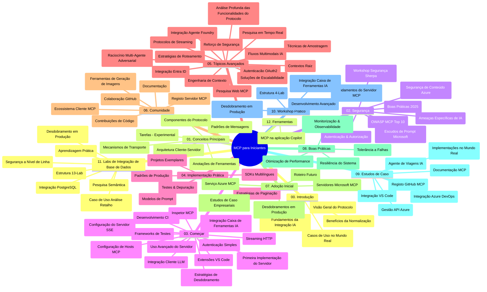

# Protocolo de Contexto do Modelo (MCP) para Iniciantes - Guia de Estudo

Este guia de estudo fornece uma visão geral da estrutura e conteúdo do repositório para o currículo "Protocolo de Contexto do Modelo (MCP) para Iniciantes". Utilize este guia para navegar eficientemente pelo repositório e tirar o máximo proveito dos recursos disponíveis.

## Visão Geral do Repositório

O Protocolo de Contexto do Modelo (MCP) é um framework padronizado para interações entre modelos de IA e aplicações cliente. Inicialmente criado pela Anthropic, o MCP é agora mantido pela comunidade mais ampla do MCP através da organização oficial no GitHub. Este repositório oferece um currículo abrangente com exemplos práticos de código em C#, Java, JavaScript, Python e TypeScript, direcionado a desenvolvedores de IA, arquitetos de sistemas e engenheiros de software.

## Mapa Visual do Currículo

## Estrutura do Repositório

O repositório está organizado em doze secções principais, cada uma focada em diferentes aspetos do MCP:

1. **Introdução (00-Introduction/)**
   - Visão geral do Protocolo de Contexto do Modelo
   - Por que a padronização é importante em pipelines de IA
   - Casos práticos de uso e benefícios

2. **Conceitos Principais (01-CoreConcepts/)**
   - Arquitetura cliente-servidor
   - Componentes chave do protocolo
   - Padrões de mensagens no MCP

3. **Segurança (02-Security/)**
   - Ameaças de segurança em sistemas baseados em MCP
   - Melhores práticas para segurar implementações
   - Estratégias de autenticação e autorização
   - **Documentação Completa de Segurança**:
     - Melhores Práticas de Segurança MCP 2025
     - Guia de Implementação Azure Content Safety
     - Controlo e Técnicas de Segurança MCP
     - Referência Rápida de Melhores Práticas MCP
   - **Tópicos-Chave de Segurança**:
     - Injeção de prompts e ataques de envenenamento de ferramentas
     - Sequestro de sessão e problemas de procurador confundido
     - Vulnerabilidades no pass-through de tokens
     - Permissões excessivas e controlo de acesso
     - Segurança da cadeia de fornecimento para componentes de IA
     - Integração Microsoft Prompt Shields

4. **Introdução Prática (03-GettingStarted/)**
   - Configuração e preparação do ambiente
   - Criação de servidores e clientes MCP básicos
   - Integração com aplicações existentes
   - Inclui secções para:
     - Primeira implementação de servidor
     - Desenvolvimento de cliente
     - Integração de cliente LLM
     - Integração com VS Code
     - Servidor Server-Sent Events (SSE)
     - Uso avançado de servidores
     - Streaming HTTP
     - Integração AI Toolkit
     - Estratégias de teste
     - Diretrizes de deployment

5. **Implementação Prática (04-PracticalImplementation/)**
   - Uso de SDKs em diferentes linguagens de programação
   - Técnicas de debugging, teste e validação
   - Criação de templates reutilizáveis de prompts e fluxos de trabalho
   - Projetos de exemplo com exemplos de implementação

6. **Tópicos Avançados (05-AdvancedTopics/)**
   - Técnicas de engenharia de contexto
   - Integração do agente Foundry
   - Workflows de IA multimodais
   - Demonstrações de autenticação OAuth2
   - Capacidades de pesquisa em tempo real
   - Streaming em tempo real
   - Implementação de contextos raiz
   - Estratégias de roteamento
   - Técnicas de amostragem
   - Abordagens de escalabilidade
   - Considerações de segurança
   - Integração de segurança Entra ID
   - Integração de pesquisa web
   - Raciocínio adversarial multi-agente (padrões de debate)

7. **Contribuições da Comunidade (06-CommunityContributions/)**
   - Como contribuir com código e documentação
   - Colaboração via GitHub
   - Melhorias e feedback baseados na comunidade
   - Uso de vários clientes MCP (Claude Desktop, Cline, VSCode)
   - Trabalho com servidores MCP populares incluindo geração de imagens

8. **Lições da Adoção Inicial (07-LessonsfromEarlyAdoption/)**
   - Implementações reais e histórias de sucesso
   - Construção e deployment de soluções baseadas em MCP
   - Tendências e roadmap futuro
   - **Guia dos Servidores MCP da Microsoft**: Guia abrangente de 10 servidores MCP Microsoft prontos para produção incluindo:
     - Servidor MCP Microsoft Learn Docs
     - Servidor MCP Azure (15+ conectores especializados)
     - Servidor MCP GitHub
     - Servidor MCP Azure DevOps
     - Servidor MCP MarkItDown
     - Servidor MCP SQL Server
     - Servidor MCP Playwright
     - Servidor MCP Dev Box
     - Servidor MCP Microsoft Foundry
     - Servidor MCP Microsoft 365 Agents Toolkit

9. **Melhores Práticas (08-BestPractices/)**
   - Otimização de desempenho e afinação
   - Design de sistemas MCP tolerantes a falhas
   - Estratégias de teste e resiliência

10. **Estudos de Caso (09-CaseStudy/)**
    - **Sete estudos de caso abrangentes** demonstrando a versatilidade do MCP em diversos cenários:
    - **Agentes de Viagem Azure AI**: Orquestração multi-agente com Azure OpenAI e AI Search
    - **Integração Azure DevOps**: Automação de processos de workflow com atualizações de dados YouTube
    - **Recuperação de Documentação em Tempo Real**: Cliente console Python com streaming HTTP
    - **Gerador Interativo de Plano de Estudo**: Aplicação web Chainlit com IA conversacional
    - **Documentação no Editor**: Integração VS Code com workflows GitHub Copilot
    - **Gestão de API Azure**: Integração empresarial de APIs com criação de servidor MCP
    - **Registro MCP GitHub**: Desenvolvimento do ecossistema e plataforma de integração agentic
    - Exemplos de implementação abrangendo integração empresarial, produtividade do desenvolvedor e desenvolvimento de ecossistema

11. **Workshop Prático (10-StreamliningAIWorkflowsBuildingAnMCPServerWithAIToolkit/)**
    - Workshop prático abrangente combinando MCP com AI Toolkit
    - Construção de aplicações inteligentes que ligam modelos de IA a ferramentas do mundo real
    - Módulos práticos cobrindo fundamentos, desenvolvimento de servidor customizado e estratégias de deployment em produção
    - **Estrutura do Lab**:
      - Lab 1: Fundamentos do Servidor MCP
      - Lab 2: Desenvolvimento Avançado do Servidor MCP
      - Lab 3: Integração AI Toolkit
      - Lab 4: Deployment e Escalabilidade em Produção
    - Abordagem de aprendizagem baseada em labs com instruções passo a passo

12. **Labs de Integração de Banco de Dados em Servidor MCP (11-MCPServerHandsOnLabs/)**
    - **Caminho de aprendizagem abrangente com 13 labs** para construir servidores MCP prontos para produção com integração PostgreSQL
    - **Implementação real em análise de retalho** usando o caso de uso Zava Retail
    - **Padrões empresariais** incluindo Row Level Security (RLS), pesquisa semântica e acesso multi-tenant a dados
    - **Estrutura Completa do Lab**:
      - **Labs 00-03: Fundamentos** - Introdução, Arquitetura, Segurança, Configuração do Ambiente
      - **Labs 04-06: Construção do Servidor MCP** - Design de Base de Dados, Implementação do Servidor MCP, Desenvolvimento de Ferramentas
      - **Labs 07-09: Funcionalidades Avançadas** - Pesquisa Semântica, Testes & Debugging, Integração VS Code
      - **Labs 10-12: Produção & Melhores Práticas** - Deployment, Monitorização, Otimização
    - **Tecnologias Cobertas**: Framework FastMCP, PostgreSQL, Azure OpenAI, Azure Container Apps, Application Insights
    - **Resultados de Aprendizagem**: Servidores MCP prontos para produção, padrões de integração de base de dados, análises potenciadas por IA, segurança empresarial

13. **Ferramentas (12-tooling/)**
    - Aprenda a usar MCP na aplicação Copilot e outras ferramentas

## Recursos Adicionais

O repositório inclui recursos de apoio:

- **Pasta Imagens**: Contém diagramas e ilustrações usadas ao longo do currículo
- **Traduções**: Suporte multilíngue com traduções automáticas da documentação
- **Recursos Oficiais MCP**:
  - [Documentação MCP](https://modelcontextprotocol.io/)
  - [Especificação MCP](https://spec.modelcontextprotocol.io/)
  - [Repositório MCP GitHub](https://github.com/modelcontextprotocol)

## Como Utilizar Este Repositório

1. **Aprendizagem Sequencial**: Siga os capítulos por ordem (00 até 11) para uma experiência de aprendizagem estruturada.
2. **Foco em Linguagem Específica**: Se estiver interessado numa linguagem de programação particular, explore as pastas de exemplos para implementações na sua linguagem preferida.
3. **Implementação Prática**: Comece pela secção "Introdução Prática" para configurar o ambiente e criar o seu primeiro servidor e cliente MCP.
4. **Exploração Avançada**: Quando estiver confortável com o básico, aprofunde os tópicos avançados para expandir o seu conhecimento.
5. **Envolvimento na Comunidade**: Junte-se à comunidade MCP através das discussões no GitHub e canais Discord para conectar-se com especialistas e outros desenvolvedores.

## Clientes e Ferramentas MCP

O currículo cobre vários clientes e ferramentas MCP:

1. **Clientes Oficiais**:
   - Visual Studio Code 
   - MCP no Visual Studio Code
   - Claude Desktop
   - Claude no VSCode 
   - Claude API

2. **Clientes da Comunidade**:
   - Cline (baseado em terminal)
   - Cursor (editor de código)
   - ChatMCP
   - Windsurf

3. **Ferramentas de Gestão MCP**:
   - MCP CLI
   - MCP Manager
   - MCP Linker
   - MCP Router

## Servidores MCP Populares

O repositório apresenta vários servidores MCP, incluindo:

1. **Servidores MCP Oficiais Microsoft**:
   - Servidor MCP Microsoft Learn Docs
   - Servidor MCP Azure (15+ conectores especializados)
   - Servidor MCP GitHub
   - Servidor MCP Azure DevOps
   - Servidor MCP MarkItDown
   - Servidor MCP SQL Server
   - Servidor MCP Playwright
   - Servidor MCP Dev Box
   - Servidor MCP Microsoft Foundry
   - Servidor MCP Microsoft 365 Agents Toolkit

2. **Servidores de Referência Oficiais**:
   - Filesystem
   - Fetch
   - Memory
   - Sequential Thinking

3. **Geração de Imagens**:
   - Azure OpenAI DALL-E 3
   - Stable Diffusion WebUI
   - Replicate

4. **Ferramentas de Desenvolvimento**:
   - Git MCP
   - Terminal Control
   - Code Assistant

5. **Servidores Especializados**:
   - Salesforce
   - Microsoft Teams
   - Jira & Confluence

## Contribuir

Este repositório acolhe contribuições da comunidade. Veja a secção Contribuições da Comunidade para orientações sobre como contribuir eficazmente para o ecossistema MCP.

----

*Este guia de estudo foi atualizado pela última vez em 5 de fevereiro de 2026, refletindo a mais recente Especificação MCP 2025-11-25 e fornece uma visão geral do repositório até àquela data. O conteúdo do repositório pode ser atualizado após esta data.*

---

<!-- CO-OP TRANSLATOR DISCLAIMER START -->
**Aviso Legal**:
Este documento foi traduzido utilizando o serviço de tradução automática [Co-op Translator](https://github.com/Azure/co-op-translator). Embora nos esforcemos pela precisão, esteja ciente de que traduções automáticas podem conter erros ou imprecisões. O documento original na sua língua nativa deve ser considerado a fonte autorizada. Para informações críticas, recomenda-se tradução profissional humana. Não nos responsabilizamos por quaisquer mal-entendidos ou interpretações incorretas resultantes da utilização desta tradução.
<!-- CO-OP TRANSLATOR DISCLAIMER END -->