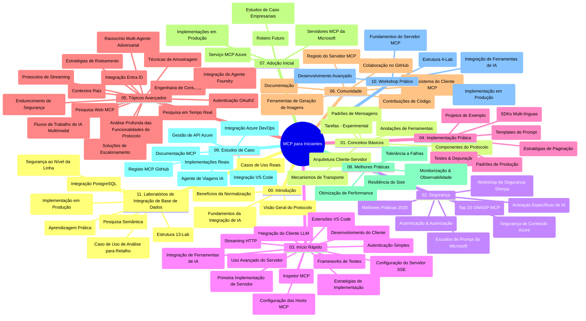

# Model Context Protocol (MCP) para Iniciantes - Guia de Estudo

Este guia de estudo fornece uma visão geral da estrutura e do conteúdo do repositório para o currículo "Model Context Protocol (MCP) para Iniciantes". Utilize este guia para navegar eficientemente pelo repositório e tirar o máximo partido dos recursos disponíveis.

## Visão Geral do Repositório

O Model Context Protocol (MCP) é uma estrutura padronizada para interações entre modelos de IA e aplicações clientes. Inicialmente criado pela Anthropic, o MCP é agora mantido pela comunidade mais ampla através da organização oficial no GitHub. Este repositório oferece um currículo abrangente com exemplos práticos em C#, Java, JavaScript, Python e TypeScript, destinado a desenvolvedores de IA, arquitetos de sistemas e engenheiros de software.

## Mapa Visual do Currículo

## Estrutura do Repositório

O repositório está organizado em onze secções principais, cada uma focada em diferentes aspetos do MCP:

1. **Introdução (00-Introduction/)**
   - Visão geral do Model Context Protocol
   - Por que a padronização é importante em pipelines de IA
   - Casos práticos e benefícios

2. **Conceitos Centrais (01-CoreConcepts/)**
   - Arquitetura cliente-servidor
   - Componentes-chave do protocolo
   - Padrões de mensagens no MCP

3. **Segurança (02-Security/)**
   - Ameaças de segurança em sistemas baseados em MCP
   - Melhores práticas para garantir a segurança nas implementações
   - Estratégias de autenticação e autorização
   - **Documentação Abrangente de Segurança**:
     - Práticas recomendadas de segurança MCP 2025
     - Guia de Implementação do Azure Content Safety
     - Controles e Técnicas de Segurança MCP
     - Referência rápida das melhores práticas MCP
   - **Principais Temas de Segurança**:
     - Injeção de prompts e ataques de envenenamento de ferramentas
     - Sequestro de sessão e problemas de delegado confuso
     - Vulnerabilidades de passagem de tokens
     - Permissões excessivas e controlo de acessos
     - Segurança da cadeia de fornecimento para componentes de IA
     - Integração dos Microsoft Prompt Shields

4. **Começar (03-GettingStarted/)**
   - Configuração e preparação do ambiente
   - Criação de servidores e clientes MCP básicos
   - Integração com aplicações existentes
   - Inclui secções para:
     - Primeira implementação de servidor
     - Desenvolvimento de cliente
     - Integração com cliente LLM
     - Integração no VS Code
     - Servidor Server-Sent Events (SSE)
     - Utilização avançada do servidor
     - Streaming HTTP
     - Integração com AI Toolkit
     - Estratégias de testes
     - Diretrizes de implementação

5. **Implementação Prática (04-PracticalImplementation/)**
   - Uso de SDKs em várias linguagens de programação
   - Técnicas de debugging, testes e validação
   - Criação de templates de prompt reutilizáveis e workflows
   - Projetos exemplares com exemplos de implementação

6. **Tópicos Avançados (05-AdvancedTopics/)**
   - Técnicas de engenharia de contexto
   - Integração com agente Foundry
   - Workflows multimodais de IA
   - Demonstrações de autenticação OAuth2
   - Capacidades de pesquisa em tempo real
   - Streaming em tempo real
   - Implementação de contextos raiz
   - Estratégias de routing
   - Técnicas de sampling
   - Abordagens de escalabilidade
   - Considerações de segurança
   - Integração com segurança Entra ID
   - Integração de pesquisa web
   - Raciocínio multi-agente adversarial (padrões de debate)

7. **Contribuições da Comunidade (06-CommunityContributions/)**
   - Como contribuir com código e documentação
   - Colaboração via GitHub
   - Melhorias e feedback orientados pela comunidade
   - Utilização de vários clientes MCP (Claude Desktop, Cline, VSCode)
   - Trabalho com servidores MCP populares, incluindo geração de imagens

8. **Lições da Adoção Inicial (07-LessonsfromEarlyAdoption/)**
   - Implementações reais e histórias de sucesso
   - Construção e implementação de soluções baseadas em MCP
   - Tendências e roadmap futuro
   - **Guia de Servidores MCP Microsoft**: Guia completo para 10 servidores MCP Microsoft prontos para produção incluindo:
     - Microsoft Learn Docs MCP Server
     - Azure MCP Server (15+ conectores especializados)
     - GitHub MCP Server
     - Azure DevOps MCP Server
     - MarkItDown MCP Server
     - SQL Server MCP Server
     - Playwright MCP Server
     - Dev Box MCP Server
     - Microsoft Foundry MCP Server
     - Microsoft 365 Agents Toolkit MCP Server

9. **Melhores Práticas (08-BestPractices/)**
   - Otimização e tune de desempenho
   - Design de sistemas MCP tolerantes a falhas
   - Estratégias de testes e resiliência

10. **Estudos de Caso (09-CaseStudy/)**
    - **Sete estudos de caso abrangentes** demonstrando a versatilidade do MCP em diversos cenários:
    - **Azure AI Travel Agents**: Orquestração multi-agente com Azure OpenAI e AI Search
    - **Integração Azure DevOps**: Automação de processos de workflow com atualizações de dados do YouTube
    - **Recuperação de Documentação em Tempo Real**: Cliente consola Python com streaming HTTP
    - **Gerador Interativo de Plano de Estudos**: Aplicação web Chainlit com IA conversacional
    - **Documentação no Editor**: Integração VS Code com workflows GitHub Copilot
    - **Gestão Azure API**: Integração empresarial de API com criação de servidor MCP
    - **Registo GitHub MCP**: Desenvolvimento de ecossistema e plataforma de integração agente
    - Exemplos de implementação abrangendo integração empresarial, produtividade de desenvolvedores e desenvolvimento de ecossistema

11. **Workshop Prático (10-StreamliningAIWorkflowsBuildingAnMCPServerWithAIToolkit/)**
    - Workshop prático completo combinando MCP com AI Toolkit
    - Construção de aplicações inteligentes que ligam modelos de IA a ferramentas do mundo real
    - Módulos práticos cobrindo fundamentos, desenvolvimento de servidor personalizado e estratégias de implantação em produção
    - **Estrutura do Laboratório**:
      - Laboratório 1: Fundamentos do Servidor MCP
      - Laboratório 2: Desenvolvimento Avançado de Servidor MCP
      - Laboratório 3: Integração AI Toolkit
      - Laboratório 4: Implantação e Escalabilidade em Produção
    - Abordagem de aprendizagem baseada em laboratórios com instruções passo a passo

12. **Laboratórios de Integração de Base de Dados MCP Server (11-MCPServerHandsOnLabs/)**
    - **Percurso de aprendizagem com 13 laboratórios abrangentes** para construção de servidores MCP prontos para produção com integração PostgreSQL
    - **Implementação real de análise para retalho** utilizando o caso de uso Zava Retail
    - **Padrões empresariais** incluindo Row Level Security (RLS), pesquisa semântica e acesso multi-inquilino a dados
    - **Estrutura Completa do Laboratório**:
      - **Laboratórios 00-03: Fundamentos** - Introdução, Arquitetura, Segurança, Configuração do Ambiente
      - **Laboratórios 04-06: Construção do Servidor MCP** - Design da Base de Dados, Implementação do Servidor MCP, Desenvolvimento de Ferramentas
      - **Laboratórios 07-09: Funcionalidades Avançadas** - Pesquisa Semântica, Testes & Debugging, Integração VS Code
      - **Laboratórios 10-12: Produção & Melhores Práticas** - Implantação, Monitorização, Otimização
    - **Tecnologias Abrangidas**: Framework FastMCP, PostgreSQL, Azure OpenAI, Azure Container Apps, Application Insights
    - **Resultados de aprendizagem**: Servidores MCP prontos para produção, padrões de integração de bases de dados, análises potenciadas por IA, segurança empresarial

## Recursos Adicionais

O repositório inclui recursos de apoio:

- **Pasta de imagens**: Contém diagramas e ilustrações utilizadas ao longo do currículo
- **Traduções**: Suporte multilíngue com traduções automáticas da documentação
- **Recursos oficiais MCP**:
  - [Documentação MCP](https://modelcontextprotocol.io/)
  - [Especificação MCP](https://spec.modelcontextprotocol.io/)
  - [Repositório GitHub MCP](https://github.com/modelcontextprotocol)

## Como Usar Este Repositório

1. **Aprendizagem Sequencial**: Siga os capítulos por ordem (00 a 11) para uma experiência estruturada.
2. **Foco em Linguagem Específica**: Se estiver interessado numa linguagem de programação particular, explore os diretórios de exemplos para implementações na sua linguagem preferida.
3. **Implementação Prática**: Comece pela secção "Começar" para configurar o ambiente e criar o seu primeiro servidor e cliente MCP.
4. **Exploração Avançada**: Depois de familiarizado com o básico, explore os tópicos avançados para expandir o seu conhecimento.
5. **Envolvimento na Comunidade**: Junte-se à comunidade MCP através das discussões no GitHub e canais Discord para conectar-se com especialistas e outros desenvolvedores.

## Clientes e Ferramentas MCP

O currículo cobre vários clientes e ferramentas MCP:

1. **Clientes Oficiais**:
   - Visual Studio Code 
   - MCP no Visual Studio Code
   - Claude Desktop
   - Claude no VSCode
   - Claude API

2. **Clientes da Comunidade**:
   - Cline (baseado em terminal)
   - Cursor (editor de código)
   - ChatMCP
   - Windsurf

3. **Ferramentas de Gestão MCP**:
   - MCP CLI
   - MCP Manager
   - MCP Linker
   - MCP Router

## Servidores MCP Populares

O repositório apresenta vários servidores MCP, incluindo:

1. **Servidores Oficiais Microsoft MCP**:
   - Microsoft Learn Docs MCP Server
   - Azure MCP Server (15+ conectores especializados)
   - GitHub MCP Server
   - Azure DevOps MCP Server
   - MarkItDown MCP Server
   - SQL Server MCP Server
   - Playwright MCP Server
   - Dev Box MCP Server
   - Microsoft Foundry MCP Server
   - Microsoft 365 Agents Toolkit MCP Server

2. **Servidores de Referência Oficiais**:
   - Filesystem
   - Fetch
   - Memory
   - Sequential Thinking

3. **Geração de Imagens**:
   - Azure OpenAI DALL-E 3
   - Stable Diffusion WebUI
   - Replicate

4. **Ferramentas de Desenvolvimento**:
   - Git MCP
   - Terminal Control
   - Code Assistant

5. **Servidores Especializados**:
   - Salesforce
   - Microsoft Teams
   - Jira & Confluence

## Contribuir

Este repositório acolhe contribuições da comunidade. Consulte a secção de Contribuições da Comunidade para orientações sobre como contribuir eficazmente para o ecossistema MCP.

----

*Este guia de estudo foi atualizado pela última vez em 5 de fevereiro de 2026, refletindo a mais recente Especificação MCP 2025-11-25 e fornece uma visão geral do repositório a partir dessa data. O conteúdo do repositório pode ser atualizado posteriormente a esta data.*

---

<!-- CO-OP TRANSLATOR DISCLAIMER START -->
**Aviso Legal**:
Este documento foi traduzido utilizando o serviço de tradução automática [Co-op Translator](https://github.com/Azure/co-op-translator). Embora nos esforcemos pela precisão, esteja ciente de que traduções automáticas podem conter erros ou imprecisões. O documento original na sua língua nativa deve ser considerado a fonte autorizada. Para informações críticas, recomenda-se tradução profissional humana. Não nos responsabilizamos por quaisquer mal-entendidos ou interpretações incorretas resultantes da utilização desta tradução.
<!-- CO-OP TRANSLATOR DISCLAIMER END -->