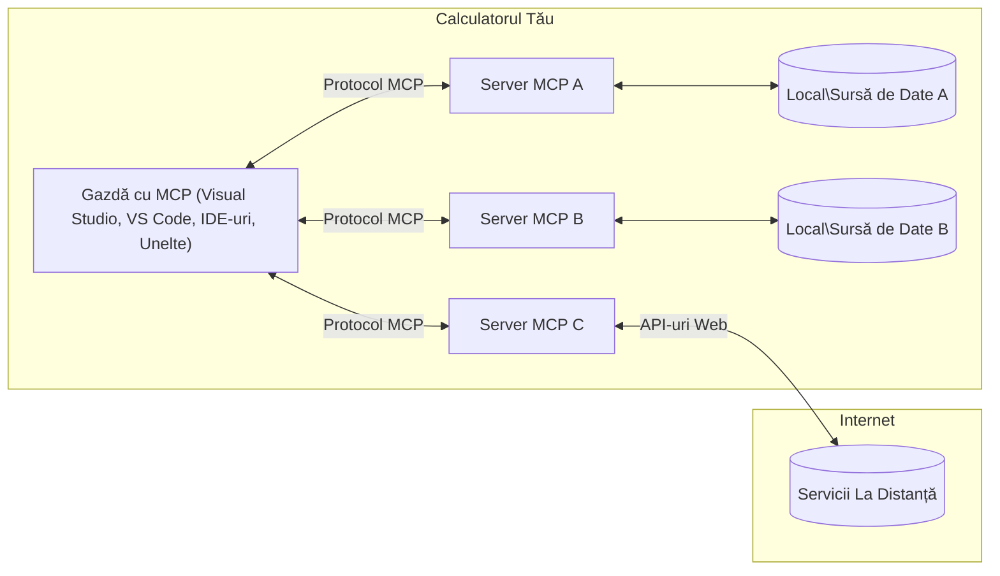

# Concepte de bază MCP: Stăpânirea Protocolului Contextului Modelului pentru Integrarea AI

[](https://youtu.be/earDzWGtE84)

_(Faceți clic pe imaginea de mai sus pentru a vizualiza videoclipul acestei lecții)_

[Model Context Protocol (MCP)](https://github.com/modelcontextprotocol) este un cadru puternic și standardizat care optimizează comunicarea între Modelele Mari de Limbaj (LLM) și unelte, aplicații și surse de date externe.  
Acest ghid vă va conduce prin conceptele de bază ale MCP. Veți învăța despre arhitectura client-server, componentele esențiale, mecanismele de comunicare și cele mai bune practici de implementare.

- **Consimțământ Explicit al Utilizatorului**: Tot accesul la date și operațiunile necesită aprobarea explicită a utilizatorului înainte de execuție. Utilizatorii trebuie să înțeleagă clar ce date vor fi accesate și ce acțiuni vor fi efectuate, cu control granular asupra permisiunilor și autorizărilor.

- **Protecția Confidențialității Datelor**: Datele utilizatorului sunt expuse doar cu consimțământ explicit și trebuie protejate prin controale robuste de acces pe întreaga durată a interacțiunii. Implementările trebuie să prevină transmiterea neautorizată a datelor și să mențină limite stricte de confidențialitate.

- **Siguranța Execuției Uneltelor**: Fiecare invocare a unei unelte necesită consimțământ explicit al utilizatorului cu o înțelegere clară a funcționalității, parametrilor și impactului potențial al uneltei. Limitele robuste de securitate trebuie să prevină execuțiile neintenționate, nesigure sau malițioase ale uneltelor.

- **Securitatea Stratului de Transport**: Toate canalele de comunicare ar trebui să utilizeze mecanisme adecvate de criptare și autentificare. Conexiunile la distanță trebuie să implementeze protocoale de transport securizate și gestionare corespunzătoare a credențialelor.

#### Ghiduri de Implementare:

- **Gestionarea Permisiunilor**: Implementați sisteme de permisiuni detaliate care permit utilizatorilor să controleze ce servere, unelte și resurse sunt accesibile  
- **Autentificare & Autorizare**: Folosiți metode sigure de autentificare (OAuth, chei API) cu gestionarea adecvată a tokenurilor și expirarea acestora  
- **Validarea Intrărilor**: Validați toți parametrii și datele de intrare conform schemelor definite pentru a preveni atacurile de tip injecție  
- **Înregistrare Audit**: Mențineți jurnale cuprinzătoare ale tuturor operațiunilor pentru monitorizarea securității și conformitate

## Prezentare generală

Această lecție explorează arhitectura fundamentală și componentele care formează ecosistemul Model Context Protocol (MCP). Veți învăța despre arhitectura client-server, componentele cheie și mecanismele de comunicare care alimentează interacțiunile MCP.

## Obiective cheie de învățare

La finalul acestei lecții veți:

- Înțelege arhitectura client-server MCP.  
- Identifica rolurile și responsabilitățile gazdelor, clienților și serverelor.  
- Analiza funcționalitățile de bază care fac din MCP un strat flexibil de integrare.  
- Înțelege fluxul informațional în cadrul ecosistemului MCP.  
- Dobândi perspective practice prin exemple de cod în .NET, Java, Python și JavaScript.

## Arhitectura MCP: O privire mai detaliată

Ecosistemul MCP este construit pe un model client-server. Această structură modulară permite aplicațiilor AI să interacționeze eficient cu unelte, baze de date, API-uri și resurse contextuale. Să descompunem această arhitectură în componentele sale de bază.

La bază, MCP urmează o arhitectură client-server prin care o aplicație gazdă se poate conecta la multiple servere:


- **Gazdele MCP**: Programe precum VSCode, Claude Desktop, IDE-uri sau unelte AI care doresc să acceseze date prin MCP  
- **Clienții MCP**: Clienți de protocol ce mențin conexiuni 1:1 cu serverele  
- **Serverele MCP**: Programe ușoare care expun capacități specifice prin protocolul standardizat Model Context Protocol  
- **Surse locale de date**: Fișierele, bazele de date și serviciile calculatorului dvs. la care serverele MCP pot accesa în siguranță  
- **Servicii la distanță**: Sisteme externe disponibile prin internet la care serverele MCP se pot conecta prin API-uri.

Protocolul MCP este un standard aflat în evoluție, care folosește versiuni bazate pe dată (format YYYY-MM-DD). Versiunea curentă a protocolului este **2025-11-25**. Puteți vedea ultimele actualizări la [specificația protocolului](https://modelcontextprotocol.io/specification/2025-11-25/)

### 1. Gazde

În Model Context Protocol (MCP), **Gazdele** sunt aplicații AI care servesc ca interfața principală prin care utilizatorii interacționează cu protocolul. Gazdele coordonează și gestionează conexiunile către multiple servere MCP prin crearea unor clienți MCP dedicați pentru fiecare conexiune la server. Exemple de gazde includ:

- **Aplicații AI**: Claude Desktop, Visual Studio Code, Claude Code  
- **Mediile de dezvoltare**: IDE-uri și editoare de cod cu integrare MCP  
- **Aplicații personalizate**: Agenți AI și unelte specializate construite pentru scopuri particulare

**Gazdele** sunt aplicații care coordonează interacțiunile cu modelele AI. Ele:

- **Orchestrationează modelele AI**: Rulează sau interacționează cu LLM-uri pentru a genera răspunsuri și coordona fluxuri AI  
- **Gestionarea conexiunilor client**: Creează și mențin câte un client MCP pentru fiecare conexiune către server MCP  
- **Controlează interfața utilizator**: Gestionează fluxul conversației, interacțiunile utilizatorului și prezentarea răspunsurilor  
- **Aplică securitatea**: Controlează permisiunile, constrângerile de securitate și autentificarea  
- **Gestionează consimțământul utilizatorului**: Administrează aprobarea utilizatorului pentru partajarea datelor și execuția uneltelor  

### 2. Clienți

**Clienții** sunt componente esențiale care mențin conexiuni dedicate unu-la-unu între Gazde și serverele MCP. Fiecare client MCP este instanțiat de Gazdă pentru a se conecta la un server MCP specific, asigurând canale de comunicare organizate și sigure. Mai mulți clienți permit Gazdelor să se conecteze simultan la mai multe servere.

**Clienții** sunt componente de conectare din cadrul aplicației gazdă. Ei:

- **Comunicare protocol**: Trimit cereri JSON-RPC 2.0 către servere cu prompturi și instrucțiuni  
- **Negocierea capacităților**: Negociază funcționalitățile și versiunile de protocol acceptate cu serverele la inițializare  
- **Execuția uneltelor**: Gestionează cererile de execuție unelte de la modele și procesează răspunsurile  
- **Actualizări în timp real**: Preiau notificări și actualizări în timp real de la servere  
- **Procesarea răspunsurilor**: Procesează și formatează răspunsurile serverelor pentru afișarea către utilizatori

### 3. Servere

**Serverele** sunt programe care oferă context, unelte și capabilități clienților MCP. Ele pot rula local (pe aceeași mașină ca Gazda) sau remote (pe platforme externe), fiind responsabile pentru gestionarea cererilor clienților și oferirea de răspunsuri structurate. Serverele expun funcționalități specifice prin protocolul standardizat Model Context Protocol.

**Serverele** sunt servicii care oferă context și capabilități. Ele:

- **Înregistrarea funcționalităților**: Înregistrează și expun primitive disponibile (resurse, prompturi, unelte) către clienți  
- **Procesarea cererilor**: Primesc și execută apeluri unelte, cereri de resurse și prompturi de la clienți  
- **Furnizarea contextului**: Oferă informații contextuale și date pentru a îmbunătăți răspunsurile modelelor  
- **Gestionarea stării**: Mențin starea sesiunii și gestionează interacțiuni cu stare când este necesar  
- **Notificări în timp real**: Trimit notificări despre schimbări și actualizări ale capabilităților către clienții conectați

Serverele pot fi dezvoltate de oricine pentru a extinde capabilitățile modelelor cu funcționalitate specializată și suportă scenarii de implementare locală și remote.

### 4. Primitivele Serverului

Serverele din Model Context Protocol (MCP) oferă trei **primitive** de bază care definesc blocurile fundamentale pentru interacțiuni bogate între clienți, gazde și modelele de limbaj. Aceste primitive specifică tipurile de informații contextuale și acțiunile disponibile prin protocol.

Serverele MCP pot expune orice combinație dintre următoarele trei primitive de bază:

#### Resurse

**Resursele** sunt surse de date care oferă informații contextuale aplicațiilor AI. Ele reprezintă conținut static sau dinamic care poate îmbunătăți înțelegerea modelului și luarea deciziilor:

- **Date contextuale**: Informații structurate și context pentru consumul modelului AI  
- **Baze de cunoștințe**: Repozitorii de documente, articole, manuale și lucrări de cercetare  
- **Surse locale de date**: Fișiere, baze de date și informații ale sistemului local  
- **Date externe**: Răspunsuri API, servicii web și date ale sistemelor la distanță  
- **Conținut dinamic**: Date în timp real care se actualizează pe baza condițiilor externe

Resursele sunt identificate prin URI-uri și suportă descoperirea prin metodele `resources/list` și recuperarea prin `resources/read`:

```text
file://documents/project-spec.md
database://production/users/schema
api://weather/current
```

#### Prompturi

**Prompturile** sunt șabloane reutilizabile care ajută la structurarea interacțiunilor cu modelele de limbaj. Ele oferă modele de interacțiune standardizate și fluxuri de lucru șablonizate:

- **Interacțiuni bazate pe șabloane**: Mesaje pre-structurate și începuturi de conversație  
- **Șabloane de fluxuri de lucru**: Secvențe standardizate pentru sarcini și interacțiuni comune  
- **Exemple few-shot**: Șabloane bazate pe exemple pentru instrucțiuni către model  
- **Prompturi de sistem**: Prompturi fundamentale care definesc comportamentul și contextul modelului  
- **Șabloane dinamice**: Prompturi parametrizate care se adaptează la contexte specifice

Prompturile suportă substituția variabilelor și pot fi descoperite prin `prompts/list` și recuperate cu `prompts/get`:

```markdown
Generate a {{task_type}} for {{product}} targeting {{audience}} with the following requirements: {{requirements}}
```

#### Unelte

**Uneltele** sunt funcții executabile pe care modelele AI le pot invoca pentru a realiza acțiuni specifice. Ele reprezintă „verbele” ecosistemului MCP, permițând modelelor să interacționeze cu sisteme externe:

- **Funcții executabile**: Operații discrete pe care modelele le pot invoca cu parametri specifici  
- **Integrare cu sisteme externe**: Apeluri API, interogări de baze de date, operațiuni pe fișiere, calcule  
- **Identitate unică**: Fiecare unealtă are un nume distinct, descriere și schemă de parametri  
- **Intrări/ieșiri structurate**: Uneltele acceptă parametri validați și returnează răspunsuri structurate, tipizate  
- **Capabilități de acțiune**: Permit modelelor să efectueze acțiuni reale și să recupereze date live

Uneltele sunt definite cu JSON Schema pentru validarea parametrilor și sunt descoperite prin `tools/list` și executate prin `tools/call`. Uneltele pot include și **icoane** ca metadata suplimentară pentru o prezentare UI mai bună.

**Anotări pentru unelte**: Uneltele suportă adnotări privind comportamentul (ex. `readOnlyHint`, `destructiveHint`) care descriu dacă unealta este doar pentru citire sau destructivă, ajutând clienții să ia decizii informate despre execuția uneltei.

Exemplu de definire a unei unelte:

```typescript
server.tool(
  "search_products", 
  {
    query: z.string().describe("Search query for products"),
    category: z.string().optional().describe("Product category filter"),
    max_results: z.number().default(10).describe("Maximum results to return")
  }, 
  async (params) => {
    // Execută căutarea și returnează rezultate structurate
    return await productService.search(params);
  }
);
```

## Primitivele Clientului

În Model Context Protocol (MCP), **clienții** pot expune primitive care permit serverelor să solicite capabilități suplimentare din aplicația gazdă. Aceste primitive pe partea clientului permit implementări server mai bogate și interactive care pot accesa capabilitățile modelului AI și interacțiunile utilizatorului.

### Sampling

**Sampling** permite serverelor să solicite completări ale modelului de limbaj din aplicația AI a clientului. Această primitivă oferă serverelor acces la capabilitățile LLM fără a include propriile dependențe de model:

- **Acces independent de model**: Serverele pot solicita completări fără să integreze SDK-uri LLM sau să gestioneze accesul la model  
- **AI inițiată de server**: Permite serverelor să genereze conținut autonom folosind modelul AI al clientului  
- **Interacțiuni recursive LLM**: Sprijină scenarii complexe unde serverele necesită asistență AI pentru procesare  
- **Generare dinamică de conținut**: Permite serverelor să creeze răspunsuri contextuale folosind modelul gazdei  
- **Suport pentru apeluri unelte**: Serverele pot include parametri `tools` și `toolChoice` ca să permită modelului client să invoce unelte în timpul sampling-ului

Sampling-ul este inițiat prin metoda `sampling/complete`, unde serverele trimit cereri de completare către clienți.

### Rădăcini (Roots)

**Roots** oferă o metodă standardizată pentru clienți de a expune limitele sistemului de fișiere către servere, ajutând aceste servere să înțeleagă ce directoare și fișiere au acces:

- **Limite ale sistemului de fișiere**: Definirea limitelor în care serverele pot opera în cadrul sistemului de fișiere  
- **Control al accesului**: Ajută serverele să înțeleagă la ce directoare și fișiere au permisiune să acceseze  
- **Actualizări dinamice**: Clienții pot notifica serverele când lista rădăcinilor se schimbă  
- **Identificare bazată pe URI-uri**: Roots folosesc URI-uri `file://` pentru a identifica directoarele și fișierele accesibile

Roots sunt descoperite prin metoda `roots/list`, iar clienții trimit notificări `notifications/roots/list_changed` când rădăcinile se modifică.

### Elicitation  

**Elicitation** permite serverelor să solicite informații suplimentare sau confirmări de la utilizatori prin interfața clientului:

- **Solicitări de input utilizator**: Serverele pot cere informații suplimentare când acestea sunt necesare pentru execuția uneltei  
- **Dialoguri de confirmare**: Solicită aprobarea utilizatorului pentru operațiuni sensibile sau cu impact mare  
- **Fluxuri de lucru interactive**: Permit serverelor să creeze interacțiuni pas cu pas pentru utilizatori  
- **Colectarea parametrilor dinamici**: Strâng parametri lipsă sau opționali în timpul execuției uneltei

Cererea de elicitation se face folosind metoda `elicitation/request` pentru a colecta input de la utilizator prin interfața clientului.

**Elicitation în modul URL**: Serverele pot solicita și interacțiuni cu utilizatorul pe bază de URL, permițând direcționarea utilizatorilor către pagini web externe pentru autentificare, confirmare sau introducere de date.

### Logging

**Logging** permite serverelor să trimită mesaje structurate de jurnalizare către clienți pentru depanare, monitorizare și vizibilitate operațională:

- **Suport pentru depanare**: Permite serverelor să ofere jurnale detaliate pentru rezolvarea problemelor  
- **Monitorizarea operațională**: Trimite actualizări de stare și metrici de performanță către clienți  
- **Raportarea erorilor**: Oferă context detaliat al erorilor și informații diagnostice  
- **Urme de audit**: Creează jurnale cuprinzătoare ale operațiunilor și deciziilor serverului

Mesajele de logging sunt trimise clienților pentru a oferi transparență asupra operațiunilor serverului și a facilita depanarea.

## Fluxul Informației în MCP

Model Context Protocol (MCP) definește un flux structurat al informațiilor între gazde, clienți, servere și modele. Înțelegerea acestui flux ajută la clarificarea modului în care cererile utilizatorilor sunt procesate și cum uneltele externe și datele sunt integrate în răspunsurile modelelor.
- **Gazda inițiază conexiunea**  
  Aplicația gazdă (cum ar fi un IDE sau o interfață de chat) stabilește o conexiune către un server MCP, de obicei prin STDIO, WebSocket sau un alt transport suportat.

- **Negocierea capacităților**  
  Clientul (încorporat în gazdă) și serverul schimbă informații despre funcționalitățile, uneltele, resursele și versiunile protocolului pe care le suportă. Acest lucru asigură că ambele părți înțeleg ce capacități sunt disponibile pentru sesiune.

- **Cerere a utilizatorului**  
  Utilizatorul interacționează cu gazda (de exemplu, introduce un prompt sau o comandă). Gazda colectează această intrare și o transmite clientului pentru procesare.

- **Utilizarea resurselor sau uneltelor**  
  - Clientul poate solicita context sau resurse suplimentare de la server (cum ar fi fișiere, intrări din baza de date sau articole din baza de cunoștințe) pentru a îmbogăți înțelegerea modelului.  
  - Dacă modelul determină că este nevoie de o unealtă (de exemplu, pentru a prelua date, a efectua un calcul sau a apela o API), clientul trimite o cerere de invocare a uneltei către server, specificând numele uneltei și parametrii.

- **Executarea pe server**  
  Serverul primește cererea de resurse sau unealtă, execută operațiile necesare (cum ar fi rularea unei funcții, interogarea unei baze de date sau preluarea unui fișier) și returnează rezultatele clientului într-un format structurat.

- **Generarea răspunsului**  
  Clientul integrează răspunsurile serverului (date despre resurse, ieșiri ale uneltelor etc.) în interacțiunea curentă cu modelul. Modelul folosește aceste informații pentru a genera un răspuns cuprinzător și relevant contextual.

- **Prezentarea rezultatului**  
  Gazda primește rezultatul final de la client și îl prezintă utilizatorului, adesea incluzând atât textul generat de model, cât și orice rezultate din execuțiile uneltelor sau căutările de resurse.

Acest flux permite MCP să susțină aplicații AI avansate, interactive și conștiente de context prin conectarea fără întreruperi a modelelor cu unelte externe și surse de date.

## Arhitectura Protocolului & Straturi

MCP constă în două straturi arhitecturale distincte care lucrează împreună pentru a oferi un cadru complet de comunicare:

### Strat de Date

**Stratul de date** implementează protocolul de bază MCP folosind **JSON-RPC 2.0** ca fundație. Acest strat definește structura mesajelor, semantica și modelele de interacțiune:

#### Componente cheie:

- **Protocol JSON-RPC 2.0**: Toată comunicarea folosește formatul standardizat de mesaje JSON-RPC 2.0 pentru apeluri de metode, răspunsuri și notificări  
- **Managementul ciclului de viață**: Gestionează inițializarea conexiunii, negocierea capacităților și terminarea sesiunii între clienți și servere  
- **Primitivi de server**: Permite serverelor să ofere funcționalități de bază prin unelte, resurse și prompturi  
- **Primitivi de client**: Permite serverelor să solicite eșantionare de la LLM-uri, să ceară input de la utilizator și să trimită mesaje de jurnalizare  
- **Notificări în timp real**: Suportă notificări asincrone pentru actualizări dinamice fără interogări repetate

#### Caracteristici importante:

- **Negocierea versiunii protocolului**: Folosește versiuni bazate pe dată (AAAA-LL-ZZ) pentru a asigura compatibilitatea  
- **Descoperirea capacităților**: Clienții și serverele schimbă informații despre funcționalitățile suportate în timpul inițializării  
- **Sesiuni cu stări**: Menține starea conexiunii pe parcursul mai multor interacțiuni pentru continuitatea contextului

### Strat de Transport

**Stratul de transport** gestionează canalele de comunicare, încadrarea mesajelor și autentificarea între participanții MCP:

#### Mecanisme de transport suportate:

1. **Transport STDIO**:  
   - Folosește fluxurile standard de intrare/ieșire pentru comunicare directă între procese  
   - Optim pentru procese locale pe aceeași mașină, fără overhead de rețea  
   - Utilizat frecvent pentru implementări locale ale serverului MCP  

2. **Transport HTTP cu streaming**:  
   - Folosește POST HTTP pentru mesaje client-server  
   - Opțional, Server-Sent Events (SSE) pentru streaming server-client  
   - Permite comunicarea cu servere la distanță prin rețele  
   - Suportă autentificare HTTP standard (tokenuri bearer, chei API, antete custom)  
   - MCP recomandă OAuth pentru autentificarea securizată bazată pe tokenuri

#### Abstractizarea transportului:

Stratul de transport ascunde detaliile comunicației față de stratul de date, permițând același format de mesaje JSON-RPC 2.0 pe toate mecanismele de transport. Această abstractizare permite aplicațiilor să comute fără probleme între servere locale și cele la distanță.

### Considerații de securitate

Implementările MCP trebuie să respecte mai multe principii critice de securitate pentru a asigura interacțiuni sigure, de încredere și securizate în toate operațiunile protocolului:

- **Consimțământ și control al utilizatorului**: Utilizatorii trebuie să acorde consimțământ explicit înainte ca orice date să fie accesate sau operațiuni efectuate. Aceștia trebuie să aibă un control clar asupra datelor partajate și acțiunilor autorizate, susținut de interfețe intuitive pentru revizuirea și aprobarea activităților.

- **Confidențialitatea datelor**: Datele utilizatorului trebuie să fie expuse doar cu consimțământ explicit și protejate prin controale de acces adecvate. Implementările MCP trebuie să prevină transmiterea neautorizată a datelor și să asigure menținerea confidențialității pe toată durata interacțiunilor.

- **Siguranța uneltelor**: Înainte de orice invocare a unei unelte, este necesar consimțământul explicit al utilizatorului. Utilizatorii trebuie să înțeleagă clar funcționalitatea fiecărei unelte, iar limitele stricte de securitate trebuie aplicate pentru a preveni execuții neintenționate sau nesigure ale uneltelor.

Urmând aceste principii de securitate, MCP asigură încrederea utilizatorilor, protecția vieții private și siguranța pe durata tuturor interacțiunilor din protocol, permitând în același timp integrări AI puternice.

## Exemple de cod: componente cheie

Mai jos sunt exemple de cod în mai multe limbaje populare care ilustrează cum să implementezi componentele cheie ale unui server MCP și unelte.

### Exemplu .NET: Crearea unui server MCP simplu cu unelte

Iată un exemplu practic în .NET care demonstrează cum să implementezi un server MCP simplu cu unelte personalizate. Acest exemplu arată cum să definești și să înregistrezi unelte, să gestionezi cererile și să conectezi serverul folosind Model Context Protocol.

```csharp
using System;
using System.Threading.Tasks;
using ModelContextProtocol.Server;
using ModelContextProtocol.Server.Transport;
using ModelContextProtocol.Server.Tools;

public class WeatherServer
{
    public static async Task Main(string[] args)
    {
        // Create an MCP server
        var server = new McpServer(
            name: "Weather MCP Server",
            version: "1.0.0"
        );
        
        // Register our custom weather tool
        server.AddTool<string, WeatherData>("weatherTool", 
            description: "Gets current weather for a location",
            execute: async (location) => {
                // Call weather API (simplified)
                var weatherData = await GetWeatherDataAsync(location);
                return weatherData;
            });
        
        // Connect the server using stdio transport
        var transport = new StdioServerTransport();
        await server.ConnectAsync(transport);
        
        Console.WriteLine("Weather MCP Server started");
        
        // Keep the server running until process is terminated
        await Task.Delay(-1);
    }
    
    private static async Task<WeatherData> GetWeatherDataAsync(string location)
    {
        // This would normally call a weather API
        // Simplified for demonstration
        await Task.Delay(100); // Simulate API call
        return new WeatherData { 
            Temperature = 72.5,
            Conditions = "Sunny",
            Location = location
        };
    }
}

public class WeatherData
{
    public double Temperature { get; set; }
    public string Conditions { get; set; }
    public string Location { get; set; }
}
```

### Exemplu Java: Componente server MCP

Acest exemplu demonstrează același server MCP și înregistrare de unelte ca exemplul .NET de mai sus, dar implementat în Java.

```java
import io.modelcontextprotocol.server.McpServer;
import io.modelcontextprotocol.server.McpToolDefinition;
import io.modelcontextprotocol.server.transport.StdioServerTransport;
import io.modelcontextprotocol.server.tool.ToolExecutionContext;
import io.modelcontextprotocol.server.tool.ToolResponse;

public class WeatherMcpServer {
    public static void main(String[] args) throws Exception {
        // Creează un server MCP
        McpServer server = McpServer.builder()
            .name("Weather MCP Server")
            .version("1.0.0")
            .build();
            
        // Înregistrează un instrument meteo
        server.registerTool(McpToolDefinition.builder("weatherTool")
            .description("Gets current weather for a location")
            .parameter("location", String.class)
            .execute((ToolExecutionContext ctx) -> {
                String location = ctx.getParameter("location", String.class);
                
                // Obține date meteo (simplificat)
                WeatherData data = getWeatherData(location);
                
                // Returnează răspuns formatat
                return ToolResponse.content(
                    String.format("Temperature: %.1f°F, Conditions: %s, Location: %s", 
                    data.getTemperature(), 
                    data.getConditions(), 
                    data.getLocation())
                );
            })
            .build());
        
        // Conectează serverul folosind transportul stdio
        try (StdioServerTransport transport = new StdioServerTransport()) {
            server.connect(transport);
            System.out.println("Weather MCP Server started");
            // Menține serverul activ până la terminarea procesului
            Thread.currentThread().join();
        }
    }
    
    private static WeatherData getWeatherData(String location) {
        // Implementarea ar apela o API meteo
        // Simplificat pentru scopuri de exemplu
        return new WeatherData(72.5, "Sunny", location);
    }
}

class WeatherData {
    private double temperature;
    private String conditions;
    private String location;
    
    public WeatherData(double temperature, String conditions, String location) {
        this.temperature = temperature;
        this.conditions = conditions;
        this.location = location;
    }
    
    public double getTemperature() {
        return temperature;
    }
    
    public String getConditions() {
        return conditions;
    }
    
    public String getLocation() {
        return location;
    }
}
```

### Exemplu Python: Construirea unui server MCP

Acest exemplu folosește fastmcp, așadar, te rugăm să-l instalezi mai întâi:

```python
pip install fastmcp
```
Exemplu de cod:

```python
#!/usr/bin/env python3
import asyncio
from fastmcp import FastMCP
from fastmcp.transports.stdio import serve_stdio

# Creează un server FastMCP
mcp = FastMCP(
    name="Weather MCP Server",
    version="1.0.0"
)

@mcp.tool()
def get_weather(location: str) -> dict:
    """Gets current weather for a location."""
    return {
        "temperature": 72.5,
        "conditions": "Sunny",
        "location": location
    }

# Abordare alternativă folosind o clasă
class WeatherTools:
    @mcp.tool()
    def forecast(self, location: str, days: int = 1) -> dict:
        """Gets weather forecast for a location for the specified number of days."""
        return {
            "location": location,
            "forecast": [
                {"day": i+1, "temperature": 70 + i, "conditions": "Partly Cloudy"}
                for i in range(days)
            ]
        }

# Înregistrează uneltele clasei
weather_tools = WeatherTools()

# Pornește serverul
if __name__ == "__main__":
    asyncio.run(serve_stdio(mcp))
```

### Exemplu JavaScript: Crearea unui server MCP

Acest exemplu arată crearea unui server MCP în JavaScript și cum să înregistrezi două unelte legate de condițiile meteo.

```javascript
// Folosind SDK-ul oficial Model Context Protocol
import { McpServer } from "@modelcontextprotocol/sdk/server/mcp.js";
import { StdioServerTransport } from "@modelcontextprotocol/sdk/server/stdio.js";
import { z } from "zod"; // Pentru validarea parametrilor

// Creează un server MCP
const server = new McpServer({
  name: "Weather MCP Server",
  version: "1.0.0"
});

// Definește un instrument meteo
server.tool(
  "weatherTool",
  {
    location: z.string().describe("The location to get weather for")
  },
  async ({ location }) => {
    // Aceasta ar apela în mod normal o API meteorologică
    // Simplificat pentru demonstrație
    const weatherData = await getWeatherData(location);
    
    return {
      content: [
        { 
          type: "text", 
          text: `Temperature: ${weatherData.temperature}°F, Conditions: ${weatherData.conditions}, Location: ${weatherData.location}` 
        }
      ]
    };
  }
);

// Definește un instrument de prognoză
server.tool(
  "forecastTool",
  {
    location: z.string(),
    days: z.number().default(3).describe("Number of days for forecast")
  },
  async ({ location, days }) => {
    // Aceasta ar apela în mod normal o API meteorologică
    // Simplificat pentru demonstrație
    const forecast = await getForecastData(location, days);
    
    return {
      content: [
        { 
          type: "text", 
          text: `${days}-day forecast for ${location}: ${JSON.stringify(forecast)}` 
        }
      ]
    };
  }
);

// Funcții ajutătoare
async function getWeatherData(location) {
  // Simulează apelul API
  return {
    temperature: 72.5,
    conditions: "Sunny",
    location: location
  };
}

async function getForecastData(location, days) {
  // Simulează apelul API
  return Array.from({ length: days }, (_, i) => ({
    day: i + 1,
    temperature: 70 + Math.floor(Math.random() * 10),
    conditions: i % 2 === 0 ? "Sunny" : "Partly Cloudy"
  }));
}

// Conectează serverul folosind transport stdio
const transport = new StdioServerTransport();
server.connect(transport).catch(console.error);

console.log("Weather MCP Server started");
```

Acest exemplu JavaScript demonstrează cum să creezi un server MCP care înregistrează unelte legate de vreme și se conectează folosind transportul stdio pentru a gestiona cererile clientului.

## Securitate și autorizare

MCP include mai multe concepte și mecanisme încorporate pentru gestionarea securității și autorizării pe parcursul protocolului:

1. **Control al permisiunilor pentru unelte**:  
  Clienții pot specifica ce unelte poate folosi un model în timpul unei sesiuni. Acest lucru asigură că doar uneltele autorizate explicit sunt accesibile, reducând riscul unor operațiuni neintenționate sau nesigure. Permisiunile pot fi configurate dinamic în funcție de preferințele utilizatorului, politicile organizaționale sau contextul interacțiunii.

2. **Autentificare**:  
  Serverele pot cere autentificare înainte de a acorda accesul la unelte, resurse sau operațiuni sensibile. Aceasta poate implica chei API, tokenuri OAuth sau alte scheme de autentificare. O autentificare adecvată asigură că doar clienții și utilizatorii de încredere pot invoca capacități pe partea de server.

3. **Validare**:  
  Este impusă validarea parametrilor pentru toate invocările uneltelor. Fiecare unealtă definește tipurile, formatele și constrângerile așteptate pentru parametrii săi, iar serverul validează cererile primite în consecință. Acest lucru previne introducerea de date incorecte sau malițioase în implementările uneltelor și ajută la menținerea integrității operațiunilor.

4. **Limitarea ratei**:  
  Pentru a preveni abuzurile și a asigura utilizarea corectă a resurselor serverului, serverele MCP pot implementa limitarea ratei pentru apelurile uneltelor și accesul la resurse. Limitele pot fi aplicate per utilizator, per sesiune sau global și protejează împotriva atacurilor de tip denial-of-service sau consum excesiv de resurse.

Combinând aceste mecanisme, MCP oferă o bază securizată pentru integrarea modelelor de limbaj cu unelte externe și surse de date, oferind utilizatorilor și dezvoltatorilor un control fin asupra accesului și utilizării.

## Mesaje de protocol & flux de comunicare

Comunicarea MCP folosește mesaje structurate **JSON-RPC 2.0** pentru a facilita interacțiuni clare și fiabile între gazde, clienți și servere. Protocolul definește tipuri specifice de mesaje pentru diferite tipuri de operațiuni:

### Tipuri principale de mesaje:

#### **Mesaje de inițializare**  
- Cerere `initialize`: Stabilește conexiunea și negociază versiunea protocolului și capacitățile  
- Răspuns `initialize`: Confirmă funcționalitățile suportate și informațiile serverului  
- `notifications/initialized`: Semnalează că inițializarea este completă și sesiunea este gata

#### **Mesaje de descoperire**  
- Cerere `tools/list`: Descoperă uneltele disponibile de la server  
- Cerere `resources/list`: Listează resursele disponibile (sursele de date)  
- Cerere `prompts/list`: Obține template-uri de prompturi disponibile

#### **Mesaje de execuție**  
- Cerere `tools/call`: Execută o unealtă specifică cu parametrii furnizați  
- Cerere `resources/read`: Preia conținutul unei resurse specifice  
- Cerere `prompts/get`: Obține un template de prompt cu parametri opționali

#### **Mesaje de partea clientului**  
- Cerere `sampling/complete`: Serverul cere completarea LLM de la client  
- `elicitation/request`: Serverul cere input de la utilizator prin interfața clientului  
- Mesaje de jurnalizare: Serverul trimite mesaje structurate de logare către client

#### **Mesaje de notificare**  
- `notifications/tools/list_changed`: Serverul notifică clientul despre schimbări ale uneltelor  
- `notifications/resources/list_changed`: Serverul notifică clientul despre schimbări ale resurselor  
- `notifications/prompts/list_changed`: Serverul notifică clientul despre schimbări ale prompturilor

### Structura mesajelor:

Toate mesajele MCP respectă formatul JSON-RPC 2.0 cu:  
- **Mesaje de cerere**: includ `id`, `method` și parametri opționali `params`  
- **Mesaje de răspuns**: includ `id` și fie `result`, fie `error`  
- **Mesaje de notificare**: includ `method` și parametri opționali `params` (fără `id` și fără așteptare răspuns)

Această comunicare structurată asigură interacțiuni fiabile, trasabile și extensibile, susținând scenarii avansate ca actualizări în timp real, lanțuri de unelte și tratarea robustă a erorilor.

### Sarcini (Experimental)

**Sarcinile** sunt o funcționalitate experimentală care oferă învelișuri durabile de execuție, permițând recuperarea întârziată a rezultatelor și urmărirea stării cererilor MCP:

- **Operațiuni de durată lungă**: monitorizează calcule costisitoare, automatizări workflow și procesări batch  
- **Rezultate amânate**: interoghează starea sarcinii și preia rezultatele când operațiunile se finalizează  
- **Urmărirea stării**: monitorizează progresul sarcinii prin stări definite ale ciclului de viață  
- **Operațiuni în pași multipli**: susține fluxuri complexe care cuprind mai multe interacțiuni

Sarcinile învelesc cererile MCP standard pentru a activa modele de execuție asincronă pentru operațiuni ce nu pot fi rezolvate imediat.

## Elemente esențiale

- **Arhitectură**: MCP folosește o arhitectură client-server unde gazdele gestionează conexiuni multiple de client către servere  
- **Participanți**: Ecosistemul include gazde (aplicații AI), clienți (conectori de protocol) și servere (furnizori de capacități)  
- **Mecanisme de transport**: Comunicarea suportă STDIO (local) și HTTP cu streaming și SSE opțional (remote)  
- **Primitivi de bază**: Serverele expun unelte (funcții executabile), resurse (surse de date) și prompturi (template-uri)  
- **Primitivi de client**: Serverele pot cere eșantionare (completări LLM cu suport pentru apelarea uneltelor), elicitație (input utilizator inclusiv mod URL), rădăcini (granițe sistem fișiere) și jurnalizare de la clienți  
- **Funcționalități experimentale**: Sarcinile oferă învelișuri durabile pentru operațiuni de durată lungă  
- **Fundație protocol**: Bazat pe JSON-RPC 2.0 cu versiuni bazate pe dată (curent: 2025-11-25)  
- **Capabilități în timp real**: Suportă notificări pentru actualizări dinamice și sincronizare în timp real  
- **Prioritate securitate**: Consimțământ explicit, protecție a confidențialității datelor și transport securizat sunt cerințe fundamentale

## Exercițiu

Proiectează o unealtă MCP simplă care ar fi utilă în domeniul tău. Definește:  
1. Cum s-ar numi unealta  
2. Ce parametri ar accepta  
3. Ce ieșire ar returna  
4. Cum ar putea un model să folosească această unealtă pentru a rezolva problemele utilizatorului

---

## Următorul pas

Următorul: [Capitolul 2: Securitate](../02-Security/README.md)

---

<!-- CO-OP TRANSLATOR DISCLAIMER START -->
**Declinare de responsabilitate**:  
Acest document a fost tradus folosind serviciul de traducere AI [Co-op Translator](https://github.com/Azure/co-op-translator). Deși ne străduim pentru acuratețe, vă rugăm să aveți în vedere că traducerile automate pot conține erori sau inexactități. Documentul original, în limba sa nativă, trebuie considerat sursa autorizată. Pentru informații critice, se recomandă utilizarea serviciilor profesionale de traducere umană. Nu ne asumăm răspunderea pentru eventuale neînțelegeri sau interpretări greșite rezultate din utilizarea acestei traduceri.
<!-- CO-OP TRANSLATOR DISCLAIMER END -->