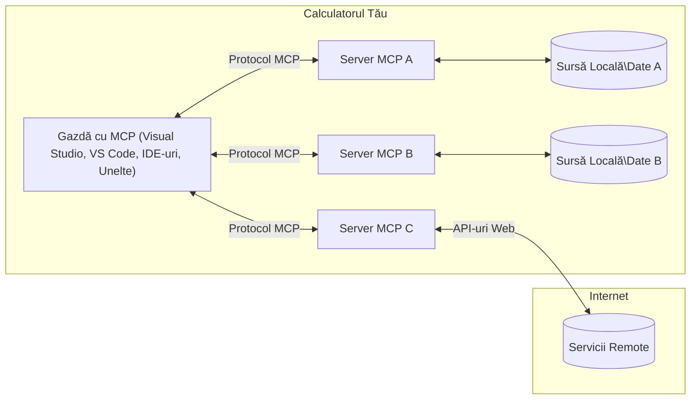

# Concepte de bază MCP: Stăpânirea Protocolului Contextului Modelului pentru integrarea AI

[](https://youtu.be/earDzWGtE84)

_(Click pe imaginea de mai sus pentru a viziona videoclipul acestei lecții)_

[Model Context Protocol (MCP)](https://github.com/modelcontextprotocol) este un cadru puternic, standardizat, care optimizează comunicarea între Modelele Mari de Limbaj (LLM-uri) și unelte externe, aplicații și surse de date.  
Acest ghid te va conduce prin conceptele de bază ale MCP. Vei învăța despre arhitectura client-server, componentele esențiale, mecanismele de comunicare și bunele practici de implementare.

- **Consimțământ Explicit al Utilizatorului**: Toate accesările de date și operațiunile necesită aprobarea explicită a utilizatorului înainte de execuție. Utilizatorii trebuie să înțeleagă clar ce date vor fi accesate și ce acțiuni se vor efectua, cu control granular asupra permisiunilor și autorizărilor.

- **Protecția Confidențialității Datelor**: Datele utilizatorului sunt expuse doar cu consimțământ explicit și trebuie protejate prin controale robuste de acces pe toată durata interacțiunii. Implementările trebuie să prevină transmiterea neautorizată a datelor și să mențină limite stricte de confidențialitate.

- **Siguranța Executării Uneltelor**: Fiecare invocare a unei unelte necesită consimțământ explicit al utilizatorului, cu o înțelegere clară a funcționalității, parametrilor și impactului posibil al uneltei. Limitele robuste de securitate trebuie să prevină execuții neintenționate, nesigure sau malițioase.

- **Securitatea Stratului de Transport**: Toate canalele de comunicare trebuie să utilizeze mecanisme adecvate de criptare și autentificare. Conexiunile la distanță trebuie să implementeze protocoale securizate de transport și gestionare corectă a credențialelor.

#### Ghiduri de implementare:

- **Gestionarea Permisiunilor**: Implementează sisteme de permisiuni granulară care permit utilizatorilor să controleze ce servere, unelte și resurse sunt accesibile  
- **Autentificare și Autorizare**: Folosește metode sigure de autentificare (OAuth, chei API) cu o gestionare corespunzătoare a token-urilor și expirărilor  
- **Validarea Intrărilor**: Validează toți parametrii și datele de intrare conform schemelor definite pentru a preveni atacurile prin injecție  
- **Auditare în Jurnal**: Menține jurnale complete ale tuturor operațiunilor pentru monitorizarea securității și conformitate

## Prezentare generală

Această lecție explorează arhitectura fundamentală și componentele care alcătuiesc ecosistemul Model Context Protocol (MCP). Vei învăța despre arhitectura client-server, componentele cheie și mecanismele de comunicare care alimentează interacțiunile MCP.

## Obiectivele principale de învățare

La finalul acestei lecții, vei putea:

- Înțelege arhitectura client-server MCP.  
- Identifica rolurile și responsabilitățile gazdelor, clienților și serverelor.  
- Analiza caracteristicile de bază care fac MCP un strat flexibil de integrare.  
- Înțelege cum circulă informația în ecosistemul MCP.  
- Dobândi perspective practice prin exemple de cod în .NET, Java, Python, și JavaScript.

## Arhitectura MCP: O privire aprofundată

Ecosistemul MCP este construit pe un model client-server. Această structură modulară permite aplicațiilor AI să interacționeze eficient cu unelte, baze de date, API-uri și resurse contextuale. Haideți să descompunem această arhitectură în componentele sale principale.

La baza sa, MCP urmează o arhitectură client-server în care o aplicație gazdă se poate conecta la mai multe servere:


- **MCP Hosts**: Programe precum VSCode, Claude Desktop, IDE-uri sau unelte AI care doresc să acceseze date prin MCP  
- **MCP Clients**: Clienți ai protocolului care mențin conexiuni 1:1 cu serverele  
- **MCP Servers**: Programe ușoare ce expun capabilități specifice prin Protocolul Contextului Modelului standardizat  
- **Surse de date locale**: Fișierele, bazele de date și serviciile calculatorului tău pe care serverele MCP le pot accesa în siguranță  
- **Servicii la distanță**: Sisteme externe disponibile pe internet la care serverele MCP pot accesa prin API-uri.

Protocolul MCP este un standard în evoluție, folosind versionare bazată pe dată (formatul YYYY-MM-DD). Versiunea curentă a protocolului este **2025-11-25**. Poți vedea ultimele actualizări la [specificația protocolului](https://modelcontextprotocol.io/specification/2025-11-25/)

### 1. Gazde (Hosts)

În Model Context Protocol (MCP), **Gazdele** sunt aplicații AI care servesc drept interfața principală prin care utilizatorii interacționează cu protocolul. Gazdele coordonează și gestionează conexiuni la multiple servere MCP prin crearea unor clienți MCP dedicați pentru fiecare conexiune de server. Exemple de gazde includ:

- **Aplicații AI**: Claude Desktop, Visual Studio Code, Claude Code  
- **Mediile de dezvoltare**: IDE-uri și editoare de cod cu integrare MCP  
- **Aplicații personalizate**: Agenți și unelte AI construite pentru scopuri specifice

**Gazdele** sunt aplicații care coordonează interacțiunile cu modelele AI. Ele:

- **Orchestrează modelele AI**: Execută sau interacționează cu LLM-uri pentru a genera răspunsuri și a coordona fluxurile de lucru AI  
- **Gestionează conexiunile clienților**: Creează și mențin câte un client MCP pentru fiecare conexiune cu un server MCP  
- **Controlează interfața utilizator**: Gestionează fluxul conversației, interacțiunile cu utilizatorul și prezentarea răspunsurilor  
- **Aplică securitatea**: Controlează permisiunile, constrângerile de securitate și autentificarea  
- **Gestionează consimțământul utilizatorului**: Administrează aprobarea utilizatorului pentru partajarea datelor și execuția uneltelor

### 2. Clienți (Clients)

**Clienții** sunt componente esențiale care mențin conexiuni dedicate unu-la-unu între gazde și serverele MCP. Fiecare client MCP este instanțiat de gazdă pentru a se conecta la un server MCP specific, garantând canale de comunicare organizate și securizate. Mai mulți clienți permit gazdelor să se conecteze simultan la mai multe servere.

**Clienții** sunt componente de conectare în cadrul aplicației gazdă. Ei:

- **Comunicarea protocolului**: Trimit cereri JSON-RPC 2.0 către servere cu solicitări și instrucțiuni  
- **Negocierea capabilităților**: Negociază funcționalitățile și versiunile protocolului acceptate cu serverele la inițializare  
- **Executarea uneltelor**: Gestionează cererile de execuție a uneltelor de la modele și procesează răspunsurile  
- **Actualizări în timp real**: Gestionează notificările și actualizările în timp real de la servere  
- **Procesarea răspunsurilor**: Procesează și formatează răspunsurile serverului pentru afișare utilizatorilor

### 3. Servere (Servers)

**Serverele** sunt programe care furnizează context, unelte și capabilități clienților MCP. Ele pot rula local (pe aceeași mașină ca gazda) sau la distanță (pe platforme externe) și sunt responsabile de gestionarea cererilor clienților și furnizarea de răspunsuri structurate. Serverele expun funcționalitate specifică prin Protocolul Contextului Modelului standardizat.

**Serverele** sunt servicii care oferă context și capabilități. Ele:

- **Înregistrarea capabilităților**: Înregistrează și expun primitive disponibile (resurse, prompturi, unelte) clienților  
- **Procesarea solicitărilor**: Primesc și execută apeluri de unelte, cereri de resurse și solicitări de prompturi de la clienți  
- **Furnizarea contextului**: Oferă informații contextuale și date pentru a îmbunătăți răspunsurile modelului  
- **Gestionarea stării**: Mențin starea sesiunii și gestionează interacțiuni stocate când este necesar  
- **Notificări în timp real**: Trimit notificări despre modificări ale capabilităților și actualizări către clienții conectați

Serverele pot fi dezvoltate de oricine pentru a extinde capabilitățile modelului cu funcționalitate specializată și susțin atât implementări locale cât și remote.

### 4. Primitive de Server

Serverele în Model Context Protocol (MCP) oferă trei **primitive** principale care definesc blocurile fundamentale pentru interacțiuni bogate între clienți, gazde și modele de limbaj. Aceste primitive specifică tipurile de informații contextuale și acțiunile disponibile prin protocol.

Serverele MCP pot expune orice combinație a următoarelor trei primitive esențiale:

#### Resurse

**Resursele** sunt surse de date care oferă informații contextuale aplicațiilor AI. Ele reprezintă conținut static sau dinamic care poate îmbunătăți înțelegerea modelului și luarea deciziilor:

- **Date contextuale**: Informații structurate și context pentru consumul modelului AI  
- **Baze de cunoștințe**: Repozitorii de documente, articole, manuale și lucrări de cercetare  
- **Surse de date locale**: Fișiere, baze de date și informații din sistemul local  
- **Date externe**: Răspunsuri API, servicii web și date din sisteme la distanță  
- **Conținut dinamic**: Date în timp real ce se actualizează bazat pe condiții externe

Resursele sunt identificate prin URI-uri și suportă descoperirea prin metodele `resources/list` și recuperarea prin `resources/read`:

```text
file://documents/project-spec.md
database://production/users/schema
api://weather/current
```
  
#### Prompturi

**Prompturile** sunt șabloane reutilizabile care ajută la structurarea interacțiunilor cu modelele de limbaj. Ele oferă modele standardizate de interacțiune și fluxuri de lucru șablon:

- **Interacțiuni bazate pe șabloane**: Mesaje structurate și introduceri de conversație  
- **Șabloane pentru fluxuri de lucru**: Secvențe standardizate pentru sarcini și interacțiuni comune  
- **Exemple few-shot**: Șabloane bazate pe exemple pentru instrucțiuni către model  
- **Prompturi de sistem**: Prompturi fundamentale ce definesc comportamentul și contextul modelului  
- **Șabloane dinamice**: Prompturi parametrizate care se adaptează la contexte specifice

Prompturile suportă substituția variabilelor și pot fi descoperite prin `prompts/list` și recuperate cu `prompts/get`:

```markdown
Generate a {{task_type}} for {{product}} targeting {{audience}} with the following requirements: {{requirements}}
```
  
#### Unelte

**Uneltele** sunt funcții executabile pe care modelele AI le pot invoca pentru a efectua acțiuni specifice. Ele reprezintă „verbele” ecosistemului MCP, permițând modelelor să interacționeze cu sisteme externe:

- **Funcții executabile**: Operații discrete pe care modelele le pot invoca cu parametri specifici  
- **Integrare cu sisteme externe**: Apeluri API, interogări de baze de date, operații pe fișiere, calcule  
- **Identitate unică**: Fiecare unealtă are un nume distinct, descriere și schemă de parametri  
- **I/O structurat**: Uneltele acceptă parametri validați și returnează răspunsuri structurate, tipizate  
- **Capabilități de acțiune**: Permit modelelor să realizeze acțiuni din lumea reală și să preia date live

Uneltele sunt definite cu JSON Schema pentru validarea parametrilor și descoperite prin `tools/list` și executate prin `tools/call`. Uneltele pot include și **icoane** ca metadate adiționale pentru o prezentare mai bună în UI.

**Anotări ale uneltelor**: Uneltele suportă anotări comportamentale (ex.: `readOnlyHint`, `destructiveHint`) care descriu dacă o unealtă este doar de citire sau distructivă, ajutând clienții să ia decizii informate privind execuția uneltei.

Exemplu de definiție unealtă:

```typescript
server.tool(
  "search_products", 
  {
    query: z.string().describe("Search query for products"),
    category: z.string().optional().describe("Product category filter"),
    max_results: z.number().default(10).describe("Maximum results to return")
  }, 
  async (params) => {
    // Execută căutarea și returnează rezultate structurate
    return await productService.search(params);
  }
);
```
  
## Primitive de client

În Model Context Protocol (MCP), **clienții** pot expune primitive care permit serverelor să solicite capabilități suplimentare de la aplicația gazdă. Aceste primitive de partea clientului permit implementări server mai bogate, interactive, care pot accesa capabilitățile modelului AI și interacțiunile utilizatorului.

### Sampling

**Sampling** permite serverelor să solicite completări ale modelului de limbaj din aplicația AI a clientului. Această primitivă permite serverelor să acceseze capabilitățile LLM fără să includă propriile dependențe de model:

- **Acces independent de model**: Serverele pot solicita completări fără a include SDK-uri LLM sau a gestiona accesul la model  
- **AI inițiat de server**: Permite serverelor să genereze autonom conținut folosind modelul AI al clientului  
- **Interacțiuni recursive LLM**: Suportă scenarii complexe unde serverele au nevoie de asistență AI pentru procesare  
- **Generare dinamică de conținut**: Permite serverelor să creeze răspunsuri contextuale folosind modelul gazdei  
- **Suport apel unelte**: Serverele pot include parametrii `tools` și `toolChoice` pentru a permite modelului clientului să invoce unelte în timpul samplingului

Samplingul se inițiază prin metoda `sampling/complete`, unde serverele trimit cereri de completare către clienți.

### Roots

**Roots** oferă o modalitate standardizată pentru clienți de a expune limitele sistemului de fișiere către servere, ajutând serverele să înțeleagă care directoare și fișiere pot accesa:

- **Limite în sistemul de fișiere**: Definirea limitelor unde pot opera serverele în cadrul sistemului de fișiere  
- **Controlul accesului**: Ajută serverele să înțeleagă care directoare și fișiere au permisiunea de acces  
- **Actualizări dinamice**: Clienții pot notifica serverele când lista de rădăcini se schimbă  
- **Identificare bazată pe URI**: Roots folosesc URI-uri `file://` pentru a identifica directoare și fișiere accesibile

Roots sunt descoperite prin metoda `roots/list`, iar clienții trimit notificări `notifications/roots/list_changed` când roots se modifică.

### Elicitation  

**Elicitation** permite serverelor să solicite informații sau confirmări suplimentare de la utilizatori prin interfața clientului:

- **Solicitări de input de la utilizator**: Serverele pot cere informații suplimentare când sunt necesare pentru execuția uneltei  
- **Dialoguri de confirmare**: Cererea aprobării utilizatorului pentru operațiuni sensibile sau cu impact mare  
- **Fluxuri de lucru interactive**: Permit serverelor să creeze interacțiuni pas-cu-pas cu utilizatorii  
- **Colectare dinamică a parametrilor**: Adună parametri lipsă sau opționali în timpul execuției uneltei

Cererea de elicitation se face folosind metoda `elicitation/request` pentru a colecta input de la utilizator prin interfața clientului.

**Modul URL pentru elicitation**: Serverele pot solicita și interacțiuni cu utilizatorul bazate pe URL, permițând serverelor să direcționeze utilizatorii către pagini web externe pentru autentificare, confirmare sau introducere date.

### Logging

**Logging** permite serverelor să trimită mesaje structurate de jurnal către clienți pentru depanare, monitorizare și vizibilitate operațională:

- **Suport pentru depanare**: Permite serverelor să furnizeze jurnale detaliate de execuție pentru depanare  
- **Monitorizare operațională**: Trimit actualizări de status și metrici de performanță către clienți  
- **Raportare erori**: Oferă context detaliat despre erori și informații de diagnostic  
- **Urme de audit**: Creează jurnale cuprinzătoare ale operațiunilor și deciziilor serverului

Mesajele de jurnalizare sunt trimise către clienți pentru a oferi transparență asupra operațiunilor serverului și pentru a facilita depanarea.

## Fluxul informației în MCP

Model Context Protocol (MCP) definește un flux structurat al informației între gazde, clienți, servere și modele. Înțelegerea acestui flux ajută la clarificarea modului în care cererile utilizatorului sunt procesate și cum uneltele externe și datele sunt integrate în răspunsurile modelului.
- **Gazda inițiază conexiunea**  
  Aplicația gazdă (cum ar fi un IDE sau o interfață de chat) stabilește o conexiune către un server MCP, de obicei prin STDIO, WebSocket sau un alt transport compatibil.

- **Negocierea capabilităților**  
  Clientul (încorporat în gazdă) și serverul schimbă informații despre funcționalitățile, instrumentele, resursele și versiunile protocolului acceptate. Aceasta asigură că ambele părți înțeleg ce capabilități sunt disponibile pentru sesiune.

- **Cererea utilizatorului**  
  Utilizatorul interacționează cu gazda (de exemplu, introduce un prompt sau o comandă). Gazda colectează această intrare și o transmite clientului pentru procesare.

- **Utilizarea resurselor sau instrumentelor**  
  - Clientul poate solicita context suplimentar sau resurse de la server (cum ar fi fișiere, înregistrări din baze de date sau articole din baze de cunoștințe) pentru a îmbogăți înțelegerea modelului.  
  - Dacă modelul determină că este necesar un instrument (de exemplu, pentru a prelua date, a efectua un calcul sau a apela un API), clientul trimite o cerere de invocare a instrumentului către server, specificând numele instrumentului și parametrii.

- **Executarea pe server**  
  Serverul primește cererea pentru resursă sau instrument, execută operațiunile necesare (cum ar fi rularea unei funcții, interogarea unei baze de date sau preluarea unui fișier) și returnează rezultatele clientului într-un format structurat.

- **Generarea răspunsului**  
  Clientul integrează răspunsurile serverului (date despre resurse, rezultate ale instrumentelor etc.) în interacțiunea curentă cu modelul. Modelul folosește aceste informații pentru a genera un răspuns cuprinzător și relevant din punct de vedere contextual.

- **Prezentarea rezultatului**  
  Gazda primește rezultatul final de la client și îl afișează utilizatorului, adesea incluzând atât textul generat de model, cât și orice rezultate ale executării instrumentelor sau preluării resurselor.

Acest flux permite MCP să susțină aplicații AI avansate, interactive și conștiente de context, conectând fără probleme modelele cu instrumente și surse externe de date.

## Arhitectura Protocolului & Straturi

MCP constă din două straturi arhitecturale distincte care lucrează împreună pentru a oferi un cadru complet de comunicare:

### Strat de Date

**Stratul de Date** implementează protocolul de bază MCP folosind **JSON-RPC 2.0** ca fundament. Acest strat definește structura mesajelor, semantica și modelele de interacțiune:

#### Componente esențiale:

- **Protocol JSON-RPC 2.0**: Toată comunicarea folosește formatul standardizat al mesajelor JSON-RPC 2.0 pentru apeluri de metodă, răspunsuri și notificări  
- **Managementul ciclului de viață**: Gestionează inițializarea conexiunii, negocierea capabilităților și terminarea sesiunii între clienți și servere  
- **Primitive server**: Permite serverelor să ofere funcționalitate de bază prin instrumente, resurse și prompturi  
- **Primitive client**: Permite serverelor să solicite eșantionare de la LLM-uri, să ceară input de la utilizator și să trimită mesaje de jurnalizare  
- **Notificări în timp real**: Suportă notificări asincrone pentru actualizări dinamice fără interogare repetată

#### Caracteristici cheie:

- **Negocierea versiunii protocolului**: Folosește versiuni bazate pe dată (AAAA-LL-ZZ) pentru a asigura compatibilitatea  
- **Descoperirea capabilităților**: Clienții și serverele schimbă informații despre caracteristicile suportate în timpul inițializării  
- **Sesiuni cu stare**: Menține starea conexiunii pe mai multe interacțiuni pentru continuitatea contextului

### Strat de Transport

**Stratul de Transport** gestionează canalele de comunicare, încadrarea mesajelor și autentificarea între participanții MCP:

#### Mecanisme de transport suportate:

1. **Transport STDIO**:  
   - Folosește fluxurile standard de intrare/ieșire pentru comunicarea directă între procese  
   - Optim pentru procese locale pe aceeași mașină, fără costuri de rețea  
   - Utilizat frecvent pentru implementări locale ale serverului MCP  
   
2. **Transport HTTP streamabil**:  
   - Folosește HTTP POST pentru mesaje client-server  
   - Opțional Server-Sent Events (SSE) pentru streaming server-client  
   - Permite comunicarea cu servere la distanță prin rețele  
   - Suportă autentificare HTTP standard (token-uri bearer, chei API, headere personalizate)  
   - MCP recomandă OAuth pentru autentificare sigură bazată pe token  

#### Abstracția transportului:

Stratul de transport ascunde detaliile comunicației față de stratul de date, permițând același format de mesaje JSON-RPC 2.0 pe toate mecanismele de transport. Această abstractizare permite aplicațiilor să comute fără probleme între servere locale și servere la distanță.

### Considerații de securitate

Implementările MCP trebuie să respecte mai multe principii critice de securitate pentru a asigura interacțiuni sigure, de încredere și protejate pe tot parcursul operațiunilor protocolului:

- **Consimțământ și control al utilizatorului**: Utilizatorii trebuie să ofere consimțământ explicit înainte ca orice date să fie accesate sau operațiuni efectuate. Ei trebuie să aibă control clar asupra datelor partajate și acțiunilor autorizate, sprijinit de interfețe intuitive pentru revizuirea și aprobarea activităților.

- **Confidențialitatea datelor**: Datele utilizatorilor trebuie să fie expuse numai cu consimțământ explicit și să fie protejate prin controale adecvate de acces. Implementările MCP trebuie să prevină transmiterea neautorizată de date și să asigure menținerea confidențialității pe tot parcursul interacțiunilor.

- **Siguranța instrumentelor**: Înainte de a invoca orice instrument, este necesar consimțământ explicit al utilizatorului. Utilizatorii trebuie să înțeleagă clar funcționalitatea fiecărui instrument, iar limite de securitate robuste trebuie aplicate pentru a preveni execuția neintenționată sau nesigură a instrumentelor.

Respectând aceste principii de securitate, MCP asigură încrederea, confidențialitatea și siguranța utilizatorilor pe parcursul tuturor interacțiunilor protocolului, facilitând integrații AI puternice.

## Exemple de cod: Componente cheie

Mai jos sunt exemple de cod în mai multe limbaje populare care ilustrează cum se implementează componente cheie ale serverului MCP și instrumente.

### Exemplu .NET: Crearea unui server MCP simplu cu instrumente

Iată un exemplu practic în .NET care demonstrează cum să implementezi un server MCP simplu cu instrumente personalizate. Exemplul arată cum să definești și să înregistrezi instrumente, să gestionezi cererile și să conectezi serverul folosind Model Context Protocol.

```csharp
using System;
using System.Threading.Tasks;
using ModelContextProtocol.Server;
using ModelContextProtocol.Server.Transport;
using ModelContextProtocol.Server.Tools;

public class WeatherServer
{
    public static async Task Main(string[] args)
    {
        // Create an MCP server
        var server = new McpServer(
            name: "Weather MCP Server",
            version: "1.0.0"
        );
        
        // Register our custom weather tool
        server.AddTool<string, WeatherData>("weatherTool", 
            description: "Gets current weather for a location",
            execute: async (location) => {
                // Call weather API (simplified)
                var weatherData = await GetWeatherDataAsync(location);
                return weatherData;
            });
        
        // Connect the server using stdio transport
        var transport = new StdioServerTransport();
        await server.ConnectAsync(transport);
        
        Console.WriteLine("Weather MCP Server started");
        
        // Keep the server running until process is terminated
        await Task.Delay(-1);
    }
    
    private static async Task<WeatherData> GetWeatherDataAsync(string location)
    {
        // This would normally call a weather API
        // Simplified for demonstration
        await Task.Delay(100); // Simulate API call
        return new WeatherData { 
            Temperature = 72.5,
            Conditions = "Sunny",
            Location = location
        };
    }
}

public class WeatherData
{
    public double Temperature { get; set; }
    public string Conditions { get; set; }
    public string Location { get; set; }
}
```

### Exemplu Java: Componente server MCP

Acest exemplu arată același server MCP și înregistrarea instrumentelor ca în exemplul .NET de mai sus, însă implementat în Java.

```java
import io.modelcontextprotocol.server.McpServer;
import io.modelcontextprotocol.server.McpToolDefinition;
import io.modelcontextprotocol.server.transport.StdioServerTransport;
import io.modelcontextprotocol.server.tool.ToolExecutionContext;
import io.modelcontextprotocol.server.tool.ToolResponse;

public class WeatherMcpServer {
    public static void main(String[] args) throws Exception {
        // Creează un server MCP
        McpServer server = McpServer.builder()
            .name("Weather MCP Server")
            .version("1.0.0")
            .build();
            
        // Înregistrează un instrument meteo
        server.registerTool(McpToolDefinition.builder("weatherTool")
            .description("Gets current weather for a location")
            .parameter("location", String.class)
            .execute((ToolExecutionContext ctx) -> {
                String location = ctx.getParameter("location", String.class);
                
                // Obține date meteo (simplificat)
                WeatherData data = getWeatherData(location);
                
                // Returnează un răspuns formatat
                return ToolResponse.content(
                    String.format("Temperature: %.1f°F, Conditions: %s, Location: %s", 
                    data.getTemperature(), 
                    data.getConditions(), 
                    data.getLocation())
                );
            })
            .build());
        
        // Conectează serverul folosind transport stdio
        try (StdioServerTransport transport = new StdioServerTransport()) {
            server.connect(transport);
            System.out.println("Weather MCP Server started");
            // Păstrează serverul activ până la terminarea procesului
            Thread.currentThread().join();
        }
    }
    
    private static WeatherData getWeatherData(String location) {
        // Implementarea ar apela o API meteo
        // Simplificat pentru scopuri de exemplu
        return new WeatherData(72.5, "Sunny", location);
    }
}

class WeatherData {
    private double temperature;
    private String conditions;
    private String location;
    
    public WeatherData(double temperature, String conditions, String location) {
        this.temperature = temperature;
        this.conditions = conditions;
        this.location = location;
    }
    
    public double getTemperature() {
        return temperature;
    }
    
    public String getConditions() {
        return conditions;
    }
    
    public String getLocation() {
        return location;
    }
}
```

### Exemplu Python: Construirea unui server MCP

Acest exemplu folosește fastmcp, așadar, vă rugăm să îl instalați mai întâi:

```python
pip install fastmcp
```
Exemplu de cod:

```python
#!/usr/bin/env python3
import asyncio
from fastmcp import FastMCP
from fastmcp.transports.stdio import serve_stdio

# Creează un server FastMCP
mcp = FastMCP(
    name="Weather MCP Server",
    version="1.0.0"
)

@mcp.tool()
def get_weather(location: str) -> dict:
    """Gets current weather for a location."""
    return {
        "temperature": 72.5,
        "conditions": "Sunny",
        "location": location
    }

# Abordare alternativă folosind o clasă
class WeatherTools:
    @mcp.tool()
    def forecast(self, location: str, days: int = 1) -> dict:
        """Gets weather forecast for a location for the specified number of days."""
        return {
            "location": location,
            "forecast": [
                {"day": i+1, "temperature": 70 + i, "conditions": "Partly Cloudy"}
                for i in range(days)
            ]
        }

# Înregistrează instrumentele clasei
weather_tools = WeatherTools()

# Pornește serverul
if __name__ == "__main__":
    asyncio.run(serve_stdio(mcp))
```

### Exemplu JavaScript: Crearea unui server MCP

Acest exemplu prezintă crearea unui server MCP în JavaScript și cum să înregistrezi două instrumente legate de vreme.

```javascript
// Folosind SDK-ul oficial pentru Model Context Protocol
import { McpServer } from "@modelcontextprotocol/sdk/server/mcp.js";
import { StdioServerTransport } from "@modelcontextprotocol/sdk/server/stdio.js";
import { z } from "zod"; // Pentru validarea parametrilor

// Creează un server MCP
const server = new McpServer({
  name: "Weather MCP Server",
  version: "1.0.0"
});

// Definește un instrument meteo
server.tool(
  "weatherTool",
  {
    location: z.string().describe("The location to get weather for")
  },
  async ({ location }) => {
    // Acesta ar apela în mod normal un API meteo
    // Simplificat pentru demonstrație
    const weatherData = await getWeatherData(location);
    
    return {
      content: [
        { 
          type: "text", 
          text: `Temperature: ${weatherData.temperature}°F, Conditions: ${weatherData.conditions}, Location: ${weatherData.location}` 
        }
      ]
    };
  }
);

// Definește un instrument de prognoză
server.tool(
  "forecastTool",
  {
    location: z.string(),
    days: z.number().default(3).describe("Number of days for forecast")
  },
  async ({ location, days }) => {
    // Acesta ar apela în mod normal un API meteo
    // Simplificat pentru demonstrație
    const forecast = await getForecastData(location, days);
    
    return {
      content: [
        { 
          type: "text", 
          text: `${days}-day forecast for ${location}: ${JSON.stringify(forecast)}` 
        }
      ]
    };
  }
);

// Funcții ajutătoare
async function getWeatherData(location) {
  // Simulează apelul API
  return {
    temperature: 72.5,
    conditions: "Sunny",
    location: location
  };
}

async function getForecastData(location, days) {
  // Simulează apelul API
  return Array.from({ length: days }, (_, i) => ({
    day: i + 1,
    temperature: 70 + Math.floor(Math.random() * 10),
    conditions: i % 2 === 0 ? "Sunny" : "Partly Cloudy"
  }));
}

// Conectează serverul folosind transport stdio
const transport = new StdioServerTransport();
server.connect(transport).catch(console.error);

console.log("Weather MCP Server started");
```

Acest exemplu JavaScript demonstrează cum se creează un server MCP folosind SDK-ul Model Context Protocol. Arată cum se înregistrează două instrumente numite `weatherTool` și `forecastTool` și cum sunt puse la dispoziția clienților MCP prin `StdioServerTransport`.

## Securitate și autorizare

MCP include mai multe concepte și mecanisme integrate pentru gestionarea securității și autorizării pe tot parcursul protocolului:

1. **Controlul permisiunilor pentru instrumente**:  
  Clienții pot specifica ce instrumente un model este autorizat să folosească în timpul unei sesiuni. Aceasta asigură accesul doar la instrumente autorizate explicit, reducând riscul operațiunilor neintenționate sau nesigure. Permisiunile pot fi configurate dinamic în funcție de preferințele utilizatorului, politicile organizației sau contextul interacțiunii.

2. **Autentificare**:  
  Serverele pot solicita autentificare înainte de a acorda acces la instrumente, resurse sau operațiuni sensibile. Aceasta poate include chei API, token-uri OAuth sau alte scheme de autentificare. Autentificarea corespunzătoare asigură că doar clienții și utilizatorii de încredere pot apela capabilitățile server-ului.

3. **Validare**:  
  Validarea parametrilor este aplicată pentru toate invocările instrumentelor. Fiecare instrument definește tipurile, formatele și restricțiile așteptate pentru parametrii săi, iar serverul validează cererile primite în consecință. Aceasta previne ca datele greșite sau malițioase să ajungă la implementările instrumentelor și ajută la menținerea integrității operațiunilor.

4. **Limitarea ratei de apeluri**:  
  Pentru a preveni abuzurile și a asigura utilizarea corectă a resurselor serverului, MCP poate implementa limitarea ratei pentru apelurile de instrumente și accesul la resurse. Limitările pot fi aplicate pe utilizator, pe sesiune sau global și contribuie la protejarea împotriva atacurilor de tip DoS sau consumului excesiv de resurse.

Combinând aceste mecanisme, MCP oferă o fundație sigură pentru integrarea modelelor lingvistice cu instrumente și surse externe de date, oferind utilizatorilor și dezvoltatorilor control granular asupra accesului și utilizării.

## Mesajele protocolului & fluxul de comunicare

Comunicarea MCP folosește mesaje structurate **JSON-RPC 2.0** pentru a facilita interacțiuni clare și fiabile între gazde, clienți și servere. Protocolul definește modele specifice de mesaje pentru diferite tipuri de operațiuni:

### Tipuri de mesaje de bază:

#### **Mesaje de inițializare**
- Cererea `initialize`: stabilește conexiunea și negociază versiunea protocolului și capabilitățile  
- Răspunsul `initialize`: confirmă funcționalitățile suportate și informațiile serverului  
- `notifications/initialized`: semnalizează că inițializarea este completă și sesiunea este gata

#### **Mesaje de descoperire**
- Cererea `tools/list`: descoperă instrumentele disponibile de pe server  
- Cererea `resources/list`: listează resursele disponibile (surse de date)  
- Cererea `prompts/list`: preia șabloanele de prompturi disponibile

#### **Mesaje de execuție**  
- Cererea `tools/call`: execută un instrument specific cu parametrii furnizați  
- Cererea `resources/read`: obține conținutul dintr-o resursă specifică  
- Cererea `prompts/get`: preia un șablon de prompt cu parametri opționali

#### **Mesaje pe partea clientului**
- Cererea `sampling/complete`: serverul solicită completarea LLM de la client  
- `elicitation/request`: serverul solicită input utilizator prin interfața client  
- Mesaje de jurnalizare: serverul trimite mesaje structurate de log către client

#### **Mesaje de notificare**
- `notifications/tools/list_changed`: serverul notifică clientul despre schimbări în lista instrumentelor  
- `notifications/resources/list_changed`: serverul notifică clientul despre schimbări în lista resurselor  
- `notifications/prompts/list_changed`: serverul notifică clientul despre schimbări în lista de prompturi

### Structura mesajelor:

Toate mesajele MCP urmează formatul JSON-RPC 2.0 cu:  
- **Mesaje de cerere**: includ `id`, `method` și `params` opționale  
- **Mesaje de răspuns**: includ `id` și fie `result`, fie `error`  
- **Mesaje de notificare**: includ `method` și `params` opționale (fără `id`, fără răspuns așteptat)

Această comunicare structurată asigură interacțiuni fiabile, trasabile și extensibile, suportând scenarii avansate precum actualizări în timp real, combinarea instrumentelor și gestionarea robustă a erorilor.

### Sarcini (experimental)

**Sarcinile** sunt o funcționalitate experimentală care oferă învelișuri de execuție durabile, permițând recuperarea rezultatelor amânate și urmărirea stării pentru cererile MCP:

- **Operațiuni pe termen lung**: urmăresc calcule costisitoare, automatizarea fluxurilor de lucru și procesarea în loturi  
- **Rezultate amânate**: permit interogarea statusului sarcinii și preluarea rezultatelor la finalizarea operațiilor  
- **Urmărirea stării**: monitorizează progresul sarcinii prin stări de viață definite  
- **Operațiuni în mai mulți pași**: susțin fluxuri de lucru complexe cu mai multe interacțiuni

Sarcinile învelesc cererile standard MCP pentru a permite modele de execuție asincronă pentru operațiuni care nu se pot încheia imediat.

## Aspecte importante

- **Arhitectură**: MCP folosește o arhitectură client-server unde gazdele gestionează mai multe conexiuni de client către servere  
- **Participanți**: ecosistemul include gazde (aplicații AI), clienți (conectori de protocol) și servere (furnizori de capabilități)  
- **Mecanisme de transport**: comunicarea suportă STDIO (local) și HTTP streamabil cu opțional SSE (remote)  
- **Primitive de bază**: serverele expun instrumente (funcții executabile), resurse (surse de date) și prompturi (șabloane)  
- **Primitive client**: serverele pot solicita eșantionare (completări LLM cu suport de apelare a instrumentelor), elicitație (input utilizator inclusiv modul URL), rădăcini (frontiere sistem de fișiere) și jurnalizare de la clienți  
- **Funcționalități experimentale**: sarcinile oferă învelișuri durabile pentru operațiuni pe termen lung  
- **Bază de protocol**: construit pe JSON-RPC 2.0 cu versiuni bazate pe dată (actual: 2025-11-25)  
- **Capabilități în timp real**: suportă notificări pentru actualizări dinamice și sincronizare în timp real  
- **Prioritate securitate**: consimțământ explicit al utilizatorului, protecția confidențialității datelor și transport sigur sunt cerințe esențiale

## Exercițiu

Proiectați un instrument MCP simplu care ar fi util în domeniul dvs. Definiți:  
1. Cum s-ar numi instrumentul  
2. Ce parametri ar accepta  
3. Ce output ar returna  
4. Cum ar putea un model să folosească acest instrument pentru a rezolva problemele utilizatorilor


---

## Ce urmează

Următorul: [Capitolul 2: Securitate](../02-Security/README.md)

---

<!-- CO-OP TRANSLATOR DISCLAIMER START -->
**Declinare de responsabilitate**:  
Acest document a fost tradus folosind serviciul de traducere AI [Co-op Translator](https://github.com/Azure/co-op-translator). Deși ne străduim pentru acuratețe, vă rugăm să rețineți că traducerile automate pot conține erori sau inexactități. Documentul original în limba sa nativă trebuie considerat sursa autorizată. Pentru informații critice, se recomandă traducerea profesională realizată de un specialist uman. Nu ne asumăm responsabilitatea pentru eventualele neînțelegeri sau interpretări greșite rezultate din utilizarea acestei traduceri.
<!-- CO-OP TRANSLATOR DISCLAIMER END -->