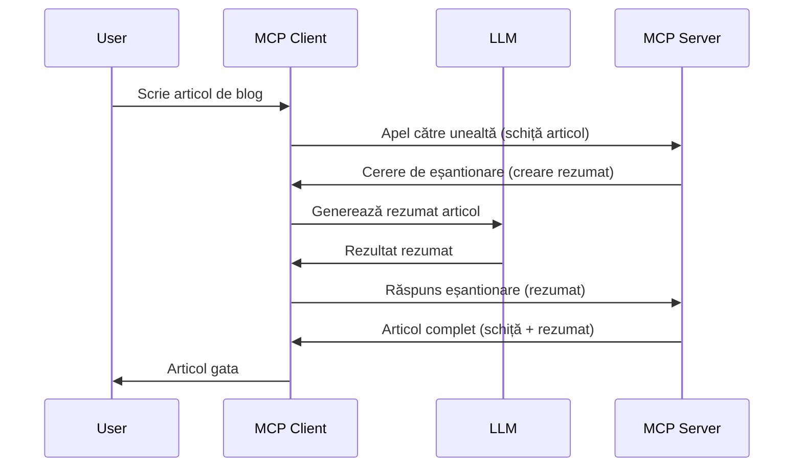

# Sampling - delegarea funcțiilor către Client

Uneori, este nevoie ca Clientul MCP și Serverul MCP să colaboreze pentru a realiza un scop comun. Poate exista un caz în care Serverul are nevoie de ajutorul unui LLM care se află pe client. Pentru această situație, sampling-ul este ceea ce ar trebui să folosești.

Să explorăm câteva cazuri de utilizare și cum să construim o soluție care implică sampling.

## Prezentare generală

În această lecție, ne concentrăm pe explicarea când și unde să utilizăm Sampling și cum să îl configurăm.

## Obiectivele de învățare

În acest capitol, vom:

- Explica ce este Sampling și când să îl folosești.
- Arăta cum să configurezi Sampling în MCP.
- Oferi exemple de Sampling în acțiune.

## Ce este Sampling și de ce să-l folosești?

Sampling este o caracteristică avansată care funcționează în felul următor:



### Cererea de Sampling

Ok, acum că avem o vedere de ansamblu la un scenariu credibil, să vorbim despre cererea de sampling pe care serverul o trimite înapoi clientului. Iată cum poate arăta o astfel de cerere în format JSON-RPC:

```json
{
  "jsonrpc": "2.0",
  "id": 1,
  "method": "sampling/createMessage",
  "params": {
    "messages": [
      {
        "role": "user",
        "content": {
          "type": "text",
          "text": "Create a blog post summary of the following blog post: <BLOG POST>"
        }
      }
    ],
    "modelPreferences": {
      "hints": [
        {
          "name": "claude-3-sonnet"
        }
      ],
      "intelligencePriority": 0.8,
      "speedPriority": 0.5
    },
    "systemPrompt": "You are a helpful assistant.",
    "maxTokens": 100
  }
}
```

Sunt câteva aspecte demne de menționat aici:

- Prompt, sub content -> text, este promptul nostru care este o instrucțiune pentru LLM de a rezuma conținutul unei postări pe blog.

- **modelPreferences**. Această secțiune este exact asta, o preferință, o recomandare despre ce configurație să folosești cu LLM-ul. Utilizatorul poate alege dacă urmează aceste recomandări sau le schimbă. În acest caz există recomandări privind modelul de utilizat și prioritățile de viteză și inteligență.
- **systemPrompt**, aceasta este promptul normal de sistem care îi oferă LLM-ului o personalitate și conține instrucțiuni de ghidare.
- **maxTokens**, aceasta este o altă proprietate folosită pentru a specifica câți tokeni se recomandă pentru această sarcină.

### Răspunsul de Sampling

Acest răspuns este ceea ce Clientul MCP ajunge să trimită înapoi Serverului MCP și este rezultatul clientului care apelează LLM-ul, a așteptat răspunsul și apoi construiește acest mesaj. Iată cum poate arăta în JSON-RPC:

```json
{
  "jsonrpc": "2.0",
  "id": 1,
  "result": {
    "role": "assistant",
    "content": {
      "type": "text",
      "text": "Here's your abstract <ABSTRACT>"
    },
    "model": "gpt-5",
    "stopReason": "endTurn"
  }
}
```

Observați cum răspunsul este un abstract al postării pe blog exact cum am cerut. De asemenea, observați cum modelul folosit nu este cel cerut, ci "gpt-5" în loc de "claude-3-sonnet". Acest lucru ilustrează că utilizatorul poate să-și schimbe părerea despre ce să folosească și că cererea ta de sampling este o recomandare.

Ok, acum că am înțeles fluxul principal, și o sarcină utilă pentru a-l folosi "creare postare blog + abstract", să vedem ce trebuie făcut pentru ca acesta să funcționeze.

### Tipuri de mesaje

Mesajele de Sampling nu sunt limitate doar la text, ci poți trimite și imagini și audio. Iată cum arată diferit JSON-RPC:

**Text**

```json
{
  "type": "text",
  "text": "The message content"
}
```

**Conținut imagine**

```json
{
  "type": "image",
  "data": "base64-encoded-image-data",
  "mimeType": "image/jpeg"
}
```

**Conținut audio**

```json
{
  "type": "audio",
  "data": "base64-encoded-audio-data",
  "mimeType": "audio/wav"
}
```

> NOTE: pentru informații mai detaliate despre Sampling, consultă [documentația oficială](https://modelcontextprotocol.io/specification/2025-11-25/client/sampling)

## Cum să configurezi Sampling în Client

> Notă: dacă construiești doar un server, nu trebuie să faci mare lucru aici.

Într-un client, trebuie să specifici următoarea caracteristică astfel:

```json
{
  "capabilities": {
    "sampling": {}
  }
}
```

Aceasta va fi preluată când clientul ales se inițializează cu serverul.

## Exemplu de Sampling în acțiune - Creare postare blog

Să codăm împreună un server de sampling, va trebui să facem următoarele:

1. Creează un instrument pe Server.
1. Acest instrument ar trebui să creeze o cerere de sampling.
1. Instrumentul ar trebui să aștepte răspunsul la cererea de sampling a clientului.
1. Apoi, trebuie produs rezultatul instrumentului.

Să vedem codul pas cu pas:

### -1- Crearea instrumentului

**python**

```python
@mcp.tool()
async def create_blog(title: str, content: str, ctx: Context[ServerSession, None]) -> str:
    """Create a blog post and generate a summary"""

```

### -2- Crearea unei cereri de sampling

Extinde instrumentul tău cu următorul cod:

**python**

```python
post = BlogPost(
        id=len(posts) + 1,
        title=title,
        content=content,
        abstract=""
    )

prompt = f"Create an abstract of the following blog post: title: {title} and draft: {content} "

result = await ctx.session.create_message(
        messages=[
            SamplingMessage(
                role="user",
                content=TextContent(type="text", text=prompt),
            )
        ],
        max_tokens=100,
)

```

### -3- Așteaptă răspunsul și returnează răspunsul

**python**

```python
post.abstract = result.content.text

posts.append(post)

# returnează produsul complet
return json.dumps({
    "id": post.title,
    "abstract": post.abstract
})
```

### -4- Cod complet

**python**

```python
from starlette.applications import Starlette
from starlette.routing import Mount, Host

from mcp.server.fastmcp import Context, FastMCP

from mcp.server.session import ServerSession
from mcp.types import SamplingMessage, TextContent

import json


from uuid import uuid4
from typing import List
from pydantic import BaseModel


mcp = FastMCP("Blog post generator")

# app = FastAPI()

posts = []

class BlogPost(BaseModel):
    id: int
    title: str
    content: str
    abstract: str

posts: List[BlogPost] = []

@mcp.tool()
async def create_blog(title: str, content: str, ctx: Context[ServerSession, None]) -> str:
    """Create a blog post and generate a summary"""

    post = BlogPost(
        id=len(posts) + 1,
        title=title,
        content=content,
        abstract=""
    )

    prompt = f"Create an abstract of the following blog post: title: {title} and draft: {content} "

    result = await ctx.session.create_message(
        messages=[
            SamplingMessage(
                role="user",
                content=TextContent(type="text", text=prompt),
            )
        ],
        max_tokens=100,
    )

    post.abstract = result.content.text

    posts.append(post)

    # returnează articolul complet de blog
    return json.dumps({
        "id": post.title,
        "abstract": post.abstract
    })

if __name__ == "__main__":
    print("Starting server...")
    # mcp.run()
    mcp.run(transport="streamable-http")

# rulează aplicația cu: python server.py
```

### -5- Testare în Visual Studio Code

Pentru a testa acest lucru în Visual Studio Code, fă următoarele:

1. Pornește serverul în terminal
1. Adaugă-l în *mcp.json* (și asigură-te că este pornit) ceva de genul:

   ```json
   "servers": {
      "blog-server": {
        "type": "http",
        "url": "http://localhost:8000/mcp"
      }
   }
   ```

1. Scrie un prompt:

   ```text
   create a blog post named "Where Python comes from", the content is "Python is actually named after Monty Python Flying Circus"
   ```

1. Permite sampling să se întâmple. Prima dată când testezi asta, îți va apărea un dialog suplimentar pe care trebuie să îl accepți, apoi vei vedea dialogul normal care îți cere să rulezi un instrument.

1. Inspectează rezultatele. Vei vedea rezultatele atât bine redate în GitHub Copilot Chat, dar poți inspecta și răspunsul JSON brut.

**Bonus**. Uneltele Visual Studio Code oferă suport excelent pentru sampling. Poți configura accesul Sampling pe serverul instalat navigând astfel:

1. Navighează la secțiunea extensii.
1. Selectează pictograma roată pentru serverul instalat în secțiunea "MCP SERVERS - INSTALLED".
1. Selectează "Configure Model Access", aici poți alege ce modele poate folosi GitHub Copilot pentru sampling. De asemenea, poți vedea toate cererile de sampling recente selectând "Show Sampling requests".

## Tema

În această temă, vei construi un sampling ușor diferit, numit integrare sampling care susține generarea unei descrieri de produs. Iată scenariul tău:

**Scenariu**: Lucrătorul din back office de la un e-commerce are nevoie de ajutor, îi ia mult timp să genereze descrieri de produs. Prin urmare, trebuie să construiești o soluție în care poți apela un instrument "create_product" cu argumentele "title" și "keywords" și ar trebui să producă un produs complet inclusiv un câmp "description" care să fie populat de LLM-ul clientului.

SUGESTIE: folosește ce ai învățat mai devreme pentru a construi acest server și instrument folosind o cerere de sampling.

## Soluție

[Soluție](./solution/README.md)

## Puncte cheie

Sampling este o caracteristică puternică care permite serverului să dea sarcini clientului când are nevoie de ajutorul unui LLM.

## Ce urmează

- [Capitolul 4 - Implementare practică](../../04-PracticalImplementation/README.md)

---

<!-- CO-OP TRANSLATOR DISCLAIMER START -->
**Declinare a responsabilității**:
Acest document a fost tradus folosind serviciul de traducere AI [Co-op Translator](https://github.com/Azure/co-op-translator). În timp ce ne străduim pentru acuratețe, vă rugăm să rețineți că traducerile automate pot conține erori sau inexactități. Documentul original în limba sa nativă trebuie considerat sursa autorizată. Pentru informații critice, se recomandă traducerea profesională realizată de un om. Nu ne asumăm responsabilitatea pentru eventualele neînțelegeri sau interpretări greșite care decurg din utilizarea acestei traduceri.
<!-- CO-OP TRANSLATOR DISCLAIMER END -->