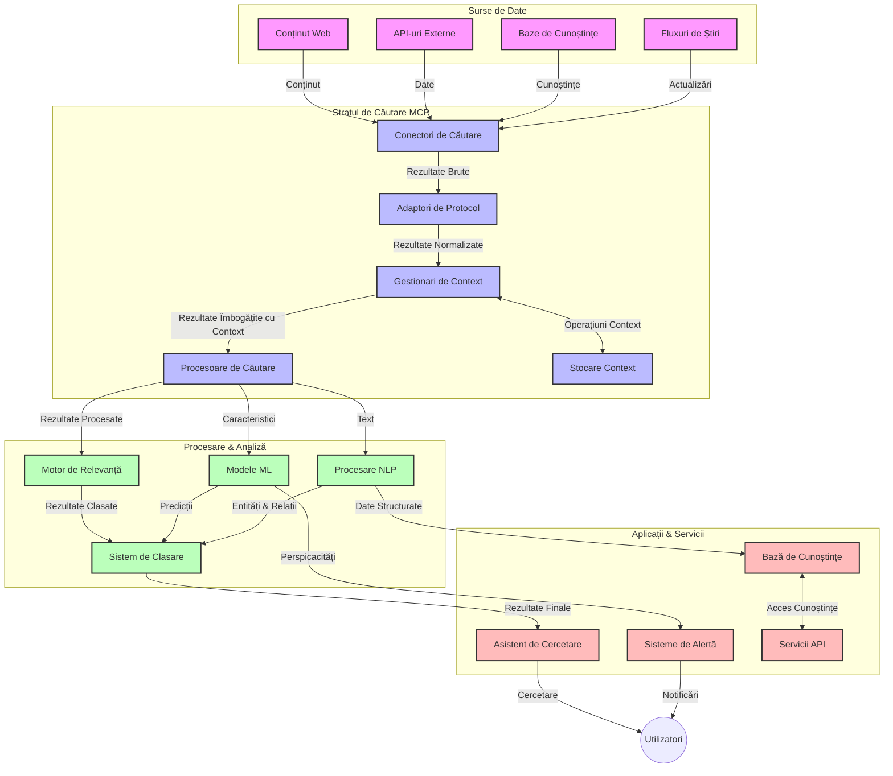
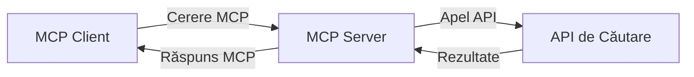
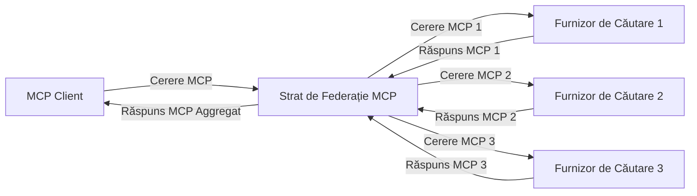
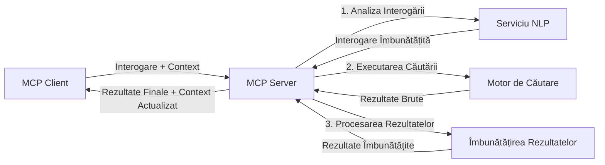

# Protocolul Contextului Modelului pentru Căutarea Web în Timp Real

## Prezentare generală

Căutarea web în timp real a devenit esențială în mediul actual orientat spre informații, unde aplicațiile au nevoie de acces imediat la informații actualizate din întreaga rețea pentru a oferi răspunsuri relevante și la momentul potrivit. Protocolul Contextului Modelului (MCP) reprezintă un progres semnificativ în optimizarea acestor procese de căutare în timp real, îmbunătățind eficiența căutării, menținând integritatea contextuală și sporind performanța generală a sistemului.

Acest modul explorează modul în care MCP transformă căutarea web în timp real prin oferirea unei abordări standardizate pentru gestionarea contextului între modelele AI, motoarele de căutare și aplicații.

### Ce vei învăța

În acest ghid cuprinzător vei descoperi:

- Cum creează MCP o punte fluidă între modelele AI și capabilitățile de căutare web în timp real
- Modele arhitecturale pentru implementarea soluțiilor de căutare eficiente și scalabile cu MCP
- Tehnici pentru păstrarea contextului căutării pe parcursul mai multor cereri și interacțiuni
- Implementări practice de cod în Python și JavaScript pentru diverse scenarii de căutare
- Metode pentru echilibrarea relevanței, recenței și performanței în sistemele de căutare alimentate de MCP

## Introducere în căutarea web în timp real

Căutarea web în timp real este o abordare tehnologică care permite interogarea, procesarea și analiza continuă a informațiilor bazate pe web pe măsură ce acestea sunt publicate sau actualizate, permițând sistemelor să furnizeze informații proaspete și relevante cu o latență minimă. Spre deosebire de sistemele tradiționale de căutare care operează pe date indexate ce pot fi vechi de ore sau zile, căutarea în timp real procesează date live de pe web, oferind perspective și informații care reflectă starea actuală a conținutului online.

### Concepte de bază ale căutării web în timp real:

- **Procesarea continuă a interogărilor**: Interogările de căutare sunt procesate pe baza surselor de date în continuă actualizare
- **Prioritizarea recenței**: Sistemele sunt proiectate să prioritizeze informațiile recente
- **Echilibrarea relevanței**: Menținerea unui echilibru între relevanță și recență
- **Arhitectură scalabilă**: Sistemele trebuie să gestioneze încărcături variabile de interogări și volume de date
- **Înțelegere contextuală**: Menținerea contextului utilizatorului pe parcursul multiplelor iterații de căutare este crucială pentru rezultate relevante
- **Reformulare dinamică a interogărilor**: Modificarea adaptivă a interogărilor pe baza contextului și a rezultatelor anterioare
- **Integrarea multi-sursă**: Combinarea rezultatelor din multiple surse de căutare și web
- **Înțelegere semantică**: Procesarea interogărilor și conținutului pe baza înțelesului, nu doar a cuvintelor-cheie
- **Clasament în timp real**: Ajustarea continuă a pozițiilor în rezultate pe măsură ce apar informații noi

### Protocolul Contextului Modelului și Căutarea Web în Timp Real

Protocolul Contextului Modelului (MCP) abordează mai multe provocări critice în mediile de căutare web în timp real:

1. **Păstrarea contextului căutării**: MCP standardizează modul în care contextul este menținut în componentele distribuite de căutare, asigurând că modelele AI și nodurile de procesare au acces la istoricul relevant al interogărilor și preferințele utilizatorului.

2. **Gestionarea eficientă a interogărilor**: Prin oferirea unor mecanisme structurate pentru transmiterea contextului, MCP reduce costurile repetării contextului la fiecare iterare de căutare.

3. **Interoperabilitate**: MCP creează un limbaj comun pentru schimbul de context între tehnologii diverse de căutare și modele AI, permițând arhitecturi mai flexibile și extensibile.

4. **Context optimizat pentru căutare**: Implementările MCP pot prioritiza elementele contextuale cele mai relevante pentru o căutare eficientă, optimizând atât performanța, cât și acuratețea.

5. **Procesare adaptivă a căutării**: Cu o gestionare corectă a contextului prin MCP, sistemele de căutare pot ajusta dinamic procesarea pe baza nevoilor utilizatorului și a peisajelor informaționale în evoluție.

În aplicații moderne, de la agregatoare de știri la asistenți de cercetare, integrarea MCP cu tehnologiile de căutare web permite o căutare mai inteligentă, conștientă de context, capabilă să ofere rezultate din ce în ce mai relevante pe măsură ce interacțiunile utilizatorului continuă.

## Obiective de învățare

La finalul acestei lecții, vei fi capabil să:

- Înțelegi fundamentele căutării web în timp real și provocările sale în aplicațiile moderne
- Explici cum Protocolul Contextului Modelului (MCP) îmbunătățește capabilitățile de căutare web în timp real
- Implementezi soluții de căutare bazate pe MCP folosind framework-uri și API-uri populare
- Proiectezi și implementezi arhitecturi scalabile, de înaltă performanță pentru căutare cu MCP
- Aplici conceptele MCP în diverse cazuri de utilizare, inclusiv căutare semantică, asistență în cercetare și navigare augmentată prin AI
- Evaluezi tendințele emergente și inovațiile viitoare în tehnologiile de căutare bazate pe MCP
- Dezvolți sisteme de căutare conștiente de context care învață din interacțiunile utilizatorului
- Integrezi capabilități de căutare web în asistenți AI folosind protocoale MCP standardizate
- Creezi pipeline-uri de căutare în multiple etape care rafinează progresiv rezultatele pe baza contextului
- Optimizezi performanța căutării menținând o conștientizare completă a contextului

### Definiție și importanță

Căutarea web în timp real implică interogarea, recuperarea și livrarea continuă a informațiilor web cu o latență minimă. Spre deosebire de motoarele tradiționale de căutare care realizează crawl periodic și indexează web-ul, căutarea în timp real urmărește să aducă la suprafață informații imediat ce devin disponibile, oferind acces instantaneu la cele mai actuale conținuturi.

Caracteristici-cheie ale căutării web în timp real includ:

- **Proaspăt**: Prioritizarea conținutului și actualizărilor recente
- **Procesare continuă**: Monitorizarea constantă pentru informații noi
- **Adaptarea interogărilor**: Ajustarea interogărilor pe baza contextului și feedback-ului
- **Livrare imediată**: Oferirea rezultatelor căutării cu întârziere minimă
- **Păstrarea contextului**: Construirea pe baza interogărilor anterioare pentru o relevanță îmbunătățită

### Provocări în căutarea web tradițională

Abordările tradiționale ale căutării web se confruntă cu mai multe limitări când sunt aplicate scenariilor în timp real:

1. **Fragmentarea contextului**: Dificultăți în menținerea contextului căutării pe parcursul multor interogări
2. **Proaspătimea informațiilor**: Provocări în accesarea și prioritizarea celor mai recente informații
3. **Complexitatea integrării**: Probleme cu interoperabilitatea între sistemele de căutare și aplicații
4. **Probleme de latență**: Echilibrarea căutării exhaustive cu cerințele de timp de răspuns
5. **Ajustarea relevanței**: Asigurarea acurateței și relevanței în timp ce se prioritizează recența

## Înțelegerea Protocolului Contextului Modelului (MCP) pentru Căutare

### Ce este MCP în contexte de căutare?

Protocolul Contextului Modelului (MCP) este un protocol de comunicare standardizat conceput pentru a facilita interacțiunea eficientă între modelele AI și aplicații. În contextul căutării web în timp real, MCP oferă un cadru pentru:

- Păstrarea contextului căutării pe parcursul secvențelor de interogări
- Standardizarea formatelor interogărilor de căutare și a rezultatelor
- Optimizarea transmiterii parametrilor și rezultatelor de căutare
- Îmbunătățirea comunicației dintre model și motorul de căutare

### Componente de bază și arhitectură

Arhitectura MCP pentru căutarea web în timp real constă din mai multe componente-cheie:

1. **Gestionari de context al interogării**: Gestionează și mențin contextul căutării pe parcursul mai multor interogări
2. **Procesoare de căutare**: Procesează cererile de căutare primite folosind tehnici conștiente de context
3. **Adaptoare de protocol**: Convertesc între API-uri de căutare diferite păstrând contextul
4. **Depozit de context**: Stochează și recuperează eficient istoricul căutărilor și preferințele
5. **Conectori de căutare**: Se conectează la diverse motoare de căutare și API-uri web



### Cum îmbunătățește MCP căutarea web în timp real

MCP abordează provocările căutării web tradiționale prin:

- **Continuitate contextuală**: Menținerea relațiilor între interogări pe durata întregii sesiuni de căutare
- **Transmitere optimizată**: Reducerea redundanței în parametrii căutării prin gestionare inteligentă a contextului
- **Interfețe standardizate**: Oferirea de API-uri consistente pentru componentele de căutare
- **Reducerea latenței**: Minimiza procesarea suplimentară prin manipulare eficientă a contextului
- **Relevanță sporită**: Îmbunătățirea relevanței căutării prin păstrarea intenției utilizatorului pe parcursul mai multor interogări

## Integrare și implementare

Sistemele de căutare web în timp real necesită un design arhitectural atent și implementare pentru a menține atât performanța, cât și integritatea contextuală. Protocolul Contextului Modelului oferă o abordare standardizată pentru integrarea modelelor AI și a tehnologiilor de căutare, permițând pipeline-uri de căutare mai sofisticate, conștiente de context.

### Prezentare generală a integrării MCP în arhitecturile de căutare

Implementarea MCP în mediile de căutare web în timp real implică mai mulți factori esențiali:

1. **Serializarea contextului căutării**: MCP oferă mecanisme eficiente de codare a informațiilor contextuale în cererile de căutare, asigurând că contextul esențial însoțește interogarea pe tot parcursul pipeline-ului de procesare. Acestea includ formate de serializare standardizate, optimizate pentru metadatele legate de căutare.

2. **Procesare cu stare a căutării**: MCP permite procesare mai inteligentă, cu stare, menținând o reprezentare consistentă a contextului pe parcursul iterațiilor de căutare. Acest lucru este deosebit de valoros în pipeline-urile de căutare în mai multe etape, unde rafinarea contextului îmbunătățește rezultatele.

3. **Extinderea și rafinarea interogării**: Implementările MCP în sistemele de căutare pot facilita extinderea și rafinarea sofisticată a interogărilor pe baza contextului acumulat, permițând rezultate din ce în ce mai relevante pe măsură ce sesiunea de căutare progresează.

4. **Cache de rezultate și prioritizare**: Prin standardizarea manipularii contextului, MCP ajută la gestionarea cache-ului de rezultate și prioritizarea acestora, permițând componentelor să se adapteze în funcție de contextul căutării în evoluție.

5. **Federarea și agregarea căutării**: MCP facilitează o federare mai sofisticată a căutării pe mai multe backend-uri oferind reprezentări structurate ale contextului căutării, permițând o agregare mai semnificativă a rezultatelor din surse diverse.

Implementarea MCP în diverse tehnologii de căutare creează o abordare unificată pentru gestionarea contextului, reducând necesitatea codului personalizat de integrare și sporind capacitatea sistemului de a menține un context relevant pe măsură ce interogările de căutare evoluează.

### MCP în diverse implementări ale căutării web

Aceste exemple urmează specificația MCP curentă, care se concentrează pe un protocol bazat pe JSON-RPC cu mecanisme de transport distincte. Codul demonstrează cum puteți implementa integrări personalizate de căutare păstrând compatibilitatea completă cu protocolul MCP.

<details>
<summary>Implementare Python cu API generic de căutare</summary>

```python
import asyncio
import json
import aiohttp
from typing import Dict, Any, Optional, List
from contextlib import asynccontextmanager
from collections.abc import AsyncIterator

# Importă bibliotecile standard MCP
from mcp.client.session import ClientSession
from mcp.client.streamable_http import streamablehttp_client
from mcp.types import TextContent, CreateMessageRequestParams, CreateMessageResult
from mcp.server.fastmcp import FastMCP

# Creează un server FastMCP pentru căutare web
search_server = FastMCP("WebSearch")

# Clasa pentru gestionarea operațiunilor de căutare web
class WebSearchHandler:
    def __init__(self, api_endpoint: str, api_key: str):
        self.api_endpoint = api_endpoint
        self.api_key = api_key
        self.session = None
        
    async def initialize(self):
        """Initialize the HTTP session"""
        self.session = aiohttp.ClientSession(
            headers={"Authorization": f"Bearer {self.api_key}"}
        )
    
    async def close(self):
        """Close the HTTP session"""
        if self.session:
            await self.session.close()
            
    async def perform_search(self, query: str, max_results: int = 5, 
                           include_domains: List[str] = None, 
                           exclude_domains: List[str] = None,
                           time_period: str = "any") -> Dict[str, Any]:
        """Perform web search using the search API"""
        # Construiește parametrii căutării
        search_params = {
            "q": query,
            "limit": max_results,
            "time": time_period
        }
        
        if include_domains:
            search_params["site"] = ",".join(include_domains)
            
        if exclude_domains:
            search_params["exclude_site"] = ",".join(exclude_domains)
        
        # Efectuează cererea de căutare
        try:
            async with self.session.get(
                self.api_endpoint,
                params=search_params
            ) as response:
                if response.status != 200:
                    error_text = await response.text()
                    raise Exception(f"Search API error: {response.status} - {error_text}")
                
                search_data = await response.json()
                
                # Transformă răspunsul specific API într-un format standard
                results = []
                for item in search_data.get("results", []):
                    results.append({
                        "title": item.get("title", ""),
                        "url": item.get("url", ""),
                        "snippet": item.get("snippet", ""),
                        "date": item.get("published_date", ""),
                        "source": item.get("source", "")
                    })
                
                return {
                    "query": query,
                    "totalResults": len(results),
                    "results": results
                }
        except Exception as e:
            print(f"Search API request error: {e}")
            raise

# Inițializează handler-ul de căutare
search_handler = WebSearchHandler(
    api_endpoint="https://api.search-service.example/search",
    api_key="your-api-key-here"
)

# Configurează durata de viață pentru a gestiona handler-ul de căutare
@asyncio.asynccontextmanager
async def app_lifespan(server: FastMCP):
    """Manage application lifecycle"""
    await search_handler.initialize()
    try:
        yield {"search_handler": search_handler}
    finally:
        await search_handler.close()

# Setează durata de viață pentru server
search_server = FastMCP("WebSearch", lifespan=app_lifespan)

# Înregistrează un instrument de căutare web
@search_server.tool()
async def web_search(query: str, max_results: int = 5, 
                   include_domains: List[str] = None,
                   exclude_domains: List[str] = None,
                   time_period: str = "any") -> Dict[str, Any]:
    """
    Search the web for information
    
    Args:
        query: The search query
        max_results: Maximum number of results to return (default: 5)
        include_domains: List of domains to include in search results
        exclude_domains: List of domains to exclude from search results
        time_period: Time period for results ("day", "week", "month", "any")
        
    Returns:
        Dictionary containing search results
    """
    ctx = search_server.get_context()
    search_handler = ctx.request_context.lifespan_context["search_handler"]
    
    results = await search_handler.perform_search(
        query=query,
        max_results=max_results,
        include_domains=include_domains,
        exclude_domains=exclude_domains,
        time_period=time_period
    )
    
    return results

# Exemplu de utilizare client
async def client_example():
    # Conectează-te la serverul de căutare folosind transportul HTTP Streamable
    async with streamablehttp_client("http://localhost:8000/mcp") as (read, write, _):
        async with ClientSession(read, write) as session:
            # Inițializează conexiunea
            await session.initialize()
            
            # Apelează instrumentul web_search
            search_results = await session.call_tool(
                "web_search", 
                {
                    "query": "latest developments in AI and Model Context Protocol",
                    "max_results": 5,
                    "time_period": "day",
                    "include_domains": ["github.com", "microsoft.com"]
                }
            )
            
            print(f"Search results: {search_results}")

# Exemplu de execuție a serverului
if __name__ == "__main__":
    # Rulează serverul cu transport HTTP Streamable
    search_server.run(transport="streamable-http")
```
</details> 

<details>
<summary>Implementare JavaScript cu căutare bazată pe browser</summary>

```javascript
// Implementare server MCP pentru căutare web
import { McpServer, ResourceTemplate } from '@modelcontextprotocol/sdk/server/mcp.js';
import { StreamableHTTPServerTransport } from '@modelcontextprotocol/sdk/server/streamableHttp.js';
import { z } from 'zod';

// Creează un server MCP pentru căutare web
const searchServer = new McpServer({
    name: "BrowserSearch",
    description: "A server that provides web search capabilities"
});

// Clasă serviciu de căutare
class SearchService {
    constructor(searchApiUrl, apiKey) {
        this.searchApiUrl = searchApiUrl;
        this.apiKey = apiKey;
    }

    async performSearch(parameters) {
        const {
            query = '',
            maxResults = 5,
            includeDomains = [],
            excludeDomains = [],
            timePeriod = 'any'
        } = parameters;
        
        // Construiește URL-ul de căutare cu parametri
        const url = new URL(this.searchApiUrl);
        url.searchParams.append('q', query);
        url.searchParams.append('limit', maxResults);
        url.searchParams.append('time', timePeriod);
        
        if (includeDomains.length > 0) {
            url.searchParams.append('site', includeDomains.join(','));
        }
        
        if (excludeDomains.length > 0) {
            url.searchParams.append('exclude_site', excludeDomains.join(','));
        }
        
        try {
            const response = await fetch(url.toString(), {
                method: 'GET',
                headers: {
                    'Authorization': `Bearer ${this.apiKey}`,
                    'Content-Type': 'application/json'
                }
            });
            
            if (!response.ok) {
                const errorText = await response.text();
                throw new Error(`Search API error: ${response.status} - ${errorText}`);
            }
            
            const searchData = await response.json();
            
            // Transformă răspunsul specific API-ului într-un format standard
            const results = searchData.results?.map(item => ({
                title: item.title || '',
                url: item.url || '',
                snippet: item.snippet || '',
                date: item.published_date || '',
                source: item.source || ''
            })) || [];
            
            return {
                query,
                totalResults: results.length,
                results
            };
        } catch (error) {
            console.error('Search API request error:', error);
            throw error;
        }
    }
}

// Inițializează serviciul de căutare
const searchService = new SearchService(
    'https://api.search-service.example/search',
    'your-api-key-here'
);

// Configurează furnizorul de context pentru server
searchServer.setContextProvider(() => {
    return {
        searchService
    };
});

// Înregistrează instrumentul de căutare web
searchServer.tool({
    name: 'web_search',
    description: 'Search the web for information',
    parameters: {
        type: 'object',
        properties: {
            query: {
                type: 'string',
                description: 'The search query'
            },
            maxResults: {
                type: 'integer',
                description: 'Maximum number of results to return',
                default: 5
            },
            includeDomains: {
                type: 'array',
                items: { type: 'string' },
                description: 'List of domains to include in search results'
            },
            excludeDomains: {
                type: 'array',
                items: { type: 'string' },
                description: 'List of domains to exclude from search results'
            },
            timePeriod: {
                type: 'string',
                description: 'Time period for results',
                enum: ['day', 'week', 'month', 'any'],
                default: 'any'
            }
        },
        required: ['query']
    },
    handler: async (params, context) => {
        const { searchService } = context;
        return await searchService.performSearch(params);
    }
});

// Cod exemplu client pentru a se conecta la serverul de căutare
import { Client } from '@modelcontextprotocol/sdk/client/index.js';
import { StreamableHTTPClientTransport } from '@modelcontextprotocol/sdk/client/streamableHttp.js';

async function connectToSearchServer() {
    // Conectează-te la serverul de căutare
    const transport = new StreamableHTTPClientTransport(
        new URL('http://localhost:8000/mcp')
    );
    
    const client = new Client({
        name: 'search-client',
        version: '1.0.0'
    });
    
    await client.connect(transport);
    
    // Execută instrumentul de căutare
    const searchResults = await client.callTool({
        name: 'web_search',
        arguments: {
            query: 'Model Context Protocol implementation examples',
            maxResults: 10,
            timePeriod: 'week',
            includeDomains: ['github.com', 'docs.microsoft.com']
        }
    });
    
    console.log('Search results:', searchResults);
    
    // Curățare
    await client.disconnect();
}

// Pornește serverul
const transport = new StreamableHTTPServerTransport();
await searchServer.connect(transport);
console.log('Search server running at http://localhost:8000/mcp');

// Într-un proces separat sau după ce serverul este pornit
// connectToSearchServer().catch(console.error);
```
</details> 

## Declarație privind exemplele de cod

> **Notă importantă**: Exemplele de cod de mai jos demonstrează integrarea Protocolului Contextului Modelului (MCP) cu funcționalitatea de căutare web. Deși urmează modelele și structurile SDK-urilor oficiale MCP, au fost simplificate în scopuri educaționale.
> 
> Aceste exemple prezintă:
> 
> 1. **Implementare Python**: O implementare a serverului FastMCP care oferă un instrument de căutare web și se conectează la un API extern de căutare. Acest exemplu demonstrează gestionarea corectă a duratei de viață, manipularea contextului și implementarea instrumentului urmând modelele [SDK-ului oficial MCP pentru Python](https://github.com/modelcontextprotocol/python-sdk). Serverul utilizează transportul HTTP Streamable recomandat, care a înlocuit vechiul transport SSE pentru implementările în producție.
> 
> 2. **Implementare JavaScript**: O implementare TypeScript/JavaScript folosind modelul FastMCP din [SDK-ul oficial MCP TypeScript](https://github.com/modelcontextprotocol/typescript-sdk) pentru a crea un server de căutare cu definiții corecte ale instrumentelor și conexiuni ale clienților. Urmează cele mai recente modele recomandate pentru gestionarea sesiunii și păstrarea contextului.
> 
> Aceste exemple necesită cod suplimentar pentru tratarea erorilor, autentificare și integrarea specifică a API-ului pentru utilizare în producție. Endpoint-urile API de căutare afișate (`https://api.search-service.example/search`) sunt elemente de substituție și trebuie înlocuite cu endpoint-uri reale ale serviciilor de căutare.
> 
> Pentru detalii complete privind implementarea și cele mai actualizate abordări, vă rugăm să consultați [specificația oficială MCP](https://spec.modelcontextprotocol.io/) și documentația SDK-ului.

## Concepte de bază

### Cadru Protocolului Contextului Modelului (MCP)

La bază, Protocolul Contextului Modelului oferă o metodă standardizată pentru ca modelele AI, aplicațiile și serviciile să poată face schimb de context. În căutarea web în timp real, acest cadru este esențial pentru crearea unor experiențe coerente, cu mai multe runde de căutări. Componentele-cheie includ:

1. **Arhitectură client-server**: MCP stabilește o separare clară între clienți de căutare (solicitanți) și servere de căutare (furnizori), permițând modelelor de implementare flexibile.

2. **Comunicare JSON-RPC**: Protocolul folosește JSON-RPC pentru schimbul de mesaje, făcându-l compatibil cu tehnologiile web și ușor de implementat pe diverse platforme.

3. **Gestionarea contextului**: MCP definește metode structurate pentru menținerea, actualizarea și valorificarea contextului căutării de-a lungul mai multor interacțiuni.

4. **Definiții de instrumente**: Capacitățile de căutare sunt expuse ca instrumente standardizate cu parametri și valori de retur bine definite.

5. **Suport pentru streaming**: Protocolul suportă streaming-ul rezultatelor, esențial pentru căutarea în timp real unde rezultatele pot sosii progresiv.

### Modele de integrare a căutării web

La integrarea MCP cu căutarea web, apar mai multe modele:

#### 1. Integrare directă cu furnizorul de căutare


  
În acest model, serverul MCP interacționează direct cu unul sau mai multe API-uri de căutare, traducând cererile MCP în apeluri specifice API-ului și formatează rezultatele ca răspunsuri MCP.

#### 2. Căutare federată cu păstrarea contextului


  
Acest model distribuie interogările de căutare către mai mulți furnizori de căutare compatibili MCP, fiecare specializat potențial în diferite tipuri de conținut sau capabilități de căutare, menținând în același timp un context unificat.

#### 3. Lanț de căutare îmbunătățit cu context


  
În acest model, procesul de căutare este divizat în mai multe etape, contextul fiind îmbogățit la fiecare pas, rezultând rezultate progresiv mai relevante.

### Componentele contextului de căutare

În căutarea web bazată pe MCP, contextul tipic include:

- **Istoricul interogărilor**: Interogările anterioare din sesiune
- **Preferințele utilizatorului**: Limba, regiunea, setările de căutare sigură
- **Istoricul interacțiunilor**: Care rezultate au fost accesate, timpul petrecut pe rezultate
- **Parametrii căutării**: Filtre, ordonări și alți modificatori ai căutării
- **Cunoștințe de domeniu**: Context specific subiectului relevant căutării
- **Context temporal**: Factori de relevanță în funcție de timp
- **Preferințe de sursă**: Surse de informare de încredere sau preferate

## Cazuri de utilizare și aplicații

### Cercetare și colectare de informații

MCP îmbunătățește fluxurile de lucru în cercetare prin:

- Păstrarea contextului cercetării pe parcursul sesiunilor de căutare
- Permițând interogări sofisticate și contextual relevante
- Susținerea federării căutării multi-sursă
- Facilitarea extragerii de cunoștințe din rezultatele căutării

### Monitorizarea știrilor și tendințelor în timp real

Căutarea alimentată de MCP oferă avantaje pentru monitorizarea știrilor:

- Descoperire aproape în timp real a poveștilor de știri emergente
- Filtrare contextuală a informațiilor relevante
- Urmărirea temelor și entităților prin multiple surse
- Alerte personalizate de știri bazate pe contextul utilizatorului

### Navigare și cercetare augmentate de AI

MCP creează noi posibilități pentru navigarea augmentată de AI:

- Sugestii contextuale de căutare bazate pe activitatea curentă din browser
- Integrare fluidă a căutării web cu asistenți bazati pe LLM
- Rafinare multi-rundă a căutării cu context păstrat
- Verificare și validare îmbunătățite a informațiilor

## Tendințe și inovații viitoare

### Evoluția MCP în căutarea web

Privind înainte, anticipăm că MCP va evolua pentru a aborda:
- **Căutare Multimodală**: Integrarea căutării text, imagine, audio și video cu context păstrat
- **Căutare Descentralizată**: Suport pentru ecosisteme de căutare distribuite și federate
- **Confidențialitatea Căutării**: Mecanisme de căutare care păstrează confidențialitatea contextuală
- **Înțelegerea Interogărilor**: Analiză semantică profundă a interogărilor de căutare în limbaj natural

### Posibile Progrese în Tehnologie

Tehnologii emergente care vor modela viitorul căutării MCP:

1. **Arhitecturi de Căutare Neurală**: Sisteme de căutare bazate pe embedding-uri optimizate pentru MCP
2. **Context Personalizat de Căutare**: Învățarea pattern-urilor de căutare individuale ale utilizatorilor în timp
3. **Integrarea Graficului de Cunoștințe**: Căutare contextuală îmbunătățită de grafice de cunoștințe specifice domeniului
4. **Context Cross-Modal**: Menținerea contextului prin diferite moduri de căutare

## Exerciții Practice

### Exercițiul 1: Configurarea unui Pipeline de Căutare MCP de Bază

În acest exercițiu vei învăța să:
- Configurezi un mediu de căutare MCP de bază
- Implementezi handleri de context pentru căutare web
- Testezi și validezi păstrarea contextului în mai multe iterații de căutare

### Exercițiul 2: Construirea unui Asistent de Cercetare cu Căutare MCP

Creează o aplicație completă care:
- Procesează întrebări de cercetare în limbaj natural
- Execută căutări web contextuale
- Sintezează informații din mai multe surse
- Prezintă rezultate de cercetare organizate

### Exercițiul 3: Implementarea unei Federații de Căutare Multi-Sursă cu MCP

Exercițiu avansat care acoperă:
- Trimiterea interogărilor contextuale către mai multe motoare de căutare
- Clasarea și agregarea rezultatelor
- Deduplificarea contextuală a rezultatelor căutării
- Gestionarea metadatelor specifice surselor

## Resurse Suplimentare

- [Model Context Protocol Specification](https://spec.modelcontextprotocol.io/) - Specificația oficială MCP și documentație detaliată a protocolului
- [Model Context Protocol Documentation](https://modelcontextprotocol.io/) - Tutoriale detaliate și ghiduri de implementare
- [MCP Python SDK](https://github.com/modelcontextprotocol/python-sdk) - Implementarea oficială Python a protocolului MCP
- [MCP TypeScript SDK](https://github.com/modelcontextprotocol/typescript-sdk) - Implementarea oficială TypeScript a protocolului MCP
- [MCP Reference Servers](https://github.com/modelcontextprotocol/servers) - Implementări de referință ale serverelor MCP
- [Bing Web Search API Documentation](https://learn.microsoft.com/en-us/bing/search-apis/bing-web-search/overview) - API-ul de căutare web Microsoft
- [Google Custom Search JSON API](https://developers.google.com/custom-search/v1/overview) - Motorul de căutare programabil Google
- [SerpAPI Documentation](https://serpapi.com/search-api) - API pagini rezultate motor de căutare
- [Meilisearch Documentation](https://www.meilisearch.com/docs) - Motor de căutare open-source
- [Elasticsearch Documentation](https://www.elastic.co/guide/index.html) - Motor distribuit de căutare și analiză
- [LangChain Documentation](https://python.langchain.com/docs/get_started/introduction) - Construirea aplicațiilor cu LLM-uri

## Rezultate de Învățare

Parcurgând acest modul vei fi capabil să:

- Înțelegi fundamentele căutării web în timp real și provocările acesteia
- Explici cum Model Context Protocol (MCP) îmbunătățește capacitățile căutării web în timp real
- Implementezi soluții de căutare bazate pe MCP utilizând framework-uri și API-uri populare
- Proiectezi și implementezi arhitecturi scalabile și performante de căutare cu MCP
- Aplici conceptele MCP în diverse cazuri de utilizare, inclusiv căutare semantică, asistență pentru cercetare și navigare augmentată de AI
- Evaluezi tendințele emergente și inovațiile viitoare în tehnologiile de căutare bazate pe MCP

### Considerații privind Încrederea și Siguranța

La implementarea soluțiilor de căutare web bazate pe MCP, amintește-ți aceste principii importante din specificația MCP:

1. **Consimțământ și Control al Utilizatorului**: Utilizatorii trebuie să consimtă explicit și să înțeleagă toate accesările și operațiunile asupra datelor. Acest aspect este deosebit de important pentru implementările de căutare web care pot accesa surse externe de date.

2. **Confidențialitatea Datelor**: Asigură gestionarea adecvată a interogărilor și rezultatelor de căutare, mai ales când acestea pot conține informații sensibile. Implementează controale de acces corespunzătoare pentru protejarea datelor utilizatorilor.

3. **Siguranța Uneltelor**: Implementează autorizare și validare corespunzătoare pentru uneltele de căutare, deoarece acestea pot reprezenta riscuri de securitate prin execuția codului arbitrar. Descrierile comportamentului uneltelor trebuie considerate neîncrezătoare decât dacă provin de la un server de încredere.

4. **Documentație Clară**: Oferă o documentație clară despre capabilitățile, limitările și considerentele de securitate ale implementării tale MCP, urmând ghidurile din specificația MCP.

5. **Fluxuri Robuste pentru Consimțământ**: Construiește fluxuri robuste de consimțământ și autorizare care să explice clar ce face fiecare unealtă înainte de a autoriza utilizarea acesteia, mai ales pentru uneltele care interacționează cu resurse externe web.

Pentru detalii complete despre securitatea și încrederea MCP, consultă [documentația oficială](https://modelcontextprotocol.io/specification/2025-11-25/basic/security_best_practices).

## Ce urmează

- [5.12 Autentificarea Entra ID pentru servere Model Context Protocol](../mcp-security-entra/README.md)

---

<!-- CO-OP TRANSLATOR DISCLAIMER START -->
**Declinare a responsabilității**:
Acest document a fost tradus folosind serviciul de traducere AI [Co-op Translator](https://github.com/Azure/co-op-translator). În timp ce ne străduim pentru acuratețe, vă rugăm să rețineți că traducerile automate pot conține erori sau inexactități. Documentul original în limba sa nativă trebuie considerat sursa autorizată. Pentru informații critice, se recomandă traducerea profesională realizată de un om. Nu ne asumăm responsabilitatea pentru eventualele neînțelegeri sau interpretări greșite care decurg din utilizarea acestei traduceri.
<!-- CO-OP TRANSLATOR DISCLAIMER END -->