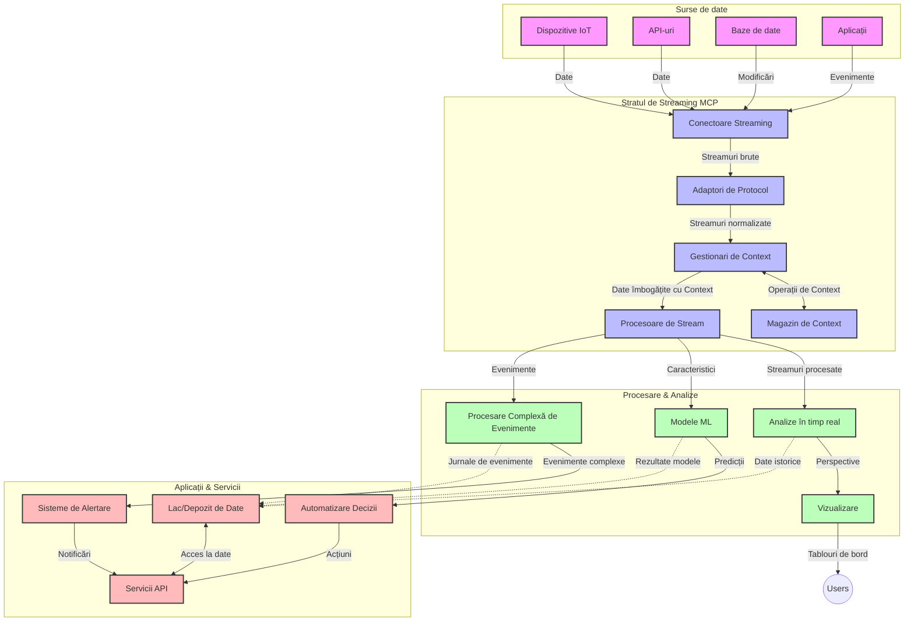

# Protocolul Contextului Modelului pentru Streaming de Date în Timp Real

## Prezentare generală

Streamingul de date în timp real a devenit esențial în lumea condusă de date de astăzi, unde afacerile și aplicațiile necesită acces imediat la informații pentru a lua decizii în timp util. Protocolul Contextului Modelului (MCP) reprezintă un avans semnificativ în optimizarea acestor procese de streaming în timp real, îmbunătățind eficiența procesării datelor, menținând integritatea contextuală și sporind performanța generală a sistemului.

Acest modul explorează modul în care MCP transformă streamingul de date în timp real, oferind o abordare standardizată pentru gestionarea contextului între modelele AI, platformele de streaming și aplicații.

## Introducere în Streamingul de Date în Timp Real

Streamingul de date în timp real este un paradigmă tehnologică care permite transferul, procesarea și analiza continuă a datelor pe măsură ce acestea sunt generate, permițând sistemelor să reacționeze imediat la noile informații. Spre deosebire de procesarea tradițională pe loturi care funcționează pe seturi statice de date, streamingul procesează date în mișcare, oferind perspective și acțiuni cu o latență minimă.

### Concepte de bază ale streamingului de date în timp real:

- **Flux continuu de date**: Datele sunt procesate ca un flux continuu, nesfârșit, de evenimente sau înregistrări.
- **Procesare cu latență redusă**: Sistemele sunt proiectate pentru a minimiza timpul dintre generarea și procesarea datelor.
- **Scalabilitate**: Arhitecturile de streaming trebuie să gestioneze volume și viteze variabile de date.
- **Toleranță la erori**: Sistemele trebuie să fie rezistente la defecțiuni pentru a asigura fluxul neîntrerupt de date.
- **Procesare cu stare**: Menținerea contextului între evenimente este crucială pentru analiza semnificativă.

### Protocolul Contextului Modelului și Streamingul în Timp Real

Protocolul Contextului Modelului (MCP) abordează mai multe provocări critice în mediile de streaming în timp real:

1. **Continuitatea Contextuală**: MCP standardizează modul în care contextul este menținut între componentele distribuite de streaming, asigurând accesul modelelor AI și nodurilor de procesare la context istoric și de mediu relevant.

2. **Gestionarea Eficientă a Stării**: Prin oferirea de mecanisme structurate pentru transmiterea contextului, MCP reduce încărcătura gestionării stării în conductele de streaming.

3. **Interoperabilitate**: MCP creează un limbaj comun pentru partajarea contextului între tehnologii diverse de streaming și modele AI, permițând arhitecturi mai flexibile și extensibile.

4. **Context Optim pentru Streaming**: Implementările MCP pot prioritiza elementele de context cele mai relevante pentru luarea deciziilor în timp real, optimizând atât performanța, cât și acuratețea.

5. **Procesare Adaptivă**: Cu o gestionare adecvată a contextului prin MCP, sistemele de streaming pot ajusta dinamic procesarea pe baza condițiilor și modelelor evolutive în date.

În aplicații moderne, de la rețele de senzori IoT la platforme financiare de tranzacționare, integrarea MCP cu tehnologiile de streaming permite o procesare mai inteligentă, conștientă de context, care poate răspunde adecvat la situații complexe și în evoluție în timp real.

## Obiective de învățare

La sfârșitul acestei lecții, vei putea să:

- Înțelegi fundamentele streamingului de date în timp real și provocările sale
- Explici cum Protocolul Contextului Modelului (MCP) îmbunătățește streamingul de date în timp real
- Implementezi soluții de streaming bazate pe MCP folosind cadre populare ca Kafka și Pulsar
- Proiectezi și implementezi arhitecturi de streaming tolerante la erori și cu performanță ridicată cu MCP
- Aplici conceptele MCP în cazuri de utilizare legate de IoT, tranzacționare financiară și analize conduse de AI
- Evaluezi tendințele emergente și inovațiile viitoare în tehnologiile de streaming bazate pe MCP

### Definiție și semnificație

Streamingul de date în timp real implică generarea continuă, procesarea și livrarea datelor cu latență minimă. Spre deosebire de procesarea pe loturi, unde datele sunt colectate și procesate în grupuri, datele din streaming sunt procesate incremental pe măsură ce sosesc, ceea ce permite perspective și acțiuni imediate.

Caracteristici cheie ale streamingului de date în timp real includ:

- **Latență scăzută**: Procesarea și analizarea datelor în milisecunde până la secunde
- **Flux continuu**: Fluxuri neîntrerupte de date din diverse surse
- **Procesare imediată**: Analizarea datelor pe măsură ce sosesc, nu în loturi
- **Arhitectură bazată pe evenimente**: Răspuns la evenimente pe măsură ce apar

### Provocări în streamingul tradițional de date

Abordările tradiționale de streaming de date se confruntă cu mai multe limitări:

1. **Pierderea contextului**: dificultăți în menținerea contextului între sisteme distribuite
2. **Probleme de scalabilitate**: provocări în scalarea pentru a gestiona volume mari și date cu viteză mare
3. **Complexitate în integrare**: probleme de interoperabilitate între sisteme diferite
4. **Gestionarea latenței**: echilibrarea throughput-ului cu timpul de procesare
5. **Consistența datelor**: asigurarea acurateței și completitudinii datelor pe întregul flux

## Înțelegerea Protocolului Contextului Modelului (MCP)

### Ce este MCP?

Protocolul Contextului Modelului (MCP) este un protocol standardizat de comunicație conceput pentru a facilita interacțiunea eficientă între modelele AI și aplicații. În contextul streamingului de date în timp real, MCP oferă un cadru pentru:

- Păstrarea contextului pe tot parcursul conductei de date
- Standardizarea formatelor de schimb de date
- Optimizarea transmiterii seturilor mari de date
- Îmbunătățirea comunicării între modele și între modele și aplicații

### Componente și arhitectură principale

Arhitectura MCP pentru streaming în timp real este alcătuită din mai multe componente cheie:

1. **Gestionari de context**: Gestionează și mențin informațiile contextuale pe întregul pipeline de streaming
2. **Procesoare de flux**: Procesează fluxurile de date primite utilizând tehnici conștiente de context
3. **Adaptori de protocol**: Convertesc între diferite protocoale de streaming păstrând contextul
4. **Depozit de context**: Stochează și recuperează eficient informațiile contextuale
5. **Conectori de streaming**: Se conectează la diverse platforme de streaming (Kafka, Pulsar, Kinesis, etc.)



### Cum îmbunătățește MCP gestionarea datelor în timp real

MCP abordează provocările tradiționale ale streamingului prin:

- **Integritate contextuală**: Menținerea relațiilor între punctele de date pe întregul pipeline
- **Transmitere optimizată**: Reducerea redundanței în schimbul de date prin gestionarea inteligentă a contextului
- **Interfețe standardizate**: Oferirea de API-uri consistente pentru componentele de streaming
- **Latență redusă**: Minimizați supraîncărcarea procesării prin gestionarea eficientă a contextului
- **Scalabilitate îmbunătățită**: Suportarea scalării orizontale păstrând contextul

## Integrare și implementare

Sistemele de streaming de date în timp real necesită o proiectare și implementare atentă pentru a menține atât performanța, cât și integritatea contextuală. Protocolul Contextului Modelului oferă o abordare standardizată pentru integrarea modelelor AI și tehnologiilor de streaming, permițând conducte de procesare mai sofisticate, conștiente de context.

### Prezentare generală a integrării MCP în arhitecturile de streaming

Implementarea MCP în mediile de streaming în timp real implică mai multe considerații cheie:

1. **Serializarea și transportul contextului**: MCP oferă mecanisme eficiente pentru codarea informațiilor contextuale în pachetele de date de streaming, asigurând că contextul esențial însoțește datele pe tot parcursul pipeline-ului de procesare. Aceasta include formate de serializare standardizate optimizate pentru transportul în streaming.

2. **Procesare stream cu stare**: MCP permite o procesare mai inteligentă, cu stare, menținând o reprezentare consistentă a contextului între nodurile de procesare. Acest aspect este deosebit de valoros în arhitecturile distribuite de streaming, unde gestionarea stării este în mod tradițional o provocare.

3. **Timpul evenimentului vs. timpul procesării**: Implementările MCP în sistemele de streaming trebuie să abordeze provocarea comună de a diferenția între momentul în care evenimentele au avut loc și cel în care sunt procesate. Protocolul poate încorpora context temporal care păstrează semantica timpului evenimentului.

4. **Gestionarea backpressure-ului**: Prin standardizarea gestionării contextului, MCP ajută la gestionarea backpressure-ului în sistemele de streaming, permițând componentelor să comunice capacitățile lor de procesare și să ajusteze fluxul corespunzător.

5. **Ferestre de context și agregare**: MCP facilitează operațiuni mai sofisticate de fereastră oferind reprezentări structurate ale contextelor temporale și relaționale, permițând agregări mai semnificative pe fluxurile de evenimente.

6. **Procesare exact o dată**: În sistemele de streaming care necesită semantică exact o dată, MCP poate încorpora metadate de procesare pentru a ajuta la urmărirea și verificarea stadiului procesării între componente distribuite.

Implementarea MCP în diferite tehnologii de streaming creează o abordare unificată pentru gestionarea contextului, reducând nevoia de cod personalizat de integrare și sporind capacitatea sistemului de a menține un context semnificativ pe măsură ce datele circulă prin conductă.

### MCP în diverse cadre de streaming de date

Aceste exemple urmează specificația MCP curentă, care se concentrează pe un protocol bazat pe JSON-RPC cu mecanisme distincte de transport. Codul demonstrează cum poți implementa transporturi personalizate care integrează platforme de streaming precum Kafka și Pulsar, menținând compatibilitatea completă cu protocolul MCP.

Exemplele sunt concepute să arate cum platformele de streaming pot fi integrate cu MCP pentru a oferi procesare de date în timp real, menținând în același timp conștientizarea contextului, care este centrală pentru MCP. Această abordare asigură că exemplarele de cod reflectă cu acuratețe stadiul actual al specificației MCP începând cu iunie 2025.

MCP poate fi integrat cu cadre populare de streaming, inclusiv:

#### Integrare Apache Kafka

```python
import asyncio
import json
from typing import Dict, Any, Optional
from confluent_kafka import Consumer, Producer, KafkaError
from mcp.client import Client, ClientCapabilities
from mcp.core.message import JsonRpcMessage
from mcp.core.transports import Transport

# Clasă de transport personalizată pentru a face legătura între MCP și Kafka
class KafkaMCPTransport(Transport):
    def __init__(self, bootstrap_servers: str, input_topic: str, output_topic: str):
        self.bootstrap_servers = bootstrap_servers
        self.input_topic = input_topic
        self.output_topic = output_topic
        self.producer = Producer({'bootstrap.servers': bootstrap_servers})
        self.consumer = Consumer({
            'bootstrap.servers': bootstrap_servers,
            'group.id': 'mcp-client-group',
            'auto.offset.reset': 'earliest'
        })
        self.message_queue = asyncio.Queue()
        self.running = False
        self.consumer_task = None
        
    async def connect(self):
        """Connect to Kafka and start consuming messages"""
        self.consumer.subscribe([self.input_topic])
        self.running = True
        self.consumer_task = asyncio.create_task(self._consume_messages())
        return self
        
    async def _consume_messages(self):
        """Background task to consume messages from Kafka and queue them for processing"""
        while self.running:
            try:
                msg = self.consumer.poll(1.0)
                if msg is None:
                    await asyncio.sleep(0.1)
                    continue
                
                if msg.error():
                    if msg.error().code() == KafkaError._PARTITION_EOF:
                        continue
                    print(f"Consumer error: {msg.error()}")
                    continue
                
                # Parsează valoarea mesajului ca JSON-RPC
                try:
                    message_str = msg.value().decode('utf-8')
                    message_data = json.loads(message_str)
                    mcp_message = JsonRpcMessage.from_dict(message_data)
                    await self.message_queue.put(mcp_message)
                except Exception as e:
                    print(f"Error parsing message: {e}")
            except Exception as e:
                print(f"Error in consumer loop: {e}")
                await asyncio.sleep(1)
    
    async def read(self) -> Optional[JsonRpcMessage]:
        """Read the next message from the queue"""
        try:
            message = await self.message_queue.get()
            return message
        except Exception as e:
            print(f"Error reading message: {e}")
            return None
    
    async def write(self, message: JsonRpcMessage) -> None:
        """Write a message to the Kafka output topic"""
        try:
            message_json = json.dumps(message.to_dict())
            self.producer.produce(
                self.output_topic,
                message_json.encode('utf-8'),
                callback=self._delivery_report
            )
            self.producer.poll(0)  # Declanșează apelurile înapoi (callback-uri)
        except Exception as e:
            print(f"Error writing message: {e}")
    
    def _delivery_report(self, err, msg):
        """Kafka producer delivery callback"""
        if err is not None:
            print(f'Message delivery failed: {err}')
        else:
            print(f'Message delivered to {msg.topic()} [{msg.partition()}]')
    
    async def close(self) -> None:
        """Close the transport"""
        self.running = False
        if self.consumer_task:
            self.consumer_task.cancel()
            try:
                await self.consumer_task
            except asyncio.CancelledError:
                pass
        self.consumer.close()
        self.producer.flush()

# Exemplu de utilizare a transportului Kafka MCP
async def kafka_mcp_example():
    # Creează client MCP cu transport Kafka
    client = Client(
        {"name": "kafka-mcp-client", "version": "1.0.0"},
        ClientCapabilities({})
    )
    
    # Creează și conectează transportul Kafka
    transport = KafkaMCPTransport(
        bootstrap_servers="localhost:9092",
        input_topic="mcp-responses",
        output_topic="mcp-requests"
    )
    
    await client.connect(transport)
    
    try:
        # Inițializează sesiunea MCP
        await client.initialize()
        
        # Exemplu de executare a unui instrument prin MCP
        response = await client.execute_tool(
            "process_data",
            {
                "data": "sample data",
                "metadata": {
                    "source": "sensor-1",
                    "timestamp": "2025-06-12T10:30:00Z"
                }
            }
        )
        
        print(f"Tool execution response: {response}")
        
        # Oprire curată
        await client.shutdown()
    finally:
        await transport.close()

# Rulează exemplul
if __name__ == "__main__":
    asyncio.run(kafka_mcp_example())
```

#### Implementare Apache Pulsar

```python
import asyncio
import json
import pulsar
from typing import Dict, Any, Optional
from mcp.core.message import JsonRpcMessage
from mcp.core.transports import Transport
from mcp.server import Server, ServerOptions
from mcp.server.tools import Tool, ToolExecutionContext, ToolMetadata

# Creează un transport MCP personalizat care folosește Pulsar
class PulsarMCPTransport(Transport):
    def __init__(self, service_url: str, request_topic: str, response_topic: str):
        self.service_url = service_url
        self.request_topic = request_topic
        self.response_topic = response_topic
        self.client = pulsar.Client(service_url)
        self.producer = self.client.create_producer(response_topic)
        self.consumer = self.client.subscribe(
            request_topic,
            "mcp-server-subscription",
            consumer_type=pulsar.ConsumerType.Shared
        )
        self.message_queue = asyncio.Queue()
        self.running = False
        self.consumer_task = None
    
    async def connect(self):
        """Connect to Pulsar and start consuming messages"""
        self.running = True
        self.consumer_task = asyncio.create_task(self._consume_messages())
        return self
    
    async def _consume_messages(self):
        """Background task to consume messages from Pulsar and queue them for processing"""
        while self.running:
            try:
                # Recepție neblocantă cu timeout
                msg = self.consumer.receive(timeout_millis=500)
                
                # Procesează mesajul
                try:
                    message_str = msg.data().decode('utf-8')
                    message_data = json.loads(message_str)
                    mcp_message = JsonRpcMessage.from_dict(message_data)
                    await self.message_queue.put(mcp_message)
                    
                    # Confirmă primirea mesajului
                    self.consumer.acknowledge(msg)
                except Exception as e:
                    print(f"Error processing message: {e}")
                    # Confirmare negativă dacă a apărut o eroare
                    self.consumer.negative_acknowledge(msg)
            except Exception as e:
                # Gestionează timeout-ul sau alte excepții
                await asyncio.sleep(0.1)
    
    async def read(self) -> Optional[JsonRpcMessage]:
        """Read the next message from the queue"""
        try:
            message = await self.message_queue.get()
            return message
        except Exception as e:
            print(f"Error reading message: {e}")
            return None
    
    async def write(self, message: JsonRpcMessage) -> None:
        """Write a message to the Pulsar output topic"""
        try:
            message_json = json.dumps(message.to_dict())
            self.producer.send(message_json.encode('utf-8'))
        except Exception as e:
            print(f"Error writing message: {e}")
    
    async def close(self) -> None:
        """Close the transport"""
        self.running = False
        if self.consumer_task:
            self.consumer_task.cancel()
            try:
                await self.consumer_task
            except asyncio.CancelledError:
                pass
        self.consumer.close()
        self.producer.close()
        self.client.close()

# Definește un instrument MCP de exemplu care procesează date streaming
@Tool(
    name="process_streaming_data",
    description="Process streaming data with context preservation",
    metadata=ToolMetadata(
        required_capabilities=["streaming"]
    )
)
async def process_streaming_data(
    ctx: ToolExecutionContext,
    data: str,
    source: str,
    priority: str = "medium"
) -> Dict[str, Any]:
    """
    Process streaming data while preserving context
    
    Args:
        ctx: Tool execution context
        data: The data to process
        source: The source of the data
        priority: Priority level (low, medium, high)
        
    Returns:
        Dict containing processed results and context information
    """
    # Procesare exemplu care folosește contextul MCP
    print(f"Processing data from {source} with priority {priority}")
    
    # Accesează contextul conversației din MCP
    conversation_id = ctx.conversation_id if hasattr(ctx, 'conversation_id') else "unknown"
    
    # Returnează rezultatele cu context îmbunătățit
    return {
        "processed_data": f"Processed: {data}",
        "context": {
            "conversation_id": conversation_id,
            "source": source,
            "priority": priority,
            "processing_timestamp": ctx.get_current_time_iso()
        }
    }

# Exemplu de implementare a serverului MCP folosind transportul Pulsar
async def run_mcp_server_with_pulsar():
    # Creează serverul MCP
    server = Server(
        {"name": "pulsar-mcp-server", "version": "1.0.0"},
        ServerOptions(
            capabilities={"streaming": True}
        )
    )
    
    # Înregistrează instrumentul nostru
    server.register_tool(process_streaming_data)
    
    # Creează și conectează transportul Pulsar
    transport = PulsarMCPTransport(
        service_url="pulsar://localhost:6650",
        request_topic="mcp-requests",
        response_topic="mcp-responses"
    )
    
    try:
        # Pornește serverul cu transportul Pulsar
        await server.run(transport)
    finally:
        await transport.close()

# Rulează serverul
if __name__ == "__main__":
    asyncio.run(run_mcp_server_with_pulsar())
```

### Cele mai bune practici pentru implementare

La implementarea MCP pentru streaming în timp real:

1. **Proiectează pentru toleranță la erori**:
   - Implementează gestionarea corectă a erorilor
   - Folosește cozi dead-letter pentru mesajele eșuate
   - Proiectează procesoare idempotente

2. **Optimizează pentru performanță**:
   - Configurează dimensiuni adecvate ale bufferului
   - Folosește batch-uri unde este cazul
   - Implementează mecanisme de backpressure

3. **Monitorizează și observă**:
   - Urmărește metricile procesării fluxului
   - Monitorizează propagarea contextului
   - Configurează alerte pentru anomalii

4. **Securizează fluxurile**:
   - Implementează criptarea datelor sensibile
   - Folosește autentificare și autorizare
   - Aplică controale corespunzătoare de acces


### MCP în IoT și Edge Computing

MCP îmbunătățește streamingul IoT prin:

- Păstrarea contextului dispozitivului pe parcursul conductei de procesare
- Permițând streaming eficient edge-to-cloud
- Susținerea analizelor în timp real pe fluxurile de date IoT
- Facilitarea comunicării device-to-device cu context

Exemplu: Rețele de senzori pentru orașe inteligente
```
Sensors → Edge Gateways → MCP Stream Processors → Real-time Analytics → Automated Responses
```

### Rolul în tranzacțiile financiare și tranzacționarea de mare frecvență

MCP oferă avantaje semnificative pentru streamingul datelor financiare:

- Procesare ultra-rapidă pentru decizii de tranzacționare
- Menținerea contextului tranzacției pe tot parcursul procesării
- Suport pentru procesarea evenimentelor complexe cu conștientizare contextuală
- Asigurarea consistenței datelor în sistemele distribuite de tranzacționare

### Îmbunătățirea analizelor de date conduse de AI

MCP creează noi posibilități pentru analize în streaming:

- Instruire și inferență de modele în timp real
- Învățare continuă din datele în streaming
- Extracție de caracteristici conștientă de context
- Conducte de inferență multi-model cu context păstrat

## Tendințe și inovații viitoare

### Evoluția MCP în medii în timp real

Privind înainte, anticipăm că MCP va evolua pentru a aborda:

- **Integrarea calculului cuantic**: Pregătirea pentru sisteme de streaming bazate pe calculul cuantic
- **Procesare nativă la margine (edge)**: Mutarea mai multor procese conștiente de context către dispozitive edge
- **Gestionare autonomă a fluxurilor**: Conducte de streaming auto-optimizante
- **Streaming federat**: Procesare distribuită cu păstrarea intimității

### Avansări tehnologice potențiale

Tehnologii emergente care vor modela viitorul streamingului MCP:

1. **Protocoale de streaming optimizate AI**: Protocoale personalizate concepute special pentru sarcini AI
2. **Integrarea calculului neuromorfic**: Calcul inspirat de creier pentru procesarea fluxurilor
3. **Streaming serverless**: Streaming scalabil, bazat pe evenimente, fără gestionarea infrastructurii
4. **Depozite de context distribuite**: Gestionare globală distribuită, dar foarte consistentă a contextului

## Exerciții practice

### Exercițiul 1: Configurarea unui pipeline basic MCP pentru streaming

În acest exercițiu vei învăța să:
- Configurezi un mediu basic de streaming MCP
- Implementezi gestionari de context pentru procesarea fluxului
- Testezi și validezi păstrarea contextului

### Exercițiul 2: Construirea unui dashboard de analize în timp real

Creează o aplicație completă care:
- Preia date în streaming folosind MCP
- Procesează fluxul menținând contextul
- Vizează rezultatele în timp real

### Exercițiul 3: Implementarea procesării complexe de evenimente cu MCP

Exercițiu avansat ce acoperă:
- Detectarea tiparelor în fluxuri
- Corelație contextuală între multiple fluxuri
- Generarea de evenimente complexe cu context păstrat

## Resurse suplimentare

- [Model Context Protocol Specification](https://modelcontextprotocol.io) - Specificația oficială MCP și documentația
- [Apache Kafka Documentation](https://kafka.apache.org/documentation/) - Informații despre Kafka pentru procesarea fluxurilor
- [Apache Pulsar](https://pulsar.apache.org/) - Platformă unificată de mesagerie și streaming
- [Streaming Systems: The What, Where, When, and How of Large-Scale Data Processing](https://www.oreilly.com/library/view/streaming-systems/9781491983867/) - Carte detaliată despre arhitecturi de streaming
- [Microsoft Azure Event Hubs](https://learn.microsoft.com/azure/event-hubs/event-hubs-about) - Serviciu gestionat de streaming de evenimente
- [MLflow Documentation](https://mlflow.org/docs/latest/index.html) - Pentru urmărirea și implementarea modelelor ML
- [Real-Time Analytics with Apache Storm](https://storm.apache.org/releases/current/index.html) - Cadru de procesare pentru calcul în timp real
- [Flink ML](https://nightlies.apache.org/flink/flink-ml-docs-master/) - Bibliotecă de machine learning pentru Apache Flink
- [LangChain Documentation](https://python.langchain.com/docs/get_started/introduction) - Construirea de aplicații cu LLM-uri


## Rezultate ale învățării

În urma completării acestui modul, vei putea să:

- Înțelegi fundamentele streamingului de date în timp real și provocările sale
- Explici cum Protocolul Contextului Modelului (MCP) îmbunătățește streamingul de date în timp real
- Implementezi soluții de streaming bazate pe MCP folosind cadre populare ca Kafka și Pulsar
- Proiectezi și implementezi arhitecturi de streaming tolerante la erori și cu performanță ridicată cu MCP
- Aplici conceptele MCP în cazuri de utilizare legate de IoT, tranzacționare financiară și analize conduse de AI
- Evaluezi tendințele emergente și inovațiile viitoare în tehnologiile de streaming bazate pe MCP

## Următorii pași

- [5.11 Căutare în Timp Real](../mcp-realtimesearch/README.md)

---

<!-- CO-OP TRANSLATOR DISCLAIMER START -->
**Declinare a responsabilității**:
Acest document a fost tradus folosind serviciul de traducere AI [Co-op Translator](https://github.com/Azure/co-op-translator). În timp ce ne străduim pentru acuratețe, vă rugăm să rețineți că traducerile automate pot conține erori sau inexactități. Documentul original în limba sa nativă trebuie considerat sursa autorizată. Pentru informații critice, se recomandă traducerea profesională realizată de un om. Nu ne asumăm responsabilitatea pentru eventualele neînțelegeri sau interpretări greșite care decurg din utilizarea acestei traduceri.
<!-- CO-OP TRANSLATOR DISCLAIMER END -->