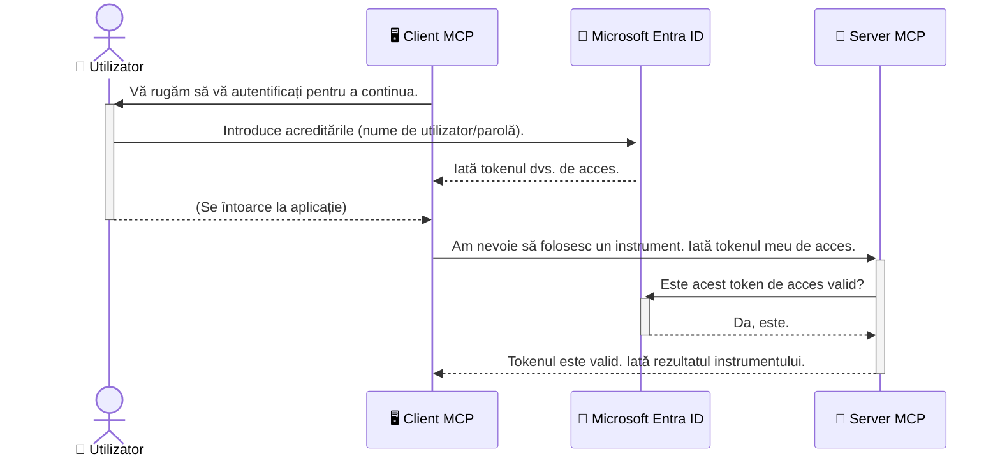

# Securizarea fluxurilor de lucru AI: Autentificarea Entra ID pentru serverele Model Context Protocol

## Introducere
Securizarea serverului Model Context Protocol (MCP) este la fel de importantă ca încuietoarea ușii de la intrarea în casă. Lăsând serverul MCP deschis expui uneltele și datele tale accesului neautorizat, ceea ce poate duce la breșe de securitate. Microsoft Entra ID oferă o soluție robustă, bazată pe cloud, de gestionare a identității și accesului, ajutând la asigurarea că doar utilizatorii și aplicațiile autorizate pot interacționa cu serverul tău MCP. În această secțiune, vei învăța cum să-ți protejezi fluxurile de lucru AI folosind autentificarea Entra ID.

## Obiectivele de învățare
La finalul acestei secțiuni, vei putea să:

- Înțelegi importanța securizării serverelor MCP.
- Explici noțiunile de bază despre Microsoft Entra ID și autentificarea OAuth 2.0.
- Recunoști diferența dintre clienții publici și cei confidențiali.
- Implementezi autentificarea Entra ID atât în scenarii locale (client public), cât și în servere MCP la distanță (client confidențial).
- Aplici bune practici de securitate în dezvoltarea fluxurilor de lucru AI.

## Securitate și MCP

Așa cum nu ai lăsa ușa de la intrarea în casă neîncuiată, nici serverul tău MCP nu ar trebui să fie deschis pentru oricine. Securizarea fluxurilor tale de lucru AI este esențială pentru construirea de aplicații robuste, de încredere și sigure. Acest capitol îți va prezenta utilizarea Microsoft Entra ID pentru a securiza serverele MCP, asigurându-te că doar utilizatorii și aplicațiile autorizate pot interacționa cu uneltele și datele tale.

## De ce contează securitatea pentru serverele MCP

Imaginează-ți că serverul tău MCP are o unealtă care poate trimite emailuri sau accesa o bază de date cu clienți. Un server nesecurizat ar însemna că oricine ar putea folosi acea unealtă, ducând la acces neautorizat la date, spam sau alte activități rău intenționate.

Implementând autentificarea, te asiguri că fiecare cerere către server este verificată, confirmând identitatea utilizatorului sau aplicației care face cererea. Acesta este primul și cel mai important pas în securizarea fluxurilor tale AI.

## Introducere în Microsoft Entra ID

[**Microsoft Entra ID**](https://adoption.microsoft.com/microsoft-security/entra/) este un serviciu cloud pentru gestionarea identității și accesului. Gândește-l ca pe un portar universal pentru aplicațiile tale. Gestionează procesul complex de verificare a identității utilizatorilor (autentificare) și determină ce au voie să facă (autorizare).

Folosind Entra ID, poți:

- Permite autentificare sigură pentru utilizatori.
- Proteja API-urile și serviciile.
- Administra politicile de acces dintr-un punct central.

Pentru serverele MCP, Entra ID oferă o soluție robustă și larg recunoscută pentru a administra cine poate accesa capabilitățile serverului tău.

---

## Înțelegerea magiei: cum funcționează autentificarea Entra ID

Entra ID folosește standarde deschise precum **OAuth 2.0** pentru a gestiona autentificarea. Deși detaliile pot fi complexe, conceptul principal este simplu și poate fi înțeles printr-o analogie.

### O introducere ușoară în OAuth 2.0: Cheia valetului

Gândește-te la OAuth 2.0 ca la un serviciu valet pentru mașina ta. Când ajungi la un restaurant, nu dai valetului cheia ta master. În schimb, îi dai o **cheie valet** care are permisiuni limitate – poate porni mașina și încui ușile, dar nu poate deschide portbagajul sau torpedoarul.

În această analogie:

- **Tu** ești **Utilizatorul**.
- **Mașina ta** este **Serverul MCP** cu uneltele și datele de valoare.
- **Valetul** este **Microsoft Entra ID**.
- **Valetul de parcare** este **Clientul MCP** (aplicația care încearcă să acceseze serverul).
- **Cheia valet** este **Token-ul de acces**.

Token-ul de acces este un șir securizat de text pe care clientul MCP îl primește de la Entra ID după ce te autentifici. Clientul apoi prezintă acest token serverului MCP cu fiecare cerere. Serverul poate verifica token-ul pentru a se asigura că cererea este legitimă și că clientul are permisiunile necesare, fără a fi nevoie să gestioneze direct credențialele tale reale (ca parola).

### Fluxul de autentificare

Iată cum funcționează procesul în practică:



### Introducerea Microsoft Authentication Library (MSAL)

Înainte să intrăm în cod, este important să prezentăm un component cheie pe care îl vei vedea în exemple: **Microsoft Authentication Library (MSAL)**.

MSAL este o bibliotecă dezvoltată de Microsoft care face mult mai ușoară gestionarea autentificării pentru dezvoltatori. În loc să scrii tu tot codul complex pentru gestionarea token-urilor de securitate, administrarea autentificărilor și reîmprospătarea sesiunilor, MSAL se ocupă de aceste sarcini grele.

Folosirea unei biblioteci ca MSAL este recomandată deoarece:

- **Este sigură:** implementează protocoale standard din industrie și bune practici de securitate, reducând riscurile de vulnerabilități în codul tău.
- **Simplifică dezvoltarea:** ascunde complexitatea protocoalelor OAuth 2.0 și OpenID Connect, permițând să adaugi autentificare robustă cu doar câteva linii de cod.
- **Este menținută:** Microsoft actualizează activ MSAL pentru a răspunde la noi amenințări de securitate și schimbări de platformă.

MSAL suportă o gamă largă de limbaje și cadre de aplicații, inclusiv .NET, JavaScript/TypeScript, Python, Java, Go și platforme mobile precum iOS și Android. Aceasta înseamnă că poți folosi aceleași tipare consistente de autentificare pe întregul tău stack tehnologic.

Pentru a afla mai multe despre MSAL, poți consulta documentația oficială [Prezentarea generală MSAL](https://learn.microsoft.com/entra/identity-platform/msal-overview).

---

## Securizarea serverului MCP cu Entra ID: Ghid pas cu pas

Acum, să parcurgem cum să securizezi un server MCP local (care comunică prin `stdio`) folosind Entra ID. Acest exemplu folosește un **client public**, potrivit pentru aplicații ce rulează pe mașina utilizatorului, cum ar fi o aplicație desktop sau un server local de dezvoltare.

### Scenariul 1: Securizarea unui server MCP local (cu client public)

În acest scenariu, vom vedea un server MCP care rulează local, comunică prin `stdio` și folosește Entra ID pentru autentificarea utilizatorului înainte de a permite accesul la uneltele sale. Serverul va avea un singur instrument care preia informațiile profilului utilizatorului din API-ul Microsoft Graph.

#### 1. Configurarea aplicației în Entra ID

Înainte de a scrie cod, trebuie să-ți înregistrezi aplicația în Microsoft Entra ID. Acest lucru spune Entra ID despre aplicația ta și îi acordă permisiunea să folosească serviciul de autentificare.

1. Navighează la **[portalul Microsoft Entra](https://entra.microsoft.com/)**.
2. Mergi la **Înregistrări aplicații** și click pe **Înregistrare nouă**.
3. Dă un nume aplicației tale (ex: "Serverul meu MCP local").
4. La **Tipuri de conturi acceptate**, selectează **Conturi din acest director organizațional numai**.
5. Poți lăsa câmpul **URI redirecționat** gol pentru acest exemplu.
6. Apasă **Înregistrare**.

După înregistrare, notează-ți **ID-ul de aplicație (client)** și **ID-ul de director (tenant)**. Vei avea nevoie de ele în cod.

#### 2. Codul: o descompunere

Să vedem părțile cheie din cod care gestionează autentificarea. Codul complet pentru acest exemplu este disponibil în folderul [Entra ID - Local - WAM](https://github.com/Azure-Samples/mcp-auth-servers/tree/main/src/entra-id-local-wam) din depozitul [mcp-auth-servers GitHub](https://github.com/Azure-Samples/mcp-auth-servers).

**`AuthenticationService.cs`**

Această clasă se ocupă de interacțiunea cu Entra ID.

- **`CreateAsync`**: Metoda inițializează `PublicClientApplication` din MSAL (Microsoft Authentication Library). Este configurată cu `clientId` și `tenantId` ale aplicației tale.
- **`WithBroker`**: Activează folosirea unui broker (precum Windows Web Account Manager), care oferă o experiență mai sigură și fluentă de autentificare unică.
- **`AcquireTokenAsync`**: Este metoda principală. Mai întâi încearcă să obțină un token silențios (adică utilizatorul nu trebuie să se autentifice din nou dacă are deja o sesiune validă). Dacă nu se poate obține un token silențios, va afișa promptul pentru autentificare interactivă.

```csharp
// Simplified for clarity
public static async Task<AuthenticationService> CreateAsync(ILogger<AuthenticationService> logger)
{
    var msalClient = PublicClientApplicationBuilder
        .Create(_clientId) // Your Application (client) ID
        .WithAuthority(AadAuthorityAudience.AzureAdMyOrg)
        .WithTenantId(_tenantId) // Your Directory (tenant) ID
        .WithBroker(new BrokerOptions(BrokerOptions.OperatingSystems.Windows))
        .Build();

    // ... cache registration ...

    return new AuthenticationService(logger, msalClient);
}

public async Task<string> AcquireTokenAsync()
{
    try
    {
        // Try silent authentication first
        var accounts = await _msalClient.GetAccountsAsync();
        var account = accounts.FirstOrDefault();

        AuthenticationResult? result = null;

        if (account != null)
        {
            result = await _msalClient.AcquireTokenSilent(_scopes, account).ExecuteAsync();
        }
        else
        {
            // If no account, or silent fails, go interactive
            result = await _msalClient.AcquireTokenInteractive(_scopes).ExecuteAsync();
        }

        return result.AccessToken;
    }
    catch (Exception ex)
    {
        _logger.LogError(ex, "An error occurred while acquiring the token.");
        throw; // Optionally rethrow the exception for higher-level handling
    }
}
```

**`Program.cs`**

Aici este configurat serverul MCP și este integrat serviciul de autentificare.

- **`AddSingleton<AuthenticationService>`**: Înregistrează `AuthenticationService` în containerul de injecție de dependență, astfel încât să poată fi folosit de alte părți ale aplicației (cum ar fi unealta noastră).
- **Unealta `GetUserDetailsFromGraph`**: Această unealtă necesită o instanță a `AuthenticationService`. Înainte de orice, apelează `authService.AcquireTokenAsync()` pentru a obține un token valid de acces. Dacă autentificarea reușește, folosește token-ul pentru a apela Microsoft Graph API și a prelua detaliile utilizatorului.

```csharp
// Simplified for clarity
[McpServerTool(Name = "GetUserDetailsFromGraph")]
public static async Task<string> GetUserDetailsFromGraph(
    AuthenticationService authService)
{
    try
    {
        // This will trigger the authentication flow
        var accessToken = await authService.AcquireTokenAsync();

        // Use the token to create a GraphServiceClient
        var graphClient = new GraphServiceClient(
            new BaseBearerTokenAuthenticationProvider(new TokenProvider(authService)));

        var user = await graphClient.Me.GetAsync();

        return System.Text.Json.JsonSerializer.Serialize(user);
    }
    catch (Exception ex)
    {
        return $"Error: {ex.Message}";
    }
}
```

#### 3. Cum funcționează totul împreună

1. Când clientul MCP încearcă să folosească unealta `GetUserDetailsFromGraph`, unealta mai întâi apelează `AcquireTokenAsync`.
2. `AcquireTokenAsync` determină MSAL să verifice dacă există un token valid.
3. Dacă nu există niciun token, MSAL, prin broker, va solicita utilizatorului să se autentifice cu contul său Entra ID.
4. Odată ce utilizatorul se autentifică, Entra ID emite un token de acces.
5. Unealta primește token-ul și îl folosește pentru a face un apel securizat la Microsoft Graph API.
6. Detaliile utilizatorului sunt returnate clientului MCP.

Acest proces garantează că doar utilizatorii autentificați pot folosi unealta, securizând efectiv serverul MCP local.

### Scenariul 2: Securizarea unui server MCP la distanță (cu client confidențial)

Atunci când serverul MCP rulează pe o mașină la distanță (cum ar fi un server cloud) și comunică printr-un protocol precum HTTP Streaming, cerințele de securitate sunt diferite. În acest caz, ar trebui să folosești un **client confidențial** și **fluxul codului de autorizare (Authorization Code Flow)**. Aceasta este o metodă mai sigură deoarece secretele aplicației nu sunt niciodată expuse browser-ului.

Acest exemplu folosește un server MCP bazat pe TypeScript care utilizează Express.js pentru a gestiona cererile HTTP.

#### 1. Configurarea aplicației în Entra ID

Configurarea în Entra ID este similară cu cea de client public, dar cu o diferență cheie: trebuie să creezi un **secret client**.

1. Navighează la **[portalul Microsoft Entra](https://entra.microsoft.com/)**.
2. În înregistrarea aplicației, mergi la fila **Certificate și secrete**.
3. Apasă pe **Secret nou client**, dă-i o descriere și apasă **Adaugă**.
4. **Important:** Copiază imediat valoarea secretului. Nu vei putea să o mai vezi ulterior.
5. De asemenea, trebuie să configurezi un **URI de redirecționare**. Mergi la fila **Autentificare**, apasă pe **Adăugați o platformă**, selectează **Web** și introdu URI-ul de redirecționare pentru aplicația ta (de ex. `http://localhost:3001/auth/callback`).

> **⚠️ Notă importantă de securitate:** Pentru aplicațiile de producție, Microsoft recomandă cu tărie utilizarea metodelor de autentificare fără secret, precum **Managed Identity** sau **Workload Identity Federation**, în locul secretelor client. Secretele client prezintă riscuri de securitate deoarece pot fi expuse sau compromise. Identitățile gestionate oferă o abordare mai sigură eliminând necesitatea stocării credențialelor în cod sau configurație.
>
> Pentru mai multe informații despre identitățile gestionate și cum să le implementezi, vezi [Prezentarea generală a identităților gestionate pentru resurse Azure](https://learn.microsoft.com/entra/identity/managed-identities-azure-resources/overview).

#### 2. Codul: o descompunere

Acest exemplu folosește o abordare bazată pe sesiune. Când utilizatorul se autentifică, serverul stochează token-ul de acces și token-ul de reîmprospătare în sesiune și oferă utilizatorului un token de sesiune. Acest token de sesiune este apoi folosit pentru cererile următoare. Codul complet pentru acest exemplu este disponibil în folderul [Entra ID - Client confidențial](https://github.com/Azure-Samples/mcp-auth-servers/tree/main/src/entra-id-cca-session) din depozitul [mcp-auth-servers GitHub](https://github.com/Azure-Samples/mcp-auth-servers).

**`Server.ts`**

Acest fișier configurează serverul Express și stratul de transport MCP.

- **`requireBearerAuth`**: Este un middleware care protejează punctele finale `/sse` și `/message`. Verifică dacă există un token bearer valid în antetul `Authorization` al cererii.
- **`EntraIdServerAuthProvider`**: Este o clasă personalizată care implementează interfața `McpServerAuthorizationProvider`. Este responsabilă pentru gestionarea fluxului OAuth 2.0.
- **`/auth/callback`**: Acest punct final gestionează redirecționarea de la Entra ID după ce utilizatorul s-a autentificat. Schimbă codul de autorizare pentru token de acces și token de reîmprospătare.

```typescript
// Simplificat pentru claritate
const app = express();
const { server } = createServer();
const provider = new EntraIdServerAuthProvider();

// Protejează punctul final SSE
app.get("/sse", requireBearerAuth({
  provider,
  requiredScopes: ["User.Read"]
}), async (req, res) => {
  // ... conectează-te la transport ...
});

// Protejează punctul final al mesajelor
app.post("/message", requireBearerAuth({
  provider,
  requiredScopes: ["User.Read"]
}), async (req, res) => {
  // ... gestionează mesajul ...
});

// Gestionează callback-ul OAuth 2.0
app.get("/auth/callback", (req, res) => {
  provider.handleCallback(req.query.code, req.query.state)
    .then(result => {
      // ... gestionează succesul sau eșecul ...
    });
});
```

**`Tools.ts`**

Acest fișier definește uneltele pe care le oferă serverul MCP. Unealta `getUserDetails` este similară cu cea din exemplul anterior, însă obține token-ul de acces din sesiune.

```typescript
// Simplificat pentru claritate
server.setRequestHandler(CallToolRequestSchema, async (request) => {
  const { name } = request.params;
  const context = request.params?.context as { token?: string } | undefined;
  const sessionToken = context?.token;

  if (name === ToolName.GET_USER_DETAILS) {
    if (!sessionToken) {
      throw new AuthenticationError("Authentication token is missing or invalid. Ensure the token is provided in the request context.");
    }

    // Obține token-ul Entra ID din depozitul de sesiuni
    const tokenData = tokenStore.getToken(sessionToken);
    const entraIdToken = tokenData.accessToken;

    const graphClient = Client.init({
      authProvider: (done) => {
        done(null, entraIdToken);
      }
    });

    const user = await graphClient.api('/me').get();

    // ... returnează detaliile utilizatorului ...
  }
});
```

**`auth/EntraIdServerAuthProvider.ts`**

Această clasă gestionează logica pentru:

- Redirecționarea utilizatorului către pagina de autentificare Entra ID.
- Schimbarea codului de autorizare pentru token-ul de acces.
- Stocarea token-urilor în `tokenStore`.
- Reîmprospătarea token-ului de acces când expiră.

#### 3. Cum funcționează totul împreună

1. Când un utilizator încearcă prima dată să se conecteze la serverul MCP, middleware-ul `requireBearerAuth` vede că nu are o sesiune validă și îl redirecționează către pagina de autentificare Entra ID.
2. Utilizatorul se autentifică cu contul său Entra ID.
3. Entra ID redirecționează utilizatorul înapoi către endpoint-ul `/auth/callback` cu un cod de autorizare.
4. Serverul schimbă codul pentru un token de acces și un token de reîmprospătare, le stochează și creează un token de sesiune care este trimis clientului.
5. Clientul poate acum să folosească acest token de sesiune în antetul `Authorization` pentru toate cererile viitoare către serverul MCP.
6. Atunci când este apelat instrumentul `getUserDetails`, acesta folosește tokenul de sesiune pentru a obține tokenul de acces Entra ID și apoi folosește acesta pentru a apela API-ul Microsoft Graph.

Acest flux este mai complex decât fluxul clientului public, dar este necesar pentru endpoint-urile accesibile din internet. Deoarece serverele MCP la distanță sunt accesibile prin internetul public, ele necesită măsuri de securitate mai puternice pentru a se proteja împotriva accesului neautorizat și a potențialelor atacuri.


## Practici recomandate de securitate

- **Folosește întotdeauna HTTPS**: Criptează comunicarea între client și server pentru a proteja tokenurile de interceptare.
- **Implementează controlul accesului bazat pe roluri (RBAC)**: Nu verifica doar *dacă* un utilizator este autentificat; verifică *ce* are dreptul să facă. Poți defini roluri în Entra ID și să le verifici în serverul tău MCP.
- **Monitorizează și auditează**: Înregistrează toate evenimentele de autentificare pentru a putea detecta și răspunde la activități suspecte.
- **Gestionează limitarea ratei și throttling-ul**: Microsoft Graph și alte API-uri implementează limitarea ratei pentru a preveni abuzurile. Implementează în serverul tău MCP mecanisme de backoff exponențial și retry pentru a gestiona elegant răspunsurile HTTP 429 (Prea multe solicitări). Ia în considerare cache-ul pentru datele accesate frecvent pentru a reduce apelurile API.
- **Stocare sigură a tokenurilor**: Stochează în siguranță tokenurile de acces și de reîmprospătare. Pentru aplicațiile locale, folosește mecanismele de stocare securizată ale sistemului. Pentru aplicațiile server, ia în considerare utilizarea stocării criptate sau a serviciilor de gestionare securizată a cheilor, precum Azure Key Vault.
- **Gestionarea expirării tokenurilor**: Tokenurile de acces au o durată de viață limitată. Implementează reîmprospătarea automată a tokenurilor folosind tokenurile de reîmprospătare pentru a menține o experiență de utilizare continuă fără a necesita reautentificare.
- **Ia în considerare utilizarea Azure API Management**: Deși implementarea securității direct în serverul tău MCP îți oferă un control detaliat, gateway-urile API precum Azure API Management pot gestiona automat multe dintre aceste aspecte de securitate, inclusiv autentificarea, autorizarea, limitarea ratei și monitorizarea. Ele furnizează un strat centralizat de securitate între clienții tăi și serverele MCP. Pentru mai multe detalii despre utilizarea gateway-urilor API cu MCP, vezi [Azure API Management Your Auth Gateway For MCP Servers](https://techcommunity.microsoft.com/blog/integrationsonazureblog/azure-api-management-your-auth-gateway-for-mcp-servers/4402690).


## Concluzii principale

- Securizarea serverului MCP este esențială pentru protejarea datelor și a instrumentelor tale.
- Microsoft Entra ID oferă o soluție robustă și scalabilă pentru autentificare și autorizare.
- Folosește un **client public** pentru aplicațiile locale și un **client confidențial** pentru serverele la distanță.
- **Fluxul cu cod de autorizare** este cea mai sigură opțiune pentru aplicațiile web.


## Exercițiu

1. Gândește-te la un server MCP pe care ai dori să îl construiești. Ar fi un server local sau un server la distanță?
2. Pe baza răspunsului tău, ai folosi un client public sau unul confidențial?
3. Ce permisiuni ar solicita serverul tău MCP pentru a efectua acțiuni asupra Microsoft Graph?


## Exerciții practice

### Exercițiul 1: Înregistrează o aplicație în Entra ID
Navighează la portalul Microsoft Entra.  
Înregistrează o aplicație nouă pentru serverul tău MCP.  
Notează ID-ul aplicației (client) și ID-ul directoarelor (tenant).

### Exercițiul 2: Securizează un server MCP local (Client public)
- Urmează exemplul de cod pentru a integra MSAL (Microsoft Authentication Library) pentru autentificarea utilizatorului.
- Testează fluxul de autentificare prin apelarea instrumentului MCP care preia detalii despre utilizator din Microsoft Graph.

### Exercițiul 3: Securizează un server MCP la distanță (Client confidențial)
- Înregistrează un client confidențial în Entra ID și crează un secret pentru client.
- Configurează serverul MCP Express.js să utilizeze fluxul cu cod de autorizare.
- Testează endpoint-urile protejate și confirmă accesul pe bază de token.

### Exercițiul 4: Aplică practicile recomandate de securitate
- Activează HTTPS pentru serverul tău local sau la distanță.
- Implementează controlul accesului bazat pe roluri (RBAC) în logica serverului.
- Adaugă gestionarea expirării tokenurilor și stocare securizată a tokenurilor.

## Resurse

1. **Documentație de prezentare MSAL**  
   Află cum Microsoft Authentication Library (MSAL) permite achiziția securizată a tokenurilor pe diverse platforme:  
   [Prezentare MSAL pe Microsoft Learn](https://learn.microsoft.com/en-gb/entra/msal/overview)

2. **Depozitul GitHub Azure-Samples/mcp-auth-servers**  
   Implementări de referință ale serverelor MCP care demonstrează fluxuri de autentificare:  
   [Azure-Samples/mcp-auth-servers pe GitHub](https://github.com/Azure-Samples/mcp-auth-servers)

3. **Prezentare Managed Identities pentru resurse Azure**  
   Înțelege cum să elimini secretele folosind identități gestionate atribuite sistemului sau utilizatorului:  
   [Prezentare Managed Identities pe Microsoft Learn](https://learn.microsoft.com/en-us/entra/identity/managed-identities-azure-resources/)

4. **Azure API Management: Gateway-ul tău de autentificare pentru serverele MCP**  
   O analiză detaliată despre utilizarea APIM ca gateway OAuth2 securizat pentru serverele MCP:  
   [Azure API Management Your Auth Gateway For MCP Servers](https://techcommunity.microsoft.com/blog/integrationsonazureblog/azure-api-management-your-auth-gateway-for-mcp-servers/4402690)

5. **Referință permisiuni Microsoft Graph**  
   Listă completă a permisiunilor delegate și aplicație pentru Microsoft Graph:  
   [Referință permisiuni Microsoft Graph](https://learn.microsoft.com/zh-tw/graph/permissions-reference)


## Rezultate așteptate
După ce finalizezi această secțiune, vei putea:

- Să explici de ce autentificarea este critică pentru serverele MCP și fluxurile AI.
- Să configurezi și să implementezi autentificarea Entra ID pentru ambele scenarii, de server local și la distanță.
- Să alegi tipul potrivit de client (public sau confidențial) în funcție de modul de implementare al serverului tău.
- Să aplici practici sigure de programare, inclusiv stocarea tokenurilor și autorizarea bazată pe roluri.
- Să protejezi cu încredere serverul MCP și instrumentele sale împotriva accesului neautorizat.

## Ce urmează

- [5.13 Model Context Protocol (MCP) Integrare cu Microsoft Foundry](../mcp-foundry-agent-integration/README.md)

---

<!-- CO-OP TRANSLATOR DISCLAIMER START -->
**Declinare a responsabilității**:
Acest document a fost tradus folosind serviciul de traducere AI [Co-op Translator](https://github.com/Azure/co-op-translator). În timp ce ne străduim pentru acuratețe, vă rugăm să rețineți că traducerile automate pot conține erori sau inexactități. Documentul original în limba sa nativă trebuie considerat sursa autorizată. Pentru informații critice, se recomandă traducerea profesională realizată de un om. Nu ne asumăm responsabilitatea pentru eventualele neînțelegeri sau interpretări greșite care decurg din utilizarea acestei traduceri.
<!-- CO-OP TRANSLATOR DISCLAIMER END -->