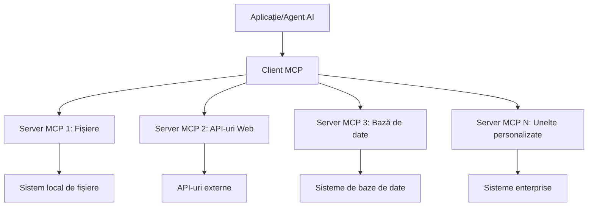

# 🌐 Modulul 2: MCP cu Fundamentele Microsoft Foundry Toolkit

[]()
[]()
[]()

## 📋 Obiective de învățare

La finalul acestui modul, vei putea să:
- ✅ Înțelegi arhitectura și beneficiile Model Context Protocol (MCP)
- ✅ Explorezi ecosistemul serverelor MCP Microsoft
- ✅ Integrezi serverele MCP cu Microsoft Foundry Toolkit Agent Builder
- ✅ Construiești un agent funcțional de automatizare browser folosind Playwright MCP
- ✅ Configurezi și testezi instrumentele MCP în cadrul agenților tăi
- ✅ Exportezi și implementezi agenți cu putere MCP pentru utilizare în producție

## 🎯 Construind pe baza Modulului 1

În Modulul 1, am stăpânit bazele Microsoft Foundry Toolkit și am creat primul nostru Agent Python. Acum vom **superîncărca** agenții tăi prin conectarea lor la instrumente și servicii externe prin revoluționarul **Model Context Protocol (MCP)**.

Gândește-te la asta ca la un upgrade de la un calculator simplu la un calculator complet – agenții tăi AI vor căpăta abilitatea de a:
- 🌐 Naviga și interacționa cu site-uri web
- 📁 Accesa și manipula fișiere
- 🔧 Integra cu sisteme enterprise
- 📊 Procesa date în timp real de la API-uri

## 🧠 Înțelegerea Model Context Protocol (MCP)

### 🔍 Ce este MCP?

Model Context Protocol (MCP) este **„USB-C pentru aplicațiile AI”** – un standard deschis revoluționar care conectează Modelele Mari de Limbaj (LLMs) la unelte externe, surse de date și servicii. Așa cum USB-C a eliminat haosul cablurilor oferind un conector universal, MCP elimină complexitatea integrării AI cu un protocol standardizat.

### 🎯 Problema pe care o rezolvă MCP

**Înainte de MCP:**
- 🔧 Integrări personalizate pentru fiecare unealtă
- 🔄 Blocare cu vendorii prin soluții proprietare  
- 🔒 Vulnerabilități de securitate din conexiuni ad-hoc
- ⏱️ Luni de dezvoltare pentru integrări de bază

**Cu MCP:**
- ⚡ Integrare plug-and-play a uneltelor
- 🔄 Arhitectură agnostică pentru vendor
- 🛡️ Cele mai bune practici de securitate integrate
- 🚀 Minuturi pentru adăugarea de noi capabilități

### 🏗️ Detaliu arhitectură MCP

MCP urmează o **arhitectură client-server** care creează un ecosistem securizat și scalabil:



**🔧 Componente principale:**

| Componentă | Rol | Exemple |
|------------|------|----------|
| **Gazde MCP** | Aplicații care consumă servicii MCP | Claude Desktop, VS Code, Microsoft Foundry Toolkit |
| **Clienți MCP** | Handleri de protocol (1:1 cu serverele) | Încorporați în aplicațiile gazdă |
| **Servere MCP** | Expun capabilități prin protocol standard | Playwright, Files, Azure, GitHub |
| **Stratul de transport** | Metode de comunicare | stdio, HTTP, WebSockets |


## 🏢 Ecosistemul Microsoft MCP Server

Microsoft conduce ecosistemul MCP cu o suită cuprinzătoare de servere enterprise care satisfac nevoile reale de business.

### 🌟 Servere MCP Microsoft recomandate

#### 1. ☁️ Azure MCP Server
**🔗 Repozitoriu**: [azure/azure-mcp](https://github.com/azure/azure-mcp)
**🎯 Scop**: Gestionarea completă a resurselor Azure cu integrare AI

**✨ Caracteristici cheie:**
- Provisionare declarativă a infrastructurii
- Monitorizare resurse în timp real
- Recomandări pentru optimizarea costurilor
- Verificare conformitate securitate

**🚀 Cazuri de utilizare:**
- Infrastructură ca cod cu asistență AI
- Scalare automată a resurselor
- Optimizarea costurilor cloud
- Automatizare flux de lucru DevOps

#### 2. 📊 Microsoft Dataverse MCP
**📚 Documentație**: [Microsoft Dataverse Integration](https://go.microsoft.com/fwlink/?linkid=2320176)
**🎯 Scop**: Interfață în limbaj natural pentru date de business

**✨ Caracteristici cheie:**
- Interogări de baze de date în limbaj natural
- Înțelegerea contextului de business
- Șabloane personalizate de prompturi
- Guvernanță a datelor enterprise

**🚀 Cazuri de utilizare:**
- Raportare business intelligence
- Analiza datelor clienților
- Insight-uri pentru pipeline de vânzări
- Interogări pentru conformitate

#### 3. 🌐 Playwright MCP Server
**🔗 Repozitoriu**: [microsoft/playwright-mcp](https://github.com/microsoft/playwright-mcp)
**🎯 Scop**: Automatizare browser și capabilități de interacțiune web

**✨ Caracteristici cheie:**
- Automatizare cross-browser (Chrome, Firefox, Safari)
- Detecție inteligentă a elementelor
- Generare screenshot și PDF
- Monitorizare trafic rețea

**🚀 Cazuri de utilizare:**
- Fluxuri automate de testare
- Web scraping și extragere date
- Monitorizare UI/UX
- Automatizare analiză concurență

#### 4. 📁 Files MCP Server
**🔗 Repozitoriu**: [microsoft/files-mcp-server](https://github.com/microsoft/files-mcp-server)
**🎯 Scop**: Operații inteligente pe sistemul de fișiere

**✨ Caracteristici cheie:**
- Management declarativ al fișierelor
- Sincronizare conținut
- Integrare control versiune
- Extracție metadate

**🚀 Cazuri de utilizare:**
- Management documentație
- Organizarea depozitelor de cod
- Fluxuri de lucru pentru publicare conținut
- Manipulare fișiere în pipeline de date

#### 5. 📝 MarkItDown MCP Server
**🔗 Repozitoriu**: [microsoft/markitdown](https://github.com/microsoft/markitdown)
**🎯 Scop**: Procesare avansată și manipulare Markdown

**✨ Caracteristici cheie:**
- Parsare complexă Markdown
- Conversie format (MD ↔ HTML ↔ PDF)
- Analiză structură conținut
- Procesare șabloane

**🚀 Cazuri de utilizare:**
- Fluxuri de lucru pentru documentație tehnică
- Sisteme de management conținut
- Generare rapoarte
- Automatizarea bazei de cunoștințe

#### 6. 📈 Clarity MCP Server
**📦 Pachet**: [@microsoft/clarity-mcp-server](https://www.npmjs.com/package/@microsoft/clarity-mcp-server)
**🎯 Scop**: Analize web și insight-uri despre comportamentul utilizatorilor

**✨ Caracteristici cheie:**
- Analiza datelor heatmap
- Înregistrări ale sesiunilor utilizatorilor
- Metrice de performanță
- Analiză funnel de conversie

**🚀 Cazuri de utilizare:**
- Optimizare site web
- Cercetare experiență utilizator
- Analize A/B testing
- Dashboard-uri business intelligence

### 🌍 Ecosistemul Comunității

Dincolo de serverele Microsoft, ecosistemul MCP include:
- **🐙 GitHub MCP**: Management repo și analiză cod
- **🗄️ Database MCPs**: Integrare PostgreSQL, MySQL, MongoDB
- **☁️ Cloud Provider MCPs**: Unelte AWS, GCP, Digital Ocean
- **📧 Communication MCPs**: Integrații Slack, Teams, Email

## 🛠️ Laborator Practic: Construirea unui Agent de Automatizare Browser

**🎯 Scopul proiectului**: Creează un agent inteligent de automatizare browser utilizând serverul Playwright MCP ce poate naviga pe site-uri, extrage informații și efectua interacțiuni complexe web.

### 🚀 Faza 1: Configurarea bazei agentului

#### Pasul 1: Inițializează Agentul
1. **Deschide Microsoft Foundry Toolkit Agent Builder**
2. **Creează Agent Nou** cu următoarea configurare:
   - **Nume**: `BrowserAgent`
   - **Model**: Alege GPT-4o


### 🔧 Faza 2: Fluxul de integrare MCP

#### Pasul 3: Adaugă integrarea Server MCP
1. **Navighează în secțiunea Tools** din Agent Builder
2. **Click pe "Add Tool"** pentru a deschide meniul de integrare
3. **Selectează "MCP Server"** din opțiunile disponibile


**🔍 Înțelegerea tipurilor de unelte:**
- **Unelte integrate**: Funcții preconfigurate Microsoft Foundry Toolkit
- **Servere MCP**: Integrări la servicii externe
- **API-uri personalizate**: Endpoint-uri de servicii proprii
- **Apelare funcții**: Acces direct la funcții model

#### Pasul 4: Selectarea serverului MCP
1. **Alege opțiunea "MCP Server"** pentru a continua


2. **Răsfoiește Catalogul MCP** pentru a explora integrațiile disponibile


### 🎮 Faza 3: Configurarea Playwright MCP

#### Pasul 5: Selectează și configurează Playwright
1. **Click pe "Use Featured MCP Servers"** pentru a accesa serverele verificate Microsoft
2. **Selectează "Playwright"** din lista recomandată
3. **Acceptă MCP ID implicit** sau personalizează pentru mediul tău


#### Pasul 6: Activează capabilitățile Playwright
**🔑 Pas critic**: Selectează **TOATE** metodele disponibile Playwright pentru funcționalitate maximă


**🛠️ Unelte esențiale Playwright:**
- **Navigare**: `goto`, `goBack`, `goForward`, `reload`
- **Interacțiune**: `click`, `fill`, `press`, `hover`, `drag`
- **Extracție**: `textContent`, `innerHTML`, `getAttribute`
- **Validare**: `isVisible`, `isEnabled`, `waitForSelector`
- **Captură**: `screenshot`, `pdf`, `video`
- **Rețea**: `setExtraHTTPHeaders`, `route`, `waitForResponse`

#### Pasul 7: Verifică succesul integrării
**✅ Indicii de succes:**
- Toate uneltele apar în interfața Agent Builder
- Nicio eroare afișată în panoul de integrare
- Starea serverului Playwright arată „Connected”


**🔧 Depanare probleme comune:**
- **Conexiune eșuată**: Verifică conexiunea la internet și setările firewall
- **Unelte lipsă**: Asigură-te că toate capabilitățile au fost selectate la configurare
- **Erori permisiuni**: Verifică dacă VS Code are permisiunile sistem necesare

### 🎯 Faza 4: Ingineria avansată a prompturilor

#### Pasul 8: Creează prompturi inteligente pentru sistem
Construiește prompturi sofisticate care utilizează pe deplin capabilitățile Playwright:

```markdown
# Web Automation Expert System Prompt

## Core Identity
You are an advanced web automation specialist with deep expertise in browser automation, web scraping, and user experience analysis. You have access to Playwright tools for comprehensive browser control.

## Capabilities & Approach
### Navigation Strategy
- Always start with screenshots to understand page layout
- Use semantic selectors (text content, labels) when possible
- Implement wait strategies for dynamic content
- Handle single-page applications (SPAs) effectively

### Error Handling
- Retry failed operations with exponential backoff
- Provide clear error descriptions and solutions
- Suggest alternative approaches when primary methods fail
- Always capture diagnostic screenshots on errors

### Data Extraction
- Extract structured data in JSON format when possible
- Provide confidence scores for extracted information
- Validate data completeness and accuracy
- Handle pagination and infinite scroll scenarios

### Reporting
- Include step-by-step execution logs
- Provide before/after screenshots for verification
- Suggest optimizations and alternative approaches
- Document any limitations or edge cases encountered

## Ethical Guidelines
- Respect robots.txt and rate limiting
- Avoid overloading target servers
- Only extract publicly available information
- Follow website terms of service
```

#### Pasul 9: Creează prompturi dinamice pentru utilizator
Concepe prompturi care demonstrează diverse capabilități:

**🌐 Exemplu analiză web:**
```markdown
Navigate to github.com/kinfey and provide a comprehensive analysis including:
1. Repository structure and organization
2. Recent activity and contribution patterns  
3. Documentation quality assessment
4. Technology stack identification
5. Community engagement metrics
6. Notable projects and their purposes

Include screenshots at key steps and provide actionable insights.
```


### 🚀 Faza 5: Execuție și testare

#### Pasul 10: Rulează prima ta automatizare
1. **Click pe "Run"** pentru a lansa secvența de automatizare
2. **Monitorizează execuția în timp real**:
   - Browserul Chrome se deschide automat
   - Agentul navighează pe site-ul țintă
   - Se fac capturi de fiecare pas major
   - Rezultatele analizelor se transmit în timp real


#### Pasul 11: Analizează rezultatele și insight-urile
Revizuiește analiza detaliată în interfața Agent Builder:


### 🌟 Faza 6: Capabilități avansate și implementare

#### Pasul 12: Export și implementare în producție
Agent Builder suportă multiple opțiuni de implementare:


## 🎓 Rezumat Modul 2 & Pași Următori

### 🏆 Realizare deblocat: Maestru Integrare MCP

**✅ Competențe stăpânite:**
- [ ] Înțelegerea arhitecturii și beneficiilor MCP
- [ ] Navigarea ecosistemului serverelor MCP Microsoft
- [ ] Integrarea Playwright MCP cu Microsoft Foundry Toolkit
- [ ] Construirea de agenți sofisticati pentru automatizarea browserului
- [ ] Inginerie avansată a prompturilor pentru automatizarea web

### 📚 Resurse suplimentare

- **🔗 Specificații MCP**: [Documentația oficială a protocolului](https://modelcontextprotocol.io/)
- **🛠️ API Playwright**: [Referință completă metode](https://playwright.dev/docs/api/class-playwright)
- **🏢 Servere MCP Microsoft**: [Ghid integrare enterprise](https://github.com/microsoft/mcp-servers)
- **🌍 Exemple comunitate**: [Galerie servere MCP](https://github.com/modelcontextprotocol/servers)

**🎉 Felicitări!** Ai stăpânit cu succes integrarea MCP și acum poți construi agenți AI pregătiți pentru producție cu capabilități externe!

### 🔜 Continuă cu următorul modul

Gata să-ți ridici abilitățile MCP la nivelul următor? Mergi la **[Modulul 3: Dezvoltare avansată MCP cu Microsoft Foundry Toolkit](../lab3/README.md)** unde vei învăța cum să:
- Creezi propriile servere MCP personalizate
- Configurezi și utilizezi cel mai nou SDK MCP Python
- Setezi MCP Inspector pentru debugging
- Stăpânești fluxuri de lucru avansate în dezvoltarea serverelor MCP
- Construiești un server MCP pentru vreme de la zero

---

<!-- CO-OP TRANSLATOR DISCLAIMER START -->
**Declinare a responsabilității**:
Acest document a fost tradus folosind serviciul de traducere AI [Co-op Translator](https://github.com/Azure/co-op-translator). În timp ce ne străduim pentru acuratețe, vă rugăm să rețineți că traducerile automate pot conține erori sau inexactități. Documentul original în limba sa nativă trebuie considerat sursa autorizată. Pentru informații critice, se recomandă traducerea profesională realizată de un om. Nu ne asumăm responsabilitatea pentru eventualele neînțelegeri sau interpretări greșite care decurg din utilizarea acestei traduceri.
<!-- CO-OP TRANSLATOR DISCLAIMER END -->