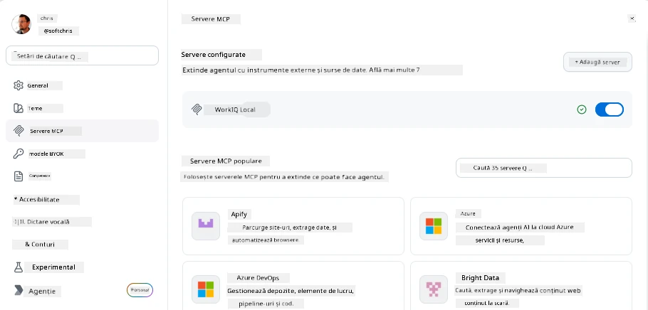
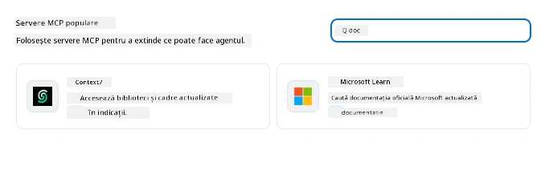
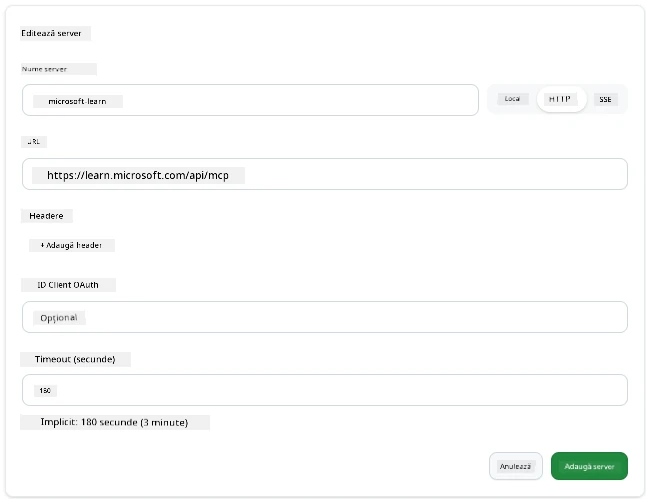
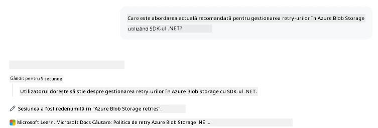
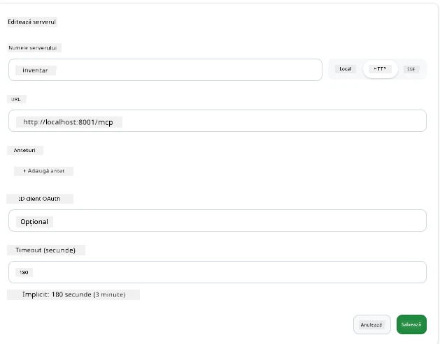
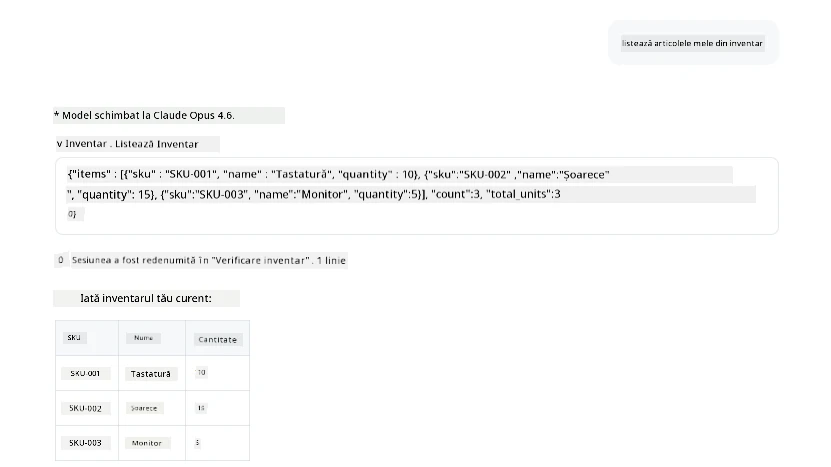
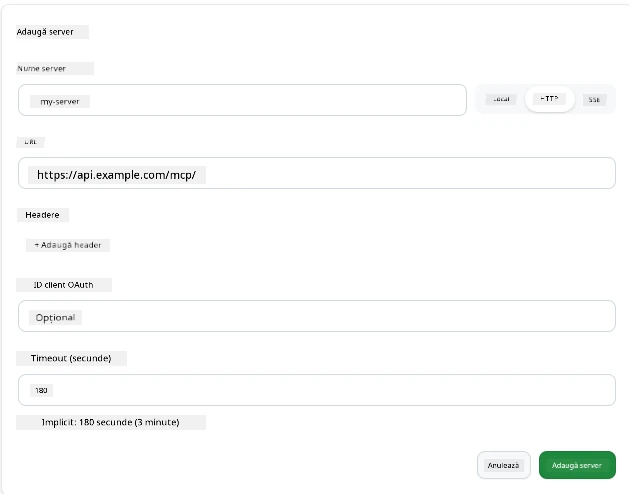
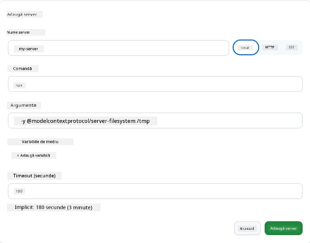

# Utilizarea serverelor MCP în aplicația GitHub Copilot

Până acum știi cum funcționează MCP. Ai construit servere, ai definit unelte și resurse, și ai conectat clienți. Ceea ce nu am făcut încă este să schimbăm perspectiva: în loc să fii tu cel care construiește serverul, cum arată să fii pe partea *consumatoare*—ca un utilizator al unei aplicații AI care suportă MCP?

[GitHub Copilot App](https://github.com/github/app) este o aplicație desktop care poate folosi servere MCP. Conectând servere MCP la ea, deblochezi un nou nivel: Copilot poate acum să acceseze documentația ta, să apeleze API-urile interne, să interogheze baza ta de date sau să vorbească cu orice serviciu pe care l-ai învelit într-un server. Aplicația devine gazda; serverele tale MCP devin uneltele sale.

Această lecție te parcurge prin acea experiență de la început până la sfârșit—de la găsirea panoului de setări MCP până la conectarea unui server real de documentație și apoi la conectarea unuia personalizat de-al tău.

## Obiective de învățare

La finalul acestei lecții, vei putea:

- Să localizezi și să navighezi în panoul de servere MCP din setările aplicației Copilot.
- Să conectezi un server de documentație găzduit și să-l folosești într-o sesiune.
- Să înregistrezi un server personalizat și să verifici că Copilot poate apela uneltele sale.
- Să configurezi modul în care un server este apelat oferind fie variabile de mediu, fie headere personalizate (dacă este HTTP)

## Aplicația Copilot ca gazdă MCP

Iată ideea fundamentală: **agenții Copilot sunt inteligenți, dar știu doar ce le spui tu.** Implicit, un agent poate citi fișiere din spațiul tău de lucru și poate rula comenzi de terminal, dar nu poate interoga baza ta de date, nu poate vedea în calendarul tău sau apela un API personalizat fără ajutor. Aici intervin serverele MCP. Ele acționează ca punți între Copilot și sistemele tale—baze de date, control de versiune, API-uri, unelte de design—oferind agenților acces la informațiile și acțiunile de care au nevoie pentru a-și îndeplini sarcinile.

Hai să începem prin a găsi acele setări pentru gestionarea serverelor MCP din aplicația ta.

## Pasul 1: Găsirea panoului de setări MCP

Deschide aplicația Copilot și localizează o pictogramă de roată dințată în partea stângă jos, apoi dă clic pe ea.


Asigură-te că selectezi „MCP Servers” și acum ar trebui să vezi serverele tale deja configurate în partea de sus, o piață cu servere populare în partea de jos și un buton „Add Server” în partea de sus, așa:



Acesta este centrul tău de control. Aici adaugi, elimini, activezi și dezactivezi servere. Modificările au efect pentru sesiunile noi; dacă ai o sesiune deschisă, va trebui să pornești una nouă după schimbarea listei.

## Pasul 2: Conectarea unui server de documentație

Să facem ceva imediat folositor. Serverul MCP Microsoft Docs oferă lui Copilot acces la documentația oficială Microsoft. Aceasta include Azure, .NET, TypeScript și altele. În loc ca agentul să se bazeze pe datele sale de antrenament (care au o dată limită), poate extrage documentația actuală în momentul interogării.

Iată cum îl adaugi:

1. În grila serverelor populare, tastează **learn** și selectează serverul numit „Microsoft Learn”.

   

   Odată selectat, îți apare un formular unde numele, tipul de transport și URL-ul sunt prefurnizate, tot ce trebuie să faci este să dai clic pe „Add Server”.

2. Fă clic pe „Add Server”, va dura câteva secunde să se conecteze la server.

   

   Odată adăugat, serverul ar trebui să apară în partea de sus ca server configurat. Să-l testăm acum.

3. Închide dialogul și selectează Quick chat.

4. Tastează promptul de mai jos pentru a declanșa o unealtă pe serverul Microsoft Learn.

   ```text
   What's the current recommended approach for handling Azure Blob Storage 
   retries using the .NET SDK?
   ```

   

Ar trebui să vezi cum se referă la serverul MCP pe care tocmai l-am adăugat.

## Pasul 3: Conectarea unui server stdio personalizat

Presetările sunt convenabile, dar adevărata putere este conectarea propriilor tale servere. Să zicem că ai construit un server (sau ți s-a oferit unul) care expune API-ul tău intern sau baza ta de cunoștințe a companiei. În acest caz, vom folosi un server MCP pe care l-am construit care gestionează gestiunea inventarului companiei noastre.

1. Dă clic pe roata dințată și selectează din nou „MCP servers”.

2. Selectează butonul „Add Server” și apoi „+ Add Custom server”, oferind următoarele valori:

   - Nume: `Inventory Server`
   - Selectează tipul de transport (în dreapta), **http**

   Selectează „Add Server” și acesta ar trebui să apară în lista ta de servere configurate.

   

4. Ca să îl testezi, rulează un prompt astfel:

    ```
    list inventory
    ```

   

   Acum ar trebui să vezi o listă cu elementele de inventar returnate de serverul tău personalizat.

Groza, acum ar trebui să ai o înțelegere bună de a adăuga atât servere externe cât și servere MCP proprii în aplicația Copilot. Următorul pas este să vorbim despre gestionarea secretelor și a variabilelor de mediu.

## Pasul 4: Setări avansate

Până acum ai văzut cum să adaugi servere MCP unde oferi doar un nume și un URL. Dar dacă serverul tău are nevoie de o cheie API sau altă valoare? Ei bine, în funcție de tipul de transport, putem să-i oferim ce are nevoie.

- **transport http sau SSE**: Aici putem seta headere după necesități.

   Pentru autentificare, poți specifica un header Authorization, de exemplu. Valoarea poate fi un șir static. Dacă folosești OAuth, poți în schimb să-i dai un client ID OAuth.

   

- **transport stdio**: Pot fi setate variabile de mediu.

   Aici poți specifica orice număr de variabile de mediu de care ai nevoie care trebuie trimise serverului atunci când îl pornești.

   

## Rezumat

Aplicația Copilot tratează serverele MCP ca extensii de primă clasă ale capabilităților agentului. Ai văzut întreaga călătorie din această lecție, de la adăugarea serverelor MCP până la utilizarea lor într-o sesiune. Acum poți conecta servere publice, API-uri interne și unelte personalizate, oferindu-le agenților tăi abilitatea de a accesa informațiile și acțiunile de care au nevoie pentru a finaliza sarcini autonom.

## 📚 Resurse suplimentare

### Documentație oficială

- [GitHub Copilot App](https://github.com/github/app)
- [MCP Specification](https://modelcontextprotocol.io/specification/2025-03-26) - Specificația Model Context Protocol

### Comunitate
- [MCP Community Discord](https://discord.com/invite/ByRwuEEgH4) - Discuții live
- [GitHub Discussions](https://github.com/microsoft/MCP-Server-and-PostgreSQL-Sample-Retail/discussions) - Întrebări și răspunsuri și partajare
- [Stack Overflow](https://stackoverflow.com/questions/tagged/model-context-protocol) - Întrebări tehnice

---

<!-- CO-OP TRANSLATOR DISCLAIMER START -->
**Declinare a responsabilității**:
Acest document a fost tradus folosind serviciul de traducere AI [Co-op Translator](https://github.com/Azure/co-op-translator). În timp ce ne străduim pentru acuratețe, vă rugăm să rețineți că traducerile automate pot conține erori sau inexactități. Documentul original în limba sa nativă trebuie considerat sursa autorizată. Pentru informații critice, se recomandă traducerea profesională realizată de un om. Nu ne asumăm responsabilitatea pentru eventualele neînțelegeri sau interpretări greșite care decurg din utilizarea acestei traduceri.
<!-- CO-OP TRANSLATOR DISCLAIMER END -->