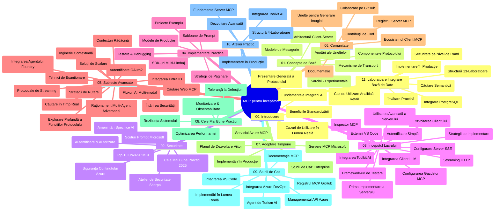

# Protocolul Contextului Modelului (MCP) pentru Începători - Ghid de Studii

Acest ghid de studii oferă o prezentare generală a structurii și conținutului depozitului pentru curriculumul „Protocolul Contextului Modelului (MCP) pentru Începători”. Folosește acest ghid pentru a naviga eficient în depozit și pentru a profita la maximum de resursele disponibile.

## Prezentare Generală a Depozitului

Protocolul Contextului Modelului (MCP) este un cadru standardizat pentru interacțiunile dintre modelele AI și aplicațiile client. Creat inițial de Anthropic, MCP este acum întreținut de comunitatea extinsă MCP prin organizația oficială GitHub. Acest depozit oferă un curriculum cuprinzător cu exemple practice de cod în C#, Java, JavaScript, Python și TypeScript, destinat dezvoltatorilor AI, arhitecților de sisteme și inginerilor software.

## Hartă Vizuală a Curriculumului

## Structura Depozitului

Depozitul este organizat în unsprezece secțiuni principale, fiecare concentrându-se pe diferite aspecte ale MCP:

1. **Introducere (00-Introduction/)**
   - Prezentare generală a Protocolului Contextului Modelului
   - De ce standardizarea contează în fluxurile AI
   - Cazuri practice și beneficii

2. **Concepte de Bază (01-CoreConcepts/)**
   - Arhitectura client-server
   - Componente cheie ale protocolului
   - Tipare de mesagerie în MCP

3. **Securitate (02-Security/)**
   - Amenințări de securitate în sistemele bazate pe MCP
   - Cele mai bune practici pentru implementări securizate
   - Strategii de autentificare și autorizare
   - **Documentație Cuprinzătoare de Securitate**:
     - Cele mai bune practici de securitate MCP 2025
     - Ghid de implementare Azure Content Safety
     - Controale și tehnici de securitate MCP
     - Referință rapidă a celor mai bune practici MCP
   - **Teme Cheie de Securitate**:
     - Atacuri de injectare a promptului și otrăvirea uneltelor
     - Hijack-ul sesiunilor și problemele deputy confuz
     - Vulnerabilități de token passthrough
     - Permisiuni excesive și controlul accesului
     - Securitatea lanțului de aprovizionare pentru componente AI
     - Integrarea Microsoft Prompt Shields

4. **Începutul Lucrului (03-GettingStarted/)**
   - Configurarea și pregătirea mediului
   - Crearea serverelor și clienților MCP de bază
   - Integrarea cu aplicații existente
   - Include secțiuni pentru:
     - Prima implementare a serverului
     - Dezvoltare client
     - Integrarea clientului LLM
     - Integrarea cu VS Code
     - Server Server-Sent Events (SSE)
     - Utilizare avansată a serverului
     - Streaming HTTP
     - Integrarea AI Toolkit
     - Strategii de testare
     - Ghid de implementare

5. **Implementare Practică (04-PracticalImplementation/)**
   - Utilizarea SDK-urilor în diverse limbaje de programare
   - Tehnici de depanare, testare și validare
   - Crearea de șabloane și fluxuri de lucru reutilizabile pentru prompturi
   - Proiecte exemplu cu exemple de implementare

6. **Subiecte Avansate (05-AdvancedTopics/)**
   - Tehnici de inginerie a contextului
   - Integrarea agenților Foundry
   - Fluxuri de lucru AI multimodale
   - Demonstrații de autentificare OAuth2
   - Capacități de căutare în timp real
   - Streaming în timp real
   - Implementarea contextelor root
   - Strategii de rutare
   - Tehnici de eșantionare
   - Abordări de scalare
   - Considerații de securitate
   - Integrarea securității Entra ID
   - Integrare căutare web
   - Raționament multi-agent adversarial (tipare de dezbatere)

7. **Contribuții în Comunitate (06-CommunityContributions/)**
   - Cum să contribui cu cod și documentație
   - Colaborare prin GitHub
   - Îmbunătățiri și feedback conduse de comunitate
   - Utilizarea diferiților clienți MCP (Claude Desktop, Cline, VSCode)
   - Lucrul cu servere MCP populare inclusiv generare de imagini

8. **Lecții din Adoptarea Timpurie (07-LessonsfromEarlyAdoption/)**
   - Implementări reale și povești de succes
   - Construirea și implementarea soluțiilor bazate pe MCP
   - Tendințe și foaie de parcurs viitoare
   - **Ghid Microsoft MCP Servers**: Ghid cuprinzător pentru 10 servere MCP Microsoft gata de producție, inclusiv:
     - Microsoft Learn Docs MCP Server
     - Azure MCP Server (15+ conectori specializați)
     - GitHub MCP Server
     - Azure DevOps MCP Server
     - MarkItDown MCP Server
     - SQL Server MCP Server
     - Playwright MCP Server
     - Dev Box MCP Server
     - Microsoft Foundry MCP Server
     - Microsoft 365 Agents Toolkit MCP Server

9. **Cele Mai Bune Practici (08-BestPractices/)**
   - Reglarea performanței și optimizare
   - Proiectarea sistemelor MCP tolerante la defecțiuni
   - Strategii de testare și reziliență

10. **Studii de Caz (09-CaseStudy/)**
    - **Șapte studii de caz cuprinzătoare** demonstrând versatilitatea MCP în scenarii diverse:
    - **Agenți de călătorie AI Azure**: Orchestrare multi-agent cu Azure OpenAI și AI Search
    - **Integrare Azure DevOps**: Automatizarea proceselor de lucru cu actualizări de date YouTube
    - **Preluare documentație în timp real**: Client consolă Python cu streaming HTTP
    - **Generator interactiv de planuri de studiu**: Aplicație web Chainlit cu AI conversațional
    - **Documentație în editor**: Integrare VS Code cu fluxuri de lucru GitHub Copilot
    - **Management API Azure**: Integrare API enterprise cu crearea serverului MCP
    - **Registrul MCP GitHub**: Dezvoltarea ecosistemului și platformă de integrare agentică
    - Exemple de implementare incluzând integrare enterprise, productivitate dezvoltatori și dezvoltare ecosistem

11. **Atelier Practic (10-StreamliningAIWorkflowsBuildingAnMCPServerWithAIToolkit/)**
    - Atelier practic cuprinzător combinând MCP cu AI Toolkit
    - Construirea aplicațiilor inteligente ce leagă modelele AI de unelte din lumea reală
    - Module practice ce acoperă fundamente, dezvoltare server personalizat și strategii de implementare în producție
    - **Structura laboratorului**:
      - Laborator 1: Fundamente MCP Server
      - Laborator 2: Dezvoltare avansată MCP Server
      - Laborator 3: Integrare AI Toolkit
      - Laborator 4: Implementare și scalare în producție
    - Abordare de învățare bazată pe laboratoare cu instrucțiuni pas cu pas

12. **Laboratoare de Integrare MCP Server cu Baze de Date (11-MCPServerHandsOnLabs/)**
    - **Parcurs de învățare cuprinzător în 13 laboratoare** pentru construirea serverelor MCP gata de producție cu integrare PostgreSQL
    - **Implementare reală de analiză retail** folosind cazul de utilizare Zava Retail
    - **Tipare enterprise** incluzând Row Level Security (RLS), căutare semantică și acces multi-tenant la date
    - **Structura completă a laboratorului**:
      - **Laboratoarele 00-03: Fundamente** - Introducere, Arhitectură, Securitate, Configurarea mediului
      - **Laboratoarele 04-06: Construirea MCP Serverului** - Proiectarea bazei de date, Implementarea serverului MCP, Dezvoltarea uneltelor
      - **Laboratoarele 07-09: Funcționalități Avansate** - Căutare semantică, Testare & depanare, Integrare VS Code
      - **Laboratoarele 10-12: Producție & Cele mai bune practici** - Implementare, Monitorizare, Optimizare
    - **Tehnologii acoperite**: framework FastMCP, PostgreSQL, Azure OpenAI, Azure Container Apps, Application Insights
    - **Rezultate de învățare**: servere MCP gata de producție, tipare de integrare a bazelor de date, analiză cu AI, securitate enterprise

## Resurse Suplimentare

Depozitul include resurse suport:

- **Folderul Imagini**: Conține diagrame și ilustrații folosite în tot curriculumul
- **Traduceri**: Suport multi-limbă cu traduceri automate ale documentației
- **Resurse Oficiale MCP**:
  - [Documentația MCP](https://modelcontextprotocol.io/)
  - [Specificația MCP](https://spec.modelcontextprotocol.io/)
  - [Depozitul GitHub MCP](https://github.com/modelcontextprotocol)

## Cum să Folosești Acest Depozit

1. **Învățare Secvențială**: Urmează capitolele în ordine (00 până la 11) pentru o experiență de învățare structurată.
2. **Focalizare pe Limbaj Specific**: Dacă ești interesat de un anumit limbaj de programare, explorează directoarele de exemple pentru implementări în limbajul preferat.
3. **Implementare Practică**: Începe cu secțiunea „Getting Started” pentru a-ți configura mediul și a crea primul tău server și client MCP.
4. **Explorare Avansată**: După ce stăpânești elementele de bază, aprofundează subiectele avansate pentru a-ți extinde cunoștințele.
5. **Implicare în Comunitate**: Alătură-te comunității MCP prin discuții GitHub și canale Discord pentru a te conecta cu experți și alți dezvoltatori.

## Clienți și Unelte MCP

Curriculumul acoperă diferiți clienți și unelte MCP:

1. **Clienți Oficiali**:
   - Visual Studio Code
   - MCP în Visual Studio Code
   - Claude Desktop
   - Claude în VSCode
   - Claude API

2. **Clienți Comunitari**:
   - Cline (bazat pe terminal)
   - Cursor (editor de cod)
   - ChatMCP
   - Windsurf

3. **Unelte de Administrare MCP**:
   - MCP CLI
   - MCP Manager
   - MCP Linker
   - MCP Router

## Servere MCP Populare

Depozitul prezintă diverse servere MCP, inclusiv:

1. **Servere Oficiale Microsoft MCP**:
   - Microsoft Learn Docs MCP Server
   - Azure MCP Server (15+ conectori specializați)
   - GitHub MCP Server
   - Azure DevOps MCP Server
   - MarkItDown MCP Server
   - SQL Server MCP Server
   - Playwright MCP Server
   - Dev Box MCP Server
   - Microsoft Foundry MCP Server
   - Microsoft 365 Agents Toolkit MCP Server

2. **Servere Oficiale de Referință**:
   - Filesystem
   - Fetch
   - Memory
   - Sequential Thinking

3. **Generare de Imagini**:
   - Azure OpenAI DALL-E 3
   - Stable Diffusion WebUI
   - Replicate

4. **Unelte de Dezvoltare**:
   - Git MCP
   - Control Terminal
   - Asistent Cod

5. **Servere Specializate**:
   - Salesforce
   - Microsoft Teams
   - Jira & Confluence

## Contribuții

Acest depozit primește cu plăcere contribuții din partea comunității. Consultă secțiunea Contribuții în Comunitate pentru ghiduri privind contribuirea eficientă la ecosistemul MCP.

----

*Acest ghid de studiu a fost actualizat ultima dată la 5 februarie 2026, reflectând cea mai recentă Specficație MCP 2025-11-25 și oferă o imagine de ansamblu a depozitului la acea dată. Conținutul depozitului poate fi actualizat după această dată.*

---

<!-- CO-OP TRANSLATOR DISCLAIMER START -->
**Declinare a responsabilității**:
Acest document a fost tradus folosind serviciul de traducere AI [Co-op Translator](https://github.com/Azure/co-op-translator). În timp ce ne străduim pentru acuratețe, vă rugăm să rețineți că traducerile automate pot conține erori sau inexactități. Documentul original în limba sa nativă trebuie considerat sursa autorizată. Pentru informații critice, se recomandă traducerea profesională realizată de un om. Nu ne asumăm responsabilitatea pentru eventualele neînțelegeri sau interpretări greșite care decurg din utilizarea acestei traduceri.
<!-- CO-OP TRANSLATOR DISCLAIMER END -->