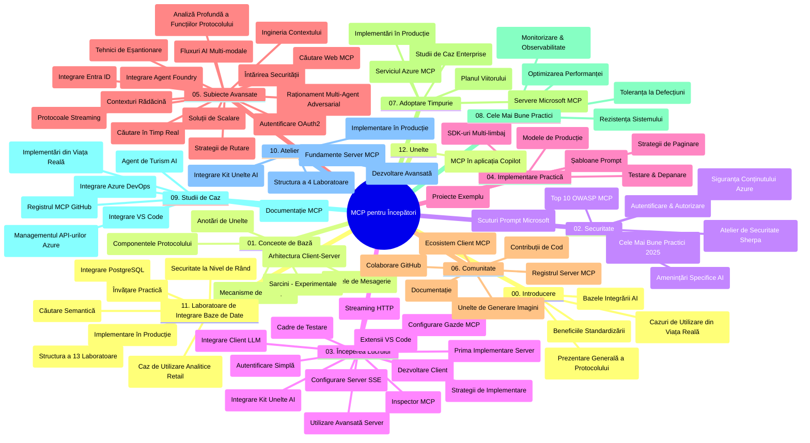

# Model Context Protocol (MCP) pentru Începători - Ghid de Studiu

Acest ghid de studiu oferă o prezentare generală a structurii și conținutului depozitului pentru curriculumul „Model Context Protocol (MCP) pentru Începători”. Folosește acest ghid pentru a naviga eficient prin depozit și pentru a profita la maxim de resursele disponibile.

## Prezentare Generală a Depozitului

Model Context Protocol (MCP) este un cadru standardizat pentru interacțiunile dintre modelele AI și aplicațiile client. Creat inițial de Anthropic, MCP este acum întreținut de comunitatea largă MCP prin intermediul organizației oficiale GitHub. Acest depozit oferă un curriculum cuprinzător cu exemple practice de cod în C#, Java, JavaScript, Python și TypeScript, conceput pentru dezvoltatori AI, arhitecți de sisteme și ingineri software.

## Hartă Vizuală a Curriculumului

## Structura Depozitului

Depozitul este organizat în douăsprezece secțiuni principale, fiecare concentrându-se pe diferite aspecte ale MCP:

1. **Introducere (00-Introduction/)**
   - Prezentare generală a Model Context Protocol
   - De ce contează standardizarea în fluxurile AI
   - Cazuri de utilizare și beneficii practice

2. **Concepte de Bază (01-CoreConcepts/)**
   - Arhitectura client-server
   - Componente importante ale protocolului
   - Modele de mesagerie în MCP

3. **Securitate (02-Security/)**
   - Amenințări de securitate în sistemele bazate pe MCP
   - Cele mai bune practici pentru securizarea implementărilor
   - Strategii de autentificare și autorizare
   - **Documentație Comprehensivă de Securitate**:
     - Cele mai bune practici MCP pentru securitate 2025
     - Ghid de implementare Azure Content Safety
     - Controale și tehnici de securitate MCP
     - Referință rapidă a celor mai bune practici MCP
   - **Subiecte Cheie de Securitate**:
     - Atacuri de injecție prompt și otrăvire de instrumente
     - Preluarea sesiunilor și probleme de tip „deputat confuz”
     - Vulnerabilități de trecere a token-urilor
     - Permisiuni excesive și controlul accesului
     - Securitatea lanțului de aprovizionare pentru componente AI
     - Integrarea Microsoft Prompt Shields

4. **Pornire Rapidă (03-GettingStarted/)**
   - Configurarea mediului și setare
   - Crearea serverelor și clienților MCP de bază
   - Integrarea cu aplicații existente
   - Include secțiuni pentru:
     - Prima implementare a serverului
     - Dezvoltarea clientului
     - Integrarea client LLM
     - Integrarea VS Code
     - Server Server-Sent Events (SSE)
     - Utilizare avansată a serverului
     - Streaming HTTP
     - Integrare AI Toolkit
     - Strategii de testare
     - Ghiduri de implementare

5. **Implementare Practică (04-PracticalImplementation/)**
   - Utilizarea SDK-urilor în diferite limbaje de programare
   - Tehnici de depanare, testare și validare
   - Crearea de șabloane de prompturi și fluxuri reutilizabile
   - Proiecte exemple cu exemple de implementări

6. **Subiecte Avansate (05-AdvancedTopics/)**
   - Tehnici de inginerie a contextului
   - Integrare agent Foundry
   - Fluxuri de lucru AI multimodale
   - Demonstrații de autentificare OAuth2
   - Capacități de căutare în timp real
   - Streaming în timp real
   - Implementarea contextelor root
   - Strategii de rutare
   - Tehnici de eșantionare
   - Abordări de scalare
   - Considerații de securitate
   - Integrare securitate Entra ID
   - Integrare căutare web
   - Raționament multi-agent adversarial (modele de dezbatere)

7. **Contribuții Comunitare (06-CommunityContributions/)**
   - Cum să contribui cu cod și documentație
   - Colaborare prin GitHub
   - Îmbunătățiri și feedback drive de comunitate
   - Utilizarea diverselor clienți MCP (Claude Desktop, Cline, VSCode)
   - Lucrul cu servere MCP populare, inclusiv generare de imagini

8. **Lecții din Adoptarea Timpurie (07-LessonsfromEarlyAdoption/)**
   - Implementări reale și povești de succes
   - Construirea și implementarea soluțiilor bazate pe MCP
   - Tendințe și planificarea viitorului
   - **Ghid Microsoft MCP Servers**: Ghid cuprinzător pentru 10 servere MCP Microsoft gata de producție, incluzând:
     - Microsoft Learn Docs MCP Server
     - Azure MCP Server (peste 15 conectori specializați)
     - GitHub MCP Server
     - Azure DevOps MCP Server
     - MarkItDown MCP Server
     - SQL Server MCP Server
     - Playwright MCP Server
     - Dev Box MCP Server
     - Microsoft Foundry MCP Server
     - Microsoft 365 Agents Toolkit MCP Server

9. **Cele Mai Bune Practici (08-BestPractices/)**
   - Optimizare și tuning de performanță
   - Proiectarea sistemelor MCP tolerante la erori
   - Strategii de testare și reziliență

10. **Studii de Caz (09-CaseStudy/)**
    - **Șapte studii de caz cuprinzătoare** care demonstrează versatilitatea MCP în diverse scenarii:
    - **Agenți de Călătorie AI Azure**: Orchestrare multi-agent cu Azure OpenAI și AI Search
    - **Integrare Azure DevOps**: Automatizarea proceselor cu actualizări date YouTube
    - **Recuperare Documentație în Timp Real**: Client Python în consolă cu streaming HTTP
    - **Generator Interactiv de Planuri de Studiu**: Aplicație web Chainlit cu AI conversațional
    - **Documentație în Editor**: Integrare VS Code cu fluxuri GitHub Copilot
    - **Gestionare API Azure**: Integrare API enterprise și creare server MCP
    - **Registrul GitHub MCP**: Dezvoltare ecosistem și platformă de integrare agentică
    - Exemple de implementare ce acoperă integrare enterprise, productivitate dezvoltatori și dezvoltare ecosistem

11. **Atelier Practic (10-StreamliningAIWorkflowsBuildingAnMCPServerWithAIToolkit/)**
    - Atelier practic complet combinând MCP cu AI Toolkit
    - Construirea aplicațiilor inteligente care pun în legătură modelele AI cu instrumente reale
    - Module practice care acoperă fundamente, dezvoltare server personalizat și strategii de implementare în producție
    - **Structura Laboratoarelor**:
      - Laborator 1: Fundamente Server MCP
      - Laborator 2: Dezvoltare Avansată Server MCP
      - Laborator 3: Integrare AI Toolkit
      - Laborator 4: Implementare și Scalare în Producție
    - Abordare de învățare prin laboratoare cu instrucțiuni pas cu pas

12. **Laboratoare de Integrare MCP Server cu Bază de Date (11-MCPServerHandsOnLabs/)**
    - **Traseu de învățare cu 13 laboratoare** pentru construirea serverelor MCP gata de producție cu integrare PostgreSQL
    - **Implementare reală pentru analiza retail** folosind cazul de utilizare Zava Retail
    - **Modele enterprise** inclusiv Row Level Security (RLS), căutare semantică și acces multi-tenant la date
    - **Structura Laboratoarelor Completă**:
      - **Laboratoarele 00-03: Fundamente** - Introducere, Arhitectură, Securitate, Configurare Mediu
      - **Laboratoarele 04-06: Construirea Serverului MCP** - Proiectare Bază de Date, Implementare Server MCP, Dezvoltare Instrumente
      - **Laboratoarele 07-09: Funcții Avansate** - Căutare Semantică, Testare & Depanare, Integrare VS Code
      - **Laboratoarele 10-12: Producție & Cele Mai Bune Practici** - Implementare, Monitorizare, Optimizare
    - **Tehnologii Acoperite**: cadru FastMCP, PostgreSQL, Azure OpenAI, Azure Container Apps, Application Insights
    - **Rezultate de Învățare**: Servere MCP gata de producție, modele de integrare baze de date, analize alimentate AI, securitate enterprise

13. **Instrumente (12-tooling/)**
    - Aflați cum să utilizați MCP în aplicația Copilot și alte unelte

## Resurse Suplimentare

Depozitul include resurse suport:

- **Dosar Imagini**: Conține diagrame și ilustrații folosite pe parcursul curriculumului
- **Traduceri**: Suport multilingv și traduceri automate ale documentației
- **Resurse Oficiale MCP**:
  - [Documentația MCP](https://modelcontextprotocol.io/)
  - [Specificația MCP](https://spec.modelcontextprotocol.io/)
  - [Depozitul MCP GitHub](https://github.com/modelcontextprotocol)

## Cum să Folosești Acest Depozit

1. **Învățare Secvențială**: Urmează capitolele în ordine (00 până la 11) pentru o experiență de învățare structurată.
2. **Focalizare pe Limbaj**: Dacă ești interesat de un limbaj de programare anume, explorează directoarele cu exemple pentru implementări în limbajul preferat.
3. **Implementare Practică**: Începe cu secțiunea „Getting Started” pentru a-ți configura mediul și a crea primul server și client MCP.
4. **Explorare Avansată**: După ce stăpânești noțiunile de bază, treci la subiectele avansate pentru a-ți extinde cunoștințele.
5. **Implicare în Comunitate**: Alătură-te comunității MCP prin discuții GitHub și canale Discord pentru a te conecta cu experți și dezvoltatori.

## Clienți și Unelte MCP

Curriculumul acoperă diferiți clienți și unelte MCP:

1. **Clienți Oficiali**:
   - Visual Studio Code 
   - MCP în Visual Studio Code
   - Claude Desktop
   - Claude în VSCode 
   - Claude API

2. **Clienți Comunitari**:
   - Cline (bazat pe terminal)
   - Cursor (editor de cod)
   - ChatMCP
   - Windsurf

3. **Unelte de Management MCP**:
   - MCP CLI
   - MCP Manager
   - MCP Linker
   - MCP Router

## Servere MCP Populare

Depozitul prezintă diverse servere MCP, inclusiv:

1. **Servere Oficiale Microsoft MCP**:
   - Microsoft Learn Docs MCP Server
   - Azure MCP Server (peste 15 conectori specializați)
   - GitHub MCP Server
   - Azure DevOps MCP Server
   - MarkItDown MCP Server
   - SQL Server MCP Server
   - Playwright MCP Server
   - Dev Box MCP Server
   - Microsoft Foundry MCP Server
   - Microsoft 365 Agents Toolkit MCP Server

2. **Servere Oficiale de Referință**:
   - Filesystem
   - Fetch
   - Memory
   - Sequential Thinking

3. **Generare Imagine**:
   - Azure OpenAI DALL-E 3
   - Stable Diffusion WebUI
   - Replicate

4. **Unelte de Dezvoltare**:
   - Git MCP
   - Terminal Control
   - Code Assistant

5. **Servere Specializate**:
   - Salesforce
   - Microsoft Teams
   - Jira & Confluence

## Contribuții

Acest depozit încurajează contribuțiile din comunitate. Consultă secțiunea Contribuții Comunitare pentru îndrumări despre cum să contribui eficient în ecosistemul MCP.

----

*Acest ghid de studiu a fost actualizat ultima dată pe 5 februarie 2026, reflectând cea mai recentă Specificație MCP 2025-11-25 și oferă o prezentare generală a depozitului la acea dată. Conținutul depozitului poate fi actualizat după această dată.*

---

<!-- CO-OP TRANSLATOR DISCLAIMER START -->
**Declinare a responsabilității**:
Acest document a fost tradus folosind serviciul de traducere AI [Co-op Translator](https://github.com/Azure/co-op-translator). În timp ce ne străduim pentru acuratețe, vă rugăm să rețineți că traducerile automate pot conține erori sau inexactități. Documentul original în limba sa nativă trebuie considerat sursa autorizată. Pentru informații critice, se recomandă traducerea profesională realizată de un om. Nu ne asumăm responsabilitatea pentru eventualele neînțelegeri sau interpretări greșite care decurg din utilizarea acestei traduceri.
<!-- CO-OP TRANSLATOR DISCLAIMER END -->