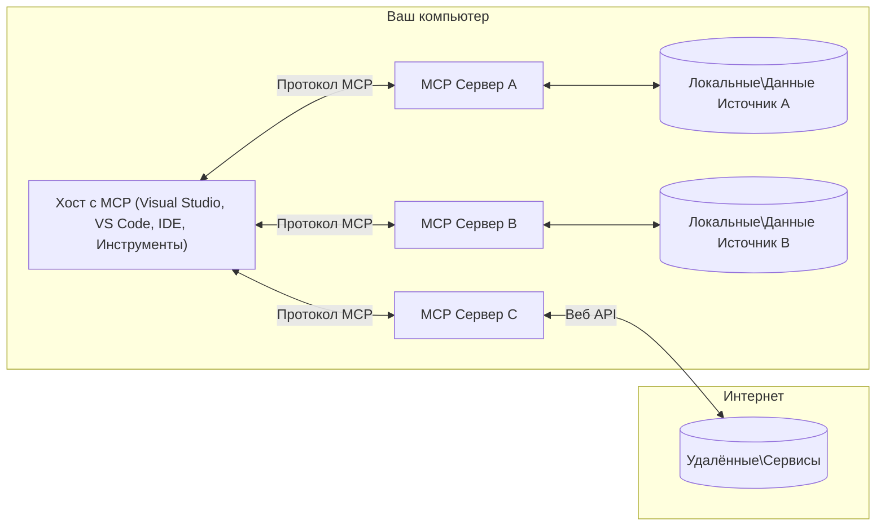

# Основные концепции MCP: Овладение протоколом контекста модели для интеграции ИИ

[](https://youtu.be/earDzWGtE84)

_(Нажмите на изображение выше, чтобы посмотреть видео этого урока)_

[Протокол контекста модели (MCP)](https://github.com/modelcontextprotocol) — мощная стандартизированная структура, оптимизирующая взаимодействие между крупными языковыми моделями (LLM) и внешними инструментами, приложениями и источниками данных. 
В этом руководстве вы познакомитесь с основными концепциями MCP. Вы узнаете о клиент-серверной архитектуре, ключевых компонентах, механике коммуникации и лучших практиках реализации.

- **Явное согласие пользователя**: Все операции и доступ к данным требуют явного одобрения пользователя перед выполнением. Пользователи должны чётко понимать, к каким данным будет предоставлен доступ и какие действия будут выполнены, с детальным контролем прав и разрешений.

- **Защита конфиденциальности данных**: Данные пользователя раскрываются только с явного согласия и должны защищаться надёжными механизмами контроля доступа на протяжении всего жизненного цикла взаимодействия. Реализации должны предотвращать неавторизованную передачу данных и обеспечивать строгие границы приватности.

- **Безопасность выполнения инструментов**: Каждый вызов инструмента требует явного согласия пользователя с чётким пониманием функционала инструмента, параметров и возможного воздействия. Надёжные меры безопасности должны предотвращать непреднамеренное, небезопасное или злонамеренное выполнение инструментов.

- **Безопасность транспортного слоя**: Все каналы связи должны использовать соответствующие механизмы шифрования и аутентификации. Удалённые соединения должны реализовывать безопасные транспортные протоколы и корректное управление учётными данными.

#### Руководство по реализации:

- **Управление разрешениями**: Внедряйте системы детального контроля прав, позволяющие пользователям управлять доступом к серверам, инструментам и ресурсам.
- **Аутентификация и авторизация**: Используйте надёжные методы аутентификации (OAuth, API ключи) с корректным управлением и истечением срока токенов.
- **Валидация вводимых данных**: Проверяйте все параметры и входные данные в соответствии с определёнными схемами, чтобы предотвратить атаки внедрения.
- **Ведение аудита**: Поддерживайте полные журналы всех операций для мониторинга безопасности и соблюдения требований.

## Обзор

В этом уроке рассматривается фундаментальная архитектура и компоненты, формирующие экосистему протокола контекста модели (MCP). Вы узнаете о клиент-серверной архитектуре, ключевых компонентах и механизмах коммуникации, обеспечивающих взаимодействия MCP.

## Основные цели обучения

По окончании урока вы сможете:

- Понимать клиент-серверную архитектуру MCP.
- Определять роли и обязанности Хостов, Клиентов и Серверов.
- Анализировать ключевые особенности, делающие MCP гибким уровнем интеграции.
- Узнавать, как осуществляется поток информации в экосистеме MCP.
- Получать практические знания через примеры кода на .NET, Java, Python и JavaScript.

## Архитектура MCP: углублённый взгляд

Экосистема MCP построена на модели клиент-сервер. Эта модульная структура позволяет ИИ-приложениям эффективно взаимодействовать с инструментами, базами данных, API и контекстуальными ресурсами. Разберём эту архитектуру на основные компоненты.

В основе MCP лежит клиент-серверная архитектура, где хост-приложение может подключаться к нескольким серверам:


- **MCP хосты**: Программы, такие как VSCode, Claude Desktop, IDE или ИИ-инструменты, которые хотят получить доступ к данным через MCP
- **MCP клиенты**: Клиенты протокола, поддерживающие соединения 1:1 с серверами
- **MCP серверы**: Лёгкие программы, предоставляющие определённый функционал через стандартизованный протокол контекста модели
- **Локальные источники данных**: Файлы, базы данных и сервисы компьютера, к которым MCP серверы могут безопасно получить доступ
- **Удалённые сервисы**: Внешние системы, доступные через интернет, к которым MCP серверы могут обращаться через API.

Протокол MCP является развивающимся стандартом с версионированием по дате (формат ГГГГ-ММ-ДД). Текущая версия протокола — **2025-11-25**. Последние обновления спецификации доступны в [протоколе](https://modelcontextprotocol.io/specification/2025-11-25/)

### 1. Хосты

В протоколе контекста модели (MCP) **Хосты** — это ИИ-приложения, которые служат основным интерфейсом для взаимодействия пользователей с протоколом. Хосты управляют и координируют соединения с множеством MCP серверов, создавая выделенных MCP клиентов для каждого серверного подключения. Примеры хостов:

- **ИИ-приложения**: Claude Desktop, Visual Studio Code, Claude Code
- **Среды разработки**: IDE и редакторы кода с интеграцией MCP
- **Пользовательские приложения**: Специально созданные ИИ-агенты и инструменты

**Хосты** — это приложения, координирующие взаимодействия с ИИ-моделями. Они:

- **Оркестровка ИИ моделей**: Выполняют или взаимодействуют с LLM для генерации ответов и координации ИИ-рабочих процессов
- **Управление клиентскими соединениями**: Создают и поддерживают одного MCP клиента на каждое соединение с MCP сервером
- **Контроль пользовательского интерфейса**: Обрабатывают ход разговоров, взаимодействия с пользователем и представление ответов
- **Обеспечение безопасности**: Контролируют права доступа, ограничения безопасности и аутентификацию
- **Обработка пользовательского согласия**: Управляют одобрением пользователя для обмена данными и выполнения инструментов

### 2. Клиенты

**Клиенты** — ключевые компоненты, поддерживающие выделенные одно-на-один соединения между хостами и MCP серверами. Каждый MCP клиент создаётся хостом для подключения к конкретному MCP серверу, обеспечивая организованные и защищённые каналы связи. Несколько клиентов позволяют хостам одновременно подключаться к множеству серверов.

**Клиенты** — это компоненты-соединители внутри хост-приложения. Они:

- **Протокольная коммуникация**: Отправляют JSON-RPC 2.0 запросы серверам с подсказками и инструкциями
- **Согласование возможностей**: Согласовывают поддерживаемые функции и версии протокола с серверами при инициализации
- **Выполнение инструментов**: Управляют запросами на выполнение инструментов от моделей и обрабатывают ответы
- **Обновления в реальном времени**: Обрабатывают уведомления и обновления в реальном времени от серверов
- **Обработка ответов**: Обрабатывают и форматируют ответы серверов для отображения пользователю

### 3. Серверы

**Серверы** — программы, предоставляющие контекст, инструменты и возможности клиентам MCP. Они могут работать локально (на той же машине, что и хост) или удалённо (на внешних платформах) и отвечают за обработку клиентских запросов и предоставление структурированных ответов. Серверы раскрывают конкретный функционал через стандартизованный протокол контекста модели.

**Серверы** — сервисы, предоставляющие контекст и возможности. Они:

- **Регистрация возможностей**: Регистрируют и раскрывают доступные примитивы (ресурсы, подсказки, инструменты) клиентам
- **Обработка запросов**: Получают и выполняют вызовы инструментов, запросы ресурсов и подсказок от клиентов
- **Обеспечение контекста**: Предоставляют контекстную информацию и данные для улучшения ответов модели
- **Управление состоянием**: Поддерживают состояние сессии и обрабатывают сохраняемые взаимодействия при необходимости
- **Уведомления в реальном времени**: Отправляют уведомления о изменениях возможностей и обновлениях подключённым клиентам

Серверы могут разрабатываться кем угодно для расширения возможностей моделей специализированным функционалом и поддерживают как локальные, так и удалённые сценарии развертывания.

### 4. Серверные примитивы

Серверы в протоколе контекста модели (MCP) предоставляют три основных **примитива**, которые определяют базовые строительные блоки для насыщенных взаимодействий между клиентами, хостами и языковыми моделями. Эти примитивы определяют типы контекстной информации и действий, доступных через протокол.

MCP серверы могут раскрывать любую комбинацию из следующих трёх основных примитивов:

#### Ресурсы

**Ресурсы** — источники данных, предоставляющие контекстную информацию для ИИ-приложений. Они представляют статическое или динамическое содержимое, которое может улучшать понимание модели и принятие решений:

- **Контекстные данные**: Структурированная информация и контекст для использования в ИИ модели
- **Базы знаний**: Репозитории документов, статьи, руководства и научные работы
- **Локальные источники данных**: Файлы, базы данных и информация локальной системы
- **Внешние данные**: Ответы API, веб-сервисы и удалённые данные систем
- **Динамический контент**: Данные в реальном времени, обновляющиеся в зависимости от внешних условий

Ресурсы идентифицируются URI и поддерживают обнаружение через методы `resources/list` и доступ через `resources/read`:

```text
file://documents/project-spec.md
database://production/users/schema
api://weather/current
```

#### Подсказки

**Подсказки** — повторно используемые шаблоны, помогающие структурировать взаимодействия с языковыми моделями. Они предоставляют стандартизированные паттерны взаимодействия и шаблоны рабочих процессов:

- **Взаимодействия на основе шаблонов**: Предварительно структурированные сообщения и стартеры разговоров
- **Шаблоны рабочих процессов**: Стандартизированные последовательности для распространённых задач и взаимодействий
- **Примеры few-shot**: Шаблоны, основанные на примерах, для инструкций модели
- **Системные подсказки**: Основополагающие подсказки, задающие поведение и контекст модели
- **Динамические шаблоны**: Параметризованные подсказки, адаптирующиеся к конкретным контекстам

Подсказки поддерживают подстановку переменных и могут обнаруживаться через `prompts/list` и извлекаться посредством `prompts/get`:

```markdown
Generate a {{task_type}} for {{product}} targeting {{audience}} with the following requirements: {{requirements}}
```

#### Инструменты

**Инструменты** — исполняемые функции, которые языковые модели могут вызывать для выполнения конкретных действий. Они представляют «глаголы» экосистемы MCP, позволяя моделям взаимодействовать с внешними системами:

- **Исполняемые функции**: Отдельные операции, которые модели могут вызвать с конкретными параметрами
- **Интеграция с внешними системами**: API вызовы, запросы к базам данных, операции с файлами, вычисления
- **Уникальная идентичность**: Каждый инструмент имеет уникальное имя, описание и схему параметров
- **Структурированный ввод-вывод**: Инструменты принимают проверенные параметры и возвращают структурированные типизированные ответы
- **Возможности действий**: Позволяют моделям выполнять реальные действия и получать живые данные

Инструменты описываются с помощью JSON Schema для валидации параметров, обнаруживаются через `tools/list` и вызываются через `tools/call`. Инструменты могут включать **иконки** как дополнительные метаданные для улучшения представления в интерфейсе.

**Аннотации инструментов**: Инструменты поддерживают поведенческие аннотации (например, `readOnlyHint`, `destructiveHint`), которые указывают, является ли инструмент только для чтения или разрушительным, помогая клиентам принимать обоснованные решения о выполнении.

Пример определения инструмента:

```typescript
server.tool(
  "search_products", 
  {
    query: z.string().describe("Search query for products"),
    category: z.string().optional().describe("Product category filter"),
    max_results: z.number().default(10).describe("Maximum results to return")
  }, 
  async (params) => {
    // Выполнить поиск и вернуть структурированные результаты
    return await productService.search(params);
  }
);
```

## Клиентские примитивы

В протоколе контекста модели (MCP) **клиенты** могут раскрывать примитивы, которые позволяют серверам запрашивать дополнительные возможности у хост-приложения. Эти клиентские примитивы позволяют создавать более богатые, интерактивные реализации серверов, которые могут использовать возможности ИИ модели и взаимодействия с пользователем.

### Семплирование

**Семплирование** позволяет серверам запрашивать дополнения от языковой модели через ИИ-приложение клиента. Этот примитив даёт серверам доступ к возможностям LLM без необходимости встраивать собственные зависимости моделей:

- **Независимый от модели доступ**: Серверы могут запрашивать дополнения без включения SDK LLM или управления доступом к модели
- **ИИ, инициируемый сервером**: Позволяет серверам автономно генерировать контент с использованием ИИ модели клиента
- **Рекурсивное взаимодействие с LLM**: Поддерживается сценарии, где серверам нужна помощь ИИ для обработки
- **Динамическая генерация контента**: Позволяет серверам создавать контекстуальные ответы с использованием модели хоста
- **Поддержка вызова инструментов**: Серверы могут включать параметры `tools` и `toolChoice`, чтобы разрешить модели клиента вызывать инструменты во время семплирования

Семплирование инициализируется через метод `sampling/complete`, где серверы отправляют запросы на дополнение клиентам.

### Корни

**Корни** предоставляют стандартизированный способ для клиентов раскрывать границы файловой системы серверам, помогая серверам понимать, к каким директориям и файлам у них есть доступ:

- **Границы файловой системы**: Определяют, в каких пределах сервера могут работать в файловой системе
- **Контроль доступа**: Помогают серверам понимать, к каким директориям и файлам разрешён доступ
- **Динамические обновления**: Клиенты могут уведомлять серверы при изменении списка корней
- **Идентификация по URI**: Корни используют URI с префиксом `file://` для обозначения доступных директорий и файлов

Корни обнаруживаются через метод `roots/list`, клиенты отправляют уведомления `notifications/roots/list_changed` при изменениях.

### Запрос информации

**Запрос информации** позволяет серверам запрашивать дополнительную информацию или подтверждение от пользователей через интерфейс клиента:

- **Запросы пользовательского ввода**: Серверы могут просить дополнительную информацию, необходимую для выполнения инструмента
- **Диалоги подтверждения**: Запрашивают согласие пользователя для чувствительных или значимых операций
- **Интерактивные рабочие процессы**: Позволяют серверам создавать поэтапные взаимодействия с пользователем
- **Динамический сбор параметров**: Собирают отсутствующие или необязательные параметры во время выполнения инструментов

Запросы информации отправляются с помощью метода `elicitation/request` для сбора пользовательского ввода через интерфейс клиента.

**Elicitation в режиме URL**: Серверы также могут запрашивать взаимодействие пользователя с внешними веб-страницами, направляя пользователей для аутентификации, подтверждения или ввода данных.

### Логирование

**Логирование** позволяет серверам отправлять структурированные лог-сообщения клиентам для отладки, мониторинга и операционной прозрачности:

- **Поддержка отладки**: Позволяет серверам предоставлять детальные журналы выполнения для устранения неполадок
- **Операционный мониторинг**: Отправляет обновления статуса и метрики производительности клиентам
- **Отчёт об ошибках**: Предоставляет подробный контекст ошибок и диагностическую информацию
- **Аудит**: Создаёт полные логи операций и решений сервера

Сообщения логирования отправляются клиентам для обеспечения прозрачности операций сервера и упрощения отладки.

## Поток информации в MCP

Протокол контекста модели (MCP) определяет структурированный поток информации между хостами, клиентами, серверами и моделями. Понимание этого потока помогает прояснить, как обрабатываются запросы пользователей и каким образом внешние инструменты и данные интегрируются в ответы модели.
- **Хост инициирует соединение**  
  Хост-приложение (например, IDE или интерфейс чата) устанавливает соединение с MCP сервером, обычно через STDIO, WebSocket или другой поддерживаемый транспорт.

- **Согласование возможностей**  
  Клиент (встроенный в хост) и сервер обмениваются информацией о поддерживаемых функциях, инструментах, ресурсах и версиях протокола. Это обеспечивает понимание обеими сторонами доступных возможностей для сессии.

- **Запрос пользователя**  
  Пользователь взаимодействует с хостом (например, вводит запрос или команду). Хост собирает этот ввод и передает его клиенту для обработки.

- **Использование ресурсов или инструментов**  
  - Клиент может запросить у сервера дополнительный контекст или ресурсы (например, файлы, записи базы данных или статьи базы знаний), чтобы расширить понимание модели.  
  - Если модель определяет, что нужен инструмент (например, для получения данных, выполнения вычисления или вызова API), клиент отправляет серверу запрос на вызов инструмента с указанием имени инструмента и параметров.

- **Выполнение на сервере**  
  Сервер получает запрос на ресурс или инструмент, выполняет необходимые операции (например, запуск функции, запрос к базе данных или получение файла) и возвращает результаты клиенту в структурированном формате.

- **Генерация ответа**  
  Клиент интегрирует ответы сервера (данные ресурсов, выходные данные инструментов и т. п.) в текущую модельную сессию. Модель использует эту информацию для создания развернутого и контекстуально релевантного ответа.

- **Представление результата**  
  Хост получает окончательный результат от клиента и отображает его пользователю, часто включая сгенерированный текст модели и любые результаты выполнения инструментов или запросов к ресурсам.

Этот процесс позволяет MCP поддерживать сложные, интерактивные и контекстно-зависимые AI-приложения, бесшовно соединяя модели с внешними инструментами и источниками данных.

## Архитектура протокола и уровни

MCP состоит из двух отдельных архитектурных уровней, которые работают вместе, обеспечивая полную коммуникационную структуру:

### Уровень данных

**Уровень данных** реализует основной протокол MCP с использованием **JSON-RPC 2.0** в качестве основы. Этот уровень определяет структуру сообщений, семантику и паттерны взаимодействия:

#### Основные компоненты:

- **Протокол JSON-RPC 2.0**: Вся коммуникация использует стандартизированный формат сообщений JSON-RPC 2.0 для вызовов методов, ответов и уведомлений  
- **Управление жизненным циклом**: Обрабатывает инициализацию соединения, согласование возможностей и завершение сессии между клиентами и серверами  
- **Примитивы сервера**: Позволяет серверам предоставлять базовый функционал через инструменты, ресурсы и подсказки  
- **Примитивы клиента**: Позволяет серверам запрашивать сэмплирование LLM, получение пользовательского ввода и отправку логов  
- **Уведомления в реальном времени**: Поддерживает асинхронные уведомления для динамических обновлений без опроса

#### Ключевые особенности:

- **Согласование версии протокола**: Использует версионирование по дате (ГГГГ-ММ-ДД) для обеспечения совместимости  
- **Обнаружение возможностей**: Клиенты и серверы обмениваются информацией о поддерживаемых функциях при инициализации  
- **Сохранение состояния сессий**: Поддерживает состояние соединения в рамках множества взаимодействий для непрерывности контекста

### Транспортный уровень

**Транспортный уровень** управляет каналами связи, кадрированием сообщений и аутентификацией между участниками MCP:

#### Поддерживаемые механизмы транспорта:

1. **Транспорт STDIO**:
   - Использует стандартные потоки ввода/вывода для прямой коммуникации между процессами  
   - Оптимален для локальных процессов на одной машине без сетевых накладных расходов  
   - Часто используется для локальных реализаций MCP серверов

2. **Транспорт Streamable HTTP**:
   - Использует HTTP POST для сообщений от клиента к серверу  
   - Опциональные Server-Sent Events (SSE) для потоковой передачи от сервера к клиенту  
   - Позволяет взаимодействовать с удалёнными серверами через сеть  
   - Поддерживает стандартную HTTP-аутентификацию (токены доступа, API-ключи, кастомные заголовки)  
   - MCP рекомендует OAuth для безопасной аутентификации на основе токенов

#### Абстракция транспорта:

Транспортный уровень отделяет детали коммуникации от уровня данных, позволяя использовать единый формат сообщений JSON-RPC 2.0 для всех транспортных механизмов. Такая абстракция даёт возможность переключаться между локальными и удалёнными серверами без изменений приложения.

### Вопросы безопасности

Реализации MCP должны соблюдать несколько критически важных принципов безопасности для обеспечения безопасных, надёжных и защищённых взаимодействий во всех операциях протокола:

- **Согласие и контроль пользователя**: Пользователь должен дать явное согласие перед тем, как данные будут получены или операции выполнены. Он должен чётко контролировать, какие данные передаются и какие действия разрешены, при этом интерфейсы должны быть интуитивно понятны для просмотра и подтверждения действий.

- **Конфиденциальность данных**: Данные пользователя должны передаваться только с явного согласия и защищаться соответствующими механизмами контроля доступа. Реализации MCP обязаны предотвращать несанкционированную передачу данных и обеспечивать конфиденциальность во всех взаимодействиях.

- **Безопасность инструментов**: Перед вызовом любого инструмента требуется явное согласие пользователя. Пользователь должен ясно понимать функциональность каждого инструмента, а также должны применяться жёсткие границы безопасности для предотвращения непредвиденного или небезопасного выполнения инструментов.

Соблюдая эти принципы безопасности, MCP обеспечивает доверие пользователей, защиту данных и безопасность при всех взаимодействиях протокола, одновременно позволяя создавать мощные интеграции с AI.

## Примеры кода: ключевые компоненты

Ниже приведены примеры кода на нескольких популярных языках программирования, иллюстрирующие, как реализовать основные компоненты MCP сервера и инструменты.

### Пример на .NET: создание простого MCP сервера с инструментами

Практический пример кода на .NET, демонстрирующий, как реализовать простой MCP сервер с пользовательскими инструментами. Показывает, как определить и зарегистрировать инструменты, обработать запросы и подключить сервер с протоколом Model Context Protocol.

```csharp
using System;
using System.Threading.Tasks;
using ModelContextProtocol.Server;
using ModelContextProtocol.Server.Transport;
using ModelContextProtocol.Server.Tools;

public class WeatherServer
{
    public static async Task Main(string[] args)
    {
        // Create an MCP server
        var server = new McpServer(
            name: "Weather MCP Server",
            version: "1.0.0"
        );
        
        // Register our custom weather tool
        server.AddTool<string, WeatherData>("weatherTool", 
            description: "Gets current weather for a location",
            execute: async (location) => {
                // Call weather API (simplified)
                var weatherData = await GetWeatherDataAsync(location);
                return weatherData;
            });
        
        // Connect the server using stdio transport
        var transport = new StdioServerTransport();
        await server.ConnectAsync(transport);
        
        Console.WriteLine("Weather MCP Server started");
        
        // Keep the server running until process is terminated
        await Task.Delay(-1);
    }
    
    private static async Task<WeatherData> GetWeatherDataAsync(string location)
    {
        // This would normally call a weather API
        // Simplified for demonstration
        await Task.Delay(100); // Simulate API call
        return new WeatherData { 
            Temperature = 72.5,
            Conditions = "Sunny",
            Location = location
        };
    }
}

public class WeatherData
{
    public double Temperature { get; set; }
    public string Conditions { get; set; }
    public string Location { get; set; }
}
```

### Пример на Java: компоненты MCP сервера

Этот пример демонстрирует тот же MCP сервер и регистрацию инструментов, что и пример на .NET выше, но реализован на Java.

```java
import io.modelcontextprotocol.server.McpServer;
import io.modelcontextprotocol.server.McpToolDefinition;
import io.modelcontextprotocol.server.transport.StdioServerTransport;
import io.modelcontextprotocol.server.tool.ToolExecutionContext;
import io.modelcontextprotocol.server.tool.ToolResponse;

public class WeatherMcpServer {
    public static void main(String[] args) throws Exception {
        // Создать MCP сервер
        McpServer server = McpServer.builder()
            .name("Weather MCP Server")
            .version("1.0.0")
            .build();
            
        // Зарегистрировать инструмент погоды
        server.registerTool(McpToolDefinition.builder("weatherTool")
            .description("Gets current weather for a location")
            .parameter("location", String.class)
            .execute((ToolExecutionContext ctx) -> {
                String location = ctx.getParameter("location", String.class);
                
                // Получить данные о погоде (упрощённо)
                WeatherData data = getWeatherData(location);
                
                // Вернуть форматированный ответ
                return ToolResponse.content(
                    String.format("Temperature: %.1f°F, Conditions: %s, Location: %s", 
                    data.getTemperature(), 
                    data.getConditions(), 
                    data.getLocation())
                );
            })
            .build());
        
        // Подключить сервер, используя stdio транспорт
        try (StdioServerTransport transport = new StdioServerTransport()) {
            server.connect(transport);
            System.out.println("Weather MCP Server started");
            // Поддерживать работу сервера до завершения процесса
            Thread.currentThread().join();
        }
    }
    
    private static WeatherData getWeatherData(String location) {
        // Реализация будет вызывать API погоды
        // Упрощено для примера
        return new WeatherData(72.5, "Sunny", location);
    }
}

class WeatherData {
    private double temperature;
    private String conditions;
    private String location;
    
    public WeatherData(double temperature, String conditions, String location) {
        this.temperature = temperature;
        this.conditions = conditions;
        this.location = location;
    }
    
    public double getTemperature() {
        return temperature;
    }
    
    public String getConditions() {
        return conditions;
    }
    
    public String getLocation() {
        return location;
    }
}
```

### Пример на Python: создание MCP сервера

В этом примере используется fastmcp, поэтому убедитесь, что вы его установили:

```python
pip install fastmcp
```
Пример кода:

```python
#!/usr/bin/env python3
import asyncio
from fastmcp import FastMCP
from fastmcp.transports.stdio import serve_stdio

# Создать сервер FastMCP
mcp = FastMCP(
    name="Weather MCP Server",
    version="1.0.0"
)

@mcp.tool()
def get_weather(location: str) -> dict:
    """Gets current weather for a location."""
    return {
        "temperature": 72.5,
        "conditions": "Sunny",
        "location": location
    }

# Альтернативный подход с использованием класса
class WeatherTools:
    @mcp.tool()
    def forecast(self, location: str, days: int = 1) -> dict:
        """Gets weather forecast for a location for the specified number of days."""
        return {
            "location": location,
            "forecast": [
                {"day": i+1, "temperature": 70 + i, "conditions": "Partly Cloudy"}
                for i in range(days)
            ]
        }

# Зарегистрировать инструменты класса
weather_tools = WeatherTools()

# Запустить сервер
if __name__ == "__main__":
    asyncio.run(serve_stdio(mcp))
```

### Пример на JavaScript: создание MCP сервера

Этот пример показывает создание MCP сервера на JavaScript и регистрацию двух инструментов, связанных с погодой.

```javascript
// Использование официального SDK протокола Model Context
import { McpServer } from "@modelcontextprotocol/sdk/server/mcp.js";
import { StdioServerTransport } from "@modelcontextprotocol/sdk/server/stdio.js";
import { z } from "zod"; // Для проверки параметров

// Создать MCP сервер
const server = new McpServer({
  name: "Weather MCP Server",
  version: "1.0.0"
});

// Определить инструмент погоды
server.tool(
  "weatherTool",
  {
    location: z.string().describe("The location to get weather for")
  },
  async ({ location }) => {
    // Обычно это вызов API погоды
    // Упрощено для демонстрации
    const weatherData = await getWeatherData(location);
    
    return {
      content: [
        { 
          type: "text", 
          text: `Temperature: ${weatherData.temperature}°F, Conditions: ${weatherData.conditions}, Location: ${weatherData.location}` 
        }
      ]
    };
  }
);

// Определить инструмент прогноза
server.tool(
  "forecastTool",
  {
    location: z.string(),
    days: z.number().default(3).describe("Number of days for forecast")
  },
  async ({ location, days }) => {
    // Обычно это вызов API погоды
    // Упрощено для демонстрации
    const forecast = await getForecastData(location, days);
    
    return {
      content: [
        { 
          type: "text", 
          text: `${days}-day forecast for ${location}: ${JSON.stringify(forecast)}` 
        }
      ]
    };
  }
);

// Вспомогательные функции
async function getWeatherData(location) {
  // Симуляция вызова API
  return {
    temperature: 72.5,
    conditions: "Sunny",
    location: location
  };
}

async function getForecastData(location, days) {
  // Симуляция вызова API
  return Array.from({ length: days }, (_, i) => ({
    day: i + 1,
    temperature: 70 + Math.floor(Math.random() * 10),
    conditions: i % 2 === 0 ? "Sunny" : "Partly Cloudy"
  }));
}

// Подключить сервер с использованием stdio транспорта
const transport = new StdioServerTransport();
server.connect(transport).catch(console.error);

console.log("Weather MCP Server started");
```

Этот пример на JavaScript демонстрирует, как создать MCP сервер, регистрирующий погодные инструменты, и подключить его с помощью транспорта stdio для обработки входящих запросов клиента.

## Безопасность и авторизация

MCP включает несколько встроенных концепций и механизмов для управления безопасностью и авторизацией в рамках всего протокола:

1. **Контроль разрешений на инструменты**:  
  Клиенты могут задавать, какими инструментами модель может пользоваться в течение сессии. Это гарантирует доступ только к явно разрешённым инструментам, снижая риск непредвиденных или небезопасных операций. Разрешения можно динамически настраивать в зависимости от предпочтений пользователя, политик организации или контекста взаимодействия.

2. **Аутентификация**:  
  Серверы могут требовать аутентификацию перед предоставлением доступа к инструментам, ресурсам или чувствительным операциям. Это могут быть API-ключи, OAuth-токены или другие схемы. Корректная аутентификация обеспечивает вызов серверных возможностей только доверенными клиентами и пользователями.

3. **Валидация**:  
  Параметры всех вызовов инструментов проходят проверку. Каждый инструмент определяет ожидаемые типы, форматы и ограничения параметров, а сервер проверяет входящие запросы на их соответствие. Это предотвращает попадание некорректных или вредоносных данных в реализации инструментов и поддерживает целостность операций.

4. **Ограничение скорости**:  
  Для предотвращения злоупотреблений и обеспечения справедливого использования ресурсов сервера MCP может реализовывать ограничение скорости вызовов инструментов и доступа к ресурсам. Ограничения можно применять по пользователю, по сессии или глобально, что помогает защитить от атак типа "отказ в обслуживании" и чрезмерного потребления ресурсов.

Комбинируя эти механизмы, MCP создаёт защищённую основу для интеграции языковых моделей с внешними инструментами и источниками данных, обеспечивая пользователям и разработчикам тонкий контроль доступа и использования.

## Сообщения протокола и поток связи

Коммуникация MCP использует структурированные **JSON-RPC 2.0** сообщения для обеспечения чётких и надёжных взаимодействий между хостами, клиентами и серверами. Протокол определяет специфические паттерны сообщений для разных видов операций:

### Основные типы сообщений:

#### **Сообщения инициализации**
- **Запрос `initialize`**: Устанавливает соединение и согласовывает версию протокола и возможности  
- **Ответ `initialize`**: Подтверждает поддерживаемые функции и информацию о сервере  
- **`notifications/initialized`**: Сигнализирует о завершении инициализации и готовности сессии

#### **Сообщения обнаружения**
- **Запрос `tools/list`**: Получение списка доступных инструментов с сервера  
- **Запрос `resources/list`**: Получение списка доступных ресурсов (источников данных)  
- **Запрос `prompts/list`**: Получение списка шаблонов подсказок

#### **Сообщения выполнения**  
- **Запрос `tools/call`**: Выполнение конкретного инструмента с переданными параметрами  
- **Запрос `resources/read`**: Получение содержимого конкретного ресурса  
- **Запрос `prompts/get`**: Получение шаблона подсказки с опциональными параметрами

#### **Сообщения со стороны клиента**
- **Запрос `sampling/complete`**: Сервер запрашивает завершение генерации LLM у клиента  
- **`elicitation/request`**: Сервер запрашивает ввод пользователя через клиентский интерфейс  
- **Логирующие сообщения**: Сервер отправляет структурированные логи клиенту

#### **Уведомления**
- **`notifications/tools/list_changed`**: Сервер уведомляет клиента об изменениях в списке инструментов  
- **`notifications/resources/list_changed`**: Сервер уведомляет клиента об изменениях в списке ресурсов  
- **`notifications/prompts/list_changed`**: Сервер уведомляет клиента об изменениях в списке подсказок

### Структура сообщений:

Все сообщения MCP следуют формату JSON-RPC 2.0 с:  
- **Запросы**: содержат `id`, `method` и опциональные `params`  
- **Ответы**: содержат `id` и либо `result`, либо `error`  
- **Уведомления**: содержат `method` и опциональные `params` (без `id`, ответ не нужен)

Такая структура обеспечивает надёжное, прослеживаемое и расширяемое взаимодействие, поддерживающее сложные сценарии, такие как обновления в реальном времени, последовательность инструментов и устойчивое обработку ошибок.

### Задачи (экспериментально)

**Задачи** — экспериментальная функция, обеспечивающая долговременное выполнение с возможностью отложенного получения результатов и отслеживания статуса запросов MCP:

- **Длительные операции**: Отслеживание затратных вычислений, автоматизации рабочих процессов и пакетной обработки  
- **Отложенные результаты**: Опрос статуса задач и получение результатов по завершении  
- **Отслеживание статуса**: Мониторинг прогресса задач через определённые состояния жизненного цикла  
- **Многошаговые операции**: Поддержка сложных рабочих процессов, охватывающих несколько взаимодействий

Задачи оборачивают стандартные запросы MCP, позволяя использовать асинхронные модели выполнения для операций, которые не могут завершиться мгновенно.

## Ключевые выводы

- **Архитектура**: MCP использует клиент-серверную архитектуру, где хосты управляют множественными клиентскими соединениями с серверами  
- **Участники**: Экосистема включает хосты (AI-приложения), клиентов (коннекторы протокола) и серверы (поставщики возможностей)  
- **Транспорты**: Поддерживаются STDIO (локальный) и Streamable HTTP с опциональным SSE (удалённый)  
- **Основные примитивы**: Серверы предоставляют инструменты (исполняемые функции), ресурсы (источники данных) и подсказки (шаблоны)  
- **Примитивы клиента**: Серверы могут запрашивать сэмплирование (завершения LLM с поддержкой вызова инструментов), получение ввода (включая URL-режим), определения корневых директорий (файловая система) и логирование у клиентов  
- **Экспериментальные функции**: Задачи обеспечивают долговременное выполнение длительных операций  
- **Основа протокола**: Построен на JSON-RPC 2.0 с версионированием по дате (текущая версия: 2025-11-25)  
- **Возможности в реальном времени**: Поддерживает уведомления для динамических обновлений и синхронизации в реальном времени  
- **Безопасность на первом месте**: Требуется явное согласие пользователя, защита конфиденциальности и безопасный транспорт

## Упражнение

Разработайте простой инструмент MCP, который был бы полезен в вашей области. Определите:  
1. Как будет называться инструмент  
2. Какие параметры он будет принимать  
3. Какой результат он будет возвращать  
4. Как модель может использовать этот инструмент для решения проблем пользователя


---

## Что дальше

Далее: [Глава 2: Безопасность](../02-Security/README.md)

---

<!-- CO-OP TRANSLATOR DISCLAIMER START -->
**Отказ от ответственности**:  
Этот документ был переведен с помощью сервиса автоматического перевода [Co-op Translator](https://github.com/Azure/co-op-translator). Несмотря на наши усилия по обеспечению точности, пожалуйста, учитывайте, что автоматический перевод может содержать ошибки или неточности. Оригинальный документ на его родном языке следует считать авторитетным источником. Для получения важной информации рекомендуется обращаться к профессиональному переводу, выполненному человеком. Мы не несем ответственности за любые недоразумения или неправильные толкования, возникшие в результате использования данного перевода.
<!-- CO-OP TRANSLATOR DISCLAIMER END -->