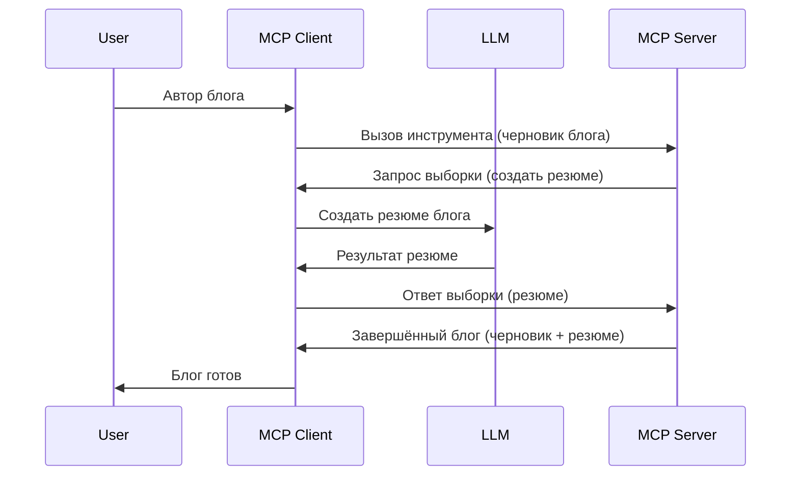

# Sampling - делегирование функций клиенту

Иногда MCP Client и MCP Server должны сотрудничать для достижения общей цели. Может случиться так, что серверу потребуется помощь LLM, который работает на клиенте. В таких случаях следует использовать sampling.

Давайте рассмотрим некоторые сценарии и как построить решение с использованием sampling.

## Обзор

В этом уроке мы сосредоточимся на объяснении, когда и где использовать Sampling и как его настроить.

## Цели обучения

В этой главе мы:

- Объясним, что такое Sampling и когда его использовать.
- Покажем, как настроить Sampling в MCP.
- Приведем примеры использования Sampling на практике.

## Что такое Sampling и зачем его использовать?

Sampling — это продвинутая функция, которая работает следующим образом:



### Запрос Sampling

Хорошо, теперь у нас есть общий обзор реалистичного сценария, давайте поговорим о запросе sampling, который сервер отправляет обратно клиенту. Вот как такой запрос может выглядеть в формате JSON-RPC:

```json
{
  "jsonrpc": "2.0",
  "id": 1,
  "method": "sampling/createMessage",
  "params": {
    "messages": [
      {
        "role": "user",
        "content": {
          "type": "text",
          "text": "Create a blog post summary of the following blog post: <BLOG POST>"
        }
      }
    ],
    "modelPreferences": {
      "hints": [
        {
          "name": "claude-3-sonnet"
        }
      ],
      "intelligencePriority": 0.8,
      "speedPriority": 0.5
    },
    "systemPrompt": "You are a helpful assistant.",
    "maxTokens": 100
  }
}
```

Здесь стоит отметить несколько моментов:

- Prompt, в content -> text, это наш запрос, инструкция LLM подытожить содержимое блога.

- **modelPreferences**. Этот раздел — просто предпочтение, рекомендация по конфигурации для LLM. Пользователь может выбрать следовать этим рекомендациям или изменить их. В данном случае рекомендации касаются модели, а также приоритетов скорости и интеллекта.
- **systemPrompt** — это обычный системный prompt, который задаёт LLM личность и содержит инструктаж.
- **maxTokens** — ещё одно свойство, указывающее, сколько токенов рекомендуется использовать для этой задачи.

### Ответ Sampling

Этот ответ — то, что MCP Client в итоге отправляет обратно MCP Server, результат вызова LLM клиентом, ожидания ответа и формирования этого сообщения. Вот как он может выглядеть в формате JSON-RPC:

```json
{
  "jsonrpc": "2.0",
  "id": 1,
  "result": {
    "role": "assistant",
    "content": {
      "type": "text",
      "text": "Here's your abstract <ABSTRACT>"
    },
    "model": "gpt-5",
    "stopReason": "endTurn"
  }
}
```

Обратите внимание, что ответ является абстрактом из блога, как мы запросили. Также обратите внимание, что используемая модель — это не та, которую мы изначально запросили, а "gpt-5" вместо "claude-3-sonnet". Это показывает, что пользователь может изменить своё мнение по использованию, а ваш запрос sampling — всего лишь рекомендация.

Хорошо, теперь когда мы понимаем основной процесс и полезное применение для задачи "создание и абстракт блога", давайте посмотрим, что нужно сделать, чтобы это заработало.

### Типы сообщений

Сообщения Sampling не ограничиваются только текстом, вы также можете отправлять изображения и аудио. Вот как JSON-RPC выглядит в этих случаях:

**Текст**

```json
{
  "type": "text",
  "text": "The message content"
}
```

**Содержимое изображения**

```json
{
  "type": "image",
  "data": "base64-encoded-image-data",
  "mimeType": "image/jpeg"
}
```

**Содержимое аудио**

```json
{
  "type": "audio",
  "data": "base64-encoded-audio-data",
  "mimeType": "audio/wav"
}
```

> NOTE: для более подробной информации о Sampling смотрите [официальную документацию](https://modelcontextprotocol.io/specification/2025-11-25/client/sampling)

## Как настроить Sampling в клиенте

> Примечание: если вы создаёте только сервер, здесь делать особо нечего.

В клиенте надо указать следующую функцию вот так:

```json
{
  "capabilities": {
    "sampling": {}
  }
}
```

Эта настройка будет задействована при инициализации выбранного клиента с сервером.

## Пример использования Sampling — создание блога

Давайте вместе запрограммируем sampling сервер, для этого нам нужно сделать следующее:

1. Создать инструмент на сервере.
1. Этот инструмент должен создавать запрос sampling.
1. Инструмент должен ждать, пока не получит ответ на запрос sampling от клиента.
1. После этого должен быть сформирован результат инструмента.

Рассмотрим код пошагово:

### -1- Создадим инструмент

**python**

```python
@mcp.tool()
async def create_blog(title: str, content: str, ctx: Context[ServerSession, None]) -> str:
    """Create a blog post and generate a summary"""

```

### -2- Создадим запрос sampling

Расширьте ваш инструмент следующим кодом:

**python**

```python
post = BlogPost(
        id=len(posts) + 1,
        title=title,
        content=content,
        abstract=""
    )

prompt = f"Create an abstract of the following blog post: title: {title} and draft: {content} "

result = await ctx.session.create_message(
        messages=[
            SamplingMessage(
                role="user",
                content=TextContent(type="text", text=prompt),
            )
        ],
        max_tokens=100,
)

```

### -3- Ждём ответ и возвращаем его

**python**

```python
post.abstract = result.content.text

posts.append(post)

# вернуть полный продукт
return json.dumps({
    "id": post.title,
    "abstract": post.abstract
})
```

### -4- Полный код

**python**

```python
from starlette.applications import Starlette
from starlette.routing import Mount, Host

from mcp.server.fastmcp import Context, FastMCP

from mcp.server.session import ServerSession
from mcp.types import SamplingMessage, TextContent

import json


from uuid import uuid4
from typing import List
from pydantic import BaseModel


mcp = FastMCP("Blog post generator")

# app = FastAPI()

posts = []

class BlogPost(BaseModel):
    id: int
    title: str
    content: str
    abstract: str

posts: List[BlogPost] = []

@mcp.tool()
async def create_blog(title: str, content: str, ctx: Context[ServerSession, None]) -> str:
    """Create a blog post and generate a summary"""

    post = BlogPost(
        id=len(posts) + 1,
        title=title,
        content=content,
        abstract=""
    )

    prompt = f"Create an abstract of the following blog post: title: {title} and draft: {content} "

    result = await ctx.session.create_message(
        messages=[
            SamplingMessage(
                role="user",
                content=TextContent(type="text", text=prompt),
            )
        ],
        max_tokens=100,
    )

    post.abstract = result.content.text

    posts.append(post)

    # вернуть полный блог пост
    return json.dumps({
        "id": post.title,
        "abstract": post.abstract
    })

if __name__ == "__main__":
    print("Starting server...")
    # mcp.run()
    mcp.run(transport="streamable-http")

# запустить приложение с помощью: python server.py
```

### -5- Тестирование в Visual Studio Code

Чтобы протестировать это в Visual Studio Code, выполните следующее:

1. Запустите сервер в терминале
1. Добавьте его в *mcp.json* (и убедитесь, что он запущен), например так:

   ```json
   "servers": {
      "blog-server": {
        "type": "http",
        "url": "http://localhost:8000/mcp"
      }
   }
   ```

1. Введите prompt:

   ```text
   create a blog post named "Where Python comes from", the content is "Python is actually named after Monty Python Flying Circus"
   ```

1. Дайте разрешение на sampling. При первом тесте всплывёт дополнительное диалоговое окно, которое нужно принять, затем появится обычный запрос с просьбой запустить инструмент.

1. Просмотрите результат. Вы увидите результаты как красиво отрендеренные в GitHub Copilot Chat, так и исходный JSON ответ.

**Бонус**. Интеграция Visual Studio Code отлично поддерживает sampling. Вы можете настроить доступ к Sampling на вашем установленном сервере следующим образом:

1. Перейдите в раздел расширений.
1. Нажмите на иконку шестерёнки рядом с вашим установленным сервером в разделе "MCP SERVERS - INSTALLED".
1. Выберите "Configure Model Access", где можно указать, какие модели GitHub Copilot может использовать при sampling. Также можно просмотреть все последние запросы sampling, выбрав "Show Sampling requests".

## Задание

В этом задании вы создадите немного другой Sampling — интеграцию sampling для генерации описания товара. Вот ваш сценарий:

**Сценарий**: Сотруднику бэк-офиса e-commerce нужна помощь, так как создание описаний товаров занимает слишком много времени. Ваша задача — сделать инструмент "create_product" с аргументами "title" и "keywords", который будет создавать полный товар, включая поле "description", которое должен наполнить LLM на клиенте.

TIP: используйте ранее изученное и создайте сервер и инструмент с запросом sampling.

## Решение

[Решение](./solution/README.md)

## Основные выводы

Sampling — мощная функция, позволяющая серверу делегировать задачи клиенту, когда нужна помощь LLM.

## Что дальше

- [Глава 4 - Практическая реализация](../../04-PracticalImplementation/README.md)

---

<!-- CO-OP TRANSLATOR DISCLAIMER START -->
**Отказ от ответственности**:
Этот документ был переведен с использованием сервиса машинного перевода [Co-op Translator](https://github.com/Azure/co-op-translator). Несмотря на наши усилия по обеспечению точности, имейте в виду, что автоматический перевод может содержать ошибки или неточности. Оригинальный документ на его исходном языке следует считать авторитетным источником. Для получения критически важной информации рекомендуется обратиться к профессиональному человеческому переводу. Мы не несем ответственности за любые недоразумения или неправильные толкования, возникшие в результате использования этого перевода.
<!-- CO-OP TRANSLATOR DISCLAIMER END -->