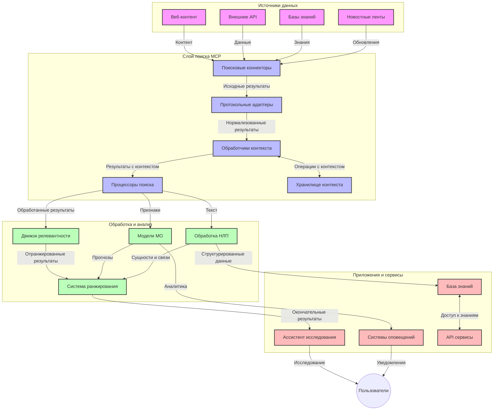
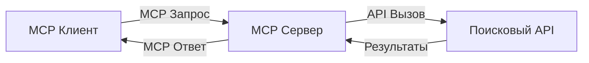
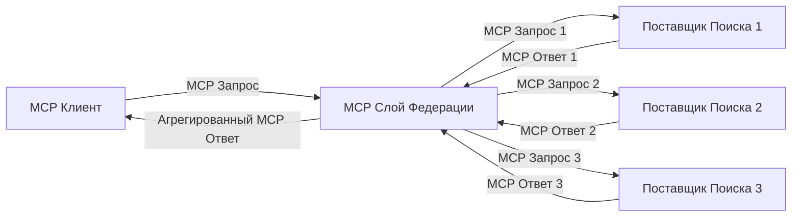
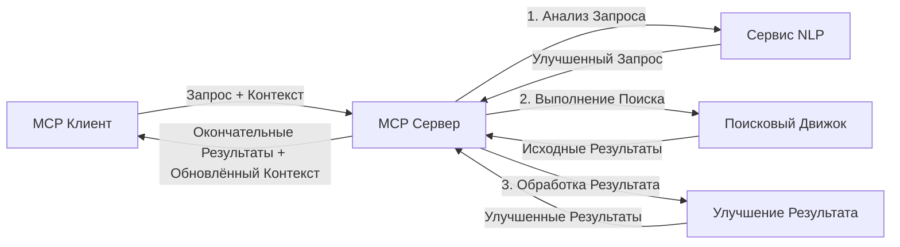

# Протокол Контекста Модели для Поиска в Вебе в Реальном Времени

## Обзор

Поиск в вебе в реальном времени стал важнейшим элементом в современной информационно-ориентированной среде, в которой приложения нуждаются в немедленном доступе к актуальной информации по всему интернету для предоставления релевантных и своевременных ответов. Протокол Контекста Модели (MCP) представляет собой значительный шаг вперед в оптимизации этих процессов поиска в реальном времени, повышая эффективность поиска, сохранять контекст и улучшая общую производительность системы.

Этот модуль исследует, как MCP трансформирует поиск в вебе в реальном времени, предоставляя стандартизированный подход к управлению контекстом между ИИ-моделями, поисковыми системами и приложениями.

### Чему вы научитесь

В этом подробном руководстве вы узнаете:

- Как MCP создает бесшовный мост между ИИ-моделями и возможностями поиска в вебе в реальном времени
- Архитектурные паттерны для реализации эффективных и масштабируемых поисковых решений с MCP
- Техники сохранения контекста поиска между несколькими запросами и взаимодействиями
- Практические реализации кода на Python и JavaScript для различных сценариев поиска
- Методы балансировки релевантности, актуальности и производительности в системах поиска на базе MCP

## Введение в Поиск в Вебе в Реальном Времени

Поиск в вебе в реальном времени — это технологический подход, который позволяет непрерывно выполнять запросы, обрабатывать и анализировать информацию из интернета по мере ее публикации или обновления, обеспечивая системы свежей и релевантной информацией с минимальной задержкой. В отличие от традиционных поисковых систем, работающих с индексированными данными, которые могут быть устаревшими на часы или дни, поиск в реальном времени обрабатывает живые данные из интернета, предоставляя данные и информацию, отражающие текущее состояние онлайн-контента.

### Основные концепции поиска в вебе в реальном времени:

- **Непрерывная обработка запросов**: Запросы обрабатываются в контексте постоянно обновляющихся источников данных
- **Приоритет актуальности**: Системы созданы для приоритизации свежей информации
- **Баланс релевантности**: Поддержание баланса между релевантностью и актуальностью
- **Масштабируемая архитектура**: Системы должны справляться с переменной нагрузкой запросов и объемом данных
- **Понимание контекста**: Сохранение контекста пользователя между итерациями поиска важно для получения значимых результатов
- **Динамическая переформулировка запросов**: Адаптивное изменение запросов на основе контекста и предыдущих результатов
- **Интеграция из нескольких источников**: Объединение результатов из разных поисковых провайдеров и веб-источников
- **Семантическое понимание**: Обработка запросов и содержимого на основе смысла, а не только ключевых слов
- **Рейтинг в реальном времени**: Постоянное корректирование ранжирования результатов по мере появления новой информации

### Протокол Контекста Модели и поиск в вебе в реальном времени

Протокол Контекста Модели (MCP) решает несколько критически важных задач в средах поиска в реальном времени:

1. **Сохранение контекста поиска**: MCP стандартизирует способы сохранения контекста между распределенными компонентами поиска, гарантируя, что ИИ-модели и узлы обработки имеют доступ к релевантной истории запросов и пользовательским предпочтениям.

2. **Эффективное управление запросами**: Предоставляя структурированные механизмы для передачи контекста, MCP снижает избыточность повторного указания контекста в каждой итерации поиска.

3. **Взаимодействие**: MCP создает общий язык для обмена контекстом между разнообразными технологиями поиска и ИИ-моделями, позволяя создавать более гибкие и расширяемые архитектуры.

4. **Оптимизированный для поиска контекст**: Реализации MCP могут приоритизировать наиболее релевантные элементы контекста для эффективного поиска, оптимизируя и производительность, и точность.

5. **Адаптивная обработка поиска**: При правильном управлении контекстом через MCP системы поиска могут динамически регулировать обработку в зависимости от меняющихся потребностей пользователя и информационного ландшафта.

В современных приложениях — от агрегаторов новостей до помощников для исследований — интеграция MCP с веб-поисковыми технологиями обеспечивает более интеллектуальный, контекстно-осведомленный поиск, который способен предоставлять все более релевантные результаты по мере продолжения взаимодействия пользователя.

## Цели обучения

По завершении этого урока вы сможете:

- Понять основы поиска в вебе в реальном времени и его вызовы в современных приложениях
- Объяснить, как протокол контекста модели (MCP) расширяет возможности поиска в реальном времени
- Реализовать поисковые решения на базе MCP с использованием популярных фреймворков и API
- Проектировать и внедрять масштабируемые высокопроизводительные архитектуры поиска на основе MCP
- Применять концепции MCP для различных сценариев, включая семантический поиск, помощь в исследованиях и расширенный браузинг с ИИ
- Оценивать новые тенденции и будущие новации в технологиях поиска на базе MCP
- Разрабатывать контекстно-осведомленные системы поиска, обучающиеся на взаимодействиях пользователя
- Интегрировать возможности веб-поиска в ИИ-помощников, используя стандартизированные протоколы MCP
- Создавать многоступенчатые поисковые пайплайны, которые постепенно уточняют результаты на основе контекста
- Оптимизировать производительность поиска при сохранении всестороннего контекстного осознания

### Определение и значение

Поиск в вебе в реальном времени включает непрерывные запросы, получение и доставку информации из интернета с минимальной задержкой. В отличие от традиционных поисковых систем, которые периодически сканируют и индексируют Интернет, поиск в реальном времени старается предоставлять информацию по мере ее появления, обеспечивая мгновенный доступ к самой актуальной информации.

Ключевые характеристики поиска в вебе в реальном времени включают:

- **Свежесть**: Приоритет свежему контенту и обновлениям
- **Непрерывная обработка**: Постоянный мониторинг новой информации
- **Адаптация запросов**: Уточнение запросов в зависимости от контекста и обратной связи
- **Мгновенная доставка**: Предоставление результатов с минимальной задержкой
- **Сохранение контекста**: Построение на основе предыдущих запросов для улучшения релевантности

### Проблемы традиционного веб-поиска

Традиционные подходы к веб-поиску сталкиваются с несколькими ограничениями при применении в сценариях реального времени:

1. **Фрагментация контекста**: Трудности с сохранением контекста поиска между несколькими запросами
2. **Свежесть информации**: Проблемы с доступом и приоритизацией самой свежей информации
3. **Сложность интеграции**: Проблемы взаимодействия между поисковыми системами и приложениями
4. **Проблемы с задержкой**: Балансирование между полнотой поиска и требованиями к времени отклика
5. **Настройка релевантности**: Обеспечение точности и релевантности при приоритете актуальности

## Понимание Протокола Контекста Модели (MCP) для Поиска

### Что такое MCP в контексте поиска?

Протокол Контекста Модели (MCP) — это стандартизированный протокол связи, предназначенный для обеспечения эффективного взаимодействия между ИИ-моделями и приложениями. В контексте поиска в вебе в реальном времени MCP предоставляет структуру для:

- Сохранения контекста поиска на протяжении цепочки запросов
- Стандартизации форматов запросов и результатов поиска
- Оптимизации передачи параметров поиска и результатов
- Улучшения коммуникации между моделями и поисковыми системами

### Основные компоненты и архитектура

Архитектура MCP для поиска в реальном времени состоит из нескольких ключевых компонентов:

1. **Менеджеры контекста запросов**: Управляют и поддерживают контекст поиска между несколькими запросами
2. **Обработчики поиска**: Обрабатывают входящие поисковые запросы с использованием контекстно-осведомленных техник
3. **Адаптеры протоколов**: Конвертируют запросы между разными поисковыми API с сохранением контекста
4. **Хранилище контекста**: Эффективно хранит и извлекает историю поиска и предпочтения пользователя
5. **Коннекторы поиска**: Подключаются к различным поисковым системам и веб-API



### Как MCP улучшает поиск в вебе в реальном времени

MCP решает традиционные проблемы веб-поиска через:

- **Контекстную непрерывность**: Поддержание связей между запросами на протяжении всей сессии поиска
- **Оптимизированную передачу**: Снижение излишнего повторения параметров поиска за счёт интеллектуального управления контекстом
- **Стандартизированные интерфейсы**: Предоставление единых API для поисковых компонентов
- **Снижение задержки**: Минимизация накладных расходов на обработку благодаря эффективному управлению контекстом
- **Повышенную релевантность**: Улучшение релевантности поиска за счёт сохранения намерений пользователя через несколько запросов

## Интеграция и Реализация

Системы поиска в вебе в реальном времени требуют тщательного архитектурного проектирования и реализации для сохранения производительности и целостности контекста. Протокол Контекста Модели предлагает стандартизированный подход к интеграции ИИ-моделей и поисковых технологий, позволяя создавать более сложные, контекстно-осведомленные поисковые пайплайны.

### Обзор интеграции MCP в архитектуры поиска

Реализация MCP в средах поиска в реальном времени включает несколько важных аспектов:

1. **Сериализация контекста поиска**: MCP предоставляет эффективные механизмы кодирования контекстной информации в поисковых запросах, гарантируя, что важный контекст сопровождает запрос на всех этапах обработки. Это включает стандартизованные форматы сериализации, оптимизированные под метаданные, связанные с поиском.

2. **Состояние в обработке поиска**: MCP позволяет более интеллектуальную обработку с сохранением состояния, поддерживая постоянное представление контекста между итерациями поиска. Это особенно ценно в многоступенчатых поисковых пайплайнах, где уточнение контекста улучшает результаты.

3. **Расширение и уточнение запроса**: Реализации MCP в поисковых системах могут обеспечивать сложное расширение и уточнение запросов на основе накопленного контекста, позволяя получать все более релевантные результаты по мере продвижения сессии поиска.

4. **Кэширование и приоритизация результатов**: Стандартизируя обработку контекста, MCP помогает управлять кэшированием и приоритизацией результатов, позволяя компонентам адаптироваться в зависимости от меняющегося контекста поиска.

5. **Федерация и агрегация поиска**: MCP облегчает более сложную федерацию поиска через несколько бекендов, предоставляя структурированные представления контекста поиска, что позволяет более осмысленно агрегировать результаты из разных источников.

Реализация MCP на различных поисковых технологиях создает единый подход к управлению контекстом, снижая необходимость написания кастомного кода интеграции и одновременно повышая способность системы поддерживать значимый контекст в ходе эволюции поисковых запросов.

### MCP в различных реализациях веб-поиска

Приведенные примеры соответствуют текущей спецификации MCP, которая ориентирована на протокол JSON-RPC с различными транспортными механизмами. Код демонстрирует, как можно реализовать собственные интеграции поиска при полном соответствии протоколу MCP.

<details>
<summary>Реализация на Python с универсальным поисковым API</summary>

```python
import asyncio
import json
import aiohttp
from typing import Dict, Any, Optional, List
from contextlib import asynccontextmanager
from collections.abc import AsyncIterator

# Импорт стандартных библиотек MCP
from mcp.client.session import ClientSession
from mcp.client.streamable_http import streamablehttp_client
from mcp.types import TextContent, CreateMessageRequestParams, CreateMessageResult
from mcp.server.fastmcp import FastMCP

# Создать сервер FastMCP для веб-поиска
search_server = FastMCP("WebSearch")

# Класс для обработки операций веб-поиска
class WebSearchHandler:
    def __init__(self, api_endpoint: str, api_key: str):
        self.api_endpoint = api_endpoint
        self.api_key = api_key
        self.session = None
        
    async def initialize(self):
        """Initialize the HTTP session"""
        self.session = aiohttp.ClientSession(
            headers={"Authorization": f"Bearer {self.api_key}"}
        )
    
    async def close(self):
        """Close the HTTP session"""
        if self.session:
            await self.session.close()
            
    async def perform_search(self, query: str, max_results: int = 5, 
                           include_domains: List[str] = None, 
                           exclude_domains: List[str] = None,
                           time_period: str = "any") -> Dict[str, Any]:
        """Perform web search using the search API"""
        # Конструировать параметры поиска
        search_params = {
            "q": query,
            "limit": max_results,
            "time": time_period
        }
        
        if include_domains:
            search_params["site"] = ",".join(include_domains)
            
        if exclude_domains:
            search_params["exclude_site"] = ",".join(exclude_domains)
        
        # Выполнить запрос поиска
        try:
            async with self.session.get(
                self.api_endpoint,
                params=search_params
            ) as response:
                if response.status != 200:
                    error_text = await response.text()
                    raise Exception(f"Search API error: {response.status} - {error_text}")
                
                search_data = await response.json()
                
                # Преобразовать ответ API в стандартный формат
                results = []
                for item in search_data.get("results", []):
                    results.append({
                        "title": item.get("title", ""),
                        "url": item.get("url", ""),
                        "snippet": item.get("snippet", ""),
                        "date": item.get("published_date", ""),
                        "source": item.get("source", "")
                    })
                
                return {
                    "query": query,
                    "totalResults": len(results),
                    "results": results
                }
        except Exception as e:
            print(f"Search API request error: {e}")
            raise

# Инициализировать обработчик поиска
search_handler = WebSearchHandler(
    api_endpoint="https://api.search-service.example/search",
    api_key="your-api-key-here"
)

# Настроить lifespan для управления обработчиком поиска
@asyncio.asynccontextmanager
async def app_lifespan(server: FastMCP):
    """Manage application lifecycle"""
    await search_handler.initialize()
    try:
        yield {"search_handler": search_handler}
    finally:
        await search_handler.close()

# Установить lifespan для сервера
search_server = FastMCP("WebSearch", lifespan=app_lifespan)

# Зарегистрировать инструмент веб-поиска
@search_server.tool()
async def web_search(query: str, max_results: int = 5, 
                   include_domains: List[str] = None,
                   exclude_domains: List[str] = None,
                   time_period: str = "any") -> Dict[str, Any]:
    """
    Search the web for information
    
    Args:
        query: The search query
        max_results: Maximum number of results to return (default: 5)
        include_domains: List of domains to include in search results
        exclude_domains: List of domains to exclude from search results
        time_period: Time period for results ("day", "week", "month", "any")
        
    Returns:
        Dictionary containing search results
    """
    ctx = search_server.get_context()
    search_handler = ctx.request_context.lifespan_context["search_handler"]
    
    results = await search_handler.perform_search(
        query=query,
        max_results=max_results,
        include_domains=include_domains,
        exclude_domains=exclude_domains,
        time_period=time_period
    )
    
    return results

# Пример использования клиента
async def client_example():
    # Подключиться к серверу поиска с использованием Streamable HTTP транспорта
    async with streamablehttp_client("http://localhost:8000/mcp") as (read, write, _):
        async with ClientSession(read, write) as session:
            # Инициализировать соединение
            await session.initialize()
            
            # Вызвать инструмент web_search
            search_results = await session.call_tool(
                "web_search", 
                {
                    "query": "latest developments in AI and Model Context Protocol",
                    "max_results": 5,
                    "time_period": "day",
                    "include_domains": ["github.com", "microsoft.com"]
                }
            )
            
            print(f"Search results: {search_results}")

# Пример запуска сервера
if __name__ == "__main__":
    # Запустить сервер с использованием Streamable HTTP транспорта
    search_server.run(transport="streamable-http")
```
</details> 

<details>
<summary>Реализация на JavaScript с браузерным поиском</summary>

```javascript
// Реализация сервера MCP для веб-поиска
import { McpServer, ResourceTemplate } from '@modelcontextprotocol/sdk/server/mcp.js';
import { StreamableHTTPServerTransport } from '@modelcontextprotocol/sdk/server/streamableHttp.js';
import { z } from 'zod';

// Создать сервер MCP для веб-поиска
const searchServer = new McpServer({
    name: "BrowserSearch",
    description: "A server that provides web search capabilities"
});

// Класс сервиса поиска
class SearchService {
    constructor(searchApiUrl, apiKey) {
        this.searchApiUrl = searchApiUrl;
        this.apiKey = apiKey;
    }

    async performSearch(parameters) {
        const {
            query = '',
            maxResults = 5,
            includeDomains = [],
            excludeDomains = [],
            timePeriod = 'any'
        } = parameters;
        
        // Сформировать URL поиска с параметрами
        const url = new URL(this.searchApiUrl);
        url.searchParams.append('q', query);
        url.searchParams.append('limit', maxResults);
        url.searchParams.append('time', timePeriod);
        
        if (includeDomains.length > 0) {
            url.searchParams.append('site', includeDomains.join(','));
        }
        
        if (excludeDomains.length > 0) {
            url.searchParams.append('exclude_site', excludeDomains.join(','));
        }
        
        try {
            const response = await fetch(url.toString(), {
                method: 'GET',
                headers: {
                    'Authorization': `Bearer ${this.apiKey}`,
                    'Content-Type': 'application/json'
                }
            });
            
            if (!response.ok) {
                const errorText = await response.text();
                throw new Error(`Search API error: ${response.status} - ${errorText}`);
            }
            
            const searchData = await response.json();
            
            // Преобразовать специфичный для API ответ в стандартный формат
            const results = searchData.results?.map(item => ({
                title: item.title || '',
                url: item.url || '',
                snippet: item.snippet || '',
                date: item.published_date || '',
                source: item.source || ''
            })) || [];
            
            return {
                query,
                totalResults: results.length,
                results
            };
        } catch (error) {
            console.error('Search API request error:', error);
            throw error;
        }
    }
}

// Инициализировать сервис поиска
const searchService = new SearchService(
    'https://api.search-service.example/search',
    'your-api-key-here'
);

// Настроить провайдера контекста для сервера
searchServer.setContextProvider(() => {
    return {
        searchService
    };
});

// Зарегистрировать инструмент веб-поиска
searchServer.tool({
    name: 'web_search',
    description: 'Search the web for information',
    parameters: {
        type: 'object',
        properties: {
            query: {
                type: 'string',
                description: 'The search query'
            },
            maxResults: {
                type: 'integer',
                description: 'Maximum number of results to return',
                default: 5
            },
            includeDomains: {
                type: 'array',
                items: { type: 'string' },
                description: 'List of domains to include in search results'
            },
            excludeDomains: {
                type: 'array',
                items: { type: 'string' },
                description: 'List of domains to exclude from search results'
            },
            timePeriod: {
                type: 'string',
                description: 'Time period for results',
                enum: ['day', 'week', 'month', 'any'],
                default: 'any'
            }
        },
        required: ['query']
    },
    handler: async (params, context) => {
        const { searchService } = context;
        return await searchService.performSearch(params);
    }
});

// Пример клиентского кода для подключения к серверу поиска
import { Client } from '@modelcontextprotocol/sdk/client/index.js';
import { StreamableHTTPClientTransport } from '@modelcontextprotocol/sdk/client/streamableHttp.js';

async function connectToSearchServer() {
    // Подключиться к серверу поиска
    const transport = new StreamableHTTPClientTransport(
        new URL('http://localhost:8000/mcp')
    );
    
    const client = new Client({
        name: 'search-client',
        version: '1.0.0'
    });
    
    await client.connect(transport);
    
    // Выполнить инструмент поиска
    const searchResults = await client.callTool({
        name: 'web_search',
        arguments: {
            query: 'Model Context Protocol implementation examples',
            maxResults: 10,
            timePeriod: 'week',
            includeDomains: ['github.com', 'docs.microsoft.com']
        }
    });
    
    console.log('Search results:', searchResults);
    
    // Очистка
    await client.disconnect();
}

// Запустить сервер
const transport = new StreamableHTTPServerTransport();
await searchServer.connect(transport);
console.log('Search server running at http://localhost:8000/mcp');

// В отдельном процессе или после запуска сервера
// connectToSearchServer().catch(console.error);
```
</details> 

## Отказ от ответственности по примерам кода

> **Важное замечание**: приведенные ниже примеры кода демонстрируют интеграцию Протокола Контекста Модели (MCP) с функциональностью веб-поиска. Хотя они следуют шаблонам и структурам официальных SDK MCP, они упрощены для учебных целей.
> 
> Эти примеры показывают:
> 
> 1. **Реализацию на Python**: сервер FastMCP, который предоставляет инструмент веб-поиска и подключается к внешнему поисковому API. Пример демонстрирует правильное управление временем жизни, работу с контекстом и реализацию инструментов, основываясь на паттернах [официального MCP Python SDK](https://github.com/modelcontextprotocol/python-sdk). Сервер использует рекомендованный Streamable HTTP транспорт, который заменил устаревший SSE транспорт для боевых развертываний.
> 
> 2. **Реализацию на JavaScript**: реализация на TypeScript/JavaScript, использующая паттерн FastMCP из [официального MCP TypeScript SDK](https://github.com/modelcontextprotocol/typescript-sdk) для создания поискового сервера с правильным определением инструментов и клиентскими подключениями. Следует последним рекомендованным паттернам управления сессиями и сохранения контекста.
> 
> Для промышленного использования эти примеры потребуют дополнительной обработки ошибок, аутентификации и конкретной интеграции API. Показанные конечные точки API поиска (`https://api.search-service.example/search`) являются заполнителями и требуют замены на реальные конечные точки поисковых сервисов.
> 
> Для полного понимания реализации и самых актуальных подходов обратитесь к [официальной спецификации MCP](https://spec.modelcontextprotocol.io/) и документации SDK.

## Основные концепции

### Фреймворк Протокола Контекста Модели (MCP)

В своей основе, Протокол Контекста Модели предоставляет стандартизированный способ обмена контекстом между ИИ-моделями, приложениями и сервисами. В поиске в вебе в реальном времени этот фреймворк необходим для создания последовательного, многотурового поискового опыта. Ключевые компоненты включают:

1. **Клиент-серверная архитектура**: MCP устанавливает четкое разделение между клиентами поиска (инициаторами запросов) и серверами поиска (поставщиками), позволяя гибко организовывать модели развертывания.

2. **Связь JSON-RPC**: Протокол использует JSON-RPC для обмена сообщениями, что делает его совместимым с веб-технологиями и простым в реализации на разных платформах.

3. **Управление контекстом**: MCP определяет структурированные методы для сохранения, обновления и использования контекста поиска на протяжении нескольких взаимодействий.

4. **Определения инструментов**: Возможности поиска представлены как стандартизированные инструменты с четко определёнными параметрами и возвращаемыми значениями.

5. **Поддержка потоковой передачи**: Протокол поддерживает потоковую передачу результатов, что необходимо для поиска в реальном времени, когда результаты могут поступать поэтапно.

### Паттерны интеграции с веб-поиском

При интеграции MCP с веб-поиском выделяются несколько паттернов:

#### 1. Прямая интеграция с поставщиком поиска



В этом паттерне MCP-сервер напрямую взаимодействует с одним или несколькими поисковыми API, преобразуя запросы MCP в вызовы API и форматируя результаты в ответы MCP.

#### 2. Федеративный поиск с сохранением контекста



Этот паттерн распределяет поисковые запросы между несколькими совместимыми с MCP поисковыми провайдерами, каждый из которых может специализироваться на разных типах контента или возможностях поиска, при этом поддерживая единый контекст.

#### 3. Цепочка поиска с расширенным контекстом



В этом паттерне процесс поиска разделён на несколько этапов, на каждом из которых контекст обогащается, что приводит к постепенному улучшению релевантности результатов.

### Компоненты контекста поиска

В веб-поиске на базе MCP контекст обычно включает:

- **Историю запросов**: Предыдущие поисковые запросы в рамках сессии
- **Предпочтения пользователя**: Язык, регион, настройки безопасного поиска
- **Историю взаимодействий**: Какие результаты были кликнуты, время, проведённое на страницах результатов
- **Параметры поиска**: Фильтры, порядок сортировки и другие модификаторы поиска
- **Предметные знания**: Специфический для темы контекст, релевантный для поиска
- **Временной контекст**: Факторы актуальности, зависящие от времени
- **Предпочтения по источникам**: Доверенные или предпочтительные источники информации

## Кейсы и применения

### Исследования и сбор информации

MCP улучшает рабочие процессы исследований благодаря:

- Сохранению контекста исследований между сессиями поиска
- Обеспечению более сложных и контекстно-релевантных запросов
- Поддержке федеративного поиска по нескольким источникам
- Содействию извлечению знаний из результатов поиска

### Мониторинг новостей и трендов в реальном времени

Поиск на основе MCP предлагает преимущества для мониторинга новостей:

- Почти в реальном времени обнаружение новых новостных историй
- Контекстная фильтрация релевантной информации
- Отслеживание тем и сущностей по множеству источников
- Персонализированные новости-оповещения на основе контекста пользователя

### Расширенный браузинг и исследования с помощью ИИ

MCP открывает новые возможности для расширенного браузинга с помощью ИИ:

- Контекстные поисковые предложения, основанные на текущей активности браузера
- Бесшовная интеграция веб-поиска с помощниками на базе больших языковых моделей (LLM)
- Многократное уточнение поиска с сохранением контекста
- Улучшенная проверка фактов и верификация информации

## Будущие тенденции и инновации

### Эволюция MCP в веб-поиске

В будущем мы ожидаем развитие MCP для решения:
- **Мультимодальный поиск**: Интеграция поиска по тексту, изображениям, аудио и видео с сохранением контекста  
- **Децентрализованный поиск**: Поддержка распределённых и федеративных экосистем поиска  
- **Конфиденциальность поиска**: Механизмы поиска с защитой конфиденциальности и учётом контекста  
- **Понимание запросов**: Глубокий семантический разбор поисковых запросов на естественном языке  

### Потенциальные технологические достижения

Новые технологии, которые определят будущее поиска MCP:  

1. **Нейронные поисковые архитектуры**: Поисковые системы на основе векторных представлений, оптимизированные для MCP  
2. **Персонализированный контекст поиска**: Обучение индивидуальным паттернам поиска пользователей с течением времени  
3. **Интеграция графов знаний**: Контекстный поиск с расширением за счёт отраслевых графов знаний  
4. **Кросс-модальный контекст**: Сохранение контекста между разными модальностями поиска  

## Практические упражнения

### Упражнение 1: Настройка базового поискового конвейера MCP

В этом упражнении вы научитесь:  
- Конфигурировать базовую среду поиска MCP  
- Реализовывать обработчики контекста для веб-поиска  
- Тестировать и проверять сохранение контекста между итерациями поиска  

### Упражнение 2: Создание исследовательского помощника с MCP-поиском

Создайте полноценное приложение, которое:  
- Обрабатывает вопросы исследования на естественном языке  
- Выполняет контекстно-осознанный веб-поиск  
- Синтезирует информацию из множества источников  
- Представляет структурированные результаты исследований  

### Упражнение 3: Реализация федеративного поиска с множеством источников на MCP

Продвинутое упражнение, охватывающее:  
- Контекстно-осознанную отправку запросов в несколько поисковых систем  
- Ранжирование и агрегацию результатов  
- Контекстное удаление дубликатов в результатах поиска  
- Обработку метаданных, специфичных для источников  

## Дополнительные ресурсы

- [Model Context Protocol Specification](https://spec.modelcontextprotocol.io/) - Официальная спецификация MCP и подробная документация протокола  
- [Model Context Protocol Documentation](https://modelcontextprotocol.io/) - Подробные руководства и инструкции по внедрению  
- [MCP Python SDK](https://github.com/modelcontextprotocol/python-sdk) - Официальная Python-реализация протокола MCP  
- [MCP TypeScript SDK](https://github.com/modelcontextprotocol/typescript-sdk) - Официальная TypeScript-реализация протокола MCP  
- [MCP Reference Servers](https://github.com/modelcontextprotocol/servers) - Эталонные реализации серверов MCP  
- [Bing Web Search API Documentation](https://learn.microsoft.com/en-us/bing/search-apis/bing-web-search/overview) - API веб-поиска Microsoft  
- [Google Custom Search JSON API](https://developers.google.com/custom-search/v1/overview) - Программируемый поисковый движок Google  
- [SerpAPI Documentation](https://serpapi.com/search-api) - API для получения результатов поиска  
- [Meilisearch Documentation](https://www.meilisearch.com/docs) - Открытый поисковый движок  
- [Elasticsearch Documentation](https://www.elastic.co/guide/index.html) - Распределённый поисково-аналитический движок  
- [LangChain Documentation](https://python.langchain.com/docs/get_started/introduction) - Создание приложений с использованием больших языковых моделей  

## Результаты обучения

Выполнив этот модуль, вы сможете:  

- Понять основы веб-поиска в реальном времени и его сложности  
- Объяснить, как Model Context Protocol (MCP) улучшает возможности поиска в реальном времени  
- Реализовать поисковые решения на базе MCP с использованием популярных фреймворков и API  
- Проектировать и запускать масштабируемые высокопроизводительные поисковые архитектуры с MCP  
- Применять концепции MCP в различных сценариях, включая семантический поиск, помощь в исследованиях и браузинг с поддержкой ИИ  
- Оценивать новые тенденции и будущие инновации в технологиях поиска на базе MCP  

### Вопросы доверия и безопасности

При реализации поисковых решений на базе MCP учитывайте важные принципы из спецификации MCP:  

1. **Согласие и контроль пользователя**: Пользователи должны явно согласиться и понимать все операции и доступ к данным. Это особенно важно для реализации веб-поиска, который может обращаться к внешним источникам данных.  

2. **Конфиденциальность данных**: Обеспечьте надлежащую обработку поисковых запросов и результатов, особенно если они могут содержать конфиденциальную информацию. Реализуйте соответствующие меры контроля доступа для защиты данных пользователей.  

3. **Безопасность инструментов**: Внедряйте корректную авторизацию и проверку для поисковых инструментов, поскольку они могут представлять потенциальные риски безопасности через выполнение произвольного кода. Описания поведения инструментов следует считать недоверенными, если они получены не от надежного сервера.  

4. **Чёткая документация**: Обеспечьте прозрачную документацию возможностей, ограничений и вопросов безопасности вашей реализации MCP-поиска, руководствуясь рекомендациями спецификации MCP.  

5. **Надёжные процессы согласия**: Создавайте надёжные механизмы получения согласия и авторизации, которые ясно объясняют назначение каждого инструмента до его использования, особенно для инструментов, работающих с внешними веб-ресурсами.  

Для подробной информации о безопасности и мерах доверия MCP смотрите [официальную документацию](https://modelcontextprotocol.io/specification/2025-11-25/basic/security_best_practices).  

## Что дальше

- [5.12 Аутентификация Entra ID для серверов Model Context Protocol](../mcp-security-entra/README.md)

---

<!-- CO-OP TRANSLATOR DISCLAIMER START -->
**Отказ от ответственности**:
Этот документ был переведен с использованием сервиса машинного перевода [Co-op Translator](https://github.com/Azure/co-op-translator). Несмотря на наши усилия по обеспечению точности, имейте в виду, что автоматический перевод может содержать ошибки или неточности. Оригинальный документ на его исходном языке следует считать авторитетным источником. Для получения критически важной информации рекомендуется обратиться к профессиональному человеческому переводу. Мы не несем ответственности за любые недоразумения или неправильные толкования, возникшие в результате использования этого перевода.
<!-- CO-OP TRANSLATOR DISCLAIMER END -->