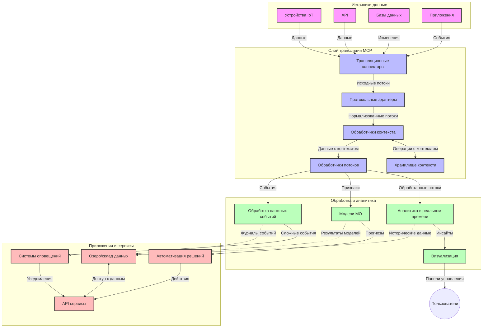

# Протокол Контекста Модели для Потоковой Передачи Данных в Реальном Времени

## Обзор

Потоковая передача данных в реальном времени стала незаменимой в современном мире, ориентированном на данные, где бизнес и приложения требуют немедленного доступа к информации для принятия своевременных решений. Протокол Контекста Модели (MCP) представляет собой значительный шаг вперёд в оптимизации этих процессов потоковой передачи, повышая эффективность обработки данных, сохраняя контекстную целостность и улучшая общую производительность системы.

В этом модуле рассматривается, как MCP преобразует потоковую передачу данных в реальном времени, обеспечивая стандартизированный подход к управлению контекстом между AI-моделями, потоковыми платформами и приложениями.

## Введение в потоковую передачу данных в реальном времени

Потоковая передача данных в реальном времени — это технологическая парадигма, позволяющая непрерывно передавать, обрабатывать и анализировать данные по мере их генерации, что даёт системам возможность мгновенно реагировать на новую информацию. В отличие от традиционной пакетной обработки, которая работает со статическими наборами данных, потоковая обработка данных происходит "на лету", обеспечивая инсайты и действия с минимальной задержкой.

### Основные понятия потоковой передачи данных в реальном времени:

- **Непрерывный поток данных**: данные обрабатываются как непрекращающийся поток событий или записей.
- **Обработка с низкой задержкой**: системы спроектированы так, чтобы минимизировать время между генерацией данных и их обработкой.
- **Масштабируемость**: архитектуры потоков должны справляться с переменным объёмом и скоростью данных.
- **Отказоустойчивость**: системы должны быть устойчивы к сбоям для обеспечения непрерывного потока данных.
- **Состояние с сохранением контекста**: поддержание контекста между событиями важно для значимого анализа.

### Протокол Контекста Модели и потоковая передача в реальном времени

Протокол Контекста Модели (MCP) решает несколько ключевых задач в средах потоковой передачи в реальном времени:

1. **Непрерывность контекста**: MCP стандартизирует способ сохранения контекста в распределённых потоковых компонентах, обеспечивая доступ AI-моделей и узлов обработки к релевантному историческому и окружающему контексту.

2. **Эффективное управление состоянием**: предоставляя структурированные механизмы передачи контекста, MCP снижает накладные расходы управления состоянием в потоковых конвейерах.

3. **Взаимодействие**: MCP создаёт общий язык для обмена контекстом между различными потоковыми технологиями и AI-моделями, что позволяет создавать более гибкие и расширяемые архитектуры.

4. **Оптимизированный контекст для потоковой передачи**: реализации MCP могут приоритизировать элементы контекста, наиболее важные для принятия решений в реальном времени, оптимизируя как производительность, так и точность.

5. **Адаптивная обработка**: с грамотным управлением контекстом через MCP потоковые системы могут динамически настраивать обработку на основе изменяющихся условий и паттернов в данных.

В современных приложениях — от сенсорных сетей IoT до платформ для финансовой торговли — интеграция MCP с потоковыми технологиями обеспечивает более интеллектуальную, контекстно-осведомлённую обработку, способную адекватно реагировать на сложные, динамично меняющиеся ситуации в реальном времени.

## Цели обучения

К концу этого урока вы сможете:

- Понять основы потоковой передачи данных в реальном времени и связанные с этим задачи
- Объяснить, как Протокол Контекста Модели (MCP) улучшает потоковую передачу данных в реальном времени
- Реализовать потоковые решения на основе MCP с использованием популярных фреймворков, таких как Kafka и Pulsar
- Проектировать и развёртывать отказоустойчивые, высокопроизводительные потоковые архитектуры с MCP
- Применять концепции MCP в сферах IoT, финансовой торговли и аналитики на базе AI
- Оценить новые тенденции и будущие инновации в технологиях потоковой передачи на базе MCP

### Определение и значение

Потоковая передача данных в реальном времени предполагает непрерывную генерацию, обработку и доставку данных с минимальной задержкой. В отличие от пакетной обработки, где данные собираются и обрабатываются группами, потоковые данные обрабатываются по мере поступления, что позволяет получать мгновенные инсайты и принимать решения.

Ключевые характеристики потоковой передачи данных в реальном времени включают:

- **Низкая задержка**: обработка и анализ данных за доли секунды или секунды
- **Непрерывный поток**: беспрерывный поток данных из различных источников
- **Мгновенная обработка**: анализ данных сразу по мере поступления, а не пакетами
- **Архитектура, ориентированная на события**: реагирование на события в момент их возникновения

### Задачи в традиционной потоковой передаче данных

Традиционные подходы к потоковой передаче данных сталкиваются с рядом ограничений:

1. **Потеря контекста**: сложности с поддержанием контекста в распределённых системах
2. **Проблемы масштабируемости**: трудности при обработке больших объёмов и высокоскоростных данных
3. **Сложность интеграции**: проблемы взаимодействия между разными системами
4. **Управление задержкой**: балансировка пропускной способности и времени обработки
5. **Согласованность данных**: обеспечение точности и полноты данных в потоке

## Понимание Протокола Контекста Модели (MCP)

### Что такое MCP?

Протокол Контекста Модели (MCP) — это стандартизованный протокол коммуникации, предназначенный для облегчения эффективного взаимодействия между AI-моделями и приложениями. В контексте потоковой передачи данных в реальном времени MCP предоставляет рамки для:

- Сохранения контекста по всему конвейеру данных
- Стандартизации форматов обмена данными
- Оптимизации передачи больших наборов данных
- Улучшения коммуникации между моделями и между моделями и приложениями

### Основные компоненты и архитектура

Архитектура MCP для потоковой передачи в реальном времени включает несколько ключевых компонентов:

1. **Обработчики контекста**: управляют и поддерживают контекстную информацию по всему потоковому конвейеру
2. **Обработчики потоков**: обрабатывают входящие потоки данных с использованием контекстно-ориентированных методов
3. **Адаптеры протоколов**: конвертируют разные потоковые протоколы, сохраняя контекст
4. **Хранилище контекста**: эффективно сохраняет и извлекает контекстную информацию
5. **Потоковые коннекторы**: подключаются к различным потоковым платформам (Kafka, Pulsar, Kinesis и т.д.)



### Как MCP улучшает обработку данных в реальном времени

MCP решает традиционные задачи потоковой передачи через:

- **Целостность контекста**: поддержание взаимосвязей между точками данных по всему конвейеру
- **Оптимизированная передача**: уменьшение избыточности обмена данными с помощью интеллектуального управления контекстом
- **Стандартизированные интерфейсы**: обеспечение единообразных API для потоковых компонентов
- **Снижение задержки**: минимизация накладных расходов обработки через эффективное управление контекстом
- **Повышенная масштабируемость**: поддержка горизонтального масштабирования с сохранением контекста

## Интеграция и реализация

Потоковые системы реального времени требуют тщательного архитектурного проектирования и реализации для сохранения как производительности, так и целостности контекста. MCP предлагает стандартизированный подход к интеграции AI-моделей и потоковых технологий, позволяя создавать более сложные конвейеры с управлением контекстом.

### Обзор интеграции MCP в потоковых архитектурах

Реализация MCP в потоковых системах реального времени включает несколько ключевых аспектов:

1. **Сериализация и транспорт контекста**: MCP предоставляет эффективные механизмы кодирования контекстной информации в потоковых пакетах данных, гарантируя, что важный контекст следует за данными в процессе обработки. Включает стандартизированные форматы сериализации, оптимизированные для потоковой передачи.

2. **Состояние в потоковой обработке**: MCP позволяет более интеллектуальную обработку с состоянием, поддерживая постоянное представление контекста между узлами обработки. Это особенно важно в распределённых потоковых архитектурах, где управление состоянием традиционно является сложной задачей.

3. **Время события и время обработки**: реализации MCP в потоковых системах должны решать общую проблему различия между временем возникновения событий и временем их обработки. Протокол может включать временной контекст, сохраняющий семантику времени события.

4. **Управление обратным давлением**: стандартизируя обработку контекста, MCP помогает управлять обратным давлением в потоковых системах, позволяя компонентам сообщать о своих возможностях обработки и соответственно регулировать поток.

5. **Оконные операции и агрегация контекста**: MCP облегчает более сложные оконные операции, предоставляя структурированные представления временного и реляционного контекста, что позволяет выполнять более значимые агрегации в потоках событий.

6. **Обработка точно-один раз**: в системах потоковой передачи, требующих семантики "ровно один раз", MCP может включать метаданные обработки для отслеживания и подтверждения статуса обработки в распределённых компонентах.

Внедрение MCP в различные потоковые технологии создаёт единый подход к управлению контекстом, сокращая необходимость в пользовательском интеграционном коде и одновременно повышая способность системы сохранять значимый контекст в процессе потоковой передачи.

### MCP в различных фреймворках потоковой передачи данных

Приведённые примеры соответствуют текущей спецификации MCP, которая основана на протоколе JSON-RPC с различными транспортными механизмами. Код демонстрирует, как можно реализовать кастомные транспорты для интеграции с потоковыми платформами, такими как Kafka и Pulsar, при полном соответствии протоколу MCP.

Примеры разработаны для демонстрации интеграции потоковых платформ с MCP, обеспечивая обработку данных в реальном времени с сохранением контекстной осведомлённости, что является ключевым в MCP. Такой подход гарантирует, что примеры кода точно отражают текущее состояние спецификации MCP по состоянию на июнь 2025 года.

MCP может быть интегрирован с популярными потоковыми фреймворками, включая:

#### Интеграция с Apache Kafka

```python
import asyncio
import json
from typing import Dict, Any, Optional
from confluent_kafka import Consumer, Producer, KafkaError
from mcp.client import Client, ClientCapabilities
from mcp.core.message import JsonRpcMessage
from mcp.core.transports import Transport

# Пользовательский класс транспорта для связи MCP с Kafka
class KafkaMCPTransport(Transport):
    def __init__(self, bootstrap_servers: str, input_topic: str, output_topic: str):
        self.bootstrap_servers = bootstrap_servers
        self.input_topic = input_topic
        self.output_topic = output_topic
        self.producer = Producer({'bootstrap.servers': bootstrap_servers})
        self.consumer = Consumer({
            'bootstrap.servers': bootstrap_servers,
            'group.id': 'mcp-client-group',
            'auto.offset.reset': 'earliest'
        })
        self.message_queue = asyncio.Queue()
        self.running = False
        self.consumer_task = None
        
    async def connect(self):
        """Connect to Kafka and start consuming messages"""
        self.consumer.subscribe([self.input_topic])
        self.running = True
        self.consumer_task = asyncio.create_task(self._consume_messages())
        return self
        
    async def _consume_messages(self):
        """Background task to consume messages from Kafka and queue them for processing"""
        while self.running:
            try:
                msg = self.consumer.poll(1.0)
                if msg is None:
                    await asyncio.sleep(0.1)
                    continue
                
                if msg.error():
                    if msg.error().code() == KafkaError._PARTITION_EOF:
                        continue
                    print(f"Consumer error: {msg.error()}")
                    continue
                
                # Разобрать значение сообщения как JSON-RPC
                try:
                    message_str = msg.value().decode('utf-8')
                    message_data = json.loads(message_str)
                    mcp_message = JsonRpcMessage.from_dict(message_data)
                    await self.message_queue.put(mcp_message)
                except Exception as e:
                    print(f"Error parsing message: {e}")
            except Exception as e:
                print(f"Error in consumer loop: {e}")
                await asyncio.sleep(1)
    
    async def read(self) -> Optional[JsonRpcMessage]:
        """Read the next message from the queue"""
        try:
            message = await self.message_queue.get()
            return message
        except Exception as e:
            print(f"Error reading message: {e}")
            return None
    
    async def write(self, message: JsonRpcMessage) -> None:
        """Write a message to the Kafka output topic"""
        try:
            message_json = json.dumps(message.to_dict())
            self.producer.produce(
                self.output_topic,
                message_json.encode('utf-8'),
                callback=self._delivery_report
            )
            self.producer.poll(0)  # Вызвать обратные вызовы
        except Exception as e:
            print(f"Error writing message: {e}")
    
    def _delivery_report(self, err, msg):
        """Kafka producer delivery callback"""
        if err is not None:
            print(f'Message delivery failed: {err}')
        else:
            print(f'Message delivered to {msg.topic()} [{msg.partition()}]')
    
    async def close(self) -> None:
        """Close the transport"""
        self.running = False
        if self.consumer_task:
            self.consumer_task.cancel()
            try:
                await self.consumer_task
            except asyncio.CancelledError:
                pass
        self.consumer.close()
        self.producer.flush()

# Пример использования Kafka MCP транспорта
async def kafka_mcp_example():
    # Создать MCP клиента с Kafka транспортом
    client = Client(
        {"name": "kafka-mcp-client", "version": "1.0.0"},
        ClientCapabilities({})
    )
    
    # Создать и подключить Kafka транспорт
    transport = KafkaMCPTransport(
        bootstrap_servers="localhost:9092",
        input_topic="mcp-responses",
        output_topic="mcp-requests"
    )
    
    await client.connect(transport)
    
    try:
        # Инициализировать сессию MCP
        await client.initialize()
        
        # Пример выполнения инструмента через MCP
        response = await client.execute_tool(
            "process_data",
            {
                "data": "sample data",
                "metadata": {
                    "source": "sensor-1",
                    "timestamp": "2025-06-12T10:30:00Z"
                }
            }
        )
        
        print(f"Tool execution response: {response}")
        
        # Корректное завершение работы
        await client.shutdown()
    finally:
        await transport.close()

# Запустить пример
if __name__ == "__main__":
    asyncio.run(kafka_mcp_example())
```

#### Реализация Apache Pulsar

```python
import asyncio
import json
import pulsar
from typing import Dict, Any, Optional
from mcp.core.message import JsonRpcMessage
from mcp.core.transports import Transport
from mcp.server import Server, ServerOptions
from mcp.server.tools import Tool, ToolExecutionContext, ToolMetadata

# Создайте пользовательский транспорт MCP, использующий Pulsar
class PulsarMCPTransport(Transport):
    def __init__(self, service_url: str, request_topic: str, response_topic: str):
        self.service_url = service_url
        self.request_topic = request_topic
        self.response_topic = response_topic
        self.client = pulsar.Client(service_url)
        self.producer = self.client.create_producer(response_topic)
        self.consumer = self.client.subscribe(
            request_topic,
            "mcp-server-subscription",
            consumer_type=pulsar.ConsumerType.Shared
        )
        self.message_queue = asyncio.Queue()
        self.running = False
        self.consumer_task = None
    
    async def connect(self):
        """Connect to Pulsar and start consuming messages"""
        self.running = True
        self.consumer_task = asyncio.create_task(self._consume_messages())
        return self
    
    async def _consume_messages(self):
        """Background task to consume messages from Pulsar and queue them for processing"""
        while self.running:
            try:
                # Неблокирующий прием с тайм-аутом
                msg = self.consumer.receive(timeout_millis=500)
                
                # Обработать сообщение
                try:
                    message_str = msg.data().decode('utf-8')
                    message_data = json.loads(message_str)
                    mcp_message = JsonRpcMessage.from_dict(message_data)
                    await self.message_queue.put(mcp_message)
                    
                    # Подтвердить получение сообщения
                    self.consumer.acknowledge(msg)
                except Exception as e:
                    print(f"Error processing message: {e}")
                    # Отрицательное подтверждение при ошибке
                    self.consumer.negative_acknowledge(msg)
            except Exception as e:
                # Обработать тайм-аут или другие исключения
                await asyncio.sleep(0.1)
    
    async def read(self) -> Optional[JsonRpcMessage]:
        """Read the next message from the queue"""
        try:
            message = await self.message_queue.get()
            return message
        except Exception as e:
            print(f"Error reading message: {e}")
            return None
    
    async def write(self, message: JsonRpcMessage) -> None:
        """Write a message to the Pulsar output topic"""
        try:
            message_json = json.dumps(message.to_dict())
            self.producer.send(message_json.encode('utf-8'))
        except Exception as e:
            print(f"Error writing message: {e}")
    
    async def close(self) -> None:
        """Close the transport"""
        self.running = False
        if self.consumer_task:
            self.consumer_task.cancel()
            try:
                await self.consumer_task
            except asyncio.CancelledError:
                pass
        self.consumer.close()
        self.producer.close()
        self.client.close()

# Определите пример инструмента MCP, который обрабатывает потоковые данные
@Tool(
    name="process_streaming_data",
    description="Process streaming data with context preservation",
    metadata=ToolMetadata(
        required_capabilities=["streaming"]
    )
)
async def process_streaming_data(
    ctx: ToolExecutionContext,
    data: str,
    source: str,
    priority: str = "medium"
) -> Dict[str, Any]:
    """
    Process streaming data while preserving context
    
    Args:
        ctx: Tool execution context
        data: The data to process
        source: The source of the data
        priority: Priority level (low, medium, high)
        
    Returns:
        Dict containing processed results and context information
    """
    # Пример обработки с использованием контекста MCP
    print(f"Processing data from {source} with priority {priority}")
    
    # Доступ к контексту разговора из MCP
    conversation_id = ctx.conversation_id if hasattr(ctx, 'conversation_id') else "unknown"
    
    # Вернуть результаты с расширенным контекстом
    return {
        "processed_data": f"Processed: {data}",
        "context": {
            "conversation_id": conversation_id,
            "source": source,
            "priority": priority,
            "processing_timestamp": ctx.get_current_time_iso()
        }
    }

# Пример реализации сервера MCP с использованием транспорта Pulsar
async def run_mcp_server_with_pulsar():
    # Создать сервер MCP
    server = Server(
        {"name": "pulsar-mcp-server", "version": "1.0.0"},
        ServerOptions(
            capabilities={"streaming": True}
        )
    )
    
    # Зарегистрировать наш инструмент
    server.register_tool(process_streaming_data)
    
    # Создать и подключить транспорт Pulsar
    transport = PulsarMCPTransport(
        service_url="pulsar://localhost:6650",
        request_topic="mcp-requests",
        response_topic="mcp-responses"
    )
    
    try:
        # Запустить сервер с транспортом Pulsar
        await server.run(transport)
    finally:
        await transport.close()

# Запустить сервер
if __name__ == "__main__":
    asyncio.run(run_mcp_server_with_pulsar())
```

### Лучшие практики развертывания

При реализации MCP для потоковой передачи в реальном времени:

1. **Проектируйте с учётом отказоустойчивости**:
   - Реализуйте правильную обработку ошибок
   - Используйте очереди "мертвых сообщений" для неудавшихся сообщений
   - Проектируйте идемпотентные обработчики

2. **Оптимизируйте производительность**:
   - Настраивайте подходящие размеры буферов
   - Используйте пакетную обработку там, где это уместно
   - Внедряйте механизмы обратного давления

3. **Мониторьте и наблюдайте**:
   - Отслеживайте метрики обработки потоков
   - Контролируйте распространение контекста
   - Настраивайте уведомления о аномалиях

4. **Обеспечьте безопасность потоков**:
   - Реализуйте шифрование для чувствительных данных
   - Используйте аутентификацию и авторизацию
   - Применяйте правильные механизмы контроля доступа


### MCP в IoT и Edge-вычислениях

MCP улучшает потоковую передачу IoT за счёт:

- Сохранения контекста устройств по всему конвейеру обработки
- Обеспечения эффективной потоковой передачи данных с периферии в облако
- Поддержки аналитики в реальном времени по IoT-потокам
- Облегчения взаимодействия устройств с учётом контекста

Пример: Сенсорные сети умных городов  
```
Sensors → Edge Gateways → MCP Stream Processors → Real-time Analytics → Automated Responses
```

### Роль в финансовых транзакциях и высокочастотной торговле

MCP предоставляет значительные преимущества для финансовой потоковой передачи данных:

- Очень низкая задержка обработки для торговых решений
- Сохранение контекста транзакций в процессе обработки
- Поддержка сложной обработки событий с учётом контекста
- Обеспечение согласованности данных в распределённых торговых системах

### Улучшение аналитики на базе AI

MCP открывает новые возможности для потоковой аналитики:

- Обучение моделей и вывод прогнозов в реальном времени
- Непрерывное обучение на потоковых данных
- Контекстно-осведомлённое извлечение признаков
- Многомодельные пайплайны вывода с сохранённым контекстом

## Будущие тренды и инновации

### Эволюция MCP в реальном времени

В будущем ожидается развитие MCP с учётом:

- **Интеграции квантовых вычислений**: подготовка к потоковым системам на основе квантовых технологий
- **Обработки на уровне периферии**: перенос большей части контекстно-осведомлённой обработки на edge-устройства
- **Автономного управления потоками**: самонастраивающиеся потоковые конвейеры
- **Федеративной потоковой передачи**: распределённая обработка с сохранением конфиденциальности

### Потенциальные технологические достижения

Прорывные технологии, формирующие будущее потоков MCP:

1. **AI-оптимизированные потоковые протоколы**: специализированные протоколы для AI-нагрузок
2. **Интеграция нейроморфных вычислений**: моделирование работы мозга для обработки потоков
3. **Безсерверные потоки**: событийно-ориентированная, масштабируемая потоковая обработка без управления инфраструктурой
4. **Распределённые хранилища контекста**: глобально распределённое, но при этом высококонсистентное управление контекстом

## Практические упражнения

### Упражнение 1: Настройка базового MCP потокового конвейера

В этом упражнении вы научитесь:
- Конфигурировать базовую потоковую среду MCP
- Реализовывать обработчики контекста для обработки потоков
- Тестировать и проверять сохранность контекста

### Упражнение 2: Создание панели аналитики в реальном времени

Создайте полнофункциональное приложение, которое:
- Получает потоковые данные с использованием MCP
- Обрабатывает поток, сохраняя контекст
- Визуализирует результаты в реальном времени

### Упражнение 3: Реализация сложной обработки событий с MCP

Продвинутый урок, охватывающий:
- Обнаружение шаблонов в потоках
- Контекстную корреляцию между несколькими потоками
- Генерацию сложных событий с сохранённым контекстом

## Дополнительные ресурсы

- [Спецификация Протокола Контекста Модели](https://modelcontextprotocol.io) — официальная спецификация и документация MCP
- [Документация Apache Kafka](https://kafka.apache.org/documentation/) — изучение Kafka для потоковой обработки
- [Apache Pulsar](https://pulsar.apache.org/) — единая платформа сообщений и потоков
- [Streaming Systems: The What, Where, When, and How of Large-Scale Data Processing](https://www.oreilly.com/library/view/streaming-systems/9781491983867/) — исчерпывающая книга по архитектурам потоковых систем
- [Microsoft Azure Event Hubs](https://learn.microsoft.com/azure/event-hubs/event-hubs-about) — управляемый сервис потоковой передачи событий
- [Документация MLflow](https://mlflow.org/docs/latest/index.html) — для отслеживания и развёртывания моделей ML
- [Аналитика в реальном времени с Apache Storm](https://storm.apache.org/releases/current/index.html) — фреймворк для потоковых вычислений
- [Flink ML](https://nightlies.apache.org/flink/flink-ml-docs-master/) — библиотека машинного обучения для Apache Flink
- [Документация LangChain](https://python.langchain.com/docs/get_started/introduction) — создание приложений на базе LLM

## Результаты обучения

По завершении этого модуля вы сможете:

- Понять основы потоковой передачи данных в реальном времени и возникающие задачи
- Объяснить, как Протокол Контекста Модели (MCP) улучшает потоковую передачу данных в реальном времени
- Реализовывать потоковые решения на основе MCP с использованием популярных фреймворков, таких как Kafka и Pulsar
- Проектировать и развёртывать отказоустойчивые, высокопроизводительные потоковые архитектуры с MCP
- Применять концепции MCP в сфере IoT, финансовой торговли и аналитики на базе AI
- Оценивать новые тренды и будущие инновации в технологиях потоковой передачи на основе MCP

## Что дальше

- [5.11 Поиск в реальном времени](../mcp-realtimesearch/README.md)

---

<!-- CO-OP TRANSLATOR DISCLAIMER START -->
**Отказ от ответственности**:
Этот документ был переведен с использованием сервиса машинного перевода [Co-op Translator](https://github.com/Azure/co-op-translator). Несмотря на наши усилия по обеспечению точности, имейте в виду, что автоматический перевод может содержать ошибки или неточности. Оригинальный документ на его исходном языке следует считать авторитетным источником. Для получения критически важной информации рекомендуется обратиться к профессиональному человеческому переводу. Мы не несем ответственности за любые недоразумения или неправильные толкования, возникшие в результате использования этого перевода.
<!-- CO-OP TRANSLATOR DISCLAIMER END -->