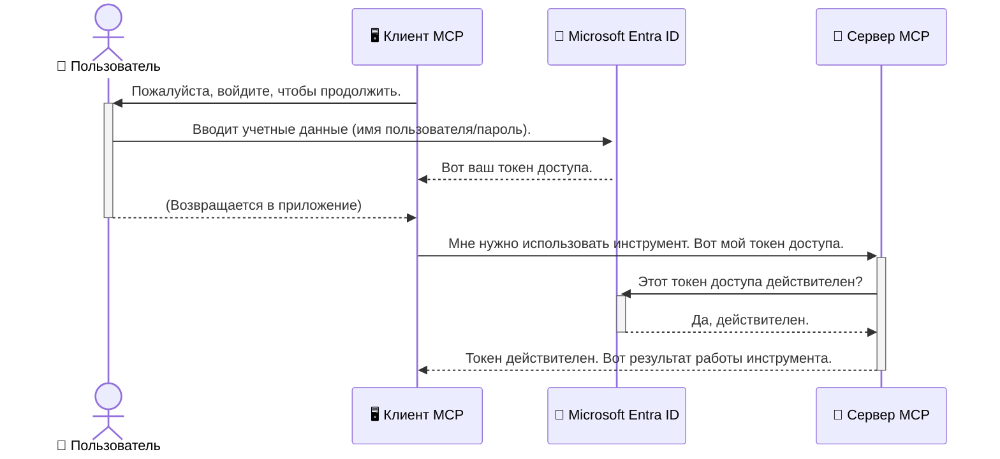

# Защита рабочих процессов ИИ: аутентификация Entra ID для серверов протокола Model Context

## Введение
Защита вашего сервера Model Context Protocol (MCP) так же важна, как запереть входную дверь вашего дома. Оставлять сервер MCP открытым — значит подвергать ваши инструменты и данные несанкционированному доступу, что может привести к нарушениям безопасности. Microsoft Entra ID предоставляет надежное облачное решение для управления идентификацией и доступом, гарантирующее, что только авторизованные пользователи и приложения могут взаимодействовать с вашим сервером MCP. В этом разделе вы узнаете, как защитить свои рабочие процессы ИИ с помощью аутентификации Entra ID.

## Учебные цели
К концу этого раздела вы сможете:

- Понимать важность защиты серверов MCP.
- Объяснять основы Microsoft Entra ID и аутентификации OAuth 2.0.
- Распознавать разницу между публичными и конфиденциальными клиентами.
- Реализовывать аутентификацию Entra ID как для локального (публичного клиента), так и для удалённого (конфиденциального клиента) сценариев серверов MCP.
- Применять лучшие практики безопасности при разработке рабочих процессов ИИ.

## Безопасность и MCP

Так же, как вы не оставите входную дверь своего дома незапертой, вы не должны оставлять сервер MCP открытым для любого доступа. Защита ваших рабочих процессов ИИ необходима для создания надежных, заслуживающих доверия и безопасных приложений. В этой главе вы познакомитесь с использованием Microsoft Entra ID для защиты серверов MCP, гарантируя, что только авторизованные пользователи и приложения могут взаимодействовать с вашими инструментами и данными.

## Почему безопасность важна для серверов MCP

Представьте, что ваш сервер MCP имеет инструмент, который может отправлять электронные письма или получать доступ к базе данных клиентов. Незащищенный сервер означает, что любой может использовать этот инструмент, что приведет к несанкционированному доступу к данным, спаму или другим вредоносным действиям.

Реализуя аутентификацию, вы обеспечиваете проверку каждого запроса к серверу, подтверждая личность пользователя или приложения, делающего запрос. Это первый и самый важный шаг в защите ваших рабочих процессов ИИ.

## Введение в Microsoft Entra ID

[**Microsoft Entra ID**](https://adoption.microsoft.com/microsoft-security/entra/) — облачный сервис управления идентификацией и доступом. Представьте его как универсального охранника безопасности для ваших приложений. Он обрабатывает сложный процесс проверки личностей пользователей (аутентификация) и определяет, что им разрешено делать (авторизация).

Используя Entra ID, вы можете:

- Обеспечить безопасный вход для пользователей.
- Защитить API и сервисы.
- Управлять политиками доступа из одного центра.

Для серверов MCP Entra ID предлагает надежное и широко признанное решение для управления тем, кто может получить доступ к возможностям вашего сервера.

---

## Понимание магии: как работает аутентификация Entra ID

Entra ID использует открытые стандарты, такие как **OAuth 2.0**, для обработки аутентификации. Хотя детали могут быть сложными, основная идея проста и легко понимается с помощью аналогии.

### Нежное введение в OAuth 2.0: ключ парковщика

Представьте OAuth 2.0 как услугу парковщика для вашего автомобиля. Когда вы приходите в ресторан, вы не отдаете парковщику свои мастер-ключи. Вместо этого вы даете **ключ парковщика** с ограниченными правами — он может завести машину и запереть двери, но не открыть багажник или бардачок.

В этой аналогии:

- **Вы** — это **Пользователь**.
- **Ваш автомобиль** — это **сервер MCP** с его ценными инструментами и данными.
- **Парковщик** — это **Microsoft Entra ID**.
- **Аттендант парковки** — это **MCP клиент** (приложение, пытающееся получить доступ к серверу).
- **Ключ парковщика** — это **токен доступа (access token)**.

Токен доступа — это защищённая текстовая строка, которую MCP клиент получает от Entra ID после вашего входа. Клиент затем предоставляет этот токен серверу MCP с каждым запросом. Сервер может проверить токен, чтобы убедиться, что запрос легитимен и клиент имеет необходимые разрешения, при этом ему не нужно обрабатывать ваши реальные учетные данные (такие как пароль).

### Процесс аутентификации

Вот как это работает на практике:



### Введение в библиотеку Microsoft Authentication Library (MSAL)

Прежде чем перейти к коду, важно представить ключевой компонент, который вы увидите в примерах: **Microsoft Authentication Library (MSAL)**.

MSAL — это библиотека, разработанная Microsoft, которая значительно упрощает разработчикам работу с аутентификацией. Вместо того чтобы писать весь сложный код для обработки токенов безопасности, управления входами и обновления сессий, MSAL берет эту работу на себя.

Рекомендуется использовать библиотеку MSAL, потому что:

- **Она безопасна:** реализует отраслевые протоколы и лучшие практики безопасности, снижая риски уязвимостей в вашем коде.
- **Упрощает разработку:** скрывает сложность протоколов OAuth 2.0 и OpenID Connect, позволяя добавить надежную аутентификацию в приложение всего несколькими строками кода.
- **Поддерживается:** Microsoft активно поддерживает и обновляет MSAL, чтобы учитывать новые угрозы безопасности и изменения платформ.

MSAL поддерживает множество языков и фреймворков, включая .NET, JavaScript/TypeScript, Python, Java, Go, а также мобильные платформы iOS и Android. Это позволяет использовать единообразные шаблоны аутентификации по всему технологическому стеку.

Чтобы узнать больше о MSAL, посмотрите официальную [документацию по обзору MSAL](https://learn.microsoft.com/entra/identity-platform/msal-overview).

---

## Защита вашего MCP сервера с помощью Entra ID: пошаговое руководство

Теперь давайте рассмотрим, как защитить локальный сервер MCP (который работает по протоколу `stdio`) с использованием Entra ID. Этот пример использует **публичного клиента**, что подходит для приложений, работающих на машине пользователя, например, настольных приложениях или локальном сервере разработки.

### Сценарий 1: Защита локального MCP сервера (с публичным клиентом)

В этом сценарии мы рассмотрим сервер MCP, который работает локально, общается через `stdio` и использует Entra ID для аутентификации пользователя перед предоставлением доступа к своим инструментам. Сервер будет иметь один инструмент, который получает информацию профиля пользователя через Microsoft Graph API.

#### 1. Настройка приложения в Entra ID

Перед написанием кода необходимо зарегистрировать ваше приложение в Microsoft Entra ID. Это сообщает Entra ID о вашем приложении и предоставляет разрешение использовать сервис аутентификации.

1. Перейдите на **[портал Microsoft Entra](https://entra.microsoft.com/)**.
2. Зайдите в раздел **Регистрация приложений (App registrations)** и нажмите **Новая регистрация (New registration)**.
3. Присвойте приложению имя (например, «My Local MCP Server»).
4. Для **Типы поддерживаемых учетных записей (Supported account types)** выберите **Только аккаунты в данной организационной директории**.
5. Поле **Redirect URI** можно оставить пустым для этого примера.
6. Нажмите **Зарегистрировать (Register)**.

После регистрации запомните **Application (client) ID** и **Directory (tenant) ID**, они понадобятся в вашем коде.

#### 2. Код: разбор по частям

Давайте посмотрим ключевые части кода, которые обрабатывают аутентификацию. Полный код примера доступен в папке [Entra ID - Local - WAM](https://github.com/Azure-Samples/mcp-auth-servers/tree/main/src/entra-id-local-wam) репозитория [mcp-auth-servers на GitHub](https://github.com/Azure-Samples/mcp-auth-servers).

**`AuthenticationService.cs`**

Этот класс отвечает за взаимодействие с Entra ID.

- **`CreateAsync`**: метод инициализирует `PublicClientApplication` из MSAL (Microsoft Authentication Library). Он настраивается с использованием `clientId` и `tenantId` вашего приложения.
- **`WithBroker`**: включает использование брокера (например, Windows Web Account Manager), который обеспечивает более безопасный и удобный опыт единого входа.
- **`AcquireTokenAsync`**: основный метод. Сначала пытается получить токен тихо (silent — когда пользователь не должен заходить снова, если сессия еще действительна). Если тихий способ не сработает, требует интерактивного входа пользователя.

```csharp
// Simplified for clarity
public static async Task<AuthenticationService> CreateAsync(ILogger<AuthenticationService> logger)
{
    var msalClient = PublicClientApplicationBuilder
        .Create(_clientId) // Your Application (client) ID
        .WithAuthority(AadAuthorityAudience.AzureAdMyOrg)
        .WithTenantId(_tenantId) // Your Directory (tenant) ID
        .WithBroker(new BrokerOptions(BrokerOptions.OperatingSystems.Windows))
        .Build();

    // ... cache registration ...

    return new AuthenticationService(logger, msalClient);
}

public async Task<string> AcquireTokenAsync()
{
    try
    {
        // Try silent authentication first
        var accounts = await _msalClient.GetAccountsAsync();
        var account = accounts.FirstOrDefault();

        AuthenticationResult? result = null;

        if (account != null)
        {
            result = await _msalClient.AcquireTokenSilent(_scopes, account).ExecuteAsync();
        }
        else
        {
            // If no account, or silent fails, go interactive
            result = await _msalClient.AcquireTokenInteractive(_scopes).ExecuteAsync();
        }

        return result.AccessToken;
    }
    catch (Exception ex)
    {
        _logger.LogError(ex, "An error occurred while acquiring the token.");
        throw; // Optionally rethrow the exception for higher-level handling
    }
}
```

**`Program.cs`**

Здесь конфигурируется сервер MCP и интегрируется служба аутентификации.

- **`AddSingleton<AuthenticationService>`**: регистрирует `AuthenticationService` в контейнере внедрения зависимостей, чтобы другие части приложения (например, инструмент) могли ее использовать.
- Инструмент **`GetUserDetailsFromGraph`** требует экземпляра `AuthenticationService`. Перед выполнением он вызывает `authService.AcquireTokenAsync()`, чтобы получить действительный токен доступа. При успешной аутентификации инструмент использует токен для вызова Microsoft Graph API и получения данных пользователя.

```csharp
// Simplified for clarity
[McpServerTool(Name = "GetUserDetailsFromGraph")]
public static async Task<string> GetUserDetailsFromGraph(
    AuthenticationService authService)
{
    try
    {
        // This will trigger the authentication flow
        var accessToken = await authService.AcquireTokenAsync();

        // Use the token to create a GraphServiceClient
        var graphClient = new GraphServiceClient(
            new BaseBearerTokenAuthenticationProvider(new TokenProvider(authService)));

        var user = await graphClient.Me.GetAsync();

        return System.Text.Json.JsonSerializer.Serialize(user);
    }
    catch (Exception ex)
    {
        return $"Error: {ex.Message}";
    }
}
```

#### 3. Как это работает вместе

1. Когда MCP клиент пытается использовать инструмент `GetUserDetailsFromGraph`, инструмент сначала вызывает `AcquireTokenAsync`.
2. `AcquireTokenAsync` инициирует проверку библиотеки MSAL на наличие действующего токена.
3. Если токен не найден, MSAL через брокера попросит пользователя войти в свой аккаунт Entra ID.
4. После входа Entra ID выдает токен доступа.
5. Инструмент получает токен и использует его для безопасного вызова Microsoft Graph API.
6. Детали пользователя возвращаются MCP клиенту.

Этот процесс гарантирует, что только аутентифицированные пользователи могут использовать инструмент, эффективно защищая локальный MCP сервер.

### Сценарий 2: Защита удаленного MCP сервера (с конфиденциальным клиентом)

Когда сервер MCP работает на удаленной машине (например, облачном сервере) и общается через протокол HTTP Streaming, требования к безопасности отличаются. В этом случае следует использовать **конфиденциального клиента** и **Authorization Code Flow**. Этот способ более безопасен, так как секреты приложения никогда не передаются браузеру.

Этот пример использует сервер MCP на основе TypeScript и Express.js для обработки HTTP-запросов.

#### 1. Настройка приложения в Entra ID

Настройка в Entra ID похожа на публичного клиента, но с одним важным отличием: нужно создать **секрет клиента**.

1. Перейдите на **[портал Microsoft Entra](https://entra.microsoft.com/)**.
2. В вашей регистрации приложения откройте вкладку **Сертификаты и секреты (Certificates & secrets)**.
3. Нажмите **Создать новый секрет клиента (New client secret)**, дайте описание и нажмите **Добавить (Add)**.
4. **Важно:** скопируйте значение секрета сразу же. Позже его нельзя будет увидеть снова.
5. Также нужно настроить **Redirect URI**. Перейдите на вкладку **Аутентификация (Authentication)**, нажмите **Добавить платформу (Add a platform)**, выберите **Web** и введите Redirect URI для вашего приложения (например, `http://localhost:3001/auth/callback`).

> **⚠️ Важное примечание по безопасности:** для рабочих приложений Microsoft настоятельно рекомендует использовать **аутентификацию без секретов**, такую как **управляемая идентичность (Managed Identity)** или **федерация идентичностей Workload Identity Federation** вместо секретов клиента. Секреты клиента представляют риск безопасности, так как могут быть раскрыты или скомпрометированы. Управляемые идентичности обеспечивают более безопасный подход, исключая необходимость хранить учетные данные в коде или конфигурациях.
>
> Для получения дополнительной информации об управляемых идентичностях и их применении смотрите [Обзор управляемых идентичностей для ресурсов Azure](https://learn.microsoft.com/entra/identity/managed-identities-azure-resources/overview).

#### 2. Код: разбор по частям

В этом примере используется сессионный подход. После аутентификации пользователя сервер хранит токен доступа и токен обновления в сессии и выдает пользователю токен сессии. Этот токен сессии используется для последующих запросов. Полный код примера доступен в папке [Entra ID - Confidential client](https://github.com/Azure-Samples/mcp-auth-servers/tree/main/src/entra-id-cca-session) репозитория [mcp-auth-servers на GitHub](https://github.com/Azure-Samples/mcp-auth-servers).

**`Server.ts`**

Этот файл настраивает сервер Express и транспортный слой MCP.

- **`requireBearerAuth`**: это middleware, защищающий эндпоинты `/sse` и `/message`. Он проверяет наличие действительного bearer токена в заголовке `Authorization` запроса.
- **`EntraIdServerAuthProvider`**: пользовательский класс, реализующий интерфейс `McpServerAuthorizationProvider`. Отвечает за обработку OAuth 2.0 потока.
- **`/auth/callback`**: этот эндпоинт обрабатывает редирект от Entra ID после того, как пользователь прошел аутентификацию. Здесь происходит обмен authorization code на токен доступа и токен обновления.

```typescript
// Упрощено для ясности
const app = express();
const { server } = createServer();
const provider = new EntraIdServerAuthProvider();

// Защитить конечную точку SSE
app.get("/sse", requireBearerAuth({
  provider,
  requiredScopes: ["User.Read"]
}), async (req, res) => {
  // ... подключиться к транспорту ...
});

// Защитить конечную точку сообщений
app.post("/message", requireBearerAuth({
  provider,
  requiredScopes: ["User.Read"]
}), async (req, res) => {
  // ... обработать сообщение ...
});

// Обработать обратный вызов OAuth 2.0
app.get("/auth/callback", (req, res) => {
  provider.handleCallback(req.query.code, req.query.state)
    .then(result => {
      // ... обработать успех или неудачу ...
    });
});
```

**`Tools.ts`**

Этот файл определяет инструменты, предоставляемые сервером MCP. Инструмент `getUserDetails` похож на предыдущий пример, но берет токен доступа из сессии.

```typescript
// Упрощено для ясности
server.setRequestHandler(CallToolRequestSchema, async (request) => {
  const { name } = request.params;
  const context = request.params?.context as { token?: string } | undefined;
  const sessionToken = context?.token;

  if (name === ToolName.GET_USER_DETAILS) {
    if (!sessionToken) {
      throw new AuthenticationError("Authentication token is missing or invalid. Ensure the token is provided in the request context.");
    }

    // Получить токен Entra ID из хранилища сессий
    const tokenData = tokenStore.getToken(sessionToken);
    const entraIdToken = tokenData.accessToken;

    const graphClient = Client.init({
      authProvider: (done) => {
        done(null, entraIdToken);
      }
    });

    const user = await graphClient.api('/me').get();

    // ... вернуть данные пользователя ...
  }
});
```

**`auth/EntraIdServerAuthProvider.ts`**

Этот класс выполняет логику:

- Перенаправление пользователя на страницу входа Entra ID.
- Обмен authorization code на токен доступа.
- Хранение токенов в `tokenStore`.
- Обновление токена доступа при его истечении.

#### 3. Как это работает вместе

1. Когда пользователь впервые пытается подключиться к серверу MCP, middleware `requireBearerAuth` видит, что у него нет действительной сессии и перенаправляет на страницу входа Entra ID.
2. Пользователь входит в свой аккаунт Entra ID.
3. Entra ID перенаправляет пользователя обратно на конечную точку `/auth/callback` с кодом авторизации.  
4. Сервер обменивает код на токен доступа и токен обновления, сохраняет их и создает токен сессии, который отправляется клиенту.  
5. Теперь клиент может использовать этот токен сессии в заголовке `Authorization` для всех последующих запросов к серверу MCP.  
6. Когда вызывается инструмент `getUserDetails`, он использует токен сессии для поиска токена доступа Entra ID и затем использует его для вызова Microsoft Graph API.  

Этот поток более сложный, чем поток для публичных клиентов, но необходим для конечных точек, доступных из интернета. Поскольку удалённые серверы MCP доступны через публичный интернет, им требуются более строгие меры безопасности для защиты от несанкционированного доступа и потенциальных атак.

## Лучшие практики безопасности

- **Всегда используйте HTTPS**: Шифруйте связь между клиентом и сервером, чтобы защитить токены от перехвата.  
- **Реализуйте управление доступом на основе ролей (RBAC)**: Не просто проверяйте *наличие* аутентификации пользователя; проверяйте, *что* ему разрешено делать. Вы можете определить роли в Entra ID и проверять их в вашем сервере MCP.  
- **Мониторинг и аудит**: Логируйте все события аутентификации, чтобы обнаруживать и реагировать на подозрительную активность.  
- **Обработка ограничения скорости и троттлинга**: Microsoft Graph и другие API реализуют ограничение скорости для предотвращения злоупотреблений. Реализуйте экспоненциальное увеличение задержки и логику повторных попыток в вашем сервере MCP для корректной обработки ответов HTTP 429 (Слишком много запросов). Рассмотрите возможность кэширования часто запрашиваемых данных для уменьшения количества вызовов API.  
- **Безопасное хранение токенов**: Безопасно храните токены доступа и токены обновления. Для локальных приложений используйте механизмы безопасного хранения системы. Для серверных приложений рассмотрите возможность использования зашифрованного хранилища или сервисов управления ключами, таких как Azure Key Vault.  
- **Обработка истечения срока действия токенов**: Токены доступа имеют ограниченный срок жизни. Реализуйте автоматическое обновление токенов с помощью токенов обновления для обеспечения беспрерывного пользовательского опыта без необходимости повторной аутентификации.  
- **Рассмотрите использование Azure API Management**: В то время как реализация безопасности напрямую в вашем сервере MCP дает тонкий контроль, шлюзы API, такие как Azure API Management, могут автоматически обрабатывать многие вопросы безопасности, включая аутентификацию, авторизацию, ограничение скорости и мониторинг. Они обеспечивают централизованный уровень защиты между вашими клиентами и серверами MCP. Подробнее об использовании шлюзов API с MCP см. в нашей статье [Azure API Management Your Auth Gateway For MCP Servers](https://techcommunity.microsoft.com/blog/integrationsonazureblog/azure-api-management-your-auth-gateway-for-mcp-servers/4402690).

## Ключевые выводы

- Защита вашего сервера MCP критична для безопасности ваших данных и инструментов.  
- Microsoft Entra ID предоставляет надежное и масштабируемое решение для аутентификации и авторизации.  
- Используйте **публичного клиента** для локальных приложений и **конфиденциального клиента** для удалённых серверов.  
- **Поток с кодом авторизации (Authorization Code Flow)** является самым безопасным вариантом для веб-приложений.

## Упражнение

1. Подумайте о сервере MCP, который вы могли бы создать. Будет ли он локальным или удаленным?  
2. Исходя из вашего ответа, используете ли вы публичного или конфиденциального клиента?  
3. Какие разрешения ваш сервер MCP запросит для выполнения действий с Microsoft Graph?

## Практические упражнения

### Упражнение 1: Регистрация приложения в Entra ID  
Перейдите в портал Microsoft Entra.  
Зарегистрируйте новое приложение для своего сервера MCP.  
Запишите идентификатор приложения (client ID) и идентификатор каталога (tenant ID).

### Упражнение 2: Защита локального сервера MCP (публичный клиент)  
- Следуйте примеру кода для интеграции MSAL (Microsoft Authentication Library) для аутентификации пользователей.  
- Проверьте поток аутентификации, вызвав инструмент MCP, который получает детали пользователя из Microsoft Graph.

### Упражнение 3: Защита удалённого сервера MCP (конфиденциальный клиент)  
- Зарегистрируйте конфиденциального клиента в Entra ID и создайте секрет клиента.  
- Настройте ваш сервер MCP на Express.js для использования потока с кодом авторизации.  
- Проверьте защищённые конечные точки и подтвердите доступ на основе токенов.

### Упражнение 4: Применение лучших практик безопасности  
- Включите HTTPS для локального или удалённого сервера.  
- Реализуйте управление доступом на основе ролей (RBAC) в логике вашего сервера.  
- Добавьте обработку истечения срока действия токенов и безопасное хранение токенов.

## Ресурсы

1. **Документация по MSAL**  
   Узнайте, как Microsoft Authentication Library (MSAL) обеспечивает безопасное получение токенов на разных платформах:  
   [MSAL Overview on Microsoft Learn](https://learn.microsoft.com/en-gb/entra/msal/overview)

2. **GitHub репозиторий Azure-Samples/mcp-auth-servers**  
   Примеры реализованных серверов MCP, демонстрирующих потоки аутентификации:  
   [Azure-Samples/mcp-auth-servers on GitHub](https://github.com/Azure-Samples/mcp-auth-servers)

3. **Обзор управляемых учётных записей для ресурсов Azure**  
   Узнайте, как избавиться от секретов, используя системные или пользовательские управляемые учётные записи:  
   [Managed Identities Overview on Microsoft Learn](https://learn.microsoft.com/en-us/entra/identity/managed-identities-azure-resources/)

4. **Azure API Management: Ваш шлюз аутентификации для серверов MCP**  
   Подробный разбор использования APIM в качестве безопасного шлюза OAuth2 для серверов MCP:  
   [Azure API Management Your Auth Gateway For MCP Servers](https://techcommunity.microsoft.com/blog/integrationsonazureblog/azure-api-management-your-auth-gateway-for-mcp-servers/4402690)

5. **Справочник по разрешениям Microsoft Graph**  
   Полный список делегированных и прикладных разрешений для Microsoft Graph:  
   [Microsoft Graph Permissions Reference](https://learn.microsoft.com/zh-tw/graph/permissions-reference)

## Результаты обучения  
После изучения этого раздела вы сможете:

- Объяснить, почему аутентификация критична для серверов MCP и AI-рабочих процессов.  
- Настроить и сконфигурировать аутентификацию Entra ID для локальных и удалённых сценариев серверов MCP.  
- Выбрать подходящий тип клиента (публичный или конфиденциальный) в зависимости от развертывания сервера.  
- Реализовать безопасные практики программирования, включая хранение токенов и авторизацию на основе ролей.  
- Уверенно защищать сервер MCP и его инструменты от несанкционированного доступа.

## Что дальше

- [5.13 Интеграция протокола Model Context Protocol (MCP) с Microsoft Foundry](../mcp-foundry-agent-integration/README.md)

---

<!-- CO-OP TRANSLATOR DISCLAIMER START -->
**Отказ от ответственности**:
Этот документ был переведен с использованием сервиса машинного перевода [Co-op Translator](https://github.com/Azure/co-op-translator). Несмотря на наши усилия по обеспечению точности, имейте в виду, что автоматический перевод может содержать ошибки или неточности. Оригинальный документ на его исходном языке следует считать авторитетным источником. Для получения критически важной информации рекомендуется обратиться к профессиональному человеческому переводу. Мы не несем ответственности за любые недоразумения или неправильные толкования, возникшие в результате использования этого перевода.
<!-- CO-OP TRANSLATOR DISCLAIMER END -->