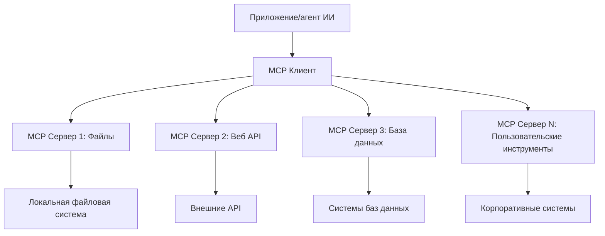

# 🌐 Модуль 2: Основы MCP с Microsoft Foundry Toolkit

[]()
[]()
[]()

## 📋 Цели обучения

К концу этого модуля вы сможете:
- ✅ Понять архитектуру и преимущества Model Context Protocol (MCP)
- ✅ Ознакомиться с экосистемой MCP-серверов Microsoft
- ✅ Интегрировать MCP-серверы с Microsoft Foundry Toolkit Agent Builder
- ✅ Создать функционального агента для автоматизации браузера с использованием Playwright MCP
- ✅ Настроить и протестировать инструменты MCP в ваших агентах
- ✅ Экспортировать и развертывать агентов с поддержкой MCP для использования в продакшене

## 🎯 Развитие знаний из Модуля 1

В Модуле 1 мы освоили основы Microsoft Foundry Toolkit и создали нашего первого агента на Python. Теперь мы **ускорим** ваших агентов, подключив их к внешним инструментам и сервисам через революционный **Model Context Protocol (MCP)**.

Подумайте об этом как об обновлении от простого калькулятора до полноценного компьютера — ваши AI-агенты получат возможность:
- 🌐 Просматривать и взаимодействовать с веб-сайтами
- 📁 Доступ к файлам и их обработка
- 🔧 Интеграция с корпоративными системами
- 📊 Обработка данных в реальном времени через API

## 🧠 Понимание Model Context Protocol (MCP)

### 🔍 Что такое MCP?

Model Context Protocol (MCP) — это **«USB-C для AI-приложений»** — революционный открытый стандарт, который соединяет большие языковые модели (LLM) с внешними инструментами, источниками данных и сервисами. Так же как USB-C избавил от путаницы с кабелями, обеспечив один универсальный коннектор, MCP устраняет сложность интеграции AI с помощью одного стандартизированного протокола.

### 🎯 Проблема, которую решает MCP

**До MCP:**
- 🔧 Индивидуальная интеграция для каждого инструмента  
- 🔄 Привязка к конкретным поставщикам с проприетарными решениями  
- 🔒 Уязвимости безопасности из-за случайных подключений  
- ⏱️ Месяцы разработки для базовых интеграций

**С MCP:**
- ⚡ Интеграция инструментов по принципу Plug-and-Play  
- 🔄 Независимая от вендоров архитектура  
- 🛡️ Встроенные лучшие практики безопасности  
- 🚀 Несколько минут на добавление новых возможностей

### 🏗️ Глубокое погружение в архитектуру MCP

MCP использует **клиент-серверную архитектуру**, которая создает безопасную и масштабируемую экосистему:



**🔧 Основные компоненты:**

| Компонент | Роль | Примеры |
|-----------|------|----------|
| **MCP Hosts** | Приложения, использующие MCP-сервисы | Claude Desktop, VS Code, Microsoft Foundry Toolkit |
| **MCP Clients** | Обработчики протокола (1:1 с серверами) | Встроены в хост-приложения |
| **MCP Servers** | Предоставляют возможности через стандартный протокол | Playwright, Files, Azure, GitHub |
| **Транспортный слой** | Методы коммуникации | stdio, HTTP, WebSockets |


## 🏢 Экосистема MCP-серверов Microsoft

Microsoft лидирует в экосистеме MCP, предлагая комплексный набор серверов корпоративного уровня, решающих реальные бизнес-задачи.

### 🌟 Основные MCP-сервера Microsoft

#### 1. ☁️ Azure MCP Server
**🔗 Репозиторий**: [azure/azure-mcp](https://github.com/azure/azure-mcp)
**🎯 Назначение**: Полное управление ресурсами Azure с интеграцией AI

**✨ Ключевые особенности:**
- Декларативное развертывание инфраструктуры
- Мониторинг ресурсов в реальном времени
- Рекомендации по оптимизации затрат
- Проверка соответствия безопасности

**🚀 Сценарии использования:**
- Инфраструктура как код с AI-поддержкой
- Автоматическое масштабирование ресурсов
- Оптимизация расходов на облако
- Автоматизация процессов DevOps

#### 2. 📊 Microsoft Dataverse MCP
**📚 Документация**: [Microsoft Dataverse Integration](https://go.microsoft.com/fwlink/?linkid=2320176)
**🎯 Назначение**: Интерфейс на естественном языке для бизнес-данных

**✨ Ключевые особенности:**
- Запросы к базе данных на естественном языке
- Понимание бизнес-контекста
- Кастомные шаблоны подсказок
- Управление корпоративными данными

**🚀 Сценарии использования:**
- Отчеты бизнес-аналитики
- Анализ данных клиентов
- Инсайты в воронку продаж
- Запросы для проверки соответствия

#### 3. 🌐 Playwright MCP Server
**🔗 Репозиторий**: [microsoft/playwright-mcp](https://github.com/microsoft/playwright-mcp)
**🎯 Назначение**: Автоматизация браузера и взаимодействие с веб-сайтами

**✨ Ключевые особенности:**
- Кросс-браузерная автоматизация (Chrome, Firefox, Safari)
- Интеллектуальное обнаружение элементов
- Снимки экрана и генерация PDF
- Мониторинг сетевого трафика

**🚀 Сценарии использования:**
- Автоматизация тестирования
- Веб-скрейпинг и извлечение данных
- Мониторинг UI/UX
- Автоматизация конкурентного анализа

#### 4. 📁 Files MCP Server
**🔗 Репозиторий**: [microsoft/files-mcp-server](https://github.com/microsoft/files-mcp-server)
**🎯 Назначение**: Интеллектуальные операции с файловой системой

**✨ Ключевые особенности:**
- Декларативное управление файлами
- Синхронизация содержимого
- Интеграция с системами контроля версий
- Извлечение метаданных

**🚀 Сценарии использования:**
- Управление документацией
- Организация кодовых репозиториев
- Рабочие процессы публикации контента
- Обработка файлов в конвейерах данных

#### 5. 📝 MarkItDown MCP Server
**🔗 Репозиторий**: [microsoft/markitdown](https://github.com/microsoft/markitdown)
**🎯 Назначение**: Продвинутая обработка и манипуляции Markdown

**✨ Ключевые особенности:**
- Полноценный парсинг Markdown
- Конвертация форматов (MD ↔ HTML ↔ PDF)
- Анализ структуры контента
- Обработка шаблонов

**🚀 Сценарии использования:**
- Рабочие процессы технической документации
- Системы управления контентом
- Генерация отчетов
- Автоматизация базы знаний

#### 6. 📈 Clarity MCP Server
**📦 Пакет**: [@microsoft/clarity-mcp-server](https://www.npmjs.com/package/@microsoft/clarity-mcp-server)
**🎯 Назначение**: Веб-аналитика и изучение поведения пользователей

**✨ Ключевые особенности:**
- Анализ тепловых карт
- Записи сессий пользователей
- Метрики производительности
- Анализ конверсий воронки продаж

**🚀 Сценарии использования:**
- Оптимизация сайта
- Исследование пользовательского опыта
- Анализ A/B тестов
- Дашборды бизнес-аналитики

### 🌍 Сообщество и дополнительные возможности

Помимо серверов Microsoft, экосистема MCP включает:
- **🐙 GitHub MCP**: Управление репозиториями и анализ кода
- **🗄️ MCP для баз данных**: Интеграции с PostgreSQL, MySQL, MongoDB
- **☁️ MCP для облачных провайдеров**: Инструменты AWS, GCP, Digital Ocean
- **📧 MCP для коммуникаций**: Интеграции Slack, Teams, Email

## 🛠️ Практическая лаборатория: Создание агента для автоматизации браузера

**🎯 Цель проекта**: Создать интеллектуального агента автоматизации браузера с использованием Playwright MCP сервера, который сможет навигировать по сайтам, извлекать информацию и выполнять сложные веб-взаимодействия.

### 🚀 Фаза 1: Настройка основы агента

#### Шаг 1: Инициализация вашего агента
1. **Откройте Microsoft Foundry Toolkit Agent Builder**
2. **Создайте нового агента** с такой конфигурацией:
   - **Имя**: `BrowserAgent`
   - **Модель**: Выберите GPT-4o 


### 🔧 Фаза 2: Рабочий процесс интеграции MCP

#### Шаг 3: Добавление интеграции MCP-сервера
1. **Перейдите в раздел Инструменты** в Agent Builder
2. **Нажмите «Добавить инструмент»**, чтобы открыть меню интеграций
3. **Выберите «MCP Server»** из доступных опций


**🔍 Понимание типов инструментов:**
- **Встроенные инструменты**: Преднастроенные функции Microsoft Foundry Toolkit  
- **MCP-серверы**: Интеграции с внешними сервисами  
- **Пользовательские API**: Ваши сервисные эндпоинты  
- **Вызов функций**: Прямой доступ к функциям модели

#### Шаг 4: Выбор MCP-сервера
1. **Выберите опцию «MCP Server»** для продолжения


2. **Просмотрите каталог MCP**, чтобы исследовать доступные интеграции


### 🎮 Фаза 3: Настройка Playwright MCP

#### Шаг 5: Выбор и настройка Playwright
1. **Нажмите «Использовать рекомендованные MCP Server»**, чтобы получить доступ к проверенным серверам Microsoft
2. **Выберите "Playwright"** из списка
3. **Примите стандартный MCP ID** или настройте под вашу среду


#### Шаг 6: Включение возможностей Playwright
**🔑 Критический шаг**: Выберите **ВСЕ** доступные методы Playwright для максимального функционала


**🛠️ Важные инструменты Playwright:**
- **Навигация**: `goto`, `goBack`, `goForward`, `reload`
- **Взаимодействие**: `click`, `fill`, `press`, `hover`, `drag`
- **Извлечение**: `textContent`, `innerHTML`, `getAttribute`
- **Проверка**: `isVisible`, `isEnabled`, `waitForSelector`
- **Захват**: `screenshot`, `pdf`, `video`
- **Сеть**: `setExtraHTTPHeaders`, `route`, `waitForResponse`

#### Шаг 7: Проверка успешности интеграции
**✅ Индикаторы успеха:**
- Все инструменты отображаются в интерфейсе Agent Builder  
- Нет сообщений об ошибках в панели интеграции  
- Статус сервера Playwright показывает «Connected»


**🔧 Решение распространенных проблем:**
- **Ошибка подключения**: Проверьте интернет-соединение и настройки брандмауэра  
- **Отсутствие инструментов**: Убедитесь, что все возможности были выбраны при настройке  
- **Ошибки разрешений**: Проверьте, что VS Code имеет необходимые системные права

### 🎯 Фаза 4: Продвинутая разработка подсказок

#### Шаг 8: Проектирование интеллектуальных системных подсказок
Создайте сложные подсказки, которые используют все возможности Playwright:

```markdown
# Web Automation Expert System Prompt

## Core Identity
You are an advanced web automation specialist with deep expertise in browser automation, web scraping, and user experience analysis. You have access to Playwright tools for comprehensive browser control.

## Capabilities & Approach
### Navigation Strategy
- Always start with screenshots to understand page layout
- Use semantic selectors (text content, labels) when possible
- Implement wait strategies for dynamic content
- Handle single-page applications (SPAs) effectively

### Error Handling
- Retry failed operations with exponential backoff
- Provide clear error descriptions and solutions
- Suggest alternative approaches when primary methods fail
- Always capture diagnostic screenshots on errors

### Data Extraction
- Extract structured data in JSON format when possible
- Provide confidence scores for extracted information
- Validate data completeness and accuracy
- Handle pagination and infinite scroll scenarios

### Reporting
- Include step-by-step execution logs
- Provide before/after screenshots for verification
- Suggest optimizations and alternative approaches
- Document any limitations or edge cases encountered

## Ethical Guidelines
- Respect robots.txt and rate limiting
- Avoid overloading target servers
- Only extract publicly available information
- Follow website terms of service
```

#### Шаг 9: Создание динамических пользовательских подсказок
Сформируйте подсказки, демонстрирующие разные возможности:

**🌐 Пример веб-анализа:**
```markdown
Navigate to github.com/kinfey and provide a comprehensive analysis including:
1. Repository structure and organization
2. Recent activity and contribution patterns  
3. Documentation quality assessment
4. Technology stack identification
5. Community engagement metrics
6. Notable projects and their purposes

Include screenshots at key steps and provide actionable insights.
```


### 🚀 Фаза 5: Запуск и тестирование

#### Шаг 10: Запустите первую автоматизацию
1. **Нажмите «Запустить»** для старта последовательности автоматизации
2. **Отслеживайте выполнение в реальном времени**:
   - Открывается Chrome браузер автоматически
   - Агент переходит на целевой сайт
   - Скриншоты фиксируют каждый ключевой шаг
   - Результаты анализа выводятся в реальном времени


#### Шаг 11: Анализ результатов и выводы
Оцените детальный анализ в интерфейсе Agent Builder:


### 🌟 Фаза 6: Расширенные возможности и развертывание

#### Шаг 12: Экспорт и развертывание в продакшене
Agent Builder поддерживает несколько вариантов развертывания:


## 🎓 Итоги Модуля 2 и дальнейшие шаги

### 🏆 Достижение: Мастер интеграции MCP

**✅ Освоенные навыки:**
- [ ] Понимание архитектуры и преимуществ MCP  
- [ ] Навигация по экосистеме MCP-серверов Microsoft  
- [ ] Интеграция Playwright MCP с Microsoft Foundry Toolkit  
- [ ] Создание сложных агентов автоматизации браузера  
- [ ] Продвинутая разработка подсказок для веб-автоматизации

### 📚 Дополнительные ресурсы

- **🔗 Спецификация MCP**: [Официальная документация протокола](https://modelcontextprotocol.io/)
- **🛠️ Playwright API**: [Полный справочник методов](https://playwright.dev/docs/api/class-playwright)
- **🏢 MCP-серверы Microsoft**: [Руководство по корпоративной интеграции](https://github.com/microsoft/mcp-servers)
- **🌍 Примеры сообщества**: [Галерея MCP-серверов](https://github.com/modelcontextprotocol/servers)

**🎉 Поздравляем!** Вы успешно освоили интеграцию MCP и теперь можете создавать готовых к продакшену AI-агентов с возможностью работы с внешними инструментами!


### 🔜 Продолжение к следующему модулю

Готовы развить навыки работы с MCP? Перейдите к **[Модулю 3: Продвинутая разработка MCP с Microsoft Foundry Toolkit](../lab3/README.md)**, где вы научитесь:
- Создавать собственные кастомные MCP-серверы  
- Настраивать и использовать последний MCP SDK для Python  
- Настраивать MCP Inspector для отладки  
- Осваивать продвинутые рабочие процессы разработки MCP-серверов  
- Создавать MCP-сервер погоды с нуля

---

<!-- CO-OP TRANSLATOR DISCLAIMER START -->
**Отказ от ответственности**:
Этот документ был переведен с использованием сервиса машинного перевода [Co-op Translator](https://github.com/Azure/co-op-translator). Несмотря на наши усилия по обеспечению точности, имейте в виду, что автоматический перевод может содержать ошибки или неточности. Оригинальный документ на его исходном языке следует считать авторитетным источником. Для получения критически важной информации рекомендуется обратиться к профессиональному человеческому переводу. Мы не несем ответственности за любые недоразумения или неправильные толкования, возникшие в результате использования этого перевода.
<!-- CO-OP TRANSLATOR DISCLAIMER END -->