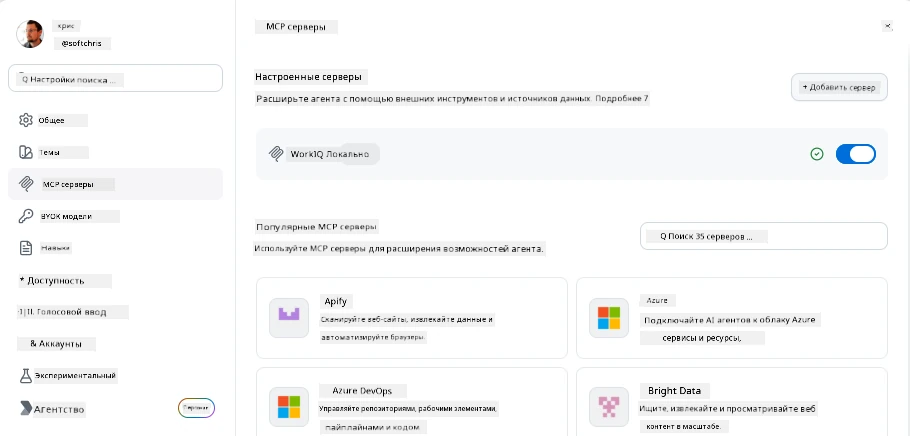
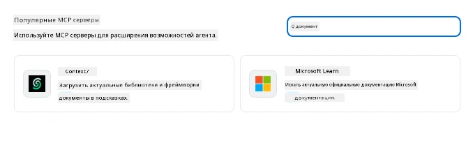
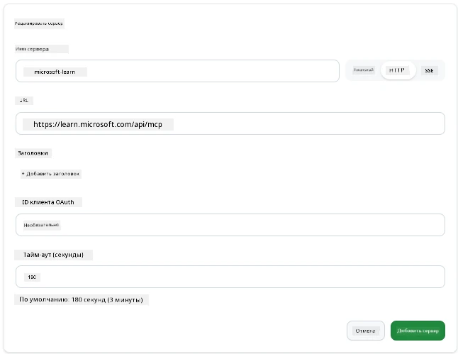
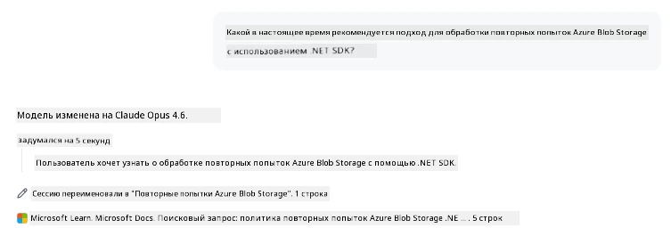
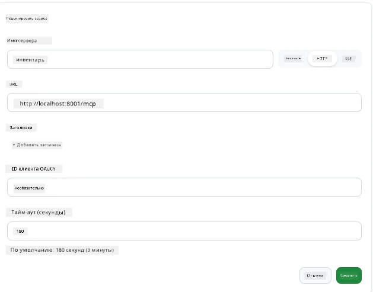
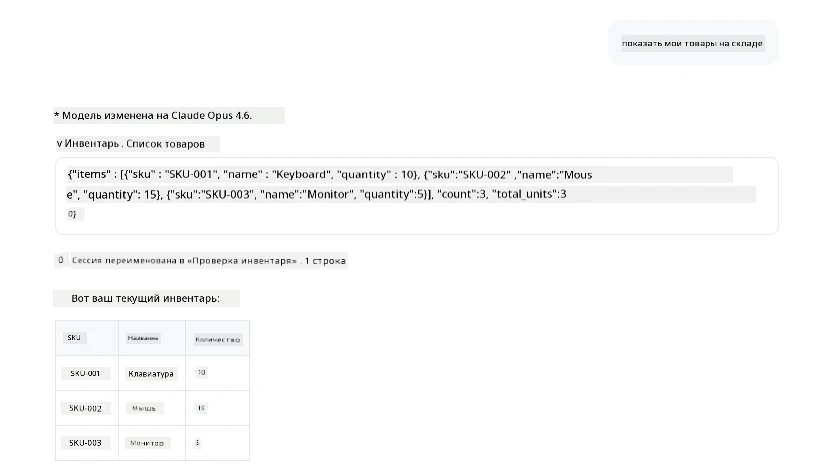
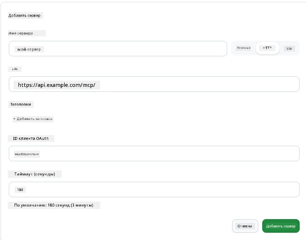
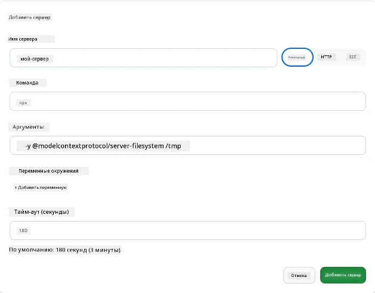

# Использование MCP-серверов в приложении GitHub Copilot

К настоящему моменту вы знаете, как работает MCP. Вы создали серверы, определили инструменты и ресурсы, и подключили клиентов. То, чего мы еще не делали, — поменять перспективу: вместо того, чтобы вы строили сервер, как выглядит процесс с *потребительской* стороны — как пользователь AI-приложения с поддержкой MCP?

[GitHub Copilot App](https://github.com/github/app) — это настольное приложение, которое может использовать MCP-серверы. Подключив к нему MCP-серверы, вы открываете новый уровень: Copilot теперь может обращаться к вашей документации, вызывать внутренние API, запрашивать базу данных или подключаться к любому сервису, который вы обернули в сервер. Приложение становится хостом; ваши MCP-серверы — его инструментами.

В этом уроке вы пройдёте через этот опыт от начала до конца — от нахождения панели настроек MCP до подключения реального сервера документации и затем настройки собственного сервера.

## Цели обучения

К концу этого урока вы сможете:

- Найти и ориентироваться в панели MCP Servers в настройках приложения Copilot.
- Подключить размещённый сервер документации и использовать его в сессии.
- Зарегистрировать собственный сервер и проверить, что Copilot может вызывать его инструменты.
- Настроить вызовы сервера, предоставив либо переменные окружения, либо пользовательские заголовки (если HTTP).

## Приложение Copilot как MCP-хост

Вот основная идея: **агенты Copilot умные, но они знают только то, что вы им скажете.** По умолчанию агент может читать файлы в вашем рабочем пространстве и выполнять команды терминала, но он не может запрашивать вашу базу данных, смотреть ваш календарь или вызывать нестандартный API без помощи. Вот тут и приходят на помощь MCP-серверы. Они действуют как мост между Copilot и вашими системами — базами данных, системами контроля версий, API, инструментами дизайна — предоставляя агентам доступ к нужной информации и действиям для выполнения работы.

Начнём с того, что найдём настройки для управления MCP-серверами в вашем приложении.

## Шаг 1: Поиск панели настроек MCP

Откройте приложение Copilot и найдите значок шестерёнки в левом нижнем углу, нажмите на него.


Убедитесь, что выбран пункт «MCP Servers», и вы увидите сверху уже настроенные серверы, внизу — маркетплейс популярных серверов, а сверху кнопку «Add Server», примерно как здесь:



Это ваш центр управления. Здесь вы добавляете, удаляете, включаете и отключаете серверы. Изменения вступают в силу для новых сессий; если у вас открыта сессия, после изменений нужно будет начать новую.

## Шаг 2: Подключение сервера документации

Давайте сделаем нечто полезное сразу. MCP-сервер Microsoft Docs даёт Copilot доступ к официальной документации Microsoft. Это включает Azure, .NET, TypeScript и многое другое. Вместо того, чтобы агент опирался на данные обучения (у которых есть ограничение по дате), он может получать актуальную документацию при запросе.

Как добавить сервер:

1. В сетке популярных серверов введите **learn** и выберите сервер с названием «Microsoft Learn».

   

   После клика появится форма с заполненными именем, типом транспорта и URL — вам остаётся нажать «Add Server».

2. Нажмите «Add Server», подключение к серверу займёт несколько секунд.

   

   После добавления он появится в верхней области как настроенный сервер. Давайте опробуем его далее.

3. Закройте диалог и выберите «Quick chat».

4. Введите следующий запрос, чтобы вызвать инструмент на сервере Microsoft Learn.

   ```text
   What's the current recommended approach for handling Azure Blob Storage 
   retries using the .NET SDK?
   ```

   

Вы увидите, что он ссылается на только что добавленный MCP-сервер.

## Шаг 3: Подключение собственного stdio-сервера

Пресеты удобны, но настоящая сила — в подключении ваших собственных серверов. Допустим, вы создали сервер (или получили его), который открывает ваш внутренний API или базу знаний компании. В этом примере мы используем MCP-сервер, который мы создали для управления складом нашей компании.

1. Снова нажмите на шестерёнку и выберите «MCP servers».

2. Нажмите «Add Server», затем «+ Add Custom server» и укажите следующие значения:

   - Имя: `Inventory Server`
   - Выберите транспорт (справа), **http**

   Нажмите «Add Server», и он появится в списке настроенных серверов.

   

4. Чтобы проверить работу, выполните такой запрос:

    ```
    list inventory
    ```

   

   Вы должны увидеть список позиций инвентаря, возвращаемых вашим собственным сервером.

Отлично, теперь вы хорошо понимаете, как добавлять внешние и собственные MCP-серверы в приложение Copilot. Далее поговорим о работе с секретами и переменными окружения.

## Шаг 4: Расширенные настройки

До сих пор вы видели, как добавлять MCP-серверы, указывая имя и URL. А что если серверу нужен API-ключ или другие параметры? В зависимости от типа транспорта мы можем передать нужные значения.

- **HTTP или SSE-транспорт**: Здесь можно установить заголовки по необходимости.

   Для авторизации можно указать заголовок Authorization, например. Значение может быть статической строкой. Если вы используете OAuth, можно вместо этого передать OAuth client ID.

   

- **stdio-транспорт**: Можно задать переменные окружения.

   Здесь вы указываете любое количество переменных окружения, которые должны передаваться серверу при запуске.

   

## Итог

Приложение Copilot рассматривает MCP-серверы как полноценные расширения возможностей агента. Вы прошли полный путь от добавления MCP-серверов до их использования в сессии. Теперь вы можете подключаться к публичным серверам, внутренним API и собственным инструментам, давая агентам возможность получать доступ к информации и выполнять действия автономно.

## 📚 Дополнительные ресурсы

### Официальная документация

- [GitHub Copilot App](https://github.com/github/app)
- [Спецификация MCP](https://modelcontextprotocol.io/specification/2025-03-26) — спецификация Model Context Protocol

### Сообщество
- [MCP Community Discord](https://discord.com/invite/ByRwuEEgH4) — живые обсуждения
- [GitHub Discussions](https://github.com/microsoft/MCP-Server-and-PostgreSQL-Sample-Retail/discussions) — вопросы и ответы, обмен опытом
- [Stack Overflow](https://stackoverflow.com/questions/tagged/model-context-protocol) — технические вопросы

---

<!-- CO-OP TRANSLATOR DISCLAIMER START -->
**Отказ от ответственности**:
Этот документ был переведен с использованием сервиса машинного перевода [Co-op Translator](https://github.com/Azure/co-op-translator). Несмотря на наши усилия по обеспечению точности, имейте в виду, что автоматический перевод может содержать ошибки или неточности. Оригинальный документ на его исходном языке следует считать авторитетным источником. Для получения критически важной информации рекомендуется обратиться к профессиональному человеческому переводу. Мы не несем ответственности за любые недоразумения или неправильные толкования, возникшие в результате использования этого перевода.
<!-- CO-OP TRANSLATOR DISCLAIMER END -->